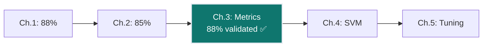
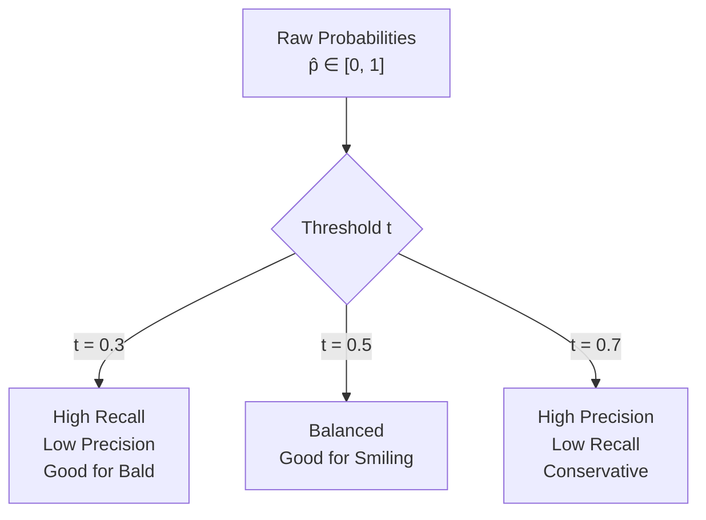
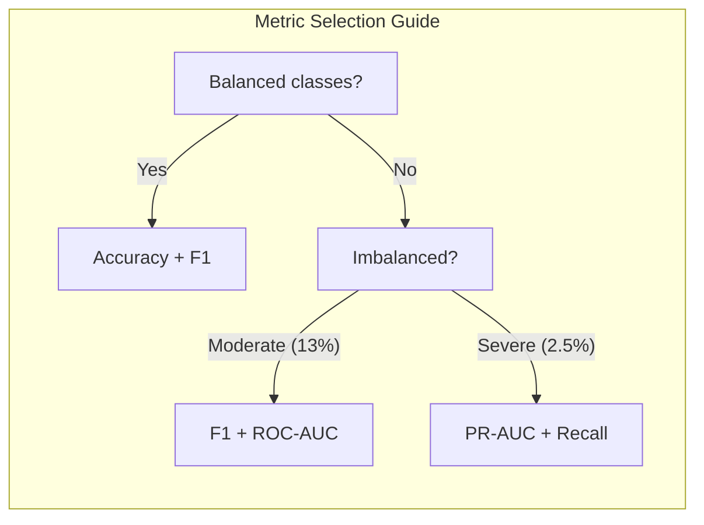
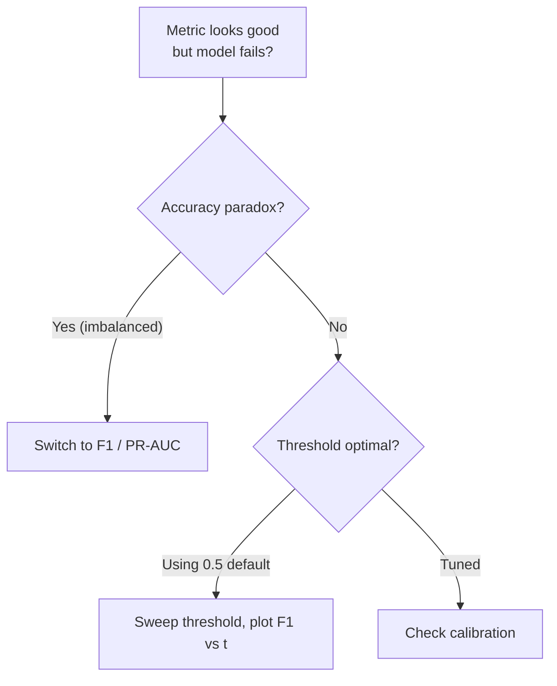
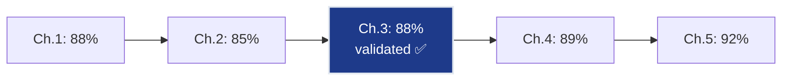

# Ch.3 — Evaluation Metrics for Classification

> **The story.** The confusion matrix dates back to **Karl Pearson (1904)**, but modern classification metrics crystallised in the **information retrieval** community of the 1960s–70s. **Cyril Cleverdon's Cranfield experiments (1960)** introduced precision and recall for document retrieval. **Tom Fawcett (2006)** wrote the definitive tutorial on ROC curves. **Jesse Davis and Mark Goadrich (2006)** showed why PR curves are better than ROC for imbalanced data — exactly the problem FaceAI faces with Bald (2.5%) and Mustache (4.2%).
>
> **Where you are.** Ch.1–2 gave FaceAI two classifiers (LogReg ~88%, Tree ~82%) evaluated by accuracy alone. But accuracy is a **liar** for imbalanced classes. This chapter builds the evaluation toolkit: confusion matrices, precision/recall, F1, ROC-AUC, PR-AUC, and multi-label metrics (Hamming loss, subset accuracy). After this chapter, every model gets a proper report card.
>
> **Notation.** $TP$ — true positives; $FP$ — false positives; $TN$ — true negatives; $FN$ — false negatives; $P = \frac{TP}{TP+FP}$ — precision; $R = \frac{TP}{TP+FN}$ — recall; $F_1 = \frac{2PR}{P+R}$ — harmonic mean; $\text{TPR} = R$ — true positive rate; $\text{FPR} = \frac{FP}{FP+TN}$ — false positive rate.

---

## §0 · The Challenge — Where We Are

> 🎯 **FaceAI Mission**: >90% accuracy across 40 facial attributes
>
> | # | Constraint | Ch.1–2 Status | This Chapter |
> |---|-----------|---------------|-------------|
> | 1 | ACCURACY | 88% (Smiling) | Validate properly |
> | 2 | GENERALIZATION | Train/test split | Cross-validation |
> | 3 | MULTI-LABEL | Binary only | Multi-label metrics preview |
> | 4 | INTERPRETABILITY | Tree rules | Which attributes fail? |
> | 5 | PRODUCTION | ✅ | Not this chapter |

**What's blocking us:**
We've been reporting **accuracy** — but what does 88% mean for FaceAI's 40 attributes? Consider:
- **Smiling** (48% positive): accuracy works — balanced class
- **Bald** (2.5% positive): a model saying "Not Bald" for everyone gets 97.5% "accuracy"!
- **Mustache** (4.2%): same problem — accuracy is meaningless

**What this chapter unlocks:**
- **Confusion matrix**: See exactly where the model fails
- **Precision/Recall/F1**: Proper evaluation for imbalanced classes
- **ROC-AUC & PR-AUC**: Threshold-independent evaluation
- **Multi-label metrics**: How to evaluate 40 attributes simultaneously
- ✅ **Constraint #1 VALIDATED** — Now we know if 88% is actually good



---

## Animation


## §1 · Core Idea

Classification evaluation is about **correctness of discrete decisions**, not magnitude of errors. The four outcomes (TP, FP, TN, FN) form the confusion matrix — every metric is a ratio of these counts. The critical insight: **threshold tuning** is a first-class concern. Changing the decision threshold from 0.5 to 0.3 trades precision for recall. ROC and PR curves show this trade-off across all thresholds.

---

## §2 · Running Example

**FaceAI evaluation suite** across three attributes with different class balances:

| Attribute | Positive Rate | Challenge |
|-----------|--------------|-----------|
| **Smiling** | 48% | Balanced — accuracy is fine |
| **Eyeglasses** | 13% | Moderate imbalance |
| **Bald** | 2.5% | Severe imbalance — accuracy paradox |

We'll evaluate the Ch.1 logistic regression model on all three to show why metrics matter.

---

## §3 · Math

### Confusion Matrix Counts

$$\text{Accuracy} = \frac{TP + TN}{TP + FP + TN + FN}$$

$$\text{Precision} = \frac{TP}{TP + FP} \quad \text{(of predicted positives, how many correct?)}$$

$$\text{Recall} = \frac{TP}{TP + FN} \quad \text{(of actual positives, how many found?)}$$

$$F_1 = \frac{2 \cdot P \cdot R}{P + R} = \frac{2 \cdot TP}{2 \cdot TP + FP + FN}$$

### Numeric Example — Bald (2.5% positive)

Test set: 750 faces, 19 Bald, 731 Not-Bald.

**Model A** (always predicts Not-Bald):
- $TP=0, FP=0, TN=731, FN=19$
- Accuracy $= 731/750 = 97.5\%$ 🎉 (but useless!)
- Recall $= 0/19 = 0\%$ 💀
- F1 $= 0$

**Model B** (logistic regression with threshold 0.3):
- $TP=12, FP=15, TN=716, FN=7$
- Accuracy $= 728/750 = 97.1\%$ (slightly lower)
- Recall $= 12/19 = 63.2\%$ (found most bald faces!)
- Precision $= 12/27 = 44.4\%$
- F1 $= 2(0.444)(0.632)/(0.444+0.632) = 0.522$

Model B is **far better** despite lower accuracy.

### ROC-AUC

$$\text{AUC} = \int_0^1 \text{TPR}(t) \, d(\text{FPR}(t))$$

AUC = 0.5 means random, AUC = 1.0 means perfect. A logistic regression for Smiling typically achieves AUC ≈ 0.94.

### Multi-Label Metrics (40 Attributes)

$$\text{Hamming Loss} = \frac{1}{N \cdot L}\sum_{i=1}^{N}\sum_{l=1}^{L} \mathbb{1}[\hat{y}_{il} \neq y_{il}]$$

$$\text{Subset Accuracy} = \frac{1}{N}\sum_{i=1}^{N} \mathbb{1}[\hat{\mathbf{y}}_i = \mathbf{y}_i]$$

Hamming loss measures per-label error rate (forgiving). Subset accuracy requires **all 40 correct** (strict — typically very low).

---

## §4 · Step by Step

```
ALGORITHM: Comprehensive Evaluation Pipeline
─────────────────────────────────────────────
Input:  y_true, y_prob (predicted probabilities), threshold=0.5

1. Apply threshold: y_pred = (y_prob >= threshold).astype(int)
2. Compute confusion matrix: TP, FP, TN, FN
3. Calculate: precision, recall, F1, accuracy
4. For threshold sweep (ROC curve):
   a. For t in [0.0, 0.01, ..., 1.0]:
      - Compute TPR(t) and FPR(t)
   b. Plot TPR vs FPR → ROC curve
   c. AUC = area under ROC
5. For PR curve:
   a. For t in [0.0, 0.01, ..., 1.0]:
      - Compute Precision(t) and Recall(t)
   b. Plot Precision vs Recall → PR curve
6. For multi-label (40 attributes):
   a. Compute per-attribute: AUC_l for l = 1..40
   b. Macro-AUC = mean(AUC_l)
   c. Hamming loss = fraction of wrong labels
```

---

## §5 · Key Diagrams





---

## §6 · Hyperparameter Dial

| Parameter | Too Low | Sweet Spot | Too High |
|-----------|---------|------------|----------|
| **Decision threshold** | t=0.1: everything positive (recall=100%, precision=2.5% for Bald) | Depends on class: 0.5 for balanced, 0.15–0.3 for rare | t=0.9: misses most positives |
| **CV folds** | k=2: high variance estimates | k=5–10 | k=N (LOO): expensive, low bias |
| **Averaging** (multi-class) | micro (dominated by majority class) | macro for equal class weight | weighted for proportional |

---

## §7 · Code Skeleton

```python
from sklearn.metrics import (classification_report, confusion_matrix,
    roc_auc_score, roc_curve, precision_recall_curve, f1_score)
from sklearn.model_selection import cross_val_score
import matplotlib.pyplot as plt

# ── Confusion Matrix ───────────────────────────────────
cm = confusion_matrix(y_test, y_pred)
# [[TN, FP], [FN, TP]]

# ── Classification Report ─────────────────────────────
print(classification_report(y_test, y_pred, target_names=["Not Smiling", "Smiling"]))

# ── ROC Curve ──────────────────────────────────────────
fpr, tpr, thresholds = roc_curve(y_test, y_prob)
auc = roc_auc_score(y_test, y_prob)
plt.plot(fpr, tpr, label=f"AUC={auc:.3f}")

# ── PR Curve (better for imbalanced) ──────────────────
precision, recall, thresholds = precision_recall_curve(y_test, y_prob)
plt.plot(recall, precision)

# ── Multi-label: per-attribute AUC ────────────────────
for attr in ['Smiling', 'Bald', 'Eyeglasses']:
    auc = roc_auc_score(y_test[attr], y_prob[attr])
    print(f"{attr}: AUC={auc:.3f}")
```

---

## §8 · What Can Go Wrong

| Mistake | Symptom | Fix |
|---------|---------|-----|
| Reporting accuracy on imbalanced data | 97.5% on Bald (but 0% recall) | Use F1, PR-AUC for rare classes |
| Fixed threshold 0.5 for all attributes | Poor recall on rare attributes | Tune threshold per-attribute |
| Using ROC-AUC for highly imbalanced | ROC looks good even when model fails | Use PR-AUC for Bald, Mustache |
| Not stratifying CV folds | Fold with 0 positives for rare class | `StratifiedKFold` always |
| Comparing models on different test sets | Unfair comparison | Same holdout or same CV splits |



---

## §9 · Where This Reappears

| Concept | Reappears in | How |
|---------|-------------|-----|
| **PR-AUC over ROC-AUC for imbalanced data** | [Topic 05 — Anomaly Detection](../../05-AnomalyDetection/README.md) | Credit card fraud (0.17% positive rate) requires PR-AUC — ROC looks deceptively good |
| **Macro-averaged F1** | [Ch.5 — Hyperparameter Tuning](../ch05-hyperparameter-tuning/) | FaceAI tuning uses `f1_macro` not accuracy to avoid the imbalance trap |
| **Hamming loss / multi-label metrics** | [Topic 03 — Neural Networks](../../03-NeuralNetworks/README.md) | Multi-output neural network evaluation uses Hamming loss and per-label AUC |
| **StratifiedKFold** | [Ch.5 — Hyperparameter Tuning](../ch05-hyperparameter-tuning/), every subsequent multi-class track | Required whenever class distribution is non-uniform |

---

## §10 · Progress Check

| # | Constraint | Target | Status | Evidence |
|---|-----------|--------|--------|----------|
| 1 | ACCURACY | >90% avg | 🟡 88% validated | Proper metrics confirm real performance |
| 2 | GENERALIZATION | Unseen faces | 🟢 | Cross-validation shows stable estimates |
| 3 | MULTI-LABEL | 40 attributes | 🟡 | Metrics defined (Hamming, subset acc) |
| 4 | INTERPRETABILITY | Feature importance | 🟢 | Per-attribute reports show where model fails |
| 5 | PRODUCTION | <200ms | ✅ | Not affected by evaluation |



---

## §11 · Bridge to Next Chapter

Now we can properly evaluate any classifier. The LogReg baseline holds at 88% on Smiling — but can we push higher? Linear models draw straight decision boundaries. What if the optimal boundary is curved?

**Ch.4** introduces **Support Vector Machines** — models that find the **maximum-margin hyperplane** and use the **kernel trick** to handle non-linear boundaries. SVM pushes Smiling accuracy to ~89% by finding a wider, more robust separation between classes.

---

## Appendix A · Real CelebA Data Pipeline (No Proxy Data)

The examples in this chapter are intended to run on real CelebA attributes. Use this setup to avoid synthetic placeholders.

### Data Access Options

1. Kaggle mirror: `jessicali9530/celeba-dataset`.
2. Official CelebA source: download aligned images + `list_attr_celeba.txt`.

### Minimal Setup Steps

1. Create folders:
   - `data/celeba/img_align_celeba/`
   - `data/celeba/metadata/`
2. Place attribute file at:
   - `data/celeba/metadata/list_attr_celeba.txt`
3. Keep image filenames unchanged (`000001.jpg`, ...).
4. Start with a 20k-50k image subset for local runs.

### Loader Contract

- Input image size: 64x64 (or 128x128 for stronger baselines).
- Labels: map CelebA values from `{-1, +1}` to `{0, 1}`.
- Split: use official train/val/test partitions to avoid leakage.
- Reproducibility: set random seed and persist sampled subset IDs.

### Practical Notes

- Multi-label tasks should keep one binary head per attribute.
- For rare attributes (Bald, Mustache, Wearing_Hat), prefer macro-F1 and per-label PR-AUC.
- Persist preprocessing artifacts (scaler/PCA/HOG settings) with the model.

### Quick Loader Snippet

```python
from pathlib import Path
import pandas as pd

attr_path = Path('data/celeba/metadata/list_attr_celeba.txt')
attr = pd.read_csv(attr_path, delim_whitespace=True, skiprows=1)
attr = (attr + 1) // 2   # {-1,+1} -> {0,1}

# Example target
y_smiling = attr['Smiling'].astype(int)
```


