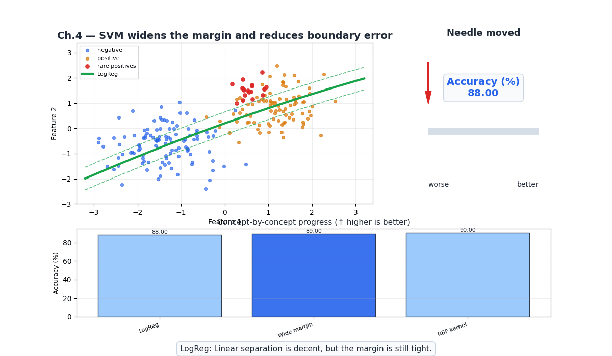
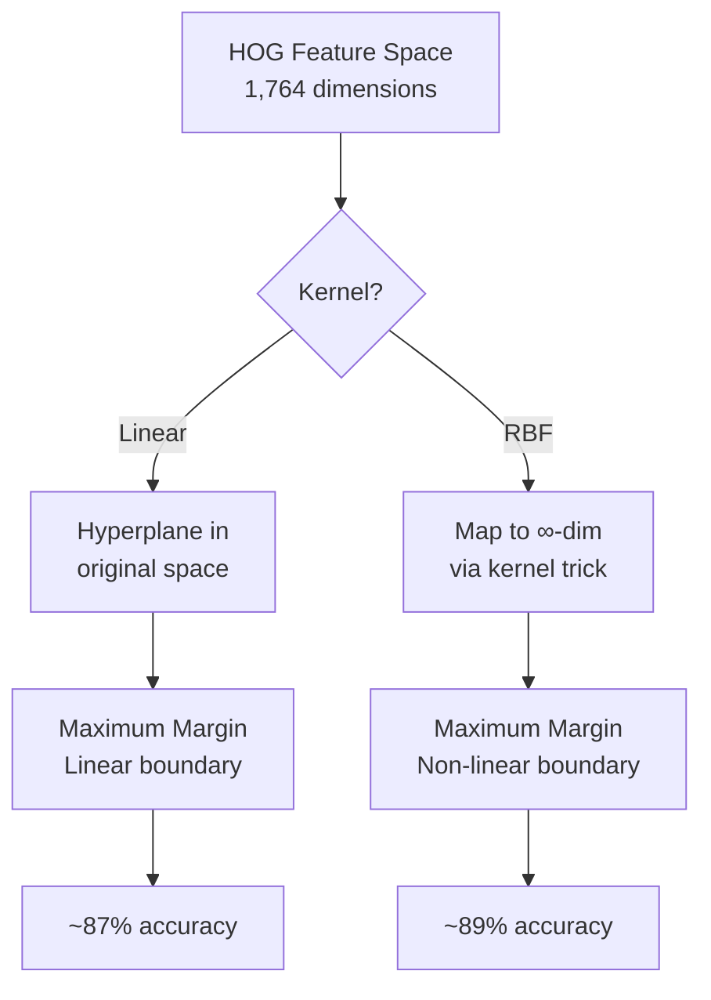
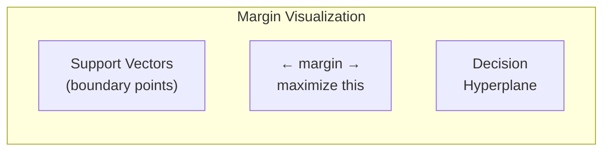
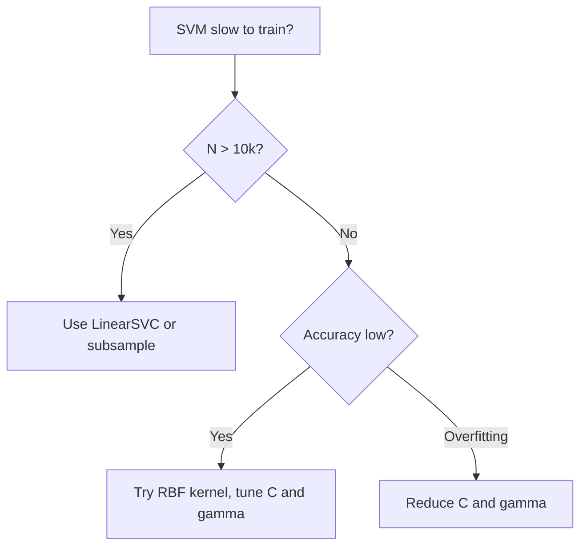

# Ch.4 — Support Vector Machines

> **The story.** **Vladimir Vapnik** and **Alexei Chervonenkis** developed the theoretical foundations of SVMs in the 1960s at the Institute of Control Sciences in Moscow, but the practical algorithm came in **Vapnik's 1995 book** *The Nature of Statistical Learning Theory*. The **kernel trick** — mapping data to higher dimensions without computing the transformation — was formalised by **Bernhard Boser, Isabelle Guyon, and Vapnik (1992)** at Bell Labs. The **soft margin** (allowing some misclassifications) was introduced by **Corinna Cortes and Vapnik (1995)**. SVMs dominated ML competitions from 1995–2010, until deep learning took over for image tasks.
>
> **Where you are.** Ch.1–3 gave FaceAI a logistic regression baseline (88%) with proper evaluation. But logistic regression finds *any* separating hyperplane — SVM finds the one with the **widest margin**, making it more robust. The kernel trick additionally lets SVM handle non-linear boundaries without explicit feature engineering.
>
> **Notation.** $\mathbf{w}$ — weight vector (normal to hyperplane); $b$ — bias; $\text{margin} = 2/\|\mathbf{w}\|$ — distance between decision boundary and nearest points; $C$ — regularization (penalty for margin violations); $K(\mathbf{x}, \mathbf{x}') = \exp(-\gamma\|\mathbf{x}-\mathbf{x}'\|^2)$ — RBF kernel; $\alpha_i$ — Lagrange multipliers (support vectors have $\alpha_i > 0$).

---

## 0 · The Challenge — Where We Are

> 💡 **FaceAI Mission**: >90% accuracy across 40 attributes
>
> | # | Constraint | Ch.1–3 Status | This Chapter |
> |---|-----------|---------------|-------------|
> | 1 | ACCURACY | 88% validated | Push to ~89% |
> | 2 | GENERALIZATION | Cross-validated | Margin maximization helps! |
> | 3 | MULTI-LABEL | Metrics defined | Binary still |
> | 4 | INTERPRETABILITY | Tree rules | Support vectors |
> | 5 | PRODUCTION | ✅ | SVM inference is fast |

**What's blocking us:**
Logistic regression finds *a* hyperplane. But infinitely many hyperplanes separate the classes. Which is best? The one that **maximises the margin** — the gap between the decision boundary and the closest training points. More margin → more robust to unseen data.

**What this chapter unlocks:**
- **Maximum-margin classifier**: Most robust linear boundary
- **Kernel trick**: Non-linear boundaries without explicit feature maps
- **Support vectors**: Only the boundary-defining points matter
- **Constraint #1 IMPROVED** — ~89% accuracy on Smiling


---

## Animation



## 1 · Core Idea

SVM finds the hyperplane $\mathbf{w} \cdot \mathbf{x} + b = 0$ that maximises the **margin** — the distance to the nearest training points on either side (the **support vectors**). For non-linearly separable data, the **kernel trick** maps features to a higher-dimensional space where a linear separator exists, without explicitly computing the transformation. The **soft margin** ($C$ parameter) allows some points inside the margin, trading off margin width against classification errors.

---

## 2 · Running Example

Same FaceAI setup: 5,000 CelebA images, HOG features, predicting **Smiling**. We compare:
1. **Linear SVM**: Direct hyperplane in HOG feature space
2. **RBF SVM**: Non-linear boundary via Gaussian kernel
3. **Logistic regression baseline** (Ch.1): for comparison

---

## 3 · Math

### Hard-Margin SVM (Separable Case)

$$\min_{\mathbf{w}, b} \frac{1}{2}\|\mathbf{w}\|^2 \quad \text{subject to} \quad y_i(\mathbf{w} \cdot \mathbf{x}_i + b) \geq 1 \;\; \forall i$$

Margin width $= 2/\|\mathbf{w}\|$. Minimising $\|\mathbf{w}\|^2$ maximises the margin.

### Soft-Margin SVM (Non-Separable)

$$\min_{\mathbf{w}, b, \xi} \frac{1}{2}\|\mathbf{w}\|^2 + C\sum_{i=1}^{N}\xi_i \quad \text{s.t.} \quad y_i(\mathbf{w} \cdot \mathbf{x}_i + b) \geq 1 - \xi_i, \;\; \xi_i \geq 0$$

$\xi_i$ = slack variables (how far a point violates the margin). $C$ controls trade-off: large $C$ = narrow margin, few violations; small $C$ = wide margin, more violations.

### Kernel Trick — RBF

$$K(\mathbf{x}, \mathbf{x}') = \exp\left(-\gamma \|\mathbf{x} - \mathbf{x}'\|^2\right)$$

**Numeric example**: Two HOG feature vectors with $\|\mathbf{x} - \mathbf{x}'\|^2 = 4.0$ and $\gamma = 0.5$:

$$K = \exp(-0.5 \times 4.0) = \exp(-2.0) = 0.135$$

Low similarity → these faces are far apart in feature space.

Same vectors with $\gamma = 0.01$: $K = \exp(-0.04) = 0.961$ — high similarity (smoother boundary).

### Decision Function

$$f(\mathbf{x}) = \sum_{i \in SV} \alpha_i y_i K(\mathbf{x}_i, \mathbf{x}) + b$$

Only **support vectors** (points on or inside the margin) contribute. Typically 10–30% of training data.

---

## 4 · Step by Step

```
ALGORITHM: SVM for Smiling Detection
─────────────────────────────────────
Input:  X_train (HOG features), y_train (Smiling)

1. Scale features: StandardScaler (critical for SVM!)
2. Choose kernel: 'linear' or 'rbf'
3. For RBF kernel:
   a. Set C (margin penalty) and γ (kernel width)
   b. Solve dual optimization:
      max_α Σᵢ αᵢ - ½ ΣᵢΣⱼ αᵢαⱼyᵢyⱼK(xᵢ,xⱼ)
      subject to: 0 ≤ αᵢ ≤ C, Σᵢ αᵢyᵢ = 0
4. Identify support vectors (αᵢ > 0)
5. Predict: sign(Σ_{SV} αᵢyᵢK(xᵢ,x) + b)
6. Evaluate: confusion matrix, ROC-AUC
```

---

## 5 · Key Diagrams



> ⚠️ **Note on linear SVM accuracy**: The ~87% for linear SVM falls *below* the logistic regression baseline (88%). This is expected — logistic regression optimises a smooth log-likelihood continuously while linear SVM maximises margin with a hinge loss, making subtly different trade-offs in the same HOG feature space. The **RBF kernel's ~89%** is what makes SVM worthwhile here: it learns a non-linear boundary that logistic regression cannot draw.



---

## 6 · Hyperparameter Dial

| Parameter | Too Low | Sweet Spot | Too High |
|-----------|---------|------------|----------|
| **C** | Wide margin, underfits (many misclassifications) | C ∈ [1, 100] for HOG features | Narrow margin, overfits |
| **gamma** (RBF) | Very smooth boundary (like linear) | gamma ∈ [0.001, 0.1] | Spiky boundary, overfits to individual faces |
| **kernel** | linear (may underfit) | RBF for image features | poly degree>5 (overfits) |
| **class_weight** | None (ignores imbalance) | 'balanced' for Bald/Mustache | Custom weights too extreme → noisy |

---

## 7 · Code Skeleton

```python
from sklearn.svm import SVC
from sklearn.preprocessing import StandardScaler
from sklearn.pipeline import make_pipeline
from sklearn.metrics import classification_report, roc_auc_score

# ── Linear SVM ─────────────────────────────────────────
linear_svm = make_pipeline(StandardScaler(), SVC(kernel='linear', C=1.0))
linear_svm.fit(X_train, y_train)
print(f"Linear SVM: {linear_svm.score(X_test, y_test):.3f}")

# ── RBF SVM ────────────────────────────────────────────
rbf_svm = make_pipeline(StandardScaler(), SVC(kernel='rbf', C=10, gamma=0.01,
                                               probability=True))
rbf_svm.fit(X_train, y_train)
y_prob = rbf_svm.predict_proba(X_test)[:, 1]
print(f"RBF SVM: {rbf_svm.score(X_test, y_test):.3f}")
print(f"AUC: {roc_auc_score(y_test, y_prob):.3f}")

# ── Support Vectors ────────────────────────────────────
svm_model = rbf_svm.named_steps['svc']
n_sv = svm_model.n_support_
print(f"Support vectors: {n_sv} ({sum(n_sv)/len(y_train)*100:.1f}% of training data)")
```

---

## 8 · What Can Go Wrong

| Mistake | Symptom | Fix |
|---------|---------|-----|
| Not scaling features | SVM doesn't converge or takes forever | `StandardScaler` always before SVM |
| gamma too high | 100% train accuracy, ~70% test | Reduce gamma (smoother boundary) |
| Using SVM on 100k+ samples | Training takes hours (O(n²) to O(n³)) | Subsample or use `LinearSVC` for large data |
| Ignoring class_weight for Bald | High accuracy but 0% recall on Bald | `class_weight='balanced'` |
| Expecting probability calibration | `predict_proba` needs Platt scaling (slow) | Set `probability=True` but know it adds overhead |



---

## 9 · Where This Reappears

| Concept | Reappears in | How |
|---------|-------------|-----|
| **Maximum-margin / support vectors** | [Topic 03 — Neural Networks](../../03-NeuralNetworks/README.md) | SVM's margin intuition parallels L2 regularisation's effect on neural network weight norms |
| **Kernel trick (non-linear feature map)** | [Topic 03 — Neural Networks](../../03-NeuralNetworks/README.md) | Neural networks learn implicit non-linear feature maps — the kernel idea generalised |
| **One-class SVM** | [Topic 05 — Anomaly Detection](../../05-AnomalyDetection/README.md) | SVM adapted to the anomaly detection setting: trained on normal data only, anomalies lie outside the margin |
| **`class_weight='balanced'`** | [Ch.5 — Hyperparameter Tuning](../ch05-hyperparameter-tuning/) | Combined with SVM and threshold tuning to handle rare attributes like Bald and Mustache |

---

## 10 · Progress Check

| # | Constraint | Target | Status | Evidence |
|---|-----------|--------|--------|----------|
| 1 | ACCURACY | >90% avg | 🟡 ~89% Smiling | RBF SVM beats LogReg by ~1% |
| 2 | GENERALIZATION | Unseen faces | 🟢 | Maximum margin improves robustness |
| 3 | MULTI-LABEL | 40 attributes | ❌ | Still binary |
| 4 | INTERPRETABILITY | Feature importance | 🟡 | Support vectors exist but hard to visualize |
| 5 | PRODUCTION | <200ms | ✅ | SVM inference fast (once trained) |


---

## 11 · Bridge to Next Chapter

SVM with RBF kernel pushes Smiling accuracy to ~89% — but we chose $C=10$ and $\gamma=0.01$ by intuition. Are these optimal? What about the decision threshold (0.5 by default)?

**Ch.5** introduces **systematic hyperparameter tuning**: Grid Search, Random Search, and Bayesian Optimization. We'll tune $C$, $\gamma$, and per-attribute thresholds to push past 90%. We'll also add `class_weight` tuning for imbalanced attributes like Bald and Mustache.

---

## Appendix A · Real CelebA Data Pipeline (No Proxy Data)

The examples in this chapter are intended to run on real CelebA attributes. Use this setup to avoid synthetic placeholders.

### Data Access Options

1. Kaggle mirror: `jessicali9530/celeba-dataset`.
2. Official CelebA source: download aligned images + `list_attr_celeba.txt`.

### Minimal Setup Steps

1. Create folders:
   - `data/celeba/img_align_celeba/`
   - `data/celeba/metadata/`
2. Place attribute file at:
   - `data/celeba/metadata/list_attr_celeba.txt`
3. Keep image filenames unchanged (`000001.jpg`, ...).
4. Start with a 20k-50k image subset for local runs.

### Loader Contract

- Input image size: 64x64 (or 128x128 for stronger baselines).
- Labels: map CelebA values from `{-1, +1}` to `{0, 1}`.
- Split: use official train/val/test partitions to avoid leakage.
- Reproducibility: set random seed and persist sampled subset IDs.

### Practical Notes

- Multi-label tasks should keep one binary head per attribute.
- For rare attributes (Bald, Mustache, Wearing_Hat), prefer macro-F1 and per-label PR-AUC.
- Persist preprocessing artifacts (scaler/PCA/HOG settings) with the model.

### Quick Loader Snippet

```python
from pathlib import Path
import pandas as pd

attr_path = Path('data/celeba/metadata/list_attr_celeba.txt')
attr = pd.read_csv(attr_path, delim_whitespace=True, skiprows=1)
attr = (attr + 1) // 2   # {-1,+1} -> {0,1}

# Example target
y_smiling = attr['Smiling'].astype(int)
```


