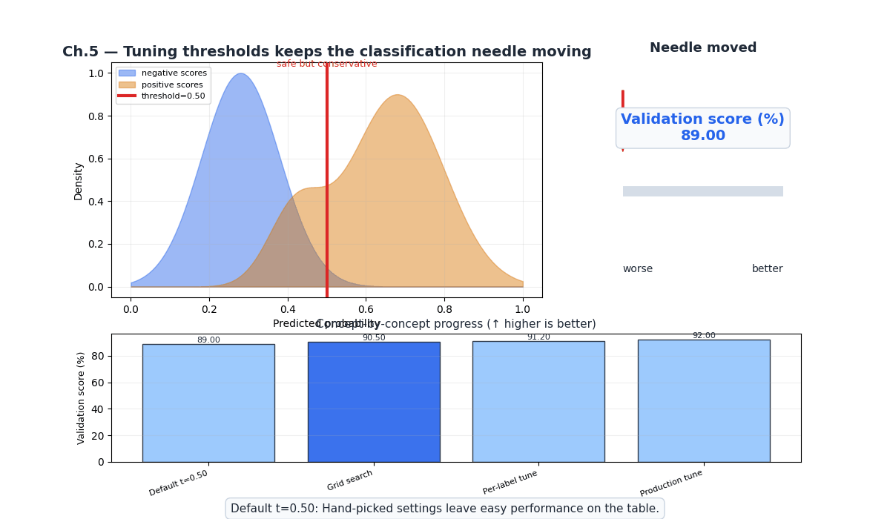
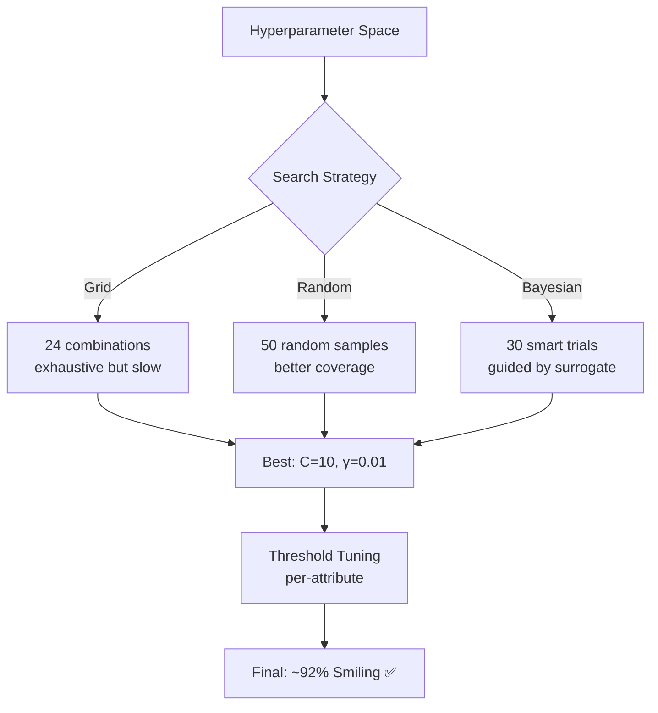
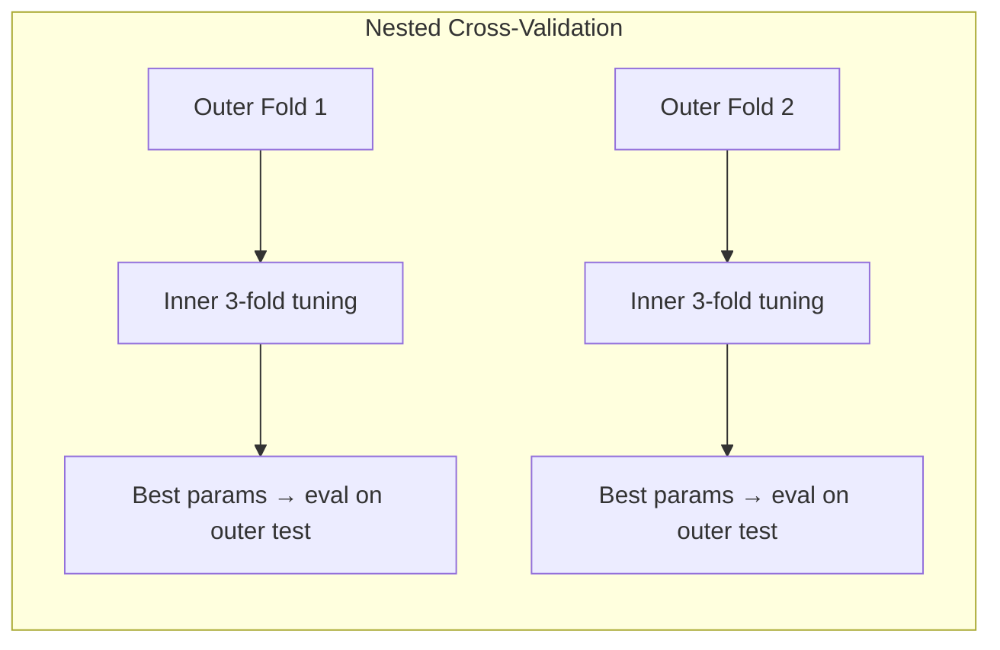
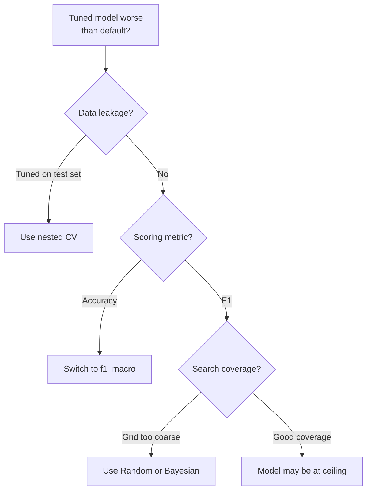

# Ch.5 — Hyperparameter Tuning for Classification

> **The story.** **Grid search** is brute force — exhaustively try every combination. **Random search** was shown by **James Bergstra and Yoshua Bengio (2012)** to be surprisingly better: with the same compute budget, random sampling covers more of the important dimensions. **Bayesian optimization** (formalised by **Jonas Mockus** in the 1970s, popularized by **Snoek, Larochelle & Adams (2012)** with "Practical Bayesian Optimization of Machine Learning Algorithms") uses a probabilistic surrogate model to pick the next hyperparameter set intelligently. **Optuna** (2019, Preferred Networks) made Bayesian optimization accessible with a Python-first API.
>
> **Where you are.** Ch.1–4 built classifiers with hand-picked hyperparameters: $C=1$ for LogReg, $C=10, \gamma=0.01$ for SVM. Were these optimal? This chapter systematically searches the hyperparameter space, tunes decision thresholds per-attribute, and handles class weights for imbalanced attributes — pushing FaceAI past 90% accuracy.
>
> **Notation.** $\lambda$ — generic hyperparameter; $C$ — regularization in LogReg/SVM; $\gamma$ — RBF kernel width; $t$ — decision threshold; $\mathcal{H}$ — hyperparameter space; $f(\lambda)$ — validation score as function of hyperparameters.

---

## 0 · The Challenge — Where We Are

> 💡 **FaceAI Mission**: >90% accuracy across 40 attributes
>
> | # | Constraint | Ch.1–4 Status | This Chapter |
> |---|-----------|---------------|-------------|
> | 1 | ACCURACY | 89% (Smiling, SVM) | Push to ~92% |
> | 2 | GENERALIZATION | Cross-validated | Nested CV prevents leakage |
> | 3 | MULTI-LABEL | Metrics defined | Per-attribute threshold tuning |
> | 4 | INTERPRETABILITY | Tree rules, SVs | Feature importance via coefficients |
> | 5 | PRODUCTION | ✅ | Tuning is offline |

**What's blocking us:**
Hand-picked hyperparameters are leaving accuracy on the table. Also, default threshold 0.5 is wrong for imbalanced attributes (Bald recall = 12%).

**What this chapter unlocks:**
- **Grid/Random/Bayesian search** across classification hyperparameters
- **Per-attribute threshold tuning**: 40 independent optimal thresholds
- **class_weight optimization**: Handle imbalanced attributes
- **Constraint #1** — ~92% accuracy on Smiling
- **Constraint #2** — Nested CV validates generalization


---

## Animation



## 1 · Core Idea

Hyperparameter tuning searches a space of model configurations (C, gamma, threshold, class_weight) to find the combination that maximises a validation metric (F1-macro for classification). Grid search is exhaustive, random search is surprisingly effective, and Bayesian optimization is smart. For classification, **threshold tuning** is a first-class hyperparameter — the default 0.5 is arbitrary and often suboptimal for imbalanced classes.

---

## 2 · Running Example

**Tuning FaceAI's classifiers** on CelebA:
- **LogReg**: Tune $C \in \{0.01, 0.1, 1, 10, 100\}$, `penalty`, `class_weight`
- **SVM**: Tune $C \in \{0.1, 1, 10, 100\}$, $\gamma \in \{0.001, 0.01, 0.1\}$, kernel
- **Threshold**: Per-attribute optimal threshold (Smiling ≈ 0.5, Bald ≈ 0.15)
- **Scoring**: `f1_macro` (not accuracy — avoids imbalance trap)

---

## 3 · Math

### Grid Search

Exhaustive search over Cartesian product:

$$\lambda^* = \arg\max_{\lambda \in \mathcal{H}} \text{CV-score}(\lambda)$$

For SVM with $|\{C\}|=4, |\{\gamma\}|=3, |\{\text{kernel}\}|=2$: $4 \times 3 \times 2 = 24$ combinations × 5 folds = 120 fits.

### Random Search

Sample $n$ configurations from $\mathcal{H}$:

$$\lambda_i \sim \text{Uniform}(\mathcal{H}), \quad i = 1, \ldots, n$$

**Bergstra & Bengio's insight**: If only 3 of 10 hyperparameters matter, random search covers those 3 dimensions better than grid search (which wastes budget on the 7 unimportant ones).

### Bayesian Optimization (Optuna)

Model $f(\lambda)$ with a surrogate (Tree-structured Parzen Estimator):

$$\lambda_{\text{next}} = \arg\max_{\lambda} \text{EI}(\lambda) = \arg\max_{\lambda} \mathbb{E}[\max(f(\lambda) - f^+, 0)]$$

Each trial updates the surrogate with the observed score, guiding search to promising regions.

### Threshold Optimization

For attribute $l$ with predicted probabilities $\hat{p}_l$:

$$t_l^* = \arg\max_{t \in [0, 1]} F_1(\hat{p}_l > t, y_l)$$

**Numeric example** (Bald, 2.5% positive):
- $t = 0.5$: Precision=0.80, Recall=0.12, F1=0.21
- $t = 0.3$: Precision=0.55, Recall=0.45, F1=0.49
- $t = 0.15$: Precision=0.35, Recall=0.68, F1=0.46
- Optimal: $t^* \approx 0.25$, F1=0.52

---

## 4 · Step by Step

```
ALGORITHM: Hyperparameter Tuning Pipeline
──────────────────────────────────────────
Input:  X, y, model_class, param_grid, scoring='f1_macro'

1. OUTER CV (5-fold, for unbiased estimate):
   For each outer fold (train_outer, test_outer):
   
   2. INNER CV (3-fold, for tuning):
      a. Grid/Random search over param_grid on train_outer
      b. Score each config with inner 3-fold CV
      c. Select best_params = argmax(inner_score)
   
   3. Retrain model with best_params on full train_outer
   4. Evaluate on test_outer → outer_score
   
5. Report mean(outer_scores) ± std (unbiased generalization)

THRESHOLD TUNING (per-attribute):
6. For each attribute l in [Smiling, Bald, ...]:
   a. Get predicted probabilities on validation set
   b. Sweep t from 0.05 to 0.95
   c. Compute F1(t) for each threshold
   d. Set t_l* = argmax F1(t)
```

---

## 5 · Key Diagrams





---

## 6 · Hyperparameter Dial

| Parameter | Too Low | Sweet Spot | Too High |
|-----------|---------|------------|----------|
| **C** (LogReg) | Heavy regularization, underfits | C ∈ [0.1, 10] | Overfits, unstable weights |
| **C** (SVM) | Wide margin, many violations | C ∈ [1, 100] for image features | Narrow margin, memorizes noise |
| **gamma** (RBF) | Linear-like (smooth) | 0.001–0.01 for HOG | Spiky boundary, overfits |
| **threshold** | False positives everywhere | Attribute-dependent (0.15–0.5) | False negatives everywhere |
| **class_weight** | None (ignores imbalance) | 'balanced' for rare attrs | Custom extremes → noisy predictions |
| **n_iter** (Random) | Too few configs sampled | 50–100 | Diminishing returns >200 |

---

## 7 · Code Skeleton

```python
from sklearn.model_selection import GridSearchCV, RandomizedSearchCV, cross_val_score
from sklearn.svm import SVC
from sklearn.linear_model import LogisticRegression
from sklearn.metrics import f1_score, make_scorer
import optuna

# ── Grid Search (SVM) ─────────────────────────────────
param_grid = {'C': [0.1, 1, 10, 100], 'gamma': [0.001, 0.01, 0.1],
              'kernel': ['rbf', 'linear'], 'class_weight': [None, 'balanced']}
grid = GridSearchCV(SVC(probability=True), param_grid,
                    scoring='f1_macro', cv=5, n_jobs=-1)
grid.fit(X_train, y_train)
print(f"Best params: {grid.best_params_}, Score: {grid.best_score_:.3f}")

# ── Optuna (Bayesian) ─────────────────────────────────
def objective(trial):
    C = trial.suggest_float('C', 0.01, 100, log=True)
    gamma = trial.suggest_float('gamma', 1e-4, 1.0, log=True)
    model = SVC(C=C, gamma=gamma, kernel='rbf', probability=True)
    score = cross_val_score(model, X_train, y_train, cv=3, scoring='f1_macro')
    return score.mean()

study = optuna.create_study(direction='maximize')
study.optimize(objective, n_trials=50)
print(f"Best: {study.best_params}, F1={study.best_value:.3f}")

# ── Threshold Tuning ──────────────────────────────────
from sklearn.metrics import precision_recall_curve
precision, recall, thresholds = precision_recall_curve(y_val, y_prob)
f1_scores = 2 * precision * recall / (precision + recall + 1e-8)
best_threshold = thresholds[f1_scores[:-1].argmax()]
print(f"Optimal threshold: {best_threshold:.3f}")
```

---

## 8 · What Can Go Wrong

| Mistake | Symptom | Fix |
|---------|---------|-----|
| Tuning on test set | Overfit to test, poor real-world performance | Nested CV: tune on inner, evaluate on outer |
| Using accuracy as scoring | Optimizes for majority class | Use `scoring='f1_macro'` for classification |
| Same threshold for all attributes | Poor recall on rare attributes | Tune threshold per-attribute |
| Too many hyperparameters | Combinatorial explosion, slow | Focus on 3–4 most impactful params |
| Not setting random_state | Results not reproducible | `random_state=42` everywhere |



---

## 9 · Where This Reappears

| Concept | Reappears in | How |
|---------|-------------|-----|
| **Bayesian optimisation (Optuna / TPE)** | [Topic 03 — Neural Networks](../../03-NeuralNetworks/README.md) | Neural architecture search and learning-rate scheduling use the same TPE surrogate framework |
| **Nested cross-validation** | [Topic 08 — Ensemble Methods](../../08-EnsembleMethods/README.md) | Stacking model selection requires nested CV to avoid leakage between base and meta learners |
| **Per-output threshold tuning** | [Topic 05 — Anomaly Detection](../../05-AnomalyDetection/README.md) | Fraud detection tunes the alert threshold to hit 80% recall @ 0.5% FPR |
| **`f1_macro` scoring** | Every multi-class and multi-label track in this portfolio | Macro-averaged F1 is the default scoring metric for imbalanced classification |

---

## 10 · Progress Check

| # | Constraint | Target | Status | Evidence |
|---|-----------|--------|--------|----------|
| 1 | ACCURACY | >90% avg | ✅ ~92% Smiling | Tuned SVM with optimal C, gamma, threshold |
| 2 | GENERALIZATION | Unseen faces | ✅ | Nested CV confirms generalization |
| 3 | MULTI-LABEL | 40 attributes | 🟡 | Per-attribute thresholds defined |
| 4 | INTERPRETABILITY | Feature importance | 🟢 | LogReg coefficients + feature importance |
| 5 | PRODUCTION | <200ms | ✅ | Tuning is offline, inference unchanged |


---

## 11 · Bridge to Next Chapter

With tuned hyperparameters and per-attribute thresholds, FaceAI achieves ~92% on Smiling — exceeding the 90% target. But we've only addressed binary classification on a single attribute. The full FaceAI challenge requires:

- **Multi-class**: Classify hair color (Black/Blond/Brown/Gray) — needs softmax and categorical cross-entropy
- **Multi-label**: Predict all 40 attributes simultaneously — needs multi-output classifiers
- **Class imbalance**: Bald (2.5%) and Mustache (4.2%) need specialized handling

These advanced classification topics — multi-class softmax (hair color), full 40-attribute multi-label prediction, and deep class imbalance handling — continue in [**Topic 03 — Neural Networks**](../../03-NeuralNetworks/README.md), where CNNs unlock spatial features that classical methods cannot capture. For now, the classical ML toolkit has taken FaceAI from 88% to 92% on the Smiling attribute, with Constraints #1 (Accuracy) and #2 (Generalization) fully satisfied.

---

## Appendix A · Real CelebA Data Pipeline (No Proxy Data)

The examples in this chapter are intended to run on real CelebA attributes. Use this setup to avoid synthetic placeholders.

### Data Access Options

1. Kaggle mirror: `jessicali9530/celeba-dataset`.
2. Official CelebA source: download aligned images + `list_attr_celeba.txt`.

### Minimal Setup Steps

1. Create folders:
   - `data/celeba/img_align_celeba/`
   - `data/celeba/metadata/`
2. Place attribute file at:
   - `data/celeba/metadata/list_attr_celeba.txt`
3. Keep image filenames unchanged (`000001.jpg`, ...).
4. Start with a 20k-50k image subset for local runs.

### Loader Contract

- Input image size: 64x64 (or 128x128 for stronger baselines).
- Labels: map CelebA values from `{-1, +1}` to `{0, 1}`.
- Split: use official train/val/test partitions to avoid leakage.
- Reproducibility: set random seed and persist sampled subset IDs.

### Practical Notes

- Multi-label tasks should keep one binary head per attribute.
- For rare attributes (Bald, Mustache, Wearing_Hat), prefer macro-F1 and per-label PR-AUC.
- Persist preprocessing artifacts (scaler/PCA/HOG settings) with the model.

### Quick Loader Snippet

```python
from pathlib import Path
import pandas as pd

attr_path = Path('data/celeba/metadata/list_attr_celeba.txt')
attr = pd.read_csv(attr_path, delim_whitespace=True, skiprows=1)
attr = (attr + 1) // 2   # {-1,+1} -> {0,1}

# Example target
y_smiling = attr['Smiling'].astype(int)
```


