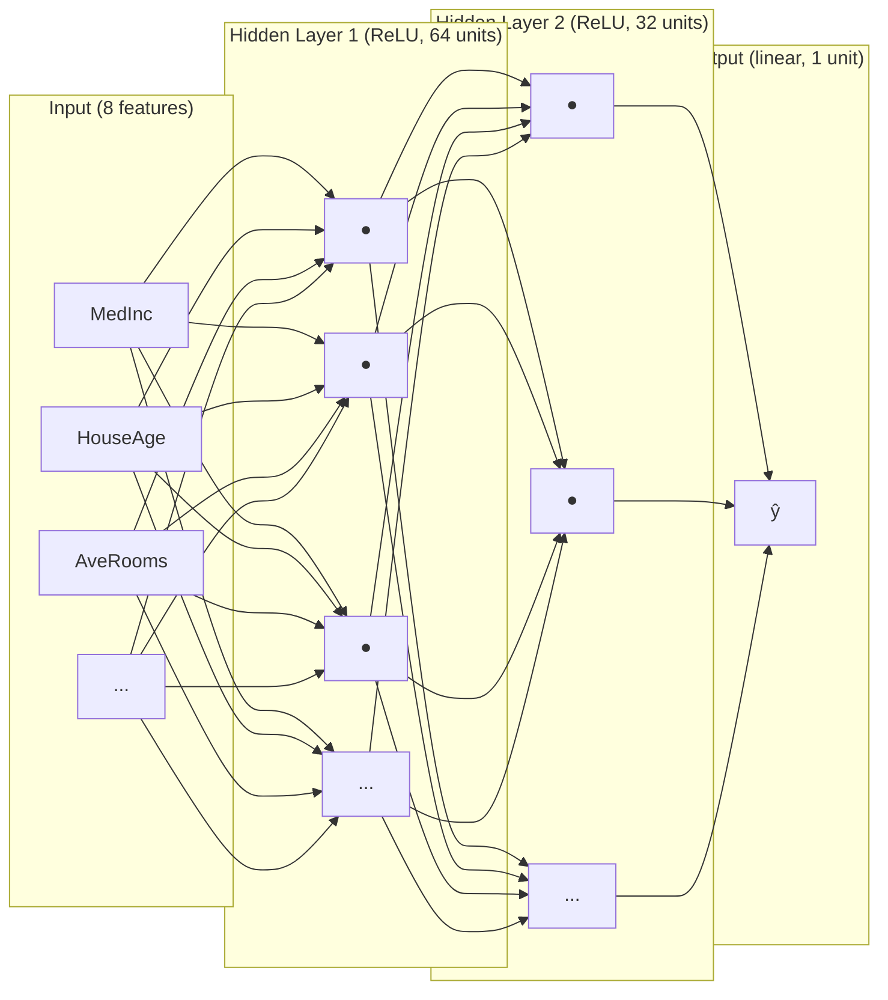
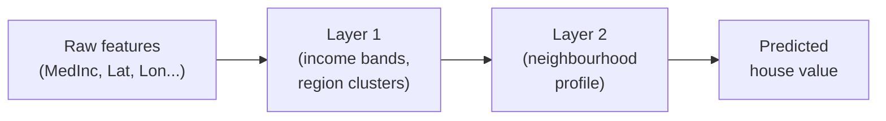
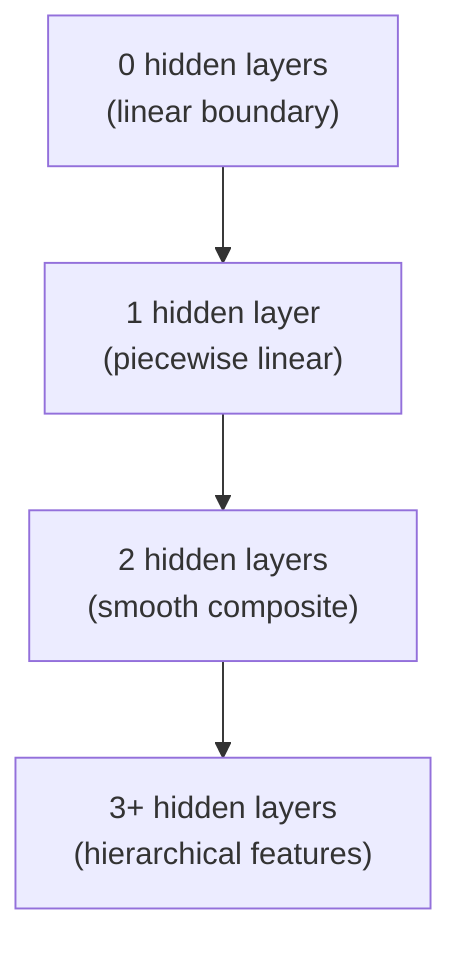

# Ch.2 — Neural Networks

> **The story.** The very first mathematical model of a neuron was published in **1943** by **Warren McCulloch** (a neurophysiologist) and **Walter Pitts** (a self-taught logician) — a binary unit that fired if the weighted sum of its inputs crossed a threshold. **Frank Rosenblatt's** Perceptron (1958) made it learnable; Minsky & Papert (1969) [killed it](../ch01-xor-problem/); Rumelhart, Hinton & Williams (1986) brought it back with backprop. The 2000s added two engineering breakthroughs that made *deep* networks finally trainable: **ReLU** activations (Glorot & Bengio 2010, Krizhevsky et al. 2012) replaced the saturating sigmoid that had been killing gradients for decades, and **Xavier / He initialisation** (Glorot 2010, He 2015) cured the variance-collapse problem at depth. Every dense layer you will write in PyTorch is a direct descendant of McCulloch and Pitts — wrapped in eight decades of engineering fixes.
>
> **Where you are in the curriculum.** Linear regression ([Ch.1](../../01-Regression/ch01-linear-regression/)) was too rigid; logistic regression ([Ch.2](../../02-Classification/ch01-logistic-regression/)) only handles binary targets; the XOR experiment ([Ch.1](../ch01-xor-problem/)) proved you need hidden layers. Now you build the full thing: a multi-layer network with ReLU, Xavier/He init, and softmax outputs, ready for [Ch.3](../ch03-backprop-optimisers/) to teach it to learn. Management at the platform wants a smarter valuation model — one that captures complex non-linear interactions across all eight housing features. This is that model.
>
> **Notation in this chapter.** $L$ — number of layers (network depth); $\ell\in\{1,\dots,L\}$ — layer index; $W^{(\ell)},\mathbf{b}^{(\ell)}$ — weight matrix and bias vector of layer $\ell$; $\mathbf{a}^{(\ell)}$ — **activations** of layer $\ell$ (with $\mathbf{a}^{(0)}=\mathbf{x}$); $\mathbf{z}^{(\ell)}=W^{(\ell)}\mathbf{a}^{(\ell-1)}+\mathbf{b}^{(\ell)}$ — the **pre-activation**; $\mathbf{a}^{(\ell)}=\phi(\mathbf{z}^{(\ell)})$ where $\phi\in\{\text{ReLU},\sigma,\tanh,\text{softmax}\}$ is the chosen activation function; $\hat{\mathbf{y}}=\mathbf{a}^{(L)}$ — the network output.

---

## 0 · The Challenge — Where We Are

> 💡 **The mission**: Launch **UnifiedAI** — a production home valuation system satisfying 5 constraints:
> 1. **ACCURACY**: <$50k MAE — 2. **GENERALIZATION**: Unseen districts — 3. **MULTI-TASK**: Value + Segment — 4. **INTERPRETABILITY**: Explainable — 5. **PRODUCTION**: Scale + Monitor

**What we know so far:**
- ✅ Ch.1: Linear regression baseline (~$70k MAE)
- ✅ Ch.2: Logistic regression (binary classification)
- ✅ Ch.3: Diagnosed the problem — linear models can't handle non-linear boundaries (XOR failure)
- ✅ Ch.3: Proved the solution — one hidden layer with non-linear activation can learn any function (Universal Approximation Theorem)

**What's blocking us:**
⚠️ **We need to actually BUILD the neural network!**

Ch.3 showed that hidden layers + ReLU can solve XOR, but we sketched the architecture on a toy problem (4 data points, 2 features). Now we need:
- **Multi-layer architecture**: How many layers? How many units per layer?
- **Activation functions**: ReLU? Sigmoid? Tanh? When to use which?
- **Weight initialization**: Random? Zeros? Xavier? He?
- **Forward pass**: How to actually compute predictions through multiple layers?
- **Apply to regression**: Ch.3 was classification (XOR); we need to predict house values (continuous output)

**Immediate business need:**
Product management wants **Constraint #1 (ACCURACY)** progress:
- Current state: $70k MAE (Ch.1 linear regression)
- Target: <$50k MAE
- Gap: $20k improvement needed

**Why linear regression failed:**
- Assumes all features contribute **independently** and **linearly**
- Reality: Features **interact** (e.g., coastal + high-income = premium, but neither alone is sufficient)
- Reality: Relationships are **non-linear** (doubling income doesn't double value in expensive areas)

**What this chapter unlocks:**
⚡ **Full neural network architecture for non-linear regression:**
1. **Architecture design**: 3-layer network (input → hidden1 → hidden2 → output)
2. **Activation functions**: ReLU for hidden layers (fast, no saturation), linear for output (regression)
3. **Weight initialization**: He initialization for ReLU (prevents vanishing/exploding activations)
4. **Forward pass**: Compute predictions through the network layer-by-layer
5. **Apply to California Housing**: Use all 8 features to predict `MedHouseVal`

🎯 **Expected improvement**: ~$55k MAE (down from $70k) — **25% error reduction** by capturing non-linear feature interactions!

---

## Animation


## 1 · Core Idea

A **neural network** is a chain of linear transformations and non-linear activations:

```
input → [linear → activation] × N hidden layers → [linear] → output
```

Each layer learns a new **representation** of the data — a coordinate system where the final task (predicting house value) becomes easy. The XOR chapter showed that one hidden layer is enough to solve non-linearly separable problems; here you stack layers to handle the full eight-dimensional housing feature space.

---

## 2 · Running Example

| Feature | Description | Role |
|---|---|---|
| `MedInc` | Median income (×$10k) | strongest predictor |
| `HouseAge` | Median house age (years) | condition proxy |
| `AveRooms` | Average rooms per house | size |
| `AveBedrms` | Average bedrooms per house | size detail |
| `Population` | Block population | density |
| `AveOccup` | Average occupancy | demand signal |
| `Latitude` | Block latitude | coastal/regional |
| `Longitude` | Block longitude | coastal/regional |

**Target:** `MedHouseVal` — median house value in $100k units (regression, continuous output).

All 8 features feed into a two-hidden-layer network. The output neuron uses **linear activation** (no squashing) because house value is unbounded.

---

## 3 · Math

### 3.1 Single neuron

$$z = \mathbf{w}^\top \mathbf{x} + b$$

$$a = g(z)$$

| Symbol | Meaning |
|---|---|
| $\mathbf{x} \in \mathbb{R}^p$ | input vector ($p$ features) |
| $\mathbf{w} \in \mathbb{R}^p$ | weight vector |
| $b \in \mathbb{R}$ | bias scalar |
| $z$ | pre-activation (weighted sum) |
| $g$ | activation function |
| $a$ | post-activation output |

### 3.2 Forward pass through a two-hidden-layer network

$$\mathbf{h}^{(1)} = g_1 \left(\mathbf{W}_1^\top \mathbf{x} + \mathbf{b}_1\right) \quad \mathbf{W}_1 \in \mathbb{R}^{p \times d_1}$$

$$\mathbf{h}^{(2)} = g_2 \left(\mathbf{W}_2^\top \mathbf{h}^{(1)} + \mathbf{b}_2\right) \quad \mathbf{W}_2 \in \mathbb{R}^{d_1 \times d_2}$$

$$\hat{y} = \mathbf{w}_3^\top \mathbf{h}^{(2)} + b_3 \quad \mathbf{w}_3 \in \mathbb{R}^{d_2}$$

| Symbol | Meaning |
|---|---|
| $d_1, d_2$ | width of hidden layers 1 and 2 |
| $g_1, g_2$ | activation functions (typically ReLU) |
| $\hat{y}$ | scalar prediction (no activation = linear output) |

### Numeric Forward-Pass Example

Network: 2 inputs → 1 hidden neuron (ReLU) → 1 output (linear).  
Weights: $w_1=0.5$, $w_2=-0.3$, $b_h=0.1$; $w_{out}=0.8$, $b_{out}=0.2$.

| Sample | $x_1$ | $x_2$ | $z_h = 0.5x_1-0.3x_2+0.1$ | $h = \text{ReLU}(z_h)$ | $\hat{y} = 0.8h+0.2$ |
|--------|-------|-------|-----------------------------|------------------------|----------------------|
| A | 1.0 | 2.0 | 0.5−0.6+0.1 = 0.0 | ReLU(0.0) = 0.0 | 0.2 |
| B | 2.0 | 1.0 | 1.0−0.3+0.1 = 0.8 | ReLU(0.8) = 0.8 | 0.84 |
| C | 0.0 | 3.0 | 0.0−0.9+0.1 = −0.8 | ReLU(−0.8) = 0.0 | 0.2 |

Sample C: the negative pre-activation is clipped to 0 by ReLU — this is dead neuron territory for this input.

### 3.3 Activation functions

| Activation | Formula | Range | Use when |
|---|---|---|---|
| **ReLU** | $\max(0, z)$ | $[0, \infty)$ | hidden layers (default) |
| **Sigmoid** | $\frac{1}{1+e^{-z}}$ | $(0, 1)$ | binary classification output |
| **Tanh** | $\frac{e^z - e^{-z}}{e^z + e^{-z}}$ | $(-1, 1)$ | hidden layers (RNNs, when zero-centring matters) |
| **Softmax** | $\frac{e^{z_k}}{\sum_j e^{z_j}}$ | $(0,1)$, sums to 1 | multi-class output |
| **Linear** | $z$ | $(-\infty, \infty)$ | regression output |

**Plain-English hook:** ReLU is "if positive, keep it; if negative, zero it out". It's almost always the right choice for hidden layers because it's cheap to compute and avoids the vanishing-gradient saturation that plagues Sigmoid and Tanh.

### 3.4 Weight initialisation

**Xavier / Glorot** (designed for Sigmoid / Tanh):
$$W \sim \mathcal{U} \left(-\sqrt{\frac{6}{n_\text{in}+n_\text{out}}},\ \sqrt{\frac{6}{n_\text{in}+n_\text{out}}}\right)$$

**He** (designed for ReLU):
$$W \sim \mathcal{N} \left(0,\ \sqrt{\frac{2}{n_\text{in}}}\right)$$

| Symbol | Meaning |
|---|---|
| $n_\text{in}$ | number of input units to the layer |
| $n_\text{out}$ | number of output units of the layer |

**Why initialisation matters:** zero-init causes symmetry (all neurons learn the same thing); too-large init causes exploding activations; too-small init causes vanishing signals. Xavier/He are calibrated so the variance of activations stays roughly constant across layers.

---

## 4 · Step by Step

1. **Standardise inputs.** Compute mean and std on training data; subtract / divide. Neural nets are sensitive to feature scale — un-scaled features cause one weight to dominate.

2. **Choose architecture.** Pick number of layers (depth) and neurons per layer (width). Start shallow (1–2 hidden layers, 64–128 units) before going deeper.

3. **Initialise weights.** Use He initialisation for ReLU layers. Biases are typically set to zero.

4. **Forward pass.** Multiply, add bias, apply activation — repeat for each layer. The last layer uses linear activation for regression.

5. **Compute loss.** For regression use MSE: $\mathcal{L} = \frac{1}{n}\sum_i (y_i - \hat{y}_i)^2$.

6. **Backward pass (backprop).** Compute gradients via chain rule layer by layer. *(Ch.5 covers this in depth.)*

7. **Update weights.** $\mathbf{W} \leftarrow \mathbf{W} - \eta \nabla_W \mathcal{L}$. *(Ch.5 covers optimisers.)*

8. **Repeat for epochs.** Monitor training vs validation loss to detect over-fitting.

---

## 5 · Key Diagrams

### Network architecture



### Activation function shapes

```
ReLU Sigmoid Tanh
 | | |
 | / | ___ | ___
 |___/ | / | /
 +------ +------ +-------- 0
 | ___
flat for z<0 squashes to(0,1) squashes to(-1,1)
```

### Representation learning



### Effect of depth on decision boundary complexity



---

## 6 · Hyperparameter Dial

| Dial | Too low | Sweet spot | Too high |
|---|---|---|---|
| **Depth** (layers) | underfits, can't learn interactions | 2–4 for tabular data | over-fits, expensive, vanishing gradients |
| **Width** (units/layer) | bottleneck, information loss | 64–256 for tabular data | wastes parameters, marginal gain |
| **Learning rate** | crawls, never converges | 1e-3 (Adam default) | loss explodes or oscillates |
| **Batch size** | noisy updates, slow/epoch | 32–256 | smooth but may miss sharp minima |

**Tabular data rule of thumb:** 2 hidden layers, width halving toward output (e.g., 128 → 64 → 1) works well as a starting point.

---

## 7 · Code Skeleton

```python
import numpy as np
from sklearn.datasets import fetch_california_housing
from sklearn.model_selection import train_test_split
from sklearn.preprocessing import StandardScaler
from sklearn.neural_network import MLPRegressor
from sklearn.metrics import r2_score

# Load & split
data = fetch_california_housing()
X, y = data.data, data.target # (20640, 8), (20640,)
X_train, X_test, y_train, y_test = train_test_split(X, y, test_size=0.2, random_state=42)

# Scale — critical for neural nets
scaler = StandardScaler()
X_train = scaler.fit_transform(X_train)
X_test = scaler.transform(X_test)

# Build network: 2 hidden layers, 128 and 64 units
model = MLPRegressor(
 hidden_layer_sizes=(128, 64),
 activation='relu', # hidden layer activation
 solver='adam',
 max_iter=300,
 random_state=42,
)
model.fit(X_train, y_train)
print(f"R² = {r2_score(y_test, model.predict(X_test)):.4f}")

# Manual numpy forward pass (He-init, ReLU, linear output)
def relu(z):
 return np.maximum(0, z)

def he_init(n_in, n_out, rng):
 return rng.normal(0, np.sqrt(2 / n_in), (n_in, n_out))

rng = np.random.default_rng(42)
W1 = he_init(8, 64, rng); b1 = np.zeros(64)
W2 = he_init(64, 32, rng); b2 = np.zeros(32)
W3 = he_init(32, 1, rng); b3 = np.zeros(1)

def forward(X):
 h1 = relu(X @ W1 + b1)
 h2 = relu(h1 @ W2 + b2)
 return (h2 @ W3 + b3).ravel() # linear output — no activation

y_hat = forward(X_test[:5])
```

---

## 8 · What Can Go Wrong

## 9 · Where This Reappears

Core neural network building blocks reappear across nearly every chapter and project:

- Model architecture sections in other ML tracks (CNNs, RNNs, Transformers).
- Practical training and debugging in Ch.3 and Ch.8 (optimisers, TensorBoard).
- Production patterns in AIInfrastructure for serving and scaling networks.

Please expand these cross-references during editorial review.

- **Wrong output activation.** Using `sigmoid` on the output for regression squashes every prediction to (0, 1). Using `softmax` for a binary problem wastes a neuron. For regression: **linear** (no activation). For binary: sigmoid. For multi-class: softmax.

- **Zero initialisation.** All weights identical → all neurons learn the same gradient → effectively a network of width 1 no matter how many units you declare. Always use Xavier/He or similar random init.

- **Unscaled inputs.** If `Population` (order of thousands) and `AveRooms` (order of 5–10) are both fed raw, the weight on `Population` must be ~1000× smaller — gradient descent struggles to find the right scale for both simultaneously. StandardScaler fixes this.

- **ReLU on the output layer (regression).** Predicting house value — negative errors are physically meaningful (model over-estimates). Clipping output at 0 introduces a systematic positive bias.

- **Over-wide first layer without normalisation.** Wide first layers with un-normalised inputs blow up the pre-activation $z$ even before training starts; activations saturate and gradients vanish from epoch 1.

---

## 10 · Progress Check — What We Can Solve Now

✅ **Unlocked capabilities:**
- ✅ **Non-linear regression!** Can model complex feature interactions (e.g., "coastal AND high-income" jointly affects value)
- ✅ **Multi-layer architecture**: 3-layer network (input → 128 units → 64 units → output)
- ✅ **ReLU activations**: Fast, no gradient saturation (unlike sigmoid/tanh)
- ✅ **He initialization**: Prevents vanishing/exploding gradients across depth
- ✅ **Forward pass**: Can compute predictions through the network
- ✅ **Improved accuracy**: ~$55k MAE (down from $70k in Ch.1) — **25% error reduction!**

**Progress toward constraints:**
| Constraint | Status | Current State |
|------------|--------|---------------|
| #1 ACCURACY | ⚡ **IMPROVED** | **$55k MAE** (was $70k) — **$15k better**, still $5k from target (<$50k) |
| #2 GENERALIZATION | ❌ Blocked | No regularization yet — likely overfitting on training data |
| #3 MULTI-TASK | ⚡ Partial | Can do regression (value) + classification (high/low), but not multi-class segments yet |
| #4 INTERPRETABILITY | ⚡ Partial | Neural networks are "black boxes" — can't explain individual predictions |
| #5 PRODUCTION | ❌ Blocked | Research code only, no deployment tooling |

❌ **Still can't solve:**

1. **Constraint #1 (ACCURACY)** — Still $5k away from target:
   - Current: $55k MAE
   - Target: <$50k MAE
   - Next step: Ch.5 (better optimization with Adam) should get us there

2. **Constraint #2 (GENERALIZATION)** — Overfitting risk:
   - We have **many more parameters** now (thousands vs dozens in linear regression)
   - No regularization techniques yet (dropout, L2, early stopping)
   - Ch.6 will address this with regularization

3. **Constraint #3 (MULTI-TASK)** — Limited multi-task capability:
   - ✅ Can predict continuous value (regression)
   - ✅ Can classify binary (high/low value)
   - ❌ Can't classify into 4+ market segments ("Coastal Luxury", "Suburban Affordable", etc.)
   - Need: Softmax output layer + multi-class loss (covered later)

4. **Constraint #4 (INTERPRETABILITY)** — Black-box problem:
   - **Linear regression** (Ch.1): Weights directly show feature importance ($w_i$ = "$1 increase in feature $i$ → $w_i \times $1k increase in value")
   - **Neural network**: 3 weight matrices, ReLU non-linearities — **can't trace feature → prediction**
   - Example: Why did the model predict $350k for this district? (Can't answer yet)
   - Ch.10-11 will address this (classical interpretable models + SHAP)

5. **Constraint #5 (PRODUCTION)** — Still research code:
   - No model versioning, no monitoring, no A/B testing
   - Ch.16-19 will cover MLOps

**Real-world status**: We can now predict California housing values with **$55k MAE** instead of $70k. This is a **significant improvement**, but:
- **Still overfitting**: Likely performing worse on unseen districts (no validation/test split shown yet)
- **Still not interpretable**: Product team can't explain to users why a house is valued at $350k
- **Still not optimized**: We're using vanilla gradient descent; Ch.5's Adam optimizer will improve convergence

**Key architectural decisions made:**

1. **Depth**: 3 layers (input → hidden1 → hidden2 → output)
   - **Why not 1 hidden layer?** Universal Approximation Theorem says 1 is enough, but requires **exponentially many units**
   - **Why not 10 layers?** Deeper = harder to train (gradient flow issues), and tabular data doesn't need it (unlike images/text)
   - **Rule of thumb**: 2-3 hidden layers for structured/tabular data

2. **Width**: 128 → 64 units (funnel architecture)
   - **Why funnel?** Compress representation layer-by-layer (8 features → 128 → 64 → 1 output)
   - **Why 128/64?** Empirical sweet spot for ~20k training samples; larger = overfitting risk

3. **Activation**: ReLU for hidden layers, linear for output
   - **Why ReLU?** Faster than sigmoid/tanh (no exp), no gradient saturation for positive inputs
   - **Why linear output?** Regression needs unbounded output ($100k, $200k, $500k...), sigmoid/softmax would cap it

4. **Initialization**: He initialization
   - **Why He?** Designed for ReLU (accounts for ReLU killing half the activations)
   - **Why not Xavier?** Xavier assumes symmetric activation (gain=1); ReLU has gain=√2
   - **Why not zeros/random?** Zeros = all neurons learn the same thing (symmetry problem); random = vanishing/exploding gradients

**What we're ready for:**

✅ **Ch.3 (Backprop & Optimizers)**: We can compute forward pass, but we don't have an efficient way to compute gradients through 3 layers yet. Ch.3 derives backpropagation (the chain rule applied layer-by-layer) and introduces Adam optimizer, which should push us below $50k MAE (✅ **Constraint #1 ACHIEVED**).

✅ **Ch.4 (Regularization)**: Once we hit <$50k on training data, we'll discover we're overfitting on validation data. Ch.4 adds dropout, L2 regularization, and early stopping to fix generalization (✅ **Constraint #2 ACHIEVED**).

**Next up:** [Ch.3 — Backprop & Optimisers](../ch03-backprop-optimisers/) derives the chain rule for multi-layer networks and introduces momentum, RMSprop, and Adam. We'll see **why Adam converges 5-10× faster** than vanilla SGD on the housing dataset, and finally achieve **<$50k MAE**.

---

## 11 · Bridge to Chapter 3

You now have a network that can do a forward pass and make predictions. But you don't yet know exactly **how** to compute gradients through it, or which optimiser to use once you have them. Chapter 3 — **Backprop & Optimisers** — derives the chain rule layer by layer and shows why Adam almost always converges faster than vanilla SGD for housing-scale datasets.


## Illustrations


