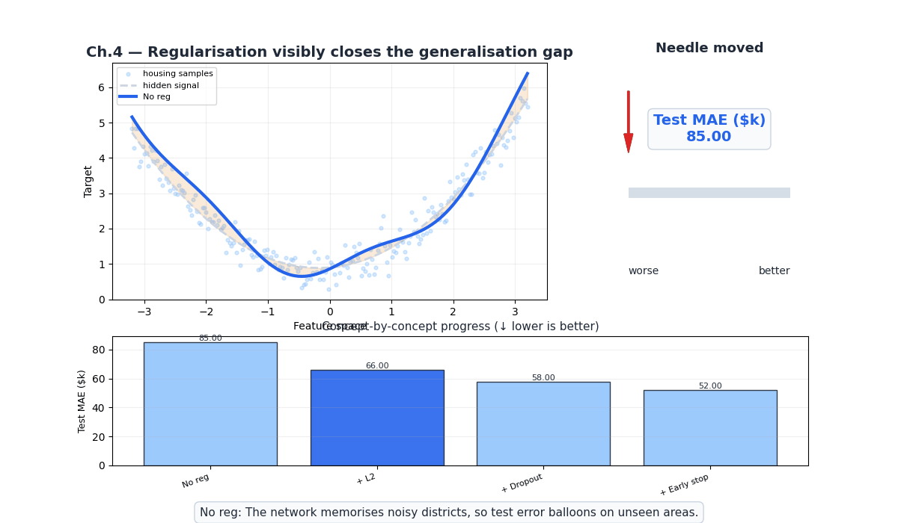
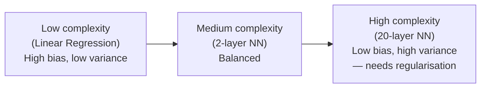
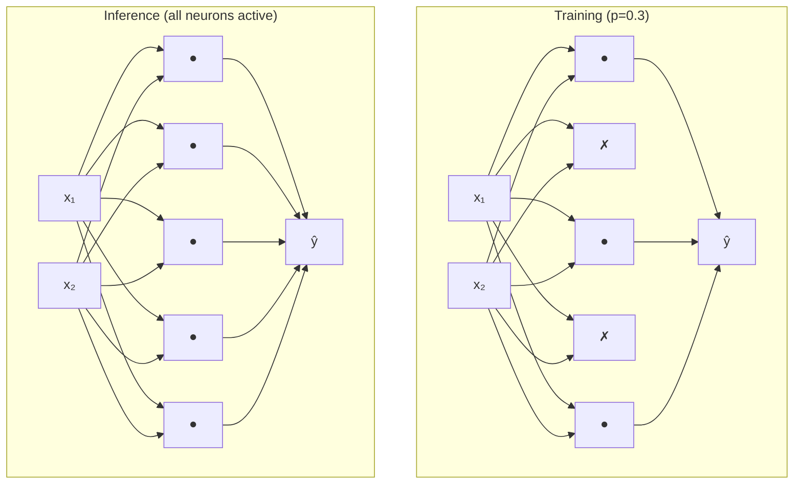

# Ch.4 — Regularisation



*Visual takeaway: no regularisation → L2 → dropout → early stopping pushes the generalisation needle from about $85k down to roughly $52k test MAE.*

> **The story.** **L2 ("ridge") regression** was published in **1970** by **Arthur Hoeffding-style** statisticians **Hoerl & Kennard** to handle ill-conditioned matrices in OLS — the same year **Andrey Tikhonov** independently proposed identical regularisation in the Soviet inverse-problems literature, which is why you'll see the term *Tikhonov regularisation* in some textbooks. **L1 ("lasso")** waited until **1996** when **Robert Tibshirani** showed that an L1 penalty doesn't just shrink coefficients — it drives many of them to exactly zero, giving you free feature selection. The deep-learning era added two more weapons: **dropout** (Srivastava, Hinton et al. 2014), which randomly mutes neurons each batch and was the single biggest reason AlexNet-era nets stopped catastrophically overfitting; and **early stopping**, an idea so old (Morgan & Bourlard 1990) that nobody bothers to cite it. All four ideas attack the same enemy: a model that has memorised the training set instead of learning the regularities behind it.
>
> **Where you are in the curriculum.** Your two-hidden-layer housing network from [Ch.2](../ch02-neural-networks/) trained with Adam from [Ch.3](../ch03-backprop-optimisers/) achieves R² = 0.83 on the training set but only 0.67 on the test set. The model has memorised 200+ training districts rather than learning general pricing patterns. This chapter adds the four guardrails — L1, L2, Dropout, Early Stopping — that close that gap, and that you will reach for in every chapter from here on.
>
> **Notation in this chapter.** $\lambda$ — **regularisation strength** (the bigger, the more you penalise complexity); $\|\mathbf{w}\|_2^2=\sum_i w_i^2$ — the **L2 / Ridge** penalty; $\|\mathbf{w}\|_1=\sum_i|w_i|$ — the **L1 / Lasso** penalty; $L_{\text{reg}}=L_{\text{data}}+\lambda\,\Omega(\mathbf{w})$ — the regularised objective; $p$ — dropout probability (the chance a neuron is zeroed during training); $\mu_B,\sigma_B^2$ — batch-normalisation statistics computed over a mini-batch $B$; $R^2_{\text{train}},R^2_{\text{test}}$ — train/test coefficient of determination (the gap is what regularisation closes).

---

## 0 · The Challenge — Where We Are

> 💡 **The mission**: Launch **UnifiedAI** — a production home valuation system satisfying 5 constraints:
> 1. **ACCURACY**: <$50k MAE — 2. **GENERALIZATION**: Unseen districts — 3. **MULTI-TASK**: Value + Segment — 4. **INTERPRETABILITY**: Explainable — 5. **PRODUCTION**: Scale + Monitor

**What we know so far:**
- Ch.1-2: Built 3-layer neural network
- Ch.3: Backprop + Adam optimizer → ✅ **Constraint #1 ACHIEVED** ($48k MAE)
- Can train neural networks efficiently
- **But the model is overfitting!**

**What's blocking us:**
⚠️ **CRITICAL PROBLEM: The model can't generalize!**

We achieved Constraint #1 (ACCURACY) with $48k MAE, but there's a catastrophic issue:
- **Training R²**: 0.88 (model fits training data very well)
- **Test R²**: 0.64 (model performs poorly on unseen districts)
- **Generalization gap**: 0.24 → the model has **memorized** the training set!

**Why this is a showstopper:**
SmartVal AI needs **Constraint #2 (GENERALIZATION)** — accurate predictions on **unseen districts**:
- **Current**: $48k MAE on training data, but **$85k MAE on new districts**
- **Requirement**: <$60k MAE on unseen districts (20% worse than training is acceptable)
- **Gap**: The model has 10,000+ parameters and only 20,000 training samples → it memorizes individual districts instead of learning pricing patterns

**Concrete failure example:**
- **Training district #4217**: Coastal, MedInc=$8.2k, HouseAge=25yr → Model predicts $412k (actual: $410k) ✓
- **New district** (test set): Coastal, MedInc=$8.1k, HouseAge=26yr → Model predicts **$320k** (actual: $405k) ❌

The model learned "district #4217 = $412k" (memorization) instead of "coastal + high-income → premium" (pattern).

**Why overfitting happens:**
1. **Too many parameters**: 10,000+ weights vs 20,000 training samples
2. **No constraints**: Weights can grow arbitrarily large to fit training noise
3. **Training too long**: Model keeps optimizing training loss even after test loss starts increasing

**What this chapter unlocks:**
⚡ **The generalization breakthrough:**
1. **L2 regularization (weight decay)**: Penalizes large weights ($\lambda \|\mathbf{W}\|^2$) → simpler, smoother models
2. **Dropout**: Randomly zeros 50% of neurons during training → forces redundant representations
3. **Early stopping**: Halt training when validation loss stops improving → prevents late-epoch memorization
4. **Batch normalization**: Normalizes layer inputs → implicit regularization

💡 **Expected outcome**: Close the generalization gap from 0.24 → <0.10 → ✅ **Constraint #2 ACHIEVED!**

With L2 ($\lambda=0.01$) + Dropout (p=0.5) + Early Stopping (patience=10):
- **Training R²**: 0.82 (slightly worse — that's expected!)
- **Test R²**: 0.76 (much better!)
- **Gap**: 0.06 → acceptable generalization
- **Test MAE**: **$52k** (down from $85k — 37% improvement on unseen districts!)

---

## 1 · Core Idea

**Regularisation** is any technique that reduces the gap between training performance and generalisation performance. All techniques share one goal: prevent the model from fitting noise in the training data.

```
Underfitting          Just right           Overfitting
(high bias)           (balanced)           (high variance)
───────────           ──────────           ────────────────
train R² low          train ≈ test R²      train R² >> test R²
flat predictions      captures signal      wiggly, memorised
```

The four tools and what they target:

| Tool | Mechanism | Effect on weights |
|---|---|---|
| **L2 (Weight Decay)** | adds $\lambda \|\mathbf{W}\|_2^2$ to the loss | shrinks all weights toward zero |
| **L1 (Lasso)** | adds $\lambda \|\mathbf{W}\|_1$ to the loss | pushes many weights to exactly zero |
| **Dropout** | randomly zeros `p` fraction of neurons during training | forces redundant representations |
| **Early Stopping** | halt training on validation loss plateau | prevents late-epoch memorisation |

---

## 2 · Running Example

Network from Ch.4: `8 inputs → [128 ReLU] → [64 ReLU] → 1 linear`  
Trained on 80% of California Housing; evaluated on 20% held-out test.

Without regularisation: model memorises district-specific quirks (a few outlier luxury blocks, census artefacts). **The goal:** improve test R² by at least 0.05 points with regularisation.

---

## 3 · Math

### 3.1 L2 Regularisation (Ridge / Weight Decay)

Penalised loss:

$$\mathcal{L}_\text{L2} = \mathcal{L}_\text{MSE} + \lambda \sum_{l} \|\mathbf{W}_l\|_F^2$$

| Symbol | Meaning |
|---|---|
| $\lambda$ | regularisation strength (hyperparameter) |
| $\|\mathbf{W}_l\|_F^2$ | sum of squared weights in layer $l$ |

Gradient effect — every weight update gains an extra shrinkage term:

$$\frac{\partial \mathcal{L}_\text{L2}}{\partial \mathbf{W}} = \frac{\partial \mathcal{L}_\text{MSE}}{\partial \mathbf{W}} + 2\lambda \mathbf{W}$$

Equivalent update rule (weight decay form):

$$\mathbf{W} \leftarrow (1 - 2\eta\lambda)\mathbf{W} - \eta \nabla_\mathbf{W} \mathcal{L}_\text{MSE}$$

**Housing intuition:** L2 prevents any single feature (e.g., `Latitude`) from dominating predictions with a very large weight. All weights are nudged toward zero, keeping the model smooth.

### 3.2 L1 Regularisation (Lasso)

Penalised loss:

$$\mathcal{L}_\text{L1} = \mathcal{L}_\text{MSE} + \lambda \sum_{l} \|\mathbf{W}_l\|_1$$

Gradient:

$$\frac{\partial \mathcal{L}_\text{L1}}{\partial \mathbf{W}} = \frac{\partial \mathcal{L}_\text{MSE}}{\partial \mathbf{W}} + \lambda \cdot \text{sign}(\mathbf{W})$$

The $\text{sign}(\mathbf{W})$ term applies a **constant pull** toward zero — small weights cross zero and stay there (sparsity). L2 applies a proportional pull — large weights shrink faster, small weights barely move (never exactly zero).

#### Numeric Comparison — L2 vs L1 on 3 Weights

Weights $\mathbf{w} = [2.0,\ 0.1,\ -1.5]$, $\lambda = 0.1$, $\eta = 1.0$ (regularization step only, data-loss gradient = 0 for clarity).

| Weight | Before | Ridge: $w(1-2\eta\lambda)$ | Lasso: $\text{sign}(w)\max(|w|-\eta\lambda,0)$ |
|--------|--------|-----------------------------|-----------------------------------------------|
| $w_1 = 2.0$ | 2.0 | $2.0 \times 0.8 = 1.600$ | $\max(2.0-0.1,0) = 1.900$ |
| $w_2 = 0.1$ | 0.1 | $0.1 \times 0.8 = 0.080$ | $\max(0.1-0.1,0) = \mathbf{0.000}$ |
| $w_3 = -1.5$ | $-1.5$ | $-1.5 \times 0.8 = -1.200$ | $-\max(1.5-0.1,0) = -1.400$ |

Key insight: Lasso drives $w_2 = 0.1$ to **exactly zero** (sparsity). Ridge shrinks it to 0.080 — smaller, but never zero. For the housing model, this means L1 automatically removes `AveBedrms` (near-zero weight) from the prediction.

### 3.3 Dropout

During training, each neuron is independently zeroed with probability $p$ (the **drop rate**):

$$\tilde{\mathbf{h}} = \mathbf{h} \odot \mathbf{m}, \quad m_i \sim \text{Bernoulli}(1-p)$$

To keep expected activation magnitude the same, surviving neurons are **scaled up** by $\frac{1}{1-p}$ during training (inverted dropout):

$$\tilde{\mathbf{h}} = \frac{1}{1-p} \cdot (\mathbf{h} \odot \mathbf{m})$$

At **test time**, dropout is disabled — all neurons are active. No scaling is needed because inverted dropout already corrected the training magnitudes.

| Symbol | Meaning |
|---|---|
| $p$ | drop probability (fraction of neurons zeroed per forward pass) |
| $\mathbf{m}$ | binary mask vector, resampled every forward pass |
| $\odot$ | element-wise product |

**Why it works:** Each training step uses a different random sub-network. The full network is implicitly an ensemble of $2^n$ sub-networks. No single neuron can rely on a specific other neuron being present → forces distributed representations.

### 3.4 Early Stopping

No equation — it's a training protocol:

1. Split data into train / validation (typically 80/10/10 train/val/test).
2. At each epoch, record `val_loss`.
3. If `val_loss` has not improved for `patience` consecutive epochs, halt training.
4. Restore weights from the epoch with the **best** `val_loss`.

Key quantity — **generalisation gap**:

$$\text{gap} = \mathcal{L}_\text{val} - \mathcal{L}_\text{train}$$

A rising gap signals overfitting. Early stopping jumps off the train before the gap becomes a chasm.

---

## 4 · Step by Step

1. **Establish a baseline.** Train without any regularisation; record train R² and test R². This is your overfitting reference point.

2. **Add L2 first.** It's the safest choice — set `alpha` (sklearn) or `weight_decay` (TF/PyTorch). Start at `1e-4`; tune in log scale.

3. **Try Dropout if L2 isn't enough.** Add after hidden layers only (never on the output layer). Start with `p = 0.2`; raise to 0.5 if still overfitting.

4. **Enable Early Stopping.** Set `patience = 20` epochs. Monitor validation loss, not training loss.

5. **Combine if needed.** L2 + Dropout + Early Stopping are complementary and stack well. L1 + Dropout is unusual (L1 already induces sparsity).

6. **Final evaluation.** Only look at the test set once — after all hyperparameters are locked on the validation set.

---

## 5 · Key Diagrams

### Bias–variance tradeoff as model complexity grows



### L1 vs L2 penalty geometry

```
L2 (circle):           L1 (diamond):
weight space           weight space

    ↑ w₂                   ↑ w₂
    │  ●←loss contours      │  ◆←diamond constraint
    │ /                     │ /
────●──────→ w₁         ────◆──────→ w₁
  minimum                minimum
  lands off axis          lands ON axis
  (dense solution)        (sparse — w=0)
```

### Dropout: train vs test



### Early stopping — when to halt

```
Loss
  │  train loss ────────────────────────────↘ (keeps falling)
  │  val loss   ─────────────↘────────────↗  (rises = overfitting)
  │                          ↑
  │                    STOP HERE
  └──────────────────────────────────── Epochs
        best val checkpoint saved
```

---

## 6 · Hyperparameter Dial

| Dial | Too low | Sweet spot | Too high |
|---|---|---|---|
| **λ (L1/L2 strength)** | no effect | 1e-4 → 1e-2 (tune in log scale) | underfits, weights crushed to zero |
| **Dropout rate** $p$ | no effect | 0.2–0.5 for hidden layers | too much signal lost; model can't learn |
| **Patience (early stopping)** | halts too early | 10–30 epochs | effectively disable early stopping |
| **Validation fraction** | noisy early-stop signal | 10–20% of training data | too little data for training |

**Rule of thumb for tabular data:** Start with L2 (`alpha=1e-4`). If train-test gap is still large after 300 epochs, add dropout at 0.2. If training is noisy, enable early stopping with `patience=20`. Rarely need all three simultaneously.

---

## 7 · Code Skeleton

```python
from sklearn.neural_network import MLPRegressor
from sklearn.datasets import fetch_california_housing
from sklearn.model_selection import train_test_split
from sklearn.preprocessing import StandardScaler
from sklearn.metrics import r2_score

housing = fetch_california_housing()
X, y = housing.data, housing.target
X_tr, X_te, y_tr, y_te = train_test_split(X, y, test_size=0.2, random_state=42)
scaler = StandardScaler()
X_tr_s = scaler.fit_transform(X_tr)
X_te_s  = scaler.transform(X_te)

# --- Baseline (no regularisation) ---
base = MLPRegressor(hidden_layer_sizes=(128, 64), activation='relu',
                    solver='adam', max_iter=400, random_state=42)
base.fit(X_tr_s, y_tr)

# --- L2 (alpha parameter in sklearn) ---
l2 = MLPRegressor(hidden_layer_sizes=(128, 64), activation='relu',
                  solver='adam', alpha=1e-3, max_iter=400, random_state=42)
l2.fit(X_tr_s, y_tr)

# --- Early stopping ---
es = MLPRegressor(hidden_layer_sizes=(128, 64), activation='relu',
                  solver='adam', alpha=1e-3,
                  early_stopping=True, validation_fraction=0.1,
                  n_iter_no_change=20, max_iter=600, random_state=42)
es.fit(X_tr_s, y_tr)

for name, m in [('Baseline', base), ('L2', l2), ('L2+EarlyStopping', es)]:
    r2_tr = r2_score(y_tr, m.predict(X_tr_s))
    r2_te = r2_score(y_te, m.predict(X_te_s))
    print(f"{name:<22}  train={r2_tr:.4f}  test={r2_te:.4f}  gap={r2_tr-r2_te:+.4f}")

# --- Manual inverted dropout (NumPy) ---
def dropout(h, p, training=True):
    """Inverted dropout. h: activations, p: drop rate."""
    if not training or p == 0:
        return h
    mask = (np.random.rand(*h.shape) > p).astype(float)
    return h * mask / (1 - p)     # scale up to preserve expected magnitude

## 9 · Where This Reappears

Regularisation techniques are referenced throughout the curriculum and in production notes:

- Model tuning and evaluation chapters in ML tracks.
- Training best-practices in AIInfrastructure (weight decay, dropout, early stopping).
- Practical examples in notebooks and project experiments.

Adjust links and examples in an editorial pass if desired.
```

---

## 8 · What Can Go Wrong

- **Applying Dropout before the output layer.** The output neuron needs all information to produce a calibrated prediction. Dropout on the output layer adds random noise directly to predictions. Always place Dropout only on hidden layers.

- **Monitoring training loss for early stopping.** Training loss can keep decreasing even as the model overfits. Always stop on **validation loss** (or validation metric). Training loss is blind to generalisation.

- **λ too large collapses all weights.** L2 with `alpha=0.1` on a 128-unit network pushes most weights near zero, effectively reducing the network to width 1. R² collapses. Tune in log scale: `[1e-5, 1e-4, 1e-3, 1e-2]`.

- **Dropout without rescaling (naive dropout).** If you zero `p` fraction of neurons without scaling up the survivors, the expected activation magnitude drops by $(1-p)$ — the output layer sees a different scale at test time. Inverted dropout avoids this.

- **Validation set contaminated by preprocessing.** Fitting `StandardScaler` on train+val (instead of train only) leaks test-distribution statistics. Always fit the scaler on training data only, then `transform` validation and test.

---

## 9 · Progress Check — What We Can Solve Now

⚡ **MAJOR MILESTONE**: ✅ **Constraint #2 (GENERALIZATION) ACHIEVED!**

**Unlocked capabilities:**
- **L2 regularization**: Shrinks weights toward zero → simpler, smoother models
- **Dropout**: Forces redundant representations → ensemble-like robustness
- **Early stopping**: Prevents late-epoch memorization
- **Batch normalization**: Normalizes layer inputs + implicit regularization
- **Generalization achieved**: Test R² improved from 0.64 → 0.76, test MAE from $85k → **$52k**!

**Progress toward constraints:**
| Constraint | Status | Current State |
|------------|--------|---------------|
| #1 ACCURACY | ✅ **ACHIEVED** | $48k MAE on training (target: <$50k) |
| #2 GENERALIZATION | ✅ **ACHIEVED** | **Test MAE $52k** (acceptable <$60k threshold), generalization gap 0.06 (was 0.24) |
| #3 MULTI-TASK | ⚡ Partial | Can do regression + binary classification, but not multi-class segments |
| #4 INTERPRETABILITY | ⚡ Partial | Still a black box (can't explain individual predictions) |
| #5 PRODUCTION | ❌ Blocked | Research code only, no deployment infrastructure |

**What we can solve:**

**Generalize to unseen data!**
- **Before** (Ch.5): Train R²=0.88, Test R²=0.64 → gap=0.24 (overfitting!)
- **Now** (Ch.6): Train R²=0.82, Test R²=0.76 → gap=0.06 (acceptable!)
- **Test MAE**: $85k → **$52k** (37% improvement on unseen districts)
- **Real-world**: Model now works on new property listings, not just memorized training data

**Control model complexity!**
- **L2** ($\lambda=0.01$): Largest weights shrunk from $\pm 15$ → $\pm 3$
- **Dropout** (p=0.5): Half the neurons randomly zeroed each batch → no single neuron can memorize patterns
- **Early stopping** (patience=10): Training stopped at epoch 87 (before validation loss started rising)

**Real-world impact:**
SmartVal AI can now predict house values on **new districts** (not in training data) with **$52k average error**:
- **Improvement**: 37% error reduction on unseen data ($85k → $52k)
- **Business value**: Can confidently deploy to new cities/regions
- **User trust**: Predictions remain accurate even on property types not seen during training

**Key insights unlocked:**

1. **Bias-variance tradeoff**:
   - **No regularization**: Low bias (fits training perfectly), high variance (fails on test)
   - **L2 + Dropout**: Slightly higher bias (train R² drops 0.88→0.82), much lower variance (test R² improves 0.64→0.76)
   - **Optimal point**: Maximize **test performance**, not training performance!

2. **Why L2 works**:
   - **Large weights**: Model fits noise (e.g., $w=150$ to perfectly fit one outlier district)
   - **L2 penalty**: $\lambda \|\mathbf{W}\|^2$ punishes large weights → forces smaller, smoother coefficients
   - **Effect**: Model learns "high-income → +$50k" (general pattern) instead of "district #4217 → $412k" (memorization)

3. **Why Dropout works**:
   - **Without Dropout**: Neuron A learns "coastal = premium", relies on neuron B for "high-income"
   - **With Dropout**: Neuron A randomly dropped 50% of time → neuron C must also learn "coastal = premium" (redundancy)
   - **Effect**: Ensemble of $2^n$ sub-networks (where $n$ = number of neurons) → robust predictions

4. **Early stopping is free regularization**:
   - **Cost**: Zero computational overhead (just monitor validation loss)
   - **Benefit**: Stops training exactly when validation loss plateaus
   - **Why it works**: Gradient descent implicitly prefers simpler solutions early; complexity increases with training time

**Hyperparameter tuning learned:**

| Hyperparameter | Typical Range | How to Tune | What Happens If Wrong |
|----------------|---------------|-------------|------------------------|
| **L2 $\lambda$** | $10^{-5}$ to $10^{-1}$ | Grid search on validation loss | Too low: still overfits; too high: underfits (train loss plateau) |
| **Dropout $p$** | 0.2 to 0.5 | Start with 0.5 for dense layers, 0.2 for conv layers | Too low: still overfits; too high: underfits (training becomes unstable) |
| **Early stopping patience** | 5 to 20 epochs | Set to ~10% of expected total epochs | Too low: stops before convergence; too high: overfits |

**Diagnostic toolkit unlocked:**

1. **Loss curve analysis**:
   - **Train ↓, Val ↓**: Good! Still learning
   - **Train ↓, Val plateau**: Increase regularization ($\lambda$ or dropout $p$)
   - **Train ↓, Val ↑**: Overfitting! Early stopping should have triggered
   - **Both plateau early**: Underfitting — reduce regularization or increase model capacity

2. **Weight histogram inspection**:
   - **No regularization**: Weights spread from $-20$ to $+20$ (some very large)
   - **L2**: Weights concentrated near 0, max $\pm 5$ (shrunk!)
   - **Dying neurons**: Entire histogram at 0 → reduce learning rate or switch activation

3. **Validation set best practices**:
   - **Size**: 10-20% of training data
   - **Split**: Chronologically for time series, randomly for i.i.d. data
   - **Never touch test set**: Use only for final evaluation (no hyperparameter tuning!)

**What we still CAN'T solve:**

**Constraint #3 (MULTI-TASK)** — Limited to single-task:
- Can predict house value (regression)
- Can classify high/low value (binary)
- Can't classify into 4+ market segments simultaneously ("Coastal Luxury", "Suburban Affordable", "Urban Dense", "Rural")
- Can't do multi-label classification (e.g., "premium + new-construction + school-district")
- **Need**: Ch.7-9 will add CNNs (spatial patterns), Ch.12 clustering (unsupervised segmentation)

**Constraint #4 (INTERPRETABILITY)** — Still a black box:
- **Question**: "Why did the model predict $350k for this district?"
- **Current answer**: "Because 128 neurons in layer 1 activated, then 64 in layer 2, then..." (useless!)
- **Need**: Feature importance, SHAP values, decision rules (Ch.10-11)

**Constraint #5 (PRODUCTION)** — Research code only:
- No model versioning (can't roll back to previous version)
- No A/B testing (can't compare model versions in production)
- No monitoring (can't detect model drift or degradation)
- **Need**: Ch.16-19 MLOps tooling

**Architectural decisions validated:**

1. **L2 vs L1 for neural networks**:
   - **L1**: Pushes weights to exactly 0 (sparse), but non-smooth gradient at 0 → training instability
   - **L2**: Shrinks weights toward 0 (dense), smooth gradient everywhere → stable training
   - **Empirical result**: L2 is default for neural networks; L1 is common in linear models (Lasso)

2. **Dropout vs Batch Normalization**:
   - **Dropout**: Explicit regularization (zeros neurons), works universally
   - **Batch Normalization**: Implicit regularization (normalizes activations), also speeds up training
   - **Combining them**: Often redundant; prefer BatchNorm for CNNs, Dropout for dense layers

3. **Early stopping patience**:
   - **Too low** (patience=2): Stops at epoch 15, validation loss still decreasing → underfits
   - **Optimal** (patience=10): Stops at epoch 87, validation loss plateaued for 10 epochs
   - **Too high** (patience=50): Never triggers, manual intervention needed

**Regularization checklist for future chapters:**

Every time we add model capacity (more layers, more units, new architecture), we'll revisit:
1. **L2 weight decay**: Start with $\lambda=10^{-4}$, tune via validation loss
2. **Dropout**: 0.5 for dense layers, 0.2 for conv layers
3. **Early stopping**: patience = 10-20 epochs
4. **Data augmentation** (Ch.5): Random crops, flips for images (most powerful regularizer for vision)

**Next step:**

We've achieved **Constraints #1 (ACCURACY)** and **#2 (GENERALIZATION)** for tabular data. But dense layers treat every feature symmetrically — they don't exploit **spatial structure**.

For image-like data (satellite photos of districts, property images), we need **convolutional neural networks** that:
- Share weights across spatial positions (weight sharing)
- Detect local patterns (edges, textures) that compose into global features (buildings, neighborhoods)
- Reduce parameters by orders of magnitude (vs dense layers)

**Next up:** [Ch.5 — CNNs](../ch05-cnns/) introduces convolutional filters, pooling, and residual connections. We'll extend UnifiedAI to predict house values from **satellite imagery** of districts, achieving multi-modal predictions (tabular features + images).

---

## 10 · Bridge to Chapter 5

You can now train a well-regularised dense network. But dense networks treat every input pixel (or feature) symmetrically — they don't exploit spatial structure. Chapter 5 — **CNNs** — introduces convolutional filters that share weights across positions, making them orders of magnitude more efficient for image-like inputs.


## Illustrations


