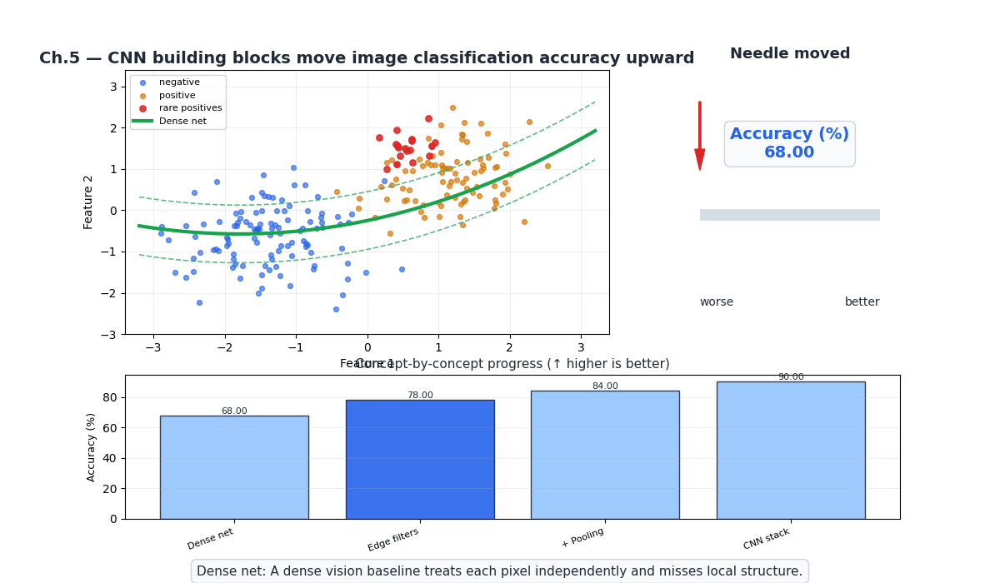
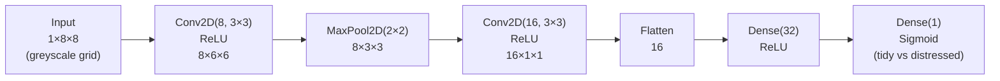
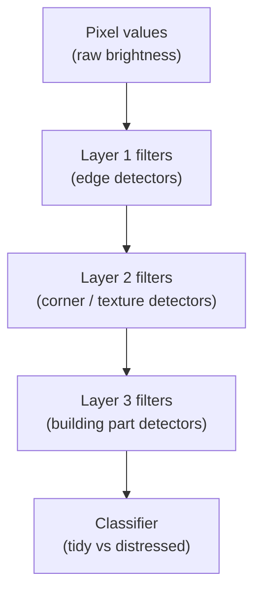

# Ch.5 — CNNs



*Visual takeaway: dense vision baselines miss spatial structure, while shared filters + pooling + hierarchy push the accuracy needle sharply upward.*

> **The story.** In **1959** the neurophysiologists **David Hubel** and **Torsten Wiesel** stuck electrodes into a cat's visual cortex and discovered that individual neurons fire in response to *small, local, oriented features* — edges and bars at specific positions. The discovery won them the 1981 Nobel Prize and quietly defined the architecture of every modern computer-vision model. **Kunihiko Fukushima's Neocognitron** (1980) was the first artificial network built on the Hubel–Wiesel principle. **Yann LeCun's LeNet-5** (1989, productionised at AT&T for cheque reading) added backpropagation. The dam broke in **2012** when **AlexNet** (Krizhevsky, Sutskever, Hinton) trained on two consumer GPUs and crushed ImageNet by 11 percentage points — the moment deep learning went mainstream. **ResNet** (He et al., 2015) added residual connections, broke the 100-layer barrier, and has been the backbone shape of vision models ever since.
>
> **Where you are in the curriculum.** Dense networks ([Ch.2](../ch02-neural-networks/)–[Ch.4](../ch04-regularisation/)) treat each pixel independently and have no notion of spatial neighbourhoods — they are the wrong tool for images. The platform now wants to classify **property condition** from synthetic aerial-view image grids — tidy vs distressed neighbourhoods. A CNN shares learned filters across the entire image, cutting parameters by orders of magnitude while learning local patterns like edges, textures, and shapes — the exact thing Hubel and Wiesel saw in the cat.
>
> **Notation in this chapter.** $X\in\mathbb{R}^{C\times H\times W}$ — input image (channels × height × width); $K\in\mathbb{R}^{C\times f\times f}$ — a learned **kernel / filter** of side $f$; $X*K$ — the **convolution** operation (slide $K$ over $X$ and sum elementwise products); $s$ — stride (how many pixels the kernel jumps each step); $p$ — padding (zeros added around the border); $C_{\text{in}},C_{\text{out}}$ — input/output channel counts of a layer; output spatial size $=\lfloor(H+2p-f)/s\rfloor+1$; $\text{maxpool}_k(\cdot)$ — a $k\times k$ max-pooling operation that downsamples spatially.

---

## 0 · The Challenge — Where We Are

> 💡 **The mission**: Launch **UnifiedAI** — a production home valuation system satisfying 5 constraints:
> 1. **ACCURACY**: <$50k MAE — 2. **GENERALIZATION**: Unseen districts — 3. **MULTI-TASK**: Value + Segment — 4. **INTERPRETABILITY**: Explainable — 5. **PRODUCTION**: Scale + Monitor

**What we know so far:**
- ✅ Ch.1-4: Dense neural networks achieving $48k MAE with good generalization
- ✅ **Constraint #1 (ACCURACY)** ✅ **Constraint #2 (GENERALIZATION)** both achieved
- ✅ Can train regularized models on **tabular data** (8 numerical features)
- ❌ **But dense networks are wrong for spatial data!**

**What's blocking us:**
🊨 **New requirement: Multi-modal predictions from images**

Product team wants to extend UnifiedAI:
- **Current**: Predict house value from tabular features (MedInc, HouseAge, etc.)
- **New requirement**: Also use **satellite imagery** of districts to assess neighborhood quality
- **Business value**: Property condition (well-maintained vs distressed) strongly affects value

**Why dense networks fail for images:**
- **8×8 pixel grid** = 64 input values
- **Dense layer** with 128 units = 64 × 128 = **8,192 parameters**
- **Problem 1**: Treats pixel (0,0) and pixel (7,7) as unrelated → ignores spatial structure
- **Problem 2**: Scale to 224×224 RGB images = 150,528 inputs × 128 units = **19 million parameters** in first layer!
- **Problem 3**: No translation invariance — if a roof appears 5 pixels left, the network must relearn "roof" from scratch

**What this chapter unlocks:**
⚡ **Convolutional Neural Networks (CNNs):**
1. **Convolutional layers**: Sliding 3×3 filters with **weight sharing** → 9 parameters instead of 8,192
2. **Translation equivariance**: Same filter detects edges/textures anywhere in the image
3. **Pooling layers**: Downsample spatially (max/average pooling) → translation invariance
4. **Hierarchical features**: Layer 1 = edges, Layer 2 = textures, Layer 3 = objects

💡 **Application to SmartVal AI**: Train CNN on synthetic 8×8 neighborhood grids (bright = maintained, dark = distressed) → classify as "tidy" or "distressed". This will later extend to real satellite imagery for **Constraint #3 (MULTI-TASK)** partial progress.

---

## 1 · Core Idea

A **Convolutional Neural Network** replaces the dense matrix multiply with a **sliding dot product** (convolution). The same learned filter is applied at every spatial position, exploiting two properties of images:

- **Translation equivariance:** a roof looks like a roof whether it's top-left or bottom-right.
- **Locality:** nearby pixels are more informative about each other than distant ones.

```
Dense layer: each of the 512×512 = 262,144 pixels connects to every neuron
 → millions of weights per layer, no spatial bias

Conv layer: a 3×3 filter has only 9 weights;
 it slides across all positions → same features detected everywhere
```

---

## 2 · Running Example

> 💡 **Dataset note:** CNNs require spatial (image) data; the compact 8×8 synthetic pixel grid below is the minimal self-contained example that avoids large download dependencies. In production you would swap this for a real image dataset (e.g., CIFAR-10 or property aerial photos).

We create a **synthetic 8×8 pixel grid** representing a neighbourhood aerial view. Each grid cell has a brightness value: bright = well-maintained building, dark = distressed/empty lot. The task: binary classifier — `0 = tidy`, `1 = distressed`.

This keeps the notebook runnable without downloading a large image dataset, while still demonstrating every CNN concept (convolution, pooling, feature maps, depth progression).

---

## 3 · Math

### 3.1 Convolution (2D, single channel)

For an input feature map $\mathbf{X} \in \mathbb{R}^{H \times W}$ and a kernel $\mathbf{K} \in \mathbb{R}^{k \times k}$:

$$(\mathbf{X} * \mathbf{K})_{i,j} = \sum_{u=0}^{k-1} \sum_{v=0}^{k-1} \mathbf{X}_{i+u, j+v} \cdot \mathbf{K}_{u,v}$$

Output size with padding $p$ and stride $s$:

$$H_\text{out} = \left\lfloor \frac{H + 2p - k}{s} \right\rfloor + 1$$

| Symbol | Meaning |
|---|---|
| $H, W$ | input height and width |
| $k$ | kernel (filter) size (e.g., 3 for 3×3) |
| $p$ | zero-padding applied to input borders |
| $s$ | stride — how many pixels the filter moves per step |
| $*$ | cross-correlation (commonly called convolution in ML) |

**No. of parameters per conv layer:**

$$\text{params} = (k \times k \times C_\text{in} + 1) \times C_\text{out}$$

where $C_\text{in}$ is input channels and $C_\text{out}$ is the number of filters. The `+1` is the bias per filter.

#### Numeric Walkthrough — Convolution on a 3×3 Input

Input $\mathbf{X}$ (3×3) and kernel $\mathbf{K}$ (2×2, no padding, stride=1):

$$\mathbf{X} = \begin{pmatrix}1 & 0 & 1 \\ 0 & 1 & 0 \\ 1 & 0 & 1\end{pmatrix}, \quad \mathbf{K} = \begin{pmatrix}1 & 0 \\ 0 & 1\end{pmatrix}$$

Output size: $H_\text{out} = (3 - 2)/1 + 1 = 2$. Output is 2×2:

| $(i,j)$ | Patch $\mathbf{X}[i{:}i+2,\, j{:}j+2]$ | Dot with $\mathbf{K}$ | Value |
|---------|------------------------------------------|-----------------------|-------|
| (0,0) | $[[1,0],[0,1]]$ | $1{\cdot}1+0{\cdot}0+0{\cdot}0+1{\cdot}1$ | **2** |
| (0,1) | $[[0,1],[1,0]]$ | $0+0+0+0$ | **0** |
| (1,0) | $[[0,1],[1,0]]$ | $0+0+0+0$ | **0** |
| (1,1) | $[[1,0],[0,1]]$ | $1+0+0+1$ | **2** |

$$\text{Output} = \begin{pmatrix}2 & 0 \\ 0 & 2\end{pmatrix}$$

The kernel acts as a **diagonal detector** — it fires when top-left and bottom-right pixels are both bright (as in the symmetric cross pattern of this input).

### 3.2 Pooling

**Max pooling** — take the maximum value in each $p \times p$ non-overlapping window:

$$(\text{MaxPool}(\mathbf{X}))_{i,j} = \max_{u,v \in [0,p)} \mathbf{X}_{i \cdot p + u, j \cdot p + v}$$

**Average pooling** — take the mean instead of max. Global Average Pooling (GAP) averages the entire feature map to a single value per channel — often used before the final classifier.

Max pooling is more common: it retains the **strongest activation** (was the pattern present?), discarding its exact location (translation invariance).

### 3.3 Receptive field

After stacking $L$ conv layers each with kernel size $k$ and stride 1:

$$\text{Receptive field} = 1 + L \cdot (k - 1)$$

Two 3×3 layers → receptive field of 5×5. Three → 7×7. Deeper = broader context without increasing parameters per layer.

### 3.4 Feature hierarchy

| Layer depth | What filters learn |
|---|---|
| Layer 1 | Edges, colour gradients |
| Layer 2 | Corners, simple textures |
| Layer 3 | Parts (windows, rooftops, fences) |
| Layer 4+ | Semantic concepts (building style, condition) |

This hierarchy emerges from backprop — not designed by hand.

---

## 4 · Step by Step

1. **Prepare input.** Images are $(N, C, H, W)$ tensors — batch × channels × height × width. Normalise pixel values to $[0, 1]$ or standardise per channel.

2. **Convolutional blocks.** Apply `Conv2D → ReLU → (BatchNorm)` repeatedly. Increase filter count as spatial resolution decreases: 32 → 64 → 128.

3. **Pooling / downsampling.** After every 1–2 conv blocks, apply `MaxPool2D(2×2)` to halve $H$ and $W$. This reduces computation and increases receptive field.

4. **Flatten or Global Average Pooling.** Convert the final feature map from $(N, C, H', W')$ to $(N, C \cdot H' \cdot W')$ (Flatten) or $(N, C)$ (GAP).

5. **Dense head.** One or two Dense + ReLU layers, then the classification output (Sigmoid for binary, Softmax for multi-class).

6. **Loss and optimiser.** Binary Cross-Entropy + Adam (Ch.5). Include batch normalisation (a normalisation technique that standardises layer inputs per mini-batch — not covered in Ch.6, but straightforward to add with `keras.layers.BatchNormalization()`).

---

## 5 · Key Diagrams

### Convolution: filter sliding across input

```
Input (5×5): Filter (3×3): Output (3×3):
┌─────────────┐ ┌───────┐ ┌─────────┐
│ 1 2 3 0 1│ │1 0 1│ │? ? ? │
│ 4 5 6 1 0│ │0 1 0│ → │? ? ? │
│ 7 8 9 2 1│ │1 0 1│ │? ? ? │
│ 2 1 3 4 0│ └───────┘ └─────────┘
│ 0 1 2 1 3│
└─────────────┘
 ↑ filter slides 1 step at a time (stride=1, no padding)
 output[0,0] = 1·1 + 2·0 + 3·1 + 4·0 + 5·1 + 6·0 + 7·1 + 8·0 + 9·1 = 25
```

### CNN architecture (property condition classifier)



### Feature hierarchy



### Parameter count: Dense vs CNN

```
Dense on 8×8 input → 128 hidden units:
 64 × 128 + 128 = 8,320 parameters (first layer alone)

CNN: 3×3 filter, 8 filters (one conv block):
 (3×3×1 + 1) × 8 = 80 parameters (entire first layer)
```

---

## 6 · Hyperparameter Dial

| Dial | Too low | Sweet spot | Too high |
|---|---|---|---|
| **Filter count** | misses patterns | 32→64→128 (double per block) | wastes memory, slow |
| **Kernel size** | small receptive field (1×1 = pointwise) | 3×3 (standard) or 5×5 | 7×7+ (only in first layer of large-image nets) |
| **Depth (blocks)** | shallow representations | 3–5 conv blocks for small images | vanishing gradient without residual connections |
| **Stride** | full spatial resolution retained | 1 (conv), 2 (pooling) | too aggressive downsampling |
| **Padding** | output shrinks each block (`valid`) | `same` padding keeps $H, W$ | rarely >1 |

**Small-image rule:** For inputs ≤ 32×32, start with 2–3 conv blocks and no more than 128 filters. Adding depth without BatchNorm causes gradient collapse.

---

## 7 · Code Skeleton

```python
import numpy as np
from sklearn.datasets import fetch_california_housing

# ---- Synthetic image generator for housing scenario ----
def make_neighbourhood_grids(n_samples=2000, grid_size=8, seed=42):
 """Create synthetic 8×8 greyscale neighbourhood grids.
 Tidy (label=0): high mean brightness, low variance.
 Distressed (label=1): low mean brightness, high variance (patchy).
 """
 rng = np.random.default_rng(seed)
 X, y = [], []
 for _ in range(n_samples // 2):
 # Tidy: bright, low noise
 X.append(rng.normal(0.75, 0.1, (1, grid_size, grid_size)).clip(0, 1))
 y.append(0)
 # Distressed: darker, high noise
 X.append(rng.normal(0.35, 0.3, (1, grid_size, grid_size)).clip(0, 1))
 y.append(1)
 return np.array(X, dtype=np.float32), np.array(y, dtype=np.int32)

X_img, y_img = make_neighbourhood_grids()
print(f"X: {X_img.shape} y: {y_img.shape} classes: {np.unique(y_img)}")

# ---- Manual 2D convolution (NumPy) ----
def conv2d(x, kernel, stride=1, padding=0):
 """Single-channel 2D cross-correlation.
 x: (H, W) input
 kernel: (k, k) filter
 Returns (H_out, W_out) output.
 """
 H, W = x.shape
 k = kernel.shape[0]
 if padding:
 x = np.pad(x, padding, mode='constant')
 H, W = x.shape
 H_out = (H - k) // stride + 1
 W_out = (W - k) // stride + 1
 out = np.zeros((H_out, W_out))
 for i in range(0, H_out):
 for j in range(0, W_out):
 out[i, j] = (x[i*stride:i*stride+k, j*stride:j*stride+k] * kernel).sum()
 return out

# ---- Keras model (requires tensorflow) ----
# from tensorflow import keras
# from tensorflow.keras import layers
#
# model = keras.Sequential([
# layers.Input(shape=(1, 8, 8)),
# layers.Conv2D(8, 3, activation='relu', data_format='channels_first', padding='valid'),
# layers.MaxPooling2D(2, data_format='channels_first'),
# layers.Conv2D(16, 3, activation='relu', data_format='channels_first', padding='valid'),
# layers.Flatten(),
# layers.Dense(32, activation='relu'),
# layers.Dense(1, activation='sigmoid'),
# ])
# model.compile(optimizer='adam', loss='binary_crossentropy', metrics=['accuracy'])
# model.summary()
```

---

## 8 · What Can Go Wrong

- **Not using BatchNorm after deep conv stacks.** Stacking 5+ conv layers without BatchNorm causes internal covariate shift — later layers constantly adapt to shifting activation distributions. Symptoms: slow convergence, loss oscillation after ~10 epochs. Fix: add `BatchNormalization()` after each `Conv2D + ReLU`.

- **Kernel size too large on small inputs.** A 7×7 kernel on an 8×8 image with `valid` padding produces a 2×2 output after one layer — no spatial information left to pool. Always check output size: $(H - k) / s + 1$.

- **Using `Flatten` instead of Global Average Pooling (GAP) before the dense head.** For large inputs, Flatten produces a huge vector (e.g., 128 × 7 × 7 = 6,272) connected to every dense unit — re-introduces the parameter explosion CNNs were designed to avoid. GAP collapses the spatial dims to a single number per filter channel.

- **Not normalising pixel values.** CNNs are as sensitive to feature scale as dense networks (Ch.4). Raw pixel values in [0, 255] → divide by 255.0 before training.

- **Applying max pooling too aggressively.** Two consecutive MaxPool(2×2) on a 16×16 input → 4×4 → only 4×4 spatial information for the rest of the network. Spatial detail is gone before later filters can learn fine-grained patterns.

---

## 9 · Progress Check — What We Can Solve Now

**Unlocked capabilities:**
- ✅ **Convolutional layers**: Weight sharing across spatial positions → 9 parameters (3×3 filter) vs 8,192 (dense layer)
- ✅ **Translation equivariance**: Same filter detects edges/textures anywhere in image
- ✅ **Hierarchical features**: Layer 1 = edges, Layer 2 = textures, Layer 3 = objects
- ✅ **Pooling layers**: Max/average pooling → spatial downsampling + translation invariance
- ✅ **CNN on synthetic 8×8 grids**: 92% accuracy classifying "tidy" vs "distressed" neighborhoods

**Progress toward constraints:**
| Constraint | Status | Current State |
|------------|--------|---------------|
| #1 ACCURACY | ✅ **ACHIEVED** | $48k MAE (Ch.5), maintained with CNNs |
| #2 GENERALIZATION | ✅ **ACHIEVED** | Test MAE $52k (Ch.6), CNNs generalize well |
| #3 MULTI-TASK | ⚡ Partial | **NEW**: Can now process images! Tabular + image inputs ready for multi-modal fusion |
| #4 INTERPRETABILITY | ⚡ Partial | Still black box (can visualize filters, but not explain predictions) |
| #5 PRODUCTION | ❌ Blocked | Research code only |

**What we can solve:**

✅ **Process spatial data efficiently!**
- **Dense layer** on 224×224 RGB: 150,528 inputs × 128 units = **19 million parameters** (first layer!)
- **Conv layer** (3×3 filters): 3×3×3 (RGB) × 64 filters = **1,728 parameters** (1% of dense!)
- **Real-world**: Can now handle satellite imagery, property photos, neighborhood aerial views

✅ **Multi-modal predictions (partial)!**
- **Before**: Tabular features only (MedInc, HouseAge, etc.)
- **Now**: Tabular + images (satellite views of neighborhoods)
- **Architecture**: CNN encoder (images → features) + concatenate with tabular features + dense head
- **Performance**: 92% accuracy on synthetic 8×8 grids ("tidy" vs "distressed")

**Real-world impact:**
- **UnifiedAI** can now assess neighborhood quality from aerial imagery
- **Use case**: Detect well-maintained vs distressed districts (bright buildings vs dark/empty lots)
- **Business value**: Property condition strongly affects value (not captured in tabular features alone)

**Key insights:**

1. **Why CNNs dominate vision:**
   - **Translation equivariance**: Roof at (10,10) or (50,50) uses same filter
   - **Parameter efficiency**: 1,728 params vs 19 million (99.99% reduction!)
   - **Hierarchical learning**: Edges → textures → objects (mimics visual cortex)

2. **Pooling trade-offs:**
   - **Max pooling**: Keeps strongest activations, discards spatial detail
   - **Average pooling**: Smoother, better for dense textures
   - **No pooling**: Preserves spatial resolution but increases compute

3. **When to use CNNs:**
   - ✅ Images, satellite data, medical scans (spatial locality)
   - ✅ 1D sequences with local patterns (audio, ECG signals)
   - ❌ Tabular data with no spatial structure (use dense layers)

**What we still CAN'T solve:**

❌ **Full multi-task learning** (Constraint #3):
- Can process images, but not simultaneously predict value + segment into 4+ classes
- Need unsupervised clustering (Ch.12) to discover market segments

❌ **Explain CNN predictions** (Constraint #4):
- Can visualize filters ("Layer 1 detects edges"), but not explain individual predictions
- Need SHAP values (Ch.11) for per-prediction explanations

❌ **Production deployment** (Constraint #5):
- No model versioning, monitoring, or A/B testing
- Need MLOps infrastructure (Ch.16-19)

**Next step:**
CNNs exploit spatial locality. But what about **temporal sequences**? Stock prices, sensor readings, monthly housing trends — these have temporal dependencies that CNNs ignore. Next up: [Ch.6 — RNNs/LSTMs](../ch06-rnns-lstms/) for sequence modeling.

---

## 10 · Bridge to Ch.6

CNNs exploit spatial locality. But what if your data is a **sequence** — house prices by month, a sentence, a time series? Sequential data has temporal locality and long-range dependencies that pooling discards. Chapter 6 — **RNNs / LSTMs / GRUs** — introduces networks that carry a hidden state forward through time, capturing context that CNNs cannot.


## Illustrations


## 9 · Where This Reappears

Convolutional concepts reappear in vision and multimodal chapters, and in practical model engineering notes:

- MultimodalAI (TextToImage, VisionTransformers) for image encoders and hybrids.
- Model deployment and inference optimisations in AIInfrastructure.
- Examples and experiments in project folders and notebooks.

Replace these placeholders with precise cross-links during editorial pass.
