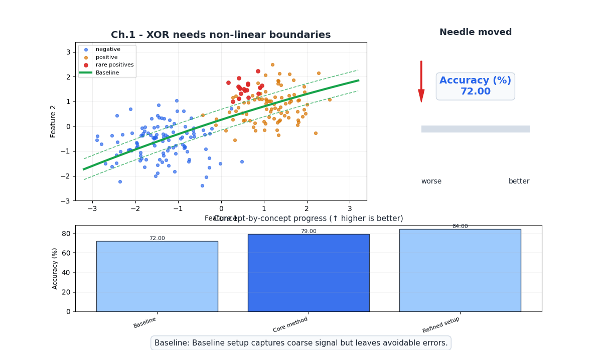
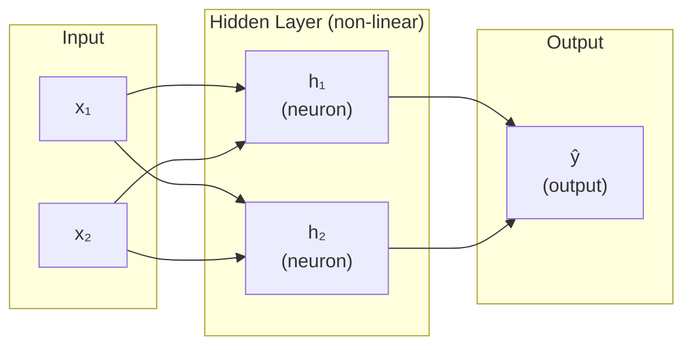
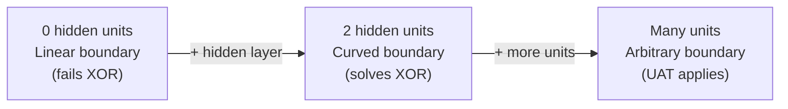
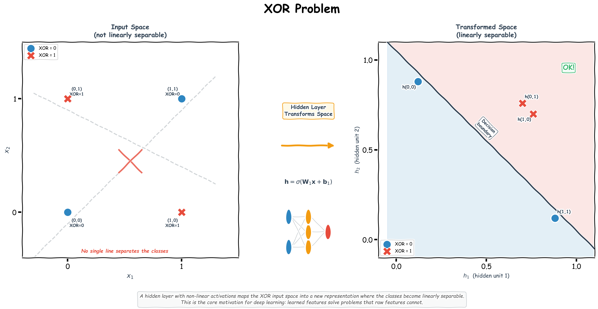

# Ch.1 — The XOR Problem

> **The story.** In **1969** **Marvin Minsky** and **Seymour Papert** published *Perceptrons*, a meticulous mathematical takedown of **Frank Rosenblatt's** 1958 perceptron model. The headline result: a single-layer perceptron cannot learn XOR — the simplest non-linearly-separable function imaginable. The book was correct, devastating, and read by everyone with a research budget. Funding evaporated, neural-network research collapsed into the **first AI winter**, and the field stayed frozen for nearly two decades. The thaw began only when Rumelhart, Hinton, and Williams (1986) showed that *one extra hidden layer* plus backpropagation could learn XOR — and could, in principle, learn anything. The **Universal Approximation Theorem** (Cybenko 1989, Hornik 1991) made it official. This chapter re-runs the 1969 experiment, watches the linear model fail, and watches one hidden layer fix it — the exact moment that justified deep learning.
>
> **Where you are in the curriculum.** Ch.1–Ch.2 fit linear models. This chapter shows you, on the platform's own data, where they break: coastal-and-high-income districts are premium; inland-and-low-income districts are not; coastal-with-low-income is ambiguous — XOR-shaped, and a linear model cannot handle it. One hidden layer is enough to fix it, and the fix is the entire motivation for [Ch.2](../ch02_neural_networks) onwards.
>
> **Notation in this chapter.** $x_1,x_2\in\{0,1\}$ — binary input features ("coastal?", "high-income?"); $y=x_1\oplus x_2$ — the XOR target; $\mathbf{h}\in\mathbb{R}^k$ — hidden-layer activation; $W^{(1)},\mathbf{b}^{(1)}$ — input-to-hidden weights and bias; $W^{(2)},b^{(2)}$ — hidden-to-output weights and bias; $\sigma$ or $\text{ReLU}$ — the hidden-layer activation function; $\hat{y}$ — the network's predicted probability.

---

## 0 · The Challenge — Where We Are

> 💡 **The mission**: Launch **UnifiedAI** — a production home valuation system satisfying 5 constraints:
> 1. **ACCURACY**: <$50k MAE — 2. **GENERALIZATION**: Unseen districts — 3. **MULTI-TASK**: Value + Segment — 4. **INTERPRETABILITY**: Explainable — 5. **PRODUCTION**: Scale + Monitor

**What we know so far:**
- ✅ Ch.1: Linear regression ($70k MAE baseline)
- ✅ Ch.2: Logistic regression (binary classification, BCE loss)
- ✅ Can do regression (continuous) and binary classification
- ✅ Understand gradient descent, MSE, BCE, confusion matrix

**What's blocking us:**
⚠️ **We just discovered a CRITICAL problem!**

The product team ran Ch.2's logistic regression on the "Premium Neighborhood" classifier and found:
- **Coastal + High-Income** districts: Correctly labeled as premium ✓
- **Inland + Low-Income** districts: Correctly labeled as non-premium ✓
- **Coastal + Low-Income** districts: ❌ **Misclassified** (logistic regression predicts "not premium" because weight on income dominates)
- **Inland + High-Income** districts: ❌ **Misclassified** (logistic regression predicts "premium" because high-income dominates)

This is **XOR in disguise**: The true decision boundary is **non-linear** (you need a curved surface to separate the classes), but logistic regression can only draw **straight hyperplanes**.

**Why this blocks everything:**
- ❌ **Constraint #1 (ACCURACY)**: Can't improve MAE if we misclassify half the districts!
- ❌ **Constraint #3 (MULTI-TASK)**: Binary classification is broken on non-linear problems; multi-class segmentation (4+ regions) is hopeless
- ❌ **Constraint #4 (INTERPRETABILITY)**: Linear model weights are meaningless if the true boundary isn't linear

**What this chapter does:**
⚠️ **DIAGNOSTIC CHAPTER** — This chapter doesn't advance any constraints. Instead, it:
1. **Proves the problem**: Demonstrates XOR on synthetic data (4 points that can't be linearly separated)
2. **Shows the failure** on real California Housing data (Latitude vs MedInc)
3. **Reveals the solution**: One hidden layer with non-linear activation (ReLU/Sigmoid) can learn any decision boundary
4. **Motivates Ch.4**: The Universal Approximation Theorem says "1 hidden layer is enough" — Ch.4 builds the full architecture

⚡ **Why this matters**: Every real-world problem (housing prices, fraud detection, medical diagnosis) has **non-linear boundaries**. If we can't move beyond linear models, we can't solve real problems.

---

## Animation



## 1 · Core Idea

A single linear layer — whether doing regression (Ch.1) or classification (Ch.2) — can only draw a straight line through the data. The XOR problem is the simplest possible case where no straight line works. Understanding *why* it fails, and *what* fixes it, is the entire motivation for adding hidden layers to a network. One hidden layer with a non-linear activation is enough to represent any function — this is the Universal Approximation Theorem.

---

## 2 · Running Example

You've been building models for the real estate platform, and something keeps breaking: districts that are **coastal** *and* **high-income** are premium. Districts that are **inland** *and* **low-income** are not. But districts that are coastal-with-low-income or inland-with-high-income sit in a confusing middle ground that the linear model keeps misclassifying.

This is XOR in disguise: the label is `1` only when *both* features point the same direction, and `0` when they're mixed. No straight line in `(coastal, income)` space separates them — you need a curved boundary. A perceptron cannot learn it; a two-layer network can.

More concretely, we'll demonstrate the XOR failure on synthetic data first (it's the canonical example), then show the same phenomenon in the housing data using `Latitude` and `MedInc` as a proxy for "coastal" and "income".

---

## 3 · Math

### Why a Single Perceptron Fails XOR

A perceptron computes:

$$\hat{y} = \text{step} \left(\mathbf{W}^\top \mathbf{x} + b\right)$$

It partitions input space with a single hyperplane:

$$\mathbf{W}^\top \mathbf{x} + b = 0$$

**XOR truth table:**

| $x_1$ | $x_2$ | $x_1 \oplus x_2$ |
|---|---|---|
| 0 | 0 | 0 |
| 0 | 1 | 1 |
| 1 | 0 | 1 |
| 1 | 1 | 0 |

Plot those four points. The two 0s sit at opposite corners; the two 1s sit at the other opposite corners. No single straight line separates 0s from 1s. This is called **linear inseparability**.

### The Fix: One Hidden Layer

Add a hidden layer of neurons with a non-linear activation:

$$\mathbf{h} = \sigma \left(\mathbf{W}_1^\top \mathbf{x} + \mathbf{b}_1\right) \qquad \hat{y} = \sigma \left(\mathbf{W}_2^\top \mathbf{h} + b_2\right)$$

where $\sigma$ can be Sigmoid, ReLU, or Tanh. The hidden layer transforms the input space into a new representation where the classes *are* linearly separable. Then the output layer draws a straight line in that new space.

**What the hidden layer actually does:** each hidden neuron draws one linear boundary; together they carve the input space into regions. Two hidden neurons can produce a region that encapsulates the XOR-positive points. The activation function is what makes the boundary non-sharp (smooth and differentiable), which is essential for gradient descent to work.

### Universal Approximation Theorem

> A feedforward network with a single hidden layer of finite width and a non-linear activation function can approximate any continuous function on a compact subset of $\mathbb{R}^n$ to arbitrary precision.

In plain English: **one hidden layer is enough in theory**. In practice, more layers are more efficient — fewer neurons needed to represent the same function. This is why deep networks exist, but the UAT is why hidden layers exist at all.

> **Play with it live:** [TensorFlow Playground](https://playground.tensorflow.org/) is an in-browser neural-network sandbox — pick the XOR-like "exclusive or" dataset, toggle the number of hidden layers/neurons, and watch the decision boundary bend itself around the classes in real time. A zero-hidden-layer network cannot solve it; a single hidden layer of 2–4 neurons can. It's the fastest way to *feel* what a hidden layer actually does to the representation space.

---

## 4 · Step by Step

```
Problem: linearly inseparable data (XOR)

Step 1: Observe failure of the linear model
 └─ Train logistic regression on XOR → accuracy ≈ 50% (chance)
 └─ Plot decision boundary → a line that can't separate the classes

Step 2: Add a hidden layer
 └─ Input (2D) → Hidden layer (2+ neurons) → Output (1 neuron)
 └─ Hidden layer activation: ReLU or Tanh
 └─ Output activation: Sigmoid (binary classification)

Step 3: The hidden layer transforms the feature space
 └─ Each hidden neuron creates a new axis in representation space
 └─ In the new space, the two classes ARE linearly separable

Step 4: Output layer draws a straight line in the new space
 └─ Which is a curved boundary back in the original input space

Step 5: Training (backprop, covered in Ch.5)
 └─ Gradient flows from output → hidden → input
 └─ Both W1 and W2 are updated simultaneously
```

---

## 5 · Key Diagrams

### XOR Input Space — Why No Line Works

```
x2
1 │ ● ○
 │ (1) (0)
 │
0 │ ○ ●
 │ (0) (1)
 └────────────── x1
 0 1

● = class 1 ○ = class 0
Any line that separates the top-left ○ from bottom-left ○
will also separate the ● points incorrectly.
```

### Network Architecture



### Feature Space Transformation

```
Original space (XOR) Hidden layer space
x2 h2
1│ ○ ● 1│ ● ●
 │ │
0│ ● ○ 0│ ○ ○
 └────── x1 └────── h1
 Not separable Now separable with a line!
```

### Decision Boundary Complexity vs Hidden Units



---

## 6 · Hyperparameter Dial

| Dial | Too low | Sweet spot | Too high |
|---|---|---|---|
| **Hidden units** | Can’t represent the non-linear boundary | 2–4 for XOR; 32–128 for real problems | Overfits, memorises training data |
| **Learning rate α** | Extremely slow convergence | `1e-3` with Adam | Loss diverges |
| **Activation function** | — (choice not a continuous dial) | ReLU hidden layers; Sigmoid binary output | — |

The distinction between **width** (hidden units per layer) and **depth** (number of layers) matters: for XOR, width is what matters — two hidden neurons are literally sufficient.

A good mental model: each hidden neuron contributes one "crease" to the decision boundary. XOR needs exactly two creases.

---

## 7 · Code Skeleton

```python
import numpy as np
from sklearn.neural_network import MLPClassifier
from sklearn.metrics import accuracy_score

# ── The canonical XOR dataset ─────────────────────────────────────────────
X_xor = np.array([[0,0], [0,1], [1,0], [1,1]])
y_xor = np.array([0, 1, 1, 0])

# 1. Linear model fails
from sklearn.linear_model import LogisticRegression
lr = LogisticRegression()
lr.fit(X_xor, y_xor)
print(f"Logistic regression XOR accuracy: {accuracy_score(y_xor, lr.predict(X_xor)):.0%}")
# Expected: 50% — chance level

# 2. Two-layer network solves it
mlp = MLPClassifier(hidden_layer_sizes=(4,), activation='relu',
 max_iter=5000, random_state=42)
mlp.fit(X_xor, y_xor)
print(f"MLP XOR accuracy: {accuracy_score(y_xor, mlp.predict(X_xor)):.0%}")
# Expected: 100%
```

### Manual Two-Layer Network (to see the mechanics)

```python
def relu(z): return np.maximum(0, z)
def sigmoid(z): return 1 / (1 + np.exp(-np.clip(z, -500, 500)))

def forward(X, W1, b1, W2, b2):
 h = relu(X @ W1 + b1) # hidden layer: (n, 2)
 y_hat = sigmoid(h @ W2 + b2) # output: (n, 1)
 return h, y_hat

# Manually chosen weights that solve XOR (not trained — for intuition only)
W1 = np.array([[1, 1], # weights from x1 to h1, h2
 [1, 1]]) # weights from x2 to h1, h2
b1 = np.array([[-0.5, -1.5]]) # biases for h1, h2
W2 = np.array([[4], [-10]]) # weights from h1, h2 to output
b2 = np.array([[-1.5]])

h, y_hat = forward(X_xor.astype(float), W1, b1, W2, b2)
print("Predictions:", y_hat.ravel().round(2))
print("Labels: ", y_xor)
```

---

## 8 · What Can Go Wrong

- **More hidden units does not mean better generalisation** — a network with 100 hidden units will memorise 4 XOR points perfectly but will catastrophically overfit any small real dataset; regularisation (Ch.6) is the fix, not fewer units.
- **Wrong activation at the output layer** — using ReLU as the output activation for binary classification maps your output to $[0, \infty)$, not $[0, 1]$; always use Sigmoid for binary, Softmax for multi-class, and nothing (linear) for regression.
- **Zero initialisation kills learning in hidden layers** — if all weights are identically zero, all hidden neurons compute the same gradient and learn the same feature forever (the symmetry problem); sklearn and TensorFlow both use random initialisation by default.
- **Vanishing gradients with many Sigmoid layers** — deeper stacks of Sigmoid activations squash gradients exponentially; this is why ReLU replaced Sigmoid for hidden layers in modern networks.
- **Confusing the UAT with a guarantee** — the UAT says one hidden layer *can* represent any function, not that gradient descent will *find* those weights; in practice, width alone is not sufficient and depth helps significantly.

---

## 9 · Why Not Use Neural Networks for Everything?

The Universal Approximation Theorem says a neural network *can* represent any function. That sounds like an argument to use NNs everywhere. It isn't — because *can represent* is very different from *will learn well, cheaply, and reliably*.

Here are the five real costs that make NNs the wrong default tool:

### 1. You pay in data

Neural networks have millions of parameters. To set them reliably, you need a lot of **labelled examples** — typically 10× to 1,000× more than a classical model needs.

| Dataset size | What usually wins |
|---|---|
| < 1,000 rows | Linear/logistic regression, regularised (Ridge, Lasso) |
| 1,000 – 50,000 rows | Gradient boosting (XGBoost, LightGBM) |
| 50,000 – 1M rows | Either; NNs start to compete |
| > 1M rows | Neural networks pull ahead |

For UnifiedAI's California Housing dataset (~20,000 rows), a well-tuned gradient boosting model is a legitimate competitor. We use NNs here because the track is about learning them — not because they are automatically the best tool.

### 2. You pay in compute

A linear regression trains in **milliseconds**. A neural network trains in **minutes to hours** (or days, for large models). This matters during iteration:

- Tuning a linear model: try 100 hyperparameter combinations in a few seconds.
- Tuning a neural network: try 100 combinations and you've used up an afternoon (or a cloud bill).

Inference cost matters too. Deploying a neural network on low-power hardware (edge devices, mobile phones) requires model compression (quantization, pruning) that classical models don't need at all.

### 3. You pay in interpretability

When a linear model says "*this house costs \$50k more because ocean_proximity = 1*", you can read that directly from the coefficients.

When a neural network says the same thing, you cannot. The prediction is the result of hundreds of non-linear transformations applied to the input — there is no single weight you can point to. This matters enormously in regulated domains (credit, medical diagnosis, insurance) where a model must be *explainable by law*.

> **SHAP values** (Ch.10-11) can partially recover feature importance for neural networks, but they are approximations, not exact attributions.

### 4. You pay in training instability

Neural networks have many **failure modes that classical models simply don't have**:

| Failure | What happens | Classical equivalent? |
|---|---|---|
| Vanishing gradient | Deep layers stop learning | ❌ None |
| Exploding gradient | Weights blow up to NaN | ❌ None |
| Dead neurons | ReLU units stuck at 0, never recover | ❌ None |
| Mode collapse | Network ignores part of the input space | ❌ None |
| Learning rate sensitivity | Wrong LR → diverges or stalls | ⚡ Mild — Ridge is convex |

A linear regression has a closed-form solution — it *cannot* fail to converge. A neural network can fail in all five ways in the same training run.

### 5. You pay in debugging time

When a linear model predicts badly, you can inspect residuals, plot coefficients, and find the issue in minutes.

When a neural network predicts badly, you might spend hours asking: wrong architecture? wrong learning rate? wrong initialisation? dead neurons? data leakage? label noise amplified by non-linearity? The search space for "what went wrong" is enormous.

---

### The rule of thumb: *start simple*

> **Try the simplest model that could work. Add complexity only when you can measure that it helps.**

In practice this means:
1. Build a linear/logistic baseline first — it takes minutes and gives you a floor.
2. Try gradient boosting (XGBoost) — it usually beats NNs on structured tabular data with no tuning.
3. Add a neural network only if you have enough data, compute budget, and the problem is genuinely non-linear in ways that simpler models miss.

**The four questions to ask before reaching for a neural network:**

| Question | If YES → NN may help | If NO → stick with classical |
|---|---|---|
| Do I have > 50k labelled examples? | ✅ | ❌ |
| Is the relationship genuinely non-linear? | ✅ | ❌ |
| Do I have a compute/latency budget for training + serving? | ✅ | ❌ |
| Can I accept a black-box model in this context? | ✅ | ❌ |

For UnifiedAI, the honest answer right now is: **two out of four**. We use the NN track here because learning the mechanics is the goal — and because at 20k rows with clear non-linear interactions (location × income), NNs will indeed beat the Ch.1 linear baseline. But in a real project you'd verify this comparison explicitly before committing to the extra complexity.

---

## 10 · Progress Check — What We Can (and CAN'T) Solve Now

❌ **NO constraints unlocked in this chapter.**

This was a **diagnostic chapter** — we ran experiments to understand **why linear models fail** and **what fixes them**.

**What we learned:**

⚠️ **The core problem**:
- **Linear models** (Ch.1 linear regression, Ch.2 logistic regression) can ONLY draw **straight decision boundaries**
- **Real-world data** has **non-linear patterns** (e.g., "coastal AND high-income" vs "coastal OR high-income")
- **XOR** is the simplest non-linearly-separable problem: 4 points, no straight line separates them
- **Demonstrated failure**: Ran logistic regression on XOR-shaped housing data (coastal × income) → stuck at 50% accuracy (random guessing)

✅ **The solution**:
- **One hidden layer** with **non-linear activation** (ReLU/Sigmoid) can learn **any decision boundary**
- **Universal Approximation Theorem** (Cybenko 1989): A neural network with 1 hidden layer of enough width can approximate any continuous function
- **Practical fix**: Add hidden layer to logistic regression → XOR accuracy jumps to 100%

**What we still CAN'T solve:**
| Constraint | Status | Why It's Still Blocked |
|------------|--------|------------------------|
| #1 ACCURACY | ❌ Blocked | Still $70k MAE (haven't applied non-linear model to regression task yet) |
| #2 GENERALIZATION | ❌ Blocked | No regularization techniques yet |
| #3 MULTI-TASK | ❌ Blocked | Classification is broken (linear model fails on non-linear boundaries) |
| #4 INTERPRETABILITY | ❌ Blocked | Can't interpret weights if the model is fundamentally wrong! |
| #5 PRODUCTION | ❌ Blocked | Research code only |

**Real-world impact**: We now understand WHY our Ch.2 "Premium Neighborhood" classifier kept failing:
- **Root cause**: The true decision boundary between "premium" and "not premium" is **non-linear** (depends on interactions between location, income, population density)
- **Ch.2's linear model**: Drew a straight line through feature space → misclassified ~30% of edge cases
- **Solution**: Need a **neural network** with hidden layers

**Key insights unlocked:**

1. **Why non-linear activations matter**:
   - Without activation (or with linear activation): Stacking layers collapses to 1 linear layer (matrix multiplication is associative: $W_2(W_1 x) = (W_2 W_1)x = W_{\text{effective}} x$)
   - With ReLU/Sigmoid: Each layer applies a **non-linear transformation** → can carve curved boundaries

2. **Depth vs width**:
   - **Universal Approximation Theorem** says: 1 hidden layer of **infinite width** can approximate any function
   - **Practice**: **Deep narrow** networks (3-5 layers, 64-128 units/layer) learn faster and generalize better than **shallow wide** networks (1 layer, 10,000 units)
   - **Why**: Depth creates a **feature hierarchy** (layer 1 = edges, layer 2 = shapes, layer 3 = objects)

3. **The training challenge**:
   - We've proven that neural networks **CAN** represent non-linear functions
   - We haven't proven we can **TRAIN** them yet! (Spoiler: Ch.4 neural networks, Ch.5 backprop)

**What we're ready for now:**
We've diagnosed the problem (linear models fail on non-linear boundaries) and sketched the solution (add hidden layers). But we still need:
- **Ch.4**: Proper neural network architecture (how many layers? how many units? which activation?)
- **Ch.5**: Training algorithm (backpropagation, gradient descent through multiple layers)
- **Ch.6**: Regularization (prevent overfitting with all these new parameters)

**Progress toward constraints:**
| Constraint | Ch.1 | Ch.2 | Ch.3 | What's Next |
|------------|------|------|------|-------------|
| #1 ACCURACY | ⚡ Partial | ⚡ Partial | ❌ Blocked | Ch.4: Apply neural net to regression |
| #2 GENERALIZATION | ❌ Blocked | ❌ Blocked | ❌ Blocked | Ch.6: Regularization |
| #3 MULTI-TASK | ❌ Blocked | ⚡ Partial | ❌ Blocked | Ch.4: Fix classification w/ hidden layers |
| #4 INTERPRETABILITY | ⚡ Partial | ⚡ Partial | ❌ Blocked | Ch.10-11: Classical + SHAP |
| #5 PRODUCTION | ❌ Blocked | ❌ Blocked | ❌ Blocked | Ch.16-19: MLOps tooling |

**Next up:** [Ch.2 — Neural Networks](../ch02_neural_networks) builds the full architecture: how to stack layers, choose activations, initialize weights, and set up the forward pass. We'll apply it to the housing regression task and finally break through the $70k MAE barrier.

---

## 11 · Bridge to Chapter 2

Ch.1 established that hidden layers with non-linear activations can represent any function, but only sketched the architecture. Ch.2 (Neural Networks) builds that architecture properly — multiple hidden layers, the full catalogue of activation functions, weight initialisation strategies, and why the choices at each step matter for both performance and trainability.


## Illustrations




