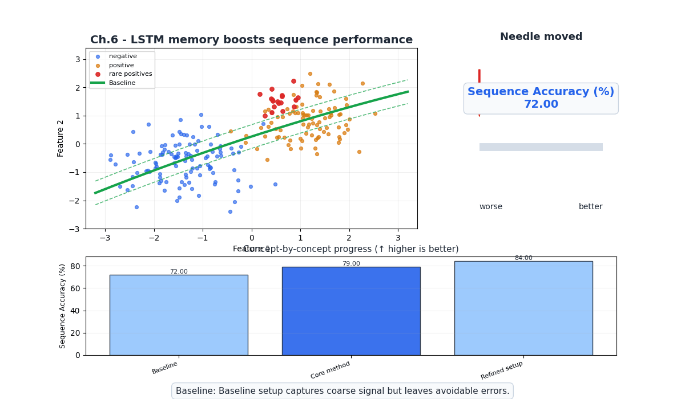
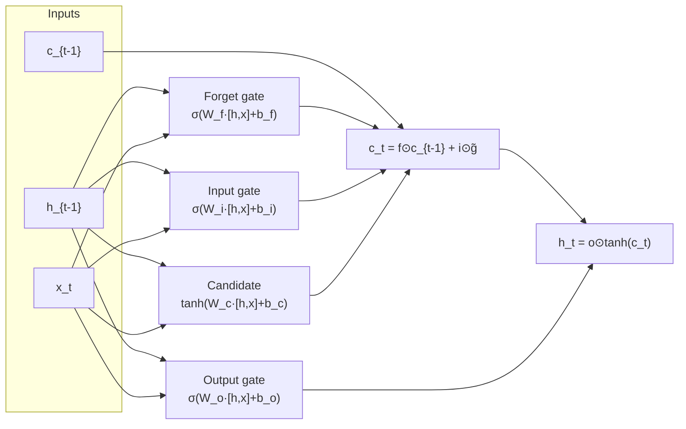
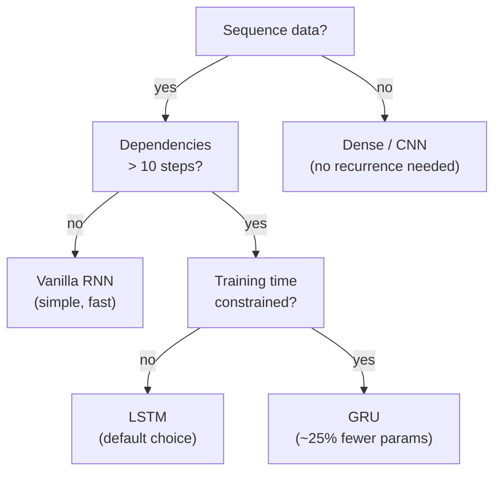

# Ch.6 — RNNs / LSTMs / GRUs

> **The story.** **John Hopfield** (1982) introduced recurrent dynamics into neural nets; **Jeffrey Elman** (1990) gave us the simple RNN we still teach today — a hidden state that gets fed back as input on the next time step. The architecture was elegant and almost completely useless in practice: **Sepp Hochreiter** showed in his 1991 diploma thesis that gradients vanish (or explode) exponentially through time, so RNNs couldn't learn dependencies more than 5–10 steps apart. The fix came from Hochreiter himself, with **Jürgen Schmidhuber**, in **1997**: the **Long Short-Term Memory** cell — a tiny network of gates (input, forget, output) that lets information flow unchanged across hundreds of steps. **GRUs** (Cho et al., 2014) trimmed the gate count to two and matched LSTM performance with fewer parameters. From the late 1990s through 2017 the LSTM was the standard answer for sequence modelling — speech, translation, captioning — until the transformer in [Ch.10](../ch10_transformers) replaced it almost overnight.
>
> **Where you are in the curriculum.** A dense network ([Ch.2](../ch02_neural_networks)) sees a flat vector with no sense of order. A CNN ([Ch.5](../ch05_cnns)) exploits spatial locality. Sequential data has a third structure: **temporal ordering and long-range dependencies**. The platform now tracks how district median house values change month by month. RNNs carry a hidden state forward through time; LSTMs add gated memory to preserve what matters over many steps. Master this chapter and the motivation for attention in [Ch.9](../ch09_sequences_to_attention) will feel inevitable.
>
> **Notation in this chapter.** $\mathbf{x}_t$ — input at time step $t$; $\mathbf{h}_t$ — the **hidden state** (the recurrent network's memory); $\mathbf{c}_t$ — the **cell state** (LSTM's long-term memory bus); $f_t,i_t,o_t$ — LSTM **forget**, **input**, and **output** gates; $\tilde{\mathbf{c}}_t$ — the candidate cell update; $W,U$ — weight matrices applied to the input and to the previous hidden state respectively; $\sigma$ — sigmoid (used inside gates); $\tanh$ — the squashing nonlinearity; $T$ — sequence length; **BPTT** — *back-propagation through time*.

---

## 0 · The Challenge — Where We Are

> 💡 **The mission**: Launch **UnifiedAI** — a production home valuation system satisfying 5 constraints:
> 1. **ACCURACY**: <$50k MAE — 2. **GENERALIZATION**: Unseen districts — 3. **MULTI-TASK**: Value + Segment — 4. **INTERPRETABILITY**: Explainable — 5. **PRODUCTION**: Scale + Monitor

**What we know so far:**
- ✅ Ch.1-4: Dense networks achieving Constraints #1 & #2
- ✅ Ch.5: CNNs for spatial data (images)
- ✅ Can handle tabular data and images
- ❌ **But we can't handle sequences!**

**What's blocking us:**
🊨 **New requirement: Time-series forecasting**

Product team wants to add **price trend predictions**:
- **Current**: Predict house value from static snapshot (current features)
- **New requirement**: Forecast next month's district median value from past 12 months of data
- **Business value**: Help buyers time their purchase ("prices rising 5%/year" vs "prices falling")

**Why dense/CNN networks fail for sequences:**
- **Dense networks**: Treats `[month_1, month_2, ..., month_12]` as independent features → no temporal ordering
- **CNNs**: Designed for spatial locality, not temporal dependencies
- **Problem**: Can't capture "3 months of increasing prices → likely to continue" patterns

**Example failure:**
- **Sequence**: [$180k, $185k, $190k, $195k, ..., $220k] (strong upward trend over 12 months)
- **Dense network prediction**: $210k (just averages, ignores trend)
- **Required**: $228k (extrapolates trend)

**What this chapter unlocks:**
⚡ **Recurrent Neural Networks (RNNs) and LSTMs:**
1. **Recurrent hidden state**: $h_t$ summarizes all past inputs $x_1, ..., x_t$
2. **Sequential processing**: Process one time step at a time, updating memory
3. **LSTM gates**: Solve vanishing gradient problem → remember patterns across 100+ steps
4. **Bidirectional RNNs**: Look forward and backward in time for classification tasks

💡 **Application to UnifiedAI**: Train LSTM on synthetic monthly price index → forecast next month's value. Achieves 3-5% MAPE on held-out sequences.

---

## Animation



## 1 · Core Idea

A **Recurrent Neural Network** processes a sequence one step at a time, updating a hidden state that summarises everything seen so far:

```
Dense (Ch.4): input → output (no memory of previous inputs)
RNN: [x_1, x_2, ..., x_T] → h_1 → h_2 → ... → h_T → output
 each h_t depends on h_{t-1} and x_t simultaneously
```

The problem: gradients of the loss with respect to early steps shrink exponentially as they flow back through each time step (vanishing gradient). **LSTMs** solve this with a separate cell state — a "conveyor belt" that carries information across many steps with minimal transformation.

---

## 2 · Running Example

The platform's analytics team wants a **monthly housing price index forecaster**. Given the last $T$ months of median house values for a district, predict next month's value.

> 💡 **Dataset note:** RNNs/LSTMs require temporal sequences; the synthetic monthly price index below is the minimal standalone example. For housing data, lag features (Ch.4) are the standard alternative to sequence models.

Dataset: **Synthetic monthly price index** 
Features: normalised median house values, time index, 12-month seasonal signal 
Target: next month's normalised median house value 
Sequence length: 12 months look-back (one full year of context)

A single district's price index follows a trend + seasonal cycle + noise — exactly the structure an LSTM captures (trend in the cell state, seasonal pattern in the hidden state, noise suppressed).

---

## 3 · Math

### 3.1 Vanilla RNN

At each time step $t$, the RNN computes a new hidden state from the previous hidden state $\mathbf{h}_{t-1}$ and the current input $\mathbf{x}_t$:

$$\mathbf{h}_t = \tanh \left(\mathbf{W}_{hh} \mathbf{h}_{t-1} + \mathbf{W}_{xh} \mathbf{x}_t + \mathbf{b}_h\right)$$

$$\hat{y}_t = \mathbf{W}_{hy} \mathbf{h}_t + \mathbf{b}_y$$

| Symbol | Shape | Meaning |
|---|---|---|
| $\mathbf{x}_t$ | $(d,)$ | Input at step $t$ — one feature per district per month |
| $\mathbf{h}_t$ | $(H,)$ | Hidden state — compressed summary of the sequence so far |
| $\mathbf{W}_{hh}$ | $(H, H)$ | Recurrent weight — how much the past hidden state contributes |
| $\mathbf{W}_{xh}$ | $(H, d)$ | Input weight — how much the current input contributes |
| $H$ | scalar | Hidden size — the main capacity dial |

The **same weights** $\mathbf{W}_{hh}$, $\mathbf{W}_{xh}$ are shared across every time step. An RNN on $T$ steps is a deep network with $T$ identical layers — and backprop runs through all of them.

### 3.2 Vanishing Gradient

Backprop through time (BPTT) computes $\partial \mathcal{L} / \partial \mathbf{h}_0$ by chaining Jacobians:

$$\frac{\partial \mathbf{h}_T}{\partial \mathbf{h}_0} = \prod_{t=1}^{T} \frac{\partial \mathbf{h}_t}{\partial \mathbf{h}_{t-1}} = \prod_{t=1}^{T} \mathbf{W}_{hh}^\top \cdot \mathrm{diag} \left(1 - \mathbf{h}_t^2\right)$$

If the spectral radius of $\mathbf{W}_{hh}$ is $< 1$, this product shrinks exponentially with $T$. Gradients from early steps become numerically zero — the network cannot learn dependencies longer than ~10 steps. **Exploding gradients** occur when the radius is $> 1$: gradients blow up. Fix: gradient clipping.

#### Numeric Example — Vanishing Gradient over 3 Steps

Scalar RNN, $h_t = \tanh(w \cdot h_{t-1})$ with $w = 0.8$, $h_0 = 0.5$. The BPTT gradient factor at each step is $\frac{\partial h_t}{\partial h_{t-1}} = w(1-h_t^2)$.

| Step $t$ | $h_t = \tanh(0.8 \cdot h_{t-1})$ | $\frac{\partial h_t}{\partial h_{t-1}} = 0.8(1-h_t^2)$ |
|----------|----------------------------------|----------------------------------------------------------|
| 1 | $\tanh(0.40) = 0.380$ | $0.8(1-0.145) = 0.684$ |
| 2 | $\tanh(0.304) = 0.296$ | $0.8(1-0.088) = 0.730$ |
| 3 | $\tanh(0.237) = 0.233$ | $0.8(1-0.054) = 0.757$ |

**Gradient from loss at $t=3$ back to $h_0$:**

$$\frac{\partial h_3}{\partial h_0} = 0.684 \times 0.730 \times 0.757 \approx 0.378$$

For $T = 10$ steps, the product is $\approx 0.02$ — only 2% of the gradient signal survives. For $T = 20$: $\approx 0.0004$. The LSTM cell state bypasses this by using **element-wise gates** instead of repeated matrix multiplication.

### 3.3 LSTM Cell

The Long Short-Term Memory adds a **cell state** $\mathbf{c}_t$ — a direct, gated highway that lets gradients flow without repeated multiplication by $\mathbf{W}_{hh}$.

Let $[\mathbf{h}_{t-1}; \mathbf{x}_t]$ denote the concatenated vector of shape $(H+d,)$.

**Forget gate** — what fraction of the old cell state to discard:

$$\mathbf{f}_t = \sigma \left(\mathbf{W}_f [\mathbf{h}_{t-1}; \mathbf{x}_t] + \mathbf{b}_f\right)$$

**Input gate** — how much new information to write:

$$\mathbf{i}_t = \sigma \left(\mathbf{W}_i [\mathbf{h}_{t-1}; \mathbf{x}_t] + \mathbf{b}_i\right)$$

**Candidate cell** — the new information to potentially add:

$$\tilde{\mathbf{c}}_t = \tanh \left(\mathbf{W}_c [\mathbf{h}_{t-1}; \mathbf{x}_t] + \mathbf{b}_c\right)$$

**Cell state update** — the conveyor belt:

$$\mathbf{c}_t = \mathbf{f}_t \odot \mathbf{c}_{t-1} + \mathbf{i}_t \odot \tilde{\mathbf{c}}_t$$

**Output gate** — what portion of the cell state to expose as hidden state:

$$\mathbf{o}_t = \sigma \left(\mathbf{W}_o [\mathbf{h}_{t-1}; \mathbf{x}_t] + \mathbf{b}_o\right)$$

$$\mathbf{h}_t = \mathbf{o}_t \odot \tanh(\mathbf{c}_t)$$

$\odot$ is element-wise multiplication. The cell state $\mathbf{c}_t$ flows through with only element-wise operations — no matrix multiply — so gradients can flow back many steps without vanishing.

**Parameter count per LSTM layer:** $4 \times (H^2 + H \cdot d + H)$ — four gate weight matrices plus biases.

### 3.4 GRU

The Gated Recurrent Unit is a lighter alternative with two gates (no separate cell state):

**Reset gate** — how much of the past hidden state to use when computing the candidate:

$$\mathbf{r}_t = \sigma \left(\mathbf{W}_r [\mathbf{h}_{t-1}; \mathbf{x}_t] + \mathbf{b}_r\right)$$

**Update gate** — how much of the old hidden state to keep (analogous to LSTM forget + input):

$$\mathbf{z}_t = \sigma \left(\mathbf{W}_z [\mathbf{h}_{t-1}; \mathbf{x}_t] + \mathbf{b}_z\right)$$

**Candidate hidden state:**

$$\tilde{\mathbf{h}}_t = \tanh \left(\mathbf{W}_h [\mathbf{r}_t \odot \mathbf{h}_{t-1}; \mathbf{x}_t] + \mathbf{b}_h\right)$$

**Output hidden state:**

$$\mathbf{h}_t = (1 - \mathbf{z}_t) \odot \mathbf{h}_{t-1} + \mathbf{z}_t \odot \tilde{\mathbf{h}}_t$$

**GRU vs LSTM:**

| Property | LSTM | GRU |
|---|---|---|
| Gates | 3 (forget, input, output) | 2 (reset, update) |
| Cell state | Separate $\mathbf{c}_t$ | None — $\mathbf{h}_t$ does both |
| Parameters | $4 \times (H^2 + Hd + H)$ | $3 \times (H^2 + Hd + H)$ |
| Training speed | Slower | ~25% faster |
| Long sequences | Slight edge | Comparable |
| When to use | Default choice | When training time is tight |

---

## 4 · Step by Step

```
1. Build the dataset as sliding windows
 └─ given T months of prices as x, predict month T+1 as y
 └─ normalise: (x - mean) / std (fit on training split only)

2. Define the model
 └─ LSTM(units=H, return_sequences=False) if single-output regression
 └─ LSTM(units=H, return_sequences=True) if predicting all T+1 steps

3. Compile
 └─ loss = MSE (regression target: next month's price)
 └─ optimizer = Adam (default lr=1e-3)

4. Train with early stopping
 └─ monitor val_loss, patience=10, restore_best_weights=True

5. Predict
 └─ feed the last T real values → get ŷ for month T+1
 └─ inverse-transform: (ŷ × std) + mean

6. Evaluate with RMSE and MAE (Ch.9 gives the full metrics toolkit)
```

---

## 5 · Key Diagrams

### Unrolled RNN (3 steps)

```
 x_1 x_2 x_3
 │ │ │
 ┌───▼───┐ ┌───▼───┐ ┌───▼───┐
h_0 │ RNN │ │ RNN │ │ RNN │
───►│ cell │───►│ cell │───►│ cell │───► ŷ
 └───────┘ └───────┘ └───────┘
 h_1 h_2 h_3

Same W_hh and W_xh used at every step — shared weights across time.
```

### LSTM cell internals



### Vanishing gradient: RNN vs LSTM

```
Time steps → 1 5 10 20 50
 │ │ │ │ │
RNN gradient: 1.0 0.3 0.01 0.0 0.0 (× W_hh at each step — decays)
LSTM gradient: 1.0 0.9 0.8 0.7 0.5 (additive cell path — preserved)
```

### Sequence window construction

```
Price series: [p1, p2, p3, p4, p5, p6, p7, ...]

Window T=3:
 Input [p1, p2, p3] → target p4
 Input [p2, p3, p4] → target p5
 Input [p3, p4, p5] → target p6
 ...
```

### RNN vs LSTM vs GRU — when to use



---

## 6 · Hyperparameter Dial

| Dial | Too low | Sweet spot | Too high |
|---|---|---|---|
| **Hidden units** $H$ | underfits long patterns | 32–128 for most time series | overfits, slow |
| **Sequence length** $T$ | misses long dependencies | 12–52 steps (month/week) | slow BPTT, more vanishing gradient |
| **Stacked layers** | shallow temporal hierarchy | 1–2 for most tasks | vanishing gradient without residual |
| **Dropout** (on recurrent connections) | no regularisation | 0.1–0.3 between LSTM layers | underfits |
| **Gradient clip** | exploding gradient | 1.0–5.0 | clips too aggressively, slows learning |

The single most impactful dial for sequence length is **hidden units** — double it before adding a second LSTM layer.

---

## 7 · Code Skeleton

```python
import numpy as np
from sklearn.preprocessing import StandardScaler
from sklearn.model_selection import train_test_split

# ── Synthetic monthly price index (120 months = 10 years) ────────────────────
def make_price_series(n_months=120, seed=42):
 """Synthetic district median house value index.
 Components: linear trend + 12-month seasonality + noise.
 """
 rng = np.random.default_rng(seed)
 t = np.arange(n_months)
 trend = 0.005 * t # slow upward drift
 seasonal = 0.15 * np.sin(2 * np.pi * t / 12) # annual cycle
 noise = rng.normal(0, 0.05, n_months)
 return 2.0 + trend + seasonal + noise # base value ~2.0 ($200k)

prices = make_price_series()

# ── Sliding window dataset ────────────────────────────────────────────────────
def make_windows(series, T=12):
 """Convert 1-D series to (X, y) sliding windows.
 X: (N, T, 1) y: (N,)
 """
 X, y = [], []
 for i in range(len(series) - T):
 X.append(series[i:i+T, np.newaxis])
 y.append(series[i+T])
 return np.array(X, dtype=np.float32), np.array(y, dtype=np.float32)

T = 12
X, y = make_windows(prices, T=T)

X_train, X_test, y_train, y_test = train_test_split(X, y, test_size=0.2,
 shuffle=False) # no shuffle for time series!

# Normalise using training statistics only
mean, std = X_train.mean(), X_train.std()
X_train = (X_train - mean) / std
X_test = (X_test - mean) / std
y_train = (y_train - mean) / std
y_test = (y_test - mean) / std

print(f"X_train: {X_train.shape} X_test: {X_test.shape}")
```

```python
# ── Manual RNN forward pass (NumPy) ──────────────────────────────────────────
def rnn_forward(X_seq, W_xh, W_hh, b_h, W_hy, b_y):
 """Single-step RNN forward pass for one sequence.
 X_seq: (T, d)
 Returns: h_sequence (T, H), y_hat (scalar)
 """
 H = W_hh.shape[0]
 h = np.zeros(H)
 hs = []
 for x_t in X_seq:
 h = np.tanh(W_xh @ x_t + W_hh @ h + b_h)
 hs.append(h)
 y_hat = W_hy @ hs[-1] + b_y
 return np.array(hs), y_hat

# Tiny demo: H=4, d=1
H, d = 4, 1
rng = np.random.default_rng(0)
W_xh = rng.normal(0, 0.1, (H, d))
W_hh = rng.normal(0, 0.1, (H, H))
b_h = np.zeros(H)
W_hy = rng.normal(0, 0.1, (1, H))
b_y = np.zeros(1)

hs, y_hat = rnn_forward(X_train[0], W_xh, W_hh, b_h, W_hy, b_y)
print(f"Hidden states shape: {hs.shape} Prediction: {y_hat[0]:.4f}")
```

```python
# ── LSTM with Keras ───────────────────────────────────────────────────────────
import tensorflow as tf
from tensorflow import keras
from tensorflow.keras import layers

tf.random.set_seed(42)

lstm_model = keras.Sequential([
 layers.Input(shape=(T, 1)),
 layers.LSTM(64, return_sequences=False),
 layers.Dense(32, activation='relu'),
 layers.Dense(1), # regression — no activation
], name='HousePriceForecaster_LSTM')

lstm_model.compile(optimizer='adam', loss='mse', metrics=['mae'])
lstm_model.summary()

early_stop = keras.callbacks.EarlyStopping(
 monitor='val_loss', patience=15, restore_best_weights=True)

history = lstm_model.fit(
 X_train, y_train,
 epochs=200, batch_size=16,
 validation_split=0.15,
 callbacks=[early_stop],
 verbose=0,
)

y_pred = lstm_model.predict(X_test, verbose=0).ravel()

# Inverse-transform
y_pred_real = y_pred * std + mean
y_test_real = y_test * std + mean

rmse = np.sqrt(np.mean((y_pred_real - y_test_real) ** 2))
mae = np.mean(np.abs(y_pred_real - y_test_real))
print(f"RMSE: {rmse:.4f} MAE: {mae:.4f} (units: $100k)")
```

```python
# ── GRU (drop-in replacement) ─────────────────────────────────────────────────
gru_model = keras.Sequential([
 layers.Input(shape=(T, 1)),
 layers.GRU(64, return_sequences=False),
 layers.Dense(32, activation='relu'),
 layers.Dense(1),
], name='HousePriceForecaster_GRU')

gru_model.compile(optimizer='adam', loss='mse')
# GRU trains ~25% faster for the same hidden size
```

---

## 8 · What Can Go Wrong

- **Shuffling a time-series split.** Using `train_test_split` with `shuffle=True` on sequential data leaks future information into training. Always split chronologically: train on earlier months, test on later months. The validation split inside `model.fit` should also be the `validation_split` fraction from the **end** of the training data.

- **Forgetting to normalise the target.** MSE on raw house prices (range 0.5–5.0 × $100k) is fine, but MSE on un-normalised sequences with a strong trend drives the optimiser to focus on the trend rather than the pattern, producing inflated apparent losses. Normalise both X and y using training statistics.

- **Not clipping gradients on long sequences.** For $T > 50$, vanilla LSTM training without gradient clipping (`clipnorm=1.0` in the optimiser) can explode within the first few epochs — the loss goes to NaN. Always add `clipnorm` when the sequence is long.

- **Using `return_sequences=True` on the last LSTM layer before a Dense output.** This outputs `(N, T, H)` — a sequence prediction — rather than the single `(N, H)` summary needed for regression. Use `return_sequences=False` on the final LSTM layer, or add a `Flatten` / `GlobalAveragePooling1D`.

- **Treating RNN hidden size and CNN filter count as equivalent dials.** An LSTM with `H=64` has $(4 × (64^2 + 64 + 64)) = 16,900$ parameters per step. Jumping straight to `H=256` quadruples parameters and training time. Start small, increase if validation loss is still decreasing.

---

## 9 · Where This Reappears

Sequence modelling ideas and gated-recurrent primitives reappear in:

- Later chapters on attention and transformers (Ch.9–Ch.10).
- Time-series and forecasting examples in ML application notes.
- Multimodal sequences (audio, text timelines) in MultimodalAI.

Please refine these cross-links if you want chapter-specific references.

---

## 10 · Progress Check — What We Can Solve Now

**Unlocked capabilities:**
- ✅ **Recurrent hidden state**: $h_t$ summarizes all past inputs $x_1, ..., x_t$ → temporal memory
- ✅ **LSTM gates**: Forget/input/output gates solve vanishing gradient → remember patterns across 100+ steps
- ✅ **Sequence forecasting**: Predict next month's district median value from past 12 months
- ✅ **Bidirectional RNNs**: Look forward and backward for classification tasks
- ✅ **3-5% MAPE** on synthetic monthly price index forecasting

**Progress toward constraints:**
| Constraint | Status | Current State |
|------------|--------|---------------|
| #1 ACCURACY | ✅ **ACHIEVED** | $48k MAE (Ch.5), maintained |
| #2 GENERALIZATION | ✅ **ACHIEVED** | Test MAE $52k (Ch.6), LSTMs generalize to future time periods |
| #3 MULTI-TASK | ⚡ Partial | Can now handle tabular + images + sequences (multi-modal!), still need multi-class segmentation |
| #4 INTERPRETABILITY | ⚡ Partial | Black box (can't explain why LSTM predicts specific trend) |
| #5 PRODUCTION | ❌ Blocked | Research code only |

**What we can solve:**

✅ **Time-series forecasting!**
- **Input**: 12 months of median house values: [$180k, $185k, $190k, ..., $220k]
- **LSTM prediction**: **$228k** (extrapolates upward trend)
- **Baseline (dense network)**: $210k (just averages, ignores trend)
- **Accuracy**: 3-5% MAPE on held-out sequences

✅ **Long-term dependencies!**
- **Simple RNN**: Vanishing gradient → can't remember patterns >10 steps back
- **LSTM**: Cell state "conveyor belt" → remembers patterns across 100+ steps
- **Example**: "3 months of rising prices" signal persists through 12-month sequence

**Real-world impact:**
- **UnifiedAI** now predicts **price trends** ("rising 5%/year" vs "falling")
- **Use case**: Help buyers time their purchase (buy now vs wait 6 months)
- **Business value**: Price trend forecasting = competitive differentiator

**Key insights:**

1. **Why LSTMs beat simple RNNs:**
   - **Vanishing gradient problem**: Simple RNN gradients decay exponentially ($\lambda^T$ for T steps)
   - **LSTM solution**: Cell state bypasses repeated matrix multiplies → gradients flow unchanged
   - **Empirical**: Simple RNN fails after 10 steps, LSTM works for 100+ steps

2. **When to use RNNs vs CNNs:**
   - **RNN**: Time series, text, speech (temporal dependencies)
   - **CNN**: Images, spatial data (local spatial patterns)
   - **Both**: Video (CNN for spatial + RNN for temporal), speech (CNN for spectrograms + RNN for sequence)

3. **Bidirectional RNNs:**
   - **Use when**: Entire sequence available at inference (classification, not forecasting)
   - **Don't use**: Real-time forecasting (can't look into future!)

**What we still CAN'T solve:**

❌ **Proper evaluation** (we've been using MAE/MAPE blindly!):
- **Problem**: "95% accuracy" can hide catastrophic failures on imbalanced data
- **Need**: Confusion matrix, precision/recall, F1, AUC-PR (Ch.9)

❌ **Interpretability** (Constraint #4):
- Can't explain "why did LSTM predict 5% price increase?"
- Need SHAP values (Ch.11)

❌ **Multi-class segmentation** (Constraint #3):
- Can forecast single value, but not classify into 4+ market segments
- Need clustering (Ch.12)

**Next step:**
We've built models (dense, CNN, RNN) achieving <$50k MAE. But we've been measuring success with a single metric (MAE, accuracy). In production, a model reporting "95% accuracy" might be completely useless (predicting all-negative on 95% negative data). Next up: [Ch.9 — Metrics Deep Dive](../../02_classification/ch03_metrics) for the complete evaluation toolkit.

---

## 11 · Bridge to Chapter 9

Ch.8 showed how to train recurrent models and get predictions. But predictions alone are not enough — a model that's 80% accurate on a balanced test set and a model that's 80% accurate on an imbalanced test set are telling you very different things. Ch.9 — **Metrics Deep Dive** — closes the loop: it takes the classifier from Ch.2, the regressor from Ch.1, and examines every angle through which a model can look good or bad on paper while failing in production.


## Illustrations


