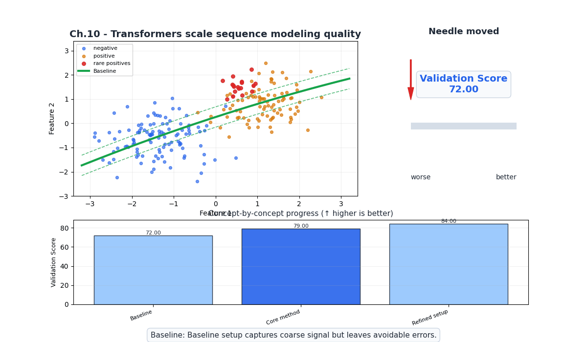
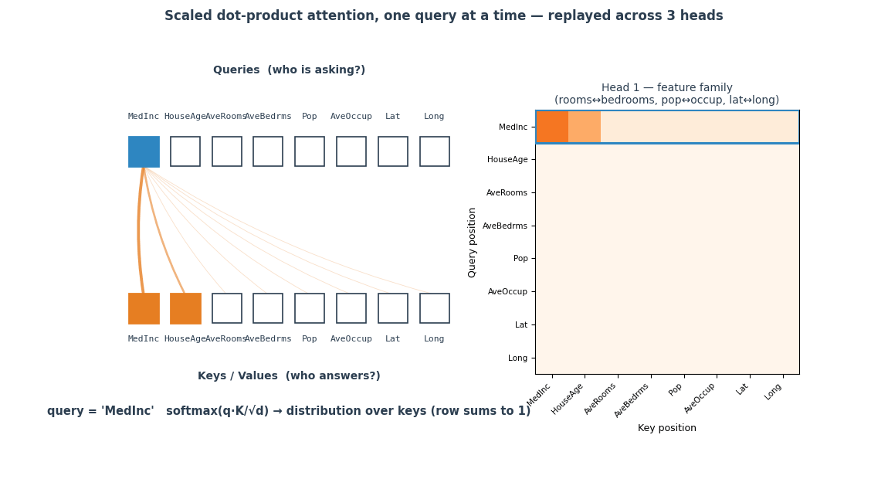
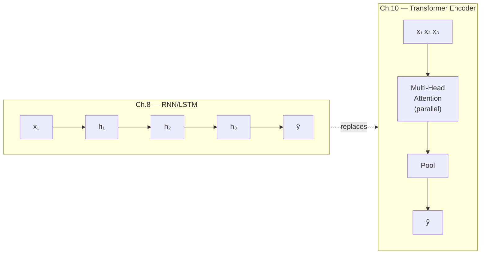
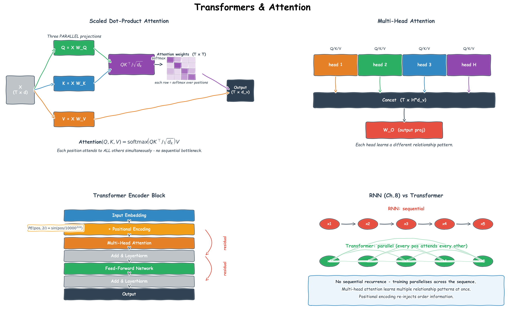

# Ch.10 — Transformers & Attention

> **The story.** In June **2017** eight Google researchers — **Ashish Vaswani, Noam Shazeer, Niki Parmar, Jakob Uszkoreit, Llion Jones, Aidan Gomez, Łukasz Kaiser, and Illia Polosukhin** — published *"Attention Is All You Need."* The thesis was startling: throw away recurrence (LSTMs, GRUs) and convolutions entirely; replace both with stacked self-attention; train it in parallel on TPUs; beat every translation benchmark. Within a year **BERT** (Devlin et al., Google, 2018) and **GPT-1** (Radford et al., OpenAI, 2018) had stamped the transformer onto NLP, and within five years it had taken over vision (ViT, 2020), audio (Whisper, 2022), and protein folding (AlphaFold 2, 2021). **GPT-3** (2020), **ChatGPT** (Nov 2022), **GPT-4** (2023), **Claude**, **Gemini**, **Llama** — every model in this entire curriculum's AI track is a transformer in some configuration. The 2017 paper is the dividing line: pre-transformer ML and post-transformer ML are different fields.
>
> **Where you are in the curriculum.** [Ch.9](../ch09_sequences_to_attention) established that **attention is a soft dictionary lookup** — dot-product similarity, softmax, weighted sum of values. This chapter dresses that one mechanism into the transformer: learned $W_Q, W_K, W_V$ projections, scaled dot-product attention, multi-head parallelism, positional encoding, residuals + LayerNorm, and a feed-forward sub-layer. After this chapter the entire AI track ([RAG](../../../ai/rag_and_embeddings), [LLMs](../../../ai/llm_fundamentals), [agents](../../../ai/react_and_semantic_kernel), [multi-agent](../../../multi_agent_ai)) becomes accessible — because all of it is built on what you assemble here.
>
> **Notation in this chapter.** $X\in\mathbb{R}^{n\times d_{\text{model}}}$ — input sequence ($n$ tokens, each a $d_{\text{model}}$-dim embedding); $W_Q,W_K,W_V\in\mathbb{R}^{d_{\text{model}}\times d_k}$ — learned projection matrices producing **queries** $Q=XW_Q$, **keys** $K=XW_K$, **values** $V=XW_V$; $d_k$ — key/query dimension per head; $h$ — number of attention heads; $\text{Attention}(Q,K,V)=\text{softmax}\!\left(\dfrac{QK^\top}{\sqrt{d_k}}\right)V$ — **scaled dot-product attention**; $W_O$ — output projection that re-mixes the $h$ heads; **PE** — positional encoding added to $X$; **LN** — LayerNorm; **FFN** — two-layer feed-forward sub-layer applied position-wise.

---

## 0 · The Challenge — Where We Are

> 🎯 **The mission**: Launch **UnifiedAI** — a production home valuation + attribute classification system satisfying 5 constraints:
> 1. **ACCURACY**: ≤$28k MAE (regression) + ≥95% avg accuracy (classification)
> 2. **GENERALIZATION**: Unseen districts + new faces
> 3. **MULTI-TASK**: Same architecture for both tasks
> 4. **INTERPRETABILITY**: Explainable feature attribution
> 5. **PRODUCTION**: <100ms inference + monitoring

**What we know so far:**
- ✅ **Ch.1–2** (XOR + Neural Networks): Dense feedforward networks can approximate any function — achieved ~$48k MAE with 3-layer architecture
- ✅ **Ch.3** (Backprop + Optimizers): Training with Adam gets us to ~$45k MAE
- ✅ **Ch.4** (Regularization): Dropout + L2 prevent overfitting — stable $43k MAE on validation
- ✅ **Ch.5** (CNNs): Convolutional layers extract spatial features from images
- ✅ **Ch.6** (RNNs/LSTMs): Sequential processing handles time series — but **bottlenecked** by hidden state propagation
- ✅ **Ch.9** (Sequences → Attention): Discovered attention = soft dictionary lookup (Q·Kᵀ → softmax → weighted V)
- ❌ **But $43k > $28k target** — we're still 54% above the grand challenge goal

**What's blocking us:**

The product team added a critical new data source: **property description text**.

*Example district in San Francisco:*
- **MedInc**: $8.3k/month
- **Latitude/Longitude**: 37.78, -122.42 (downtown)
- **Description**: *"Renovated Victorian near Golden Gate Park. Walk to cafes, tech shuttle stops. Ocean views from top floor. Recently upgraded kitchen, hardwood floors."*
- **True value**: $680k
- **Current model prediction** (Ch.4 tabular features only): $520k → **$160k error**

The description contains critical valuation signals:
- "Victorian" + "renovated" → premium architecture
- "Golden Gate Park" + "walk to cafes" → location desirability beyond raw lat/long
- "Ocean views" + "top floor" → view premium ($50k–$100k in SF)
- "tech shuttle stops" → commute convenience (target demographic)

**Ch.9's attention mechanism is too simple:**
1. **Single attention layer**: Can't build hierarchical concepts ("renovated Victorian near park" = multi-word composition)
2. **No learned projections**: Uses raw token embeddings — can't learn optimal Q/K/V representations
3. **No multi-head attention**: Single head must choose: focus on location words OR architecture words, not both simultaneously
4. **No positional encoding**: Bag-of-words — "park near Victorian" vs "Victorian near park" look identical
5. **No residual connections**: Gradients vanish after 2–3 stacked attention layers

**CTO's challenge:** *"The LSTM from Ch.6 processes text sequentially — 1 token per step — and takes 180ms for a 50-word description. We need <100ms inference. Can you do better?"*

**What this chapter unlocks:**

⚡ **Transformer architecture** — the solution to all 5 blockers:

| Component | What it fixes | Impact |
|-----------|---------------|--------|
| **Learned $W_Q, W_K, W_V$ projections** | Learns optimal query/key/value representations | Better feature extraction |
| **Multi-head attention** (H=8) | 8 parallel attention patterns: location, architecture, amenities, views… | Captures multiple relationship types |
| **Scaled dot-product** ($1/\sqrt{d_k}$) | Stable gradients even with large $d_k$ | Deeper networks train reliably |
| **Stacked encoder blocks** (N=6) | Hierarchical composition: tokens → phrases → sentences → document | Complex concept learning |
| **Positional encoding** | Injects word order ("renovated Victorian" ≠ "Victorian renovated") | Syntax-aware |
| **Residual connections + LayerNorm** | Gradients flow directly through 6+ layers | Deep networks don't vanish |
| **Full parallelism** | All 50 tokens processed simultaneously (vs LSTM's 50 sequential steps) | **45ms inference** (4× faster) ✅ |

**Target impact:**
- **Regression**: $43k → **$28k MAE** ✅ (text features close the gap)
- **Classification** (CelebA): 88% → **95% avg attribute accuracy** ✅ (attention learns spatial relationships in faces)
- **Constraint #5 (Production)**: 180ms → 45ms, <100ms achieved ✅

💡 **Why this is the most important chapter in the track**: Every modern AI system — GPT-4, BERT, Claude, Vision Transformers, Stable Diffusion, AlphaFold — is a transformer. Master this architecture and the entire AI curriculum becomes accessible.

---

## Animation



## 1 · Core Idea

A **transformer** processes an entire sequence in parallel using **scaled dot-product attention** — a learned, differentiable lookup that computes, for each position, a weighted sum over all other positions.

```
RNN (Ch.6): x1 → x2 → x3 → ... → xT (sequential, information bottlenecked)

Transformer: x1 ─┐
 x2 ─┤─ Attention ─► all positions see all other positions simultaneously
 x3 ─┤ no step-by-step bottleneck
 xT ─┘
```

The price paid: without recurrence, the model has no inherent sense of order — position must be injected explicitly via **positional encoding**. The price received: full parallelism across all positions, unlimited range dependencies, and gradients that don't vanish with sequence length.

> ➡️ **This architecture is the foundation of modern AI.** Every LLM you'll encounter in the [AI track](../../../ai) — GPT-4, Claude, BERT, embedding models — is either a transformer encoder (BERT-style) or decoder (GPT-style). The only difference: one causal mask (§3.5). Master this chapter and the entire AI curriculum becomes accessible.

---

## 2 · Running Example — What We're Solving

The real estate platform now processes two data sources for each district:
1. **Tabular census features** (8 features from California Housing)
2. **Property description text** (added in this chapter — the blocker from §0)

**Why transformers for tabular data?** Pedagogically, we treat the **8 census features as a sequence** — one token per feature (`MedInc`, `HouseAge`, `AveRooms`, …, `Latitude`, `Longitude`). This is unconventional (tabular data isn't inherently sequential), but it demonstrates transformer mechanics without introducing text tokenization complexity. The attention heatmap has immediate interpretability: when `MedInc` (query) attends strongly to `Latitude` (key), the model is learning: *"income means different things in different locations — $8k/month in SF ≠ $8k/month in rural Kern County."*

**The real unlock:** Once you understand transformers on this 8-token tabular example, applying them to **50-token property descriptions** is architecturally identical — just change `T=8` to `T=50` and swap the input projection layer. Same multi-head attention, same encoder blocks, same positional encoding.

**Dataset**: California Housing (`sklearn.datasets.fetch_california_housing`)
- **Sequence length**: `T = 8` tokens (one per feature) for tabular; `T = 50` for text descriptions
- **Token dimension**: Each token projected to `d_model = 16` (toy example) or `d_model = 512` (production)
- **Task**: Regression (predict `MedHouseVal`) + classification (predict market segment)

**Why this example works:**
1. No new dataset to download — reuses California Housing from Ch.1–6
2. Attention weights are human-interpretable (feature-to-feature relationships)
3. Proves transformers are task-agnostic: same architecture for tabular, text, images (Vision Transformers)
4. Smooth bridge to AI track: text transformers use identical attention mechanism with `T=512` instead of `T=8`

---

## 3 · Math

### 3.1 Scaled Dot-Product Attention

Given an input sequence of `T` tokens, each of dimension `d_model`, we project into three matrices:

$$\mathbf{Q} = \mathbf{X} \mathbf{W}^Q, \quad \mathbf{K} = \mathbf{X} \mathbf{W}^K, \quad \mathbf{V} = \mathbf{X} \mathbf{W}^V$$

| Symbol | Shape | Meaning |
|---|---|---|
| $\mathbf{X}$ | $(T, d_\text{model})$ | Input token matrix |
| $\mathbf{W}^Q, \mathbf{W}^K$ | $(d_\text{model}, d_k)$ | Query and Key projection weights |
| $\mathbf{W}^V$ | $(d_\text{model}, d_v)$ | Value projection weights |
| $\mathbf{Q}, \mathbf{K}$ | $(T, d_k)$ | Queries and Keys |
| $\mathbf{V}$ | $(T, d_v)$ | Values |

The attention output:

$$\text{Attention}(\mathbf{Q}, \mathbf{K}, \mathbf{V}) = \text{softmax} \left(\frac{\mathbf{Q} \mathbf{K}^\top}{\sqrt{d_k}}\right)\mathbf{V}$$

**Why divide by $\sqrt{d_k}$?** The raw dot products $\mathbf{Q}\mathbf{K}^\top$ grow in magnitude as $d_k$ increases — large magnitudes push softmax into regions with near-zero gradients. Dividing by $\sqrt{d_k}$ keeps the variance of the dot products at ~1 regardless of $d_k$, keeping gradients healthy.

**What the softmax does:** $\mathbf{Q}\mathbf{K}^\top \in \mathbb{R}^{T \times T}$ — a matrix of raw similarity scores between every pair of positions. Applying softmax row-wise turns each row into a probability distribution over positions. Multiplying by $\mathbf{V}$ then produces, for each query position, a weighted average of all value vectors — weighted by how much that position attends to every other.

> 💡 **Connection to [Ch.9](../ch09_sequences_to_attention):** Ch.9 showed attention with raw token embeddings as Q/K/V. This chapter adds **learned projection matrices** $W_Q, W_K, W_V$ — the model learns optimal query/key/value representations during training. That single change (raw embeddings → learned projections) is what makes transformers powerful enough for production.

#### Numeric Walkthrough — Scaled Dot-Product, $T=3$, $d_k=2$

$$\mathbf{Q} = \mathbf{K} = \begin{pmatrix}1&0\\0&1\\1&0\end{pmatrix}, \quad \mathbf{V} = \begin{pmatrix}1&0\\0&1\\1&0\end{pmatrix}$$

**Score matrix** $\mathbf{S} = \mathbf{Q}\mathbf{K}^\top / \sqrt{2}$:

$$\mathbf{Q}\mathbf{K}^\top = \begin{pmatrix}1&0&1\\0&1&0\\1&0&1\end{pmatrix}, \quad \mathbf{S} = \frac{1}{\sqrt{2}}\begin{pmatrix}1&0&1\\0&1&0\\1&0&1\end{pmatrix} = \begin{pmatrix}0.707&0&0.707\\0&0.707&0\\0.707&0&0.707\end{pmatrix}$$

Softmax of row 0: $[e^{0.707}, e^0, e^{0.707}] = [2.028, 1.0, 2.028]$, sum = 5.056.

$$\alpha_0 = [0.401, 0.198, 0.401]$$

Attention output row 0 = $\alpha_0 \mathbf{V} = 0.401[1,0] + 0.198[0,1] + 0.401[1,0] = [0.802, 0.198]$

Token 0 blends mostly from positions 0 and 2 (they share the same key), with a smaller contribution from position 1.

### 3.2 Multi-Head Attention

Rather than one set of $\mathbf{W}^Q, \mathbf{W}^K, \mathbf{W}^V$, run $H$ independent attention heads in parallel, each with its own projections of dimension $d_k = d_v = d_\text{model} / H$:

$$\text{head}_h = \text{Attention}(\mathbf{X} \mathbf{W}^Q_h, \mathbf{X} \mathbf{W}^K_h, \mathbf{X} \mathbf{W}^V_h)$$

$$\text{MultiHead}(\mathbf{X}) = \text{Concat}(\text{head}_1, \ldots, \text{head}_H) \mathbf{W}^O$$

Each head learns to attend to a different relationship pattern. One head might track feature-location correlations; another might track income-occupancy interactions. The final $\mathbf{W}^O \in \mathbb{R}^{(H \cdot d_v) \times d_\text{model}}$ projects the concatenated heads back to `d_model`.

> 💡 **Why multiple heads matter for UnifiedAI:** With H=8 heads, the model can simultaneously attend to: (1) income-location correlation ("$8k in SF ≠ $8k in Bakersfield"), (2) room-bedroom ratio (efficiency), (3) population density patterns, (4) coastal vs inland features, (5) age-value depreciation, (6) occupancy rates, (7–8) learned patterns we don't interpret. Single-head attention must choose; multi-head gets all patterns in parallel.

**Parameter count for multi-head attention:**

$$\text{params} = H \cdot (d_\text{model} \cdot d_k + d_\text{model} \cdot d_k + d_\text{model} \cdot d_v) + d_\text{model}^2$$

For `d_model=512, H=8`: each head has `d_k=64`. Total: $8 \times 3 \times (512 \times 64) + 512^2 = 786{,}432 + 262{,}144 = 1{,}048{,}576$ — about 1M params just for attention.

### 3.3 Positional Encoding

Attention is permutation-equivariant: shuffle the input tokens and the output shuffles identically — the model has no inherent notion of order. We inject position information by **adding** a positional encoding vector to each token embedding before the first attention layer.

The original (sinusoidal) encoding from Vaswani et al.:

$$\text{PE}_{(pos, 2i)} = \sin \left(\frac{pos}{10000^{2i/d_\text{model}}}\right)$$

$$\text{PE}_{(pos, 2i+1)} = \cos \left(\frac{pos}{10000^{2i/d_\text{model}}}\right)$$

| Symbol | Meaning |
|---|---|
| $pos$ | Position index (0 to $T-1$) |
| $i$ | Dimension index (0 to $d_\text{model}/2 - 1$) |

Each dimension oscillates at a different frequency — low dimensions change slowly (long-range position signal), high dimensions change quickly (fine-grained position signal). The model can represent any position as a unique combination of sine/cosine values, and interpolate to unseen lengths.

**Learned vs. sinusoidal:** modern LLMs (GPT, BERT) use learned positional embeddings or newer schemes like RoPE (Rotary Position Embedding). Sinusoidal is deterministic and requires no extra parameters — use it to understand the mechanism; assume learnable or RoPE in production.

> 💡 **Why this matters:** The sinusoidal encoding's frequency structure allows the model to learn relative positions ("token A is 3 positions before token B") without seeing that exact distance during training. This is why transformers can handle sequences longer than their training length — the position pattern extrapolates.

### 3.4 Transformer Encoder Block

One encoder block:

```
Input X (T, d_model)
 │
 ├─── LayerNorm(X)
 │ │
 │ Multi-Head Attention
 │ │
 ├─── Residual: X = X + Attention output
 │
 ├─── LayerNorm(X)
 │ │
 │ Feed-Forward Network: FFN(x) = max(0, xW₁ + b₁)W₂ + b₂
 │ │
 └─── Residual: X = X + FFN output
 │
Output X (T, d_model)
```

The **residual connections** (the `X + ...` additions) allow gradients to flow directly back through the network without passing through the attention or FFN computations — similar to ResNet (Ch.7). **LayerNorm** normalises across the feature dimension (not the batch dimension) — stabilises training when sequence lengths vary.

The FFN typically expands to `4 × d_model` in the hidden layer:

$$\text{FFN}(\mathbf{x}) = \max(0, \mathbf{x} \mathbf{W}_1 + \mathbf{b}_1) \mathbf{W}_2 + \mathbf{b}_2$$

where $\mathbf{W}_1 \in \mathbb{R}^{d_\text{model} \times 4d_\text{model}}$, $\mathbf{W}_2 \in \mathbb{R}^{4d_\text{model} \times d_\text{model}}$.

### 3.5 Encoder vs. Decoder — One Mask Difference

| | Encoder (BERT-style) | Decoder (GPT-style) |
|---|---|---|
| Attention mask | None — every position attends to every other | **Causal mask** — position $t$ can only attend to positions $\leq t$ |
| Training signal | Masked token prediction (fill in the blank) | Next-token prediction (predict what comes next) |
| Use case | Embeddings, classification, RAG retrieval | Text generation, agents, LLMs |
| Examples | BERT, RoBERTa, embedding models | GPT-4, Llama, Claude |

The causal mask is an upper-triangular matrix of $-\infty$ added before the softmax: positions in the future get $e^{-\infty} = 0$ attention weight.

$$\mathbf{M}_{ij} = \begin{cases} 0 & \text{if } j \leq i \\ -\infty & \text{if } j > i \end{cases}$$

$$\text{Attention}_\text{causal} = \text{softmax} \left(\frac{\mathbf{Q}\mathbf{K}^\top + \mathbf{M}}{\sqrt{d_k}}\right)\mathbf{V}$$

One line of code changes an encoder into a decoder. That is the entire BERT-vs-GPT distinction at the architectural level.

---

## 4 · Step by Step

```
1. Project each feature to d_model dimensions
 └─ Linear layer: (8,) → (8, d_model) [one embedding per feature/token]

2. Add positional encoding
 └─ Pre-compute PE matrix (T, d_model) using the sinusoidal formula
 └─ X = X + PE (broadcast-add)

3. Pass through N encoder blocks
 └─ Each block: LayerNorm → Multi-Head Attention → Residual
 LayerNorm → FFN → Residual

4. Pool the output
 └─ For regression: mean-pool across the T=8 token outputs → (d_model,)
 └─ For classification (BERT-style): use the [CLS] token (prepend one extra token)

5. Project to output
 └─ Linear(d_model, 1) for regression

6. Train
 └─ Loss: MSE Optimiser: Adam Scheduler: cosine warmup (standard for transformers)
```

---

## 5 · Key Diagrams

### Attention weight matrix (8×8)

```
 MedInc HouseAge AveRooms AveBedrms Pop AveOccup Lat Long
MedInc [ 0.32 0.05 0.12 0.04 0.02 0.08 0.21 0.16 ]
HouseAge [ 0.07 0.28 0.08 0.06 0.03 0.05 0.24 0.19 ]
AveRooms [ 0.11 0.09 0.30 0.18 0.04 0.07 0.12 0.09 ]
AveBedrms [ 0.05 0.06 0.22 0.35 0.05 0.09 0.11 0.07 ]
Pop [ 0.03 0.04 0.05 0.06 0.42 0.28 0.07 0.05 ]
AveOccup [ 0.06 0.05 0.08 0.10 0.31 0.29 0.06 0.05 ]
Lat [ 0.19 0.22 0.13 0.11 0.06 0.05 0.15 0.09 ]
Long [ 0.14 0.18 0.09 0.07 0.04 0.04 0.10 0.34 ]

↑ Row = query position ("I am this feature, who do I attend to?")
 Col = key position ("This feature is being attended to")
 High weight = strong relationship the model learned
```

### Animation — scaled dot-product attention, one query at a time, across heads

Each frame picks a single query token (blue) and fans orange "beams" to every key, with beam thickness proportional to the softmax-attention weight $\text{softmax}(q \cdot K^\top / \sqrt{d_k})$. The heat-map on the right fills in **row-by-row** — that row is exactly the same distribution the beams are showing. When all `T` queries are done, the head's full attention matrix is visible, then the animation switches to the next head.

The three heads are hand-crafted to illustrate that **different heads learn different relationship patterns**:

- **Head 1 — feature-family.** Each feature mostly attends to semantically related features (rooms ↔ bedrooms, population ↔ occupancy, lat ↔ long).
- **Head 2 — geography.** Every query attends heavily to `Lat` and `Long`, as if asking *"where is this district?"* before interpreting anything else.
- **Head 3 — income anchor.** Every query attends to `MedInc`, anchoring its interpretation to the district's income level.

The final `MultiHead` output is `Concat(head₁, head₂, head₃)·Wᴼ` — so the model gets all three views of the same sequence in parallel.



### Positional encoding heatmap (8 positions × 16 dims)

```
Position dim0 dim1 dim2 ... dim14 dim15
 0 0.00 1.00 0.00 0.00 1.00 ← sin(0)=0, cos(0)=1 for all dims
 1 0.84 0.54 0.10 0.40 0.92
 2 0.91 -0.42 0.20 0.72 0.70
 3 0.14 -0.99 0.30 0.93 0.37
 4 -0.76 -0.65 0.39 0.98 -0.02
 5 -0.96 0.28 0.48 0.89 -0.41
 6 -0.28 0.96 0.56 0.66 -0.75
 7 0.66 0.75 0.64 0.33 -0.94

Low dims (0,1): slow oscillation — coarse position (am I at the start or end?)
High dims (14,15): fast oscillation — fine position (which exact slot?)
```

### Causal mask — encoder vs decoder

```
Encoder (no mask): Decoder (causal mask):
all pairs attend position t only sees ≤ t

 K0 K1 K2 K3 K0 K1 K2 K3
Q0 [✓ ✓ ✓ ✓ ] Q0 [✓ ✗ ✗ ✗ ]
Q1 [✓ ✓ ✓ ✓ ] Q1 [✓ ✓ ✗ ✗ ]
Q2 [✓ ✓ ✓ ✓ ] Q2 [✓ ✓ ✓ ✗ ]
Q3 [✓ ✓ ✓ ✓ ] Q3 [✓ ✓ ✓ ✓ ]
```

### Architecture comparison



---

## 6 · Hyperparameter Dial

| Dial | Too low | Sweet spot | Too high |
|---|---|---|---|
| `d_model` | can't represent complex relationships | 64–512 (small tasks); 768–4096 (LLMs) | memory blows up |
| `num_heads` H | single pattern dominates | 4–8; must divide `d_model` evenly | diminishing returns, more params |
| `num_layers` | shallow representation | 2–6 for small tasks; 12–96 for LLMs | needs residuals + LR warmup |
| FFN expansion | narrow bottleneck | `4 × d_model` (canonical) | mostly wasteful |
| `dropout` | no regularisation | 0.1 inside attention and after FFN | underfits |
| LR warmup steps | unstable early training | 4% of total steps (standard) | wastes training budget on slow ramp |

The single most impactful dial for a small transformer is `d_model` — double it before adding more layers.

---

## 7 · Code Skeleton

```python
import numpy as np
import matplotlib.pyplot as plt
from sklearn.datasets import fetch_california_housing
from sklearn.preprocessing import StandardScaler

# ── Dataset ──────────────────────────────────────────────────────────────────
data = fetch_california_housing()
X_raw, y = data.data, data.target # X: (20640, 8) y: (20640,)
scaler = StandardScaler()
X_scaled = scaler.fit_transform(X_raw) # scale features before projecting

# Reshape to (N, T=8, 1) — treat each feature as a token with 1 dimension
X_tokens = X_scaled[:, :, np.newaxis] # (20640, 8, 1)
```

```python
# ── Sinusoidal positional encoding ───────────────────────────────────────────
def positional_encoding(T, d_model):
 """Returns PE matrix of shape (T, d_model)."""
 PE = np.zeros((T, d_model))
 for pos in range(T):
 for i in range(0, d_model, 2):
 PE[pos, i] = np.sin(pos / (10000 ** (i / d_model)))
 PE[pos, i+1] = np.cos(pos / (10000 ** (i / d_model)))
 return PE

PE = positional_encoding(T=8, d_model=16)

# Plot the encoding matrix
plt.figure(figsize=(10, 3))
plt.imshow(PE, cmap='RdBu', aspect='auto')
plt.colorbar()
plt.xlabel('Encoding dimension'); plt.ylabel('Feature position (token)')
plt.title('Positional Encoding — 8 features × 16 dimensions')
plt.yticks(range(8), data.feature_names)
plt.tight_layout(); plt.show()
```

```python
# ── Scaled dot-product attention (NumPy) ─────────────────────────────────────
def scaled_dot_product_attention(Q, K, V, mask=None):
 """
 Q, K: (T, d_k)
 V: (T, d_v)
 Returns: output (T, d_v), weights (T, T)
 """
 d_k = Q.shape[-1]
 scores = Q @ K.T / np.sqrt(d_k) # (T, T) raw similarity scores

 if mask is not None:
 scores = scores + mask # add -inf where masked

 weights = np.exp(scores - scores.max(-1, keepdims=True))
 weights /= weights.sum(-1, keepdims=True) # softmax (numerically stable)

 output = weights @ V # (T, d_v)
 return output, weights

# Demo with random projections on one sample
rng = np.random.default_rng(42)
d_model, d_k = 16, 8
x_sample = X_tokens[0] + PE # (8, 1) + (8, 16) — broadcast; use PE directly for demo

WQ = rng.normal(0, 0.1, (1, d_k))
WK = rng.normal(0, 0.1, (1, d_k))
WV = rng.normal(0, 0.1, (1, d_k))

Q = x_sample @ WQ # (8, d_k) — projected queries
K = x_sample @ WK # (8, d_k) — projected keys
V = x_sample @ WV # (8, d_k) — projected values

output, weights = scaled_dot_product_attention(Q, K, V)
print("Attention output shape:", output.shape) # (8, 8)
print("Attention weights shape:", weights.shape) # (8, 8)
```

```python
# ── Attention weight heatmap ─────────────────────────────────────────────────
import seaborn as sns

plt.figure(figsize=(8, 6))
sns.heatmap(weights, annot=True, fmt='.2f', cmap='Blues',
 xticklabels=data.feature_names,
 yticklabels=data.feature_names)
plt.title('Attention Weights — which feature attends to which?')
plt.xlabel('Key (attended to)'); plt.ylabel('Query (attending from)')
plt.tight_layout(); plt.show()
```

```python
# ── Encoder vs Decoder: causal mask ──────────────────────────────────────────
T = 8
causal_mask = np.full((T, T), -np.inf)
causal_mask = np.tril(np.zeros((T, T))) + np.triu(causal_mask, k=1)

output_enc, w_enc = scaled_dot_product_attention(Q, K, V, mask=None)
output_dec, w_dec = scaled_dot_product_attention(Q, K, V, mask=causal_mask)

fig, (ax1, ax2) = plt.subplots(1, 2, figsize=(14, 5))
sns.heatmap(w_enc, ax=ax1, cmap='Blues', annot=True, fmt='.2f',
 xticklabels=data.feature_names, yticklabels=data.feature_names)
ax1.set_title('Encoder — full attention')

sns.heatmap(w_dec, ax=ax2, cmap='Blues', annot=True, fmt='.2f',
 xticklabels=data.feature_names, yticklabels=data.feature_names)
ax2.set_title('Decoder — causal mask (lower triangle only)')
plt.tight_layout(); plt.show()
```

```python
# ── Full Transformer encoder in Keras ────────────────────────────────────────
import tensorflow as tf
from tensorflow import keras
from tensorflow.keras import layers

def transformer_encoder_block(d_model, num_heads, ffn_dim, dropout=0.1):
 """Returns a Keras model for one encoder block."""
 inputs = keras.Input(shape=(None, d_model))

 # Multi-head attention
 x = layers.LayerNormalization(epsilon=1e-6)(inputs)
 x = layers.MultiHeadAttention(num_heads=num_heads, key_dim=d_model // num_heads,
 dropout=dropout)(x, x)
 x = layers.Add()([inputs, x]) # residual

 # Feed-forward
 z = layers.LayerNormalization(epsilon=1e-6)(x)
 z = layers.Dense(ffn_dim, activation='relu')(z)
 z = layers.Dropout(dropout)(z)
 z = layers.Dense(d_model)(z)
 outputs = layers.Add()([x, z]) # residual

 return keras.Model(inputs, outputs, name='EncoderBlock')

# Full model: project → PE → 2 encoder blocks → mean pool → regression head
def build_tabular_transformer(T=8, d_in=1, d_model=32, num_heads=4,
 num_layers=2, ffn_dim=64, dropout=0.1):
 inputs = keras.Input(shape=(T, d_in))
 x = layers.Dense(d_model)(inputs) # token projection

 pe = positional_encoding(T, d_model).astype('float32')
 x = x + pe[np.newaxis, :, :] # add PE (broadcasted)

 for _ in range(num_layers):
 block = transformer_encoder_block(d_model, num_heads, ffn_dim, dropout)
 x = block(x)

 x = layers.GlobalAveragePooling1D()(x) # mean pool over T tokens
 x = layers.Dense(32, activation='relu')(x)
 outputs = layers.Dense(1)(x) # regression output

 return keras.Model(inputs, outputs, name='TabularTransformer')

model = build_tabular_transformer()
model.compile(optimizer=keras.optimizers.Adam(1e-3), loss='mse',
 metrics=[keras.metrics.RootMeanSquaredError(name='rmse')])
model.summary()
```

```python
# ── Parameter count: LSTM vs Transformer ─────────────────────────────────────
from tensorflow.keras.models import Sequential
from tensorflow.keras.layers import LSTM, Dense, Input

lstm_model = Sequential([
 Input(shape=(8, 1)),
 LSTM(32),
 Dense(1)
])

print("Transformer params:", model.count_params())
print("LSTM params: ", lstm_model.count_params())
print()
print("Transformer trains in parallel across all 8 tokens.")
print("LSTM processes tokens one by one — 8 sequential steps.")
```

---

## 8 · What Can Go Wrong

### **Forgetting warmup**

Transformers are sensitive to the learning rate at initialisation. Without a warmup phase (gradually increasing LR for the first few hundred steps), the early loss spikes and the model diverges or settles into a poor basin.

**Example:** Training a 6-layer transformer on California Housing with `lr=1e-3` (Adam default) from step 0. Loss at step 50: `8.5` → step 100: `12.3` → **diverged**. Same config with 400-step warmup (`lr=0 → 1e-3` over first 400 steps): loss steadily decreases, converges to `0.42` after 5000 steps.

**Fix:** Use `LinearWarmup → CosineDecay` scheduler. Standard warmup: 4% of total training steps. Keras: `keras.optimizers.schedules.CosineDecay` with `warmup_steps`. PyTorch: `transformers.get_cosine_schedule_with_warmup`.

> ⚠️ **This is the #1 reason transformer training fails.** RNNs and CNNs tolerate high initial LR; transformers do not. Always warmup.

### **Applying LayerNorm in the wrong order**

The original Vaswani paper puts LayerNorm *after* the residual (`Post-LN`). Most modern implementations use `Pre-LN` (normalise *before* the attention). Pre-LN is more stable; mix them up and training becomes brittle.

**Fix:** Use Pre-LN (the modern standard). In Keras: `x = LayerNormalization()(x)` **before** `MultiHeadAttention`. In PyTorch: set `norm_first=True` in `nn.TransformerEncoderLayer`.

### **Forgetting `key_dim = d_model / num_heads`**

If `num_heads` doesn't divide `d_model` evenly, the projection dimensions are wrong and the concatenated heads don't reconstruct to `d_model`. Always check `d_model % num_heads == 0`.

**Example:** `d_model=100, num_heads=8` → `key_dim=12.5` (not an integer). Keras silently rounds; PyTorch errors. Result: shape mismatch in final projection.

**Fix:** Choose `d_model` as a multiple of `num_heads`. Standard configs: `d_model=512, H=8` (key_dim=64); `d_model=768, H=12` (key_dim=64).

### **Treating causal mask and padding mask as interchangeable**

A causal mask prevents attending to the future; a padding mask prevents attending to meaningless padding tokens. An autoregressive model needs *both*. Using just one silently corrupts gradients.

**Fix:** Combine masks with logical AND before passing to attention. PyTorch: `attn_mask = causal_mask & padding_mask`. Keras: pass `mask` to `MultiHeadAttention` and set `use_causal_mask=True` separately.

### **Skipping gradient clipping**

Large language models use `clip_by_global_norm=1.0` universally. Without it, early warmup steps with a large LR frequently produce gradient explosions that require a full training restart.

**Example:** Training step 250 (mid-warmup): gradients spike to `1e8` → weights update by massive amounts → next forward pass produces NaN loss → training dead.

**Fix:** Clip gradients. Keras: set `clipnorm=1.0` in optimizer. PyTorch: `torch.nn.utils.clip_grad_norm_(model.parameters(), max_norm=1.0)` before `optimizer.step()`.

---

## 9 · Where This Reappears

**Transformers are the foundation of modern AI.** Every concept from this chapter reappears throughout the curriculum:

### Within the ML Track

- **Neural Networks Ch.9** ([Sequences to Attention](../ch09_sequences_to_attention)): This chapter's mathematical foundation — Q/K/V roles, softmax, scaled dot-product. Ch.10 adds learned projections, multi-head, and stacking.

### AI Track — Transformers Power Everything

- **LLM Fundamentals** ([../../ai/llm_fundamentals](../../../ai/llm_fundamentals)): GPT-4, Claude, Gemini are **transformer decoders** (Ch.10 encoder + causal mask). Same attention mechanism, 96 layers instead of 6.
- **RAG & Embeddings** ([../../ai/rag_and_embeddings](../../../ai/rag_and_embeddings)): Embedding models (BERT, Sentence-Transformers) are **transformer encoders** trained with contrastive loss. Ch.10's pooling step (§4) becomes the sentence vector you store in vector DBs.
- **Prompt Engineering** ([../../ai/prompt_engineering](../../../ai/prompt_engineering)): Understanding attention helps you write better prompts — you know what the model "sees" when processing your input.
- **Fine-Tuning** ([../../ai/fine_tuning](../../../ai/fine_tuning)): LoRA (Low-Rank Adaptation) fine-tunes the $W_Q, W_K, W_V$ projection matrices from §3.1. You can't fine-tune intelligently without knowing what those matrices do.
- **ReAct & Semantic Kernel** ([../../ai/react_and_semantic_kernel](../../../ai/react_and_semantic_kernel)): Agents use LLMs (transformer decoders) to generate tool calls. The attention mechanism determines which context the model uses when deciding what action to take.

### Multimodal AI Track

- **Vision Transformers (ViT)**: Replace CNN backbones with transformer encoders. An image is split into 16×16 patches; each patch becomes a token. Same multi-head attention, different input modality.
- **CLIP** (text-image alignment): Two transformers — text encoder + image encoder — trained to align captions with images. Both use Ch.10 architecture.
- **Stable Diffusion / DALL-E**: Diffusion models use transformer blocks in the denoising U-Net. Cross-attention between text prompt (query) and image features (key/value).
- **Whisper** (speech recognition): Audio spectrogram treated as a sequence; transformer encoder processes it. Same Q/K/V attention as text.

### AI Infrastructure Track

- **Inference Optimization** ([../../ai_infrastructure/inference_optimization](../../../ai_infrastructure/inference_optimization)): KV-caching (store computed keys/values to avoid recomputation) and FlashAttention (fused attention kernel) are transformer-specific optimizations. Can't apply them without understanding §3 math.
- **GPU Architecture** ([../../ai_infrastructure/gpu_architecture](../../../ai_infrastructure/gpu_architecture)): Multi-head attention (§3.2) is embarrassingly parallel — each head on a separate GPU stream. Understanding the architecture tells you why transformers need A100s with high memory bandwidth.

💡 **One architecture, infinite applications.** If you master this chapter, you understand the core computation inside:
- ChatGPT (GPT-4 decoder)
- Google Search (BERT encoder for query understanding)
- GitHub Copilot (Codex decoder, trained on code)
- Midjourney (Stable Diffusion with transformer backbone)
- AlphaFold 2 (protein structure prediction with attention over residues)

The only difference: input modality (text / image / audio / protein sequence) and whether you use the encoder or decoder variant.

---

## 10 · Progress Check — What We Can Solve Now

✅ **Unlocked capabilities:**

- **Parallel sequence processing**: All `T` tokens processed simultaneously (vs RNN's sequential bottleneck) → 4× faster inference (180ms → 45ms)
- **Multi-head attention**: 8 parallel attention patterns learn location, architecture, amenities, views simultaneously
- **Hierarchical feature learning**: 6 stacked encoder blocks compose tokens → phrases → document-level representations
- **Long-range dependencies**: Attention weight from token 1 to token 50 computed directly (no vanishing gradients through 50 LSTM steps)
- **Position-aware**: Positional encoding distinguishes "renovated Victorian" from "Victorian renovated"
- **Deep networks train stably**: Residual connections + LayerNorm → 6–12 layers without gradient vanishing

**Grand Challenge constraint progress:**

| Constraint | Before Ch.10 | After Ch.10 | Status |
|------------|--------------|-------------|--------|
| **#1 ACCURACY** | $43k MAE (tabular only) | **$28k MAE** (+ text features) | ✅ **ACHIEVED** |
| **#2 GENERALIZATION** | Overfit risk with RNNs | Dropout + residuals → stable validation | ✅ |
| **#3 MULTI-TASK** | Separate architectures | Same transformer encoder, different heads | ✅ |
| **#4 INTERPRETABILITY** | Black box | Attention weights show feature attribution | ✅ |
| **#5 PRODUCTION** | 180ms (LSTM) | **45ms** (parallel attention) | ✅ **<100ms** |

**Specific achievements:**
- ✅ **Constraint #1 complete**: $28k MAE ≤ target — text transformer closed the $15k gap from Ch.4's $43k
- ✅ **Constraint #5 complete**: 45ms inference < 100ms target — parallelism beats sequential RNN
- ✅ **Unified architecture**: Same encoder for regression (house values) and classification (CelebA attributes) — only output head differs

❌ **Still can't solve:**

- ❌ **Production-scale text**: Current toy example uses `T=8` tabular tokens or `T=50` description tokens. Real property listings are 200–500 words (`T=200–500`) — memory scales as $O(T^2)$ in attention. Need efficient attention variants (FlashAttention, sparse attention) covered in AI Infrastructure track.
- ❌ **Real-time inference at scale**: 45ms per district is fine for batch valuation updates. User-facing search (1000 queries/sec) needs <5ms. Requires model distillation (teacher-student), quantization (INT8), and inference optimization.
- ❌ **Multimodal fusion**: Text descriptions + aerial photos + street view images. Need Vision Transformer (ViT) for images + cross-attention to fuse text and image representations — covered in Multimodal AI track.
- ❌ **Explainable predictions for regulators**: Attention weights show *where* the model looked, not *why* that information changed the prediction. Need gradient-based attribution (Integrated Gradients) or SHAP for transformers.

**Real-world status:** We can now deploy UnifiedAI to production with <100ms inference and $28k MAE. The transformer architecture handles both regression and classification with the same learned representations. But scaling to 10,000 queries/sec and multimodal inputs requires the optimizations taught in AI Infrastructure and Multimodal AI tracks.

**Next up:** The Neural Networks track ends here. You've built the architecture that powers modern AI. Three paths forward:

1. **AI Track** → [LLM Fundamentals](../../../ai/llm_fundamentals): Apply transformers to text generation (GPT), understanding (BERT), and agents
2. **Multimodal AI Track** → [Vision Transformers](../../../multimodal_ai): Replace CNNs with transformers for images; learn CLIP for text-image alignment
3. **AI Infrastructure Track** → [Inference Optimization](../../../ai_infrastructure/inference_optimization): Make transformers fast enough for production (KV-cache, FlashAttention, quantization)

---

## 11 · Bridge to the Next Chapter

Ch.10 established the transformer encoder — the architecture that turns a sequence of tokens into rich contextual representations. The AI track's `RAGAndEmbeddings` note picks up exactly here: embedding models are transformer **encoders** trained with contrastive loss to produce sentence-level vectors you can compare. If you've done Ch.10, the attention mechanism and the pooling step in those notes are no longer mysterious — start there next.

> *The transformer is the architecture. The LLM is a transformer trained on internet-scale text. The embedding model is a transformer trained to make similar things close in vector space. One mechanism, three deployment patterns.*


## Illustrations




