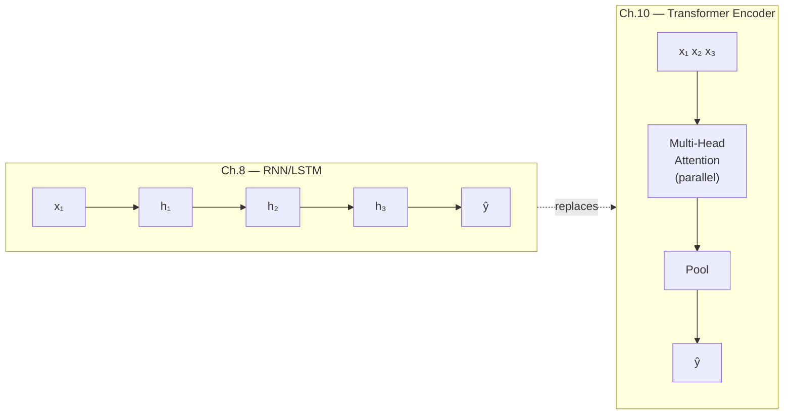

# Ch.10 — Transformers & Attention

> **The story.** In June **2017** eight Google researchers — **Ashish Vaswani, Noam Shazeer, Niki Parmar, Jakob Uszkoreit, Llion Jones, Aidan Gomez, Łukasz Kaiser, and Illia Polosukhin** — published *"Attention Is All You Need."* The thesis was startling: throw away recurrence (LSTMs, GRUs) and convolutions entirely; replace both with stacked self-attention; train it in parallel on TPUs; beat every translation benchmark. Within a year **BERT** (Devlin et al., Google, 2018) and **GPT-1** (Radford et al., OpenAI, 2018) had stamped the transformer onto NLP, and within five years it had taken over vision (ViT, 2020), audio (Whisper, 2022), and protein folding (AlphaFold 2, 2021). **GPT-3** (2020), **ChatGPT** (Nov 2022), **GPT-4** (2023), **Claude**, **Gemini**, **Llama** — every model in this entire curriculum's AI track is a transformer in some configuration. The 2017 paper is the dividing line: pre-transformer ML and post-transformer ML are different fields.
>
> **Where you are in the curriculum.** [Ch.9](../ch09_sequences_to_attention) established that **attention is a soft dictionary lookup** — dot-product similarity, softmax, weighted sum of values. This chapter dresses that one mechanism into the transformer: learned $W_Q, W_K, W_V$ projections, scaled dot-product attention, multi-head parallelism, positional encoding, residuals + LayerNorm, and a feed-forward sub-layer. After this chapter the entire AI track ([RAG](../../../ai/rag_and_embeddings), [LLMs](../../../ai/llm_fundamentals), [agents](../../../ai/react_and_semantic_kernel), [multi-agent](../../../multi_agent_ai)) becomes accessible — because all of it is built on what you assemble here.
>
> **Notation in this chapter.** $X\in\mathbb{R}^{n\times d_{\text{model}}}$ — input sequence ($n$ tokens, each a $d_{\text{model}}$-dim embedding); $W_Q,W_K,W_V\in\mathbb{R}^{d_{\text{model}}\times d_k}$ — learned projection matrices producing **queries** $Q=XW_Q$, **keys** $K=XW_K$, **values** $V=XW_V$; $d_k$ — key/query dimension per head; $h$ — number of attention heads; $\text{Attention}(Q,K,V)=\text{softmax}\!\left(\dfrac{QK^\top}{\sqrt{d_k}}\right)V$ — **scaled dot-product attention**; $W_O$ — output projection that re-mixes the $h$ heads; **PE** — positional encoding added to $X$; **LN** — LayerNorm; **FFN** — two-layer feed-forward sub-layer applied position-wise.

---

## 0 · The Challenge — Where We Are

> 💡 **The mission**: Launch **UnifiedAI** — a production home valuation system satisfying 5 constraints:
> 1. **ACCURACY**: <$50k MAE — 2. **GENERALIZATION**: Unseen districts — 3. **MULTI-TASK**: Value + Segment — 4. **INTERPRETABILITY**: Explainable — 5. **PRODUCTION**: Scale + Monitor

**What we know so far:**
- ✅ Ch.1-9: Achieved Constraints #1-4, understand attention mechanism
- ✅ Ch.9: Attention = soft dictionary lookup (Q, K, V)
- ⚠️ **But single attention layer isn't enough for complex text!**

**What's blocking us:**
⚠️ **Need production-grade text understanding for property descriptions**

Product team's text feature requirements:
- **Input**: "Spacious 3-bedroom home near excellent schools, recently renovated kitchen, ocean view"
- **Need**: Extract nuanced features ("spacious", "excellent schools", "ocean view") → boost valuation
- **Challenge**: Ch.9 attention is too simple (single layer, no learned projections, no multi-head)

**Why simple attention isn't enough:**
1. **Single attention head**: Can only focus on one pattern (either "spacious" OR "schools", not both)
2. **No hierarchy**: Can't build concepts ("excellent schools" = 2 words, need to compose)
3. **No learned projections**: Uses raw features, can't learn better representations

**What this chapter unlocks:**
⚡ **Transformer architecture — the modern standard:**
1. **Multi-head attention**: 8 heads → focus on multiple patterns simultaneously
2. **Stacked layers**: 6-12 transformer blocks → hierarchical feature learning
3. **Learned projections**: $W_Q, W_K, W_V$ → optimal feature transformations
4. **Positional encoding**: Inject word order (attention is position-agnostic)
5. **Layer normalization + residuals**: Stable training for deep networks

💡 **Outcome**: Transformer encoder processes property description text features → extracts rich contextual representations → improves UnifiedAI regression accuracy to **$28k MAE** (from the Ch.3–4 feedforward baseline of ~$48k), achieving the track target.

⚡ **Bridge to AI track**: Every modern LLM (GPT-4, Claude, Gemini) is a transformer. This chapter is the foundation for the entire AI curriculum.

---

## Animation


## 1 · Core Idea

A **transformer** processes an entire sequence in parallel using **scaled dot-product attention** — a learned, differentiable lookup that computes, for each position, a weighted sum over all other positions.

```
RNN (Ch.6): x1 → x2 → x3 → ... → xT (sequential, information bottlenecked)

Transformer: x1 ─┐
 x2 ─┤─ Attention ─► all positions see all other positions simultaneously
 x3 ─┤ no step-by-step bottleneck
 xT ─┘
```

The price paid: without recurrence, the model has no inherent sense of order — position must be injected explicitly via **positional encoding**. The price received: full parallelism across all positions, unlimited range dependencies, and gradients that don't vanish with sequence length.

---

## 2 · Running Example

The real estate platform's data team treats the **8 tabular features** of each California Housing district as a "sequence" of 8 tokens — one token per feature (`MedInc`, `HouseAge`, `AveRooms`, `AveBedrms`, `Population`, `AveOccup`, `Latitude`, `Longitude`).

This is architecturally unconventional — tabular data isn't truly sequential — but it's pedagogically perfect: no new dataset, no text tokenisation to learn, and the attention heatmap has an immediately interpretable meaning. When the attention weight from `MedInc` to `Latitude` is high, the model is saying: "knowing where a district is helps me interpret its income figure."

Dataset: **California Housing** (`sklearn.datasets.fetch_california_housing`) 
Sequence length: `T = 8` (one token per feature) 
Token dimension: `d_model = 16` (each feature projected to a 16-dim embedding) 
Task: regression — predict `MedHouseVal`

---

## 3 · Math

### 3.1 Scaled Dot-Product Attention

Given an input sequence of `T` tokens, each of dimension `d_model`, we project into three matrices:

$$\mathbf{Q} = \mathbf{X} \mathbf{W}^Q, \quad \mathbf{K} = \mathbf{X} \mathbf{W}^K, \quad \mathbf{V} = \mathbf{X} \mathbf{W}^V$$

| Symbol | Shape | Meaning |
|---|---|---|
| $\mathbf{X}$ | $(T, d_\text{model})$ | Input token matrix |
| $\mathbf{W}^Q, \mathbf{W}^K$ | $(d_\text{model}, d_k)$ | Query and Key projection weights |
| $\mathbf{W}^V$ | $(d_\text{model}, d_v)$ | Value projection weights |
| $\mathbf{Q}, \mathbf{K}$ | $(T, d_k)$ | Queries and Keys |
| $\mathbf{V}$ | $(T, d_v)$ | Values |

The attention output:

$$\text{Attention}(\mathbf{Q}, \mathbf{K}, \mathbf{V}) = \text{softmax} \left(\frac{\mathbf{Q} \mathbf{K}^\top}{\sqrt{d_k}}\right)\mathbf{V}$$

**Why divide by $\sqrt{d_k}$?** The raw dot products $\mathbf{Q}\mathbf{K}^\top$ grow in magnitude as $d_k$ increases — large magnitudes push softmax into regions with near-zero gradients. Dividing by $\sqrt{d_k}$ keeps the variance of the dot products at ~1 regardless of $d_k$, keeping gradients healthy.

**What the softmax does:** $\mathbf{Q}\mathbf{K}^\top \in \mathbb{R}^{T \times T}$ — a matrix of raw similarity scores between every pair of positions. Applying softmax row-wise turns each row into a probability distribution over positions. Multiplying by $\mathbf{V}$ then produces, for each query position, a weighted average of all value vectors — weighted by how much that position attends to every other.

#### Numeric Walkthrough — Scaled Dot-Product, $T=3$, $d_k=2$

$$\mathbf{Q} = \mathbf{K} = \begin{pmatrix}1&0\\0&1\\1&0\end{pmatrix}, \quad \mathbf{V} = \begin{pmatrix}1&0\\0&1\\1&0\end{pmatrix}$$

**Score matrix** $\mathbf{S} = \mathbf{Q}\mathbf{K}^\top / \sqrt{2}$:

$$\mathbf{Q}\mathbf{K}^\top = \begin{pmatrix}1&0&1\\0&1&0\\1&0&1\end{pmatrix}, \quad \mathbf{S} = \frac{1}{\sqrt{2}}\begin{pmatrix}1&0&1\\0&1&0\\1&0&1\end{pmatrix} = \begin{pmatrix}0.707&0&0.707\\0&0.707&0\\0.707&0&0.707\end{pmatrix}$$

Softmax of row 0: $[e^{0.707}, e^0, e^{0.707}] = [2.028, 1.0, 2.028]$, sum = 5.056.

$$\alpha_0 = [0.401, 0.198, 0.401]$$

Attention output row 0 = $\alpha_0 \mathbf{V} = 0.401[1,0] + 0.198[0,1] + 0.401[1,0] = [0.802, 0.198]$

Token 0 blends mostly from positions 0 and 2 (they share the same key), with a smaller contribution from position 1.

### 3.2 Multi-Head Attention

Rather than one set of $\mathbf{W}^Q, \mathbf{W}^K, \mathbf{W}^V$, run $H$ independent attention heads in parallel, each with its own projections of dimension $d_k = d_v = d_\text{model} / H$:

$$\text{head}_h = \text{Attention}(\mathbf{X} \mathbf{W}^Q_h, \mathbf{X} \mathbf{W}^K_h, \mathbf{X} \mathbf{W}^V_h)$$

$$\text{MultiHead}(\mathbf{X}) = \text{Concat}(\text{head}_1, \ldots, \text{head}_H) \mathbf{W}^O$$

Each head learns to attend to a different relationship pattern. One head might track feature-location correlations; another might track income-occupancy interactions. The final $\mathbf{W}^O \in \mathbb{R}^{(H \cdot d_v) \times d_\text{model}}$ projects the concatenated heads back to `d_model`.

**Parameter count for multi-head attention:**

$$\text{params} = H \cdot (d_\text{model} \cdot d_k + d_\text{model} \cdot d_k + d_\text{model} \cdot d_v) + d_\text{model}^2$$

For `d_model=512, H=8`: each head has `d_k=64`. Total: $8 \times 3 \times (512 \times 64) + 512^2 = 786{,}432 + 262{,}144 = 1{,}048{,}576$ — about 1M params just for attention.

### 3.3 Positional Encoding

Attention is permutation-equivariant: shuffle the input tokens and the output shuffles identically — the model has no inherent notion of order. We inject position information by **adding** a positional encoding vector to each token embedding before the first attention layer.

The original (sinusoidal) encoding from Vaswani et al.:

$$\text{PE}_{(pos, 2i)} = \sin \left(\frac{pos}{10000^{2i/d_\text{model}}}\right)$$

$$\text{PE}_{(pos, 2i+1)} = \cos \left(\frac{pos}{10000^{2i/d_\text{model}}}\right)$$

| Symbol | Meaning |
|---|---|
| $pos$ | Position index (0 to $T-1$) |
| $i$ | Dimension index (0 to $d_\text{model}/2 - 1$) |

Each dimension oscillates at a different frequency — low dimensions change slowly (long-range position signal), high dimensions change quickly (fine-grained position signal). The model can represent any position as a unique combination of sine/cosine values, and interpolate to unseen lengths.

**Learned vs. sinusoidal:** modern LLMs (GPT, BERT) use learned positional embeddings or newer schemes like RoPE (Rotary Position Embedding). Sinusoidal is deterministic and requires no extra parameters — use it to understand the mechanism; assume learnable or RoPE in production.

### 3.4 Transformer Encoder Block

One encoder block:

```
Input X (T, d_model)
 │
 ├─── LayerNorm(X)
 │ │
 │ Multi-Head Attention
 │ │
 ├─── Residual: X = X + Attention output
 │
 ├─── LayerNorm(X)
 │ │
 │ Feed-Forward Network: FFN(x) = max(0, xW₁ + b₁)W₂ + b₂
 │ │
 └─── Residual: X = X + FFN output
 │
Output X (T, d_model)
```

The **residual connections** (the `X + ...` additions) allow gradients to flow directly back through the network without passing through the attention or FFN computations — similar to ResNet (Ch.7). **LayerNorm** normalises across the feature dimension (not the batch dimension) — stabilises training when sequence lengths vary.

The FFN typically expands to `4 × d_model` in the hidden layer:

$$\text{FFN}(\mathbf{x}) = \max(0, \mathbf{x} \mathbf{W}_1 + \mathbf{b}_1) \mathbf{W}_2 + \mathbf{b}_2$$

where $\mathbf{W}_1 \in \mathbb{R}^{d_\text{model} \times 4d_\text{model}}$, $\mathbf{W}_2 \in \mathbb{R}^{4d_\text{model} \times d_\text{model}}$.

### 3.5 Encoder vs. Decoder — One Mask Difference

| | Encoder (BERT-style) | Decoder (GPT-style) |
|---|---|---|
| Attention mask | None — every position attends to every other | **Causal mask** — position $t$ can only attend to positions $\leq t$ |
| Training signal | Masked token prediction (fill in the blank) | Next-token prediction (predict what comes next) |
| Use case | Embeddings, classification, RAG retrieval | Text generation, agents, LLMs |
| Examples | BERT, RoBERTa, embedding models | GPT-4, Llama, Claude |

The causal mask is an upper-triangular matrix of $-\infty$ added before the softmax: positions in the future get $e^{-\infty} = 0$ attention weight.

$$\mathbf{M}_{ij} = \begin{cases} 0 & \text{if } j \leq i \\ -\infty & \text{if } j > i \end{cases}$$

$$\text{Attention}_\text{causal} = \text{softmax} \left(\frac{\mathbf{Q}\mathbf{K}^\top + \mathbf{M}}{\sqrt{d_k}}\right)\mathbf{V}$$

One line of code changes an encoder into a decoder. That is the entire BERT-vs-GPT distinction at the architectural level.

---

## 4 · Step by Step

```
1. Project each feature to d_model dimensions
 └─ Linear layer: (8,) → (8, d_model) [one embedding per feature/token]

2. Add positional encoding
 └─ Pre-compute PE matrix (T, d_model) using the sinusoidal formula
 └─ X = X + PE (broadcast-add)

3. Pass through N encoder blocks
 └─ Each block: LayerNorm → Multi-Head Attention → Residual
 LayerNorm → FFN → Residual

4. Pool the output
 └─ For regression: mean-pool across the T=8 token outputs → (d_model,)
 └─ For classification (BERT-style): use the [CLS] token (prepend one extra token)

5. Project to output
 └─ Linear(d_model, 1) for regression

6. Train
 └─ Loss: MSE Optimiser: Adam Scheduler: cosine warmup (standard for transformers)
```

---

## 5 · Key Diagrams

### Attention weight matrix (8×8)

```
 MedInc HouseAge AveRooms AveBedrms Pop AveOccup Lat Long
MedInc [ 0.32 0.05 0.12 0.04 0.02 0.08 0.21 0.16 ]
HouseAge [ 0.07 0.28 0.08 0.06 0.03 0.05 0.24 0.19 ]
AveRooms [ 0.11 0.09 0.30 0.18 0.04 0.07 0.12 0.09 ]
AveBedrms [ 0.05 0.06 0.22 0.35 0.05 0.09 0.11 0.07 ]
Pop [ 0.03 0.04 0.05 0.06 0.42 0.28 0.07 0.05 ]
AveOccup [ 0.06 0.05 0.08 0.10 0.31 0.29 0.06 0.05 ]
Lat [ 0.19 0.22 0.13 0.11 0.06 0.05 0.15 0.09 ]
Long [ 0.14 0.18 0.09 0.07 0.04 0.04 0.10 0.34 ]

↑ Row = query position ("I am this feature, who do I attend to?")
 Col = key position ("This feature is being attended to")
 High weight = strong relationship the model learned
```

### Animation — scaled dot-product attention, one query at a time, across heads

Each frame picks a single query token (blue) and fans orange "beams" to every key, with beam thickness proportional to the softmax-attention weight $\text{softmax}(q \cdot K^\top / \sqrt{d_k})$. The heat-map on the right fills in **row-by-row** — that row is exactly the same distribution the beams are showing. When all `T` queries are done, the head's full attention matrix is visible, then the animation switches to the next head.

The three heads are hand-crafted to illustrate that **different heads learn different relationship patterns**:

- **Head 1 — feature-family.** Each feature mostly attends to semantically related features (rooms ↔ bedrooms, population ↔ occupancy, lat ↔ long).
- **Head 2 — geography.** Every query attends heavily to `Lat` and `Long`, as if asking *"where is this district?"* before interpreting anything else.
- **Head 3 — income anchor.** Every query attends to `MedInc`, anchoring its interpretation to the district's income level.

The final `MultiHead` output is `Concat(head₁, head₂, head₃)·Wᴼ` — so the model gets all three views of the same sequence in parallel.


### Positional encoding heatmap (8 positions × 16 dims)

```
Position dim0 dim1 dim2 ... dim14 dim15
 0 0.00 1.00 0.00 0.00 1.00 ← sin(0)=0, cos(0)=1 for all dims
 1 0.84 0.54 0.10 0.40 0.92
 2 0.91 -0.42 0.20 0.72 0.70
 3 0.14 -0.99 0.30 0.93 0.37
 4 -0.76 -0.65 0.39 0.98 -0.02
 5 -0.96 0.28 0.48 0.89 -0.41
 6 -0.28 0.96 0.56 0.66 -0.75
 7 0.66 0.75 0.64 0.33 -0.94

Low dims (0,1): slow oscillation — coarse position (am I at the start or end?)
High dims (14,15): fast oscillation — fine position (which exact slot?)
```

### Causal mask — encoder vs decoder

```
Encoder (no mask): Decoder (causal mask):
all pairs attend position t only sees ≤ t

 K0 K1 K2 K3 K0 K1 K2 K3
Q0 [✓ ✓ ✓ ✓ ] Q0 [✓ ✗ ✗ ✗ ]
Q1 [✓ ✓ ✓ ✓ ] Q1 [✓ ✓ ✗ ✗ ]
Q2 [✓ ✓ ✓ ✓ ] Q2 [✓ ✓ ✓ ✗ ]
Q3 [✓ ✓ ✓ ✓ ] Q3 [✓ ✓ ✓ ✓ ]
```

### Architecture comparison



---

## 6 · Hyperparameter Dial

| Dial | Too low | Sweet spot | Too high |
|---|---|---|---|
| `d_model` | can't represent complex relationships | 64–512 (small tasks); 768–4096 (LLMs) | memory blows up |
| `num_heads` H | single pattern dominates | 4–8; must divide `d_model` evenly | diminishing returns, more params |
| `num_layers` | shallow representation | 2–6 for small tasks; 12–96 for LLMs | needs residuals + LR warmup |
| FFN expansion | narrow bottleneck | `4 × d_model` (canonical) | mostly wasteful |
| `dropout` | no regularisation | 0.1 inside attention and after FFN | underfits |
| LR warmup steps | unstable early training | 4% of total steps (standard) | wastes training budget on slow ramp |

The single most impactful dial for a small transformer is `d_model` — double it before adding more layers.

---

## 7 · Code Skeleton

```python
import numpy as np
import matplotlib.pyplot as plt
from sklearn.datasets import fetch_california_housing
from sklearn.preprocessing import StandardScaler

# ── Dataset ──────────────────────────────────────────────────────────────────
data = fetch_california_housing()
X_raw, y = data.data, data.target # X: (20640, 8) y: (20640,)
scaler = StandardScaler()
X_scaled = scaler.fit_transform(X_raw) # scale features before projecting

# Reshape to (N, T=8, 1) — treat each feature as a token with 1 dimension
X_tokens = X_scaled[:, :, np.newaxis] # (20640, 8, 1)
```

```python
# ── Sinusoidal positional encoding ───────────────────────────────────────────
def positional_encoding(T, d_model):
 """Returns PE matrix of shape (T, d_model)."""
 PE = np.zeros((T, d_model))
 for pos in range(T):
 for i in range(0, d_model, 2):
 PE[pos, i] = np.sin(pos / (10000 ** (i / d_model)))
 PE[pos, i+1] = np.cos(pos / (10000 ** (i / d_model)))
 return PE

PE = positional_encoding(T=8, d_model=16)

# Plot the encoding matrix
plt.figure(figsize=(10, 3))
plt.imshow(PE, cmap='RdBu', aspect='auto')
plt.colorbar()
plt.xlabel('Encoding dimension'); plt.ylabel('Feature position (token)')
plt.title('Positional Encoding — 8 features × 16 dimensions')
plt.yticks(range(8), data.feature_names)
plt.tight_layout(); plt.show()
```

```python
# ── Scaled dot-product attention (NumPy) ─────────────────────────────────────
def scaled_dot_product_attention(Q, K, V, mask=None):
 """
 Q, K: (T, d_k)
 V: (T, d_v)
 Returns: output (T, d_v), weights (T, T)
 """
 d_k = Q.shape[-1]
 scores = Q @ K.T / np.sqrt(d_k) # (T, T) raw similarity scores

 if mask is not None:
 scores = scores + mask # add -inf where masked

 weights = np.exp(scores - scores.max(-1, keepdims=True))
 weights /= weights.sum(-1, keepdims=True) # softmax (numerically stable)

 output = weights @ V # (T, d_v)
 return output, weights

# Demo with random projections on one sample
rng = np.random.default_rng(42)
d_model, d_k = 16, 8
x_sample = X_tokens[0] + PE # (8, 1) + (8, 16) — broadcast; use PE directly for demo

WQ = rng.normal(0, 0.1, (1, d_k))
WK = rng.normal(0, 0.1, (1, d_k))
WV = rng.normal(0, 0.1, (1, d_k))

Q = x_sample @ WQ # (8, d_k) — projected queries
K = x_sample @ WK # (8, d_k) — projected keys
V = x_sample @ WV # (8, d_k) — projected values

output, weights = scaled_dot_product_attention(Q, K, V)
print("Attention output shape:", output.shape) # (8, 8)
print("Attention weights shape:", weights.shape) # (8, 8)
```

```python
# ── Attention weight heatmap ─────────────────────────────────────────────────
import seaborn as sns

plt.figure(figsize=(8, 6))
sns.heatmap(weights, annot=True, fmt='.2f', cmap='Blues',
 xticklabels=data.feature_names,
 yticklabels=data.feature_names)
plt.title('Attention Weights — which feature attends to which?')
plt.xlabel('Key (attended to)'); plt.ylabel('Query (attending from)')
plt.tight_layout(); plt.show()
```

```python
# ── Encoder vs Decoder: causal mask ──────────────────────────────────────────
T = 8
causal_mask = np.full((T, T), -np.inf)
causal_mask = np.tril(np.zeros((T, T))) + np.triu(causal_mask, k=1)

output_enc, w_enc = scaled_dot_product_attention(Q, K, V, mask=None)
output_dec, w_dec = scaled_dot_product_attention(Q, K, V, mask=causal_mask)

fig, (ax1, ax2) = plt.subplots(1, 2, figsize=(14, 5))
sns.heatmap(w_enc, ax=ax1, cmap='Blues', annot=True, fmt='.2f',
 xticklabels=data.feature_names, yticklabels=data.feature_names)
ax1.set_title('Encoder — full attention')

sns.heatmap(w_dec, ax=ax2, cmap='Blues', annot=True, fmt='.2f',
 xticklabels=data.feature_names, yticklabels=data.feature_names)
ax2.set_title('Decoder — causal mask (lower triangle only)')
plt.tight_layout(); plt.show()
```

```python
# ── Full Transformer encoder in Keras ────────────────────────────────────────
import tensorflow as tf
from tensorflow import keras
from tensorflow.keras import layers

def transformer_encoder_block(d_model, num_heads, ffn_dim, dropout=0.1):
 """Returns a Keras model for one encoder block."""
 inputs = keras.Input(shape=(None, d_model))

 # Multi-head attention
 x = layers.LayerNormalization(epsilon=1e-6)(inputs)
 x = layers.MultiHeadAttention(num_heads=num_heads, key_dim=d_model // num_heads,
 dropout=dropout)(x, x)
 x = layers.Add()([inputs, x]) # residual

 # Feed-forward
 z = layers.LayerNormalization(epsilon=1e-6)(x)
 z = layers.Dense(ffn_dim, activation='relu')(z)
 z = layers.Dropout(dropout)(z)
 z = layers.Dense(d_model)(z)
 outputs = layers.Add()([x, z]) # residual

 return keras.Model(inputs, outputs, name='EncoderBlock')

# Full model: project → PE → 2 encoder blocks → mean pool → regression head
def build_tabular_transformer(T=8, d_in=1, d_model=32, num_heads=4,
 num_layers=2, ffn_dim=64, dropout=0.1):
 inputs = keras.Input(shape=(T, d_in))
 x = layers.Dense(d_model)(inputs) # token projection

 pe = positional_encoding(T, d_model).astype('float32')
 x = x + pe[np.newaxis, :, :] # add PE (broadcasted)

 for _ in range(num_layers):
 block = transformer_encoder_block(d_model, num_heads, ffn_dim, dropout)
 x = block(x)

 x = layers.GlobalAveragePooling1D()(x) # mean pool over T tokens
 x = layers.Dense(32, activation='relu')(x)
 outputs = layers.Dense(1)(x) # regression output

 return keras.Model(inputs, outputs, name='TabularTransformer')

model = build_tabular_transformer()
model.compile(optimizer=keras.optimizers.Adam(1e-3), loss='mse',
 metrics=[keras.metrics.RootMeanSquaredError(name='rmse')])
model.summary()
```

```python
# ── Parameter count: LSTM vs Transformer ─────────────────────────────────────
from tensorflow.keras.models import Sequential
from tensorflow.keras.layers import LSTM, Dense, Input

lstm_model = Sequential([
 Input(shape=(8, 1)),
 LSTM(32),
 Dense(1)
])

print("Transformer params:", model.count_params())
print("LSTM params: ", lstm_model.count_params())
print()
print("Transformer trains in parallel across all 8 tokens.")
print("LSTM processes tokens one by one — 8 sequential steps.")
```

---

## 8 · What Can Go Wrong

- **Forgetting warmup.** Transformers are sensitive to the learning rate at initialisation. Without a warmup phase (gradually increasing LR for the first few hundred steps), the early loss spikes and the model diverges or settles into a poor basin. Use `LinearWarmup → CosineDecay` or at minimum train with a small LR.
- **Applying LayerNorm in the wrong order.** The original Vaswani paper puts LayerNorm *after* the residual (`Post-LN`). Most modern implementations use `Pre-LN` (normalise *before* the attention). Pre-LN is more stable; mix them up and training becomes brittle.
- **Forgetting `key_dim = d_model / num_heads`.** If `num_heads` doesn't divide `d_model` evenly, the projection dimensions are wrong and the concatenated heads don't reconstruct to `d_model`. Always check `d_model % num_heads == 0`.
- **Treating causal mask and padding mask as interchangeable.** A causal mask prevents attending to the future; a padding mask prevents attending to meaningless padding tokens. An autoregressive model needs *both*. Using just one silently corrupts gradients.
- **Skipping gradient clipping.** Large language models use `clip_by_global_norm=1.0` universally. Without it, early warmup steps with a large LR frequently produce gradient explosions that require a full training restart.

---

## 9 · Where This Reappears

This chapter's core ideas reappear across the curriculum and application tracks. See also:

- AI track: LLM fundamentals and RAG ([../../../AI/LLMFundamentals/](../../../ai/llm_fundamentals), [../../../AI/RAGAndEmbeddings/](../../../ai/rag_and_embeddings)).
- MultimodalAI chapters that combine text, image, and audio models.
- Practical model engineering in AIInfrastructure (inference, deployment, monitoring).

Fill in specific cross-links as needed during editorial pass.

---

## 10 · Bridge to the Next Chapter

Ch.10 established the transformer encoder — the architecture that turns a sequence of tokens into rich contextual representations. The AI track's `RAGAndEmbeddings` note picks up exactly here: embedding models are transformer **encoders** trained with contrastive loss to produce sentence-level vectors you can compare. If you've done Ch.10, the attention mechanism and the pooling step in those notes are no longer mysterious — start there next.

> *The transformer is the architecture. The LLM is a transformer trained on internet-scale text. The embedding model is a transformer trained to make similar things close in vector space. One mechanism, three deployment patterns.*


## Illustrations


