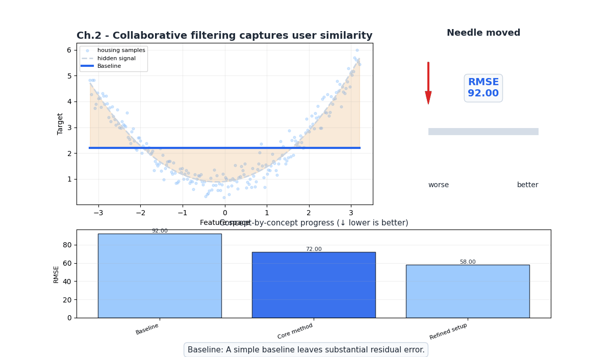
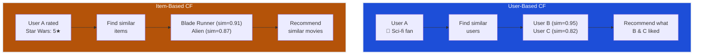
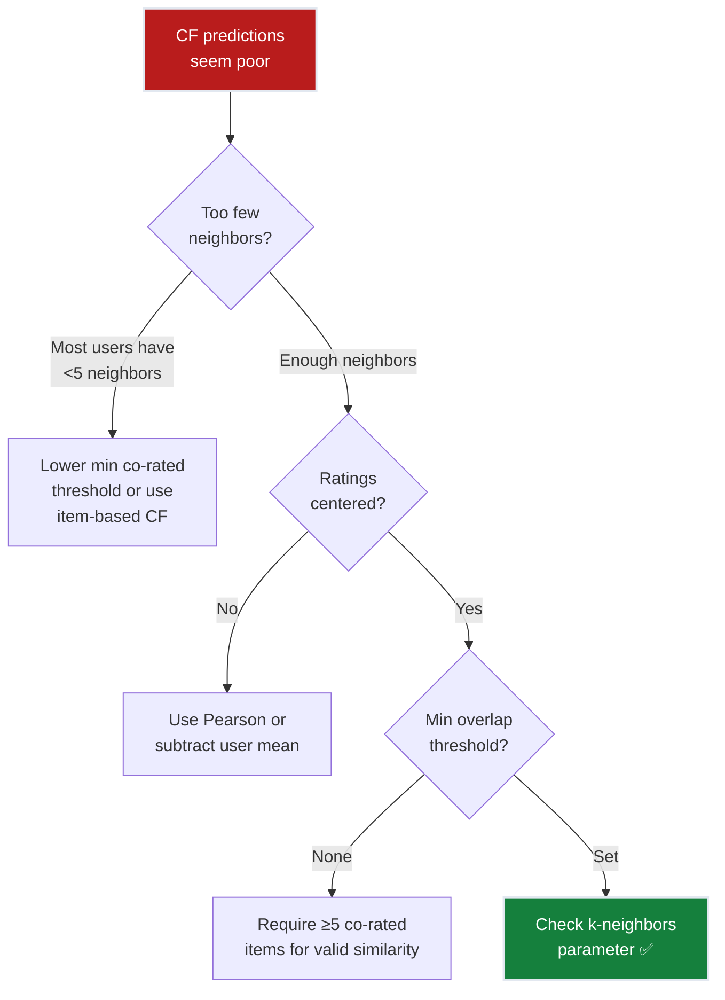

# Ch.2 — Collaborative Filtering

> **The story.** In **1994**, Paul Resnick and colleagues at MIT coined the term "collaborative filtering" in their **GroupLens** paper, describing a system where users collaboratively filter information by recording their reactions. The core insight was radical: you don't need to understand *what* an item is — you only need to know *who liked it*. If Alice and Bob rate 50 movies almost identically, Alice will probably enjoy what Bob liked but she hasn't seen yet. Amazon's 1998 patent on **item-based collaborative filtering** (Linden, Smith, York) flipped the perspective: instead of finding similar users, find similar items. This proved more scalable and more stable — items don't change tastes, but users do. The Netflix Prize (2006–2009) showed that CF alone could get within 6% of the winning solution. Today, CF remains the backbone of recommendation at Spotify, YouTube, and TikTok.
>
> **Where you are in the curriculum.** Chapter two. The popularity baseline from Ch.1 gave everyone the same 10 movies (42% hit rate). Now we personalise: find users with similar taste (user-based CF) or movies with similar rating patterns (item-based CF), and recommend accordingly. This is the first time our system treats different users differently.
>
> **Notation in this chapter.** $\text{sim}(a, b)$ — similarity between two users or items; $\mathcal{N}_k(u)$ — the $k$ nearest neighbors of user $u$; $\bar{r}_u$ — mean rating of user $u$; $r_{ui}$ — rating by user $u$ on item $i$; $\hat{r}_{ui}$ — predicted rating.

---

## 0 · The Challenge — Where We Are

> 💡 **The mission**: Launch **FlixAI** — >85% hit rate@10 across 5 constraints.

**What we unlocked in Ch.1:**
- Evaluation framework (HR@10, Precision@k, NDCG)
- Popularity baseline = 42% hit rate@10
- Understanding of data sparsity (93.7%)

**What's blocking us:**
The popularity baseline gives **everyone the same list**. A 20-year-old action fan and a 60-year-old romance lover see identical recommendations. We need **personalisation** — but how?

The idea: if two users rated many of the same movies similarly, they probably have similar taste. Recommend what one liked to the other.

| Constraint | Status | Notes |
|-----------|--------|-------|
| ACCURACY >85% HR@10 | ❌ 42% → ? | Personalisation should help |
| COLD START | ❌ Degrades | New user = no ratings = no neighbors |
| SCALABILITY | ⚠️ O(m²) or O(n²) | Pairwise similarity is expensive |
| DIVERSITY | ⚠️ Moderate | Neighbors may have diverse taste |
| EXPLAINABILITY | ✅ Natural | "Users like you also watched X" |


---

## Animation



## 1 · Core Idea

Collaborative filtering makes predictions based on the collective behavior of all users. **User-based CF** finds users with similar rating patterns and aggregates their preferences. **Item-based CF** finds items that tend to be rated similarly and recommends items similar to what you already liked. Both approaches rely on a similarity function (cosine, Pearson) applied to the sparse user-item matrix.

---

## 2 · Running Example

After the popularity baseline flopped with the VP ("That's not personalisation!"), you're tasked with building a real personalised recommender. You notice that User 196 and User 186 both love sci-fi: they've rated Blade Runner, Alien, and The Matrix almost identically. User 196 also rated "2001: A Space Odyssey" 5 stars — but User 186 hasn't seen it. The CF system should recommend it.

**Dataset**: Same MovieLens 100k — but now we exploit the user-item matrix structure, not just aggregate popularity.

---

## 3 · Math

### Cosine Similarity

Measures the angle between two rating vectors, ignoring magnitude:

$$\text{sim}_{\cos}(u, v) = \frac{\sum_{i \in I_{uv}} r_{ui} \cdot r_{vi}}{\sqrt{\sum_{i \in I_{uv}} r_{ui}^2} \cdot \sqrt{\sum_{i \in I_{uv}} r_{vi}^2}}$$

where $I_{uv}$ is the set of items rated by both users $u$ and $v$.

**Concrete example**: User A rated {Star Wars: 5, Alien: 4, Titanic: 2}. User B rated {Star Wars: 4, Alien: 5, Titanic: 1}.

$$\text{sim}(A, B) = \frac{5 \cdot 4 + 4 \cdot 5 + 2 \cdot 1}{\sqrt{25 + 16 + 4} \cdot \sqrt{16 + 25 + 1}} = \frac{42}{\sqrt{45} \cdot \sqrt{42}} = \frac{42}{6.71 \times 6.48} = 0.966$$

High similarity — both prefer sci-fi over romance.

### Pearson Correlation

Centers ratings by each user's mean (handles "generous raters" vs "harsh raters"):

$$\text{sim}_{\text{Pearson}}(u, v) = \frac{\sum_{i \in I_{uv}} (r_{ui} - \bar{r}_u)(r_{vi} - \bar{r}_v)}{\sqrt{\sum_{i \in I_{uv}} (r_{ui} - \bar{r}_u)^2} \cdot \sqrt{\sum_{i \in I_{uv}} (r_{vi} - \bar{r}_v)^2}}$$

**Why Pearson over cosine?** If User A rates everything 4–5 (generous) and User B rates 1–3 (harsh), cosine says they're dissimilar. Pearson corrects for this by centering: both users rank sci-fi above romance, so they're similar in *relative preference*.

### User-Based CF Prediction

Predict user $u$'s rating for item $i$ using a weighted average of the $k$ most similar users' ratings:

$$\hat{r}_{ui} = \bar{r}_u + \frac{\sum_{v \in \mathcal{N}_k(u)} \text{sim}(u, v) \cdot (r_{vi} - \bar{r}_v)}{\sum_{v \in \mathcal{N}_k(u)} |\text{sim}(u, v)|}$$

**Concrete example**: Predict User A's rating for "The Matrix":
- Neighbor 1 (sim=0.95): rated 5, mean=3.5 → deviation = +1.5
- Neighbor 2 (sim=0.82): rated 4, mean=3.0 → deviation = +1.0
- Neighbor 3 (sim=0.70): rated 3, mean=3.2 → deviation = −0.2
- User A's mean = 3.8

$$\hat{r}_{A,\text{Matrix}} = 3.8 + \frac{0.95(1.5) + 0.82(1.0) + 0.70(-0.2)}{0.95 + 0.82 + 0.70} = 3.8 + \frac{2.105}{2.47} = 3.8 + 0.85 = 4.65$$

Prediction: User A would rate The Matrix ~4.65 → strong recommendation.

### Item-Based CF Prediction

Instead of finding similar users, find similar *items*:

$$\hat{r}_{ui} = \frac{\sum_{j \in \mathcal{N}_k(i)} \text{sim}(i, j) \cdot r_{uj}}{\sum_{j \in \mathcal{N}_k(i)} |\text{sim}(i, j)|}$$

where $\mathcal{N}_k(i)$ are the $k$ items most similar to item $i$ that user $u$ has rated.

**Why item-based often beats user-based:**
1. Item similarities are more **stable** — movies don't change genre, but user tastes evolve
2. **Fewer items** than users in most systems → smaller similarity matrix
3. Item similarities can be **precomputed** offline

### Worked 3×3 Example — Cosine Similarity & Prediction

Rating matrix $R$ (— = not rated):

| | Movie1 (Star Wars) | Movie2 (Fargo) | Movie3 (Pulp Fiction) |
|---|---|---|---|
| **Alice** | 5 | 3 | — |
| **Bob** | 4 | 2 | 5 |
| **Carol** | — | 4 | 3 |

**Step 1 — sim(Alice, Bob)** on co-rated items {Movie1, Movie2}:

$$\text{sim}(Alice, Bob) = \frac{5 \times 4 + 3 \times 2}{\sqrt{5^2+3^2} \cdot \sqrt{4^2+2^2}} = \frac{26}{\sqrt{34} \cdot \sqrt{20}} = \frac{26}{26.05} \approx 0.998$$

**Step 2 — Predict Alice's rating for Movie3** (Bob is her sole neighbor, sim = 0.998):

$\bar{r}_{Alice} = (5+3)/2 = 4.0$, $\bar{r}_{Bob} = (4+2+5)/3 = 3.67$

$$\hat{r}_{Alice, M3} = 4.0 + \frac{0.998 \times (5 - 3.67)}{0.998} = 4.0 + 1.33 = \mathbf{5.33} \rightarrow \text{clip to } 5.0$$

➡️ Pulp Fiction is Alice's top recommendation with predicted rating 5.0.

---

## 4 · Step by Step

```
USER-BASED COLLABORATIVE FILTERING
────────────────────────────────────
1. Build user-item matrix R (sparse)
   └─ Rows = users, Columns = items, Values = ratings

2. For target user u and candidate item i:
   a. Find all users V who rated item i
   b. Compute sim(u, v) for all v ∈ V using Pearson correlation
   c. Select top-k neighbors by similarity (k = 30–50)
   d. Predict: r̂_ui = r̄_u + weighted_avg(deviations of neighbors)

3. Rank all unrated items by predicted rating
4. Return top-10 as recommendations

ITEM-BASED COLLABORATIVE FILTERING
────────────────────────────────────
1. Build item-item similarity matrix S (precomputed)
   └─ S[i][j] = cosine_sim(column_i, column_j) of R

2. For target user u and candidate item i:
   a. Find items J that user u has rated
   b. Compute weighted average of u's ratings on J,
      weighted by sim(i, j)
   c. r̂_ui = Σ sim(i,j) × r_uj / Σ |sim(i,j)|

3. Rank all unrated items by predicted rating
4. Return top-10 as recommendations
```

---

## 5 · Key Diagrams

### User-Based vs Item-Based CF



### Similarity Computation Pipeline


---

## 6 · Hyperparameter Dial

| Parameter | Too Low | Sweet Spot | Too High |
|-----------|---------|------------|----------|
| **k** (neighbors) | k=5: too few signals, noisy predictions | k=30–50: good bias-variance trade-off | k=200: includes dissimilar users, dilutes signal |
| **Min co-rated items** | 0: similarity from 1 shared movie (meaningless) | 5–10: reasonable overlap required | 50: too strict, very few valid pairs |
| **Similarity metric** | — | Pearson for user-based (handles rating scale bias) | — |
| **Similarity metric** | — | Cosine for item-based (magnitude less important) | — |
| **Rating threshold** | 1: all ratings are "positive" | 4+: confident positive signal | 5: too strict |

---

## 7 · Code Skeleton

```python
import numpy as np
from scipy.sparse import csr_matrix
from sklearn.metrics.pairwise import cosine_similarity

# ── Build sparse user-item matrix ────────────────────────────────────────
def build_sparse_matrix(ratings, n_users, n_items):
    """Create a sparse CSR matrix from rating triplets."""
    row = ratings['user_id'].values - 1  # 0-indexed
    col = ratings['item_id'].values - 1
    data = ratings['rating'].values
    return csr_matrix((data, (row, col)), shape=(n_users, n_items))

# ── Item-based CF ────────────────────────────────────────────────────────
def item_based_cf(R_sparse, user_idx, k=30, n_recs=10):
    """Recommend top-n items for a user using item-based CF."""
    # Item-item similarity (cosine)
    item_sim = cosine_similarity(R_sparse.T)
    np.fill_diagonal(item_sim, 0)  # no self-similarity
    
    user_ratings = R_sparse[user_idx].toarray().flatten()
    rated_items = np.where(user_ratings > 0)[0]
    
    scores = np.zeros(R_sparse.shape[1])
    for i in range(R_sparse.shape[1]):
        if user_ratings[i] > 0:
            continue  # already rated
        # Top-k similar items that user has rated
        sims = item_sim[i][rated_items]
        top_k_idx = np.argsort(sims)[-k:]
        top_k_sims = sims[top_k_idx]
        top_k_ratings = user_ratings[rated_items[top_k_idx]]
        
        denom = np.sum(np.abs(top_k_sims))
        if denom > 0:
            scores[i] = np.dot(top_k_sims, top_k_ratings) / denom
    
    return np.argsort(scores)[-n_recs:][::-1]
```

---

## 8 · What Can Go Wrong

| Mistake | Symptom | Fix |
|---------|---------|-----|
| **Not centering ratings** | Generous raters dominate predictions | Use Pearson (centers by mean) or subtract user mean before cosine |
| **Too few co-rated items** | Similarity = 1.0 from a single shared movie | Set minimum overlap threshold (≥5 co-rated items) |
| **Dense similarity matrix** | OOM on large datasets | Use sparse representation, only store top-k neighbors |
| **Recommending already-rated items** | Wasted recommendation slots | Filter training items before generating top-k |
| **Cold start users** | Zero neighbors → no predictions | Fall back to popularity baseline for new users |




---

## 9 · Where This Reappears

Neighborhood-based similarity and the concept of learning from peer behavior reappear in:

- **Ch.3 Matrix Factorization**: the same user-item split and evaluation harness are reused; MF solves the sparsity limitation exposed here.
- **Anomaly Detection (Topic 5)**: peer-group baselines (normal behavior = what neighbors do) mirror user-user similarity logic.
- **AI / RAG & Vector DBs**: cosine similarity over embedding vectors is the dense-space equivalent of item-item similarity; the math is identical.

## 10 · Progress Check

| # | Constraint | Target | Ch.2 Status | Notes |
|---|-----------|--------|-------------|-------|
| 1 | ACCURACY | >85% HR@10 | ❌ 68% | +26 points from personalisation! But still 17 points short |
| 2 | COLD START | New users/items | ❌ Fails | New user = no ratings = no neighbors = popularity fallback |
| 3 | SCALABILITY | 1M+ ratings | ⚠️ O(n²) | Pairwise similarity expensive for large catalogs |
| 4 | DIVERSITY | Not just popular | ⚠️ Better | Neighbors may surface niche items, but popular items still dominate |
| 5 | EXPLAINABILITY | "Because you liked X" | ✅ Natural | "Users who liked Star Wars also liked Blade Runner" |

**Bottom line**: 68% hit rate — a 26-point jump from popularity! But sparsity is killing us. 93.7% of the matrix is empty, so most user pairs share very few ratings. We need a way to **fill in the blanks**.

---

## 11 · Bridge to Next Chapter

Collaborative filtering hit a wall: the user-item matrix is 93.7% empty, which means most user pairs share too few ratings to compute meaningful similarity. What if we could **compress** the matrix into a dense, low-dimensional representation where every user and every item has a compact vector? That's **matrix factorization** — decompose $R \approx U \cdot V^T$ where $U$ and $V$ are dense factor matrices. Even if two users never rated the same movie, their factor vectors can still be close if they have similar latent taste.

**What Ch.3 solves**: Sparsity problem via latent factors → 78% hit rate.

**What Ch.3 can't solve (yet)**: Linear factorization can't capture complex non-linear taste interactions (e.g., "likes sci-fi AND comedy but hates sci-fi comedies"). We'll need neural networks (Ch.4) for that.


