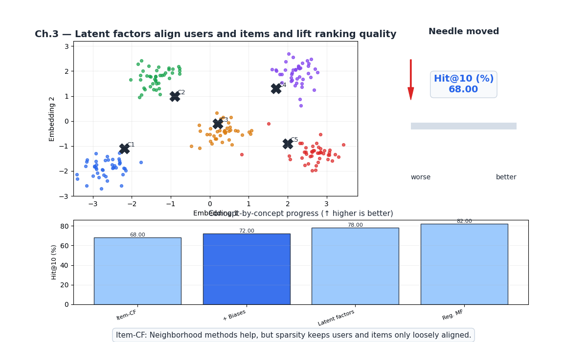
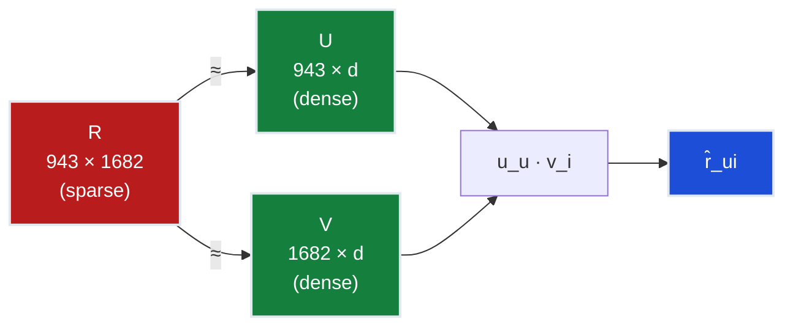
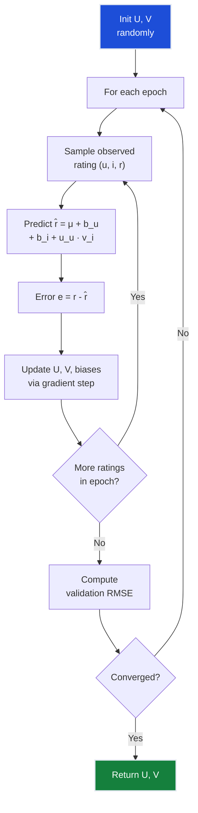
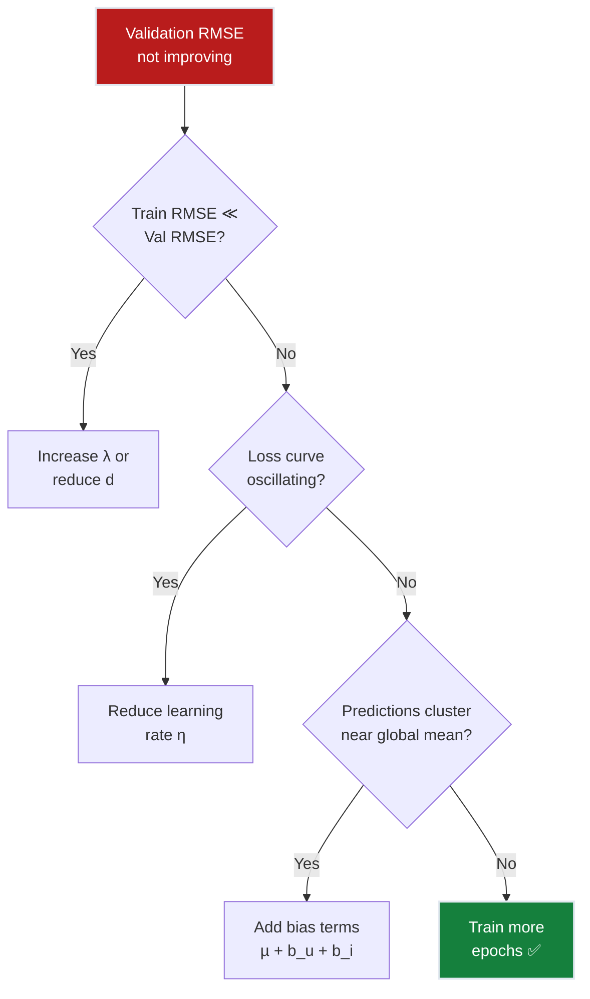

# Ch.3 — Matrix Factorization



*Visual takeaway: once users and items are pulled into the same latent space, sparsity hurts less and the top-10 ranking quality moves upward.*

> **The story.** In **1999**, Daniel Lee and Sebastian Seung published "Learning the parts of objects by non-negative matrix factorization" in *Nature*, popularising the idea that a matrix can be decomposed into latent factors that reveal hidden structure. The recommender systems community took notice, but the real explosion came with the **Netflix Prize** (2006–2009). Simon Funk (pseudonym) published a blog post in 2006 describing a simple SGD-based matrix factorization that rocketed him up the leaderboard. Yehuda Koren and colleagues at Yahoo! and AT&T Labs refined the approach into **SVD++** and demonstrated that factorization models could outperform all neighborhood-based methods. Their 2009 paper "Matrix Factorization Techniques for Recommender Systems" became the most cited paper in the field. The key insight: even if two users never rated the same movie, their latent factor vectors can be close — capturing "cerebral sci-fi lover" or "90s comedy fan" without those categories ever being explicitly defined.
>
> **Where you are in the curriculum.** Chapter three. Collaborative filtering (Ch.2) achieved 68% hit rate but was crippled by sparsity — 93.7% of the matrix is empty, so most user pairs share too few ratings. Matrix factorization solves this by mapping users and items into a shared latent space where the dot product approximates the rating. This is the first time we learn *latent representations* — the same idea that powers word embeddings and deep learning.
>
> **Notation in this chapter.** $R \in \mathbb{R}^{m \times n}$ — user-item rating matrix; $U \in \mathbb{R}^{m \times d}$ — user factor matrix; $V \in \mathbb{R}^{n \times d}$ — item factor matrix; $d$ — number of latent factors; $\lambda$ — regularisation strength; $\mathbf{u}_u$ — latent vector for user $u$; $\mathbf{v}_i$ — latent vector for item $i$.

---

## 0 · The Challenge — Where We Are

> 🎯 **The mission**: Launch **FlixAI** — >85% hit rate@10 across 5 constraints.

**What we unlocked in Ch.2:**
- ✅ Personalised recommendations via collaborative filtering = 68% HR@10
- ✅ Explainable: "Users like you also watched X"
- ❌ Sparsity kills: 93.7% empty matrix → weak similarity estimates

**What's blocking us:**
Collaborative filtering needs **shared ratings** between users to compute similarity. But in a 943×1682 matrix with 93.7% missing entries, most user pairs share fewer than 5 movies. The similarity estimates are noisy, and coverage is poor.

**The idea:** Don't compute pairwise similarities directly. Instead, **learn a compressed representation** — map each user and each item to a $d$-dimensional vector. The dot product of these vectors approximates the rating. Even if users never rated the same movie, their vectors can be close.

| Constraint | Status | Notes |
|-----------|--------|-------|
| ACCURACY >85% HR@10 | ❌ 68% → ? | Latent factors should help with sparsity |
| COLD START | ❌ Still fails | New user = no vector learned |
| SCALABILITY | ✅ Much better | O(d) prediction, O(k·d) per iteration |
| DIVERSITY | ⚠️ Moderate | Latent space may surface niche items |
| EXPLAINABILITY | ⚠️ Harder | Latent factors aren't directly interpretable |


---

## 1 · Core Idea

Matrix factorization decomposes the sparse user-item matrix $R$ into two dense, low-rank matrices: a user factor matrix $U$ and an item factor matrix $V$, such that $R \approx U \cdot V^T$. Each user is represented by a $d$-dimensional vector capturing their latent preferences (e.g., "likes action", "prefers old movies"), and each item by a $d$-dimensional vector capturing its latent attributes. The dot product $\mathbf{u}_u^T \mathbf{v}_i$ predicts how much user $u$ will like item $i$. Training minimises the reconstruction error on observed ratings plus a regularisation penalty.

---

## 2 · Running Example

The CF system from Ch.2 couldn't recommend "2001: A Space Odyssey" to User 42 because none of User 42's neighbors had rated it. But matrix factorization discovers that User 42's latent vector is [0.8, −0.3, 0.5] (high on "cerebral", low on "romance", medium on "classic") and "2001" 's vector is [0.9, −0.4, 0.7] — their dot product is high even though no neighbor connection exists. The latent space bridges the sparsity gap.

---

## 3 · Math

### The Factorization

Approximate the rating matrix as a product of two low-rank matrices:

$$R \approx U \cdot V^T$$

where $U \in \mathbb{R}^{m \times d}$ (users × factors), $V \in \mathbb{R}^{n \times d}$ (items × factors).

A single rating prediction:

$$\hat{r}_{ui} = \mathbf{u}_u^T \mathbf{v}_i = \sum_{f=1}^{d} u_{uf} \cdot v_{if}$$

**Concrete example** ($d = 3$ factors: "action", "cerebral", "romance"):

User 42: $\mathbf{u}_{42} = [0.8, 0.5, -0.3]$
Movie "Inception": $\mathbf{v}_{\text{Inc}} = [0.7, 0.9, -0.1]$

$$\hat{r}_{42,\text{Inc}} = 0.8 \times 0.7 + 0.5 \times 0.9 + (-0.3) \times (-0.1) = 0.56 + 0.45 + 0.03 = 1.04$$

After adding bias terms and rescaling, this maps to a predicted rating of ~4.2.

### Loss Function with Regularisation

Minimise reconstruction error on observed ratings with L2 regularisation:

$$\mathcal{L} = \sum_{(u,i) \in \text{observed}} (r_{ui} - \mathbf{u}_u^T \mathbf{v}_i)^2 + \lambda \left( \|\mathbf{u}_u\|^2 + \|\mathbf{v}_i\|^2 \right)$$

| Term | Purpose |
|------|---------|
| $(r_{ui} - \mathbf{u}_u^T \mathbf{v}_i)^2$ | Reconstruction error — fit observed ratings |
| $\lambda \|\mathbf{u}_u\|^2$ | Prevent user vectors from growing too large |
| $\lambda \|\mathbf{v}_i\|^2$ | Prevent item vectors from growing too large |

Without regularisation ($\lambda = 0$), the model memorises training ratings perfectly but generalises poorly (overfitting).

### Adding Bias Terms

Users and items have inherent biases (some users rate generously, some movies are universally liked):

$$\hat{r}_{ui} = \mu + b_u + b_i + \mathbf{u}_u^T \mathbf{v}_i$$

where $\mu$ is the global mean rating, $b_u$ is the user bias, and $b_i$ is the item bias.

**Concrete example**: Global mean $\mu = 3.53$. User 42 rates 0.3 above average ($b_u = 0.3$). "Inception" is 0.5 above average ($b_i = 0.5$). Interaction term = 1.04.

$$\hat{r}_{42,\text{Inc}} = 3.53 + 0.3 + 0.5 + 1.04 = 5.37 \rightarrow \text{clip to } 5.0$$

### Gradients for SGD

For each observed rating $(u, i, r_{ui})$, compute the error $e_{ui} = r_{ui} - \hat{r}_{ui}$:

$$\mathbf{u}_u \leftarrow \mathbf{u}_u + \eta \left( e_{ui} \cdot \mathbf{v}_i - \lambda \cdot \mathbf{u}_u \right)$$
$$\mathbf{v}_i \leftarrow \mathbf{v}_i + \eta \left( e_{ui} \cdot \mathbf{u}_u - \lambda \cdot \mathbf{v}_i \right)$$
$$b_u \leftarrow b_u + \eta \left( e_{ui} - \lambda \cdot b_u \right)$$
$$b_i \leftarrow b_i + \eta \left( e_{ui} - \lambda \cdot b_i \right)$$

### Alternating Least Squares (ALS)

Instead of SGD, fix one matrix and solve for the other in closed form, alternating:

1. Fix $V$, solve for $U$: $\mathbf{u}_u = (V_u^T V_u + \lambda I)^{-1} V_u^T \mathbf{r}_u$ for each user
2. Fix $U$, solve for $V$: $\mathbf{v}_i = (U_i^T U_i + \lambda I)^{-1} U_i^T \mathbf{r}_i$ for each item
3. Repeat until convergence

**ALS vs SGD trade-off:**

| | SGD | ALS |
|---|---|---|
| **Speed** | Fast per step | Slower per step (matrix inversion) |
| **Convergence** | Needs learning rate tuning | Guaranteed convergence |
| **Parallelism** | Hard to parallelise | Embarrassingly parallel (rows/columns independent) |
| **Implicit data** | Needs adaptation | Natural fit (weighted regularisation) |

---

## 4 · Step by Step

```
SGD-BASED MATRIX FACTORIZATION
────────────────────────────────
1. Initialise U, V ~ Normal(0, 0.01), shape (m, d) and (n, d)
   Initialise biases b_u, b_i = 0

2. For each epoch (50–200 epochs):
   a. Shuffle observed ratings
   b. For each (u, i, r_ui) in observed:
      ├─ Predict: r̂ = μ + b_u + b_i + u_u · v_i
      ├─ Error:   e = r_ui - r̂
      ├─ Update:  u_u += η(e · v_i - λ · u_u)
      ├─ Update:  v_i += η(e · u_u - λ · v_i)
      ├─ Update:  b_u += η(e - λ · b_u)
      └─ Update:  b_i += η(e - λ · b_i)
   c. Compute validation RMSE

3. Generate recommendations:
   └─ For each user u, score all unrated items by r̂ = μ + b_u + b_i + u_u · v_i
   └─ Return top-10
```

---

## 5 · Key Diagrams

### Factorization Visual



### Training Loop



---

## 6 · Hyperparameter Dial

| Parameter | Too Low | Sweet Spot | Too High |
|-----------|---------|------------|----------|
| **d** (latent factors) | d=2: can't capture taste complexity | d=20–50: good expressiveness vs overfitting | d=500: overfits, slow training |
| **λ** (regularisation) | λ=0: severe overfitting | λ=0.01–0.1: balanced | λ=10: underfits, all predictions ≈ global mean |
| **η** (learning rate) | η=0.0001: extremely slow convergence | η=0.005–0.02: stable learning | η=0.5: diverges, loss explodes |
| **epochs** | 5: underfitted | 50–200: converged | 1000: wasted compute, overfitting if no early stop |
| **bias terms** | No biases: ignores user/item tendencies | Include µ, b_u, b_i | — |

---

## 7 · Code Skeleton

```python
import numpy as np

class MatrixFactorization:
    def __init__(self, n_users, n_items, n_factors=20, lr=0.005, reg=0.02):
        self.U = np.random.normal(0, 0.01, (n_users, n_factors))
        self.V = np.random.normal(0, 0.01, (n_items, n_factors))
        self.b_u = np.zeros(n_users)
        self.b_i = np.zeros(n_items)
        self.mu = 0.0
        self.lr = lr
        self.reg = reg
    
    def fit(self, ratings, n_epochs=50):
        """Train via SGD on observed ratings."""
        self.mu = ratings['rating'].mean()
        for epoch in range(n_epochs):
            shuffled = ratings.sample(frac=1)
            for _, row in shuffled.iterrows():
                u, i, r = int(row['user_id']-1), int(row['item_id']-1), row['rating']
                pred = self.mu + self.b_u[u] + self.b_i[i] + self.U[u] @ self.V[i]
                err = r - pred
                
                # Update factors
                self.U[u] += self.lr * (err * self.V[i] - self.reg * self.U[u])
                self.V[i] += self.lr * (err * self.U[u] - self.reg * self.V[i])
                self.b_u[u] += self.lr * (err - self.reg * self.b_u[u])
                self.b_i[i] += self.lr * (err - self.reg * self.b_i[i])
    
    def predict(self, user_id, item_id):
        u, i = user_id - 1, item_id - 1
        return self.mu + self.b_u[u] + self.b_i[i] + self.U[u] @ self.V[i]
    
    def recommend(self, user_id, rated_items, top_k=10):
        u = user_id - 1
        scores = self.mu + self.b_u[u] + self.b_i + self.U[u] @ self.V.T
        scores[rated_items] = -np.inf  # exclude already rated
        return np.argsort(scores)[-top_k:][::-1]
```

---

## 8 · What Can Go Wrong

| Mistake | Symptom | Fix |
|---------|---------|-----|
| **No bias terms** | High RMSE, predictions cluster around global mean | Add µ + b_u + b_i to prediction |
| **Too many factors** | Train RMSE → 0, test RMSE increases | Reduce d or increase λ |
| **Learning rate too high** | Loss oscillates or diverges | Reduce η; try ALS instead |
| **Not shuffling per epoch** | SGD gets stuck in patterns | Shuffle ratings each epoch |
| **Ignoring implicit feedback** | Treats "not rated" as "no data" equally | Use ALS with confidence weighting (Hu et al. 2008) |




---

## 9 · Where This Reappears

Latent-factor embeddings learned by gradient descent are the conceptual ancestor of nearly every embedding in the curriculum:

- **Ch.4 Neural CF**: replaces the dot product with an MLP but reuses the same user and item embedding tables.
- **NeuralNetworks (Topic 3) / Ch.10 Transformers**: token embeddings are learned by the same SGD-on-embedding-table mechanism.
- **AI / RAG & Vector DBs**: document and query embeddings are low-rank projections of the same kind; ALS parallelism appears in distributed training (AIInfrastructure).

## 10 · Progress Check

| # | Constraint | Target | Ch.3 Status | Notes |
|---|-----------|--------|-------------|-------|
| 1 | ACCURACY | >85% HR@10 | ❌ 78% | +10 from CF! Latent factors handle sparsity |
| 2 | COLD START | New users/items | ❌ Still fails | New user/item = no learned vector |
| 3 | SCALABILITY | 1M+ ratings | ✅ Good | SGD is O(observed) per epoch; ALS parallelisable |
| 4 | DIVERSITY | Not just popular | ⚠️ Better | Latent space can surface niche items |
| 5 | EXPLAINABILITY | "Because you liked X" | ❌ Harder | Latent factors aren't human-interpretable |

**Bottom line**: 78% hit rate — the latent factor model overcame the sparsity wall. But the model is linear: $\hat{r} = \mathbf{u}^T\mathbf{v}$ is a dot product, which can only model linear interactions between factors. Complex taste patterns (like "loves sci-fi + comedy but hates sci-fi comedies") are invisible.

---

## 11 · Bridge to Next Chapter

Matrix factorization learns user and item embeddings, but the prediction function is a simple dot product — a **linear** operation. This means it can't capture non-linear taste interactions. What if we replaced the dot product with a **neural network** that takes user and item embeddings as input and learns arbitrary interaction functions? That's **Neural Collaborative Filtering** (NCF) — the architecture that combines a Generalized Matrix Factorization (GMF) path with a Multi-Layer Perceptron (MLP) path to model both linear and non-linear user-item interactions.

**What Ch.4 solves**: Non-linear interaction modeling → 83% hit rate.

**What Ch.4 can't solve (yet)**: The model still only uses rating data. Adding content features (genres, directors, user demographics) requires a hybrid approach (Ch.5).
