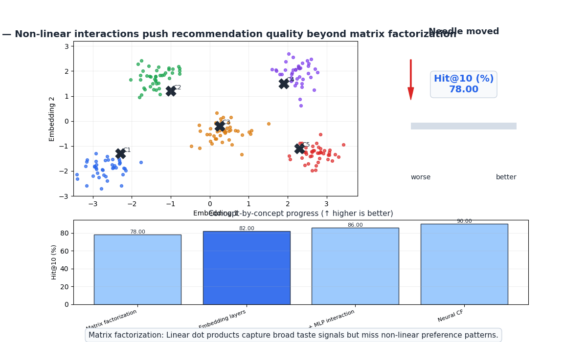
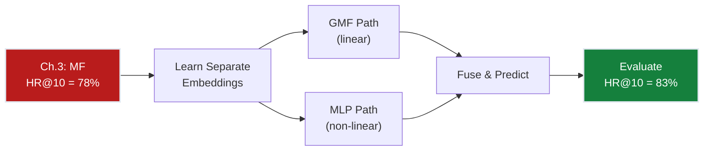
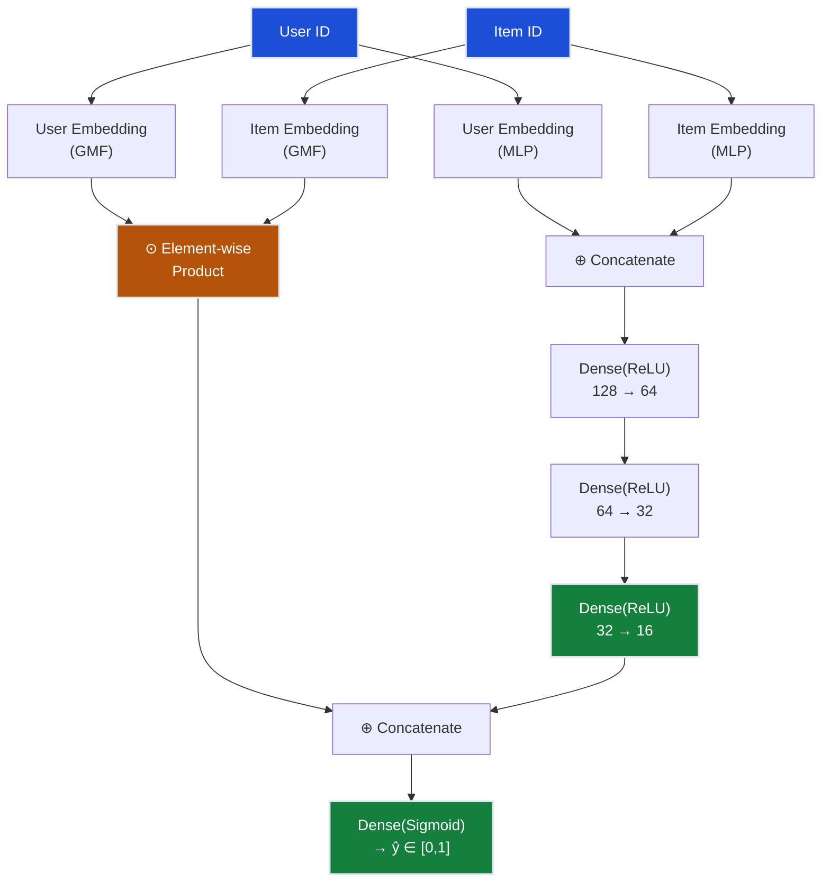
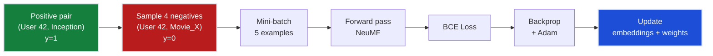
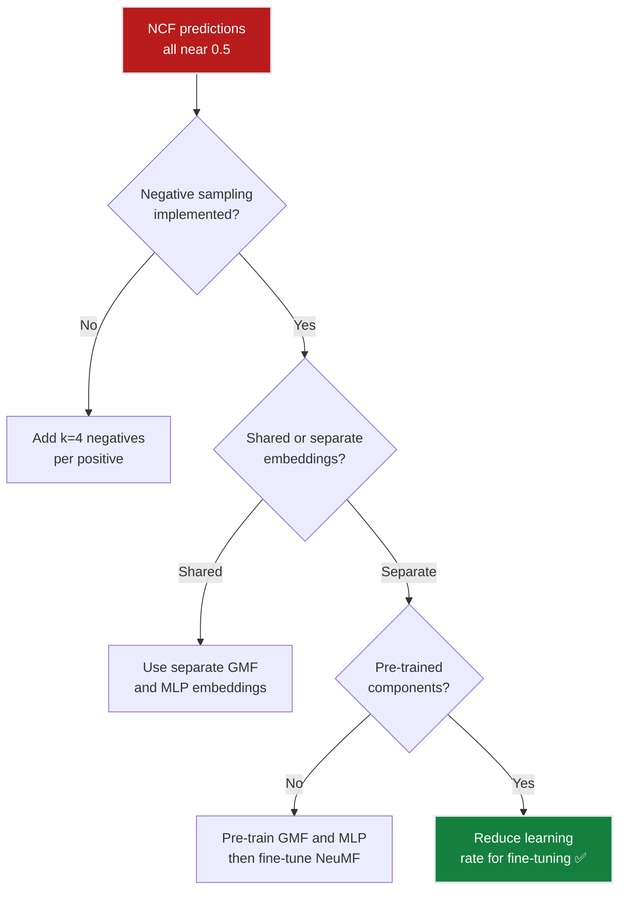

# Ch.4 — Neural Collaborative Filtering



*Visual takeaway: once user-item interactions are learned non-linearly (not just by a dot product), ranking quality climbs past the matrix-factorization ceiling.*

> **The story.** In **2017**, Xiangnan He and colleagues at the National University of Singapore published "Neural Collaborative Filtering" (WWW 2017), proposing that the inner product in matrix factorization is *too simple* to capture complex user-item interactions. Their key contribution: replace the dot product with a **neural network** that takes user and item embeddings as input and learns an arbitrary interaction function. The architecture combines two paths — **Generalized Matrix Factorization (GMF)** for linear interactions and a **Multi-Layer Perceptron (MLP)** for non-linear ones — fused in a final prediction layer. The paper demonstrated consistent improvements over pure MF on MovieLens and Pinterest datasets, and launched a wave of deep learning for recommendations. Today, variants of NCF power recommendation engines at Alibaba, JD.com, and Pinterest.
>
> **Where you are in the curriculum.** Chapter four. Matrix factorization (Ch.3) reached 78% hit rate but is limited to linear interactions ($\hat{r} = \mathbf{u}^T\mathbf{v}$). Neural CF replaces the dot product with learned non-linear functions, capturing complex taste patterns like "likes sci-fi + comedy separately but hates sci-fi comedies." This is the first deep learning model in the track.
>
> **Notation in this chapter.** $\mathbf{p}_u$ — user embedding vector; $\mathbf{q}_i$ — item embedding vector; $\odot$ — element-wise (Hadamard) product; $\oplus$ — concatenation; $\sigma$ — sigmoid activation; $\phi$ — neural network layers; $\hat{y}_{ui}$ — predicted interaction probability.

---

## 0 · The Challenge — Where We Are

> 💡 **The mission**: Launch **FlixAI** — >85% hit rate@10 across 5 constraints.

**What we unlocked in Ch.3:**
- Matrix factorization handles sparsity via latent factors = 78% HR@10
- Efficient: SGD/ALS scales to large datasets
- Linear dot product can't model complex interactions

**What's blocking us:**
The dot product $\mathbf{u}^T\mathbf{v}$ is a weighted sum of factor products — it's linear. Consider this: User A loves action films (factor 1 high) and comedies (factor 2 high), but dislikes action-comedies. A linear model can't capture this because $u_1 v_1 + u_2 v_2$ doesn't have an interaction term for "action AND comedy."

| Constraint | Status | Notes |
|-----------|--------|-------|
| ACCURACY >85% HR@10 | ❌ 78% → ? | Non-linear model should close the gap |
| COLD START | ❌ Still fails | Embedding requires training data |
| SCALABILITY | ⚠️ Moderate | Neural net is heavier than dot product |
| DIVERSITY | ⚠️ Moderate | Embedding space may be richer |
| EXPLAINABILITY | ❌ Hard | Deep model = less interpretable |



---

## 1 · Core Idea

Neural Collaborative Filtering (NCF) replaces the fixed dot product of matrix factorization with a **learnable neural network** that models user-item interactions. It uses two parallel pathways: a **GMF** (Generalized Matrix Factorization) path that captures linear interactions via element-wise product, and an **MLP** path that captures non-linear interactions via stacked dense layers. The outputs are concatenated and fed through a final prediction layer. Crucially, GMF and MLP use **separate embedding spaces**, allowing each path to learn different aspects of user-item relationships.

---

## 2 · Running Example

Matrix factorization predicted User 42 would rate "Pulp Fiction" 3.8 — decent but not a top-10 recommendation. But User 42 has a quirky pattern: they love Tarantino films AND 90s nostalgia, and "Pulp Fiction" sits at the intersection. A linear model can't capture this AND-relationship because the dot product treats factors independently. The neural MLP path, however, learns that when both the "Tarantino" and "90s" factors are high simultaneously, the prediction should jump non-linearly. NCF predicts 4.6 — now it's a top-10 recommendation.

---

## 3 · Math

### Problem Formulation: Implicit Feedback

NCF is typically trained on **implicit feedback** (binary: interacted or not) rather than explicit ratings:

$$y_{ui} = \begin{cases} 1 & \text{if user } u \text{ interacted with item } i \\ 0 & \text{otherwise (sampled negative)} \end{cases}$$

The model predicts $\hat{y}_{ui} \in [0, 1]$ — the probability of interaction.

### GMF Path (Linear)

Element-wise product of user and item embeddings:

$$\phi^{\text{GMF}} = \mathbf{p}_u^G \odot \mathbf{q}_i^G$$

where $\odot$ is the Hadamard (element-wise) product. This generalises matrix factorization — with a unit weight vector $\mathbf{h}$, it reduces to the standard dot product:

$$\hat{y}_{ui}^{\text{GMF}} = \sigma(\mathbf{h}^T (\mathbf{p}_u^G \odot \mathbf{q}_i^G))$$

### MLP Path (Non-Linear)

Concatenate user and item embeddings, then pass through stacked dense layers:

$$\mathbf{z}_0 = \mathbf{p}_u^M \oplus \mathbf{q}_i^M$$
$$\mathbf{z}_1 = \text{ReLU}(W_1 \mathbf{z}_0 + b_1)$$
$$\mathbf{z}_2 = \text{ReLU}(W_2 \mathbf{z}_1 + b_2)$$
$$\vdots$$
$$\phi^{\text{MLP}} = \text{ReLU}(W_L \mathbf{z}_{L-1} + b_L)$$

Each layer halves the dimension (tower pattern): e.g., 128 → 64 → 32 → 16.

### NeuMF: Fusing GMF + MLP

Concatenate both path outputs and predict:

$$\hat{y}_{ui} = \sigma \left( \mathbf{h}^T \left[ \phi^{\text{GMF}} \oplus \phi^{\text{MLP}} \right] \right)$$

**Concrete example** (d=4):

User 42 embeddings: $\mathbf{p}^G = [0.8, 0.3, -0.5, 0.2]$, $\mathbf{p}^M = [0.6, -0.1, 0.4, 0.7]$

Movie "Inception" embeddings: $\mathbf{q}^G = [0.7, 0.5, -0.3, 0.1]$, $\mathbf{q}^M = [0.5, 0.8, -0.2, 0.3]$

GMF: $\mathbf{p}^G \odot \mathbf{q}^G = [0.56, 0.15, 0.15, 0.02]$

MLP input: $[\mathbf{p}^M \oplus \mathbf{q}^M] = [0.6, -0.1, 0.4, 0.7, 0.5, 0.8, -0.2, 0.3]$ → through 3 ReLU layers → $\phi^{\text{MLP}} = [0.3, 0.7, 0.1, 0.5]$

Fused: $[0.56, 0.15, 0.15, 0.02, 0.3, 0.7, 0.1, 0.5]$ → $\sigma(\mathbf{h}^T \cdot \text{fused}) = 0.87$

Prediction: 87% probability of interaction → strong recommendation.

### Loss Function: Binary Cross-Entropy

$$\mathcal{L} = -\sum_{(u,i) \in \mathcal{Y}^+} \log \hat{y}_{ui} - \sum_{(u,j) \in \mathcal{Y}^-} \log(1 - \hat{y}_{uj})$$

where $\mathcal{Y}^+$ are observed interactions and $\mathcal{Y}^-$ are sampled negatives.

### Negative Sampling

For each positive $(u, i)$ interaction, sample $k$ negative items that user $u$ did NOT interact with:

$$\text{For each } (u, i) \in \mathcal{Y}^+: \text{ sample } j_1, j_2, \ldots, j_k \notin \{i : r_{ui} > 0\}$$

Typical ratio: 4 negatives per positive ($k = 4$).

**Why negative sampling matters**: Without it, the model sees only positive examples and learns to predict 1 for everything. Negatives teach it to discriminate.

### Worked 3×3 Example — NCF Forward Pass

Implicit interaction matrix $Y$ (1 = watched, 0 = not):

| | Movie1 | Movie2 | Movie3 |
|---|---|---|---|
| **Alice** | 1 | 0 | 1 |
| **Bob** | 1 | 1 | 0 |
| **Carol** | 0 | 1 | 1 |

**Predict $\hat{y}_{Alice, Movie2}$** (a negative pair to train on) with $d_{GMF} = d_{MLP} = 2$:

| Path | Alice emb | Movie2 emb | Intermediate |
|------|-----------|-----------|--------------|
| GMF | $\mathbf{p}^G=[0.6, 0.4]$ | $\mathbf{q}^G=[0.2, 0.9]$ | $\mathbf{p}^G \odot \mathbf{q}^G = [0.12, 0.36]$ |
| MLP | $\mathbf{p}^M=[0.8, -0.3]$ | $\mathbf{q}^M=[0.1, 0.7]$ | concat → ReLU layer → $[0.11, 0.21]$ |

Fused: $[0.12, 0.36, 0.11, 0.21]$ with output weights $\mathbf{h}=[0.3, 0.5, 0.2, 0.4]$:

$$\hat{y}_{Alice, M2} = \sigma(0.3 \times 0.12 + 0.5 \times 0.36 + 0.2 \times 0.11 + 0.4 \times 0.21) = \sigma(0.322) \approx 0.58$$

Target $y=0$, so BCE loss pushes $\hat{y}$ downward — embeddings for Alice and Movie2 are updated to be less compatible.

---

## 4 · Step by Step

```
NEURAL COLLABORATIVE FILTERING (NeuMF)
────────────────────────────────────────
1. Prepare data:
   ├─ Convert ratings to implicit: y_ui = 1 if rated, 0 if not
   ├─ For each positive, sample k=4 negatives
   └─ Train/val/test split (leave-one-out)

2. Build model:
   ├─ User embedding (GMF): lookup table → d_GMF dimensions
   ├─ Item embedding (GMF): lookup table → d_GMF dimensions
   ├─ User embedding (MLP): lookup table → d_MLP dimensions
   ├─ Item embedding (MLP): lookup table → d_MLP dimensions
   ├─ GMF path: element-wise product → h_GMF
   ├─ MLP path: concat → Dense(ReLU) × L → h_MLP
   └─ Fusion: concat(h_GMF, h_MLP) → Dense(sigmoid) → ŷ

3. Train with BCE loss + Adam optimiser
   ├─ Batch size: 256
   ├─ Learning rate: 0.001
   └─ Epochs: 20–50 (early stopping on val HR@10)

4. Evaluate:
   └─ For each test user, rank 100 items (1 positive + 99 negatives)
   └─ Compute HR@10 and NDCG@10
```

---

## 5 · Key Diagrams

### NeuMF Architecture



### Training with Negative Sampling



---

## 6 · Hyperparameter Dial

| Parameter | Too Low | Sweet Spot | Too High |
|-----------|---------|------------|----------|
| **d_GMF** (GMF embedding dim) | d=4: too few linear factors | d=16–32: captures major patterns | d=256: overfits |
| **d_MLP** (MLP embedding dim) | d=8: bottleneck | d=32–64: room for non-linear features | d=512: memory heavy |
| **MLP layers** | 1: barely non-linear | 3–4: good depth | 8: vanishing gradients, slow |
| **Negative ratio** | k=1: weak discrimination | k=4: standard | k=20: training slow, diminishing returns |
| **Learning rate** | 0.00001: very slow | 0.001: standard for Adam | 0.1: diverges |
| **Batch size** | 32: noisy gradients | 256: stable + fast | 4096: generalises worse |

---

## 7 · Code Skeleton

```python
import torch
import torch.nn as nn

class NeuMF(nn.Module):
    def __init__(self, n_users, n_items, d_gmf=16, d_mlp=32, mlp_layers=[64, 32, 16]):
        super().__init__()
        # GMF embeddings
        self.user_gmf = nn.Embedding(n_users, d_gmf)
        self.item_gmf = nn.Embedding(n_items, d_gmf)
        # MLP embeddings
        self.user_mlp = nn.Embedding(n_users, d_mlp)
        self.item_mlp = nn.Embedding(n_items, d_mlp)
        
        # MLP tower
        layers = []
        input_dim = d_mlp * 2
        for hidden in mlp_layers:
            layers.append(nn.Linear(input_dim, hidden))
            layers.append(nn.ReLU())
            input_dim = hidden
        self.mlp = nn.Sequential(*layers)
        
        # Fusion
        self.output = nn.Linear(d_gmf + mlp_layers[-1], 1)
        self.sigmoid = nn.Sigmoid()
    
    def forward(self, user_ids, item_ids):
        # GMF path
        gmf = self.user_gmf(user_ids) * self.item_gmf(item_ids)
        # MLP path
        mlp_input = torch.cat([self.user_mlp(user_ids), self.item_mlp(item_ids)], dim=-1)
        mlp = self.mlp(mlp_input)
        # Fuse
        fused = torch.cat([gmf, mlp], dim=-1)
        return self.sigmoid(self.output(fused)).squeeze()

# Training loop sketch
model = NeuMF(n_users=943, n_items=1682)
optimizer = torch.optim.Adam(model.parameters(), lr=0.001)
criterion = nn.BCELoss()

for epoch in range(20):
    for users, items, labels in train_loader:
        preds = model(users, items)
        loss = criterion(preds, labels.float())
        optimizer.zero_grad()
        loss.backward()
        optimizer.step()
```

---

## 8 · What Can Go Wrong

| Mistake | Symptom | Fix |
|---------|---------|-----|
| **No negative sampling** | Model predicts 1.0 for everything | Sample k=4 negatives per positive |
| **Shared embeddings for GMF and MLP** | Constrains both paths to same space | Use separate embedding tables |
| **No pre-training** | Slow convergence, poor local minimum | Pre-train GMF and MLP separately, then fine-tune jointly |
| **Popularity bias in negatives** | Rare items never appear as negatives | Use popularity-weighted negative sampling |
| **Evaluating on all items** | Unrealistically hard evaluation | Sample 99 negatives + 1 positive per test user |




---

## 9 · Where This Reappears

Neural embedding fusion between a linear path (GMF) and a non-linear path (MLP) reappears in:

- **Ch.5 Hybrid Systems**: adds content features as a third input tower to the same fusion architecture.
- **MultimodalAI / MultimodalLLMs**: image-text fusion models combine a vision encoder and a text encoder using the same two-tower-then-merge pattern.
- **AI / FineTuning**: adapter layers grafted onto frozen embeddings follow the same "freeze one tower, tune the other" intuition explored here.

## 10 · Progress Check

| # | Constraint | Target | Ch.4 Status | Notes |
|---|-----------|--------|-------------|-------|
| 1 | ACCURACY | >85% HR@10 | ❌ 83% | +5 from MF! Non-linear model helps but still 2 points short |
| 2 | COLD START | New users/items | ❌ Still fails | Embeddings require interaction history |
| 3 | SCALABILITY | 1M+ ratings | ⚠️ Heavier | GPU needed for training; inference is fast |
| 4 | DIVERSITY | Not just popular | ⚠️ Moderate | Non-linear space may capture niche patterns |
| 5 | EXPLAINABILITY | "Because you liked X" | ❌ Hard | Neural network = black box |

**Bottom line**: 83% hit rate — just 2 points from the target! The non-linear MLP captures taste interactions that linear MF missed. But we're using only rating data. Adding content features (genres, directors) could close the remaining gap.

---

## 11 · Bridge to Next Chapter

NCF is powerful but uses only collaborative signals (who rated what). It ignores rich **content features**: movie genres, director, release year, user age, occupation. What if we combined both? A **hybrid system** fuses collaborative embeddings with content features, using architectures like Deep & Cross Networks to model explicit feature interactions. This is the approach that will push us past 85%.

**What Ch.5 solves**: Fusing content + collaborative features → 87% hit rate ✅ target achieved.

**What Ch.5 can't solve (yet)**: Cold start for brand-new users with zero interaction history (Ch.6).

➡️ **Clustering insight:** Hybrid systems that group users by behaviour rely on the same mechanics as k-means — see [07-UnsupervisedLearning/ch01-clustering](../../../07-UnsupervisedLearning/ch01-clustering/) for the full walkthrough.
