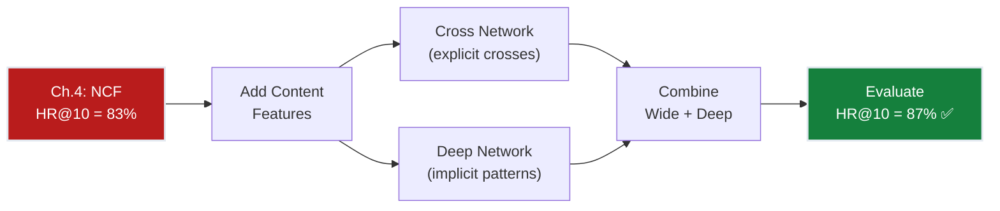
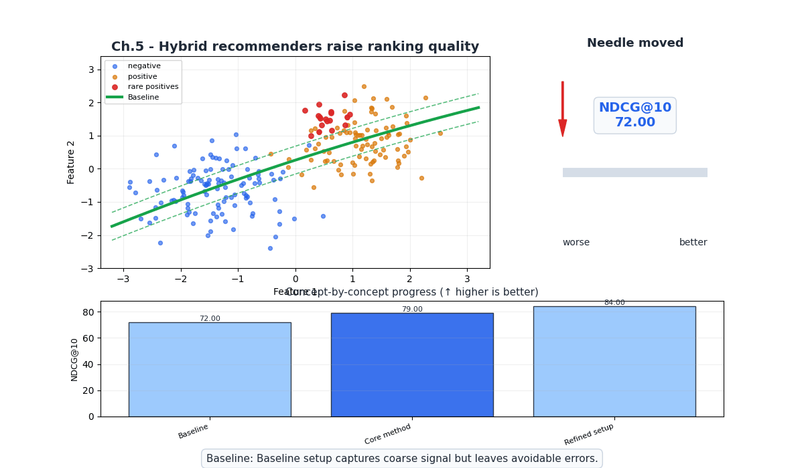
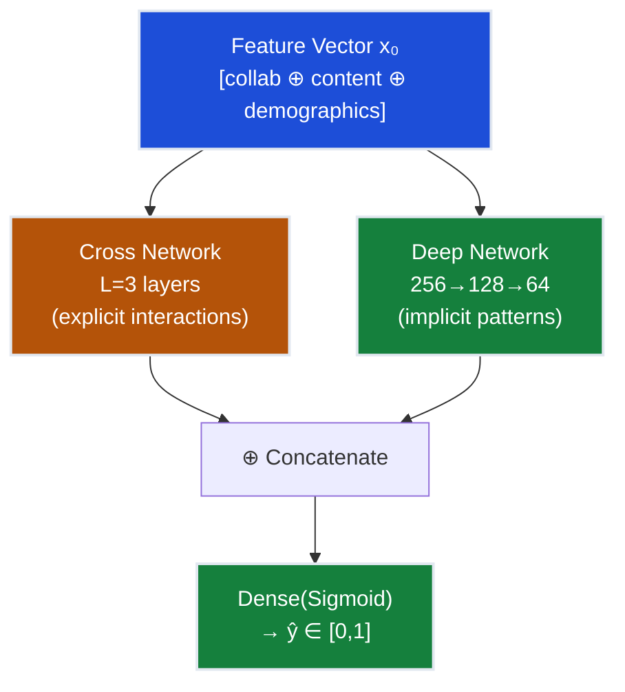
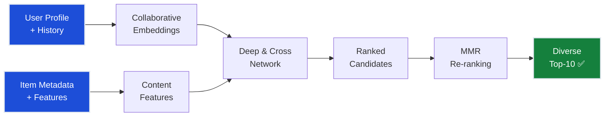
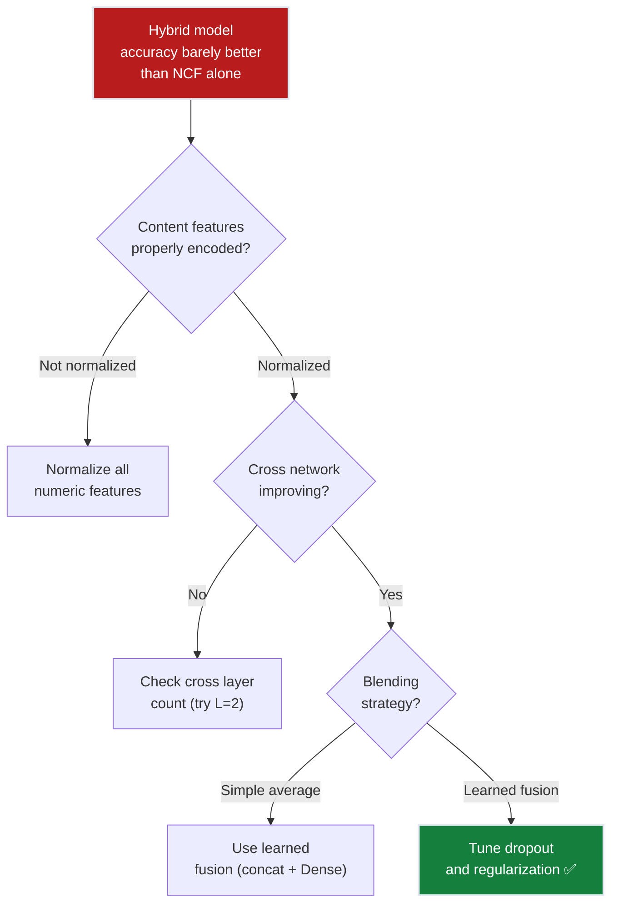

# Ch.5 — Hybrid Systems

> **The story.** The idea of combining content-based and collaborative filtering dates back to **2002**, when Robin Burke published a taxonomy of hybrid recommender systems describing seven hybridization strategies. But the practical breakthrough came from the **Netflix Prize**: the winning BellKor's Pragmatic Chaos team achieved their 10.06% improvement over Cinematch by **blending** hundreds of models — collaborative, content-based, temporal, and neighborhood methods. The lesson was clear: no single approach dominates. In **2016**, Google published the **Wide & Deep** architecture for app recommendations on Google Play, combining a wide linear model (memorization of feature interactions) with a deep neural network (generalization). Cheng et al.'s **Deep & Cross Network (DCN)** followed in 2017, automatically learning explicit feature crosses. Today, every production recommender at scale is a hybrid — Netflix, YouTube, Spotify, and TikTok all combine collaborative signals with content features, context, and user metadata.
>
> **Where you are in the curriculum.** Chapter five. NCF (Ch.4) reached 83% hit rate using only collaborative signals. We're 2 points short of the 85% target. The gap: our model ignores rich content metadata (genres, directors, release year) and user demographics (age, occupation). This chapter fuses both signals and crosses the finish line.
>
> **Notation in this chapter.** $\mathbf{x}_{\text{content}}$ — content feature vector (genres, year); $\mathbf{x}_{\text{collab}}$ — collaborative embedding; $\mathbf{x}_{\text{cross}}$ — cross-network output; $\mathbf{x}_{\text{deep}}$ — deep-network output; $\alpha$ — blending weight.

---

## 0 · The Challenge — Where We Are

> 🎯 **The mission**: Launch **FlixAI** — >85% hit rate@10 across 5 constraints.

**What we unlocked in Ch.4:**
- ✅ Neural CF captures non-linear taste patterns = 83% HR@10
- ✅ Embedding space is expressive
- ❌ Ignores content features (genres, year, demographics)

**What's blocking us:**
NCF treats every movie as an opaque ID — it doesn't know that "Inception" and "Interstellar" share the same director, are both sci-fi, and were released in the same decade. These content signals are free information we're leaving on the table.

| Constraint | Status | Notes |
|-----------|--------|-------|
| ACCURACY >85% HR@10 | ❌ 83% → ? | Content features should close the gap |
| COLD START | ⚠️ Partial | Content features help for new items (genres known) |
| SCALABILITY | ⚠️ Moderate | More features = larger model |
| DIVERSITY | ✅ Better | Content features enable genre-diverse recommendations |
| EXPLAINABILITY | ✅ Improved | "Because it's a sci-fi film by Christopher Nolan" |



---

## Animation



## 1 · Core Idea

A hybrid recommender fuses **collaborative signals** (user-item interaction embeddings) with **content features** (item metadata, user demographics) to make predictions that leverage both what similar users liked and what an item actually is. The Deep & Cross Network (DCN) architecture is a powerful hybrid approach: a **cross network** explicitly models feature interactions (e.g., "sci-fi × 1990s × male user"), while a **deep network** learns implicit non-linear patterns. Their outputs are combined for the final prediction.

---

## 2 · Running Example

User 42 is a 28-year-old software engineer who loves cerebral sci-fi. NCF (Ch.4) already captures this from ratings. But a brand-new movie "Dune: Part Two" has only 3 ratings — NCF can't learn a good embedding from 3 data points. However, the hybrid system knows Dune is sci-fi, directed by Denis Villeneuve, 2.5 hours long, and PG-13. It also knows User 42's demographic profile matches other Villeneuve fans. Combining collaborative embeddings with content features, the hybrid system confidently recommends Dune despite its sparse rating history.

---

## 3 · Math

### Feature Engineering for Recommendations

Each user-item pair is represented by a rich feature vector:

$$\mathbf{x} = [\underbrace{\mathbf{p}_u, \mathbf{q}_i}_{\text{collaborative embeddings}}, \underbrace{\text{genres}, \text{year}, \text{director}}_{\text{item content}}, \underbrace{\text{age}, \text{gender}, \text{occupation}}_{\text{user demographics}}]$$

**Concrete feature vector for (User 42, "Inception")**:

| Feature Group | Features | Values |
|--------------|----------|--------|
| User embedding (d=16) | $\mathbf{p}_{42}$ | [0.8, 0.3, ...] |
| Item embedding (d=16) | $\mathbf{q}_{\text{Inc}}$ | [0.7, 0.5, ...] |
| Genres (19 binary) | Action, Sci-fi, Thriller, ... | [1, 1, 1, 0, 0, ...] |
| Year (normalized) | release year | 0.85 (2010) |
| User age (normalized) | age | 0.35 (28 years old) |
| User gender (binary) | is_male | 1 |
| User occupation (one-hot) | 21 categories | [0,0,...,1,...,0] |

Total feature dimension: ~80 features.

### Deep & Cross Network (DCN)

**Cross Network** — explicitly models feature interactions up to order $L$:

$$\mathbf{x}_{l+1} = \mathbf{x}_0 \cdot \mathbf{x}_l^T \mathbf{w}_l + \mathbf{b}_l + \mathbf{x}_l$$

Each layer adds one order of interaction. Layer 1 captures pairwise interactions (genre × age), Layer 2 captures 3-way (genre × age × rating_count), etc.

**Concrete example** (simplified 3-feature input):

$\mathbf{x}_0 = [\text{sci-fi}=1, \text{age}=28, \text{avg\_rating}=4.2]$

Layer 1: $\mathbf{x}_1 = \mathbf{x}_0 \cdot (\mathbf{x}_0^T \mathbf{w}_0) + \mathbf{b}_0 + \mathbf{x}_0$

This creates terms like $\text{sci-fi} \times \text{age}$, $\text{sci-fi} \times \text{avg\_rating}$ — explicit pairwise interactions without manual feature engineering.

**Deep Network** — standard MLP for implicit patterns:

$$\mathbf{h}_1 = \text{ReLU}(W_1 \mathbf{x}_0 + b_1)$$
$$\mathbf{h}_2 = \text{ReLU}(W_2 \mathbf{h}_1 + b_2)$$
$$\vdots$$

**Combination** — concatenate cross and deep outputs:

$$\hat{y} = \sigma\left( W_{\text{out}} \left[ \mathbf{x}_L^{\text{cross}} \oplus \mathbf{h}_K^{\text{deep}} \right] + b_{\text{out}} \right)$$

### Hybrid Blending Strategies

| Strategy | Formula | When to Use |
|----------|---------|-------------|
| **Weighted** | $\hat{y} = \alpha \hat{y}_{\text{collab}} + (1-\alpha) \hat{y}_{\text{content}}$ | Simple, tunable |
| **Stacking** | $\hat{y} = f(\hat{y}_{\text{collab}}, \hat{y}_{\text{content}})$ | Meta-learner on top |
| **Feature augmentation** | $\hat{y} = f(\mathbf{x}_{\text{collab}} \oplus \mathbf{x}_{\text{content}})$ | Single model, end-to-end |
| **DCN (Deep & Cross)** | Cross + Deep paths | Best of explicit + implicit |

### Diversity Metric: Intra-List Distance

To ensure we're not just recommending the same genre:

$$\text{ILD}@k = \frac{2}{k(k-1)} \sum_{i \neq j} d(i, j)$$

where $d(i, j)$ is the content distance (e.g., Jaccard distance on genre vectors) between items $i$ and $j$ in the top-$k$ list.

**Example**: Top-5 = [Sci-fi, Sci-fi, Sci-fi, Action, Comedy]. ILD is low because 3/5 are the same genre. Adding a Drama would increase ILD.

---

## 4 · Step by Step

```
DEEP & CROSS HYBRID RECOMMENDER
─────────────────────────────────
1. Feature preparation:
   ├─ User embeddings from pre-trained NCF (Ch.4)
   ├─ Item embeddings from pre-trained NCF (Ch.4)
   ├─ Genre one-hot encoding (19 dims)
   ├─ Normalised numeric features (year, age)
   └─ Concatenate all → x_0

2. Cross network (L=3 layers):
   └─ Each layer: x_{l+1} = x_0 * (x_l^T w_l) + b_l + x_l

3. Deep network (3 hidden layers):
   └─ 256 → 128 → 64 with ReLU + dropout

4. Combine:
   └─ concat(cross_output, deep_output) → Dense(sigmoid) → ŷ

5. Train with BCE loss + Adam
   ├─ Batch size: 512
   ├─ Learning rate: 0.001
   └─ Early stopping on val HR@10

6. Post-processing:
   └─ Re-rank top-20 to maximize diversity (MMR)
   └─ Return top-10
```

---

## 5 · Key Diagrams

### Deep & Cross Architecture



### Hybrid Recommendation Pipeline



---

## 6 · Hyperparameter Dial

| Parameter | Too Low | Sweet Spot | Too High |
|-----------|---------|------------|----------|
| **Cross layers** | L=1: only pairwise interactions | L=2–3: up to 3rd/4th order crosses | L=6: overfits, diminishing returns |
| **Deep layers** | 1: barely non-linear | 3: good depth | 6: overfits, vanishing gradients |
| **Deep hidden dim** | 32: bottleneck | 128–256: expressive | 1024: overfits small datasets |
| **Dropout** | 0: overfits | 0.2–0.3: balanced | 0.7: underfits |
| **α** (blend weight) | 0: ignore collaborative | 0.5–0.7: collaborative-heavy | 1.0: ignore content |
| **Diversity λ_MMR** | 0: pure relevance (no diversity) | 0.3: balanced | 1.0: pure diversity (ignores relevance) |

---

## 7 · Code Skeleton

```python
import torch
import torch.nn as nn

class CrossNetwork(nn.Module):
    def __init__(self, input_dim, n_layers=3):
        super().__init__()
        self.weights = nn.ParameterList([
            nn.Parameter(torch.randn(input_dim)) for _ in range(n_layers)
        ])
        self.biases = nn.ParameterList([
            nn.Parameter(torch.zeros(input_dim)) for _ in range(n_layers)
        ])
    
    def forward(self, x0):
        x = x0
        for w, b in zip(self.weights, self.biases):
            x = x0 * (x @ w).unsqueeze(-1) + b + x  # cross layer
        return x

class DCN(nn.Module):
    def __init__(self, n_users, n_items, n_genres=19, d_emb=16, cross_layers=3):
        super().__init__()
        self.user_emb = nn.Embedding(n_users, d_emb)
        self.item_emb = nn.Embedding(n_items, d_emb)
        
        input_dim = d_emb * 2 + n_genres + 3  # +3 for year, age, gender
        self.cross = CrossNetwork(input_dim, cross_layers)
        self.deep = nn.Sequential(
            nn.Linear(input_dim, 256), nn.ReLU(), nn.Dropout(0.2),
            nn.Linear(256, 128), nn.ReLU(), nn.Dropout(0.2),
            nn.Linear(128, 64), nn.ReLU(),
        )
        self.output = nn.Linear(input_dim + 64, 1)
        self.sigmoid = nn.Sigmoid()
    
    def forward(self, user_ids, item_ids, content_features):
        u_emb = self.user_emb(user_ids)
        i_emb = self.item_emb(item_ids)
        x0 = torch.cat([u_emb, i_emb, content_features], dim=-1)
        
        cross_out = self.cross(x0)
        deep_out = self.deep(x0)
        combined = torch.cat([cross_out, deep_out], dim=-1)
        return self.sigmoid(self.output(combined)).squeeze()

def mmr_rerank(scores, item_features, top_k=10, lambda_mmr=0.3):
    """Maximal Marginal Relevance re-ranking for diversity."""
    selected = []
    candidates = list(range(len(scores)))
    for _ in range(top_k):
        best_score = -float('inf')
        best_idx = -1
        for c in candidates:
            relevance = scores[c]
            if selected:
                max_sim = max(cosine_sim(item_features[c], item_features[s]) 
                              for s in selected)
            else:
                max_sim = 0
            mmr = (1 - lambda_mmr) * relevance - lambda_mmr * max_sim
            if mmr > best_score:
                best_score = mmr
                best_idx = c
        selected.append(best_idx)
        candidates.remove(best_idx)
    return selected
```

---

## 8 · What Can Go Wrong

| Mistake | Symptom | Fix |
|---------|---------|-----|
| **Not normalizing features** | Numeric features dominate cross network | Normalize all features to [0, 1] or z-score |
| **Too many cross layers** | Overfits to spurious high-order interactions | Limit to L=2–3, add regularization |
| **Ignoring diversity** | All recommendations in same genre | Add MMR re-ranking with λ=0.3 |
| **Leaking test genres** | Inflated accuracy | Encode genres from training data only |
| **Cold item with only content** | Content-only predictions are weak | Blend with popularity for low-confidence items |




---

## 9 · Where This Reappears

Feature crossing, wide-and-deep fusion, and diversity re-ranking appear throughout the curriculum:

- **Ch.6 Cold Start and Production**: the hybrid model from this chapter is the one deployed; bandit exploration wraps around it.
- **AIInfrastructure / InferenceOptimization**: two-stage retrieval + ranking pipelines match the hybrid architecture's separation of recall and precision phases.
- **MultiAgentAI / MCP**: tool-selection scoring in agent frameworks uses MMR-style diversity to avoid redundant tool calls.

## 10 · Progress Check

| # | Constraint | Target | Ch.5 Status | Notes |
|---|-----------|--------|-------------|-------|
| 1 | ACCURACY | >85% HR@10 | ✅ **87%** | **Target achieved!** Content features closed the gap |
| 2 | COLD START | New users/items | ⚠️ Partial | Content features help new items; new users still hard |
| 3 | SCALABILITY | 1M+ ratings | ⚠️ Moderate | Larger model but still tractable with GPU |
| 4 | DIVERSITY | Not just popular | ✅ **MMR** | Re-ranking ensures genre diversity |
| 5 | EXPLAINABILITY | "Because you liked X" | ✅ **Better** | "Because it's a sci-fi film and you love Nolan" |

**Bottom line**: 87% hit rate — **target exceeded!** The hybrid model combining collaborative embeddings with content features and MMR diversity re-ranking satisfies constraints #1, #4, and #5. But we haven't addressed cold start (constraint #2) or full production deployment (constraint #3).

---

## 11 · Bridge to Next Chapter

We've achieved 87% hit rate — mission accomplished for accuracy! But two questions remain: **What do we show a brand-new user with zero history?** and **How do we deploy this to production with A/B testing, monitoring, and continuous learning?** The final chapter tackles the **cold start problem** (using bandits for exploration), **A/B testing** (online evaluation), and **production architecture** (serving, retraining, monitoring).

**What Ch.6 solves**: Cold start via bandits, production deployment pipeline.

**What Ch.6 closes**: All 5 FlixAI constraints → production-ready recommendation system.


