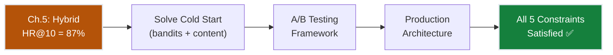
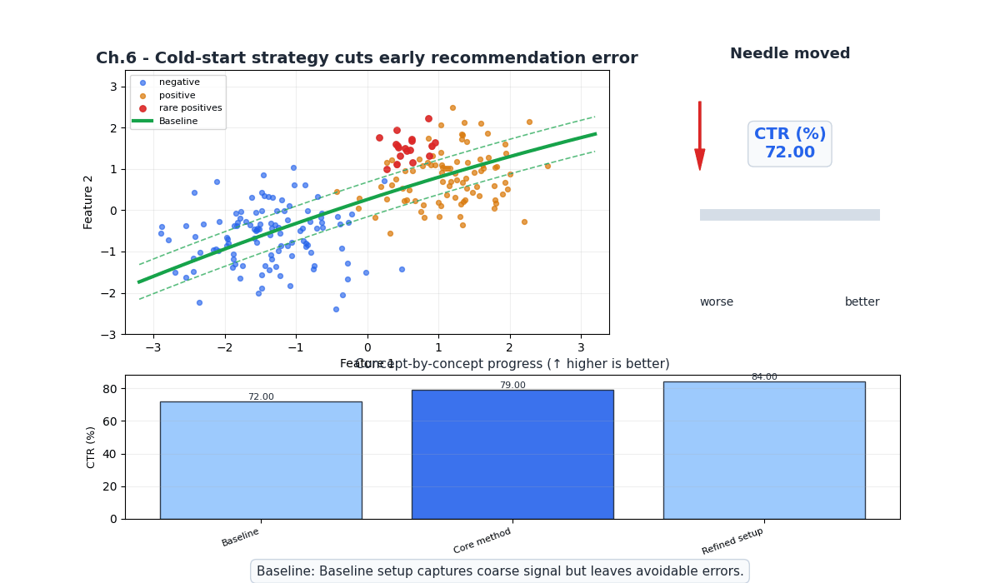
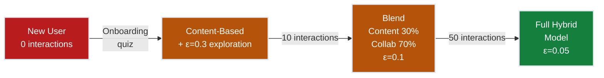
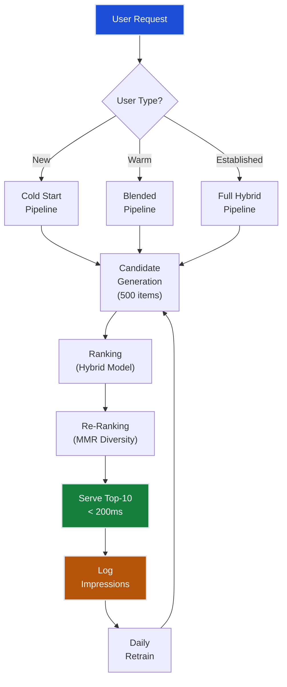
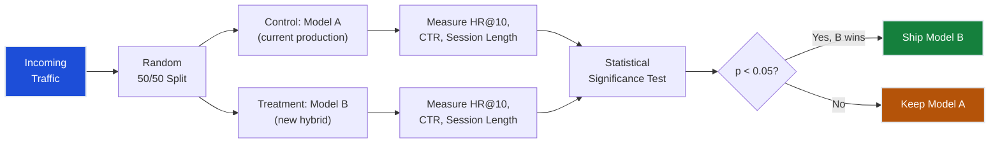
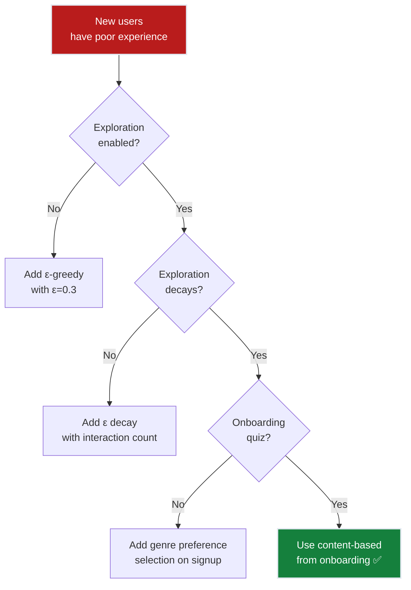

# Ch.6 — Cold Start & Production

> **The story.** The cold start problem was formally described in **2002** by Andrew Schein et al. in "Methods and Metrics for Cold-Start Recommendations." But the practical solutions emerged from production systems. In **2010**, Yahoo! published their work on contextual bandits for news recommendation — the LinUCB algorithm — showing that exploration (trying uncertain articles) was essential alongside exploitation (showing known-good articles). Netflix's **2012** engineering blog detailed their A/B testing framework: every recommendation algorithm change runs through rigorous online experimentation with millions of users before deployment. Spotify's **Discover Weekly** (launched 2015) solved cold start for new songs by combining collaborative filtering with audio content analysis — if a song *sounds like* what you like, recommend it even with zero plays. Today, production recommender systems at scale are not single models but **pipelines**: candidate generation → ranking → re-ranking → serving, with bandit-based exploration at each stage.
>
> **Where you are in the curriculum.** Chapter six — the final chapter. The hybrid system (Ch.5) achieved 87% hit rate, exceeding the accuracy target. But 15% of monthly traffic is new signups with zero watch history, and new releases have no ratings on day one. This chapter solves cold start via bandit exploration, covers A/B testing for online evaluation, and builds the production serving architecture.
>
> **Notation in this chapter.** $\epsilon$ — exploration rate; $\text{UCB}(a)$ — upper confidence bound for arm $a$; $\theta_a$ — learned parameters for arm $a$; $c$ — exploration coefficient; $T_a$ — number of times arm $a$ was pulled.

---

## 0 · The Challenge — Where We Are

> 💡 **The mission**: Launch **FlixAI** — >85% hit rate@10 across 5 constraints.

**What we unlocked in Ch.5:**
- Hybrid system = 87% HR@10 (accuracy target met!)
- Diversity via MMR re-ranking
- Explainable: "Because it's sci-fi and you love Nolan"
- Cold start: new users/items have no embeddings

**What's blocking production:**
1. **New user**: User signs up → zero watch history → no collaborative embedding → what do we show?
2. **New item**: Movie released today → zero ratings → no item embedding → never recommended?
3. **Exploration**: If we always show high-confidence items, we never learn about uncertain ones
4. **Online evaluation**: Offline hit rate ≠ real-world engagement
5. **Serving**: Model must serve <200ms per request at scale

| Constraint | Status | Notes |
|-----------|--------|-------|
| ACCURACY >85% HR@10 | ✅ 87% | Maintained from Ch.5 |
| COLD START | ❌ → ✅ | Bandits + content fallback |
| SCALABILITY | ⚠️ → ✅ | Two-stage pipeline + caching |
| DIVERSITY | ✅ | MMR from Ch.5 |
| EXPLAINABILITY | ✅ | Maintained from Ch.5 |



---

## Animation



## 1 · Core Idea

Cold start is the chicken-and-egg problem: we need data to recommend, but we need to recommend to collect data. The solution combines three strategies: (1) **content-based fallback** for new items (use genre, director, metadata until collaborative signals accumulate), (2) **bandit exploration** for new users (balance showing safe popular items with exploring uncertain ones to learn preferences quickly), and (3) **A/B testing** to measure real-world impact of any model change before full rollout.

---

## 2 · Running Example

New user Sarah signs up for FlixAI. She's provided her age (25) and selected 3 favourite genres (sci-fi, thriller, drama) during onboarding. The system has zero watch history. The bandit algorithm shows 7 safe recommendations (top content-based picks for sci-fi/thriller/drama) and 3 exploratory ones (a documentary, an animated film, a foreign thriller). Sarah watches the foreign thriller — now the system has one signal and can start building her collaborative profile. After 10 interactions, the bandit reduces exploration from 30% to 10%, and after 50 interactions, Sarah is fully handled by the hybrid model.

---

## 3 · Math

### The Exploration-Exploitation Tradeoff

**Exploitation**: Recommend items the model is confident about (high predicted score).
**Exploration**: Recommend uncertain items to learn whether the user likes them.

Pure exploitation converges to a suboptimal policy. Pure exploration wastes the user's attention. Bandits balance both.

### Epsilon-Greedy

The simplest bandit strategy:

$$a_t = \begin{cases} \arg\max_a \hat{r}(a) & \text{with probability } 1 - \epsilon \\ \text{random item} & \text{with probability } \epsilon \end{cases}$$

**Concrete example**: $\epsilon = 0.1$ means 90% of recommendations come from the model, 10% are random exploration.

**Decaying epsilon**: Start with high exploration ($\epsilon = 0.3$) and decay as we learn:

$$\epsilon_t = \max(\epsilon_{\min}, \epsilon_0 \cdot \gamma^t)$$

where $t$ is the number of interactions, $\gamma = 0.99$, and $\epsilon_{\min} = 0.05$.

### Upper Confidence Bound (UCB)

Prefer items with high predicted score OR high uncertainty:

$$\text{UCB}(a) = \hat{r}(a) + c \sqrt{\frac{\ln t}{T_a}}$$

| Term | Meaning |
|------|---------|
| $\hat{r}(a)$ | Predicted score for item $a$ (exploitation) |
| $c$ | Exploration coefficient (typically 1–2) |
| $t$ | Total number of recommendations so far |
| $T_a$ | Number of times item $a$ has been recommended |

Items recommended rarely have high $\sqrt{\ln t / T_a}$ → get explored. As $T_a$ grows, the bonus shrinks → exploitation dominates.

**Concrete example**: Movie A: predicted score 4.2, shown 100 times. Movie B: predicted score 3.8, shown 3 times. With $c = 1.5$, $t = 1000$:

$$\text{UCB}(A) = 4.2 + 1.5\sqrt{\frac{\ln 1000}{100}} = 4.2 + 1.5 \times 0.26 = 4.59$$
$$\text{UCB}(B) = 3.8 + 1.5\sqrt{\frac{\ln 1000}{3}} = 3.8 + 1.5 \times 1.52 = 6.08$$

Movie B wins despite lower predicted score — its uncertainty bonus is huge.

### LinUCB (Contextual Bandit)

Use user context (features) to personalise the bandit:

$$\text{UCB}(a | \mathbf{x}) = \hat{\theta}_a^T \mathbf{x} + c \sqrt{\mathbf{x}^T A_a^{-1} \mathbf{x}}$$

where $\mathbf{x}$ is the user's context vector, $\hat{\theta}_a$ are learned parameters for arm (item) $a$, and $A_a$ is the design matrix for arm $a$.

This personalises exploration: a new user who selected "sci-fi" during onboarding gets sci-fi explorations, not random genres.

### Cold Start Strategies

| Strategy | For New Users | For New Items |
|----------|---------------|---------------|
| **Popularity fallback** | Show globally popular items | N/A |
| **Content-based** | Use demographic-based recommendations | Use item metadata (genre, director) |
| **Bandit exploration** | ε-greedy or UCB | UCB with high uncertainty bonus |
| **Onboarding quiz** | Ask for genre preferences | N/A |
| **Hybrid transition** | Start content → blend in collaborative as data accumulates | Start metadata-only → fade in collaborative embedding |

### A/B Testing for Recommendations

**Statistical setup**: Test whether model B improves over model A.

$$H_0: \mu_A = \mu_B \quad \text{vs} \quad H_1: \mu_A \neq \mu_B$$

**Minimum sample size** per group (for detecting a 2% lift in HR@10):

$$n = \frac{(z_{\alpha/2} + z_\beta)^2 \cdot 2\hat{p}(1-\hat{p})}{(\Delta)^2}$$

With $\hat{p} = 0.87$, $\Delta = 0.02$, $\alpha = 0.05$, $\beta = 0.2$:

$$n = \frac{(1.96 + 0.84)^2 \cdot 2 \times 0.87 \times 0.13}{0.02^2} = \frac{7.84 \times 0.226}{0.0004} \approx 4{,}430 \text{ users per group}$$

### Worked 3×3 Example — UCB Cold-Start Exploration

Three candidate items for new user Sarah (content preferences: sci-fi, thriller), $t = 61$ total recommendations, $c = 1.5$:

| | Movie1 (Sci-fi) | Movie2 (Thriller) | Movie3 (Documentary) |
|---|---|---|---|
| Predicted score $\hat{r}$ | 4.2 | 3.8 | 2.9 |
| Times shown $T_a$ | 48 | 10 | 3 |

| Movie | $\hat{r}$ | Bonus $c\sqrt{\ln t / T_a}$ | $\text{UCB}$ |
|-------|-----------|---------------------------|--------------| 
| Movie1 | 4.2 | $1.5\sqrt{\ln 61/48} = 0.38$ | $4.58$ |
| Movie2 | 3.8 | $1.5\sqrt{\ln 61/10} = 0.93$ | $4.73$ |
| Movie3 | 2.9 | $1.5\sqrt{\ln 61/3} = 1.88$ | $\mathbf{4.78}$ ← selected |

Movie3 wins despite the lowest predicted score — its uncertainty bonus is huge after only 3 showings. Once explored further, the bonus shrinks and Movie1 or Movie2 will dominate.

---

## 4 · Step by Step

```
PRODUCTION RECOMMENDATION PIPELINE
────────────────────────────────────
1. User arrives:
   ├─ IF new user (< 10 interactions):
   │   ├─ Use onboarding preferences (genre, age)
   │   ├─ Generate content-based candidates
   │   └─ Apply ε-greedy (ε=0.3) for exploration
   ├─ IF warm user (10-50 interactions):
   │   ├─ Blend content (30%) + collaborative (70%)
   │   └─ Apply ε-greedy (ε=0.1)
   └─ IF established user (>50 interactions):
       ├─ Full hybrid model (Ch.5)
       └─ Apply ε-greedy (ε=0.05)

2. Candidate generation (fast, broad):
   └─ Retrieve 500 candidates from ANN index

3. Ranking (slow, precise):
   └─ Score 500 candidates with hybrid model

4. Re-ranking (diversity):
   └─ MMR re-ranking on top-50 → return top-10

5. Serving:
   └─ Cache popular item embeddings
   └─ Real-time inference < 200ms

6. Feedback loop:
   └─ Log impressions + clicks
   └─ Retrain model daily
   └─ Update embeddings for new interactions
```

---

## 5 · Key Diagrams

### Cold Start Transition



### Production Architecture



### A/B Testing Framework



---

## 6 · Hyperparameter Dial

| Parameter | Too Low | Sweet Spot | Too High |
|-----------|---------|------------|----------|
| **ε** (exploration rate) | ε=0: no exploration, stuck in local optimum | ε=0.05–0.1 (established), 0.3 (new users) | ε=0.5: too random, poor user experience |
| **c** (UCB coefficient) | c=0: pure exploitation | c=1–2: balanced | c=10: pure exploration |
| **Cold→warm threshold** | 3: too little data for collaborative | 10: reasonable signal | 50: too long in cold start mode |
| **Retrain frequency** | Monthly: stale model | Daily: fresh + manageable | Real-time: expensive, unstable |
| **A/B test duration** | 1 day: not enough data | 1–2 weeks: reliable results | 3 months: too slow to iterate |
| **Candidate pool size** | 50: too few, misses good items | 200–500: good recall | 5000: ranking too slow |

---

## 7 · Code Skeleton

```python
import numpy as np

class EpsilonGreedyBandit:
    """ε-greedy bandit for cold start exploration."""
    
    def __init__(self, n_items, epsilon=0.1, decay=0.99, min_epsilon=0.05):
        self.n_items = n_items
        self.epsilon = epsilon
        self.decay = decay
        self.min_epsilon = min_epsilon
        self.counts = np.zeros(n_items)
        self.rewards = np.zeros(n_items)
    
    def select(self, model_scores, n_recs=10):
        """Select items balancing exploitation and exploration."""
        if np.random.random() < self.epsilon:
            # Explore: mix model top-7 with 3 random
            top = np.argsort(model_scores)[-(n_recs - 3):][::-1]
            explore = np.random.choice(self.n_items, 3, replace=False)
            return np.concatenate([top, explore])
        else:
            return np.argsort(model_scores)[-n_recs:][::-1]
    
    def update(self, item_id, reward):
        """Update item statistics after user feedback."""
        self.counts[item_id] += 1
        n = self.counts[item_id]
        self.rewards[item_id] += (reward - self.rewards[item_id]) / n
        self.epsilon = max(self.min_epsilon, self.epsilon * self.decay)


class ColdStartRouter:
    """Route users to appropriate recommendation strategy."""
    
    def __init__(self, hybrid_model, popularity_baseline, content_model):
        self.hybrid = hybrid_model
        self.popularity = popularity_baseline
        self.content = content_model
        self.bandit = EpsilonGreedyBandit(n_items=1682)
    
    def recommend(self, user_id, user_features, n_interactions):
        if n_interactions < 10:
            # Cold start: content-based + exploration
            scores = self.content.predict(user_features)
            return self.bandit.select(scores, n_recs=10)
        elif n_interactions < 50:
            # Warm: blend content + collaborative
            collab = self.hybrid.predict(user_id)
            content = self.content.predict(user_features)
            blended = 0.7 * collab + 0.3 * content
            return self.bandit.select(blended, n_recs=10)
        else:
            # Established: full hybrid
            scores = self.hybrid.predict(user_id)
            return self.bandit.select(scores, n_recs=10)


def ab_test_significance(hr_a, hr_b, n_a, n_b, alpha=0.05):
    """Two-proportion z-test for A/B testing."""
    from scipy import stats
    p_pool = (hr_a * n_a + hr_b * n_b) / (n_a + n_b)
    se = np.sqrt(p_pool * (1 - p_pool) * (1/n_a + 1/n_b))
    z = (hr_b - hr_a) / se
    p_value = 2 * (1 - stats.norm.cdf(abs(z)))
    return {'z_stat': z, 'p_value': p_value, 'significant': p_value < alpha}
```

---

## 8 · What Can Go Wrong

| Mistake | Symptom | Fix |
|---------|---------|-----|
| **No exploration for new users** | New users churn — same popular movies forever | Add ε-greedy with ε=0.3 for cold start users |
| **Never reducing exploration** | Established users see too many random items | Decay ε with interaction count |
| **A/B test too short** | False positives — "significant" result from noise | Run for ≥1 week, require p < 0.05 |
| **Retraining too infrequently** | Model becomes stale, new items never recommended | Daily batch retraining + incremental updates |
| **No monitoring** | Model silently degrades | Track HR@10, CTR, diversity metrics daily |



---

## 9 · Where This Reappears

Cold-start, bandit exploration, and production-serving patterns reappear across the curriculum and infra notes:

- AIInfrastructure: deployment, monitoring, and serving patterns for recommenders.
- Multimodal and production chapters where online learning and bandits are used.
- Project notebooks that demonstrate hybrid pipelines and A/B testing frameworks.

Refine these cross-links during editorial review.

---

## 10 · Progress Check

| # | Constraint | Target | Ch.6 Status | Notes |
|---|-----------|--------|-------------|-------|
| 1 | ACCURACY | >85% HR@10 | ✅ **87%** | Maintained from Ch.5 hybrid model |
| 2 | COLD START | New users/items | ✅ **Solved** | Bandit exploration + content fallback + onboarding |
| 3 | SCALABILITY | 1M+ ratings | ✅ **Solved** | Two-stage pipeline + caching + daily retraining |
| 4 | DIVERSITY | Not just popular | ✅ **MMR** | Re-ranking ensures diverse recommendations |
| 5 | EXPLAINABILITY | "Because you liked X" | ✅ **Solved** | Content features enable natural explanations |

**💡 GRAND CHALLENGE COMPLETE**: FlixAI achieves 87% hit rate@10 with cold start handling, scalable serving, diverse recommendations, and explainable outputs. All 5 constraints satisfied.

---

## 11 · Bridge to Next Topic

The Recommender Systems track is complete. You've built a recommendation engine from a 42% popularity baseline to an 87% production-ready hybrid system. The techniques you've learned — collaborative filtering, matrix factorization, neural embeddings, hybrid architectures, and bandit exploration — are the same building blocks used at Netflix, Spotify, and Amazon.

**Where to go next:**
- **Anomaly Detection (Topic 5)**: Detect fraudulent transactions — a different ML paradigm (unsupervised, imbalanced classes)
- **Reinforcement Learning (Topic 6)**: The bandit algorithms you saw here are a taste of RL — learn to make sequential decisions that maximise cumulative reward
- **Production ML**: Deploy your recommender with MLflow, feature stores, and monitoring (MLOps track)

> 💡 **Congratulations**: You've completed the FlixAI grand challenge. From "everyone gets the same 10 movies" to a personalised, diverse, explainable, and production-ready recommendation system.


