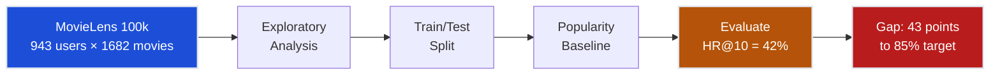
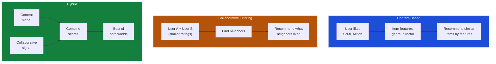
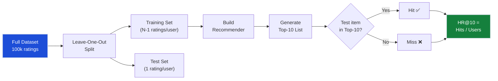
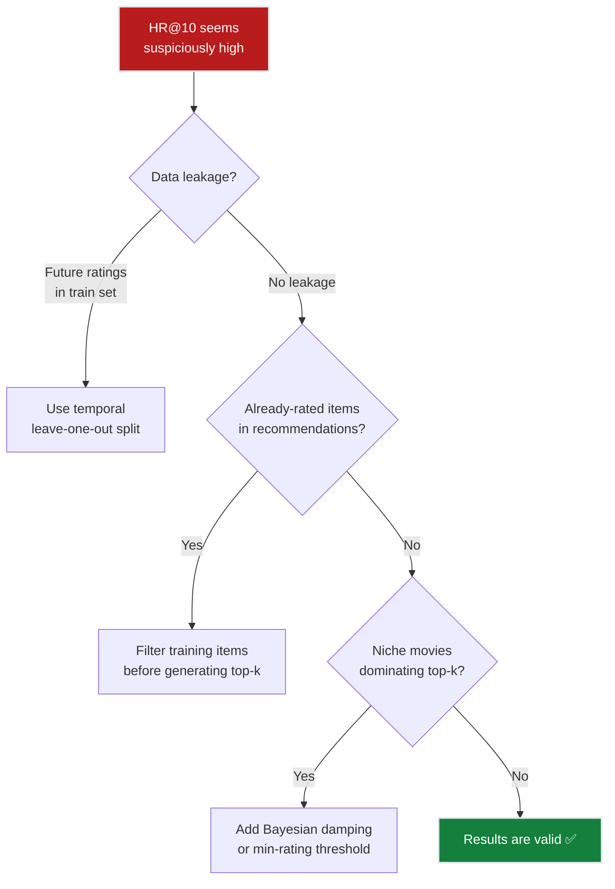

# Ch.1 — Recommender Systems Fundamentals

> **The story.** In **1992**, Xerox PARC researchers built **Tapestry**, the first system to use the phrase "collaborative filtering" — it let users annotate documents and filter based on other people's reactions. Three years later, the **GroupLens** project at the University of Minnesota applied the idea to Usenet news articles, and in 1997 they released the **MovieLens** dataset that became the Rosetta Stone of recommendation research. Amazon filed its item-based collaborative filtering patent in 1998. Netflix launched its $1M Prize in 2006, attracting 44,000 teams and proving that better algorithms = real business value. Today, recommendations drive 35% of Amazon purchases and 80% of Netflix viewing hours. The field has evolved from simple popularity lists to deep learning, but the core question remains: *given what we know about a user, what should we show them next?*
>
> **Where you are in the curriculum.** This is chapter one of the Recommender Systems track. You're a data scientist at a streaming platform called FlixAI, and your first task is the simplest possible baseline: recommend the most popular movies to everyone. It sounds lazy — and it is — but it establishes the evaluation framework and metrics that every later chapter builds on. Without measuring the baseline, you can't measure progress.
>
> **Notation in this chapter.** $u$ — a user; $i$ — an item (movie); $r_{ui}$ — rating given by user $u$ to item $i$; $\hat{r}_{ui}$ — predicted rating; $R$ — the user-item rating matrix ($m \times n$); $m$ — number of users; $n$ — number of items; $k$ — number of recommendations (top-$k$ list); $\text{HR}@k$ — hit rate at $k$ (fraction of users with ≥1 relevant item in top-$k$).

---

## 0 · The Challenge — Where We Are

> 💡 **The mission**: Launch **FlixAI** — a production movie recommendation engine satisfying 5 constraints:
> 1. **ACCURACY**: >85% hit rate@10 — 2. **COLD START**: New users/items — 3. **SCALABILITY**: 1M+ ratings — 4. **DIVERSITY**: Not just popular movies — 5. **EXPLAINABILITY**: "Because you liked X"

**What we know so far:**
- We have the MovieLens 100k dataset (943 users, 1,682 movies, 100k ratings)
- We understand the business problem (recommend movies users will watch)
- **But we have NO model yet!**

**What's blocking us:**
We need the **simplest possible baseline** and a rigorous evaluation framework. Before building matrix factorization or neural networks, we must establish:
- How do we measure recommendation quality?
- What accuracy can we achieve by just recommending popular movies?
- What does the data actually look like (sparsity, distributions)?

Without a baseline, we can't measure progress. Without evaluation metrics, we can't compare approaches.

| Constraint | Status | Notes |
|-----------|--------|-------|
| ACCURACY >85% HR@10 | ❌ Not started | Need baseline first |
| COLD START | ❌ Not started | Popularity handles cold start trivially |
| SCALABILITY | ✅ Trivial | Popularity = precomputed list |
| DIVERSITY | ❌ Fails | Everyone gets the same list |
| EXPLAINABILITY | ⚠️ Weak | "Because it's popular" — not personalised |

**What this chapter unlocks:**
The **popularity baseline** — recommend the top-rated movies to all users — plus the evaluation framework (precision@k, recall@k, NDCG, hit rate) we use for the entire track.



---

## Animation


## 1 · Core Idea

A recommender system predicts which items a user will prefer, then ranks those items to present a top-$k$ list. The three fundamental approaches are: **content-based filtering** (recommend items similar to what you liked before, using item features), **collaborative filtering** (recommend items that similar users liked), and **hybrid systems** (combine both). This chapter builds the simplest possible recommender — a popularity baseline — and establishes the evaluation metrics that all later chapters share.

---

## 2 · Running Example

You're a data scientist at FlixAI, a movie streaming platform. The VP of Product has a simple ask: "Give me a recommendation widget for the homepage. I don't care how it works — just show users movies they'll actually watch." Your first task: load the MovieLens 100k dataset, understand its structure, and build a popularity-based recommender as the baseline to beat.

**Dataset**: MovieLens 100k — 100,000 ratings (1–5 stars) from 943 users on 1,682 movies. 93.7% of the user-item matrix is empty (sparse!).

---

## 3 · Math

### The User-Item Rating Matrix

The foundation of all recommender systems is the **user-item matrix** $R \in \mathbb{R}^{m \times n}$:

$$R = \begin{pmatrix} r_{11} & r_{12} & \cdots & r_{1n} \\ r_{21} & r_{22} & \cdots & r_{2n} \\ \vdots & \vdots & \ddots & \vdots \\ r_{m1} & r_{m2} & \cdots & r_{mn} \end{pmatrix}$$

| Symbol | Meaning | MovieLens value |
|--------|---------|-----------------|
| $m$ | Number of users | 943 |
| $n$ | Number of items | 1,682 |
| $r_{ui}$ | Rating by user $u$ on item $i$ | 1–5 (or missing) |
| Sparsity | $1 - \frac{|\text{observed ratings}|}{m \times n}$ | $1 - \frac{100{,}000}{1{,}585{,}126} = 93.7\%$ |

Most entries are **missing** (not zero — missing means "hasn't seen it", zero would mean "rated it 0"). This distinction between missing and zero is fundamental to recommendation.

### Popularity Baseline

The simplest recommender: rank items by average rating (or number of ratings) and recommend the same top-$k$ list to everyone:

$$\text{score}(i) = \frac{\sum_{u \in U_i} r_{ui}}{|U_i|}$$

where $U_i$ is the set of users who rated item $i$, and $|U_i|$ is the count.

**Concrete example**: Movie "Star Wars" has 583 ratings averaging 4.36. Movie "Shawshank Redemption" has 100 ratings averaging 4.45.

A pure average-rating ranking would put Shawshank above Star Wars, but Shawshank has far fewer ratings. A better approach weights by count:

$$\text{score}(i) = \frac{|U_i| \cdot \bar{r}_i + C \cdot \mu}{|U_i| + C}$$

where $\mu$ is the global mean rating and $C$ is a damping constant (typically the median number of ratings per movie). This is the **Bayesian average** — it shrinks low-count items toward the global mean.

### Evaluation Metrics

#### Precision@k

Of the $k$ items recommended, how many did the user actually interact with?

$$\text{Precision@}k = \frac{|\{\text{relevant items}\} \cap \{\text{recommended top-}k\}|}{k}$$

**Example**: Recommend 10 movies, user watched 3 of them → Precision@10 = 3/10 = 0.3

#### Recall@k

Of all the items the user would interact with, how many did we surface in the top-$k$?

$$\text{Recall@}k = \frac{|\{\text{relevant items}\} \cap \{\text{recommended top-}k\}|}{|\{\text{relevant items}\}|}$$

**Example**: User would watch 20 movies, we recommended 10, user watched 3 → Recall@10 = 3/20 = 0.15

#### Hit Rate@k (HR@k)

The fraction of users for whom **at least one** recommended item is relevant:

$$\text{HR@}k = \frac{|\{u : |\text{relevant}_u \cap \text{top-}k_u| \geq 1\}|}{|\text{all users}|}$$

**Example**: 943 users, 396 have ≥1 hit in their top-10 → HR@10 = 396/943 = 42%

This is our **primary metric** for the FlixAI challenge. It answers: "What fraction of users find something worth watching in our recommendations?"

#### NDCG@k (Normalized Discounted Cumulative Gain)

Rewards relevant items appearing **higher** in the ranking:

$$\text{DCG@}k = \sum_{j=1}^{k} \frac{2^{\text{rel}_j} - 1}{\log_2(j+1)}$$

$$\text{NDCG@}k = \frac{\text{DCG@}k}{\text{IDCG@}k}$$

where $\text{rel}_j$ is the relevance of the item at position $j$ and IDCG is the DCG of the ideal (perfect) ranking.

**Example**: If the relevant item is at position 1, DCG = 1.0. At position 10, DCG = 1/log₂(11) = 0.29. NDCG captures that rank 1 is 3.4× more valuable than rank 10.

### Worked 3×3 Example — Bayesian Average

Three users rating three movies (— = not rated):

| | Movie1 (Toy Story) | Movie2 (Fargo) | Movie3 (GoodFellas) |
|---|---|---|---|
| **Alice** | 5 | 4 | — |
| **Bob** | 4 | — | 3 |
| **Carol** | — | 5 | 4 |

Global mean $\mu = (5+4+4+3+5+4)/6 = 4.17$. Damping constant $C = 2$ (median ratings per movie).

| Movie | Ratings | $n$ | $\bar{r}$ | Bayesian avg $= (n\bar{r} + C\mu)/(n+C)$ |
|-------|---------|-----|-----------|------------------------------------------|
| Movie1 | 5, 4 | 2 | 4.50 | $(2 \times 4.50 + 2 \times 4.17)/4 = \mathbf{4.33}$ |
| Movie2 | 4, 5 | 2 | 4.50 | $(2 \times 4.50 + 2 \times 4.17)/4 = \mathbf{4.33}$ |
| Movie3 | 3, 4 | 2 | 3.50 | $(2 \times 3.50 + 2 \times 4.17)/4 = \mathbf{3.83}$ |

Movies 1 & 2 tie at 4.33; Movie 3 is pulled toward $\mu$ because its raw mean (3.50) is below the global mean. Without damping, a niche movie with two 5-star ratings would top the chart.

---

## 4 · Step by Step

```
POPULARITY BASELINE ALGORITHM
─────────────────────────────
1. Load rating data → user-item matrix R (sparse)

2. For each item i:
   └─ Compute score(i) = Bayesian average
      = (count_i × mean_i + C × global_mean) / (count_i + C)
      where C = median(count per item)

3. Sort items by score(i) descending

4. For each user u:
   └─ Remove items already rated by u
   └─ Recommend top-k remaining items

5. Evaluate:
   └─ For each test user, check if ≥1 held-out item appears in top-k
   └─ HR@k = fraction of users with ≥1 hit
```

---

## 5 · Key Diagrams

### Three Types of Recommender Systems



### Evaluation Pipeline



---

## 6 · Hyperparameter Dial

| Parameter | Too Low | Sweet Spot | Too High |
|-----------|---------|------------|----------|
| **k** (top-k) | k=1: too few choices, low recall | k=10: good balance of precision & recall | k=100: diluted, user overwhelmed |
| **C** (Bayesian damping) | C=0: niche movies with 2 ratings dominate | C=median(counts): balanced shrinkage | C=1000: everything converges to global mean |
| **Min ratings threshold** | 0: noisy items with 1 rating | 5–20: reliable averages | 100: only blockbusters survive |
| **Rating threshold** (relevant = ?) | 1: everything is "relevant" | 4+: genuine enjoyment signal | 5: too strict, almost no positives |

---

## 7 · Code Skeleton

```python
import pandas as pd
import numpy as np

# ── Load MovieLens 100k ──────────────────────────────────────────────────
ratings = pd.read_csv(
    'ml-100k/u.data', sep='\t',
    names=['user_id', 'item_id', 'rating', 'timestamp']
)

# ── Popularity baseline ──────────────────────────────────────────────────
item_stats = ratings.groupby('item_id')['rating'].agg(['mean', 'count'])
global_mean = ratings['rating'].mean()
C = item_stats['count'].median()

item_stats['bayesian_avg'] = (
    (item_stats['count'] * item_stats['mean'] + C * global_mean)
    / (item_stats['count'] + C)
)
top_items = item_stats.sort_values('bayesian_avg', ascending=False)

# ── Leave-one-out evaluation ─────────────────────────────────────────────
def leave_one_out_split(ratings, seed=42):
    """Hold out the last rating per user for testing."""
    ratings = ratings.sort_values('timestamp')
    test = ratings.groupby('user_id').tail(1)
    train = ratings.drop(test.index)
    return train, test

def hit_rate_at_k(top_k_items, test_set, k=10):
    """Fraction of users with ≥1 test item in their top-k."""
    hits = 0
    for user_id, row in test_set.iterrows():
        user_recs = top_k_items[:k]  # same for all users (popularity)
        if row['item_id'] in user_recs:
            hits += 1
    return hits / len(test_set)
```

---

## 8 · What Can Go Wrong

| Mistake | Symptom | Fix |
|---------|---------|-----|
| **Using raw average without damping** | Obscure movie with 2 ratings of 5.0 ranked #1 | Use Bayesian average with damping constant C |
| **Not removing already-rated items** | Recommending movies user already watched | Filter out training items before scoring |
| **Random train/test split** | Data leakage — future ratings in training set | Use temporal split (leave-one-out by timestamp) |
| **Treating missing as zero** | Inflates negative signal — unrated ≠ disliked | Only use observed ratings for scoring |
| **Evaluating on all items** | Unrealistic — user can't rate 1,682 movies | Use sampled negative evaluation (100 negatives + 1 positive) |




---

## 9 · Where This Reappears

Evaluation metrics (HR@k, NDCG@k, precision@k, recall@k) and the train/test split strategy introduced here form the shared scaffolding for every subsequent chapter:

- **Ch.2–Ch.6**: every Progress Check table reuses HR@10 as the primary metric; the 85% target traces back to the baseline gap established here.
- **Ensemble Methods (Topic 8)**: ranking ensemble outputs uses the same Bayesian-average damping described in §3.
- **AI / RAG & Evaluating AI Systems**: retrieval metrics (MRR, NDCG) are direct descendants of the ranking evaluation framework built here.

## 10 · Progress Check

| # | Constraint | Target | Ch.1 Status | Notes |
|---|-----------|--------|-------------|-------|
| 1 | ACCURACY | >85% HR@10 | ❌ 42% | Popularity baseline — no personalisation |
| 2 | COLD START | New users/items | ⚠️ Trivial | Same list for everyone — works but unhelpful |
| 3 | SCALABILITY | 1M+ ratings | ✅ | Precomputed list — O(n log n) once |
| 4 | DIVERSITY | Not just popular | ❌ Fails | By definition recommends only popular items |
| 5 | EXPLAINABILITY | "Because you liked X" | ❌ None | "Because it's popular" — not personalised |

**Bottom line**: 42% hit rate — the simplest baseline that gives everyone the same recommendations. We need **personalisation** to go further.

---

## 11 · Bridge to Next Chapter

The popularity baseline treats every user identically — a 20-year-old action fan and a 60-year-old romance lover get the same 10 movies. Obviously this fails. The next chapter introduces **collaborative filtering**: find users with similar taste and recommend what *they* liked. This is the first step toward personalisation and will jump us from 42% to 68% hit rate.

**What Ch.2 solves**: Personalised recommendations using user-user and item-item similarity.

**What Ch.2 can't solve (yet)**: Sparsity (93.7% of the matrix is empty) limits the number of useful neighbors. We'll need latent factors (Ch.3) to overcome this.


