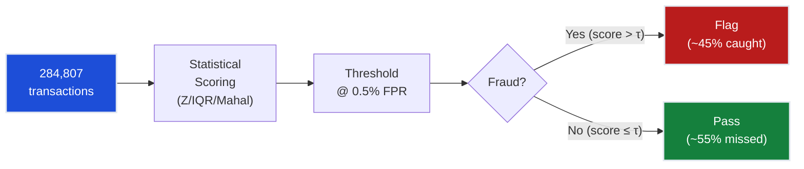
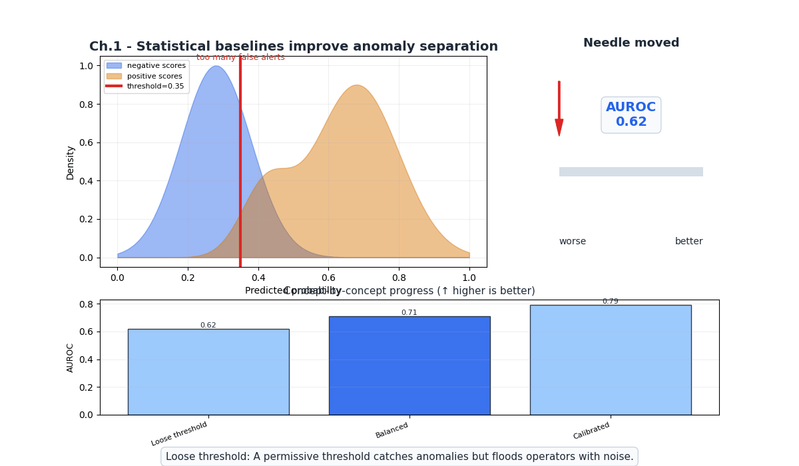
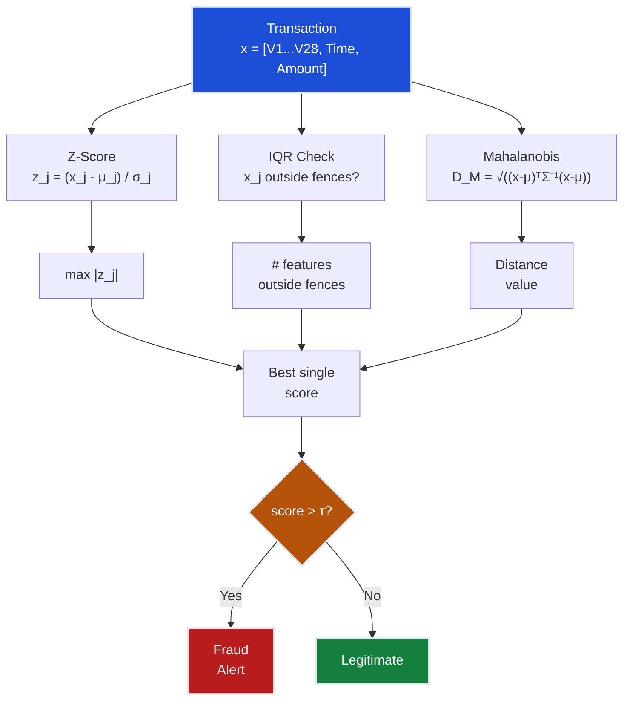
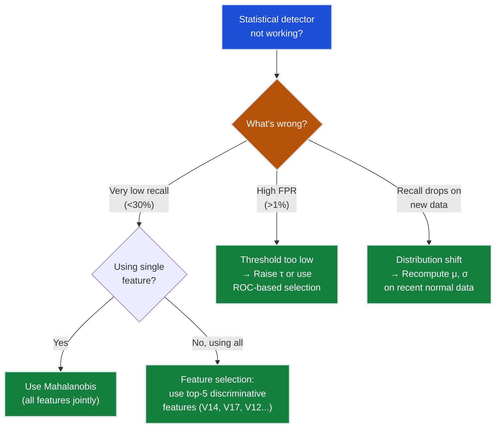

# Ch.1 — Statistical Anomaly Detection

> **The story.** In **1887** the Irish physicist **Frank Grubbs** was born — the man who would, in 1950, formalise what generations of scientists had done by intuition: **test whether an extreme observation is a genuine outlier or just random noise**. But the intellectual roots go deeper. In 1733, **Abraham de Moivre** first described the bell-shaped Gaussian curve; **Carl Friedrich Gauss** married it to error theory in 1809; and **Francis Galton** introduced the concept of *regression to the mean* in 1886. Their shared insight: *most data clusters around a centre, and points far from that centre are suspicious*. The Z-score — $(x - \mu)/\sigma$ — is directly descended from Gauss's error theory. Every time you flag a transaction as "3 standard deviations above normal," you're doing exactly what Gauss proposed two centuries ago: assuming normality and measuring surprise.
>
> **Where you are in the curriculum.** This is chapter one of the Anomaly Detection track. You're a data scientist at a payment processor, and your first task is the simplest possible detector: flag transactions whose features deviate significantly from the population mean. One distribution assumption, one threshold, one decision. Every concept here — the scoring function, the threshold, the trade-off between detection and false alarms — scales directly to autoencoders in [Ch.3](../ch03_autoencoders) and ensemble methods in [Ch.5](../ch05_ensemble_anomaly). Get the baseline right and everything that follows is an improvement on the same idea.
>
> **Notation in this chapter.** $x$ — feature value; $\mu$ — population mean; $\sigma$ — population standard deviation; $z = (x - \mu)/\sigma$ — Z-score; $Q_1, Q_3$ — first and third quartiles; $\text{IQR} = Q_3 - Q_1$ — interquartile range; $\Sigma$ — covariance matrix; $D_M$ — Mahalanobis distance; FPR — false positive rate; TPR — true positive rate (recall).

---

## 0 · The Challenge — Where We Are

> 💡 **The mission**: Launch **FraudShield** — a production fraud detection system satisfying 5 constraints:
> 1. **DETECTION**: >80% recall — 2. **PRECISION**: <0.5% FPR — 3. **REAL-TIME**: <100ms — 4. **ADAPTABILITY**: Handle drift — 5. **EXPLAINABILITY**: Justify flags

**What we know so far:**
- ⚡ We have the Credit Card Fraud dataset (284,807 transactions, 31 features)
- ⚡ We understand the business problem (detect fraudulent transactions)
- **But we have NO detector yet!**

**What's blocking us:**
We need the **simplest possible baseline**. Before building neural autoencoders or tree ensembles, we must establish:
- Can simple statistical thresholds detect fraud?
- What recall can we achieve with distributional assumptions?
- What's the fundamental framework for anomaly scoring?

**The imbalance elephant in the room:**

| Class | Count | Percentage |
|-------|-------|------------|
| Legitimate | 284,315 | 99.827% |
| Fraud | 492 | 0.173% |

A naive classifier that says "everything is legitimate" gets 99.83% accuracy and catches **zero** fraud. Accuracy is meaningless. We must think in terms of **recall at a fixed FPR**.

**What this chapter unlocks:**
The **statistical anomaly baseline** — use distributional assumptions to score each transaction's "surprisingness."
- **Establishes the scoring paradigm**: feature → score → threshold → decision
- **Provides first recall measurement**: ~45% recall @ 0.5% FPR
- **Teaches fundamental limits**: Why Gaussian assumptions fail on PCA features



---

## Animation



## 1 · Core Idea

Statistical anomaly detection assigns each observation a **score** measuring how far it deviates from the "normal" distribution, then flags observations whose score exceeds a threshold. The simplest version — the Z-score — assumes features follow a Gaussian distribution and measures deviation in units of standard deviations. More robust variants (IQR, Mahalanobis) relax or extend this assumption. The key insight: **anomalies live in the tails of distributions**, and statistics gives us principled ways to measure "tailness."

---

## 2 · Running Example

You're a data scientist at a payment processor. The Head of Risk drops 284,807 transactions on your desk — 492 of which are confirmed fraud (0.17%). Your first task: build the cheapest, fastest, most interpretable detector possible. No neural networks, no training loops — just statistics. Can you catch fraud by looking at which transactions have unusual feature values?

Dataset: **Credit Card Fraud Detection** (Kaggle / ULB)  
Features: `V1`–`V28` (PCA-anonymized), `Time`, `Amount`  
Target: `Class` (0 = legitimate, 1 = fraud)

**Critical observation**: The V1-V28 features are already PCA-transformed. This means:
- They are **uncorrelated by construction** (covariance matrix is diagonal)
- They are **zero-mean** (PCA centers the data)
- They are **NOT necessarily Gaussian** (PCA doesn't guarantee normality)

This last point is crucial: Z-scores assume Gaussianity, but PCA features can have heavy tails, skewness, and multimodality. Our statistical methods will bump into this limitation.

---

## 3 · Math

### Z-Score (Univariate)

The Z-score measures how many standard deviations a value is from the mean:

$$z = \frac{x - \mu}{\sigma}$$

| Symbol | Meaning |
|--------|---------|
| $x$ | Observed feature value |
| $\mu$ | Mean of the feature across all transactions |
| $\sigma$ | Standard deviation of the feature |
| $z$ | Number of standard deviations from the mean |

**Anomaly rule**: Flag if $|z| > \tau$ (threshold).

**Concrete example** (Amount feature):
- Mean Amount: $\mu = €88.35$
- Std Amount: $\sigma = €250.12$
- Suspicious transaction: $x = €2,125.87$
- Z-score: $z = (2125.87 - 88.35) / 250.12 = 8.14$
- At threshold $\tau = 3$: **flagged** (8.14 > 3)

**5-sample Z-score worked example** (Amount feature, $\mu = 88.35$, $\sigma = 250.12$, threshold $\tau = 3$):

| $x$ (€) | $\mu$ (€) | $\sigma$ (€) | $z = (x - \mu)/\sigma$ | Anomaly? |
|---------|-----------|--------------|------------------------|----------|
| 12.50   | 88.35     | 250.12       | −0.30                  | No       |
| 45.00   | 88.35     | 250.12       | −0.17                  | No       |
| 88.35   | 88.35     | 250.12       | 0.00                   | No       |
| 320.00  | 88.35     | 250.12       | 0.93                   | No       |
| 2125.87 | 88.35     | 250.12       | **8.14**               | **Yes**  |

The last row triggers the threshold because $|z| = 8.14 > \tau = 3$.

**Problem**: Under Gaussianity, $P(|z| > 3) = 0.27\%$, so a threshold of 3 flags ~0.27% of data as anomalous. With 284,807 transactions, that's ~769 flags — but only 492 are actual fraud. Many flagged transactions are legitimate outliers (expensive but legal purchases).

### IQR Method (Distribution-Free)

The IQR method doesn't assume any distribution — it uses quartiles:

$$\text{IQR} = Q_3 - Q_1$$

**Anomaly rule**: Flag if $x < Q_1 - k \cdot \text{IQR}$ or $x > Q_3 + k \cdot \text{IQR}$

The standard multiplier is $k = 1.5$ (Tukey's classic fence). For anomaly detection, we often use $k = 3$ (far outliers only) to reduce false positives.

**Concrete example** (V14 feature — one of the most discriminative):
- $Q_1 = -0.426$, $Q_3 = 0.494$
- $\text{IQR} = 0.494 - (-0.426) = 0.920$
- Upper fence ($k=1.5$): $0.494 + 1.5 \times 0.920 = 1.874$
- Lower fence ($k=1.5$): $-0.426 - 1.5 \times 0.920 = -1.806$
- Fraud transaction V14 value: $-8.5$ → **flagged** ($-8.5 < -1.806$)

**Advantage over Z-score**: Works on skewed and heavy-tailed distributions. No Gaussian assumption.

### Grubbs' Test

Grubbs' test formally tests whether the most extreme value in a dataset is a statistically significant outlier:

$$G = \frac{\max_i |x_i - \bar{x}|}{s}$$

where $\bar{x}$ is the sample mean and $s$ is the sample standard deviation. The test statistic $G$ is compared against critical values from a t-distribution.

**Limitation**: Designed for detecting **one** outlier at a time. Must be applied iteratively (remove, retest) — not practical for batch scoring of 284k transactions.

### Mahalanobis Distance (Multivariate)

While Z-score works per-feature, Mahalanobis distance considers **all features jointly**, accounting for correlations:

$$D_M(\mathbf{x}) = \sqrt{(\mathbf{x} - \boldsymbol{\mu})^\top \Sigma^{-1} (\mathbf{x} - \boldsymbol{\mu})}$$

| Symbol | Meaning |
|--------|---------|
| $\mathbf{x}$ | Feature vector (30-dimensional for our dataset) |
| $\boldsymbol{\mu}$ | Mean vector across all transactions |
| $\Sigma$ | Covariance matrix ($30 \times 30$) |
| $\Sigma^{-1}$ | Inverse (precision) covariance matrix |

**Key insight**: For PCA features (V1-V28), $\Sigma$ is approximately diagonal, so Mahalanobis reduces to the sum of squared Z-scores:

$$D_M^2 \approx \sum_{j=1}^{d} z_j^2 = \sum_{j=1}^{d} \frac{(x_j - \mu_j)^2}{\sigma_j^2}$$

This follows a **chi-squared distribution** with $d$ degrees of freedom under the Gaussian assumption.

**Concrete example** (simplified to 3 features):
- Transaction $\mathbf{x} = [2.1, -3.5, 0.8]$
- Mean $\boldsymbol{\mu} = [0, 0, 0]$ (PCA-centered)
- Variances $\sigma_1^2 = 1.0, \sigma_2^2 = 1.0, \sigma_3^2 = 1.0$ (standardized)
- $D_M^2 = (2.1)^2 + (-3.5)^2 + (0.8)^2 = 4.41 + 12.25 + 0.64 = 17.3$
- $D_M = \sqrt{17.3} = 4.16$
- Under $\chi^2(3)$: $P(D_M^2 > 17.3) < 0.001$ → **flagged**

### Why Statistical Methods Struggle with This Dataset

The fundamental limitation: **fraud doesn't always look extreme**.

Consider two types of fraud:
1. **Extreme fraud**: $2,000 purchase on a card averaging $50 → Z-score catches this easily
2. **Subtle fraud**: $47 purchase that looks normal on every feature → Z-score misses completely

With 0.17% fraud rate:
- **Type 1** (extreme): ~45% of fraud cases → detectable by statistics
- **Type 2** (subtle): ~55% of fraud cases → indistinguishable from normal in marginal distributions

This is why we get ~45% recall. Statistical methods detect the easy, extreme frauds but miss the sophisticated ones that mimic normal behavior.

---

## 4 · Step by Step

```
STATISTICAL ANOMALY DETECTION

Input:  X (n × d feature matrix), y (labels, used only for evaluation)
Output: anomaly_scores (n × 1), predictions at threshold τ

1. Compute statistics from training data (assumed normal)
   └─ μ_j = mean(X_train[:, j])  for each feature j
   └─ σ_j = std(X_train[:, j])   for each feature j
   └─ Σ = cov(X_train)           covariance matrix

2. For each test transaction x_i:
   a. Z-score method:
      └─ z_ij = (x_ij - μ_j) / σ_j    per-feature Z-scores
      └─ score_i = max_j |z_ij|        max absolute Z-score

   b. IQR method:
      └─ For each feature j, check if x_ij outside [Q1 - k·IQR, Q3 + k·IQR]
      └─ score_i = count of features flagged

   c. Mahalanobis method:
      └─ score_i = sqrt((x_i - μ)ᵀ Σ⁻¹ (x_i - μ))

3. Set threshold τ to achieve target FPR:
   └─ Sort scores descending
   └─ τ = score at position (FPR × n_legitimate)

4. Predict: anomaly if score_i > τ
```

---

## 5 · Key Diagrams

### Statistical Scoring Pipeline



### Why Accuracy Fails at 0.17% Fraud

```
Confusion Matrix for "Always Predict Legitimate":

                 Predicted
              Legit    Fraud
Actual Legit  284,315     0     ← All correct!
Actual Fraud      492     0     ← All missed!

Accuracy = 284,315 / 284,807 = 99.83%  ← Looks great!
Recall   = 0 / 492 = 0%                ← Catches nothing!

This is why we use Recall@FPR, not accuracy.
```

### Distribution of Z-Scores: Normal vs. Fraud

```
Normal transactions (V14):    Fraud transactions (V14):
    ▄▄▄                          
   ▄████▄                      ▄▄
  ▄██████▄                    ▄██▄
 ▄████████▄                  ▄████▄▄▄▄
▄██████████▄            ▄▄▄▄██████████▄
────────────────    ────────────────────
-2  -1  0  1  2    -12 -10 -8  -6  -4  -2

Overlap zone: where fraud looks like normal → missed detections
```

---

## 6 · Hyperparameter Dial

| Dial | Too low | Sweet spot | Too high |
|------|---------|------------|----------|
| **Z-score threshold τ** | Flags everything (high recall, insane FPR) | `3.0`–`4.0` (balances detection vs. false alarms) | Misses most fraud (low recall, near-zero FPR) |
| **IQR multiplier k** | Too many outliers flagged | `1.5` (Tukey), `3.0` (far outliers) | Only extreme extremes flagged |
| **Mahalanobis percentile** | Too sensitive to normal variation | `99.5th` percentile of $\chi^2(d)$ | Only multivariate extremes caught |
| **Feature subset** | Single feature misses interactions | Top 5-10 discriminative features | All 30 features (noise dilutes signal) |

The single most important dial is the **score threshold** — it directly controls the FPR/recall trade-off. Always set it from the ROC curve, never by gut feeling.

---

## 7 · Code Skeleton

```python
import numpy as np
import pandas as pd
from scipy import stats
from sklearn.model_selection import train_test_split
from sklearn.preprocessing import StandardScaler
from sklearn.metrics import roc_curve, auc, precision_recall_curve

# 1. Load data
df = pd.read_csv("creditcard.csv")
X = df.drop("Class", axis=1).values
y = df["Class"].values
print(f"Fraud rate: {y.mean():.4%} ({y.sum()} / {len(y)})")

# 2. Time-based split (respect temporal ordering)
split_idx = int(0.8 * len(X))
X_train, X_test = X[:split_idx], X[split_idx:]
y_train, y_test = y[:split_idx], y[split_idx:]

# 3. Fit statistics on LEGITIMATE training data only
X_normal = X_train[y_train == 0]
mu = X_normal.mean(axis=0)
sigma = X_normal.std(axis=0) + 1e-8  # avoid division by zero

# 4. Z-score anomaly scoring
z_scores = np.abs((X_test - mu) / sigma)
z_max = z_scores.max(axis=1)  # max absolute Z across all features

# 5. Evaluate at target FPR
fpr, tpr, thresholds = roc_curve(y_test, z_max)
idx_005 = np.where(fpr <= 0.005)[0][-1]
recall_at_005fpr = tpr[idx_005]
print(f"Recall @ 0.5% FPR: {recall_at_005fpr:.2%}")

# 6. Mahalanobis distance
cov = np.cov(X_normal.T) + np.eye(X_normal.shape[1]) * 1e-6
cov_inv = np.linalg.inv(cov)
diff = X_test - mu
mahal = np.sqrt(np.sum(diff @ cov_inv * diff, axis=1))
```

---

## 8 · What Can Go Wrong

### The Gaussian Assumption Trap

- **PCA features are NOT Gaussian** — V1-V28 are PCA-transformed but the original features may have been highly non-Gaussian. PCA preserves the shape of distributions, not normality. A Z-score of 3 on a heavy-tailed feature captures far fewer anomalies than expected. **Fix**: Use **IQR** (distribution-free) or **robust Z-scores** using median and MAD (Median Absolute Deviation) instead of mean and std.

### The Univariate Blindness

- **Z-score checks features independently** — A fraud transaction might have V1=1.2, V2=-0.8, V3=0.3 — each individually unremarkable — but the *combination* is extremely rare among legitimate transactions. Univariate Z-scores miss this entirely. **Fix**: Use **Mahalanobis distance** (multivariate) or move to model-based methods (Ch.2-4).

### The Imbalance Pitfall

- **Computing statistics on ALL data (including fraud)** — If you compute $\mu$ and $\sigma$ from all 284k transactions including the 492 fraud cases, fraud slightly shifts the statistics. With 0.17% contamination this is minor, but for higher fraud rates it degrades performance. **Fix**: **Always compute reference statistics from known-clean data only** (labeled legitimate transactions in the training set).

### The Threshold Trap

- **Picking a threshold by gut feeling** — "Z-score > 3 seems reasonable" is arbitrary. Different features have different tail behaviors. **Fix**: **Always set the threshold from the ROC curve** at your target FPR. Let the data determine the threshold.

### Quick Diagnostic Flowchart



---

## 10 · Progress Check — What We Can Solve Now

⚡ **Unlocked capabilities:**
- **First working detector!** Can flag transactions with extreme feature values
- **Baseline recall**: ~45% at 0.5% FPR
- **Anomaly scoring framework**: feature → score → threshold → decision
- **Three scoring methods**: Z-score (Gaussian), IQR (distribution-free), Mahalanobis (multivariate)
- **Evaluation protocol**: ROC curves, recall@FPR

**Still can't solve:**
- **Constraint #1 (DETECTION)**: 45% recall << 80% target. Missing more than half of all fraud!
- **Constraint #2 (PRECISION)**: Achievable at 0.5% FPR, but only by sacrificing recall
- ⚡ **Constraint #3 (REAL-TIME)**: Z-scores are trivially fast (<1ms). ✅ Partially met
- **Constraint #4 (ADAPTABILITY)**: Static statistics don't adapt to new fraud patterns
- ⚡ **Constraint #5 (EXPLAINABILITY)**: "V14 Z-score = -8.5" is interpretable. ✅ Partially met

**The core problem**: Statistical methods assume fraud = extreme values. But sophisticated fraud mimics normal transaction patterns. We need methods that learn complex "normality" boundaries.

| Constraint | Status | Current State |
|------------|--------|---------------|
| #1 DETECTION | ❌ Failing | 45% recall (need >80%) |
| #2 PRECISION | ⚡ Partial | Achievable at 0.5% FPR but recall too low |
| #3 REAL-TIME | ✅ Met | Z-scores compute in <1ms |
| #4 ADAPTABILITY | ❌ Blocked | Static mean/std, no drift handling |
| #5 EXPLAINABILITY | ⚡ Partial | Z-scores are interpretable |

---

## 11 · Bridge to Chapter 2

Ch.1 established the scoring paradigm — compute a deviation measure, threshold it, flag anomalies — but statistical methods assume fraud lives in distribution tails. Ch.2 (Isolation Forest) flips the idea: instead of measuring *distance from normal*, it measures *how easy a point is to isolate*. The key insight is that anomalies, being rare and different, require fewer random splits to separate from the rest. No distribution assumptions needed — just recursive partitioning. Recall jumps from 45% to ~72%.

➡️ **Clustering-based anomaly detection:** DBSCAN and GMM-based isolation are covered in [07-UnsupervisedLearning/ch01-clustering](../../07_unsupervised_learning/ch01_clustering) — the same density intuition applies.


