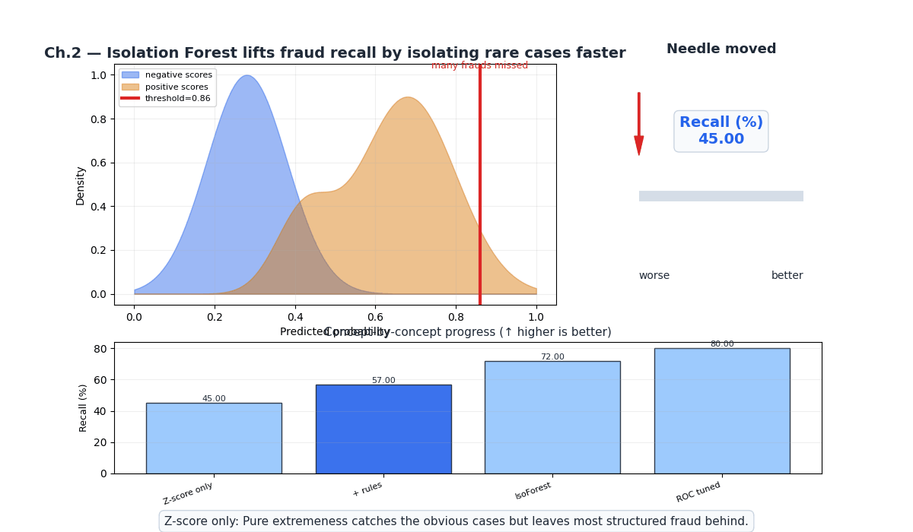
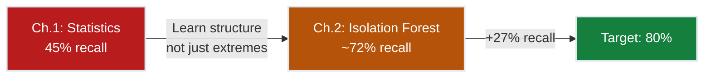
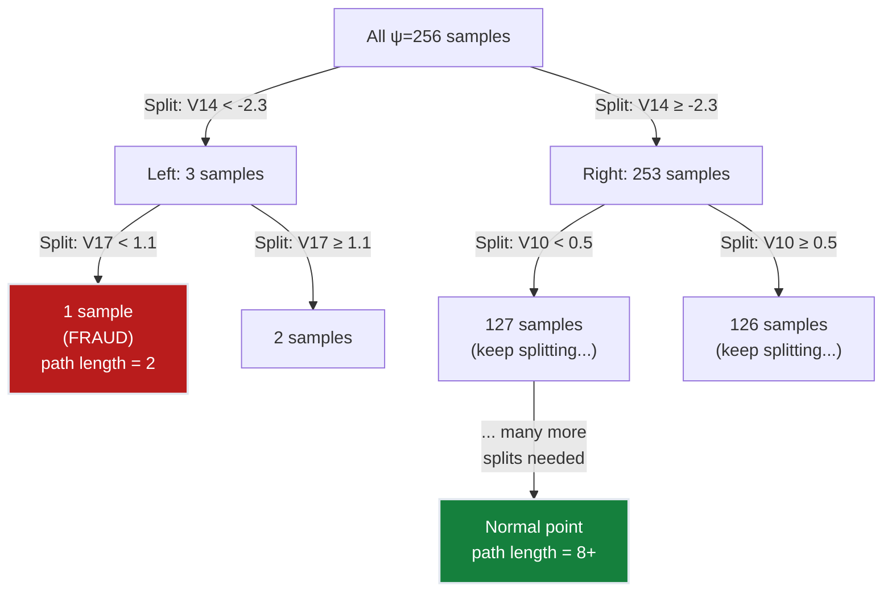
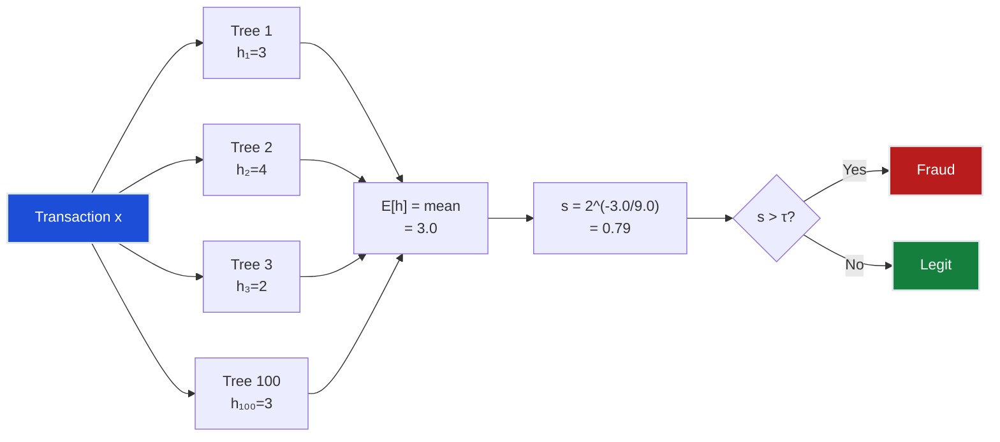
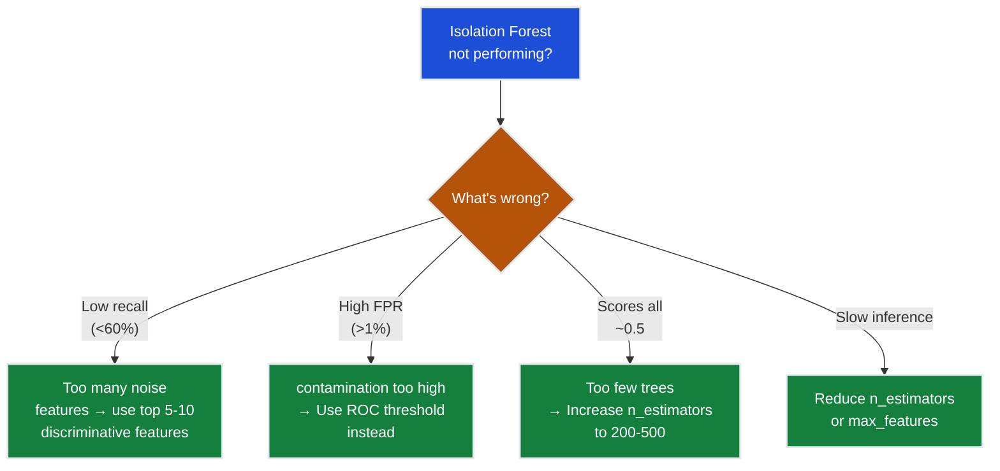

# Ch.2 — Isolation Forest



*Visual takeaway: once rare cases are isolated quickly and the threshold is calibrated, the recall needle moves from weak baseline coverage to the target range.*

> **The story.** In **2008**, Fei Tony Liu and Kai Ming Ting at Monash University and Zhi-Hua Zhou at Nanjing University published *"Isolation Forest"* — and flipped anomaly detection on its head. Every prior method asked "how far is this point from normal?" (distance-based) or "how dense is the region around this point?" (density-based). Liu et al. asked the opposite: **"how easy is this point to isolate?"** Their insight was beautifully simple: if you recursively split data with random cuts, anomalies — being few and different — get isolated in fewer splits than normal points. No density estimation, no distance computation, no distribution assumptions. Just trees. The algorithm ran in $O(n \log n)$ time, scaled to millions of records, and often outperformed methods that took orders of magnitude longer. It became the default first-try anomaly detector in industry within a decade.
>
> **Where you are in the curriculum.** Ch.1 showed that statistical thresholds catch ~45% of fraud — the extreme, obvious cases. This chapter introduces the first *learning-based* anomaly detector. Isolation Forest doesn't assume any distribution; it lets the data's structure decide what's anomalous. The path-length scoring concept here connects directly to ensemble methods in [Ch.5](../ch05_ensemble_anomaly) and will serve as one of our ensemble components in the final FraudShield system.
>
> **Notation in this chapter.** $h(\mathbf{x})$ — path length (number of edges from root to the node isolating $\mathbf{x}$); $E[h(\mathbf{x})]$ — expected path length across all trees; $c(n)$ — average path length of unsuccessful search in a BST with $n$ nodes; $s(\mathbf{x}, n)$ — anomaly score; $\psi$ — sub-sampling size; $t$ — number of trees.

---

## 0 · The Challenge — Where We Are

> 💡 **FraudShield status after Ch.1:**
> - ⚡ Statistical baselines established (Z-score, IQR, Mahalanobis)
> - ⚡ Scoring paradigm: feature → score → threshold → decision
> - **Only 45% recall** — missing more than half of all fraud!

**What's blocking us:**
Statistical methods assume fraud = extreme feature values. But sophisticated fraud transactions have **normal-looking individual features** — their anomalousness is in the *structure*, not the extremes. We need a method that:
- Doesn't assume any distribution
- Captures multivariate structure (not just per-feature extremes)
- Scales to 284k transactions efficiently

**What this chapter unlocks:**
Isolation Forest scores anomalies by **how few random splits** it takes to separate them. No density estimation, no distance matrices — just recursive partitioning.



---

## 1 · Core Idea

Isolation Forest isolates observations by randomly selecting a feature and then randomly selecting a split value between the feature's minimum and maximum. Anomalies, being **few** and **different**, require fewer splits to isolate. Normal points, being clustered together, require many splits. The average number of splits needed (the **path length**) becomes the anomaly score: short path = anomaly, long path = normal.

---

## 2 · Running Example

Your Z-score detector catches the obvious fraud (huge amounts, extreme V-feature values) but misses 55% of cases. The Head of Risk asks: "Can we do better without making distributional assumptions?" You reach for Isolation Forest — it doesn't care whether features are Gaussian, skewed, or multimodal. It only asks: "How easy is this transaction to separate from the rest?"

Dataset: Same **Credit Card Fraud** dataset (284,807 transactions, 0.17% fraud).

**Why Isolation Forest suits this problem:**
- **Imbalance is a feature, not a bug**: With 0.17% fraud, anomalies are by definition rare and different — exactly what Isolation Forest exploits
- **No distribution assumptions**: PCA features V1-V28 have unknown distributions; IF doesn't care
- **Sub-linear training**: Samples $\psi = 256$ points per tree — the full 284k dataset isn't needed
- **Fast inference**: Each transaction traverses $t$ shallow trees → $O(t \cdot \log \psi)$

---

## 3 · Math

### The Isolation Mechanism

An **Isolation Tree (iTree)** is built by:
1. Randomly select a feature $q$
2. Randomly select a split value $p$ between $\min(x_q)$ and $\max(x_q)$
3. Recursively split left ($x_q < p$) and right ($x_q \geq p$)
4. Stop when: node has 1 sample, or all samples are identical, or max depth reached

**Key insight**: Anomalies get isolated (reach a leaf node) after **fewer splits** because they're far from the dense clusters.

### Path Length

$h(\mathbf{x})$ = number of edges traversed from root to the external node (leaf) where $\mathbf{x}$ ends up.

- **Anomaly**: $h(\mathbf{x})$ is small (isolated quickly)
- **Normal**: $h(\mathbf{x})$ is large (buried in dense cluster, needs many splits)

### Normalization Factor $c(n)$

To compare path lengths across trees of different sizes, we normalize by the average path length of an unsuccessful search in a Binary Search Tree (BST):

$$c(n) = 2H(n-1) - \frac{2(n-1)}{n}$$

where $H(k)$ is the harmonic number: $H(k) = \ln(k) + \gamma$ (Euler-Mascheroni constant $\gamma \approx 0.5772$).

**Concrete values:**
| $n$ (sub-sample size) | $c(n)$ |
|----|--------|
| 256 | ~9.0 |
| 1024 | ~12.7 |
| 4096 | ~16.3 |

### Anomaly Score

$$s(\mathbf{x}, n) = 2^{-\frac{E[h(\mathbf{x})]}{c(n)}}$$

| Score range | Interpretation |
|-------------|----------------|
| $s \to 1$ | $E[h(\mathbf{x})] \ll c(n)$ — very short paths → **anomaly** |
| $s \to 0.5$ | $E[h(\mathbf{x})] \approx c(n)$ — average paths → **normal** |
| $s \to 0$ | $E[h(\mathbf{x})] \gg c(n)$ — very long paths → **deeply normal** |

**Concrete example:**
- Sub-sample $\psi = 256$, so $c(256) \approx 9.0$
- Transaction A (fraud): average path length $E[h] = 3.2$
  - $s = 2^{-3.2/9.0} = 2^{-0.356} = 0.78$ → **anomalous**
- Transaction B (legitimate): average path length $E[h] = 8.7$
  - $s = 2^{-8.7/9.0} = 2^{-0.967} = 0.51$ → **normal**
- Transaction C (deeply normal, in dense cluster): average path length $E[h] = 12.1$
  - $s = 2^{-12.1/9.0} = 2^{-1.344} = 0.39$ → **very normal**

**4-sample path length worked example** ($\psi = 256$, $c(256) \approx 9.0$, anomaly threshold $s > 0.65$):

| Sample | Type  | $E[h(\mathbf{x})]$ | $s = 2^{-E[h]/c(n)}$ | Anomaly? |
|--------|-------|---------------------|----------------------|----------|
| A      | Fraud | 3.2                 | 0.78                 | **Yes**  |
| B      | Fraud | 4.1                 | 0.73                 | **Yes**  |
| C      | Legit | 8.7                 | 0.51                 | No       |
| D      | Legit | 12.1                | 0.39                 | No       |

Fraud cases isolate in fewer splits (short path → high score); dense normal points need many splits (long path → low score).

### Why Contamination Matters at 0.17%

The `contamination` parameter tells Isolation Forest the expected fraction of anomalies. With 0.17% fraud:
- **contamination = 0.5% (too high)**: Model expects 1,424 anomalies → sets threshold too low → high FPR
- **contamination = 0.17% (exact)**: Model expects 492 anomalies → threshold matches reality
- **contamination = 0.05% (too low)**: Model expects 142 anomalies → misses 350+ fraud cases

In practice, use the ROC curve to set the threshold rather than relying on `contamination` alone.

---

## 4 · Step by Step

```
ISOLATION FOREST ALGORITHM

Training:
1. For each tree t = 1, ..., T:
   a. Sample ψ points uniformly from training data (no replacement)
   b. Build iTree(sample):
      - If |sample| ≤ 1 or depth ≥ log₂(ψ): return leaf
      - Randomly pick feature q
      - Randomly pick split p ∈ [min(x_q), max(x_q)]
      - Split: left = {x : x_q < p}, right = {x : x_q ≥ p}
      - Recurse on left and right

Scoring:
2. For each test point x:
   a. Pass x through all T trees
   b. Record path length h_t(x) in each tree
   c. Compute E[h(x)] = (1/T) Σ h_t(x)
   d. Compute anomaly score: s(x) = 2^(-E[h(x)] / c(ψ))

3. Set threshold from ROC curve at target FPR
4. Flag if s(x) > threshold
```

---

## 5 · Key Diagrams

### How Isolation Works



### Anomaly Score Distribution

```
Score distribution (conceptual):

Normal transactions:          Fraud transactions:
count                         count
  │ ▄▄▄▄▄                      │
  │▄██████▄                     │      ▄▄
  │████████▄                    │    ▄████▄
  │█████████▄                   │  ▄██████▄
  ├──────────── score           ├──────────── score
  0.3  0.5  0.7                 0.5  0.7  0.9

Normal clusters around 0.5     Fraud pushes toward 1.0
(average path length)          (short path length)
```

### Ensemble of Trees Reduces Variance



---

## 6 · Hyperparameter Dial

| Dial | Too low | Sweet spot | Too high |
|------|---------|------------|----------|
| **n_estimators (trees)** | High variance (unstable scores) | `100`–`300` | Diminishing returns, slower inference |
| **max_samples (ψ)** | Underfits (too few points to learn structure) | `256` (default) or `min(256, n)` | Overfits to training data, slower |
| **contamination** | Misses anomalies (threshold too strict) | `0.001`–`0.005` for fraud | Too many false positives |
| **max_features** | Too little variation between trees | `1.0` (all features) | N/A (can't exceed feature count) |

**Critical insight for 0.17% fraud**: The default `contamination='auto'` in sklearn uses 0.5, which is wildly wrong for our dataset. Always set it explicitly or use ROC-curve thresholding instead.

---

## 7 · Code Skeleton

```python
import numpy as np
import pandas as pd
from sklearn.ensemble import IsolationForest
from sklearn.metrics import roc_curve, auc
from sklearn.preprocessing import StandardScaler

# 1. Load and split
df = pd.read_csv("creditcard.csv")
X = df.drop("Class", axis=1).values
y = df["Class"].values

split_idx = int(0.8 * len(X))
X_train, X_test = X[:split_idx], X[split_idx:]
y_train, y_test = y[:split_idx], y[split_idx:]

# 2. Train on ALL training data (IF handles contamination internally)
iso_forest = IsolationForest(
    n_estimators=200,
    max_samples=256,
    contamination=0.002,  # close to true fraud rate
    random_state=42,
    n_jobs=-1,
)
iso_forest.fit(X_train)

# 3. Score (sklearn returns negative scores; more negative = more anomalous)
raw_scores = iso_forest.decision_function(X_test)
scores = -raw_scores  # flip so higher = more anomalous

# 4. Evaluate
fpr, tpr, _ = roc_curve(y_test, scores)
roc_auc = auc(fpr, tpr)

idx_005 = np.where(fpr <= 0.005)[0][-1]
recall_at_005fpr = tpr[idx_005]
print(f"AUC: {roc_auc:.4f}")
print(f"Recall @ 0.5% FPR: {recall_at_005fpr:.2%}")
```

### Manual Isolation Tree (to see the mechanics)

```python
# Educational: build one isolation tree from scratch
def build_itree(X, depth=0, max_depth=8):
    n, d = X.shape
    if n <= 1 or depth >= max_depth:
        return {"type": "leaf", "size": n, "depth": depth}

    # Random feature and split
    q = np.random.randint(d)
    p = np.random.uniform(X[:, q].min(), X[:, q].max())

    left_mask = X[:, q] < p
    return {
        "type": "split",
        "feature": q,
        "threshold": p,
        "left": build_itree(X[left_mask], depth + 1, max_depth),
        "right": build_itree(X[~left_mask], depth + 1, max_depth),
    }

def path_length(x, tree, depth=0):
    if tree["type"] == "leaf":
        return depth
    if x[tree["feature"]] < tree["threshold"]:
        return path_length(x, tree["left"], depth + 1)
    return path_length(x, tree["right"], depth + 1)
```

---

## 8 · What Can Go Wrong

### Contamination Miscalibration

- **Using default `contamination='auto'` (0.5)** — Isolation Forest in sklearn defaults to 50% contamination, which is absurdly wrong for 0.17% fraud. The model sets its internal threshold to flag half the data as anomalous. **Fix**: Set `contamination` close to the true anomaly rate (0.001-0.005), or better yet, ignore sklearn's built-in threshold and use `decision_function()` scores with ROC-curve thresholding.

### Sub-sample Size Sensitivity

- **ψ too large on imbalanced data** — If you set `max_samples=10000` on a dataset with 0.17% fraud, each sub-sample of 10,000 contains ~17 fraud cases. These few fraud points may not consistently land in the sample, making scores noisy across trees. **Fix**: Keep `max_samples=256` (the default and the value from the original paper). The algorithm works by random sampling — more data per tree doesn't help and hurts speed.

### Swamped by Feature Noise

- **All 30 features when only 5 are discriminative** — Random feature selection means each split has a 5/30 ≈ 17% chance of picking a useful feature. Most splits are on noise features, producing random path lengths that dilute the anomaly signal. **Fix**: **Feature selection first** — identify the top discriminative features (V14, V17, V12, V10, V16 are typically strongest) and train IF on those.

### Score Interpretation Pitfalls

- **Treating scores as probabilities** — Isolation Forest scores range from 0 to 1 but are NOT calibrated probabilities. $s = 0.7$ does not mean "70% chance of fraud." **Fix**: Use scores only for **ranking** (higher = more anomalous). For calibrated probabilities, apply isotonic regression or Platt scaling on a validation set.

### Quick Diagnostic Flowchart



---

## 9 · Progress Check — What We Can Solve Now

⚡ **Unlocked capabilities:**
- **Learning-based detector!** No distribution assumptions needed
- **Improved recall**: ~72% at 0.5% FPR (+27% over Z-score)
- **Sub-linear scaling**: Trains on sub-samples, O(t·log ψ) inference
- **Interpretable structure**: Can extract feature importance from split frequencies

**Still can't solve:**
- **Constraint #1 (DETECTION)**: 72% recall < 80% target. Getting close but not there yet
- ✅ **Constraint #2 (PRECISION)**: Achievable at 0.5% FPR with proper thresholding
- ✅ **Constraint #3 (REAL-TIME)**: ~5ms inference (100 trees × shallow depth). Well under 100ms
- **Constraint #4 (ADAPTABILITY)**: Static model — no drift detection
- ⚡ **Constraint #5 (EXPLAINABILITY)**: Can identify which features contributed to isolation, but not as clear as Z-scores

| Constraint | Status | Current State |
|------------|--------|---------------|
| #1 DETECTION | ❌ Close | 72% recall (need >80%) |
| #2 PRECISION | ✅ Met | <0.5% FPR achievable |
| #3 REAL-TIME | ✅ Met | ~5ms inference |
| #4 ADAPTABILITY | ❌ Blocked | No drift handling |
| #5 EXPLAINABILITY | ⚡ Partial | Feature-level importance available |

---

## 10 · Bridge to Chapter 3

Isolation Forest improved recall from 45% to 72% by learning data structure instead of assuming distributions. But it still treats anomaly detection as a geometric problem — separating points with random cuts. Ch.3 (Autoencoders) takes a fundamentally different approach: **learn to reconstruct normal transactions**, then flag those with high reconstruction error as anomalies. By compressing transactions through a bottleneck, the autoencoder learns a compact representation of "normal" — and anything that doesn't compress well is suspicious. Recall jumps to ~78%.
