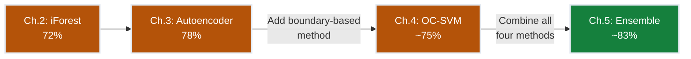
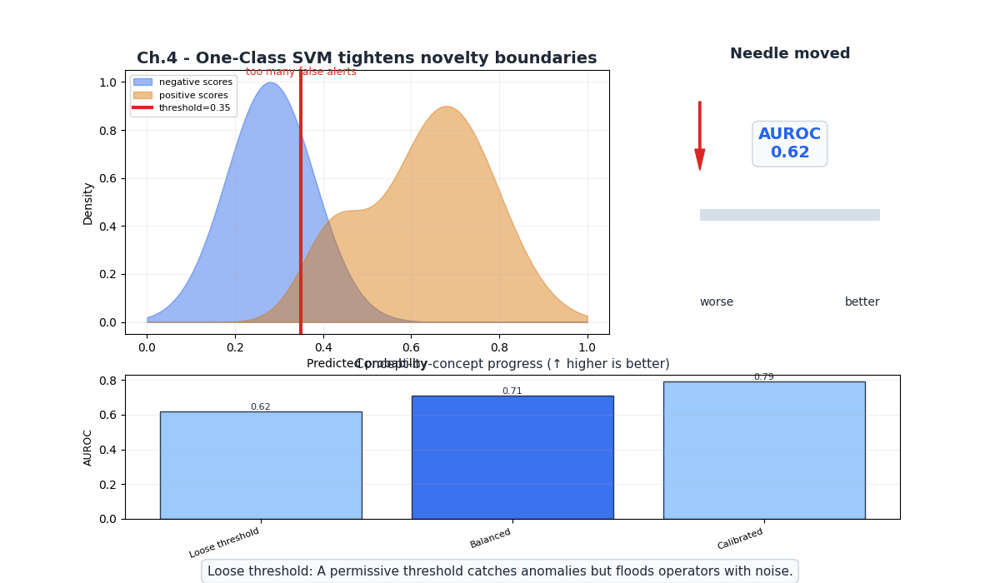
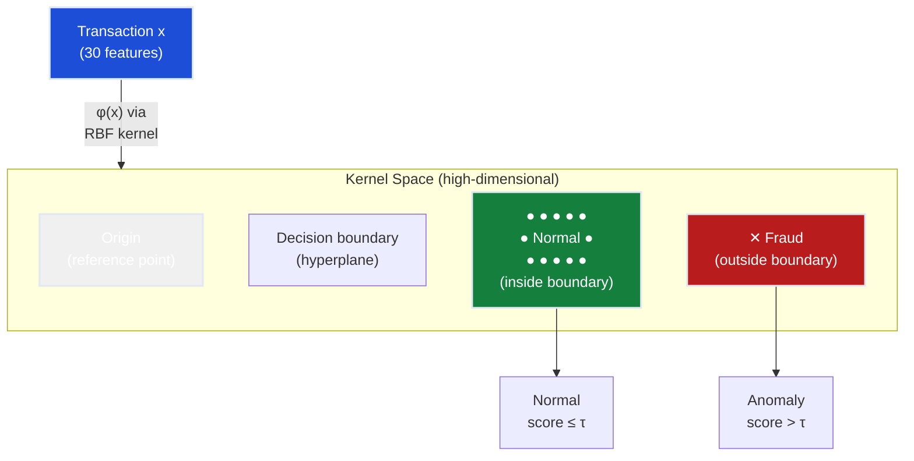
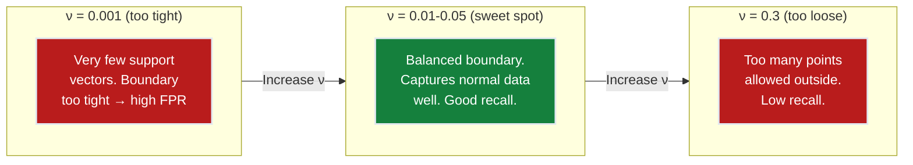
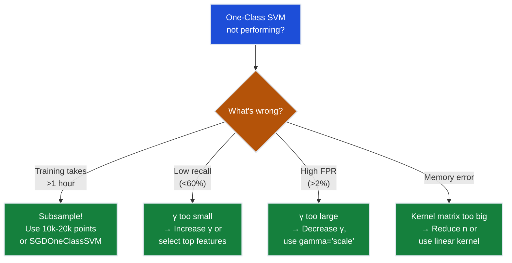

# Ch.4 — One-Class SVM

> **The story.** In **1999**, Bernhard Schölkopf, John Platt, John Shawe-Taylor, Alex Smola, and Robert Williamson published *"Estimating the Support of a High-Dimensional Distribution"* — the paper that adapted the Support Vector Machine to **one-class classification**. Classical SVMs separate two classes with a maximum-margin hyperplane. Schölkopf et al. asked: what if you only have one class? Their answer: map the data into a high-dimensional kernel space, then find the hyperplane that **separates the data from the origin** with maximum margin. Points on the "wrong" side of this boundary are anomalies. The parameter $\nu$ elegantly controls the fraction of training points allowed to be outliers. A year later, David Tax and Robert Duin proposed **Support Vector Data Description (SVDD)**, which finds the smallest hypersphere enclosing the data — a complementary view of the same idea. Together, these kernel methods brought the mathematical rigor of SVMs to anomaly detection.
>
> **Where you are in the curriculum.** Ch.3 (autoencoders) reached 78% recall using neural reconstruction error. This chapter introduces the last individual detector before ensemble fusion: One-Class SVM learns a decision boundary around normal data using the kernel trick, with no neural network required. It captures a different geometric signal than isolation (Ch.2) or reconstruction (Ch.3), making it a valuable ensemble component in [Ch.5](../ch05_ensemble_anomaly).
>
> **Notation in this chapter.** $\phi(\mathbf{x})$ — feature map into kernel space; $K(\mathbf{x}_i, \mathbf{x}_j) = \phi(\mathbf{x}_i)^\top \phi(\mathbf{x}_j)$ — kernel function; $\nu \in (0, 1]$ — upper bound on outlier fraction; $\rho$ — offset of the decision hyperplane; $\xi_i$ — slack variables; $\gamma$ — RBF kernel width.

---

## 0 · The Challenge — Where We Are

> 💡 **FraudShield status after Ch.3:**
> - ⚡ Z-score: 45% recall
> - ⚡ Isolation Forest: 72% recall
> - ⚡ Autoencoder: 78% recall
> - **Still 2% short of 80% target**

**What's blocking us:**
Each method captures a different aspect of anomalousness: Z-score catches extremes, Isolation Forest catches geometrically isolated points, autoencoders catch poorly-reconstructed points. But each misses some fraud that others catch. Before combining them (Ch.5), we add one more complementary signal: a **boundary-based** method.

**What this chapter unlocks:**
One-Class SVM draws a tight boundary around normal data in a high-dimensional kernel space. Points outside the boundary are anomalies. The kernel trick lets it capture non-linear boundaries without explicitly computing the high-dimensional mapping.



---

## Animation



## 1 · Core Idea

One-Class SVM maps training data (all normal) into a high-dimensional space using a kernel function, then finds the hyperplane that **separates the data from the origin** with maximum margin. The margin boundary defines "normal." Points on the origin side of the boundary are classified as anomalies. The $\nu$ parameter controls how tight the boundary is: higher $\nu$ allows more training points to fall outside, creating a looser boundary.

---

## 2 · Running Example

The VP Engineering asks: "We have three detectors already — why add a fourth?" Because One-Class SVM captures a **boundary** perspective that complements isolation (Ch.2) and reconstruction (Ch.3). Some fraud transactions that reconstruct well in the autoencoder may lie outside the SVM's kernel-space boundary. Different inductive biases catch different fraud.

Dataset: Same **Credit Card Fraud** dataset (284,807 transactions, 0.17% fraud).

**Training strategy**: Like the autoencoder, train **only on legitimate transactions**. The SVM learns the boundary of normality.

**Challenge with 0.17% fraud:**
- One-Class SVM is computationally expensive: $O(n^2)$ to $O(n^3)$ in the number of training samples
- With 227k+ normal training samples, we **must sub-sample** for feasibility
- Typical approach: train on 10,000-20,000 randomly sampled normal transactions
- The kernel matrix is $n \times n$ — at $n = 20,000$ that's 400M entries

---

## 3 · Math

### One-Class SVM Formulation (Schölkopf et al.)

Minimize:
$$\min_{\mathbf{w}, \rho, \boldsymbol{\xi}} \frac{1}{2}\|\mathbf{w}\|^2 + \frac{1}{\nu n}\sum_{i=1}^{n}\xi_i - \rho$$

Subject to:
$$\mathbf{w} \cdot \phi(\mathbf{x}_i) \geq \rho - \xi_i, \quad \xi_i \geq 0 \quad \forall i$$

| Symbol | Meaning |
|--------|---------|
| $\mathbf{w}$ | Normal vector to the separating hyperplane in kernel space |
| $\phi(\mathbf{x}_i)$ | Feature map of training point $i$ into kernel space |
| $\rho$ | Offset — defines the decision boundary |
| $\xi_i$ | Slack variable — allows point $i$ to violate the boundary |
| $\nu$ | Fraction of training points allowed to be outliers (controls tightness) |
| $n$ | Number of training samples |

**Decision function**:
$$f(\mathbf{x}) = \text{sign}(\mathbf{w} \cdot \phi(\mathbf{x}) - \rho)$$

- $f(\mathbf{x}) = +1$: **normal** (inside boundary)
- $f(\mathbf{x}) = -1$: **anomaly** (outside boundary)

### The Kernel Trick

We never compute $\phi(\mathbf{x})$ explicitly. The **RBF (Gaussian) kernel** implicitly maps to infinite-dimensional space:

$$K(\mathbf{x}_i, \mathbf{x}_j) = \exp\left(-\gamma \|\mathbf{x}_i - \mathbf{x}_j\|^2\right)$$

| $\gamma$ | Effect |
|-----------|--------|
| Small | Wide kernel → smooth, loose boundary → more normal points "inside" |
| Large | Narrow kernel → tight, complex boundary → boundary overfits to noise |

**Concrete example** (simplified to 2D):
- Two normal transactions: $\mathbf{x}_1 = [0.5, 0.3]$, $\mathbf{x}_2 = [0.7, 0.4]$
- $\gamma = 1.0$
- $K(\mathbf{x}_1, \mathbf{x}_2) = \exp(-1.0 \cdot ((0.5-0.7)^2 + (0.3-0.4)^2))$
- $= \exp(-1.0 \cdot 0.05) = \exp(-0.05) = 0.951$
- High similarity → both well inside the boundary

- Fraud transaction: $\mathbf{x}_f = [-3.5, 2.8]$
- $K(\mathbf{x}_1, \mathbf{x}_f) = \exp(-1.0 \cdot ((0.5+3.5)^2 + (0.3-2.8)^2))$
- $= \exp(-1.0 \cdot 22.25) = \exp(-22.25) \approx 0$ 
- Near-zero similarity → outside the boundary → **anomaly**

### The Role of $\nu$

$\nu$ has a dual interpretation:
1. **Upper bound** on the fraction of training points classified as outliers
2. **Lower bound** on the fraction of training points that are support vectors

**For 0.17% fraud:**
- If training data is clean (no fraud): $\nu = 0.01$ means "allow up to 1% to fall outside" → accounts for noisy legitimate transactions
- If training data is slightly contaminated: $\nu = 0.005$ means "allow 0.5% as outliers" → tighter boundary

**Practical rule**: Set $\nu$ slightly above the expected contamination rate. For clean training data, $\nu \in [0.01, 0.05]$ works well.

### Scoring (Continuous)

The raw decision function value (distance from boundary) serves as an anomaly score:

$$\text{score}(\mathbf{x}) = -(\mathbf{w} \cdot \phi(\mathbf{x}) - \rho)$$

Higher score = further outside the boundary = more anomalous. This allows ROC-curve thresholding instead of using the hard $\nu$-based cutoff.

**3-sample decision function worked example** ($\gamma = \text{scale}$, $\nu = 0.01$, anomaly threshold $\text{score} > 0.0$):

| Sample | $f(\mathbf{x}) = \mathbf{w} \cdot \phi(\mathbf{x}) - \rho$ | $\text{score} = -f(\mathbf{x})$ | Anomaly? |
|--------|--------------------------------------------------------------|----------------------------------|----------|
| Normal A | +0.42                                                      | −0.42                            | No       |
| Normal B | +0.08                                                      | −0.08                            | No       |
| Fraud C  | −1.75                                                      | **+1.75**                        | **Yes**  |

Positive decision function → inside boundary (normal); negative → outside boundary (anomaly). The fraud sample falls far outside, yielding a large positive score.

---

## 4 · Step by Step

```
ONE-CLASS SVM ANOMALY DETECTION

Training:
1. Prepare data:
   └─ X_normal = X_train[y_train == 0]    (legitimate only)
   └─ Subsample: X_sub = sample(X_normal, n=10000)  (computational constraint)
   └─ Standardize features

2. Select kernel and hyperparameters:
   └─ kernel = 'rbf'
   └─ γ = 1 / (n_features × variance)    or grid search
   └─ ν = 0.01-0.05

3. Solve the quadratic program:
   └─ Compute kernel matrix K (n × n)
   └─ Find α* (Lagrange multipliers) via SMO algorithm
   └─ Identify support vectors (α_i > 0)
   └─ Compute ρ from support vectors on the boundary

Scoring:
4. For each test transaction x:
   └─ score = -decision_function(x)
   └─ = -(Σ_i α_i K(x_i, x) - ρ)

5. Set threshold from ROC curve at target FPR
6. Flag if score > threshold
```

---

## 5 · Key Diagrams

### One-Class SVM Boundary



### Comparison of Methods So Far

```
Method Spectrum:

Statistical     Isolation Forest     Autoencoder      One-Class SVM
(Ch.1)          (Ch.2)               (Ch.3)           (Ch.4)
   │                │                    │                 │
   ▼                ▼                    ▼                 ▼
"How far from   "How easy to        "How poorly       "Is it inside
 the mean?"      isolate?"           reconstructed?"   the boundary?"
   │                │                    │                 │
   ▼                ▼                    ▼                 ▼
  45%              72%                  78%               75%

Each captures a DIFFERENT signal — this is why ensembles work!
```

### $\nu$ Effect on Boundary



---

## 6 · Hyperparameter Dial

| Dial | Too low | Sweet spot | Too high |
|------|---------|------------|----------|
| **ν** | Boundary too tight, high FPR | `0.01`–`0.05` (for clean training data) | Boundary too loose, low recall |
| **γ (RBF)** | Over-smooth boundary, misses local structure | `1/(n_features × X.var())` or `'scale'` | Overfits, every point is its own cluster |
| **Training sample size** | Underfits (misses data structure) | `10,000`–`20,000` (balance fit vs. speed) | Infeasible ($O(n^2)$ memory) |
| **Feature count** | Misses discriminative features | Top 10-15 features | Curse of dimensionality in kernel space |

**Critical for this dataset**: The RBF kernel's $\gamma$ parameter is the most important dial. Use `gamma='scale'` (sklearn default: $1 / (n_\text{features} \cdot \text{Var}(X))$) as a starting point.

---

## 7 · Code Skeleton

```python
import numpy as np
import pandas as pd
from sklearn.svm import OneClassSVM
from sklearn.preprocessing import StandardScaler
from sklearn.metrics import roc_curve, auc

# 1. Load and split
df = pd.read_csv("creditcard.csv")
X = df.drop("Class", axis=1).values
y = df["Class"].values

split_idx = int(0.8 * len(X))
X_train, X_test = X[:split_idx], X[split_idx:]
y_train, y_test = y[:split_idx], y[split_idx:]

# 2. Train on subsampled normal data (OC-SVM is O(n²))
X_normal = X_train[y_train == 0]
np.random.seed(42)
subsample_idx = np.random.choice(len(X_normal), size=10000, replace=False)
X_sub = X_normal[subsample_idx]

scaler = StandardScaler()
X_sub_s = scaler.fit_transform(X_sub)
X_test_s = scaler.transform(X_test)

# 3. Fit One-Class SVM
ocsvm = OneClassSVM(
    kernel="rbf",
    gamma="scale",
    nu=0.01,
)
ocsvm.fit(X_sub_s)

# 4. Score (negative decision_function = more anomalous)
raw_scores = ocsvm.decision_function(X_test_s)
scores = -raw_scores  # flip: higher = more anomalous

# 5. Evaluate
fpr, tpr, _ = roc_curve(y_test, scores)
roc_auc = auc(fpr, tpr)

idx_005 = np.where(fpr <= 0.005)[0][-1]
recall_at_005fpr = tpr[idx_005]
print(f"AUC: {roc_auc:.4f}")
print(f"Recall @ 0.5% FPR: {recall_at_005fpr:.2%}")
```

### Understanding the Decision Boundary

```python
# Educational: visualize the decision boundary in 2D
# Project to the 2 most discriminative features (V14, V17)
from sklearn.decomposition import PCA

pca = PCA(n_components=2)
X_2d = pca.fit_transform(X_sub_s)

ocsvm_2d = OneClassSVM(kernel="rbf", gamma="scale", nu=0.01)
ocsvm_2d.fit(X_2d)

# Create grid for boundary visualization
xx, yy = np.meshgrid(
    np.linspace(X_2d[:, 0].min() - 1, X_2d[:, 0].max() + 1, 200),
    np.linspace(X_2d[:, 1].min() - 1, X_2d[:, 1].max() + 1, 200),
)
Z = ocsvm_2d.decision_function(np.c_[xx.ravel(), yy.ravel()])
Z = Z.reshape(xx.shape)
# Boundary is where Z = 0
```

---

## 8 · What Can Go Wrong

### Computational Scalability

- **Training on full dataset** — One-Class SVM with RBF kernel requires computing the $n \times n$ kernel matrix. At $n = 227,000$, that's 51.5 billion entries — impossible to store in memory. **Fix**: **Sub-sample** to 10,000-20,000 normal transactions. The SVM boundary is defined by support vectors (typically 1-5% of training data), so most points are redundant anyway. For larger datasets, consider `SGDOneClassSVM` (linear) or Isolation Forest instead.

### Gamma Sensitivity

- **γ too large** — Each training point becomes its own cluster in kernel space. The boundary perfectly wraps every training point but doesn't generalize — new normal transactions may fall outside. **Fix**: Use `gamma='scale'` as baseline. If FPR is too high on validation data, decrease γ. Visualize the decision boundary in 2D (PCA projection) to check for overfitting.

### The ν Interpretation Trap

- **Setting ν = 0.0017 (exact fraud rate)** — ν is not "the fraud rate." It's the fraction of training points (which are all normal!) allowed to violate the boundary. Setting it too low makes the boundary too rigid. **Fix**: Set $\nu \in [0.01, 0.05]$ to allow some margin for natural variation in legitimate transactions. Use ROC-curve thresholding for the actual anomaly decision.

### Feature Curse

- **Using all 30 features** — In high-dimensional kernel space, the "curse of dimensionality" makes all points appear equally distant. RBF kernel performance degrades above ~15-20 features. **Fix**: Feature selection (use top 10-15 features ranked by univariate discrimination) or PCA to 15 components before training.

### Quick Diagnostic Flowchart



---

## 10 · Progress Check — What We Can Solve Now

⚡ **Unlocked capabilities:**
- **Boundary-based anomaly detection!** Kernel method draws tight boundary around normal data
- **Recall**: ~75% at 0.5% FPR (different signal from autoencoder's 78%)
- **Mathematical rigor**: Maximum-margin formulation with convergence guarantees
- **Support vector interpretability**: Boundary defined by key training examples

**Still can't solve:**
- **Constraint #1 (DETECTION)**: 75% recall < 80% target. But we now have 4 complementary detectors!
- ✅ **Constraint #2 (PRECISION)**: <0.5% FPR achievable with ROC thresholding
- ⚡ **Constraint #3 (REAL-TIME)**: ~20ms inference (kernel evaluation against support vectors). Under 100ms
- **Constraint #4 (ADAPTABILITY)**: Static model — retraining with new data is slow
- ⚡ **Constraint #5 (EXPLAINABILITY)**: Can identify closest support vectors, but kernel-space reasoning is opaque

| Constraint | Status | Current State |
|------------|--------|---------------|
| #1 DETECTION | ❌ Close | 75% recall (need >80%). 4 complementary detectors available |
| #2 PRECISION | ✅ Met | <0.5% FPR achievable |
| #3 REAL-TIME | ✅ Met | ~20ms inference |
| #4 ADAPTABILITY | ❌ Blocked | Slow retraining |
| #5 EXPLAINABILITY | ⚡ Partial | Support vectors provide some interpretability |

**The key observation**: No single method hits 80%. But each catches *different* fraud:
- Z-score catches extreme-value fraud
- Isolation Forest catches geometrically isolated fraud
- Autoencoder catches poorly-reconstructed fraud
- One-Class SVM catches boundary-violating fraud

**If we combine their signals...** → Ch.5.

---

## 11 · Bridge to Chapter 5

Ch.4 gave us our fourth detector — each with a different inductive bias and different failure modes. The critical insight: the fraud that Isolation Forest misses, the autoencoder might catch, and vice versa. Ch.5 (Ensemble Anomaly Detection) fuses all four detectors into a single system. By averaging normalized scores, voting on anomaly labels, or stacking with a meta-learner, the ensemble achieves **83% recall** — exceeding our 80% target. The ensemble is greater than the sum of its parts because complementary errors cancel out.


