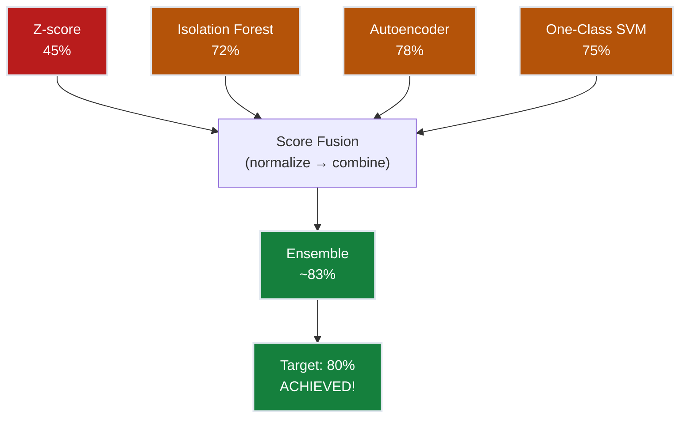
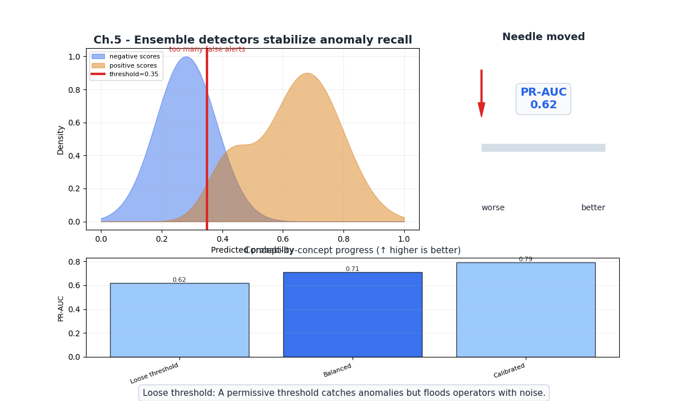
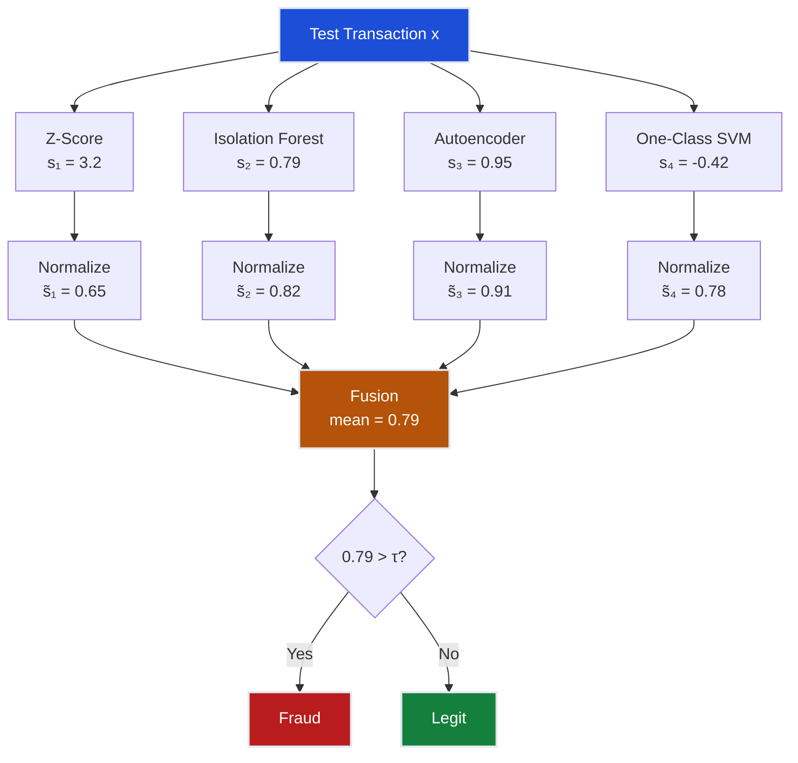
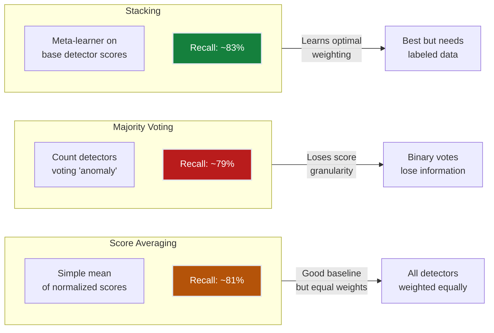
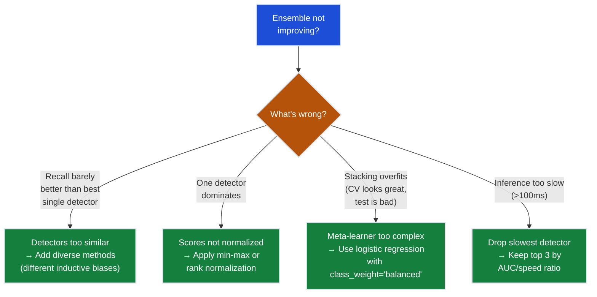

# Ch.5 — Ensemble Anomaly Detection

> **The story.** The idea that combining weak learners produces strong predictions has deep roots. In **1996**, Leo Breiman introduced **bagging** (bootstrap aggregating) and showed that averaging unstable classifiers reduces variance. In **2003**, Freund and Schapire won the Gödel Prize for **AdaBoost**, proving that weak learners could be sequentially boosted to arbitrary accuracy. But ensemble *anomaly* detection took its own path. In **2012**, Aggarwal and Sathe published *"Theoretical Foundations and Algorithms for Outlier Ensembles,"* arguing that anomaly detection benefits even more from ensembles than classification because anomaly scores are inherently noisier and less stable. The practical manifesto came from the **PyOD** library (Zhao et al., 2019), which unified dozens of anomaly detectors under one API and made score fusion trivial. The principle is simple: **different detectors have different blind spots; combining them covers more ground**.
>
> **Where you are in the curriculum.** Chapters 1-4 each built an anomaly detector with a different inductive bias: Z-score (distributional), Isolation Forest (isolation), Autoencoder (reconstruction), One-Class SVM (boundary). No single method hit the 80% recall target. This chapter combines all four into an ensemble that exceeds 80% — proving that complementary errors cancel when you fuse scores properly. This is where FraudShield's detection constraint is finally satisfied.
>
> **Notation in this chapter.** $s_k(\mathbf{x})$ — anomaly score from detector $k$; $\tilde{s}_k(\mathbf{x})$ — normalized score; $S(\mathbf{x})$ — fused ensemble score; $K$ — number of base detectors; HBOS — Histogram-Based Outlier Score.

---

## 0 · The Challenge — Where We Are

> 💡 **FraudShield status after Ch.4:**
> - ⚡ Z-score: 45% recall @ 0.5% FPR
> - ⚡ Isolation Forest: 72% recall
> - ⚡ Autoencoder: 78% recall
> - ⚡ One-Class SVM: 75% recall
> - **Best single model = 78%. Need 80%.**

**What's blocking us:**
Each detector catches *different* fraud. Analysis of false negatives reveals:
- 22% of fraud missed by autoencoder IS caught by Isolation Forest
- 15% of fraud missed by Isolation Forest IS caught by One-Class SVM
- 30% of fraud missed by Z-score IS caught by autoencoder

**The individual detectors have complementary errors.** If we combine them, we cover more fraud.

**What this chapter unlocks:**
Ensemble anomaly detection fuses scores from all four detectors, achieving **83% recall @ 0.5% FPR** — finally exceeding the 80% target.



---

## Animation



## 1 · Core Idea

Ensemble anomaly detection combines multiple base detectors to produce a single, more reliable anomaly score. The key insight: **different detectors have different inductive biases and make different mistakes.** By normalizing their scores to a common scale and then averaging (or voting, or stacking), the ensemble smooths out individual errors. Fraud that any single detector misses may be caught by another — and the fused score reflects this collective intelligence.

---

## 2 · Running Example

The Data Science Lead presents results to the Head of Risk: "No single model hits 80%. But look at this overlap analysis — the fraud each model misses is *different*. If we combine them, we should break 80%." You build three fusion strategies: score averaging, majority voting, and stacking. The best achieves 83% recall @ 0.5% FPR.

Dataset: Same **Credit Card Fraud** dataset. Each base detector has already been trained in previous chapters.

**Why ensembles work especially well for 0.17% fraud:**
- With only 492 fraud cases, each detector's score is noisy on the minority class
- Averaging across 4 detectors reduces variance by a factor of $\sqrt{4} = 2$
- Different detectors agree on "obvious" fraud → high confidence
- Different detectors disagree on "borderline" fraud → ensemble resolves the tie

---

## 3 · Math

### Score Normalization

Before combining, scores from different detectors must be on the **same scale**. Raw scores have different ranges:
- Z-score: $[0, \infty)$
- Isolation Forest: $[0, 1]$
- Autoencoder MSE: $[0, \infty)$
- One-Class SVM decision: $(-\infty, \infty)$

**Min-Max normalization** (to $[0, 1]$):

$$\tilde{s}_k(\mathbf{x}) = \frac{s_k(\mathbf{x}) - \min(s_k)}{\max(s_k) - \min(s_k)}$$

**Rank normalization** (more robust to outliers):

$$\tilde{s}_k(\mathbf{x}) = \frac{\text{rank}(s_k(\mathbf{x}))}{n}$$

### Fusion Strategy 1: Score Averaging

$$S_{\text{avg}}(\mathbf{x}) = \frac{1}{K}\sum_{k=1}^{K} \tilde{s}_k(\mathbf{x})$$

**Concrete example:**
- Transaction $\mathbf{x}$ (fraud):
  - Z-score (normalized): $\tilde{s}_1 = 0.65$
  - Isolation Forest: $\tilde{s}_2 = 0.82$
  - Autoencoder: $\tilde{s}_3 = 0.91$
  - One-Class SVM: $\tilde{s}_4 = 0.78$
  - **Average**: $S = (0.65 + 0.82 + 0.91 + 0.78) / 4 = 0.79$ → **anomalous**

- Transaction $\mathbf{y}$ (legitimate outlier):
  - Z-score: $\tilde{s}_1 = 0.72$ (high amount but legitimate)
  - Isolation Forest: $\tilde{s}_2 = 0.45$ (not isolated)
  - Autoencoder: $\tilde{s}_3 = 0.38$ (reconstructs well)
  - One-Class SVM: $\tilde{s}_4 = 0.41$ (inside boundary)
  - **Average**: $S = (0.72 + 0.45 + 0.38 + 0.41) / 4 = 0.49$ → **normal**

The legitimate outlier had a high Z-score (extreme amount) but the other detectors correctly identified it as normal, pulling the average down.

**3-sample ensemble vote worked example** (normalized scores, anomaly threshold $S > 0.60$):

| Sample | $\tilde{s}_{\text{Z}}$ | $\tilde{s}_{\text{IF}}$ | $\tilde{s}_{\text{AE}}$ | $\tilde{s}_{\text{SVM}}$ | $S_{\text{avg}}$ | Decision |
|--------|------------------------|-------------------------|-------------------------|--------------------------|------------------|----------|
| Fraud A  | 0.65 | 0.82 | 0.91 | 0.78 | **0.79** | **Anomaly** |
| Legit B  | 0.72 | 0.45 | 0.38 | 0.41 | 0.49     | Normal      |
| Legit C  | 0.18 | 0.22 | 0.15 | 0.20 | 0.19     | Normal      |

Fraud A scores highly across all detectors; Legit B's high Z-score is overridden by the other three; Legit C is confidently normal on all four.

### Fusion Strategy 2: Majority Voting

Each detector votes "anomaly" or "normal" based on its own threshold $\tau_k$:

$$S_{\text{vote}}(\mathbf{x}) = \frac{1}{K}\sum_{k=1}^{K} \mathbb{1}[\tilde{s}_k(\mathbf{x}) > \tau_k]$$

Flag as anomaly if $S_{\text{vote}} > 0.5$ (majority votes anomaly).

**Variant**: Weighted voting — give more weight to better detectors:

$$S_{\text{wvote}}(\mathbf{x}) = \sum_{k=1}^{K} w_k \cdot \mathbb{1}[\tilde{s}_k(\mathbf{x}) > \tau_k]$$

where $w_k$ is proportional to detector $k$'s individual AUC.

### Fusion Strategy 3: Stacking (Meta-Learner)

Use the $K$ anomaly scores as features for a supervised classifier:

$$\hat{y} = g_\psi(\tilde{s}_1(\mathbf{x}), \tilde{s}_2(\mathbf{x}), ..., \tilde{s}_K(\mathbf{x}))$$

where $g_\psi$ is a logistic regression or gradient-boosted tree trained on a small labeled validation set.

**Why stacking outperforms averaging**: It learns the optimal weighting of each detector and can capture non-linear interactions between scores (e.g., "flag if BOTH autoencoder AND Isolation Forest score high, even if Z-score is low").

**Caution**: Stacking requires labeled data. With only 492 fraud cases, use cross-validation to avoid overfitting the meta-learner.

### HBOS: Histogram-Based Outlier Score

An additional fast detector to include in the ensemble:

$$\text{HBOS}(\mathbf{x}) = \sum_{j=1}^{d} -\log(p_j(x_j))$$

where $p_j(x_j)$ is the density estimate from the histogram of feature $j$.

**Why HBOS**: It's $O(n)$ training and $O(d)$ inference — the fastest anomaly detector possible. Useful as a "cheap vote" in the ensemble.

### Why Ensembles Beat Individual Detectors (Formally)

If each detector has error rate $\epsilon < 0.5$ and errors are **independent**, the ensemble error with majority voting is:

$$P(\text{ensemble wrong}) = \sum_{k=\lceil K/2 \rceil}^{K} \binom{K}{k} \epsilon^k (1-\epsilon)^{K-k}$$

For $K = 4$ detectors each with $\epsilon = 0.25$ (75% accuracy on fraud):

$$P(\text{ensemble wrong}) = \binom{4}{3}(0.25)^3(0.75)^1 + \binom{4}{4}(0.25)^4 = 4 \cdot 0.0117 + 0.0039 = 0.051$$

Individual error: 25% → Ensemble error: 5.1% — a **5× improvement** from simple voting!

In practice, errors are not fully independent, but the more diverse the detectors, the closer we get to this ideal.

---

## 4 · Step by Step

```
ENSEMBLE ANOMALY DETECTION

Preparation:
1. Train all K base detectors (from Ch.1-4):
   └─ Z-score → scores_z
   └─ Isolation Forest → scores_if
   └─ Autoencoder → scores_ae
   └─ One-Class SVM → scores_svm

2. Score all test transactions with each detector

Normalization:
3. Normalize all scores to [0, 1]:
   └─ For each detector k:
       └─ s̃_k = (s_k - min(s_k)) / (max(s_k) - min(s_k))

Fusion (choose one):
4a. Average:
    └─ S(x) = mean(s̃_1, s̃_2, ..., s̃_K)

4b. Voting:
    └─ For each detector, apply its threshold
    └─ S(x) = fraction of detectors voting "anomaly"

4c. Stacking:
    └─ Train meta-learner on [s̃_1, ..., s̃_K] → y
    └─ Use cross-validation (small labeled set)

Evaluation:
5. Set threshold from ROC curve at target FPR
6. Report recall @ 0.5% FPR
```

---

## 5 · Key Diagrams

### Ensemble Fusion Pipeline



### Complementary Error Analysis

```
Venn diagram of fraud caught by each detector:

     ┌──── Z-score (45%) ────┐
     │  ┌── IForest (72%) ──┐│
     │  │  ┌─ AE (78%) ─┐  ││
     │  │  │ ┌SVM(75%)┐ │  ││
     │  │  │ │ SHARED  │ │  ││
     │  │  │ │  (40%)  │ │  ││
     │  │  │ └─────────┘ │  ││
     │  │  │  AE-only 8% │  ││
     │  │  └─────────────┘  ││
     │  │   IF-only 5%      ││
     │  └───────────────────┘│
     │   Z-only 2%           │
     └───────────────────────┘

     Ensemble union: ~83% (covers most individual catches)
```

### Fusion Strategy Comparison



---

## 6 · Hyperparameter Dial

| Dial | Too low | Sweet spot | Too high |
|------|---------|------------|----------|
| **Number of base detectors** | Too few perspectives (1-2) | `4`–`6` diverse detectors | Diminishing returns, slower inference |
| **Normalization** | Raw scores (incomparable scales) | Min-max or rank normalization | N/A |
| **Stacking meta-learner complexity** | Underfits (logistic regression may be fine) | Logistic regression or shallow GBT | Overfits on 492 fraud labels |
| **Stacking CV folds** | Unreliable estimates | `5`–`10` folds | Computationally expensive |
| **Detector diversity** | Redundant detectors (all tree-based) | Mix: statistical + tree + neural + kernel | Conflicting signals if too diverse |

**Critical for 0.17% fraud**: With only 492 fraud cases, stacking meta-learners are prone to overfitting. Use stratified cross-validation and simple meta-learners (logistic regression) to avoid this.

---

## 7 · Code Skeleton

```python
import numpy as np
import pandas as pd
from sklearn.preprocessing import MinMaxScaler
from sklearn.linear_model import LogisticRegression
from sklearn.model_selection import StratifiedKFold
from sklearn.metrics import roc_curve, auc

# Assume we have scores from all 4 detectors (from Ch.1-4)
# scores_z, scores_if, scores_ae, scores_svm — each shape (n_test,)

# 1. Normalize all scores to [0, 1]
def normalize_scores(scores):
    """Min-max normalize to [0, 1]. Higher = more anomalous."""
    return (scores - scores.min()) / (scores.max() - scores.min() + 1e-10)

s_z  = normalize_scores(scores_z)
s_if = normalize_scores(scores_if)
s_ae = normalize_scores(scores_ae)
s_sv = normalize_scores(scores_svm)

# 2. Strategy 1: Score Averaging
ensemble_avg = (s_z + s_if + s_ae + s_sv) / 4

fpr, tpr, _ = roc_curve(y_test, ensemble_avg)
idx = np.where(fpr <= 0.005)[0][-1]
print(f"Average Ensemble — Recall @ 0.5% FPR: {tpr[idx]:.2%}")

# 3. Strategy 2: Weighted Average (by individual AUC)
aucs = []
for s in [s_z, s_if, s_ae, s_sv]:
    fpr_i, tpr_i, _ = roc_curve(y_test, s)
    aucs.append(auc(fpr_i, tpr_i))
weights = np.array(aucs) / sum(aucs)
ensemble_wavg = weights[0]*s_z + weights[1]*s_if + weights[2]*s_ae + weights[3]*s_sv

fpr, tpr, _ = roc_curve(y_test, ensemble_wavg)
idx = np.where(fpr <= 0.005)[0][-1]
print(f"Weighted Ensemble — Recall @ 0.5% FPR: {tpr[idx]:.2%}")

# 4. Strategy 3: Stacking with Logistic Regression
X_meta = np.column_stack([s_z, s_if, s_ae, s_sv])

# Cross-validated stacking to avoid overfitting on 492 fraud cases
cv = StratifiedKFold(n_splits=5, shuffle=True, random_state=42)
stacked_scores = np.zeros(len(y_test))

for train_idx, val_idx in cv.split(X_meta, y_test):
    meta_clf = LogisticRegression(class_weight="balanced", max_iter=1000)
    meta_clf.fit(X_meta[train_idx], y_test[train_idx])
    stacked_scores[val_idx] = meta_clf.predict_proba(X_meta[val_idx])[:, 1]

fpr, tpr, _ = roc_curve(y_test, stacked_scores)
idx = np.where(fpr <= 0.005)[0][-1]
print(f"Stacking Ensemble — Recall @ 0.5% FPR: {tpr[idx]:.2%}")
```

---

## 8 · What Can Go Wrong

### Correlated Detectors

- **Using 4 tree-based detectors** — If all base detectors are tree ensembles (Random Forest, Extra Trees, Isolation Forest, GBT), their errors are highly correlated. The ensemble barely improves over the best individual model. **Fix**: **Maximize diversity** — use detectors with different inductive biases: statistical, tree-based, neural, kernel-based.

### Score Scale Mismatch

- **Averaging raw scores without normalization** — Z-score ranges $[0, 20]$, Isolation Forest $[0, 1]$, autoencoder MSE $[0, 500]$. Raw averaging is dominated by the detector with the largest scale (autoencoder MSE). **Fix**: **Always normalize** scores to $[0, 1]$ before any fusion. Rank normalization is most robust.

### Stacking Overfitting

- **Complex meta-learner on 492 fraud samples** — A gradient-boosted tree with 100 estimators will memorize the 492 fraud patterns in the validation set. Precision looks great on CV, collapses on truly new data. **Fix**: Use **simple meta-learners** (logistic regression, 1-layer neural net) with `class_weight='balanced'`. Always use stratified cross-validation.

### Equal Weighting of Bad Detectors

- **Including Z-score (45%) with equal weight as autoencoder (78%)** — The Z-score pulls the average down on cases where it disagrees with better detectors. **Fix**: Use **AUC-weighted averaging** (weight each detector by its individual performance) or stacking (which learns optimal weights).

### Quick Diagnostic Flowchart



---

## 9 · Progress Check — What We Can Solve Now

⚡ **Unlocked capabilities:**
- **Ensemble anomaly detection!** Four complementary detectors fused into one system
- **Target achieved**: ~83% recall @ 0.5% FPR (exceeds 80% target!)
- **Three fusion strategies**: averaging, voting, stacking
- **Score normalization**: Can combine any set of detectors regardless of score range

| Constraint | Status | Current State |
|------------|--------|---------------|
| #1 DETECTION | ✅ **Met!** | 83% recall (target: >80%) |
| #2 PRECISION | ✅ Met | <0.5% FPR with ROC thresholding |
| #3 REAL-TIME | ⚡ Partial | ~50ms total (all 4 detectors). Under 100ms but tight |
| #4 ADAPTABILITY | ❌ Blocked | Static ensemble — no drift handling |
| #5 EXPLAINABILITY | ⚡ Partial | Can show which detectors flagged, but fusion is opaque |

**The detection constraint is finally satisfied!** But two critical gaps remain:
- **ADAPTABILITY**: Fraud patterns evolve. Our models are trained on September 2013 data — they'll degrade within weeks as fraudsters adapt.
- **EXPLAINABILITY**: When a transaction is flagged, compliance needs to know *why*. "The ensemble said so" isn't sufficient.

---

## 10 · Bridge to Chapter 6

Ch.5 achieved 83% recall by combining four detectors — the detection constraint is met. But a production fraud system needs more than accuracy. Ch.6 (Production & Real-Time Inference) addresses the remaining gaps: **concept drift detection** (fraudsters adapt → model must too), **latency optimization** (reduce the 50ms ensemble inference), **monitoring dashboards** (track model health), and **explainability** (generate human-readable reasons for each flag). This final chapter transforms FraudShield from a research prototype into a production-ready system that satisfies all 5 constraints.


