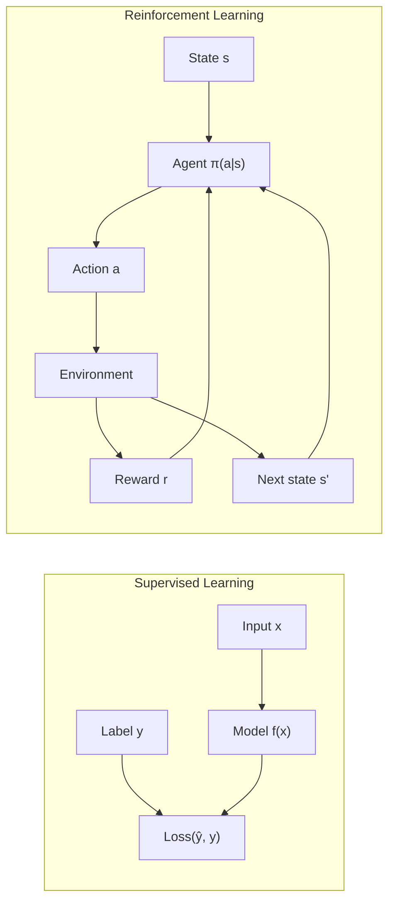
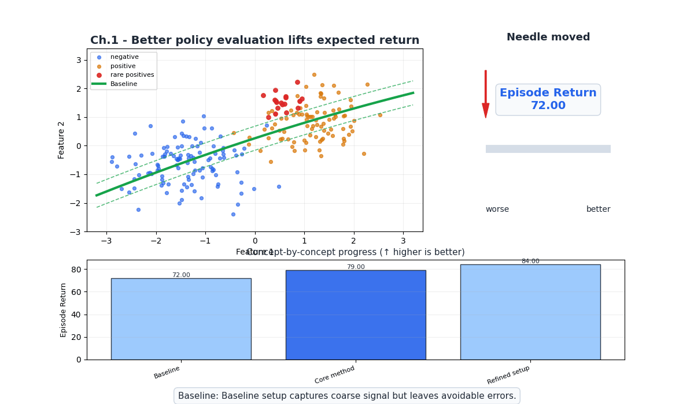
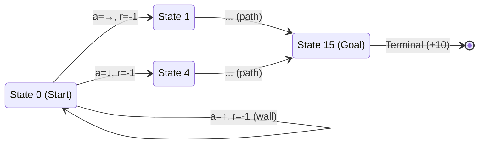
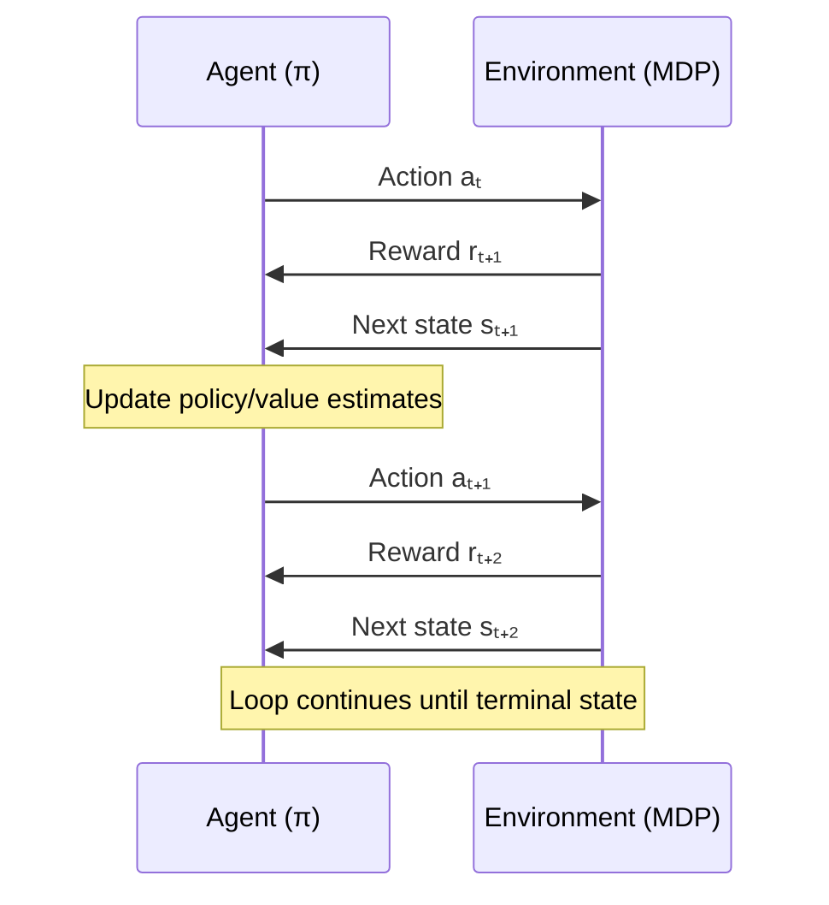
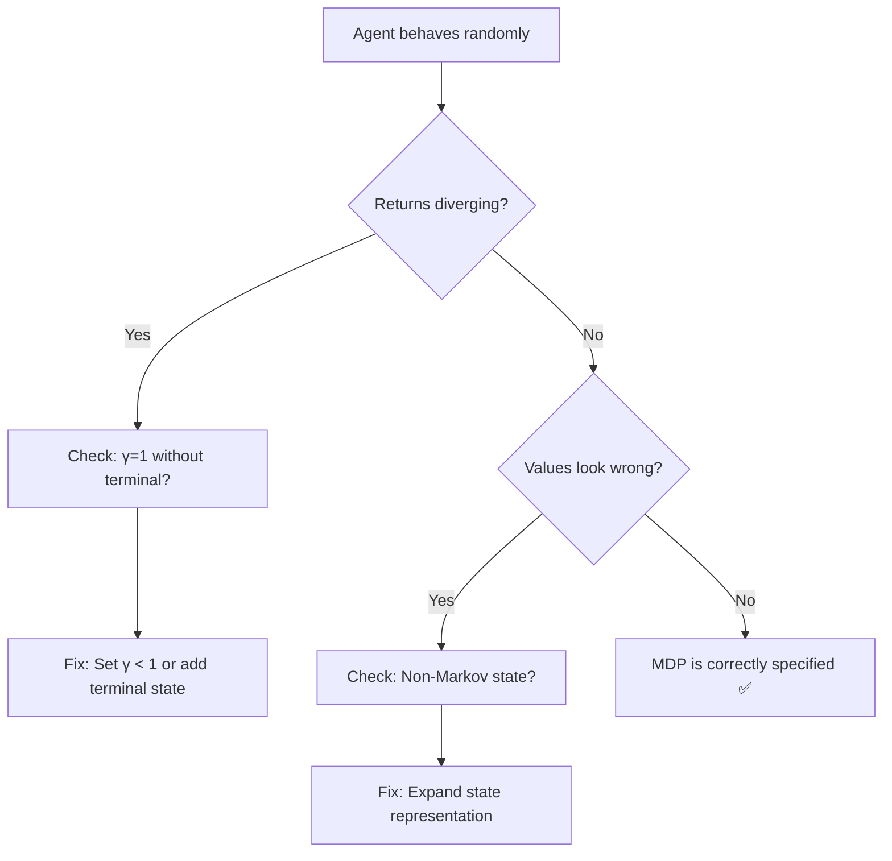

# Ch.1 — Markov Decision Processes (MDPs)

> **The story.** In **1957**, the American mathematician **Richard Bellman** published *Dynamic Programming*, formalizing the idea that sequential decisions under uncertainty could be decomposed into simpler subproblems. Bellman's insight — that the optimal value of a state depends only on the optimal values of its successors — became the **Bellman equation**, the mathematical backbone of every RL algorithm you will encounter. The "Markov" part comes from **Andrey Markov** (1906), who proved that some stochastic processes only need the *present* state to predict the future — the past is irrelevant. Together, Bellman + Markov gave us the **Markov Decision Process**: the formal language in which every RL problem is written.
>
> **Where you are in the curriculum.** This is the first chapter of the Reinforcement Learning track. You've completed supervised learning (regression, classification, neural networks) and unsupervised learning (clustering, anomaly detection). Now you enter the **third paradigm**: learning from interaction. Everything in this chapter — states, actions, rewards, policies, value functions — is the vocabulary that every subsequent chapter builds on. Master this, and chapters 2–6 are variations on a theme.
>
> **Notation in this chapter.** $s$ — state; $a$ — action; $r$ — reward; $S$ — state space; $A$ — action space; $P(s'|s,a)$ — transition probability; $R(s,a,s')$ — reward function; $\pi(a|s)$ — policy; $\gamma$ — discount factor; $V^\pi(s)$ — state value function; $Q^\pi(s,a)$ — action-value function; $G_t$ — return (cumulative discounted reward from time $t$).

---

## 0 · The Challenge — Where We Are

> 💡 **The mission**: Build **AgentAI** — autonomous agents that learn optimal behavior through trial-and-error, satisfying 5 constraints:
> 1. **OPTIMALITY**: Find optimal policy — 2. **EFFICIENCY**: Minimal episodes — 3. **SCALABILITY**: Large state spaces — 4. **STABILITY**: Reliable convergence — 5. **GENERALIZATION**: Transfer to new environments

**What we know so far:**
- ⚡ We know supervised learning (labeled data → minimize prediction error)
- ⚡ We know unsupervised learning (unlabeled data → find structure)
- **But we have NO framework for sequential decision-making under uncertainty!**

**What's blocking us:**
Before we can build agents that learn, we need a **mathematical language** for the problem itself. What is a "state"? What does "optimal" mean formally? How do we express the fact that actions have consequences that unfold over time?

Without this formalism, we can't write algorithms. Without algorithms, we can't build agents.

**What this chapter unlocks:**
The **MDP framework** — the universal language of RL. Every algorithm in chapters 2–6 operates on an MDP. This chapter defines:
- The **components**: states, actions, transitions, rewards
- The **objective**: maximize cumulative discounted reward
- The **key equations**: Bellman equations for $V^\pi$ and $Q^\pi$

| Constraint | Status after this chapter |
|-----------|-------------------------|
| #1 OPTIMALITY | ⚠️ Defined mathematically (Bellman optimality), not yet achieved |
| #2 EFFICIENCY | ❌ Not addressed (no learning algorithm yet) |
| #3 SCALABILITY | ❌ Not addressed (small GridWorld only) |
| #4 STABILITY | ❌ Not addressed (no iterative algorithm yet) |
| #5 GENERALIZATION | ❌ Not addressed (single environment) |



---

## Animation



## 1 · Core Idea

A **Markov Decision Process** is a mathematical framework for modeling sequential decision-making. An agent observes a state, takes an action, receives a reward, and transitions to a new state. The agent's goal is to find a **policy** — a mapping from states to actions — that maximizes the expected sum of future discounted rewards. The "Markov" property says that the next state depends only on the current state and action, not on the history of how we got here. This single assumption makes the entire theory tractable.

---

## 2 · Running Example — GridWorld 4×4

You're training an agent to navigate a 4×4 grid from the Start cell (top-left) to the Goal cell (bottom-right). Every step costs −1 reward (encouraging short paths), and reaching the Goal gives +10.

```
┌──────┬──────┬──────┬──────┐
│ S(0) │  (1) │  (2) │  (3) │
├──────┼──────┼──────┼──────┤
│  (4) │ ██(5)│  (6) │  (7) │
├──────┼──────┼──────┼──────┤
│  (8) │  (9) │ (10) │ (11) │
├──────┼──────┼──────┼──────┤
│ (12) │ (13) │ (14) │ G(15)│
└──────┴──────┴──────┴──────┘

S = Start (state 0)    G = Goal (state 15, terminal)
██ = Wall (state 5, impassable)
Actions: {↑, ↓, ←, →}
Reward: -1 per step, +10 at Goal
```

**MDP components for GridWorld:**
- $S = \{0, 1, 2, ..., 15\}$ — 16 states (cells)
- $A = \{\uparrow, \downarrow, \leftarrow, \rightarrow\}$ — 4 actions
- $P(s'|s,a) = 1$ if the move is valid, else $s' = s$ (deterministic: hitting a wall keeps you in place)
- $R(s,a,s') = +10$ if $s' = 15$ (goal), else $-1$
- $\gamma = 0.9$ (discount factor)

---

## 3 · Math

### 3.1 Formal MDP Definition

An MDP is a 5-tuple $(S, A, P, R, \gamma)$:

$$\text{MDP} = (S, A, P, R, \gamma)$$

| Component | Definition | GridWorld |
|-----------|-----------|-----------|
| $S$ | Finite set of states | $\{0, 1, ..., 15\}$ |
| $A$ | Finite set of actions | $\{\uparrow, \downarrow, \leftarrow, \rightarrow\}$ |
| $P(s'{\mid}s,a)$ | Transition probability: prob of landing in $s'$ given state $s$ and action $a$ | Deterministic: 1 or 0 |
| $R(s,a,s')$ | Reward received on transition from $s$ to $s'$ via action $a$ | $+10$ at goal, $-1$ otherwise |
| $\gamma \in [0,1)$ | Discount factor — how much we value future vs immediate reward | $0.9$ |

### 3.2 Policy

A **policy** $\pi$ is a mapping from states to actions. Two types:

**Deterministic policy** — one action per state:
$$\pi(s) = a$$

**Stochastic policy** — probability distribution over actions:
$$\pi(a|s) = P(\text{take action } a \text{ in state } s)$$

with $\sum_{a \in A} \pi(a|s) = 1$ for all $s$.

**Example:** A random policy in GridWorld assigns $\pi(a|s) = 0.25$ for all four actions in every state. An optimal policy assigns $\pi(\rightarrow | s=0) = 1.0$ (always go right from start).

### 3.3 Return

The **return** $G_t$ is the total discounted reward from time step $t$ onward:

$$G_t = r_{t+1} + \gamma r_{t+2} + \gamma^2 r_{t+3} + \cdots = \sum_{k=0}^{\infty} \gamma^k r_{t+k+1}$$

**Why discount?** Two reasons:
1. **Mathematical**: ensures $G_t$ is finite when $\gamma < 1$ (geometric series)
2. **Practical**: a reward now is worth more than the same reward later (uncertainty)

**Numeric example:** Agent takes 6 steps to reach the goal ($\gamma = 0.9$):

$$G_0 = (-1) + 0.9(-1) + 0.81(-1) + 0.729(-1) + 0.656(-1) + 0.590(+10)$$
$$G_0 = -1 - 0.9 - 0.81 - 0.729 - 0.656 + 5.905 = 1.81$$

If it takes only 3 steps: $G_0 = -1 + 0.9(-1) + 0.81(+10) = -1 - 0.9 + 8.1 = 6.2$. Shorter paths yield higher returns.

### 3.4 State Value Function

The **state value function** $V^\pi(s)$ is the expected return starting from state $s$ and following policy $\pi$:

$$V^\pi(s) = \mathbb{E}_\pi[G_t \mid s_t = s] = \mathbb{E}_\pi\left[\sum_{k=0}^{\infty} \gamma^k r_{t+k+1} \;\middle|\; s_t = s\right]$$

This tells us: "How good is it to be in state $s$ under policy $\pi$?"

### 3.5 Action-Value Function (Q-Function)

The **action-value function** $Q^\pi(s,a)$ is the expected return starting from state $s$, taking action $a$, then following $\pi$:

$$Q^\pi(s,a) = \mathbb{E}_\pi[G_t \mid s_t = s, a_t = a]$$

This tells us: "How good is it to take action $a$ in state $s$ and then follow $\pi$?"

**Relationship:** $V^\pi(s) = \sum_{a} \pi(a|s) \cdot Q^\pi(s,a)$

### 3.6 Bellman Equations

The key recursive relationships. The value of a state equals the immediate reward plus the discounted value of the next state.

**Bellman equation for $V^\pi$:**

$$V^\pi(s) = \sum_{a \in A} \pi(a|s) \sum_{s' \in S} P(s'|s,a) \Big[R(s,a,s') + \gamma V^\pi(s')\Big]$$

**Bellman equation for $Q^\pi$:**

$$Q^\pi(s,a) = \sum_{s' \in S} P(s'|s,a) \Big[R(s,a,s') + \gamma \sum_{a'} \pi(a'|s') Q^\pi(s',a')\Big]$$

**Bellman optimality equation** (the optimal value satisfies):

$$V^*(s) = \max_{a} \sum_{s'} P(s'|s,a) \Big[R(s,a,s') + \gamma V^*(s')\Big]$$

$$Q^*(s,a) = \sum_{s'} P(s'|s,a) \Big[R(s,a,s') + \gamma \max_{a'} Q^*(s',a')\Big]$$

**Numeric example** — Bellman equation at state 0 in GridWorld ($\gamma = 0.9$, deterministic transitions):

Action Right from state 0 → goes to state 1:
$$Q^\pi(0, \rightarrow) = R(0, \rightarrow, 1) + \gamma V^\pi(1) = -1 + 0.9 \cdot V^\pi(1)$$

If $V^\pi(1) = 4.0$ (hypothetical), then $Q^\pi(0, \rightarrow) = -1 + 0.9 \times 4.0 = 2.6$.

### 3.7 Compact Numeric Example — 3-State MDP

Toy MDP: **{s0 = Start, s1 = Mid, s2 = Goal}**, two actions {left, right}, $\gamma = 0.9$.

| State | Meaning | Known $V(s)$ |
|-------|---------|-------------|
| s0 | Start | ? (to compute) |
| s1 | Mid | 5.0 |
| s2 | Goal (terminal) | 0.0 |

Transitions (deterministic): right moves forward (s0→s1, s1→s2), left loops back (s0→s0).  
Rewards: $R = -1$ per step, $R = +10$ on s1→s2.

**One-step Bellman update for $V(s_0)$:**

Action right (s0 → s1, reward −1):
$$Q(s_0, \text{right}) = -1 + 0.9 \times V(s_1) = -1 + 0.9 \times 5.0 = 3.5$$

Action left (s0 → s0, reward −1 — self-loop, V(s0) ≈ 0 at init):
$$Q(s_0, \text{left}) = -1 + 0.9 \times 0 = -1.0$$

Bellman optimality selects the best action:
$$V^*(s_0) = \max(3.5,\ -1.0) = \mathbf{3.5} \quad \Rightarrow \text{always go right}$$

---

## 4 · Step by Step — Understanding the MDP Framework

```
ALGORITHM: Evaluate a trajectory in an MDP
─────────────────────────────────────────
Input:  MDP = (S, A, P, R, γ), policy π, starting state s₀
Output: Return G₀ (cumulative discounted reward)

1. Initialize t = 0, G = 0, discount = 1.0
2. Set s = s₀
3. REPEAT until terminal state:
   a. Sample action a ~ π(·|s)         // follow the policy
   b. Observe next state s' ~ P(·|s,a) // environment transitions
   c. Observe reward r = R(s, a, s')    // environment gives reward
   d. G = G + discount × r             // accumulate discounted reward
   e. discount = discount × γ          // decay the discount
   f. s = s'                           // move to next state
   g. t = t + 1
4. RETURN G
```

**Trace through GridWorld** (policy: always go Right, then Down):

| Step $t$ | State $s$ | Action $a$ | Next $s'$ | Reward $r$ | Discount | $G$ so far |
|----------|-----------|-----------|-----------|-----------|----------|-----------|
| 0 | 0 | → | 1 | −1 | 1.000 | −1.000 |
| 1 | 1 | → | 2 | −1 | 0.900 | −1.900 |
| 2 | 2 | → | 3 | −1 | 0.810 | −2.710 |
| 3 | 3 | ↓ | 7 | −1 | 0.729 | −3.439 |
| 4 | 7 | ↓ | 11 | −1 | 0.656 | −4.095 |
| 5 | 11 | ↓ | 15 | +10 | 0.590 | +1.805 |

**Final return:** $G_0 = 1.805$. The agent took 6 steps. Can we do better with a different policy?

---

## 5 · Key Diagrams

### 5.1 MDP State Transition Graph



### 5.2 Agent-Environment Interaction Loop



### 5.3 Value Function Landscape

```
V*(s) for GridWorld (approximate, γ=0.9):
┌──────┬──────┬──────┬──────┐
│  4.1 │  5.3 │  6.6 │  7.4 │
├──────┼──────┼──────┼──────┤
│  3.0 │  ██  │  7.4 │  8.2 │
├──────┼──────┼──────┼──────┤
│  3.9 │  5.3 │  8.2 │  9.0 │
├──────┼──────┼──────┼──────┤
│  3.0 │  5.9 │  9.0 │ 10.0 │
└──────┴──────┴──────┴──────┘
Goal (state 15) = 10.0 (terminal reward)
Values increase as you get closer to the goal.
```

### 5.4 Policy Visualization

```
Optimal policy π*(s) for GridWorld:
┌──────┬──────┬──────┬──────┐
│  →   │  →   │  ↓   │  ↓   │
├──────┼──────┼──────┼──────┤
│  ↓   │  ██  │  ↓   │  ↓   │
├──────┼──────┼──────┼──────┤
│  →   │  →   │  →   │  ↓   │
├──────┼──────┼──────┼──────┤
│  →   │  →   │  →   │  ★   │
└──────┴──────┴──────┴──────┘
★ = Goal (terminal). Arrows show optimal action.
```

---

## 6 · Hyperparameter Dial

| Hyperparameter | Too Low | Sweet Spot | Too High |
|---------------|---------|------------|----------|
| $\gamma$ (discount) | $< 0.5$: agent is myopic, ignores future rewards, takes greedy short-term actions | $0.9 – 0.99$: balances immediate and future rewards | $\to 1.0$: agent values distant future equally, return can diverge, slow convergence |
| Episode length | $< 10$: agent never reaches goal, can't learn long paths | $50 – 200$: enough to explore and reach terminal states | $> 10{,}000$: wastes compute, agent wanders aimlessly |
| Reward magnitude | $|r| < 0.01$: signal is too weak, gradients vanish | $|r| \in [0.1, 10]$: clear signal without numeric issues | $|r| > 1{,}000$: numeric overflow, unstable updates |

---

## 7 · Code Skeleton

```
# ── GridWorld MDP Definition ──────────────────────────────
class GridWorld:
    states = {0, 1, 2, ..., 15}     # 4×4 grid
    actions = {UP, DOWN, LEFT, RIGHT}
    wall = {5}                        # impassable cell
    goal = 15                         # terminal state
    gamma = 0.9

    def step(state, action):
        # Compute next state (clip at boundaries, block walls)
        next_state = apply_action(state, action)
        if next_state in wall:
            next_state = state        # bounce back
        reward = +10 if next_state == goal else -1
        done = (next_state == goal)
        return next_state, reward, done

# ── Generate a trajectory ─────────────────────────────────
def run_episode(env, policy):
    s = env.start
    trajectory = []
    G = 0.0
    discount = 1.0
    while not done:
        a = policy(s)                 # π(s) → action
        s_next, r, done = env.step(s, a)
        G += discount * r
        discount *= env.gamma
        trajectory.append((s, a, r, s_next))
        s = s_next
    return trajectory, G

# ── Compute V^π by averaging returns ─────────────────────
# (This is Monte Carlo evaluation — preview of Ch.3)
def estimate_V(env, policy, num_episodes=1000):
    returns = {s: [] for s in env.states}
    for _ in range(num_episodes):
        trajectory, _ = run_episode(env, policy)
        G = 0
        for (s, a, r, s_next) in reversed(trajectory):
            G = r + env.gamma * G
            returns[s].append(G)
    V = {s: mean(returns[s]) for s in env.states if returns[s]}
    return V
```

---

## 8 · What Can Go Wrong

| Mistake | Symptom | Fix |
|---------|---------|-----|
| **Non-Markov states** | Agent's optimal action depends on history, not just current state | Expand state representation (add velocity, memory, stack frames) |
| **$\gamma = 1.0$ with no terminal state** | Return $G_t$ diverges to infinity | Always use $\gamma < 1$ or guarantee episode termination |
| **Ignoring terminal states** | Bellman backup propagates through terminal → wrong values | Set $V(s_\text{terminal}) = 0$ (or terminal reward) and stop backup |
| **Reward shaping gone wrong** | Agent exploits shaped reward without actually reaching goal | Ensure potential-based shaping: $F(s,s') = \gamma\Phi(s') - \Phi(s)$ preserves optimal policy |
| **Continuous states treated as discrete** | State space too large for tabular methods, can't generalize | Use function approximation (Ch.4) |




---

## 9 · Where This Reappears

The MDP vocabulary (state, action, reward, transition, discount, Bellman equation) is the shared language of the entire RL track and appears beyond it:

- **Ch.2–Ch.6**: every algorithm is a different strategy for solving the Bellman optimality equation; the notation is identical.
- **AI / FineTuning**: InstructGPT and DPO cast language-model alignment as an MDP with human-preference rewards.
- **MultiAgentAI**: multi-agent systems extend the single-agent MDP to joint action spaces and shared reward structures.

## 10 · Progress Check

After this chapter you should be able to:

| Concept | Check |
|---------|-------|
| Define all 5 components of an MDP | Can you write $(S, A, P, R, \gamma)$ for a new problem? |
| Distinguish deterministic vs stochastic policies | Can you give examples of each? |
| Compute the return $G_t$ for a trajectory | Given a sequence of rewards and $\gamma$, calculate $G_0$? |
| Write the Bellman equation for $V^\pi(s)$ | From memory, no peeking? |
| Explain why $\gamma < 1$ matters | What breaks when $\gamma = 1$? |
| Identify when a problem is NOT Markov | Can you name a problem that requires memory? |

---

## 11 · Bridge to Next Chapter

We've defined the RL problem mathematically. We know what an optimal policy *is* — it's the policy that maximizes $V^\pi(s)$ for all states simultaneously.

**But we don't know how to find it.**

The Bellman optimality equation $V^*(s) = \max_a \sum P(s'|s,a)[R + \gamma V^*(s')]$ is a system of $|S|$ equations in $|S|$ unknowns. For GridWorld (16 states), we could solve it directly. For real problems, we need **iterative algorithms**.

**Chapter 2** introduces **Dynamic Programming** — Value Iteration and Policy Iteration — two algorithms that find the optimal policy by iteratively applying the Bellman equation. The catch: they require knowing $P(s'|s,a)$, which is only possible when we have a complete model of the environment.

> *"We've written down the destination. Now we need to build the road."*


