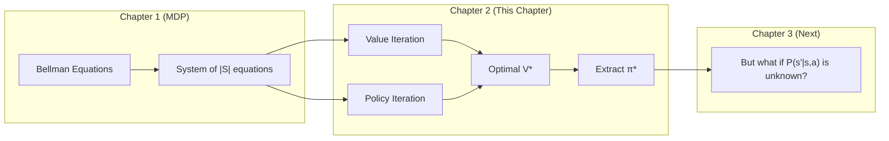
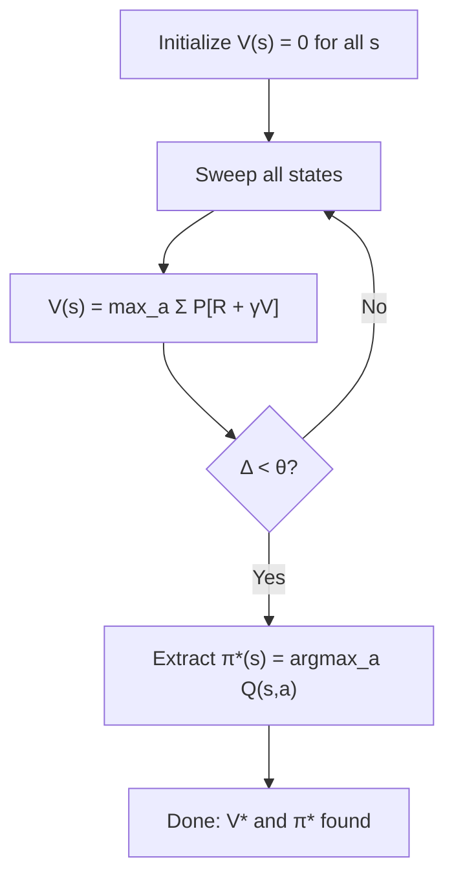
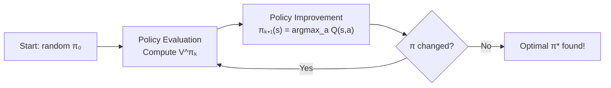
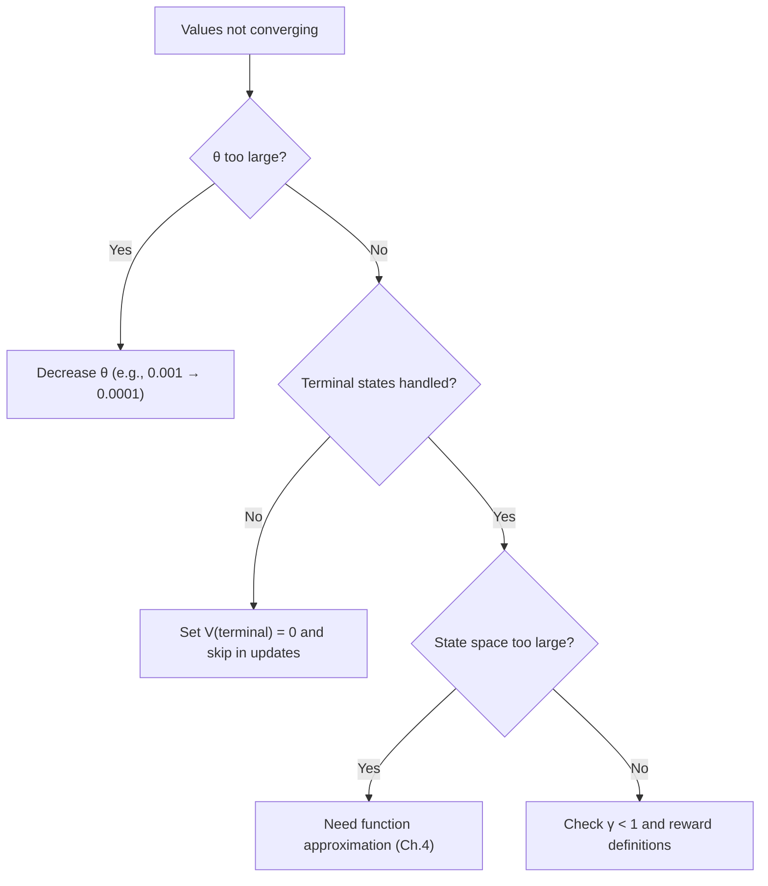

# Ch.2 — Dynamic Programming: Value Iteration & Policy Iteration


**Needle moved:** max Bellman error $\Delta$ falls from roughly $8.20$ at initialization to $0.04$ at convergence, making the optimal policy readable from the grid.

> **The story.** **Richard Bellman** didn't just define MDPs — he also gave us the first algorithms to *solve* them. In his 1957 book *Dynamic Programming*, Bellman showed that if you know the transition dynamics $P(s'|s,a)$, you can find the optimal policy by iteratively applying his eponymous equation until values converge. The name "dynamic programming" was deliberately vague — Bellman later admitted he chose it to hide the mathematical nature of his work from a Secretary of Defense who "had a pathological fear of the word 'research'." The algorithms in this chapter — value iteration and policy iteration — are the oldest RL algorithms still in use, and they remain the gold standard when a complete model of the environment is available.
>
> **Where you are in the curriculum.** Chapter 1 gave you the MDP framework and Bellman equations. Now you have the tools, but no algorithm. This chapter provides two algorithms that find the optimal policy $\pi^*$ — guaranteed to converge. The catch: both require knowing $P(s'|s,a)$, which limits them to "model-based" settings. Chapter 3 drops this requirement entirely.
>
> **Notation in this chapter.** $V_k(s)$ — value estimate at iteration $k$; $\pi_k$ — policy at iteration $k$; $\theta$ — convergence threshold; $\Delta$ — maximum value change across all states; $|S|$ — number of states; $|A|$ — number of actions.

---

## 0 · The Challenge — Where We Are

> 🎯 **AgentAI constraints**: 1. OPTIMALITY — 2. EFFICIENCY — 3. SCALABILITY — 4. STABILITY — 5. GENERALIZATION

**What we know so far:**
- ✅ MDP framework: states, actions, rewards, transitions, policies (Ch.1)
- ✅ Bellman equations: recursive value relationships
- ✅ Bellman optimality equation: $V^*(s) = \max_a \sum P(s'|s,a)[R + \gamma V^*(s')]$
- ❌ **But we have NO algorithm to find $V^*$ or $\pi^*$!**

**What's blocking us:**
The Bellman optimality equation is a system of $|S|$ non-linear equations (because of the $\max$ operator). We can't solve it in closed form. We need an **iterative** approach.

**What this chapter unlocks:**
Two algorithms that **guarantee** finding the optimal policy:
- **Value Iteration**: directly compute $V^*$, then extract $\pi^*$
- **Policy Iteration**: alternate between evaluating and improving a policy

In the animation for this chapter, the Bellman gap contracts $8.20 \rightarrow 3.60 \rightarrow 0.82 \rightarrow 0.04$ as synchronous sweeps propagate value backward from the goal.

Both converge to optimality. Both require knowing $P(s'|s,a)$.

| Constraint | Status after this chapter |
|-----------|-------------------------|
| #1 OPTIMALITY | ✅ **Achieved!** Both algorithms find $\pi^*$ |
| #2 EFFICIENCY | 🔶 Depends on $|S|$ — polynomial in state space size |
| #3 SCALABILITY | ❌ $O(|S|^2 |A|)$ per iteration — infeasible for large state spaces |
| #4 STABILITY | ✅ Guaranteed convergence (contraction mapping) |
| #5 GENERALIZATION | ❌ Solution is specific to the given MDP |



---

## 1 · Core Idea

**Dynamic programming** solves MDPs by breaking the problem into overlapping subproblems using the Bellman equation. Instead of solving $|S|$ coupled equations simultaneously, we iterate: start with arbitrary values, apply the Bellman update to every state, and repeat until values stop changing. The key insight is that the Bellman operator is a **contraction mapping** — each iteration brings values closer to the true optimum, and convergence is guaranteed when $\gamma < 1$.

Two flavors:
- **Value Iteration** works directly with the Bellman optimality equation — no explicit policy until the end.
- **Policy Iteration** maintains an explicit policy and alternates between *evaluating* it (computing $V^\pi$) and *improving* it (making it greedy w.r.t. $V^\pi$).

---

## 2 · Running Example — GridWorld with Known Dynamics

Same GridWorld from Ch.1, but now we explicitly use the known transition model:

```
┌──────┬──────┬──────┬──────┐
│ S(0) │  (1) │  (2) │  (3) │
├──────┼──────┼──────┼──────┤
│  (4) │ ██(5)│  (6) │  (7) │
├──────┼──────┼──────┼──────┤
│  (8) │  (9) │ (10) │ (11) │
├──────┼──────┼──────┼──────┤
│ (12) │ (13) │ (14) │ G(15)│
└──────┴──────┴──────┴──────┘

We KNOW: P(s'|s,a) for all (s,a) pairs
We KNOW: R(s,a,s') for all transitions
γ = 0.9, θ = 0.001 (convergence threshold)
```

Because transitions are deterministic (and known), $P(s'|s,a) = 1$ for exactly one $s'$, and the Bellman update simplifies to:

$$V_{k+1}(s) = \max_a \Big[R(s,a,s') + \gamma V_k(s')\Big]$$

---

## 3 · Math

### 3.1 Value Iteration

Repeatedly apply the **Bellman optimality operator** $T$:

$$V_{k+1}(s) = \max_{a \in A} \sum_{s' \in S} P(s'|s,a) \Big[R(s,a,s') + \gamma V_k(s')\Big]$$

**Convergence guarantee:** The operator $T$ is a $\gamma$-contraction in the max-norm:

$$\|TV - TV'\|_\infty \leq \gamma \|V - V'\|_\infty$$

By the **Banach fixed-point theorem**, $V_k \to V^*$ as $k \to \infty$.

**Numeric example** — Value iteration at state 14 (one step left of Goal):

Iteration 0: $V_0(s) = 0$ for all $s$.

Iteration 1 at state 14:
$$V_1(14) = \max\Big\{\underbrace{-1 + 0.9 \cdot V_0(10)}_{a=\uparrow}, \underbrace{-1 + 0.9 \cdot V_0(14)}_{a=\downarrow\text{(wall)}}, \underbrace{-1 + 0.9 \cdot V_0(13)}_{a=\leftarrow}, \underbrace{-1 + 0.9 \cdot V_0(15)}_{a=\rightarrow}\Big\}$$
$$= \max\{-1, -1, -1, -1 + 0.9 \cdot 0\} = -1$$

Wait — state 15 is terminal with reward +10 on arrival. So action Right from 14:
$$Q(14, \rightarrow) = +10 + 0.9 \cdot 0 = +10$$

Correcting: $V_1(14) = \max\{-1, -1, -1, +10\} = +10$

Iteration 2 at state 10:
$$V_2(10) = \max\{\ldots, \underbrace{-1 + 0.9 \cdot V_1(14)}_{a=\downarrow}, \ldots\} = \max\{\ldots, -1 + 0.9 \times 10, \ldots\} = 8.0$$

Values propagate backward from the goal like a wave.

### 3.2 Policy Iteration

Alternates two steps:

**Policy Evaluation** — compute $V^{\pi_k}$ for current policy $\pi_k$:

$$V^{\pi_k}(s) = \sum_{s'} P(s'|s, \pi_k(s)) \Big[R(s, \pi_k(s), s') + \gamma V^{\pi_k}(s')\Big]$$

This is a **linear** system of $|S|$ equations (no $\max$), solvable by iteration or matrix inversion.

**Policy Improvement** — make policy greedy w.r.t. $V^{\pi_k}$:

$$\pi_{k+1}(s) = \arg\max_a \sum_{s'} P(s'|s,a) \Big[R(s,a,s') + \gamma V^{\pi_k}(s')\Big]$$

**Policy Improvement Theorem:** If $\pi_{k+1} \neq \pi_k$, then $V^{\pi_{k+1}}(s) \geq V^{\pi_k}(s)$ for all $s$.

Since there are finitely many deterministic policies ($|A|^{|S|}$), and each improvement is strict, policy iteration terminates in a finite number of steps.

### 3.3 Comparison

| Aspect | Value Iteration | Policy Iteration |
|--------|----------------|-----------------|
| **Update rule** | $V_{k+1}(s) = \max_a [R + \gamma V_k]$ | Evaluate $V^{\pi_k}$, then improve $\pi$ |
| **Per iteration cost** | $O(|S|^2 |A|)$ — one sweep | $O(|S|^2 |A| + |S|^3)$ — evaluation is expensive |
| **Total iterations** | Many (linear convergence) | Few (quadratic convergence) |
| **Total runtime** | Often faster for large $|A|$ | Often faster for small $|A|$ |
| **When to use** | Large action spaces, approximate solutions OK | Small state/action spaces, exact solutions needed |

---

## 4 · Step by Step

### 4.1 Value Iteration Pseudocode

```
ALGORITHM: Value Iteration
──────────────────────────
Input:  MDP = (S, A, P, R, γ), threshold θ
Output: Optimal value function V*, optimal policy π*

1. Initialize V(s) = 0 for all s ∈ S
2. REPEAT:
   a. Δ = 0
   b. FOR each state s ∈ S:
      i.   v = V(s)                                    // save old value
      ii.  V(s) = max_a Σ P(s'|s,a) [R(s,a,s') + γ V(s')]  // Bellman update
      iii. Δ = max(Δ, |v - V(s)|)                      // track convergence
   c. UNTIL Δ < θ                                       // converged!
3. Extract policy:
   π*(s) = argmax_a Σ P(s'|s,a) [R(s,a,s') + γ V(s')]  // greedy w.r.t. V*
4. RETURN V*, π*
```

### 4.2 Policy Iteration Pseudocode

```
ALGORITHM: Policy Iteration
───────────────────────────
Input:  MDP = (S, A, P, R, γ), threshold θ
Output: Optimal policy π*

1. Initialize π(s) = random action for all s ∈ S
2. REPEAT:
   ── Policy Evaluation ──
   a. REPEAT:
      i.  Δ = 0
      ii. FOR each state s ∈ S:
          - v = V(s)
          - V(s) = Σ P(s'|s,π(s)) [R(s,π(s),s') + γ V(s')]  // evaluate current π
          - Δ = max(Δ, |v - V(s)|)
      iii. UNTIL Δ < θ
   
   ── Policy Improvement ──
   b. policy_stable = True
   c. FOR each state s ∈ S:
      i.   old_action = π(s)
      ii.  π(s) = argmax_a Σ P(s'|s,a) [R(s,a,s') + γ V(s')]  // greedy improvement
      iii. IF old_action ≠ π(s): policy_stable = False
   d. UNTIL policy_stable                               // no policy changed → optimal!
3. RETURN π*
```

---

## 5 · Key Diagrams

### 5.1 Value Iteration Convergence



### 5.2 Policy Iteration Cycle



### 5.3 Value Propagation Wave

```
Value Iteration Convergence on GridWorld (γ = 0.9):

Iteration 0:                    Iteration 1:
┌─────┬─────┬─────┬─────┐     ┌─────┬─────┬─────┬─────┐
│  0  │  0  │  0  │  0  │     │  0  │  0  │  0  │  0  │
├─────┼─────┼─────┼─────┤     ├─────┼─────┼─────┼─────┤
│  0  │ ██  │  0  │  0  │     │  0  │ ██  │  0  │  0  │
├─────┼─────┼─────┼─────┤     ├─────┼─────┼─────┼─────┤
│  0  │  0  │  0  │  0  │     │  0  │  0  │  0  │ 8.0 │
├─────┼─────┼─────┼─────┤     ├─────┼─────┼─────┼─────┤
│  0  │  0  │  0  │  0  │     │  0  │  0  │ 10  │  0  │ ← Goal adjacent
└─────┴─────┴─────┴─────┘     └─────┴─────┴─────┴─────┘

Iteration 3:                    Converged (~12 iterations):
┌─────┬─────┬─────┬─────┐     ┌─────┬─────┬─────┬─────┐
│  0  │  0  │  0  │ 4.7 │     │ 4.1 │ 5.3 │ 6.6 │ 7.4 │
├─────┼─────┼─────┼─────┤     ├─────┼─────┼─────┼─────┤
│  0  │ ██  │ 5.8 │ 6.4 │     │ 3.0 │ ██  │ 7.4 │ 8.2 │
├─────┼─────┼─────┼─────┤     ├─────┼─────┼─────┼─────┤
│  0  │ 4.7 │ 6.4 │ 8.0 │     │ 3.9 │ 5.3 │ 8.2 │ 9.0 │
├─────┼─────┼─────┼─────┤     ├─────┼─────┼─────┼─────┤
│  0  │ 5.8 │ 8.0 │ 10  │     │ 3.0 │ 5.9 │ 9.0 │ 10  │
└─────┴─────┴─────┴─────┘     └─────┴─────┴─────┴─────┘

Values propagate backward from the Goal like a wave.
```

---

## 6 · Hyperparameter Dial

| Hyperparameter | Too Low | Sweet Spot | Too High |
|---------------|---------|------------|----------|
| $\gamma$ (discount) | $< 0.5$: agent ignores distant rewards, may not reach goal | $0.9 – 0.99$: balances near and far rewards | $\to 1.0$: slow convergence, may diverge without terminal |
| $\theta$ (convergence threshold) | $< 10^{-10}$: wastes iterations on insignificant precision | $10^{-4} – 10^{-3}$: good precision/speed balance | $> 1.0$: terminates too early, suboptimal policy |
| Iteration limit | $< 10$: values haven't propagated across the grid | $50 – 500$: sufficient for most MDPs | $> 10{,}000$: diminishing returns if $\theta$ is reasonable |

---

## 7 · Code Skeleton

```
# ── Value Iteration ───────────────────────────────────────
def value_iteration(mdp, theta=0.001):
    V = {s: 0.0 for s in mdp.states}
    
    while True:
        delta = 0
        for s in mdp.states:
            if s == mdp.goal: continue        # terminal state
            v_old = V[s]
            # Bellman optimality update
            V[s] = max(
                sum(P(s_next | s, a) * (R(s,a,s_next) + gamma * V[s_next])
                    for s_next in mdp.states)
                for a in mdp.actions
            )
            delta = max(delta, abs(v_old - V[s]))
        if delta < theta:
            break
    
    # Extract policy
    pi = {}
    for s in mdp.states:
        pi[s] = argmax(a, Q(s, a, V))        # greedy w.r.t. V*
    return V, pi


# ── Policy Iteration ─────────────────────────────────────
def policy_iteration(mdp, theta=0.001):
    pi = {s: random_action() for s in mdp.states}
    V = {s: 0.0 for s in mdp.states}
    
    while True:
        # ── Policy Evaluation ──
        while True:
            delta = 0
            for s in mdp.states:
                if s == mdp.goal: continue
                v_old = V[s]
                a = pi[s]
                V[s] = sum(P(s_next | s, a) * (R(s,a,s_next) + gamma * V[s_next])
                           for s_next in mdp.states)
                delta = max(delta, abs(v_old - V[s]))
            if delta < theta:
                break
        
        # ── Policy Improvement ──
        stable = True
        for s in mdp.states:
            old_a = pi[s]
            pi[s] = argmax(a, Q(s, a, V))
            if old_a != pi[s]:
                stable = False
        
        if stable:
            break                             # optimal policy found
    
    return V, pi
```

---

## 8 · What Can Go Wrong

| Mistake | Symptom | Fix |
|---------|---------|-----|
| **Forgetting to skip terminal states** | Terminal state value gets overwritten, corrupts all upstream values | Always check `if s is terminal: continue` in update loop |
| **Updating V in-place without care** | Value iteration still converges (async DP), but convergence order changes | Use in-place updates (faster in practice) or synchronized updates (matches theory) |
| **$\theta$ too large** | Algorithm stops early, policy is suboptimal | Start with $\theta = 0.001$ and decrease if policy quality is poor |
| **Applying DP to unknown environments** | Can't compute $\sum P(s'|s,a)[\ldots]$ without $P$ | You need model-free methods → Ch.3 |
| **Large state spaces** | $O(|S|^2 |A|)$ per iteration is too slow | Use function approximation (Ch.4) or sample-based methods (Ch.3) |




---

## 9 · Where This Reappears

Iterative policy evaluation and the value-function sweep underpin theoretical results across the track:

- **Ch.3–Ch.4**: convergence guarantees for Q-learning and DQN cite the contraction-mapping property introduced here.
- **Ch.5 Policy Gradients**: the actor-critic's critic is initialized by running a policy-evaluation sweep analogous to DP.
- **AI / Agentic AI**: BFS/DFS planning in tool-calling agents is a discrete, deterministic special case of DP on a state graph.

## 10 · Progress Check

After this chapter you should be able to:

| Concept | Check |
|---------|-------|
| Write value iteration from scratch | Given an MDP, can you run 3 iterations by hand? |
| Write policy iteration from scratch | Can you describe the evaluate → improve loop? |
| Explain why convergence is guaranteed | What is a contraction mapping? |
| Compare value iteration vs policy iteration | When is each faster? |
| Identify when DP is applicable vs not | What does "known model" mean? |
| Trace value propagation on GridWorld | Can you show how values spread from the goal? |

---

## 11 · Bridge to Next Chapter

Dynamic programming solves MDPs optimally — but only when we know $P(s'|s,a)$. In the real world, we rarely have this luxury:

- A robot doesn't know the physics equations of its joints perfectly
- A game AI doesn't know the opponent's strategy
- A recommendation system doesn't know how users will react

**Chapter 3** introduces **model-free** methods — Q-learning and SARSA — that learn optimal policies from experience alone. The agent doesn't need $P(s'|s,a)$; it just needs to interact with the environment and observe what happens. This is the transition from "planning" to "learning."

> *"Dynamic programming is the architect's blueprint. Q-learning is the builder who learns by doing."*
