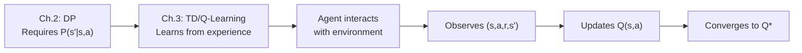
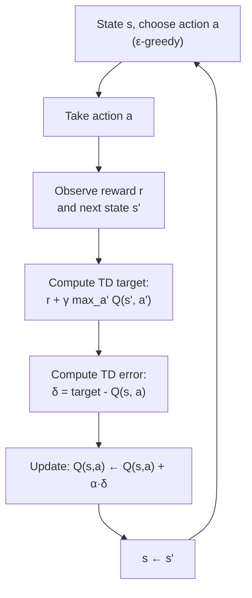
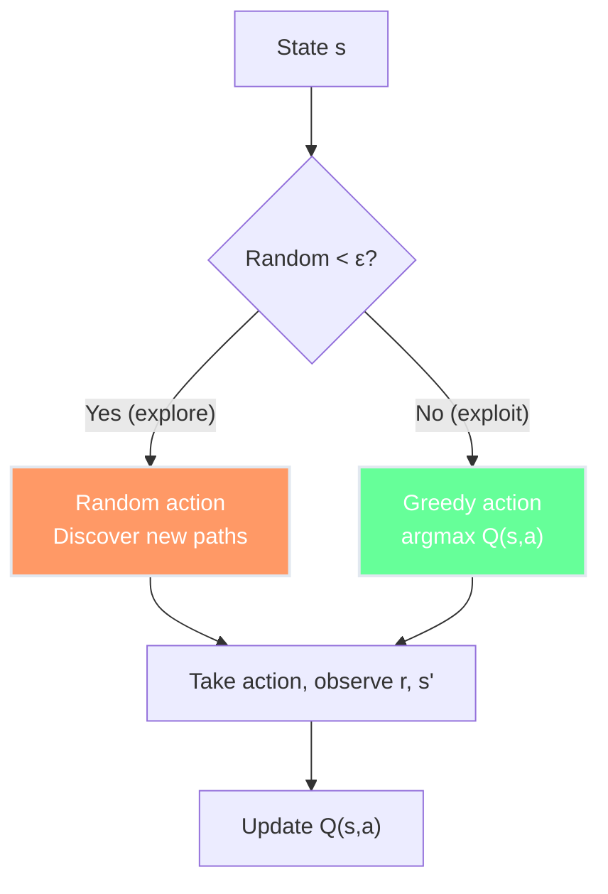
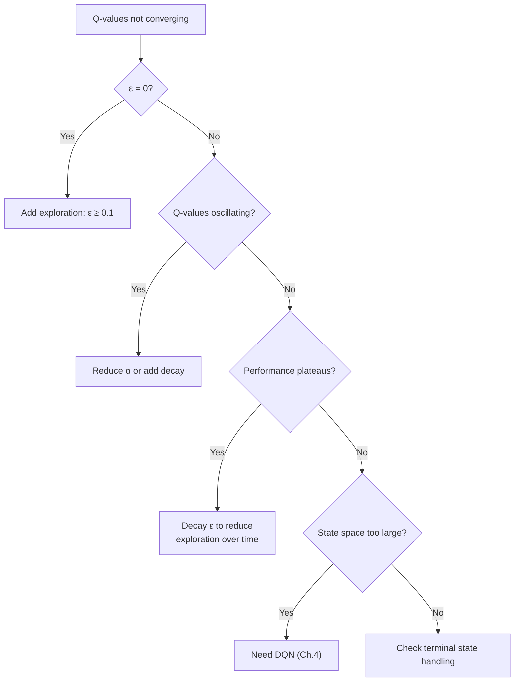

# Ch.3 — Q-Learning & Temporal Difference Learning


**Needle moved:** average episode return rises from roughly $12$ under near-random play to about $84$ once the Q-table has converged enough for a mostly greedy policy.

> **The story.** In **1989**, **Chris Watkins** published his PhD thesis at Cambridge introducing **Q-learning** — an algorithm that learns optimal behavior without needing a model of the environment. But the foundations were laid a year earlier: **Richard Sutton** proposed **Temporal Difference (TD) learning** in 1988, showing that an agent could update its value estimates *after every single step* rather than waiting for an entire episode to finish. Sutton's key insight was to bootstrap — use the current estimate of the next state's value as a stand-in for the true future return. Watkins extended this to action-values, creating Q-learning: the first practical model-free control algorithm. When Gerald Tesauro used TD learning to build **TD-Gammon** (1992), a backgammon program that reached expert level through self-play, the world noticed: agents could learn from experience alone.
>
> **Where you are in the curriculum.** Chapter 2 gave you optimal algorithms that require knowing $P(s'|s,a)$. This chapter drops that requirement entirely. The agent interacts with the environment, observes transitions, and learns from them. No model needed. This is the leap from "planning with a map" to "exploring without one" — and it's the foundation of all modern RL.
>
> **Notation in this chapter.** $Q(s,a)$ — action-value table; $\alpha$ — learning rate; $\epsilon$ — exploration rate; $r$ — observed reward; $s'$ — observed next state; $\delta$ — TD error; SARSA — State-Action-Reward-State-Action.

---

## 0 · The Challenge — Where We Are

> 🎯 **AgentAI constraints**: 1. OPTIMALITY — 2. EFFICIENCY — 3. SCALABILITY — 4. STABILITY — 5. GENERALIZATION

**What we know so far:**
- ✅ MDP framework (Ch.1): states, actions, rewards, policies, Bellman equations
- ✅ Dynamic programming (Ch.2): value iteration and policy iteration find $\pi^*$
- ❌ **But DP requires knowing $P(s'|s,a)$ — unavailable in most real environments!**

**What's blocking us:**
A robot learning to walk doesn't have perfect physics equations. A game agent doesn't know the opponent's next move. A recommender system doesn't know how users will react. We need algorithms that learn from **experience** — observed transitions $(s, a, r, s')$ — not from a mathematical model.

**What this chapter unlocks:**
- **Temporal Difference (TD) learning**: update values after each step (no need to wait for episode end)
- **Q-learning**: learn the optimal Q-function directly, off-policy
- **SARSA**: learn Q-values on-policy (follow the policy you're improving)
- **ε-greedy exploration**: balance trying new things vs exploiting known good actions

| Constraint | Status after this chapter |
|-----------|-------------------------|
| #1 OPTIMALITY | ✅ Q-learning converges to $Q^*$ (with conditions) |
| #2 EFFICIENCY | 🔶 Needs many episodes, but learns online |
| #3 SCALABILITY | ❌ Q-table is $|S| \times |A|$ — fails for large state spaces |
| #4 STABILITY | 🔶 Converges under decaying $\alpha$, but sensitive to hyperparameters |
| #5 GENERALIZATION | ❌ Tabular — no generalization between similar states |



---

## 1 · Core Idea

**Temporal Difference learning** updates value estimates using a combination of observed reward and the current estimate of the next state's value — a process called **bootstrapping**. Instead of waiting for a complete trajectory (Monte Carlo) or requiring a model (DP), TD methods learn from each individual transition. **Q-learning** extends this to action-values: after observing $(s, a, r, s')$, it updates $Q(s,a)$ toward $r + \gamma \max_{a'} Q(s', a')$ — using the best possible next action regardless of what action the agent actually takes. This makes Q-learning **off-policy**: it learns about the optimal policy while following an exploratory one.

---

## 2 · Running Example — GridWorld Q-Table

The agent explores GridWorld without knowing $P(s'|s,a)$. It maintains a **Q-table**: a lookup table with one entry for each (state, action) pair.

```
Q-Table: 16 states × 4 actions = 64 entries

         ↑      ↓      ←      →
s=0  [  0.0,   0.0,   0.0,   0.0 ]  ← all zeros initially
s=1  [  0.0,   0.0,   0.0,   0.0 ]
...
s=14 [  0.0,   0.0,   0.0,   0.0 ]
s=15 [  ---    ---    ---    --- ]  ← terminal (no actions)
```

After training, the Q-table tells the agent: "In state $s$, the best action is $\arg\max_a Q(s,a)$."

---

## 3 · Math

### 3.1 The TD Error

The core of TD learning is the **TD error** $\delta$: the difference between the observed target and the current estimate.

$$\delta_t = \underbrace{r_{t+1} + \gamma V(s_{t+1})}_{\text{TD target (better estimate)}} - \underbrace{V(s_t)}_{\text{current estimate}}$$

If $\delta > 0$: the outcome was better than expected → increase $V(s_t)$.
If $\delta < 0$: the outcome was worse than expected → decrease $V(s_t)$.

**TD(0) update rule for state values:**

$$V(s_t) \leftarrow V(s_t) + \alpha \cdot \delta_t = V(s_t) + \alpha \Big[r_{t+1} + \gamma V(s_{t+1}) - V(s_t)\Big]$$

### 3.2 Q-Learning (Off-Policy)

Q-learning updates action-values using the **maximum** Q-value of the next state — regardless of which action the agent actually takes next:

$$Q(s_t, a_t) \leftarrow Q(s_t, a_t) + \alpha \Big[\underbrace{r_{t+1} + \gamma \max_{a'} Q(s_{t+1}, a')}_{TD\ target} - Q(s_t, a_t)\Big]$$

**Key property:** The update uses $\max_{a'} Q(s', a')$ — the best possible action — not the action the agent actually takes. This is **off-policy** learning: the agent can follow an exploratory policy (ε-greedy) while learning about the optimal policy.

**Numeric example** — Agent is in state 10, takes action Right, arrives at state 11 with reward −1:

Given: $Q(10, \rightarrow) = 2.0$, $\alpha = 0.1$, $\gamma = 0.9$, $r = -1$

Q-values at state 11: $Q(11, \uparrow) = 1.5$, $Q(11, \downarrow) = 8.0$, $Q(11, \leftarrow) = 1.0$, $Q(11, \rightarrow) = 0.5$

$$\max_{a'} Q(11, a') = 8.0 \quad \text{(action Down)}$$

$$Q(10, \rightarrow) \leftarrow 2.0 + 0.1 \Big[-1 + 0.9 \times 8.0 - 2.0\Big] = 2.0 + 0.1 \times [6.2 - 2.0] = 2.0 + 0.42 = 2.42$$

### 3.3 SARSA (On-Policy)

SARSA uses the action the agent **actually takes** next (not the max):

$$Q(s_t, a_t) \leftarrow Q(s_t, a_t) + \alpha \Big[r_{t+1} + \gamma Q(s_{t+1}, \underbrace{a_{t+1}}_{\text{actual next action}}) - Q(s_t, a_t)\Big]$$

The name comes from the quintuple used: $(S_t, A_t, R_{t+1}, S_{t+1}, A_{t+1})$.

**Same example, but SARSA:** If the agent actually takes action Up next (not the max):

$$Q(10, \rightarrow) \leftarrow 2.0 + 0.1\Big[-1 + 0.9 \times 1.5 - 2.0\Big] = 2.0 + 0.1 \times [-1.65] = 1.835$$

SARSA is more **conservative** — it accounts for the fact that the agent sometimes explores (takes suboptimal actions).

### 3.4 Q-Learning vs SARSA

| Aspect | Q-Learning | SARSA |
|--------|-----------|-------|
| **Policy type** | Off-policy | On-policy |
| **Update target** | $r + \gamma \max_{a'} Q(s', a')$ | $r + \gamma Q(s', a_{t+1})$ |
| **Learns about** | Optimal policy $\pi^*$ | Current (exploratory) policy |
| **Risk sensitivity** | Aggressive — ignores exploration risk | Conservative — accounts for exploration |
| **Cliff example** | Walks along cliff edge (optimal but risky) | Takes safer path (suboptimal but avoids falls) |
| **Convergence** | To $Q^*$ (with decaying $\alpha$ and infinite visits) | To $Q^{\pi_\epsilon}$ (optimal under $\epsilon$-greedy) |

### 3.5 ε-Greedy Exploration

The fundamental dilemma: **explore** (try new actions to discover better strategies) vs **exploit** (take the best known action).

$$\pi_\epsilon(a|s) = \begin{cases} 1 - \epsilon + \frac{\epsilon}{|A|} & \text{if } a = \arg\max_{a'} Q(s,a') \\[6pt] \frac{\epsilon}{|A|} & \text{otherwise} \end{cases}$$

With $\epsilon = 0.1$ and 4 actions:
- Best action gets probability: $1 - 0.1 + 0.1/4 = 0.925$
- Each other action gets: $0.1/4 = 0.025$

**Decay schedule:** Start with high $\epsilon$ (explore), decay over episodes:

$$\epsilon_k = \max(\epsilon_{\min},\ \epsilon_0 \cdot \text{decay}^k)$$

---

## 4 · Step by Step

### 4.1 Q-Learning Pseudocode

```
ALGORITHM: Q-Learning (Off-Policy TD Control)
──────────────────────────────────────────────
Input:  Environment env, α (learning rate), γ (discount),
        ε (exploration rate), num_episodes
Output: Optimal Q-table

1. Initialize Q(s, a) = 0 for all (s, a)
2. FOR episode = 1 to num_episodes:
   a. s = env.reset()                         // start state
   b. WHILE s is not terminal:
      i.   Choose a from s using ε-greedy:     // EXPLORE or EXPLOIT
           - With prob ε: a = random action
           - With prob 1-ε: a = argmax_a' Q(s, a')
      ii.  Take action a, observe r, s'        // interact with environment
      iii. Q(s, a) ← Q(s, a) + α[r + γ max_a' Q(s', a') - Q(s, a)]  // UPDATE
      iv.  s ← s'                              // move to next state
   c. (Optionally) decay ε
3. RETURN Q
```

### 4.2 SARSA Pseudocode

```
ALGORITHM: SARSA (On-Policy TD Control)
───────────────────────────────────────
Input:  Environment env, α, γ, ε, num_episodes
Output: Q-table for ε-greedy policy

1. Initialize Q(s, a) = 0 for all (s, a)
2. FOR episode = 1 to num_episodes:
   a. s = env.reset()
   b. a = ε-greedy(Q, s, ε)                   // choose FIRST action
   c. WHILE s is not terminal:
      i.   Take action a, observe r, s'
      ii.  a' = ε-greedy(Q, s', ε)             // choose NEXT action
      iii. Q(s, a) ← Q(s, a) + α[r + γ Q(s', a') - Q(s, a)]  // UPDATE with ACTUAL a'
      iv.  s ← s',  a ← a'                    // move forward
   d. (Optionally) decay ε
3. RETURN Q
```

**Key difference:** SARSA chooses $a'$ *before* the update (line ii), then uses it in the update (line iii). Q-learning uses $\max$ regardless of the actual next action.

---

## 5 · Key Diagrams

### 5.1 Q-Learning Update Flow



### 5.2 Exploration vs Exploitation



### 5.3 Q-Table Convergence (GridWorld)

```
After 100 episodes (ε=0.3, α=0.1, γ=0.9):
Best action per state (argmax Q(s,a)):
┌──────┬──────┬──────┬──────┐
│  →   │  →   │  ↓   │  ↓   │
├──────┼──────┼──────┼──────┤
│  ↓   │  ██  │  ↓   │  ↓   │
├──────┼──────┼──────┼──────┤
│  →   │  →   │  →   │  ↓   │
├──────┼──────┼──────┼──────┤
│  →   │  →   │  →   │  ★   │
└──────┴──────┴──────┴──────┘

After 10,000 episodes:
Max Q-value per state (max_a Q(s,a)):
┌──────┬──────┬──────┬──────┐
│ 4.10 │ 5.31 │ 6.56 │ 7.37 │
├──────┼──────┼──────┼──────┤
│ 2.95 │  ██  │ 7.37 │ 8.19 │
├──────┼──────┼──────┼──────┤
│ 3.86 │ 5.31 │ 8.19 │ 9.00 │
├──────┼──────┼──────┼──────┤
│ 2.95 │ 5.90 │ 9.00 │ 10.0 │
└──────┴──────┴──────┴──────┘
Matches V* from value iteration (Ch.2)!
```

### 5.4 On-Policy vs Off-Policy: The Cliff Walk

```
Classic "Cliff Walking" environment:

┌───┬───┬───┬───┬───┬───┬───┬───┬───┬───┬───┬───┐
│   │   │   │   │   │   │   │   │   │   │   │   │
├───┼───┼───┼───┼───┼───┼───┼───┼───┼───┼───┼───┤
│   │   │   │   │   │   │   │   │   │   │   │   │
├───┼───┼───┼───┼───┼───┼───┼───┼───┼───┼───┼───┤
│   │   │   │   │   │   │   │   │   │   │   │   │
├───┼───┼───┼───┼───┼───┼───┼───┼───┼───┼───┼───┤
│ S │☠☠☠│☠☠☠│☠☠☠│☠☠☠│☠☠☠│☠☠☠│☠☠☠│☠☠☠│☠☠☠│☠☠☠│ G │
└───┴───┴───┴───┴───┴───┴───┴───┴───┴───┴───┴───┘
☠ = Cliff (reward = -100, reset to S)

Q-Learning path (optimal but risky):
  →→→→→→→→→→→→  (right along cliff edge)

SARSA path (safe):
  →→→→→→→→→→→→  (goes up first, avoids cliff)
       ↑                    ↓
  S →→→                →→→→ G
```

Q-learning finds the shortest path (along the cliff) because it evaluates the greedy policy. SARSA takes a safer route because it accounts for the ε-probability of falling off the cliff.

---

## 6 · Hyperparameter Dial

| Hyperparameter | Too Low | Sweet Spot | Too High |
|---------------|---------|------------|----------|
| $\alpha$ (learning rate) | $< 0.001$: learns too slowly, needs millions of episodes | $0.01 – 0.1$: steady convergence | $> 0.5$: oscillates, never converges, values overshoot |
| $\epsilon$ (exploration) | $< 0.01$: gets stuck in suboptimal policy, never discovers better paths | $0.1 – 0.3$ (decaying): good explore/exploit balance | $> 0.5$: too random, converges slowly, wastes episodes exploring bad actions |
| $\gamma$ (discount) | $< 0.5$: myopic, only sees immediate reward | $0.9 – 0.99$: values long-term reward | $= 1.0$: returns can diverge in continuing tasks |
| Episodes | $< 100$: Q-table barely populated, many (s,a) pairs never visited | $1{,}000 – 50{,}000$: most (s,a) pairs visited enough for convergence | $> 1{,}000{,}000$: diminishing returns for tabular GridWorld |

---

## 7 · Code Skeleton

```
# ── Q-Learning Agent ──────────────────────────────────────
class QLearningAgent:
    def __init__(self, n_states, n_actions, alpha=0.1, gamma=0.9, epsilon=0.1):
        self.Q = zeros(n_states, n_actions)   # Q-table: |S| × |A|
        self.alpha = alpha
        self.gamma = gamma
        self.epsilon = epsilon

    def choose_action(self, state):
        if random() < self.epsilon:
            return random_action()            # explore
        else:
            return argmax(self.Q[state])       # exploit

    def update(self, s, a, r, s_next, done):
        if done:
            target = r                         # terminal: no future reward
        else:
            target = r + self.gamma * max(self.Q[s_next])  # TD target
        
        td_error = target - self.Q[s, a]
        self.Q[s, a] += self.alpha * td_error  # Q-update

# ── Training Loop ─────────────────────────────────────────
agent = QLearningAgent(n_states=16, n_actions=4)
for episode in range(10000):
    s = env.reset()
    while not done:
        a = agent.choose_action(s)
        s_next, r, done = env.step(s, a)
        agent.update(s, a, r, s_next, done)
        s = s_next
    agent.epsilon *= 0.999                     # decay exploration

# Extract optimal policy
policy = {s: argmax(agent.Q[s]) for s in range(16)}
```

---

## 8 · What Can Go Wrong

| Mistake | Symptom | Fix |
|---------|---------|-----|
| **No exploration ($\epsilon = 0$)** | Agent converges to first decent policy, misses optimal | Start with $\epsilon \geq 0.1$, decay slowly |
| **$\alpha$ too high** | Q-values oscillate wildly, never converge | Reduce $\alpha$ or use decaying schedule: $\alpha_k = \alpha_0 / (1 + k)$ |
| **Not decaying $\epsilon$** | Agent keeps exploring even after finding optimal policy, performance plateaus | Decay $\epsilon$: $\epsilon_k = \max(0.01, \epsilon_0 \cdot 0.999^k)$ |
| **Q-table for large state spaces** | Memory explosion: Atari has $10^9$ states × actions | Use function approximation → Ch.4 (DQN) |
| **Confusing Q-learning and SARSA** | Using $\max$ when you meant on-policy (or vice versa) | Q-learning: $\max_{a'}$. SARSA: actual $a'$. Check your update rule |
| **Not handling terminal states** | TD target includes $\gamma \max Q(s', a')$ for terminal $s'$ | Set target = $r$ when done (no future value) |




---

## 9 · Where This Reappears

TD updates and the Q-function are the foundation of all value-based RL in the track:

- **Ch.4 DQN**: replaces the lookup table with a neural network but uses the identical Bellman target — 
 + γ max Q(s', a'; θ⁻).
- **Ch.5 Actor-Critic**: the critic is a learned V(s) or Q(s,a) updated by TD(0), exactly §3.1 here.
- **Recommender Systems (Topic 4) Ch.6**: ε-greedy exploration for cold start is a direct application of the exploration policy in §3.5.

## 10 · Progress Check

After this chapter you should be able to:

| Concept | Check |
|---------|-------|
| Write the Q-learning update rule | From memory: $Q(s,a) \leftarrow Q(s,a) + \alpha[\ldots]$ |
| Explain the difference between Q-learning and SARSA | Which uses $\max$? Which is on/off-policy? |
| Implement ε-greedy exploration | Can you compute the probabilities for 4 actions with $\epsilon = 0.2$? |
| Compute a Q-learning update by hand | Given $Q(s,a)$, $\alpha$, $\gamma$, $r$, and $Q(s', \cdot)$? |
| Explain why Q-learning is off-policy | What does "off-policy" mean in concrete terms? |
| Identify the Q-table scalability limitation | Why does this fail for Atari/CartPole? |

---

## 11 · Bridge to Next Chapter

Q-learning works beautifully for GridWorld (16 states). But what about CartPole, which has a **continuous** state space $(x, \dot{x}, \theta, \dot{\theta})$? Or Atari, with $210 \times 160 \times 3$ pixel observations?

A Q-table with entries for every possible state is **impossible** for continuous or high-dimensional spaces. We need a way to generalize: similar states should have similar Q-values, even if the agent has never visited them before.

**Chapter 4** introduces **Deep Q-Networks (DQN)**: replace the Q-table with a neural network $Q(s, a; \theta)$ that takes a state as input and outputs Q-values for all actions. This is the breakthrough that let DeepMind's agent play Atari games at superhuman level in 2015.

> *"Q-tables are phone books. Neural networks are search engines. Both answer 'what's the value of this state?' — but only one scales."*
