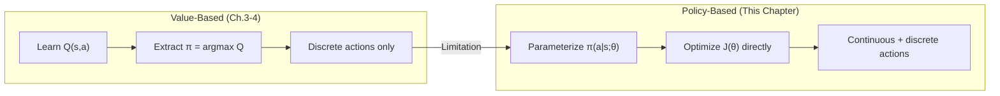
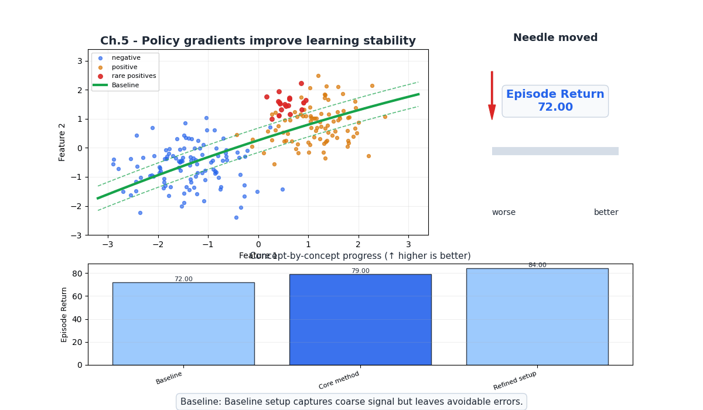
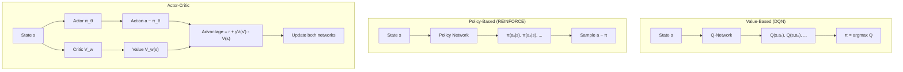
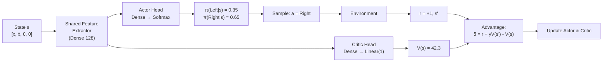
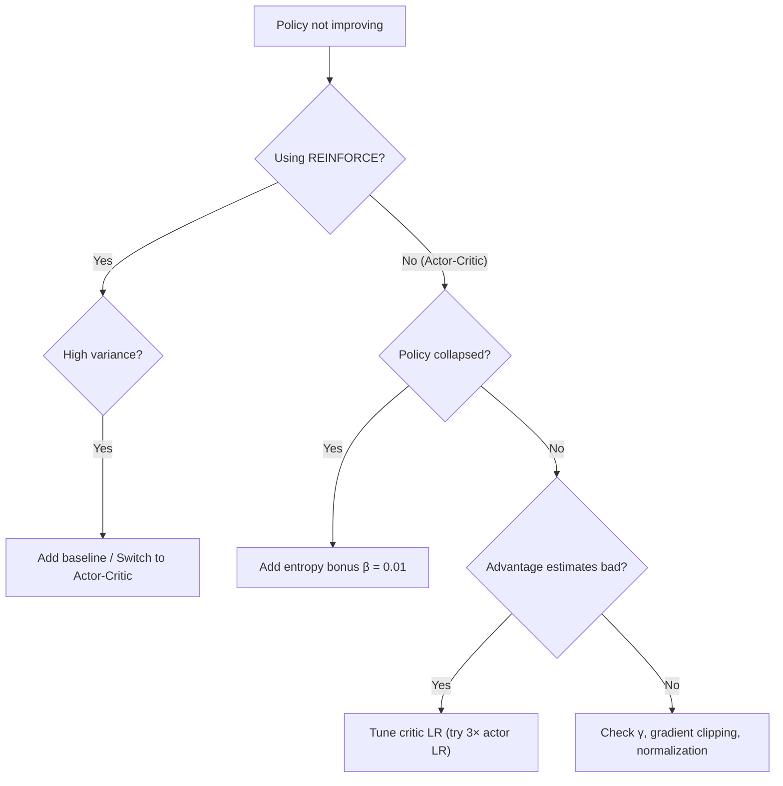

# Ch.5 — Policy Gradients: REINFORCE & Actor-Critic

> **The story.** In **1992**, **Ronald Williams** published the **REINFORCE** algorithm — the first practical method for training a parameterized policy using gradient ascent. The idea was deceptively simple: increase the probability of actions that led to high returns, decrease those that led to low returns. But REINFORCE suffered from devastating variance — the gradient estimates were so noisy that convergence was agonizingly slow. The breakthrough came when researchers combined policy gradients with value function estimation, creating the **Actor-Critic** architecture: one network (the "actor") chooses actions, while another (the "critic") evaluates how good those actions were. This variance reduction trick, formalized through the **advantage function** $A(s,a) = Q(s,a) - V(s)$, became the foundation for every modern RL algorithm — PPO, A3C, and SAC all descend from actor-critic.
>
> **Where you are in the curriculum.** Chapter 4 gave you DQN for discrete actions in large state spaces. But DQN fundamentally relies on $\arg\max_a Q(s,a)$ — you enumerate all actions and pick the best. When actions are continuous (robot joint angles, steering wheel rotation), enumeration is impossible. This chapter teaches you to parameterize the policy itself and optimize it directly, unlocking continuous action spaces and stochastic policies.
>
> **Notation in this chapter.** $\pi_\theta(a|s)$ — parameterized policy; $J(\theta)$ — expected return (objective); $\nabla_\theta J$ — policy gradient; $G_t$ — return from time $t$; $V(s; w)$ — critic (value network); $A(s,a)$ — advantage function; $b(s)$ — baseline.

---

## 0 · The Challenge — Where We Are

> 💡 **AgentAI constraints**: 1. OPTIMALITY — 2. EFFICIENCY — 3. SCALABILITY — 4. STABILITY — 5. GENERALIZATION

**What we know so far:**
- ⚡ Q-learning and DQN learn optimal policies for discrete action spaces (Ch.3–4)
- ⚡ Experience replay and target networks stabilize deep Q-learning
- **DQN requires discrete actions — fails for continuous control (robotics, driving)!**
- **DQN learns a deterministic policy — can't express stochastic strategies!**

**What's blocking us:**
A robotic arm has 7 continuous joint angles. A self-driving car outputs continuous steering and throttle values. DQN would need to discretize these into bins — but $100^7 = 10^{14}$ bins for the robot. Even the $\arg\max$ over actions becomes intractable for high-dimensional continuous spaces.

**What this chapter unlocks:**
- **Policy gradient theorem**: a principled way to compute $\nabla_\theta J(\theta)$
- **REINFORCE**: Monte Carlo policy gradient (simple but high variance)
- **Actor-Critic**: combine policy network (actor) with value network (critic) for lower variance
- **Advantage function**: $A(s,a) = Q(s,a) - V(s)$ — measures how much better an action is compared to average

| Constraint | Status after this chapter |
|-----------|-------------------------|
| #1 OPTIMALITY | ✅ Converges to locally optimal policy |
| #2 EFFICIENCY | ⚠️ REINFORCE is sample-inefficient; actor-critic improves |
| #3 SCALABILITY | ✅ Handles continuous actions and large state spaces |
| #4 STABILITY | ⚠️ High variance (REINFORCE); actor-critic helps |
| #5 GENERALIZATION | ⚠️ Neural network generalizes across states |



---

## Animation



## 1 · Core Idea

Instead of learning a value function and extracting a policy (value-based), **policy gradient methods** directly parameterize the policy $\pi_\theta(a|s)$ and optimize it to maximize expected return. The policy gradient theorem provides a formula for $\nabla_\theta J(\theta)$ that can be estimated from sampled trajectories: increase the probability of actions that yield high returns, decrease those that yield low returns. The gradient has the elegant form $\nabla_\theta J = \mathbb{E}[\nabla_\theta \log \pi_\theta(a|s) \cdot \text{signal}]$, where "signal" measures how good the action was. REINFORCE uses the full return $G_t$; actor-critic uses the advantage $A(s,a)$.

---

## 2 · Running Example — CartPole with Policy Network

Instead of Q-values, we output **action probabilities** directly:

```
Policy Network:
  State [x, ẋ, θ, θ̇] → Dense(128, ReLU) → Dense(128, ReLU) → Dense(2) → Softmax

  Input:  s = [0.02, 0.15, -0.03, -0.2]
  Output: π(Left|s) = 0.35, π(Right|s) = 0.65

  Sample action: a ~ Categorical([0.35, 0.65]) → Right
```

For continuous actions (e.g., torque $\in [-2, 2]$):
```
  Output: μ = 0.8, σ = 0.3
  Sample action: a ~ Normal(0.8, 0.3) → 0.72
```

The network outputs distribution parameters, and actions are sampled. This enables:
- **Stochastic policies** (built-in exploration)
- **Continuous actions** (output mean and variance of Gaussian)

---

## 3 · Math

### 3.1 The Objective

We want to maximize expected return under policy $\pi_\theta$:

$$J(\theta) = \mathbb{E}_{\tau \sim \pi_\theta}\left[\sum_{t=0}^{T} \gamma^t r_t\right] = \mathbb{E}_{\tau \sim \pi_\theta}[G_0]$$

where $\tau = (s_0, a_0, r_1, s_1, a_1, r_2, \ldots)$ is a trajectory sampled under $\pi_\theta$.

### 3.2 The Policy Gradient Theorem

The key result (Sutton et al., 1999):

$$\nabla_\theta J(\theta) = \mathbb{E}_{\pi_\theta}\Big[\nabla_\theta \log \pi_\theta(a_t | s_t) \cdot Q^{\pi_\theta}(s_t, a_t)\Big]$$

**Intuition:** $\nabla_\theta \log \pi_\theta(a|s)$ points in the direction that increases the probability of action $a$ in state $s$. Multiplying by $Q^{\pi_\theta}(s,a)$ scales this: high-value actions get a big push, low-value actions get a small push (or negative push).

**Why $\log \pi$ and not $\pi$?** The log-derivative trick:

$$\nabla_\theta \log \pi_\theta = \frac{\nabla_\theta \pi_\theta}{\pi_\theta}$$

This normalizes the gradient by the current probability — rare actions get proportionally larger updates.

### 3.3 REINFORCE Algorithm

Replace $Q^{\pi}(s_t, a_t)$ with the sampled return $G_t$:

$$\nabla_\theta J(\theta) \approx \frac{1}{N} \sum_{i=1}^{N} \sum_{t=0}^{T} \nabla_\theta \log \pi_\theta(a_t^{(i)} | s_t^{(i)}) \cdot G_t^{(i)}$$

where $G_t = \sum_{k=0}^{T-t} \gamma^k r_{t+k+1}$ is the return from time $t$.

**Toy policy-gradient update (3-state, one episode):**

Episode: s0→a1 (r=−1) → s1→a0 (r=+5) → s2 (terminal).  
Returns: G0 = −1 + 0.9×5 = 3.5, G1 = 5, G2 = 0.

| Step | State | Action | Return G | log π(a\|s) gradient direction |
|------|-------|--------|----------|-------------------------------|
| 0 | s0 | a1 | 3.5 | push up π(a1\|s0) |
| 1 | s1 | a0 | 5.0 | push up π(a0\|s1) strongly |

Positive returns reinforce the taken actions; a negative baseline (−2) would only reinforce actions better than chance.

**Numeric example** — CartPole episode:

Trajectory: $(s_0, \text{Right}, +1), (s_1, \text{Left}, +1), (s_2, \text{Right}, +1)$, done after 3 steps.

$G_0 = 1 + 0.99(1) + 0.99^2(1) = 2.9701$

$G_1 = 1 + 0.99(1) = 1.99$

$G_2 = 1$

At time 0: $\pi_\theta(\text{Right}|s_0) = 0.65$

$$\nabla_\theta \log(0.65) \cdot 2.9701 \quad \text{← push to increase P(Right|s₀)}$$

At time 2: $\pi_\theta(\text{Right}|s_2) = 0.55$

$$\nabla_\theta \log(0.55) \cdot 1.0 \quad \text{← smaller push (lower return)}$$

### 3.4 Baseline and Variance Reduction

REINFORCE has **high variance** because $G_t$ can vary enormously across episodes. A **baseline** $b(s)$ reduces variance without introducing bias:

$$\nabla_\theta J \approx \sum_t \nabla_\theta \log \pi_\theta(a_t|s_t) \cdot \big(G_t - b(s_t)\big)$$

The optimal baseline is $b(s) \approx V^\pi(s)$ (the average return from state $s$).

**Why unbiased?** $\mathbb{E}[\nabla_\theta \log \pi_\theta(a|s) \cdot b(s)] = b(s) \cdot \nabla_\theta \sum_a \pi_\theta(a|s) = b(s) \cdot \nabla_\theta(1) = 0$

Subtracting the baseline doesn't change the expected gradient — but dramatically reduces variance.

### 3.5 Advantage Function

The **advantage** $A^\pi(s,a)$ measures how much better action $a$ is compared to the average:

$$A^\pi(s,a) = Q^\pi(s,a) - V^\pi(s)$$

- $A > 0$: action is better than average → increase its probability
- $A < 0$: action is worse than average → decrease its probability
- $A = 0$: action is exactly average → no change

The policy gradient with advantage:

$$\nabla_\theta J(\theta) = \mathbb{E}\Big[\nabla_\theta \log \pi_\theta(a_t|s_t) \cdot A^{\pi_\theta}(s_t, a_t)\Big]$$

### 3.6 Actor-Critic

Maintain two networks:
- **Actor** $\pi_\theta(a|s)$: the policy (selects actions)
- **Critic** $V_w(s)$: the value function (evaluates states)

The advantage is estimated using the **TD error**:

$$\hat{A}(s_t, a_t) = r_{t+1} + \gamma V_w(s_{t+1}) - V_w(s_t)$$

This replaces the high-variance Monte Carlo return $G_t$ with a low-variance (but biased) bootstrapped estimate.

**Actor update** (gradient ascent on $J$):
$$\theta \leftarrow \theta + \alpha_\theta \nabla_\theta \log \pi_\theta(a_t|s_t) \cdot \hat{A}(s_t, a_t)$$

**Critic update** (minimize TD error):
$$w \leftarrow w - \alpha_w \nabla_w \big(r_{t+1} + \gamma V_w(s_{t+1}) - V_w(s_t)\big)^2$$

---

## 4 · Step by Step

### 4.1 REINFORCE Pseudocode

```
ALGORITHM: REINFORCE (Monte Carlo Policy Gradient)
──────────────────────────────────────────────────
Input:  Policy network π_θ, learning rate α, discount γ
Output: Trained policy π_θ

1. FOR episode = 1 to num_episodes:
   ── Collect trajectory ──
   a. τ = []
   b. s = env.reset()
   c. WHILE not done:
      i.   a ~ π_θ(·|s)                       // sample from policy
      ii.  s', r, done = env.step(a)
      iii. τ.append((s, a, r))
      iv.  s = s'
   
   ── Compute returns ──
   d. FOR t = T-1 down to 0:
      G_t = r_t + γ × G_{t+1}                 // (G_T = 0)
   
   ── Policy gradient update ──
   e. loss = -Σ_t [log π_θ(a_t|s_t) × G_t]   // negative because we maximize
   f. θ ← θ - α ∇_θ loss                      // gradient descent on negative = ascent

2. RETURN π_θ
```

### 4.2 Actor-Critic Pseudocode

```
ALGORITHM: Advantage Actor-Critic (A2C)
───────────────────────────────────────
Input:  Actor π_θ, Critic V_w, learning rates α_θ, α_w, discount γ
Output: Trained actor π_θ and critic V_w

1. FOR episode = 1 to num_episodes:
   a. s = env.reset()
   b. WHILE not done:
      ── Actor: choose action ──
      i.   a ~ π_θ(·|s)
      ii.  s', r, done = env.step(a)
      
      ── Critic: compute advantage ──
      iii. IF done:
               δ = r - V_w(s)                  // no future value
           ELSE:
               δ = r + γ V_w(s') - V_w(s)     // TD error = advantage estimate
      
      ── Update critic (minimize TD error²) ──
      iv.  w ← w + α_w × δ × ∇_w V_w(s)
      
      ── Update actor (increase prob of good actions) ──
      v.   θ ← θ + α_θ × δ × ∇_θ log π_θ(a|s)
      
      vi.  s ← s'

2. RETURN π_θ, V_w
```

---

## 5 · Key Diagrams

### 5.1 Value-Based vs Policy-Based



### 5.2 Actor-Critic Architecture



### 5.3 REINFORCE vs Actor-Critic Gradient Signal

```
REINFORCE gradient signal:
  ∇J ∝ ∇log π(a|s) × G_t
  
  Episode 1: G₀ = 45   → big positive push
  Episode 2: G₀ = 180  → huge positive push    ← HIGH VARIANCE
  Episode 3: G₀ = 3    → tiny positive push
  
Actor-Critic gradient signal:
  ∇J ∝ ∇log π(a|s) × (r + γV(s') - V(s))
  
  Step 1: δ = 1 + 0.99(42.3) - 42.1 = 0.777  → small push
  Step 2: δ = 1 + 0.99(42.5) - 42.3 = 0.775  → small push  ← LOW VARIANCE
  Step 3: δ = 1 + 0.99(42.1) - 42.3 = 0.379  → small push
```

---

## 6 · Hyperparameter Dial

| Hyperparameter | Too Low | Sweet Spot | Too High |
|---------------|---------|------------|----------|
| Actor LR $\alpha_\theta$ | $< 10^{-5}$: policy barely changes, slow learning | $10^{-4} – 3 \times 10^{-4}$: steady policy improvement | $> 10^{-2}$: policy changes too fast, forgets good actions |
| Critic LR $\alpha_w$ | $< 10^{-5}$: value estimates inaccurate, bad advantage | $10^{-4} – 10^{-3}$ (often 3–10× actor LR) | $> 10^{-2}$: value estimates oscillate wildly |
| $\gamma$ (discount) | $< 0.9$: agent too myopic for long episodes | $0.99 – 0.999$ for CartPole (500 steps) | $= 1.0$: can diverge in continuing tasks |
| Entropy bonus $\beta$ | $= 0$: policy collapses to deterministic too early | $0.01 – 0.05$: encourages exploration | $> 0.5$: policy stays random, never converges |
| Batch size (episodes) | $< 5$: gradient estimate too noisy | $16 – 64$ episodes per update | $> 256$: wastes data, slow iteration |

---

## 7 · Code Skeleton

```
# ── Actor-Critic Agent (Pseudocode) ───────────────────────
class ActorCriticAgent:
    def __init__(self, state_dim, n_actions, lr_actor, lr_critic, gamma):
        # Actor: state → action probabilities
        self.actor = NeuralNetwork(state_dim → 128 → 128 → n_actions → Softmax)
        # Critic: state → scalar value
        self.critic = NeuralNetwork(state_dim → 128 → 128 → 1)
        
        self.opt_actor = Adam(self.actor.params, lr=lr_actor)
        self.opt_critic = Adam(self.critic.params, lr=lr_critic)
        self.gamma = gamma

    def choose_action(self, state):
        probs = self.actor(state)              # [P(a₁), P(a₂), ...]
        action = sample(Categorical(probs))
        log_prob = log(probs[action])
        return action, log_prob

    def update(self, s, log_prob, r, s_next, done):
        # Critic: compute TD error (advantage estimate)
        V_s = self.critic(s)
        V_next = 0 if done else self.critic(s_next)
        advantage = r + self.gamma * V_next - V_s

        # Update critic (minimize TD error²)
        critic_loss = advantage ** 2
        self.opt_critic.step(critic_loss)

        # Update actor (maximize log_prob × advantage)
        actor_loss = -log_prob * advantage.detach()   # stop gradient through advantage
        self.opt_actor.step(actor_loss)

# ── Training Loop ─────────────────────────────────────────
agent = ActorCriticAgent(state_dim=4, n_actions=2, ...)
for episode in range(5000):
    s = env.reset()
    total_reward = 0
    while not done:
        a, log_prob = agent.choose_action(s)
        s_next, r, done = env.step(a)
        agent.update(s, log_prob, r, s_next, done)
        s = s_next
        total_reward += r
    # Typical: CartPole solved (~500 reward) in ~1000 episodes
```

---

## 8 · What Can Go Wrong

| Mistake | Symptom | Fix |
|---------|---------|-----|
| **REINFORCE high variance** | Performance oscillates wildly between episodes, slow convergence | Add baseline $b(s)$: subtract average return → use advantage |
| **Policy collapse** | Policy becomes deterministic too early, gets stuck in suboptimal behavior | Add entropy bonus to loss: $\mathcal{L} = -\log\pi \cdot A - \beta H(\pi)$ |
| **Critic too slow to learn** | Bad advantage estimates → actor gets wrong signal | Increase critic LR (2–10× actor LR), or pre-train critic |
| **Critic too fast** | Overfits to recent data, unstable advantage estimates | Decrease critic LR, add gradient clipping |
| **No gradient detach on advantage** | Critic gradient flows through actor loss → unstable | Always detach advantage when computing actor loss |
| **Wrong $\gamma$ for long episodes** | CartPole (500 steps) with $\gamma = 0.9$: agent doesn't value survival | Use $\gamma = 0.99$ or $0.999$ for long episodes |




---

## 9 · Where This Reappears

The policy gradient theorem and actor-critic architecture are the direct precursors of modern RL algorithms and LLM alignment:

- **Ch.6 Modern RL**: PPO is actor-critic with a clipped objective; A3C is parallel actor-critic; SAC adds entropy to the actor loss — all build on §3 here.
- **AI / FineTuning**: RLHF trains the LLM policy with a PPO-style actor-critic loop; the reward signal comes from a trained preference model.
- **MultiAgentAI / AgentFrameworks**: multi-agent actor-critic methods (MAPPO, QMIX) parallelise the single-agent architecture introduced here.

## 10 · Progress Check

After this chapter you should be able to:

| Concept | Check |
|---------|-------|
| Write the policy gradient formula | $\nabla_\theta J = \mathbb{E}[\nabla_\theta \log \pi_\theta(a|s) \cdot \ldots]$ |
| Explain why log probability appears | What is the log-derivative trick? |
| Describe the baseline trick | Why does subtracting $b(s)$ reduce variance without bias? |
| Define the advantage function | $A(s,a) = Q(s,a) - V(s)$ — what does positive/negative mean? |
| Draw the actor-critic architecture | Two networks, shared features, separate heads |
| Compare REINFORCE vs actor-critic | Variance, bias, sample efficiency trade-offs |

---

## 11 · Bridge to Next Chapter

Actor-critic gives us the building blocks: a policy network, a value network, and the advantage function. But there's a fundamental instability: if the policy changes too much in one update, it can catastrophically forget good behavior and never recover.

**Chapter 6** surveys **modern RL algorithms** that solve this stability problem:
- **PPO** (Proximal Policy Optimization): clips policy updates to prevent large changes — the most popular RL algorithm in practice
- **A3C** (Asynchronous Advantage Actor-Critic): runs parallel workers to gather diverse experience
- **SAC** (Soft Actor-Critic): maximizes both reward AND policy entropy for robust exploration

These algorithms represent the current state-of-the-art and are what practitioners use for real-world RL applications.

> *"REINFORCE showed us the direction. Actor-critic stabilized the path. PPO paved the highway."*


