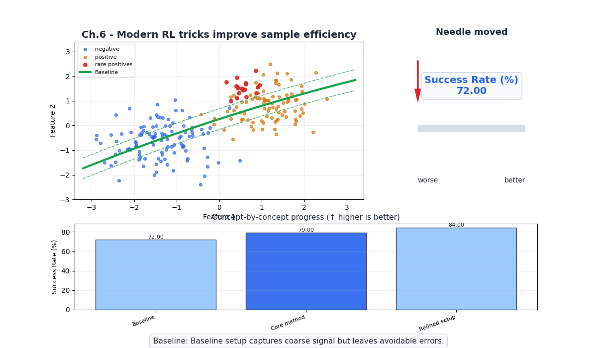
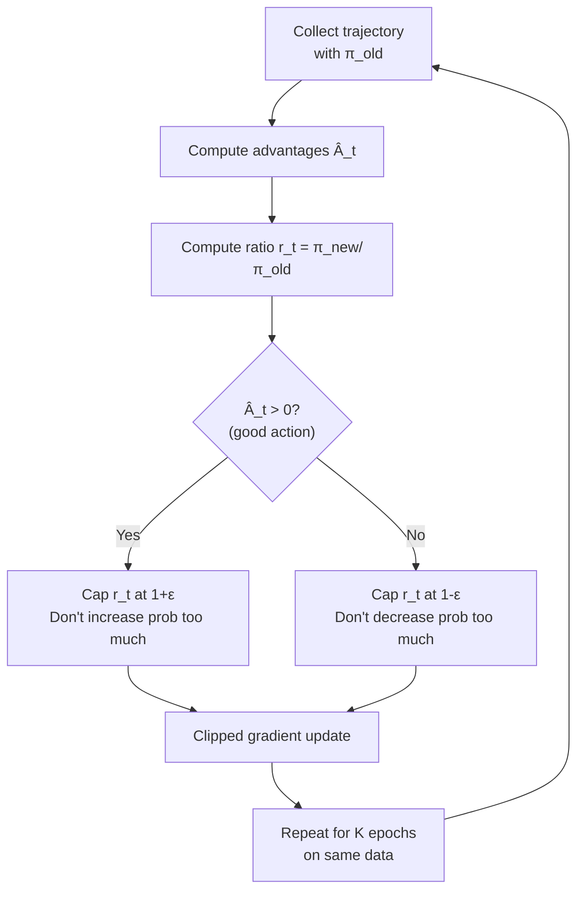
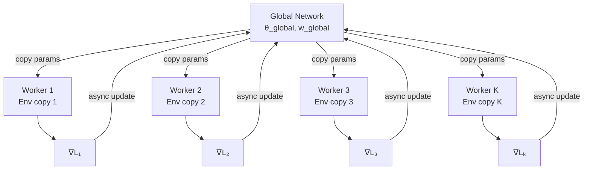
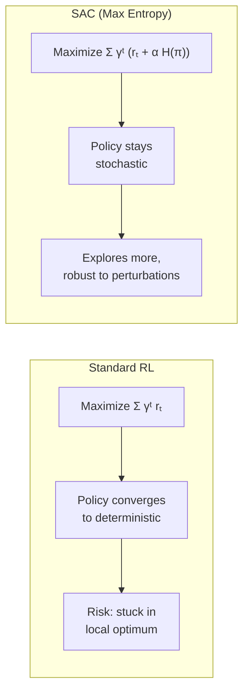
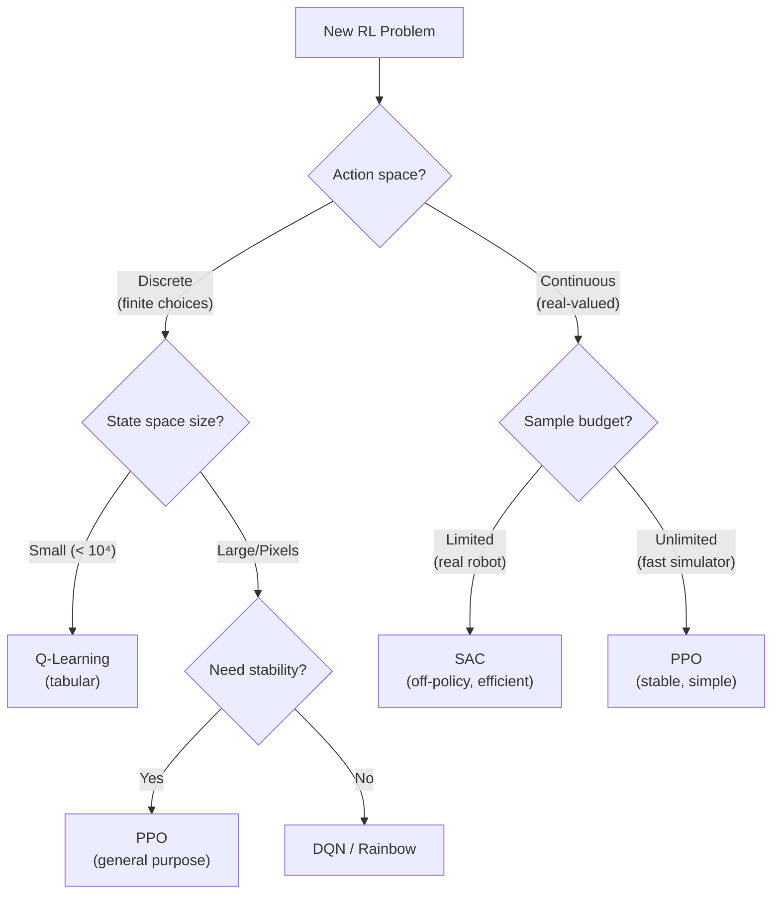

# Ch.6 — Modern RL: PPO, A3C, SAC

> **The story.** By 2015, DQN had cracked Atari and policy gradients could handle continuous control — but neither was reliable enough for production use. Training was brittle: a small hyperparameter change could collapse performance. Then three algorithms emerged that changed everything. **A3C** (Mnih et al., 2016) showed that parallel workers could replace experience replay entirely. **PPO** (Schulman et al., 2017) introduced a brilliantly simple clipping trick that prevented catastrophic policy updates — it became OpenAI's default algorithm and powered everything from Dota 2 to ChatGPT's RLHF training. **SAC** (Haarnoja et al., 2018) combined off-policy learning with maximum entropy, achieving unprecedented sample efficiency on continuous control. Together, these three algorithms form the modern RL toolkit.
>
> **Where you are in the curriculum.** This is the final chapter. You've built the complete RL stack: MDPs → Dynamic Programming → Q-learning → DQN → Policy Gradients → Actor-Critic. This chapter surveys the algorithms that practitioners actually use in 2024 and beyond, comparing their trade-offs for different problem types. It's a reference chapter — understand the concepts, then pick the right tool for your task.
>
> **Notation in this chapter.** $r_t(\theta) = \frac{\pi_\theta(a_t|s_t)}{\pi_{\theta_\text{old}}(a_t|s_t)}$ — probability ratio; $\epsilon$ — PPO clip parameter; $\mathcal{H}(\pi)$ — entropy of policy; $\alpha_\text{temp}$ — SAC temperature parameter; $\mu_\theta(s)$ — deterministic policy (DDPG).

---

## 0 · The Challenge — Where We Are

> 💡 **AgentAI constraints**: 1. OPTIMALITY — 2. EFFICIENCY — 3. SCALABILITY — 4. STABILITY — 5. GENERALIZATION

**What we know so far:**
- ⚡ Policy gradients optimize $\pi_\theta$ directly (Ch.5)
- ⚡ Actor-critic reduces variance with a value baseline
- ❌ **REINFORCE is sample-inefficient (on-policy, Monte Carlo)**
- ❌ **Large policy updates can catastrophically destroy performance**
- ❌ **No single algorithm is best for all problem types**

**What's blocking us from production RL:**
1. **Stability**: Actor-critic can diverge if the policy changes too much in one update
2. **Sample efficiency**: On-policy methods throw away data after each update
3. **Exploration**: Policies can converge prematurely to suboptimal behavior

**What this chapter unlocks:**

| Algorithm | Key Innovation | Primary Benefit |
|-----------|---------------|-----------------|
| **PPO** | Clipped policy ratio | Stability — prevents catastrophic updates |
| **A3C** | Asynchronous parallel workers | Speed — linear speedup with more CPUs |
| **SAC** | Maximum entropy objective | Exploration + sample efficiency |
| **DDPG** | Deterministic policy gradient | Continuous control with replay buffer |

| Constraint | Status after this chapter |
|-----------|-------------------------|
| #1 OPTIMALITY | ✅ PPO/SAC find near-optimal policies |
| #2 EFFICIENCY | ✅ SAC/DDPG reuse data (off-policy) |
| #3 SCALABILITY | ✅ All handle large/continuous spaces |
| #4 STABILITY | ✅ **PPO's clipping prevents catastrophic updates** |
| #5 GENERALIZATION | ⚠️ Active research (sim-to-real, meta-RL) |

---

## Animation



## 1 · Core Idea

Modern RL algorithms address the instability of vanilla policy gradients through three strategies: (1) **constrain** policy updates to prevent catastrophic changes (PPO, TRPO), (2) **parallelize** data collection to get diverse experience faster (A3C), and (3) **maximize entropy** alongside reward to maintain exploration and improve robustness (SAC). Each strategy leads to a different algorithm with different trade-offs, but they all build on the actor-critic foundation from Chapter 5.

---

## 2 · Running Example — Algorithm Comparison

Rather than one environment, this chapter compares algorithms across problem types:

```
Problem Type     │ Best Algorithms     │ Why
─────────────────┼────────────────────┼──────────────────────
Discrete actions │ PPO, A3C           │ Natural for softmax policies
(Atari, board    │                    │
 games)          │                    │
─────────────────┼────────────────────┼──────────────────────
Continuous       │ SAC, DDPG, PPO     │ Gaussian/deterministic policies
control          │                    │ handle real-valued actions
(robotics, MuJoCo│                    │
 locomotion)     │                    │
─────────────────┼────────────────────┼──────────────────────
Multi-CPU but    │ A3C                │ Embarrassingly parallel,
no GPU           │                    │ no replay buffer needed
─────────────────┼────────────────────┼──────────────────────
Sample-limited   │ SAC, DDPG          │ Off-policy: reuse all
(real robot,     │                    │ collected experience
expensive sim)   │                    │
─────────────────┼────────────────────┼──────────────────────
General purpose  │ PPO                │ Stable, simple, works
(default choice) │                    │ on most problems
```

---

## 3 · Math

### 3.1 Proximal Policy Optimization (PPO)

PPO's key insight: limit how much the policy can change in one update.

**Probability ratio:**

$$r_t(\theta) = \frac{\pi_\theta(a_t | s_t)}{\pi_{\theta_\text{old}}(a_t | s_t)}$$

If $r_t = 1$: new and old policies agree. If $r_t > 1$: new policy is more likely to take this action. If $r_t < 1$: new policy is less likely.

**PPO-Clip objective:**

$$L^{\text{CLIP}}(\theta) = \mathbb{E}_t \Big[\min\big(r_t(\theta) \hat{A}_t,\ \text{clip}(r_t(\theta),\ 1-\epsilon,\ 1+\epsilon) \hat{A}_t\big)\Big]$$

where $\epsilon \approx 0.2$ is the clip parameter.

**How clipping works:**
- If $\hat{A}_t > 0$ (action was good): $r_t$ is capped at $1 + \epsilon$. The policy can increase the action's probability, but not by more than $\epsilon$.
- If $\hat{A}_t < 0$ (action was bad): $r_t$ is capped at $1 - \epsilon$. The policy can decrease the action's probability, but not by more than $\epsilon$.

**Numeric example** ($\epsilon = 0.2$, $\hat{A} = +3.0$):

If $r = 1.5$ (policy wants 50% more of this action):
$$\text{clip}(1.5, 0.8, 1.2) = 1.2$$
$$L = \min(1.5 \times 3.0,\ 1.2 \times 3.0) = \min(4.5, 3.6) = 3.6$$

The clip limits the effective update to $r = 1.2$, preventing an excessively large policy change.

### 3.2 Asynchronous Advantage Actor-Critic (A3C)

A3C runs $K$ parallel workers, each interacting with its own copy of the environment:

**Each worker $k$:**
1. Copy global parameters: $\theta_k \leftarrow \theta_\text{global}$
2. Collect $n$-step trajectory using $\pi_{\theta_k}$
3. Compute $n$-step return and advantage estimates
4. Compute gradients $\nabla_{\theta_k} L$
5. Apply gradients to $\theta_\text{global}$ (asynchronously)

**$n$-step return** (instead of 1-step TD):

$$G_t^{(n)} = \sum_{k=0}^{n-1} \gamma^k r_{t+k+1} + \gamma^n V(s_{t+n}; w)$$

This interpolates between TD(0) ($n=1$, low variance, high bias) and Monte Carlo ($n = T$, high variance, low bias).

### 3.3 Soft Actor-Critic (SAC)

SAC adds an **entropy bonus** to the reward, encouraging exploration:

**Maximum entropy objective:**

$$J(\theta) = \mathbb{E}_{\pi_\theta}\left[\sum_{t=0}^{\infty} \gamma^t \Big(r_t + \alpha_\text{temp} \mathcal{H}\big(\pi_\theta(\cdot | s_t)\big)\Big)\right]$$

where $\mathcal{H}(\pi) = -\sum_a \pi(a|s) \log \pi(a|s)$ is the entropy.

**Why entropy matters:**
- High entropy = spread probability across actions = explore more
- Low entropy = concentrate on one action = exploit
- SAC finds the policy that maximizes reward *while staying as random as possible*

**Soft Bellman equation:**

$$Q_\text{soft}(s,a) = r + \gamma \mathbb{E}_{s'}\Big[V_\text{soft}(s')\Big]$$

$$V_\text{soft}(s) = \mathbb{E}_{a \sim \pi}\Big[Q_\text{soft}(s,a) - \alpha_\text{temp} \log \pi(a|s)\Big]$$

SAC is **off-policy** (uses a replay buffer like DQN), making it much more sample-efficient than PPO.

### 3.4 Deep Deterministic Policy Gradient (DDPG)

DDPG is essentially DQN for continuous actions. Instead of $\arg\max_a Q(s,a)$ (impossible for continuous $a$), it learns a **deterministic policy** $\mu_\theta(s)$ that directly outputs the action:

**Actor update:**

$$\nabla_\theta J = \mathbb{E}\Big[\nabla_a Q(s, a; w)\big|_{a=\mu_\theta(s)} \cdot \nabla_\theta \mu_\theta(s)\Big]$$

**Critic update** (same as DQN):

$$\mathcal{L}(w) = \mathbb{E}\Big[\big(r + \gamma Q(s', \mu_{\theta^-}(s'); w^-) - Q(s, a; w)\big)^2\Big]$$

**Exploration:** Add noise to the deterministic action: $a = \mu_\theta(s) + \mathcal{N}(0, \sigma)$

### 3.5 Trust Region Policy Optimization (TRPO)

TRPO is the theoretical predecessor to PPO. Instead of clipping, it constrains the KL divergence between old and new policies:

$$\max_\theta \quad \mathbb{E}\Big[r_t(\theta) \hat{A}_t\Big] \quad \text{s.t.} \quad \mathbb{E}\Big[D_\text{KL}\big(\pi_{\theta_\text{old}} \| \pi_\theta\big)\Big] \leq \delta$$

PPO is preferred in practice because clipping is simpler to implement and tune than constrained optimization.

---

## 4 · Step by Step

### 4.1 PPO Pseudocode

```
ALGORITHM: Proximal Policy Optimization (PPO-Clip)
──────────────────────────────────────────────────
Input:  Actor π_θ, Critic V_w, clip ε=0.2, epochs K=4,
        minibatch size M, discount γ, GAE λ=0.95
Output: Trained policy π_θ

1. FOR iteration = 1 to num_iterations:
   ── Collect Data ──
   a. Run policy π_θ for T timesteps across N parallel envs
   b. Compute advantages Â_t using GAE(λ):
      δ_t = r_t + γ V_w(s_{t+1}) - V_w(s_t)
      Â_t = Σ_{l=0}^{T-t} (γλ)^l δ_{t+l}
   c. Compute returns: R_t = Â_t + V_w(s_t)
   d. Store: {s_t, a_t, log π_θ_old(a_t|s_t), Â_t, R_t}

   ── Optimize ──
   e. FOR epoch = 1 to K:                     // reuse same data K times!
      FOR each minibatch of size M:
        i.   r_t(θ) = π_θ(a_t|s_t) / π_θ_old(a_t|s_t)    // ratio
        ii.  L_clip = min(r_t × Â_t, clip(r_t, 1-ε, 1+ε) × Â_t)
        iii. L_value = (V_w(s_t) - R_t)²
        iv.  L_entropy = -H(π_θ(·|s_t))       // entropy bonus
        v.   L = -L_clip + c₁ L_value - c₂ L_entropy
        vi.  Update θ, w via gradient descent on L
```

### 4.2 SAC Pseudocode (Simplified)

```
ALGORITHM: Soft Actor-Critic (SAC)
──────────────────────────────────
Input:  Actor π_θ, Critics Q_{w1}, Q_{w2}, target critics,
        replay buffer D, temperature α
Output: Trained policy π_θ

1. Initialize replay buffer D
2. FOR each environment step:
   a. a ~ π_θ(·|s)                            // sample from policy
   b. s', r, done = env.step(a)
   c. Store (s, a, r, s', done) in D
   
   ── Update (every step) ──
   d. Sample minibatch from D
   e. Compute target:
      a' ~ π_θ(·|s')
      y = r + γ (min(Q_{w1}(s',a'), Q_{w2}(s',a')) - α log π_θ(a'|s'))
   f. Update critics:
      w_i ← w_i - α_Q ∇(Q_{w_i}(s,a) - y)²   for i = 1, 2
   g. Update actor:
      θ ← θ - α_π ∇ E[α log π_θ(a|s) - min Q_{w_i}(s,a)]
   h. Update temperature α (auto-tune)
   i. Soft update target critics:
      w_i⁻ ← τ w_i + (1-τ) w_i⁻              // Polyak averaging
```

---

## 5 · Key Diagrams

### 5.1 PPO Clipping Visualization



### 5.2 A3C Parallel Architecture



### 5.3 SAC Entropy-Reward Trade-off



### 5.4 On-Policy vs Off-Policy Data Flow

```
ON-POLICY (PPO, A3C):
  Collect data → Train → DISCARD data → Collect new data → Train → ...
  ↑ Must collect fresh data every iteration
  ↑ Simple, stable, but wasteful

OFF-POLICY (SAC, DDPG):
  Collect data → Store in buffer → Sample → Train → Collect more → Store → Sample → Train
                 ↑ Reuse ALL past data
  ↑ More complex, but much more sample-efficient
```

---

## 6 · The Master Comparison Table

| | Q-Learning | DQN | REINFORCE | A3C | PPO | SAC | DDPG |
|---|---|---|---|---|---|---|---|
| **Type** | Value | Value | Policy | Actor-Critic | Actor-Critic | Actor-Critic | Actor-Critic |
| **On/Off-Policy** | Off | Off | On | On | On | **Off** | **Off** |
| **Actions** | Discrete | Discrete | Both | Both | Both | **Continuous** | **Continuous** |
| **Function Approx.** | Table | Neural Net | Neural Net | Neural Net | Neural Net | Neural Net | Neural Net |
| **Replay Buffer** | ❌ | ✅ | ❌ | ❌ | ❌ | ✅ | ✅ |
| **Sample Efficiency** | Medium | High | Low | Medium | Medium | **High** | **High** |
| **Stability** | Medium | Medium | Low | Medium | **High** ✅ | High | Medium |
| **Exploration** | ε-greedy | ε-greedy | Stochastic π | Stochastic π | Stochastic π | **Entropy** ✅ | Noise |
| **Parallelizable** | ❌ | ❌ | ❌ | **✅** | ✅ | ❌ | ❌ |
| **Default choice?** | Tabular only | Discrete, Atari | Simple baselines | Multi-CPU | **Yes** ✅ | Continuous | Continuous |

**When to use which:**



---

## 7 · Code Skeleton — PPO Training Loop

```
# ── PPO Update (Pseudocode) ──────────────────────────────
def ppo_update(actor, critic, rollout_buffer, clip_eps=0.2, epochs=4):
    # rollout_buffer contains: states, actions, old_log_probs, advantages, returns
    
    for epoch in range(epochs):
        for batch in rollout_buffer.iterate_minibatches(batch_size=64):
            states, actions, old_log_probs, advantages, returns = batch
            
            # Current policy probabilities
            new_log_probs = actor.log_prob(states, actions)
            
            # Probability ratio
            ratio = exp(new_log_probs - old_log_probs)       # π_new / π_old
            
            # Clipped surrogate objective
            surr1 = ratio * advantages
            surr2 = clip(ratio, 1 - clip_eps, 1 + clip_eps) * advantages
            actor_loss = -mean(min(surr1, surr2))
            
            # Value loss
            values = critic(states)
            critic_loss = mean((values - returns) ** 2)
            
            # Entropy bonus (encourages exploration)
            entropy = actor.entropy(states)
            
            # Total loss
            loss = actor_loss + 0.5 * critic_loss - 0.01 * entropy
            
            # Gradient step
            optimizer.zero_grad()
            loss.backward()
            clip_grad_norm(parameters, max_norm=0.5)
            optimizer.step()
```

---

## 8 · What Can Go Wrong

| Mistake | Symptom | Fix |
|---------|---------|-----|
| **PPO clip ε too large** | Policy changes too much, training collapses | Use $\epsilon = 0.1 – 0.2$, standard is 0.2 |
| **PPO too many epochs** | Overfits to collected batch, performance degrades | Use $K = 3 – 10$ epochs per batch |
| **SAC temperature too high** | Policy is too random, never exploits learned knowledge | Use auto-tuning for $\alpha$ (most implementations do this) |
| **DDPG exploration noise too low** | Agent doesn't explore, converges to suboptimal deterministic policy | Use Ornstein-Uhlenbeck noise or parameter noise |
| **A3C too many workers** | Stale gradients from workers using old parameters → instability | Use $K = $ number of CPU cores, or switch to PPO |
| **Wrong algorithm for the problem** | Discrete actions with SAC, or continuous actions with DQN | Use the decision flowchart in §6 |


---

## 9 · Where This Reappears

PPO, entropy regularization, and the practical deployment of RL reappear throughout advanced tracks:

- **AI / FineTuning**: InstructGPT, DPO, and GRPO all use PPO or its policy-gradient relatives to align language models; the clipping and KL-penalty ideas map directly to §3.
- **MultiAgentAI**: MAPPO and QMIX extend PPO with joint-action value functions and centralised critics.
- **AIInfrastructure / ParallelismAndDistributedTraining**: A3C's asynchronous multi-worker design is an early template for distributed RL training strategies.

## 10 · Progress Check

After this chapter you should be able to:

| Concept | Check |
|---------|-------|
| Explain PPO's clipping mechanism | What happens when $r_t > 1 + \epsilon$ with positive advantage? |
| Describe A3C's parallel architecture | How do workers update the global network? |
| Explain SAC's entropy bonus | Why does maximizing entropy help exploration? |
| Distinguish on-policy vs off-policy | Which algorithms can use a replay buffer? |
| Choose the right algorithm for a task | Discrete actions + stability needed → ? |
| Name the 5 AgentAI constraints | Which algorithm addresses which constraint? |

---

## 11 · Where to Go From Here

You've completed the Reinforcement Learning track. Here's the landscape beyond:

**Immediate next steps:**
- **Implement PPO** using Stable Baselines3 or CleanRL on CartPole/MuJoCo
- **Read the original papers**: DQN (Mnih 2015), PPO (Schulman 2017), SAC (Haarnoja 2018)
- **Experiment** with hyperparameters — understanding the theory makes debugging 10× faster

**Active research frontiers:**
| Frontier | Challenge | Key Work |
|----------|-----------|----------|
| **Offline RL** | Learn from pre-collected datasets (no environment interaction) | Conservative Q-Learning (CQL) |
| **Model-based RL** | Learn a model of the environment, plan using it | DreamerV3, MuZero |
| **Multi-agent RL** | Multiple agents learning simultaneously | MAPPO, QMIX |
| **Sim-to-Real** | Train in simulation, deploy on real robots | Domain randomization |
| **RLHF** | RL from Human Feedback (ChatGPT, Claude) | InstructGPT, DPO |
| **Safe RL** | Constraints on agent behavior during training | Constrained MDPs |

> *"You now speak the language of reinforcement learning. The vocabulary from Ch.1 (MDPs), the algorithms from Ch.2–5 (DP, Q-learning, DQN, policy gradients), and the practical tools from Ch.6 (PPO, SAC) — this is what every RL practitioner knows. The rest is experience."*


