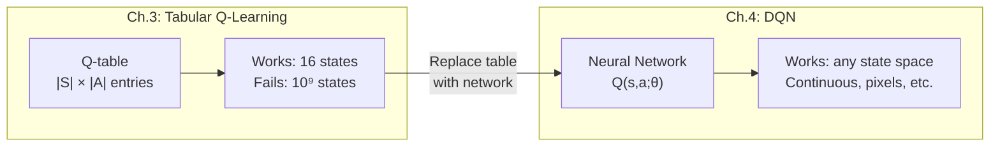
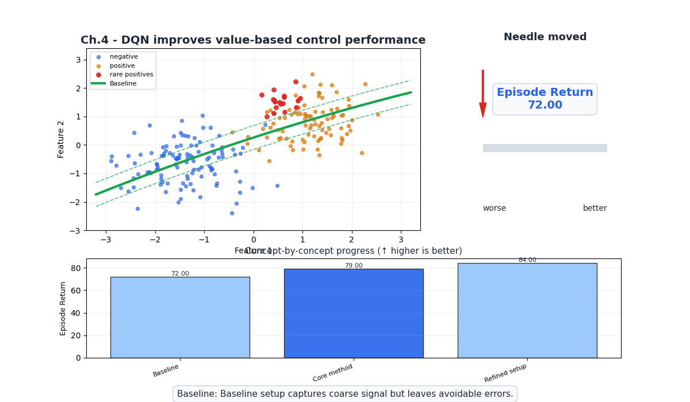
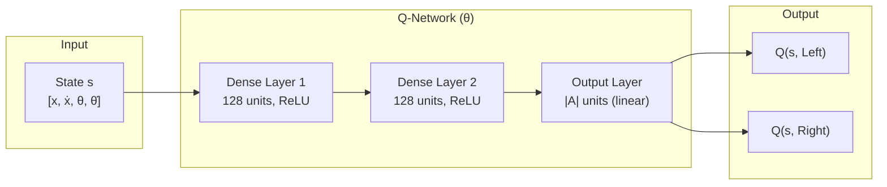
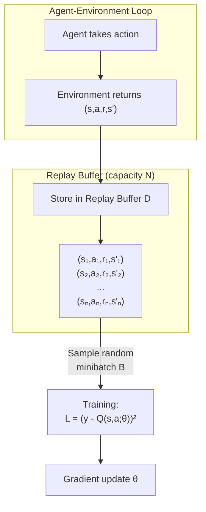
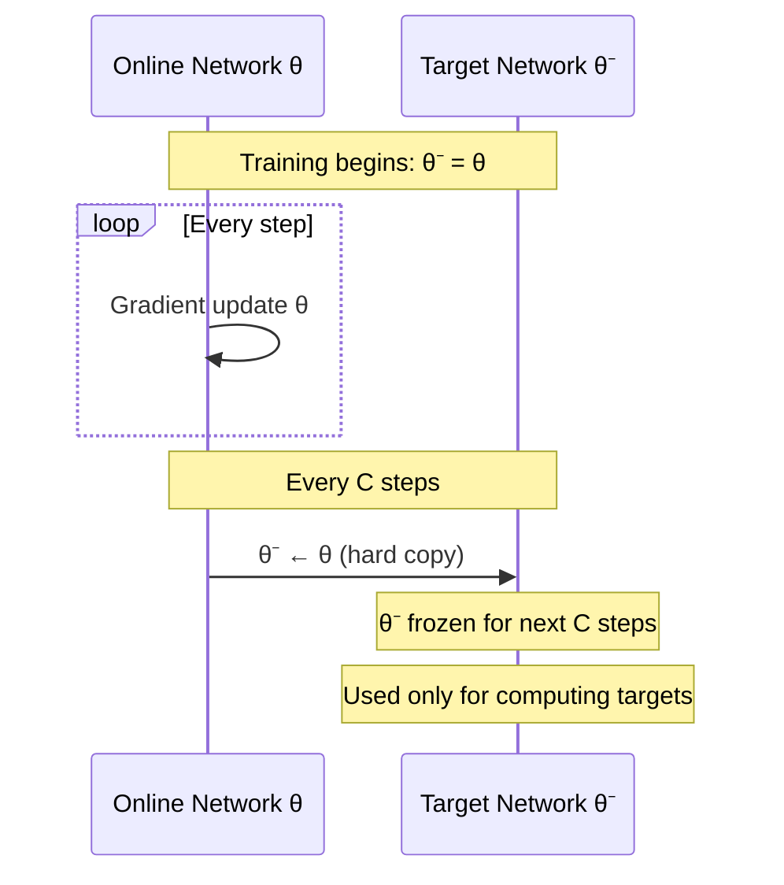
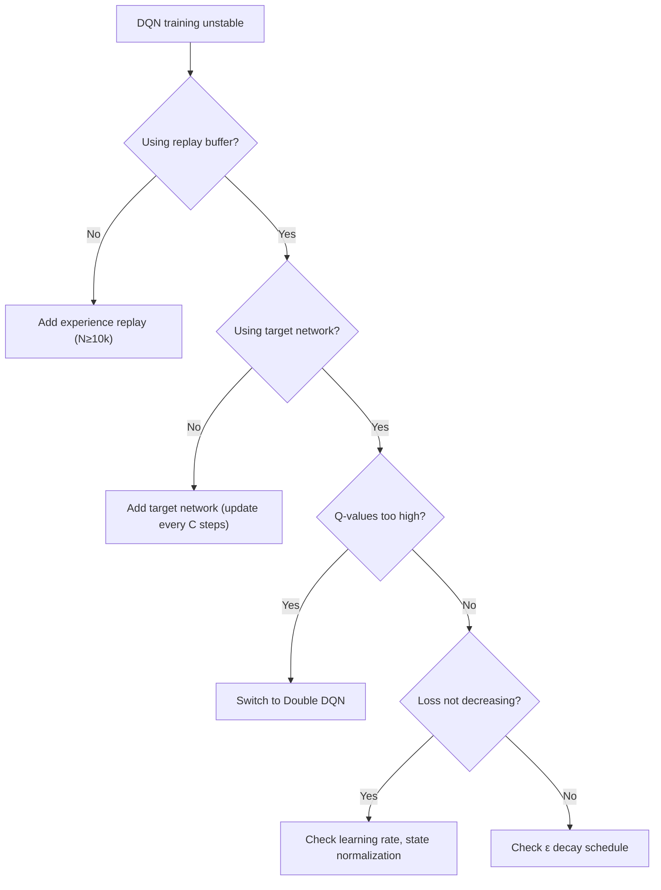

# Ch.4 — Deep Q-Networks (DQN)

> **The story.** In **February 2015**, DeepMind published "Human-level control through deep reinforcement learning" in *Nature*. A single algorithm — the **Deep Q-Network** — learned to play 49 different Atari 2600 games from raw pixel input, achieving superhuman performance on 29 of them. No game-specific engineering. No feature engineering. Just pixels → neural network → actions. The two key innovations that made this possible — **experience replay** (first proposed by Long-Ji Lin in 1992) and **target networks** — solved the instability that had plagued neural network + RL combinations for two decades. DQN was the paper that launched the modern deep RL revolution and led directly to AlphaGo (2016), OpenAI Five (2019), and the wave of RL-powered systems we see today.
>
> **Where you are in the curriculum.** Chapter 3 gave you Q-learning — powerful but limited to tabular settings. The Q-table approach breaks when states are continuous (CartPole) or high-dimensional (Atari pixels). This chapter replaces the Q-table with a neural network, introducing the challenges that arise when function approximation meets RL, and the elegant solutions (experience replay, target networks) that stabilize training.
>
> **Notation in this chapter.** $Q(s, a; \theta)$ — neural network Q-function with parameters $\theta$; $\theta^-$ — target network parameters (frozen copy); $\mathcal{D}$ — replay buffer; $\mathcal{B}$ — sampled minibatch; $C$ — target network update frequency; $N$ — replay buffer capacity.

---

## 0 · The Challenge — Where We Are

> 💡 **AgentAI constraints**: 1. OPTIMALITY — 2. EFFICIENCY — 3. SCALABILITY — 4. STABILITY — 5. GENERALIZATION

**What we know so far:**
- ⚡ MDPs and Bellman equations (Ch.1)
- ⚡ DP finds optimal policy with known model (Ch.2)
- ⚡ Q-learning finds optimal policy from experience (Ch.3)
- **Q-table requires enumerable states — fails for CartPole (continuous) and Atari ($10^9$ states)!**

**What's blocking us:**
CartPole has 4 continuous state variables: position $x$, velocity $\dot{x}$, pole angle $\theta$, angular velocity $\dot{\theta}$. We can't build a Q-table because there are infinitely many states. Even discretizing coarsely (100 bins per dimension) gives $100^4 = 10^8$ entries — and most will never be visited.

**What this chapter unlocks:**
**Function approximation**: replace $Q(s,a)$ table with a neural network $Q(s,a;\theta)$ that generalizes across states.

Two critical innovations to make it work:
1. **Experience replay** — break temporal correlation in training data
2. **Target networks** — stabilize the moving target problem

| Constraint | Status after this chapter |
|-----------|-------------------------|
| #1 OPTIMALITY | ✅ Converges to near-optimal with enough capacity |
| #2 EFFICIENCY | ⚠️ Experience replay reuses data (better than on-policy) |
| #3 SCALABILITY | ✅ **Solved!** Neural network handles continuous/high-dim states |
| #4 STABILITY | ✅ Experience replay + target networks stabilize training |
| #5 GENERALIZATION | ⚠️ Generalizes across similar states (same environment) |



---

## Animation



## 1 · Core Idea

A **Deep Q-Network** replaces the Q-table with a neural network that takes a state as input and outputs Q-values for all actions. The network is trained by minimizing the squared difference between its Q-value predictions and the TD targets $r + \gamma \max_{a'} Q(s', a'; \theta^-)$. Two innovations prevent the catastrophic instability that naively combining neural networks with Q-learning produces: **experience replay** stores transitions in a buffer and trains on random minibatches (breaking temporal correlation), and **target networks** use a frozen copy of the network to compute targets (preventing the target from shifting with every update).

---

## 2 · Running Example — CartPole

The agent must balance a pole on a cart by pushing left or right. The episode ends if the pole falls past ±12° or the cart moves beyond ±2.4 units.

```
State space (continuous, 4-dimensional):
┌──────────────────┬─────────────────┬───────────────┐
│ Variable         │ Range           │ Meaning       │
├──────────────────┼─────────────────┼───────────────┤
│ x (position)     │ [-4.8, 4.8]     │ Cart position │
│ ẋ (velocity)     │ [-∞, ∞]         │ Cart velocity │
│ θ (angle)        │ [-0.42, 0.42]   │ Pole angle    │
│ θ̇ (ang. vel.)   │ [-∞, ∞]         │ Pole ang. vel │
└──────────────────┴─────────────────┴───────────────┘

Action space (discrete, 2 actions):
  0 = Push Left    1 = Push Right

Reward: +1 for each timestep the pole stays upright
Goal: Survive 500 timesteps (max episode length)
```

**Why a Q-table fails here:** Even discretizing each variable into 100 bins gives $100^4 = 10^8$ entries. Most (state, action) pairs are never visited. No generalization between nearby states.

**Why DQN works:** A neural network maps any continuous state to Q-values:

$$Q([x, \dot{x}, \theta, \dot{\theta}], a; \theta) \to \mathbb{R}$$

Similar states (e.g., $\theta = 0.05$ vs $\theta = 0.06$) produce similar Q-values automatically.

---

## 3 · Math

### 3.1 DQN Loss Function

The network parameters $\theta$ are trained to minimize:

$$\mathcal{L}(\theta) = \mathbb{E}_{(s,a,r,s') \sim \mathcal{D}} \Big[\big(y - Q(s, a; \theta)\big)^2\Big]$$

where the **TD target** is:

$$y = r + \gamma \max_{a'} Q(s', a'; \theta^-)$$

$\theta^-$ are the **target network** parameters — a frozen copy of $\theta$ updated every $C$ steps.

**Gradient:**

$$\nabla_\theta \mathcal{L} = \mathbb{E}\Big[-2\big(y - Q(s,a;\theta)\big) \nabla_\theta Q(s,a;\theta)\Big]$$

Note: the gradient is only taken w.r.t. $Q(s,a;\theta)$, not through $y$ (which uses $\theta^-$).

**Toy DQN target (3-state, γ=0.9):**

| Transition | r | max Q(s′,·) | Target y | Current Q estimate |
|-----------|---|------------|---------|-------------------|
| s0→a1→s1 | −1 | 0.50 | −1 + 0.9×0.50 = **−0.55** | 0.0 |
| s1→a0→s2 | +5 | 0.0 | +5 + 0.9×0.0 = **+5.0** | 0.0 |

The loss penalises the gap between the current network output and these targets; gradient descent pulls Q(s0,a1) toward −0.55 and Q(s1,a0) toward +5.

### 3.2 Why Naive Q-Learning + Neural Networks Fails

Two problems destroy learning without the DQN innovations:

**Problem 1: Correlated samples.** Sequential transitions $(s_t, a_t, r_t, s_{t+1}), (s_{t+1}, a_{t+1}, r_{t+1}, s_{t+2}), \ldots$ are highly correlated. Neural networks assume i.i.d. training data. Correlated samples cause the network to overfit to the recent trajectory and forget earlier experience.

**Solution: Experience Replay.** Store all transitions in a buffer $\mathcal{D}$. Train on random minibatches $\mathcal{B} \sim \mathcal{D}$. This breaks temporal correlation and reuses data efficiently.

**Problem 2: Non-stationary targets.** The TD target $r + \gamma \max Q(s', a'; \theta)$ changes with every update to $\theta$. This is like training a network where the labels shift with every gradient step — the optimization chases a moving target.

**Solution: Target Networks.** Use a frozen copy $\theta^-$ for computing targets. Update $\theta^- \leftarrow \theta$ every $C$ steps. This makes the target stationary for $C$ steps at a time.

### 3.3 Experience Replay

$$\mathcal{D} = \{(s_i, a_i, r_i, s'_i, \text{done}_i)\}_{i=1}^{N}$$

Buffer stores up to $N$ transitions. When full, oldest transitions are overwritten (circular buffer).

Training step: sample random minibatch $\mathcal{B}$ of size $B$ from $\mathcal{D}$:
$$\mathcal{B} = \{(s_j, a_j, r_j, s'_j)\}_{j=1}^{B} \sim \text{Uniform}(\mathcal{D})$$

**Benefits:**
1. Breaks temporal correlation (random sampling)
2. Data efficiency (each transition used in multiple updates)
3. Smooths over changes in data distribution as policy improves

### 3.4 Double DQN

Standard DQN overestimates Q-values because $\max$ is a biased estimator:

$$\mathbb{E}[\max_a Q(s',a)] \geq \max_a \mathbb{E}[Q(s',a)]$$

**Double DQN** (van Hasselt et al., 2016) decouples action selection from evaluation:

$$y_{\text{DDQN}} = r + \gamma Q\Big(s', \underbrace{\arg\max_{a'} Q(s', a'; \theta)}_{\text{select with online network}};\ \underbrace{\theta^-}_{\text{evaluate with target network}}\Big)$$

The online network $\theta$ picks the best action; the target network $\theta^-$ evaluates it. This reduces overestimation bias.

### 3.5 Numeric Example

**Compact replay buffer (3 transitions):**

| # | State $s$ | Action | Reward | Next $s'$ | Done |
|---|-----------|--------|--------|-----------|------|
| 1 | [0.02, 0.15, −0.03, −0.20] | 1 (Right) | +1 | [0.03, 0.10, −0.04, −0.15] | False |
| 2 | [0.03, 0.10, −0.04, −0.15] | 0 (Left)  | +1 | [0.02, 0.09, −0.01, +0.10] | False |
| 3 | [0.02, 0.09, −0.01, +0.10] | 1 (Right) | +1 | [0.04, 0.12, −0.03, −0.05] | False |

**One gradient step using transition 1** ($\gamma = 0.99$):

Given: State $s = [0.02, 0.15, -0.03, -0.2]$, action $a = 1$ (Right), reward $r = 1$, next state $s' = [0.03, 0.10, -0.04, -0.15]$, $\gamma = 0.99$

Network outputs: $Q(s', 0; \theta^-) = 42.3$, $Q(s', 1; \theta^-) = 44.1$, current $Q(s, 1; \theta) = 40.5$

$$y = 1 + 0.99 \times \max(42.3, 44.1) = 1 + 0.99 \times 44.1 = 44.659$$

$$\mathcal{L} = (44.659 - 40.5)^2 = 17.31$$

Gradient step pushes $Q(s, 1; \theta)$ toward 44.659.

---

## 4 · Step by Step

### 4.1 DQN Algorithm Pseudocode

```
ALGORITHM: Deep Q-Network (DQN)
───────────────────────────────
Input:  Environment env, learning rate α, discount γ, exploration ε,
        replay buffer size N, minibatch size B, target update freq C
Output: Trained network Q(s, a; θ)

1. Initialize Q-network with random weights θ
2. Initialize target network θ⁻ ← θ           // frozen copy
3. Initialize replay buffer D (capacity N)
4. Initialize total_steps = 0

5. FOR episode = 1 to num_episodes:
   a. s = env.reset()
   b. WHILE s is not terminal:
      ── Action Selection ──
      i.   With prob ε: a = random action       // explore
           Else: a = argmax_a' Q(s, a'; θ)      // exploit
      
      ── Environment Interaction ──
      ii.  Take action a, observe r, s', done
      
      ── Store Transition ──
      iii. Store (s, a, r, s', done) in D
      
      ── Training Step (if enough samples) ──
      iv.  IF |D| ≥ B:
           - Sample minibatch {(sⱼ, aⱼ, rⱼ, s'ⱼ, doneⱼ)} from D
           - Compute targets:
             yⱼ = rⱼ                            if doneⱼ = True
             yⱼ = rⱼ + γ max_a' Q(s'ⱼ, a'; θ⁻)  if doneⱼ = False
           - Compute loss: L = (1/B) Σ (yⱼ - Q(sⱼ, aⱼ; θ))²
           - Gradient step: θ ← θ - α ∇_θ L
      
      ── Target Network Update ──
      v.   total_steps += 1
           IF total_steps mod C == 0:
               θ⁻ ← θ                          // hard update
      
      vi.  s ← s'
   c. Decay ε
```

---

## 5 · Key Diagrams

### 5.1 DQN Architecture



For CartPole: Input = 4 (state dim), Output = 2 (actions). For Atari: Input = 84×84×4 (stacked frames), Output = 18 (joystick actions), with convolutional layers.

### 5.2 Experience Replay Buffer



### 5.3 Target Network Update



### 5.4 DQN vs Tabular Q-Learning

```
Tabular Q-Learning:                 DQN:
┌───────────────────┐              ┌───────────────────┐
│ Q-Table           │              │ Neural Network     │
│ ┌───┬───┬───┬───┐ │              │                   │
│ │2.1│3.4│1.2│4.5│ │              │  s → [Dense] →    │
│ ├───┼───┼───┼───┤ │              │    → [Dense] →    │
│ │1.8│...│...│...│ │              │    → Q(s,a₁..aₙ) │
│ └───┴───┴───┴───┘ │              └───────────────────┘
│ Fixed size: |S|×|A│              │ Fixed size: params │
│ No generalization │              │ Generalizes across │
│ Discrete states   │              │ Continuous states  │
└───────────────────┘              └───────────────────┘
GridWorld: 16×4=64    CartPole: 4→128→128→2 = 17,538 params
Atari: 10⁹ × 18 = ∞  Atari: 84×84×4→CNN→18 = ~1.7M params
```

---

## 6 · Hyperparameter Dial

| Hyperparameter | Too Low | Sweet Spot | Too High |
|---------------|---------|------------|----------|
| Replay buffer $N$ | $< 1{,}000$: not enough diversity, overfits to recent experience | $10{,}000 – 1{,}000{,}000$: good data diversity | $> 10{,}000{,}000$: stale transitions from very old (bad) policy |
| Minibatch size $B$ | $< 8$: noisy gradients, unstable training | $32 – 128$: stable gradients with diversity | $> 512$: slow per step, may smooth out important signal |
| Target update $C$ | $< 100$: target still non-stationary, defeats the purpose | $1{,}000 – 10{,}000$: stable targets, slow enough updates | $> 100{,}000$: target becomes too stale, slows learning |
| Learning rate $\alpha$ | $< 10^{-5}$: learns too slowly | $10^{-4} – 10^{-3}$: steady improvement | $> 10^{-2}$: overshoots, Q-values explode |
| $\epsilon$ decay | Too fast: insufficient exploration, suboptimal policy | Reach $\epsilon = 0.01$ at ~50% of training | Too slow: wastes episodes on random actions |

---

## 7 · Code Skeleton

```
# ── DQN Agent (Pseudocode) ────────────────────────────────
class DQNAgent:
    def __init__(self, state_dim, n_actions, lr, gamma, buffer_size, batch_size, C):
        self.Q = NeuralNetwork(state_dim → 128 → 128 → n_actions)    # online
        self.Q_target = copy(self.Q)                                   # target (frozen)
        self.buffer = ReplayBuffer(capacity=buffer_size)
        self.optimizer = Adam(self.Q.parameters(), lr=lr)
        self.gamma = gamma
        self.batch_size = batch_size
        self.C = C
        self.steps = 0

    def choose_action(self, state, epsilon):
        if random() < epsilon:
            return random_action()
        else:
            q_values = self.Q(state)           # forward pass
            return argmax(q_values)

    def store(self, s, a, r, s_next, done):
        self.buffer.add(s, a, r, s_next, done)

    def train_step(self):
        if len(self.buffer) < self.batch_size:
            return                             # not enough data yet
        
        # Sample random minibatch
        batch = self.buffer.sample(self.batch_size)
        states, actions, rewards, next_states, dones = batch
        
        # Compute targets (no gradient through target network!)
        with no_grad():
            q_next = self.Q_target(next_states)
            max_q_next = max(q_next, dim=actions)
            targets = rewards + self.gamma * max_q_next * (1 - dones)
        
        # Compute current Q-values
        q_current = self.Q(states)
        q_selected = q_current[actions]        # Q-value for taken action
        
        # Loss and gradient step
        loss = mean((targets - q_selected) ** 2)
        self.optimizer.zero_grad()
        loss.backward()
        self.optimizer.step()
        
        # Target network update
        self.steps += 1
        if self.steps % self.C == 0:
            self.Q_target.load_state_dict(self.Q.state_dict())

# ── Training Loop ─────────────────────────────────────────
agent = DQNAgent(state_dim=4, n_actions=2, ...)
epsilon = 1.0
for episode in range(1000):
    s = env.reset()
    while not done:
        a = agent.choose_action(s, epsilon)
        s_next, r, done = env.step(a)
        agent.store(s, a, r, s_next, done)
        agent.train_step()
        s = s_next
    epsilon = max(0.01, epsilon * 0.995)       # decay exploration
```

---

## 8 · What Can Go Wrong

| Mistake | Symptom | Fix |
|---------|---------|-----|
| **No experience replay** | Catastrophic forgetting — agent forgets earlier skills, training is unstable | Add replay buffer, minimum size 10,000 |
| **No target network** | Q-values diverge — loss oscillates, performance collapses | Add target network, update every 1,000–10,000 steps |
| **Overestimation bias** | Q-values are systematically too high, agent overconfident | Use Double DQN: select action with $\theta$, evaluate with $\theta^-$ |
| **Replay buffer too small** | Training data lacks diversity, overfits to recent policy | Increase buffer size (100k–1M for Atari) |
| **Not normalizing states** | Features on different scales (position vs velocity) confuse the network | Normalize states to zero mean, unit variance |
| **Missing `done` flag handling** | Target includes future value for terminal states → corrupted values | Set target = $r$ when done (zero future value) |




---

## 9 · Where This Reappears

Experience replay, target network stabilization, and neural function approximation for RL appear widely:

- **Ch.5 Policy Gradients** and **Ch.6 Modern RL**: PPO, SAC, and TD3 all use experience replay and periodic target refreshes introduced here.
- **Ch.6 Modern RL / Double-DQN**: the decoupled select/evaluate trick also appears in offline RL algorithms such as CQL.
- **MultimodalAI / VisionTransformers**: CNN-based state representations connect directly to ViT patch embeddings.

## 10 · Progress Check

After this chapter you should be able to:

| Concept | Check |
|---------|-------|
| Explain why Q-tables fail for continuous states | What happens with CartPole's 4 continuous variables? |
| Draw the DQN architecture | State → Dense → Dense → Q-values for each action |
| Explain experience replay and why it's needed | What problem does it solve? (2 answers) |
| Explain target networks and why they're needed | What is the "moving target" problem? |
| Write the DQN loss function | $\mathcal{L} = \mathbb{E}[(y - Q(s,a;\theta))^2]$ where $y = \ldots$ |
| Describe Double DQN's fix | How does it reduce overestimation? |

---

## 11 · Bridge to Next Chapter

DQN handles discrete actions brilliantly: for each state, output Q-values for action 0, 1, 2, etc. and pick the max. But what if the action space is **continuous**? A robotic arm needs to output exact joint angles $a \in \mathbb{R}^7$ — you can't enumerate every possible angle.

DQN also learns the value function and extracts the policy implicitly (greedy w.r.t. Q). What if we optimized the **policy directly**? Instead of asking "what's the value of this action?" we ask "what action maximizes expected reward?"

**Chapter 5** introduces **Policy Gradient** methods — REINFORCE and Actor-Critic — that parameterize the policy itself $\pi(a|s; \theta)$ and optimize it directly via gradient ascent on expected return. This opens the door to continuous action spaces and stochastic policies.

> *"DQN asks 'how good is each action?' and picks the best. Policy gradients ask 'what action should I take?' directly."*


