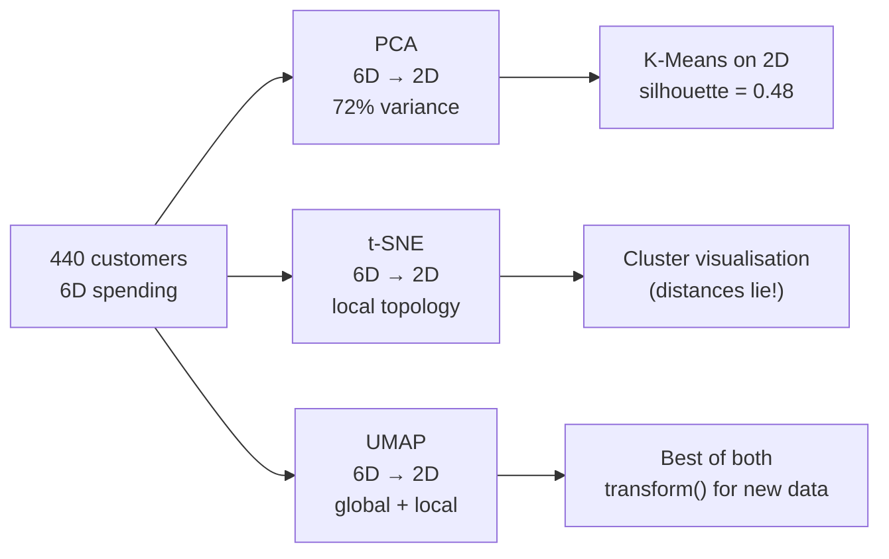
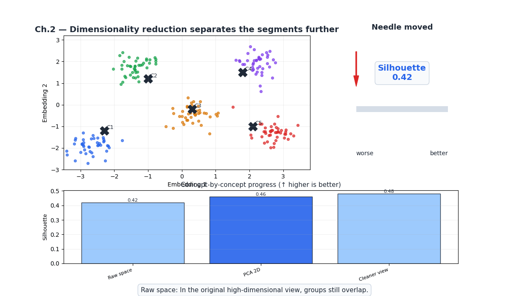
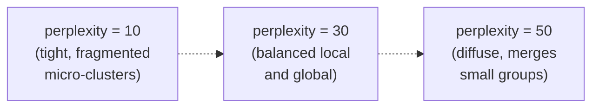

# Ch.2 — Dimensionality Reduction

> **The story.** **PCA** is the oldest of the three. **Karl Pearson** introduced it in **1901** as "lines and planes of closest fit to systems of points in space"; **Harold Hotelling** rediscovered and renamed it in 1933. The mechanics are pure linear algebra — eigendecomposition of the covariance matrix — which is why every textbook covers it and every numerical-linear-algebra library ships it. **t-SNE** (**Laurens van der Maaten & Geoffrey Hinton**, **2008**) was a deliberate departure: stop trying to preserve global geometry, optimise instead for local neighbourhoods, and you get the now-iconic "clusters of clusters" visualisations. The trade-off was honesty about distance — t-SNE plots lie about how far apart distant clusters are. **UMAP** (**Leland McInnes, John Healy, James Melville**, **2018**) recovered some of that global structure using ideas from algebraic topology, ran 10–100× faster, and has become the default for embedding visualisation in single-cell biology, NLP, and modern deep learning.
>
> **Where you are in the curriculum.** The clustering work in [Ch.1](../ch01-clustering/) happened in 6-dimensional space — but every scatter plot we drew required projecting down to 2D first. That projection is dimensionality reduction, and your choice of method (PCA / t-SNE / UMAP) silently decides what you see and what you miss. Each method makes a different promise about what it preserves; breaking each promise costs you a different kind of insight. More practically, the curse of dimensionality was hurting our silhouette (0.42) — distances become noisy in high-d. Reducing dimensions before clustering can sharpen boundaries.
>
> **Notation in this chapter.** $X\in\mathbb{R}^{N\times d}$ — the data matrix ($N$ customers, $d$ features); $\Sigma=\tfrac{1}{N}X^\top X$ — the (centred) **covariance matrix**; $\lambda_i,\mathbf{v}_i$ — eigenvalue / eigenvector pair of $\Sigma$ (PCA's principal components, sorted by decreasing $\lambda_i$); $k$ — number of retained components ($k\ll d$); $Z=XV_k\in\mathbb{R}^{N\times k}$ — the projected (low-dimensional) data; **explained variance ratio** $=\lambda_i/\sum_j\lambda_j$; for **t-SNE**: $p_{ij}$ — high-dim neighbour probabilities, $q_{ij}$ — low-dim Student-$t$ probabilities, **perplexity** — effective neighbourhood size; for **UMAP**: $n_{\text{neighbors}}$, $\text{min\_dist}$.

---

## 0 · The Challenge — Where We Are

> 💡 **The mission**: Build **SegmentAI** — discover 5 actionable customer segments with silhouette >0.5
> 1. **SEGMENTATION**: 5 distinct segments — 2. **INTERPRETABILITY**: Business-actionable — 3. **STABILITY**: Reproducible — 4. **SCALABILITY**: 10k+ — 5. **VALIDATION**: Silhouette >0.5

**What we know so far:**
- ⚡ Ch.1: K-Means discovered 5 initial segments (silhouette = 0.42)
- ⚡ DBSCAN identified 23 noise customers (outlier spenders)
- ❌ **Can't visualise 6D clusters — stakeholders need to SEE segments**
- ❌ **Silhouette only 0.42 — distances in 6D are noisy**

**What's blocking us:**
⚠️ **Curse of dimensionality + no visualisation**

Stakeholders ask: "Show us the segments!"
- **Problem**: Clusters exist in 6-dimensional spending space
- **Challenge**: Humans can only see 2D/3D plots
- **Deeper issue**: In 6D, Euclidean distances become noisy → cluster boundaries blur

**What this chapter unlocks:**
⚡ **Dimensionality reduction — compress 6D → 2D while preserving structure:**
1. **PCA**: Linear projection preserving maximum variance (fast, deterministic)
2. **t-SNE**: Non-linear projection preserving local neighbourhoods (beautiful cluster plots)
3. **UMAP**: Non-linear preserving global + local structure (fast, has transform())

💡 **Outcome**: K-Means on PCA-reduced data → silhouette jumps from 0.42 to 0.48! Plus 2D scatter plots that stakeholders can actually interpret.

| Constraint | Status | This Chapter |
|------------|--------|-------------|
| #1 SEGMENTATION | ✅ Improved | Tighter clusters in reduced space |
| #2 INTERPRETABILITY | ⚡ Partial | PCA loadings reveal what drives segments |
| #3 STABILITY | ❌ Not yet | Need bootstrap (Ch.3) |
| #4 SCALABILITY | ✅ Done | PCA is O(nd²), UMAP scales well |
| #5 VALIDATION | ⚡ Closer | Silhouette up to 0.48 (still below 0.5) |



---

## Animation



## 1 · Core Idea

High-dimensional customer data is hard to visualise, and Euclidean distances become noisy as dimensions grow (curse of dimensionality). Dimensionality reduction finds a lower-dimensional representation preserving the most important structure.

**PCA (Principal Component Analysis):** linear projection that maximises retained variance. Fast, deterministic, invertible. Best for overall structure and preprocessing before downstream clustering.

**t-SNE (t-distributed Stochastic Neighbour Embedding):** non-linear method that preserves local neighbourhood structure. Produces beautiful cluster plots. Not invertible; distances between clusters are meaningless; does not scale well beyond ~50k points.

**UMAP (Uniform Manifold Approximation and Projection):** non-linear topology-preserving method. Faster than t-SNE at scale, better global structure, can be used as a feature transformer for downstream tasks via `transform()`.

```
Axis          PCA        t-SNE       UMAP
Speed         fastest    slowest     fast
Deterministic yes        no (stoch.) no (stoch.)
Global struct ✓✓✓       ✗           ✓✓
Local struct  ✓✓        ✓✓✓         ✓✓✓
Invertible    yes        no          no
Downstream ML yes        rarely      yes
```

---

## 2 · Running Example

We take all **6 spending features** of the Wholesale Customers dataset (440 customers) and project them to 2 dimensions using each of the three methods. PCA loadings tell us what each component means (e.g., PC1 = "total spend", PC2 = "fresh vs grocery"). t-SNE and UMAP reveal cluster topology. We then re-run K-Means on the 2D PCA space to see if reduced dimensions improve silhouette.

Dataset: **Wholesale Customers** (UCI) — 440 customers, 6 features (log-transformed + standardised)
Projection target: 2D for visualisation
Colour: K-Means cluster labels from Ch.1

---

## 3 · Math

### 3.1 PCA

PCA finds a new orthogonal coordinate system aligned with the directions of maximum variance.

**Step 1 — centre:** $\mathbf{X}_c = \mathbf{X} - \bar{\mathbf{x}}$

**Step 2 — covariance matrix:** $\mathbf{C} = \frac{1}{n-1}\mathbf{X}_c^\top \mathbf{X}_c \in \mathbb{R}^{d \times d}$

**Step 3 — eigendecomposition:** $\mathbf{C} = \mathbf{V}\mathbf{\Lambda}\mathbf{V}^\top$, where columns of $\mathbf{V}$ are **principal components** (eigenvectors) and $\mathbf{\Lambda} = \text{diag}(\lambda_1 \geq \lambda_2 \geq \cdots \geq \lambda_d)$ holds the eigenvalues.

**Step 4 — project:** $\mathbf{Z} = \mathbf{X}_c \mathbf{V}_k$, where $\mathbf{V}_k$ contains the top $k$ eigenvectors.

**Explained variance ratio:**

$$\text{EVR}_i = \frac{\lambda_i}{\sum_{j=1}^{d} \lambda_j}$$

**Numeric example** (Wholesale Customers, 6 features):

| Component | EVR | Cumulative | Interpretation |
|-----------|-----|------------|----------------|
| PC1 | 44% | 44% | Total spend magnitude |
| PC2 | 28% | 72% | Fresh/Frozen vs Grocery/Detergents |
| PC3 | 12% | 84% | Milk vs Delicatessen |
| PC4 | 8% | 92% | Frozen outlier dimension |
| PC5 | 5% | 97% | Residual |
| PC6 | 3% | 100% | Noise |

Top 2 PCs capture 72% of variance — good for visualisation. Top 4 capture 92% — good for preprocessing.

### 3.2 t-SNE

t-SNE preserves local structure by modelling pairwise similarities:

**High-d similarities:** Gaussian kernel

$$p_{j|i} = \frac{\exp(-\|x_i - x_j\|^2 / 2\sigma_i^2)}{\sum_{k \neq i} \exp(-\|x_i - x_k\|^2 / 2\sigma_i^2)}, \quad p_{ij} = \frac{p_{j|i} + p_{i|j}}{2n}$$

**Low-d similarities:** Student-t with 1 degree of freedom (heavy tails prevent crowding):

$$q_{ij} = \frac{(1 + \|y_i - y_j\|^2)^{-1}}{\sum_{k \neq l}(1 + \|y_k - y_l\|^2)^{-1}}$$

**Objective:** minimise KL divergence: $\text{KL}(P \| Q) = \sum_{i \neq j} p_{ij} \log \frac{p_{ij}}{q_{ij}}$

**Perplexity:** roughly the number of effective nearest neighbours. For 440 customers, try 10–50.

### 3.3 UMAP

UMAP models the data's **topological structure** using a weighted k-nearest-neighbour graph, then finds a low-d embedding minimising cross-entropy between the two graph distributions.

**Key parameters:**
- `n_neighbors`: how many neighbours define local structure (higher = more global)
- `min_dist`: minimum spacing between points in embedding (lower = tighter clusters)

---

## 4 · Step by Step

```
PCA:
1. Log-transform + standardise features
2. Fit PCA(n_components=6) → get explained_variance_ratio_
3. Plot scree chart: cumulative EVR vs component number
4. Choose n_components=2 for visualisation, n_components=4 for preprocessing (92% EVR)
5. Colour 2D scatter by K-Means labels from Ch.1

t-SNE:
1. Use standardised data directly (only 6D — no pre-PCA needed)
2. Run TSNE(n_components=2, perplexity=30, random_state=42)
3. Try perplexity ∈ {10, 30, 50} and compare
4. Do NOT interpret distance between clusters

UMAP:
1. Run UMAP(n_components=2, n_neighbors=15, min_dist=0.1, random_state=42)
2. Try n_neighbors ∈ {5, 15, 50} — lower = tighter local clusters
3. UMAP.transform() works on new customers — unlike t-SNE

Re-cluster:
4. Run K-Means(K=5) on PCA 2D data
5. Compare silhouette: raw 6D (0.42) vs PCA 2D (0.48)
```

---

## 5 · Key Diagrams

### Scree plot (PCA)

```
Cumulative
explained
variance
1.00 │            ────────────────────
0.92 │       ─────╯
0.84 │  ─────╯
0.72 │──╯
0.44 │╯
     └──────────────────────────────── component number
      1    2    3    4    5    6
           ↑
           72% with just 2 PCs (good for visualisation)
```

### PCA vs t-SNE vs UMAP comparison

```
PCA                 t-SNE               UMAP
────────────────    ────────────────    ────────────────
Global variance     Local clusters      Local + global
Linear only         Non-linear          Non-linear
Distances valid     ⚠ distances WRONG   Topology valid
Fast (ms)           Slow (sec)          Medium (sec)
Invertible          No transform()      Has transform()
```

### t-SNE perplexity effect



---

## 6 · Hyperparameter Dial

### PCA

| Dial | Too low | Sweet spot | Too high |
|------|---------|------------|----------|
| **n_components** | High reconstruction error; too compressed | 2 for visualisation; 4 for preprocessing (92% EVR) | Keeps noise dimensions; no benefit |

### t-SNE

| Dial | Too low | Sweet spot | Too high |
|------|---------|------------|----------|
| **perplexity** | Tiny fragmented clusters; variable across runs | 10–50 for 440 points | Clusters merge; structure washes out |
| **learning_rate** | t-SNE collapses to a ball | 'auto' (sklearn default) | Explodes |
| **n_iter** | Doesn't converge | ≥1000 (sklearn default) | — |

### UMAP

| Dial | Too low | Sweet spot | Too high |
|------|---------|------------|----------|
| **n_neighbors** | Over-local; disconnected micro-clusters | 10–30 | Overly global; loses cluster structure |
| **min_dist** | Points crushed into tight dots | 0.05–0.3 | Clusters smear into one another |

---

## 7 · Code Skeleton

```python
import numpy as np
import pandas as pd
from sklearn.preprocessing import StandardScaler
from sklearn.decomposition import PCA
from sklearn.manifold import TSNE
from sklearn.cluster import KMeans
from sklearn.metrics import silhouette_score

# ── Load and preprocess ───────────────────────────────────────────────────────
url = "https://archive.ics.uci.edu/ml/machine-learning-databases/00292/Wholesale%20customers%20data.csv"
df = pd.read_csv(url)
spend_cols = ['Fresh', 'Milk', 'Grocery', 'Frozen', 'Detergents_Paper', 'Delicatessen']
X = df[spend_cols].values

X_log = np.log1p(X)
scaler = StandardScaler()
X_sc = scaler.fit_transform(X_log)
```

```python
# ── PCA scree ─────────────────────────────────────────────────────────────────
pca_full = PCA(n_components=X_sc.shape[1]).fit(X_sc)
evr = pca_full.explained_variance_ratio_
cumevr = evr.cumsum()
print(f"Components to reach 90% variance: {(cumevr < 0.90).sum() + 1}")
```

```python
# ── PCA 2D projection ─────────────────────────────────────────────────────────
pca2 = PCA(n_components=2, random_state=42)
X_pca = pca2.fit_transform(X_sc)
print(f"PCA 2D retains {pca2.explained_variance_ratio_.sum()*100:.1f}% of variance")

# PCA loadings — what do the components mean?
loadings = pd.DataFrame(pca2.components_.T, index=spend_cols, columns=['PC1', 'PC2'])
print(loadings.round(3))
```

```python
# ── t-SNE ─────────────────────────────────────────────────────────────────────
tsne = TSNE(n_components=2, perplexity=30, learning_rate='auto',
            init='pca', random_state=42)
X_tsne = tsne.fit_transform(X_sc)
```

```python
# ── UMAP ──────────────────────────────────────────────────────────────────────
try:
    import umap
    reducer = umap.UMAP(n_components=2, n_neighbors=15, min_dist=0.1, random_state=42)
    X_umap = reducer.fit_transform(X_sc)
except ImportError:
    print("pip install umap-learn")
```

```python
# ── Re-cluster in PCA space ──────────────────────────────────────────────────
km_pca = KMeans(n_clusters=5, init='k-means++', n_init=10, random_state=42)
km_pca.fit(X_pca)
sil_pca = silhouette_score(X_pca, km_pca.labels_)
print(f"Silhouette in 6D: 0.42 → in PCA 2D: {sil_pca:.2f}")
```

---

## 8 · What Can Go Wrong

- **Interpreting t-SNE cluster distances as meaningful.** Distances between clusters in a t-SNE plot are **not** proportional to true similarity. Two well-separated clusters may be practically identical in feature space. Only cluster presence and internal topology are interpretable.

- **Comparing t-SNE plots with different perplexities.** Different perplexities produce structurally different plots. "More clusters" at perplexity=10 is not evidence for more structure — it's an artefact of local scale. Always run multiple perplexities and look for consistent patterns.

- **Using PCA variance explained alone to choose components.** 72% with 2 PCs is good for visualisation but bad for downstream modelling if the remaining 28% contains signal. If a rare customer type lives in PC3-PC4, cutting them off removes signal.

- **Treating UMAP as deterministic.** UMAP is stochastic — different `random_state` values give different embeddings. Set `random_state` and store the fitted reducer for `transform()` on new data.

- **Reducing dimensions too aggressively before clustering.** PCA 6D→2D loses 28% of variance. If cluster separation depends on the lost variance, silhouette drops. Try 6D→4D (92% EVR) as a middle ground.


---

## 9 · Where This Reappears

Dimensionality reduction and explained variance reappear in many contexts:

- **Ch.3 Unsupervised Metrics**: clustering validation is run in the PCA-reduced space prepared here.
- **NeuralNetworks (Topic 3) / Ch.10 Transformers**: attention map and residual-stream analyses commonly apply t-SNE or UMAP to transformer hidden states.
- **AI / RAG & Vector DBs**: UMAP is a standard tool for visualizing embedding spaces and debugging retrieval quality.

## 10 · Progress Check

| Constraint | Status | Evidence |
|------------|--------|----------|
| #1 SEGMENTATION | ✅ Improved | Tighter clusters in PCA space |
| #2 INTERPRETABILITY | ⚡ Partial | PCA loadings: PC1=total spend, PC2=fresh-vs-grocery |
| #3 STABILITY | ❌ Not started | Need bootstrap (Ch.3) |
| #4 SCALABILITY | ✅ Done | PCA O(nd²), UMAP scales to 100k+ |
| #5 VALIDATION | ⚡ Closer | Silhouette = 0.48 (improved from 0.42, still below 0.5) |

---

## 11 · Bridge to Next Chapter

We can now visualise clusters and our silhouette improved from 0.42 to 0.48 in PCA space. But two questions remain: Is 0.48 actually good? And is K=5 the right choice — the elbow suggested K=3 but business needs K=5?

Next up: [Ch.3 — Unsupervised Metrics](../ch03-unsupervised-metrics/) provides silhouette analysis, Davies-Bouldin index, and Calinski-Harabasz index to quantitatively validate our clustering. It also addresses the metric-vs-business disagreement and bootstrap stability testing. The goal: push silhouette above 0.5 and confirm all 5 SegmentAI constraints are met.


