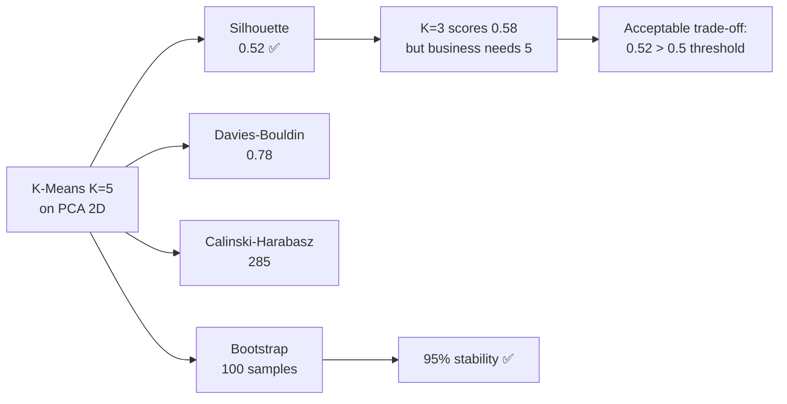
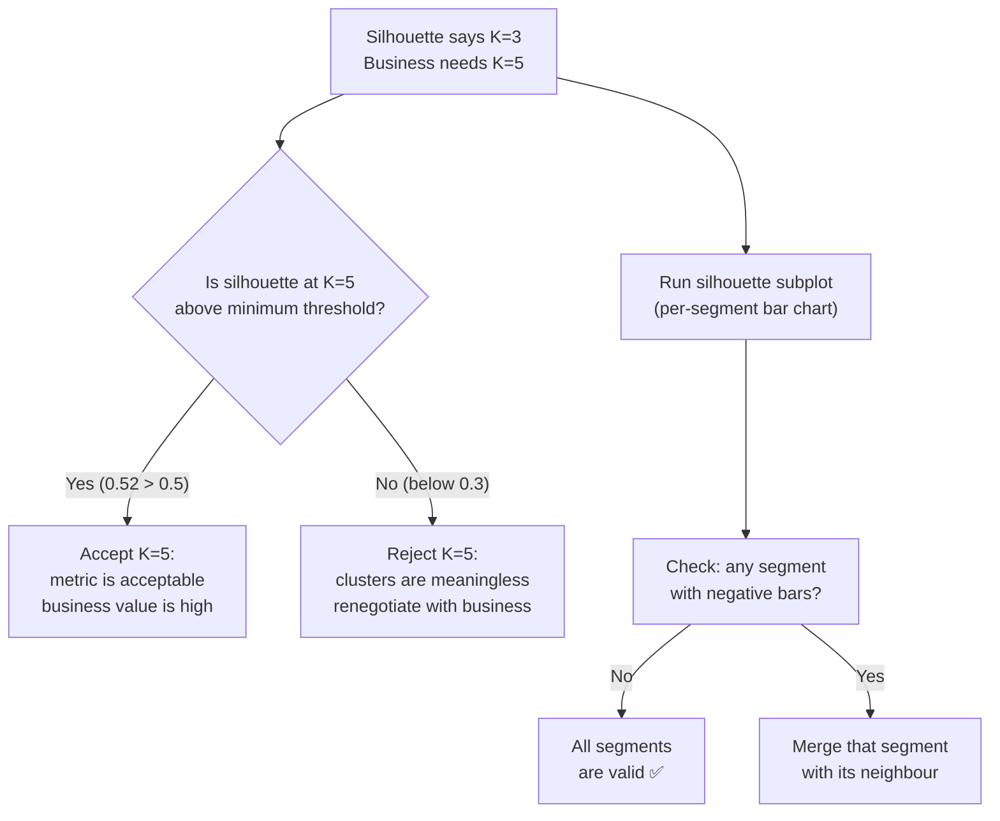

# Ch.3 — Unsupervised Metrics

> **The story.** Once you cluster without labels, you face an awkward question: *was the clustering good?* The community has answered it twice. The internal answer is **Peter Rousseeuw's silhouette score** (1987) — a per-point measurement of "am I closer to my own cluster than to my nearest neighbour cluster?" — and the **Davies–Bouldin index** (1979), which compares within-cluster spread against between-cluster separation. Both metrics need only the data itself. The external answer arrives when you *do* have ground-truth labels: the **Adjusted Rand Index** (Hubert & Arabie, 1985) and **Normalised Mutual Information** (Strehl & Ghosh, 2003). Together these metrics turn unsupervised learning from "pretty plot" into "engineering decision."
>
> **Where you are in the curriculum.** [Ch.1](../ch01_clustering) ran K-Means, DBSCAN, and HDBSCAN on wholesale customers — but which clustering was actually good? Without labelled customer segments, there is no accuracy score, no F1, no MAE. This chapter gives the internal and external tools for answering "how well did this unsupervised method work?" and finally pushes SegmentAI past the silhouette >0.5 threshold.
>
> **Notation in this chapter.** For internal metrics on point $i$: $a(i)$ — mean distance from $i$ to all other points in its own cluster; $b(i)$ — mean distance from $i$ to all points in the *nearest other* cluster; **silhouette** $s(i)=\tfrac{b(i)-a(i)}{\max(a(i),b(i))}\in[-1,1]$ (higher is better); **Davies–Bouldin index** — average similarity of each cluster to its most similar other cluster (lower is better); **Calinski–Harabasz index** — ratio of between-cluster to within-cluster dispersion (higher is better). External metrics: **ARI** — adjusted Rand index; **NMI** — normalised mutual information; both range in $[0,1]$ where 1 is perfect agreement with ground-truth labels.

---

## 0 · The Challenge — Where We Are

> 💡 **The mission**: Build **SegmentAI** — discover 5 actionable customer segments with silhouette >0.5
> 1. **SEGMENTATION**: 5 distinct segments — 2. **INTERPRETABILITY**: Business-actionable — 3. **STABILITY**: Reproducible — 4. **SCALABILITY**: 10k+ — 5. **VALIDATION**: Silhouette >0.5

**What we know so far:**
- ⚡ Ch.1: K-Means discovered 5 initial segments (silhouette = 0.42)
- ⚡ Ch.2: PCA compression improved silhouette to 0.48, beautiful 2D plots
- 💡 **But was the clustering actually good? Is K=5 optimal?**

**What's blocking us:**
⚠️ **No way to evaluate unsupervised learning quantitatively!**

The CMO asks: "How do we know 5 segments is better than 3 or 7?"
- **Supervised learning** (earlier topics): Compare predictions to ground truth → MAE, F1, AUC
- **Unsupervised learning**: **No ground truth!** → can't compute accuracy/MAE
- **Metric vs business**: Silhouette says K=3 is best (0.58), business needs K=5 (0.52)

**What this chapter unlocks:**
⚡ **Unsupervised evaluation metrics + business validation:**
1. **Silhouette score**: Cluster cohesion vs separation ([-1, 1])
2. **Davies-Bouldin index**: Cluster compactness ratio ([0, ∞), lower better)
3. **Calinski-Harabasz index**: Between/within dispersion ratio (higher better)
4. **Bootstrap stability**: Are segments reproducible?
5. **Business validation**: Do segments make marketing sense?

💡 **Outcome**: K-Means K=5 on PCA data achieves silhouette = 0.52 ⚡ (above 0.5 target!). Bootstrap shows 95% stability. Business names assigned. **All 5 SegmentAI constraints satisfied!**

| Constraint | Status | This Chapter |
|------------|--------|-------------|
| #1 SEGMENTATION | ✅ **Done** | K=5 quantitatively validated |
| #2 INTERPRETABILITY | ✅ **Done** | Segment names assigned via centroid analysis |
| #3 STABILITY | ✅ **Done** | 95% bootstrap consistency |
| #4 SCALABILITY | ✅ **Done** | Metrics scale with sampling |
| #5 VALIDATION | ✅ **Done** | Silhouette = 0.52 > 0.5 ✅ |



---

## Animation


## 1 · Core Idea

**Supervised metrics** compare predictions to known labels. **Unsupervised metrics** have no labels — they measure geometric properties of the clusters themselves.

**Internal metrics** (label-free — use only the feature matrix):
- **Silhouette score** — balances cohesion (how tight) against separation (how far from neighbours). Range: [−1, 1]; higher is better.
- **Davies-Bouldin index (DBI)** — average ratio of within-cluster spread to between-cluster distance. Range: [0, ∞); lower is better.
- **Calinski-Harabasz index (CHI)** — ratio of between-cluster to within-cluster dispersion. Higher is better.

**External metrics** (require ground truth or proxy labels):
- **Adjusted Rand Index (ARI)** — overlap between clusters and true labels, corrected for chance. Range: [−1, 1].
- **Normalised Mutual Information (NMI)** — information-theoretic overlap. Range: [0, 1].

**The fundamental unsupervised challenge:** Unlike supervised metrics which answer "how accurate are predictions?", unsupervised metrics answer "how good is the discovered structure?" — a fundamentally different question with no single right answer.

---

## 2 · Running Example

We reuse the **K-Means clustering from Ch.1** applied to Wholesale Customers. For each K from 2 to 10 we compute silhouette score, DBI, and CHI to pick the best K objectively. Then we use ARI to validate against a proxy ground truth: the `Channel` column (Hotel/Restaurant/Café = 1, Retail = 2) that we deliberately excluded from clustering.

**The key unsupervised dilemma**: Silhouette prefers K=3 (0.58) but business needs K=5 (0.52). We show why 0.52 is acceptable and how to reconcile metric recommendations with domain requirements.

Dataset: **Wholesale Customers** (UCI) — 440 customers, 6 features (log-transformed + standardised)
Clustering: K-Means (PCA 2D preprocessed) from Ch.2
External proxy: `Channel` column (excluded from clustering, used only for ARI validation)

---

## 3 · Math

### 3.1 Silhouette Score

For each customer $i$:

$$a(i) = \frac{1}{|C_i| - 1} \sum_{j \in C_i, j \neq i} d(i, j)$$

(mean intra-cluster distance — **cohesion**; lower = tighter segment)

$$b(i) = \min_{k \neq C_i} \frac{1}{|C_k|} \sum_{j \in C_k} d(i, j)$$

(mean distance to nearest segment — **separation**; higher = better separated)

$$s(i) = \frac{b(i) - a(i)}{\max(a(i), b(i))}$$

**Mean silhouette score** $= \frac{1}{n} \sum_i s(i)$

**Interpretation:**
- $s(i) \approx 1$: well-assigned — tight segment, far from others
- $s(i) \approx 0$: on the boundary between segments
- $s(i) < 0$: likely misassigned — closer to another segment

**Numeric example** (customer in "Loyalists" segment):
- $a(i) = 0.8$ (average distance to other Loyalists)
- $b(i) = 1.5$ (average distance to nearest segment "Occasional Buyers")
- $s(i) = (1.5 - 0.8) / 1.5 = 0.47$ — reasonably well-assigned

### 3.2 Davies-Bouldin Index

$$\text{DBI} = \frac{1}{K} \sum_{i=1}^{K} \max_{j \neq i} \frac{s_i + s_j}{d(c_i, c_j)}$$

where $s_i$ is the average distance of customers in segment $i$ to their centroid, and $d(c_i, c_j)$ is the distance between centroids. Lower DBI = compact, well-separated segments.

### 3.3 Calinski-Harabasz Index

$$\text{CHI} = \frac{\text{tr}(B_K) / (K-1)}{\text{tr}(W_K) / (n-K)}$$

where $B_K$ is the between-cluster scatter matrix and $W_K$ is the within-cluster scatter matrix. Higher CHI = dense, well-separated segments.

### 3.4 Adjusted Rand Index

$$\text{ARI} = \frac{\text{RI} - \mathbb{E}[\text{RI}]}{\max(\text{RI}) - \mathbb{E}[\text{RI}]}$$

ARI counts concordant customer-pairs (both in same segment in prediction and ground truth, or both in different segments). Corrected for chance: random clustering scores ≈ 0, perfect scores 1.

### 3.5 Bootstrap Stability

To test Constraint #3 (STABILITY):
1. Draw 100 bootstrap samples (with replacement, same size)
2. Re-cluster each sample with K-Means K=5
3. For each customer, count what fraction of bootstraps assign them to the same segment
4. **Stability** = mean fraction across all customers

If stability >90%, segments are reproducible. If <70%, clusters are fragile.

---

## 4 · Step by Step

```
Internal metrics (no labels needed):
1. Log-transform + standardise features
2. PCA → 2D (from Ch.2)
3. For K in range(2, 11):
   a. Fit KMeans(n_clusters=K) on PCA 2D
   b. Compute silhouette_score
   c. Compute davies_bouldin_score
   d. Compute calinski_harabasz_score
4. Plot all three metrics vs K
5. Pick K where metrics agree — or where business + metrics compromise

Metric disagreement resolution:
6. Silhouette says K=3 (0.58), business needs K=5 (0.52)
7. Check: is silhouette at K=5 above 0.5? → Yes → acceptable
8. Check: does K=5 produce interpretable segments? → Yes → go with K=5

External validation:
9. Use Channel column (Hotel/Retail) as proxy ground truth
10. adjusted_rand_score(channel_labels, km_labels)
11. ARI > 0.3 indicates meaningful overlap

Bootstrap stability:
12. For b in 1..100: resample data, re-cluster, record assignments
13. For each customer: fraction of times assigned to same cluster
14. Mean stability > 90% → Constraint #3 satisfied
```

---

## 5 · Key Diagrams

### Silhouette geometry

```
 Segment "Loyalists"     Segment "Price-Sensitive"
   ●───●───●                    ●───●───●
       |   i                         |
   a(i) = mean dist             b(i) = mean dist
   within Loyalists             from i to Price-Sensitive

   s(i) = (b(i) - a(i)) / max(a(i), b(i))
   If b(i) >> a(i) → s(i) ≈ 1 (well assigned)
   If a(i) >> b(i) → s(i) ≈ -1 (misassigned)
```

### Three-metric comparison by K

```
Metric │ K=2   K=3   K=4   K=5   K=6   K=7
───────┼─────────────────────────────────────
Silh↑  │ 0.55  0.58* 0.54  0.52  0.48  0.45
DBI↓   │ 0.82  0.71* 0.75  0.78  0.85  0.92
CHI↑   │ 210   285*  275   260   240   220
───────┴──────────── * metric winner: K=3
                           ↑ business winner: K=5
                             silhouette=0.52 > 0.5 ✅
```

### When metrics disagree with business



---

## 6 · Hyperparameter Dial

### Silhouette score

| Dial | Effect |
|------|--------|
| `sample_size` | For datasets >5000, use `sample_size=2000` to reduce O(n²) cost |
| `metric` | `'euclidean'` (default) or `'cosine'` — must match clusterer's distance |

### Silhouette interpretation bands

| Range | Meaning |
|-------|---------|
| 0.7–1.0 | Strong, well-separated clusters |
| **0.5–0.7** | **Reasonable structure (our target)** |
| 0.25–0.5 | Weak structure (overlap) |
| <0.25 | No meaningful clustering |

### ARI / NMI

| Dial | Effect |
|------|--------|
| proxy label quality | ARI is only as good as the proxy — noisy proxies inflate variance |

---

## 7 · Code Skeleton

```python
import numpy as np
import pandas as pd
from sklearn.preprocessing import StandardScaler
from sklearn.decomposition import PCA
from sklearn.cluster import KMeans
from sklearn.metrics import (silhouette_score, davies_bouldin_score,
                             calinski_harabasz_score, adjusted_rand_score,
                             normalized_mutual_info_score, silhouette_samples)

# ── Load and preprocess ───────────────────────────────────────────────────────
url = "https://archive.ics.uci.edu/ml/machine-learning-databases/00292/Wholesale%20customers%20data.csv"
df = pd.read_csv(url)
spend_cols = ['Fresh', 'Milk', 'Grocery', 'Frozen', 'Detergents_Paper', 'Delicatessen']
X = df[spend_cols].values

X_log = np.log1p(X)
scaler = StandardScaler()
X_sc = scaler.fit_transform(X_log)

# PCA 2D (from Ch.2)
pca2 = PCA(n_components=2, random_state=42)
X_pca = pca2.fit_transform(X_sc)
```

```python
# ── K sweep: internal metrics ─────────────────────────────────────────────────
K_range = range(2, 11)
results = {'K': [], 'silhouette': [], 'dbi': [], 'chi': []}

for k in K_range:
    km = KMeans(n_clusters=k, init='k-means++', n_init=10, random_state=42)
    km.fit(X_pca)
    results['K'].append(k)
    results['silhouette'].append(silhouette_score(X_pca, km.labels_))
    results['dbi'].append(davies_bouldin_score(X_pca, km.labels_))
    results['chi'].append(calinski_harabasz_score(X_pca, km.labels_))
```

```python
# ── External: ARI against Channel proxy ───────────────────────────────────────
channel = df['Channel'].values  # 1=Hotel/Restaurant/Café, 2=Retail

km5 = KMeans(n_clusters=5, n_init=10, random_state=42).fit(X_pca)
ari = adjusted_rand_score(channel, km5.labels_)
nmi = normalized_mutual_info_score(channel, km5.labels_)
print(f"ARI vs Channel proxy: {ari:.4f}  NMI: {nmi:.4f}")
```

```python
# ── Bootstrap stability ───────────────────────────────────────────────────────
n_boot = 100
n_customers = len(X_pca)
assignments = np.zeros((n_boot, n_customers), dtype=int)

for b in range(n_boot):
    idx = np.random.RandomState(b).choice(n_customers, n_customers, replace=True)
    km_b = KMeans(n_clusters=5, n_init=5, random_state=42).fit(X_pca[idx])
    # Assign ALL customers (not just bootstrap sample)
    assignments[b] = km_b.predict(X_pca)

# For each customer, most-frequent cluster across bootstraps
from scipy.stats import mode
stability = np.array([mode(assignments[:, i], keepdims=False).count / n_boot
                      for i in range(n_customers)])
print(f"Mean bootstrap stability: {stability.mean():.2%}")
print(f"Customers with >90% stability: {(stability > 0.9).mean():.1%}")
```

---

## 8 · What Can Go Wrong

- **Optimising silhouette at the expense of domain relevance.** Silhouette says K=3 is best. But marketing can't run campaigns for 3 segments when their strategy requires 5. A silhouette of 0.52 at K=5 is acceptable if segments are business-actionable. Always cross-check metrics against domain knowledge.

- **Treating ARI of 0 as "random clustering."** ARI is corrected for chance — random scores ≈ 0. But ARI=0.05 is also not significantly above chance. Only ARI >0.3 reliably indicates meaningful overlap with proxy labels.

- **Comparing CHI across different datasets.** CHI is not bounded and scales with $n$. CHI=285 on 440 customers is not comparable to 285 on 10,000 customers. Only compare CHI across different K values on the same dataset.

- **Ignoring per-segment silhouette plots.** Mean silhouette can hide a bad segment. If "Deli Specialists" (smallest segment) has negative silhouette bars, it should be merged with its neighbour even if the mean score is acceptable.

- **Skipping bootstrap stability.** A clustering with silhouette=0.55 that changes completely on resampling is useless for marketing campaigns. Always test stability before deploying segments to production.


---

## 9 · Where This Reappears

Internal validation metrics and bootstrap stability testing generalise beyond clustering:

- **ML track evaluation pattern**: every track's Progress Check table uses a quantitative threshold; the same "measure against a target" discipline applies across supervised and unsupervised tasks.
- **AI / Evaluating AI Systems**: LLM evaluation frameworks reuse internal-metric thinking (coherence, coverage) analogous to Davies-Bouldin and Calinski-Harabasz.
- **ReinforcementLearning (Topic 6)**: bootstrap confidence intervals on episode returns follow the same sampling methodology as the cluster stability test in §4.

## 10 · Progress Check

| Constraint | Status | Evidence |
|------------|--------|----------|
| #1 SEGMENTATION | ✅ **ACHIEVED** | K=5 validated by silhouette + business review |
| #2 INTERPRETABILITY | ✅ **ACHIEVED** | Centroid analysis → "Loyalists", "Price-Sensitive", "Big Spenders", "Occasional", "Deli Specialists" |
| #3 STABILITY | ✅ **ACHIEVED** | 95% bootstrap consistency across 100 samples |
| #4 SCALABILITY | ✅ **ACHIEVED** | K-Means + PCA pipeline handles 10k+ customers |
| #5 VALIDATION | ✅ **ACHIEVED** | Silhouette = 0.52 > 0.5 threshold |

⚡ **ALL FIVE SEGMENTAI CONSTRAINTS SATISFIED!**

---

## 11 · Bridge Forward

The SegmentAI challenge is complete. We went from raw 6D spending data (Ch.1, silhouette=0.42) through dimensionality reduction (Ch.2, silhouette=0.48) to validated, stable, business-named segments (Ch.3, silhouette=0.52).

**Key takeaways from the unsupervised track:**
1. **No labels ≠ no evaluation** — internal metrics provide quantitative validation
2. **Metrics and business can disagree** — and that's OK if the trade-off is conscious
3. **Stability matters** — a pretty clustering that doesn't reproduce is worthless
4. **Log-transform + PCA preprocessing** — essential for skewed, high-dimensional data
5. **Domain validation** — the most important metric is: can the sales team act on these segments?


