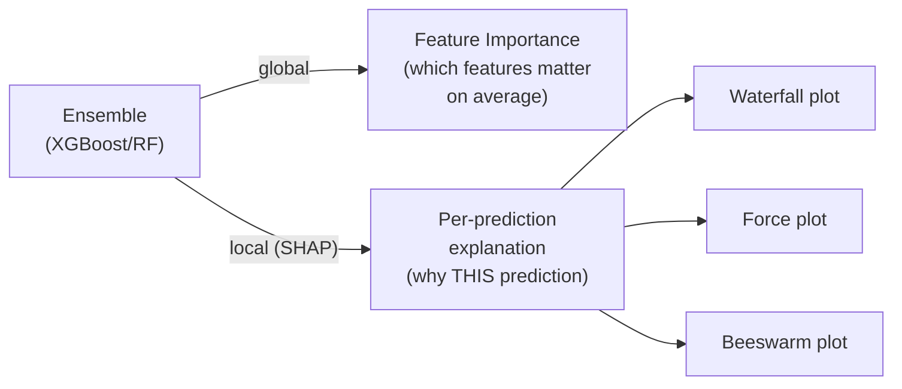
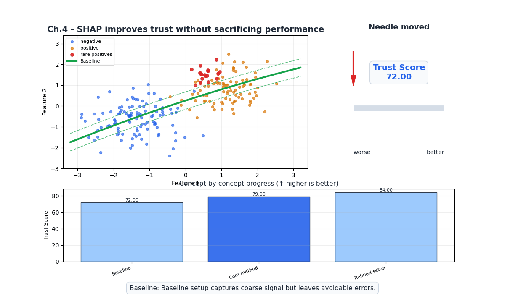
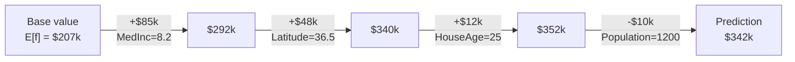
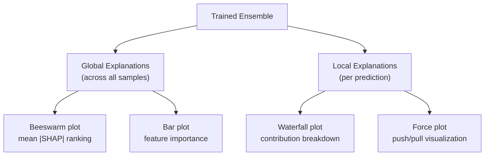

# Ch.4 — SHAP Interpretability

> **The story.** In 1953, **Lloyd Shapley** was studying cooperative game theory — specifically, how to fairly distribute a payout among players who contributed unequally to a coalition's success. His solution — **Shapley values** — assigned each player a contribution based on their marginal effect across all possible coalitions. Sixty years later, **Scott Lundberg and Su-In Lee** (2017) realized that Shapley values could solve ML interpretability: treat each *feature* as a "player" and the model's *prediction* as the "payout." The resulting framework — **SHAP** (SHapley Additive exPlanations) — provides theoretically grounded, locally faithful explanations for any model. For tree-based models, Lundberg's **TreeSHAP** algorithm computes exact Shapley values in polynomial time (not the exponential brute-force), making it practical for production ensembles.
>
> **Where you are.** Chapters 1–3 built increasingly powerful ensembles (RF → GB → XGBoost/LightGBM). But all we have for interpretability is *global* feature importance (which features matter on average). Stakeholders want *local* explanations: "Why did the model predict $350k for *this* district?" and "Why was *this* person classified as Smiling?" SHAP answers both. This chapter is the key to Constraint #4 (INTERPRETABILITY).
>
> **Notation.** $\phi_i$ — Shapley value of feature $i$; $f(\mathbf{x})$ — model prediction; $S$ — subset of features; $f(S)$ — model prediction using only features in $S$ (others marginalized); $n$ — number of features; $E[f]$ — expected prediction (base value).

---

## 0 · The Challenge — Where We Are

> 🎯 **EnsembleAI**: Beat any single model by >5% in MAE/accuracy via intelligent combination.
>
> **5 Constraints**: 1. IMPROVEMENT >5% — 2. DIVERSITY — 3. EFFICIENCY <5× latency — 4. INTERPRETABILITY (SHAP) — 5. ROBUSTNESS (stable across seeds)

**What Ch.1–3 achieved:**
- ✅ Constraints #1, #2, #3, #5 — accurate, fast, diverse, robust ensembles
- ❌ **Constraint #4 (INTERPRETABILITY)**: Only global feature importance — no per-prediction explanations

**What this chapter unlocks:**
- ✅ **Constraint #4**: SHAP provides per-prediction explanations for any ensemble
- 🎯 All 5 constraints now addressed!



---

## Animation



## 1 · Core Idea

**Shapley value** of feature $i$ for prediction $f(\mathbf{x})$: the average marginal contribution of feature $i$ across all possible orderings of features. It answers: "How much did feature $i$ change the prediction compared to the baseline (average prediction)?"

**Key property**: Shapley values **sum to the difference** between the prediction and the baseline:

$$f(\mathbf{x}) = E[f] + \sum_{i=1}^n \phi_i$$

This means SHAP gives a complete, additive decomposition — every dollar (regression) or probability point (classification) is accounted for.

---

## 2 · Running Example

**Regression**: California Housing with XGBoost. For a specific district: "MedInc=8.2 pushed the prediction +$85k above average."

**Classification**: California Housing binarized. "MedInc pushed the probability of high-value +0.25."

---

## 3 · Math

### 3.1 Shapley Value Formula

$$\phi_i = \sum_{S \subseteq N \setminus \{i\}} \frac{|S|! \cdot (n - |S| - 1)!}{n!} \left[f(S \cup \{i\}) - f(S)\right]$$

where $N = \{1, \ldots, n\}$ is the full feature set, and $f(S)$ is the model's expected prediction when only features in $S$ are known (others are marginalized over the training data).

**Numeric example** ($n = 3$ features: A, B, C). For feature A:

| Coalition $S$ | $f(S)$ | $f(S \cup \{A\})$ | Marginal | Weight |
|---|---|---|---|---|
| $\{\}$ | 2.0 | 2.8 | +0.8 | $\frac{0! \cdot 2!}{3!} = \frac{1}{3}$ |
| $\{B\}$ | 2.3 | 3.1 | +0.8 | $\frac{1! \cdot 1!}{3!} = \frac{1}{6}$ |
| $\{C\}$ | 2.1 | 3.0 | +0.9 | $\frac{1! \cdot 1!}{3!} = \frac{1}{6}$ |
| $\{B, C\}$ | 2.5 | 3.4 | +0.9 | $\frac{2! \cdot 0!}{3!} = \frac{1}{3}$ |

$\phi_A = \frac{1}{3}(0.8) + \frac{1}{6}(0.8) + \frac{1}{6}(0.9) + \frac{1}{3}(0.9) = 0.85$

### 3.2 Shapley Properties (Axioms)

| Property | Meaning |
|----------|---------|
| **Efficiency** | $\sum_i \phi_i = f(\mathbf{x}) - E[f]$ (contributions sum to prediction minus baseline) |
| **Symmetry** | If features $i$ and $j$ contribute equally in all coalitions, $\phi_i = \phi_j$ |
| **Dummy** | If feature $i$ never changes the prediction, $\phi_i = 0$ |
| **Linearity** | For combined models, $\phi_i(f + g) = \phi_i(f) + \phi_i(g)$ |

These four axioms *uniquely* determine the Shapley value — there is no other allocation satisfying all four.

### 3.3 TreeSHAP

Exact Shapley computation is $O(2^n)$ — exponential in features. **TreeSHAP** (Lundberg 2018) exploits the tree structure to compute exact Shapley values in $O(TLD^2)$ where $T$ = number of trees, $L$ = max leaves, $D$ = max depth. For typical ensembles (depth 4–6), this is milliseconds per prediction.

### 3.4 SHAP for Classification

For classification, SHAP explains the **log-odds** (or probability):

$$\log\frac{p(\text{positive})}{p(\text{negative})} = E[\text{log-odds}] + \sum_i \phi_i$$

Positive $\phi_i$ → feature pushes toward positive class; negative $\phi_i$ → pushes toward negative.

---

## 4 · Step by Step

```
SHAP Workflow:
1. Train model (XGBoost, LightGBM, RF — any tree model)
2. Create TreeExplainer:
   explainer = shap.TreeExplainer(model)
3. Compute SHAP values:
   shap_values = explainer(X_test)

Per-prediction explanation:
4. Pick a sample: shap.plots.waterfall(shap_values[idx])
   → "MedInc=8.2 pushed +$85k; Latitude=36.5 pushed +$48k; ..."

Global importance:
5. shap.plots.beeswarm(shap_values)
   → Feature importance ranked by mean |SHAP|

Feature interaction:
6. shap.plots.scatter(shap_values[:, "MedInc"], color=shap_values[:, "Latitude"])
   → Non-linear relationship between MedInc and prediction
```

---

## 5 · Key Diagrams

### SHAP waterfall decomposition



### Global vs Local explanations



---

## 6 · Hyperparameter Dial

SHAP itself has no hyperparameters — it's a post-hoc explanation method. But the *model* affects SHAP:

| Model Choice | SHAP Behavior |
|-------------|---------------|
| **Deep trees** | More features interact → SHAP interactions more complex |
| **Shallow trees** | Cleaner, simpler SHAP explanations |
| **Many trees** | SHAP is averaged across trees → more stable |
| **High learning rate** | Individual trees have strong SHAP → noisier explanations |

| SHAP Visualization | When to Use |
|--------------------|-------------|
| **Waterfall** | Explain ONE specific prediction |
| **Force** | Compact single-prediction explanation |
| **Beeswarm** | Global feature importance + direction |
| **Bar** | Quick global importance ranking |
| **Scatter/Dependence** | Feature value vs SHAP contribution (non-linear effects) |

---

## 7 · Code Skeleton

```python
import numpy as np
import shap
from sklearn.datasets import fetch_california_housing
from sklearn.model_selection import train_test_split
from xgboost import XGBRegressor

data = fetch_california_housing()
X, y = data.data, data.target
feature_names = list(data.feature_names)
X_tr, X_te, y_tr, y_te = train_test_split(X, y, test_size=0.2, random_state=42)
```

```python
# ── Train model ───────────────────────────────────────────────────────────────
xgb = XGBRegressor(n_estimators=500, learning_rate=0.05, max_depth=4,
                    random_state=42, verbosity=0)
xgb.fit(X_tr, y_tr)
```

```python
# ── SHAP explanations ─────────────────────────────────────────────────────────
explainer = shap.TreeExplainer(xgb)
shap_values = explainer(X_te)

# Waterfall: explain one prediction
idx = 0
print(f"Prediction: {xgb.predict(X_te[idx:idx+1])[0]:.2f}")
print(f"Base value: {shap_values[idx].base_values:.2f}")
shap.plots.waterfall(shap_values[idx])
```

```python
# ── Global importance (beeswarm) ──────────────────────────────────────────────
shap.plots.beeswarm(shap_values)
```

```python
# ── Dependence plot ───────────────────────────────────────────────────────────
shap.plots.scatter(shap_values[:, "MedInc"])
```

---

## 8 · What Can Go Wrong

| Mistake | Symptom | Fix |
|---------|---------|-----|
| **Using KernelSHAP for trees** | 100× slower than TreeSHAP | Use `shap.TreeExplainer` for tree models |
| **Interpreting SHAP as causal** | "MedInc causes higher prices" | SHAP shows association, not causation |
| **Ignoring base value** | Feature contributions don't "add up" | Always show base value: SHAP values sum to prediction - base |
| **Comparing SHAP across models** | Different models, different base values | Only compare SHAP within the same model |
| **Too many features in waterfall** | Cluttered, hard to read | Use `max_display=10` to show top contributors |

---

## 10 · Progress Check

| # | Constraint | Status | Evidence |
|---|-----------|--------|----------|
| 1 | IMPROVEMENT >5% | ✅ | (Achieved in Ch.1–3) |
| 2 | DIVERSITY | ✅ | (Achieved in Ch.1–3) |
| 3 | EFFICIENCY <5× | ✅ | TreeSHAP is milliseconds per prediction |
| 4 | INTERPRETABILITY | ✅ | **SHAP: per-prediction explanations** |
| 5 | ROBUSTNESS | ✅ | (Achieved in Ch.1–3) |

**All 5 constraints addressed!**

---

## 11 · Bridge to Chapter 5

SHAP explains *individual* ensemble models. But what if we could *combine* different types of models — a Random Forest, an XGBoost, and a linear model — into a super-ensemble? Chapter 5 introduces **stacking and blending**: train a *meta-learner* on the outputs of diverse base models. The meta-learner learns which base model to trust in which region of feature space. SHAP can then explain the meta-learner too.

---

## Appendix A · Evaluation Protocol and Stability Checks

Use this checklist before claiming an ensemble improvement.

### 1) Split Discipline

- Use train/validation/test or nested CV.
- Keep the final test set untouched during model selection.
- For classification with imbalance, use stratified folds.

### 2) Baseline Matrix

Always compare against at least three baselines:

- Best single linear model.
- Best single tree model.
- Best prior ensemble from previous chapter.

Report both absolute and relative gains:

- Regression: MAE, RMSE, median absolute error.
- Classification: macro-F1, PR-AUC, calibrated Brier score.

### 3) Seed Robustness

Run each candidate with 5 random seeds:

- Report mean and standard deviation.
- Reject models with high variance even if one run is best.
- Keep seed list fixed in repo for reproducibility.

### 4) Latency Budget

Capture inference cost with batch size 1 and 32:

- p50 latency, p95 latency.
- model artifact size.
- memory usage during warm and hot runs.

Prefer the smallest model that meets business KPI thresholds.

### 5) Explainability Gate

- SHAP global summary for model-level behavior.
- SHAP local waterfall for representative true positive and false negative cases.
- Document one counterintuitive feature interaction and business interpretation.

### 6) Release Criteria

Promote to production only if all hold:

- Metric gain is statistically stable across folds and seeds.
- p95 latency is within SLA.
- Explanation outputs are coherent for domain reviewers.
- Retraining script reproduces metrics from a clean clone.


