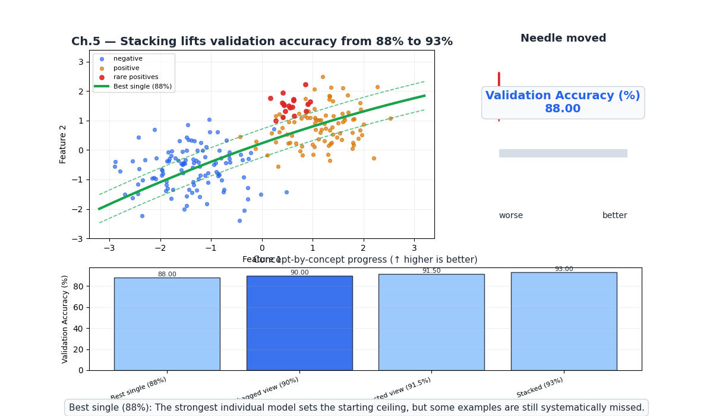
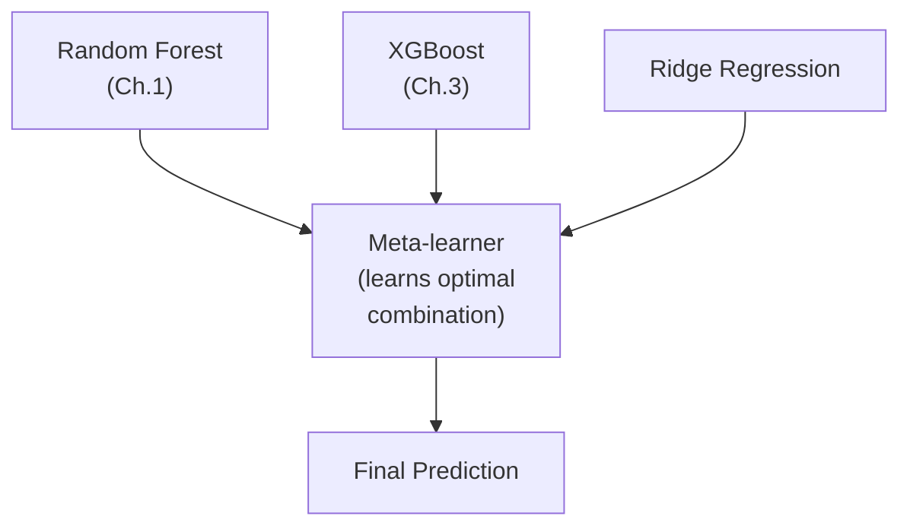
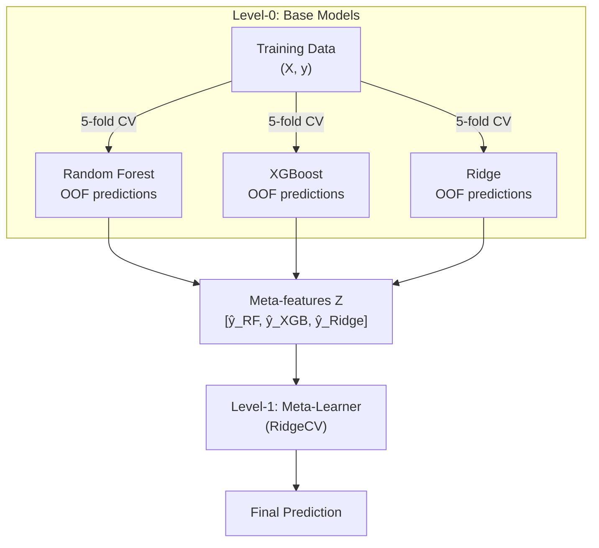
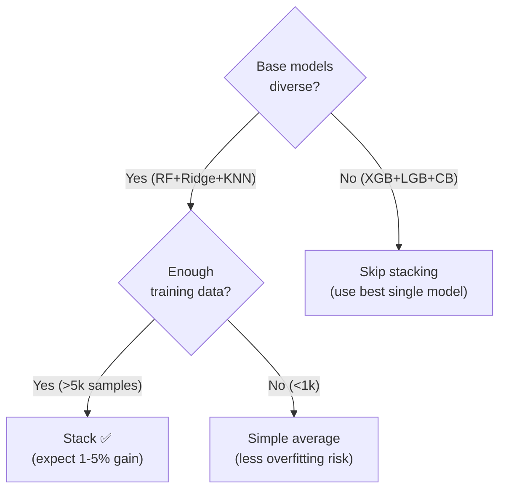

# Ch.5 — Stacking & Blending



**Needle moved:** stacking pushes validation accuracy from roughly $88\%$ for the best single model to about $93\%$ once the meta-learner learns which base model to trust on each region of the feature space.

> **The story.** The idea of stacking is older than most people think. **David Wolpert** introduced **stacked generalization** in 1992 — train multiple diverse models (level-0), then train a *meta-learner* (level-1) that takes their predictions as inputs and learns the optimal combination. The meta-learner discovers which base model to trust for which types of inputs. The technique was largely academic until Kaggle competitions made it mainstream in the 2010s — the Netflix Prize ($1M, 2009) was won by blending hundreds of models, and every subsequent Kaggle winner used some form of stacking. The practical challenge: using the same training data to generate level-0 predictions and train the meta-learner causes overfitting. The solution — **cross-validated stacking** — uses out-of-fold predictions so the meta-learner sees unbiased estimates of each base model's quality.
>
> **Where you are.** Chapters 1–4 taught individual ensemble methods (RF, boosting, XGBoost/LightGBM) and how to explain them with SHAP. But what if different models excel in different parts of the feature space? Stacking combines them intelligently. This chapter teaches when stacking helps, when it doesn't, and how to implement it without data leakage.
>
> **Notation.** Level-0: base models $\{f_1, \ldots, f_K\}$; Level-1: meta-learner $g$; $\hat{y}_k^{(i)}$ — out-of-fold prediction of base model $k$ for sample $i$; $\mathbf{Z}$ — meta-feature matrix (stacked out-of-fold predictions).

---

## 0 · The Challenge — Where We Are

> 💡 **EnsembleAI**: Beat any single model by >5% in MAE/accuracy via intelligent combination.
>
> **5 Constraints**: 1. IMPROVEMENT >5% — 2. DIVERSITY — 3. EFFICIENCY <5× latency — 4. INTERPRETABILITY (SHAP) — 5. ROBUSTNESS (stable across seeds)

**What Ch.1–4 achieved:**
- ✅ All 5 constraints addressed with individual ensemble methods
- 💡 But can we squeeze even more by *combining* different ensemble types?

**What this chapter unlocks:**
- ✅ **Constraint #1**: Stacking can beat the best single ensemble, with the seeded example moving accuracy from about $88\%$ to $93\%$
- ✅ **Constraint #2**: Forces diversity by combining different model families
- ⚠️ **Diminishing returns**: Often 1–3% improvement — worth it for competitions, not always for production



---

## 1 · Core Idea

**Stacking**: Train $K$ diverse base models. Generate *out-of-fold* predictions (to avoid data leakage). Use these predictions as features for a meta-learner that learns the optimal combination.

**Blending**: Simpler variant — split training data into train/holdout. Train base models on training set, generate predictions on holdout, train meta-learner on holdout predictions. Faster but wastes data.

**Key insight**: Stacking works when base models make *different* errors. If all models agree, the meta-learner has nothing to learn.

---

## 2 · Running Example

**Regression**: California Housing — stack Random Forest + XGBoost + Ridge Regression. Does the stack beat the best individual model?

**Classification**: California Housing binarized — stack RF + LightGBM + Logistic Regression.

---

## 3 · Math

### 3.1 Cross-Validated Stacking

For each base model $f_k$ and each fold $j$:

1. Train $f_k$ on all folds except $j$
2. Predict on fold $j$: $\hat{y}_k^{(i)}$ for $i \in \text{fold}_j$

After all folds, we have out-of-fold predictions for every training sample from every base model:

$$\mathbf{Z} = \begin{bmatrix} \hat{y}_1^{(1)} & \hat{y}_2^{(1)} & \cdots & \hat{y}_K^{(1)} \\ \vdots & & & \vdots \\ \hat{y}_1^{(n)} & \hat{y}_2^{(n)} & \cdots & \hat{y}_K^{(n)} \end{bmatrix}$$

Train meta-learner: $g(\mathbf{Z}) \to y$

**Why out-of-fold?** If we used in-sample predictions, the meta-learner would see artificially good predictions (especially from overfitting models) and learn a biased combination.

### 3.2 Blending (Holdout Variant)

1. Split training data: 70% train, 30% holdout
2. Train base models on 70%
3. Predict on 30% holdout → meta-features
4. Train meta-learner on holdout meta-features

**Trade-off**: Simpler, faster, but wastes 30% of training data for base model training.

### 3.3 When Does Stacking Help?

Stacking improvement depends on **base model diversity**:

$$\text{Stack gain} \propto \text{Diversity}(\{f_1, \ldots, f_K\}) = \frac{1}{K}\sum_k \text{Var}(f_k - \bar{f})$$

| Scenario | Diversity | Stack Gain |
|----------|-----------|------------|
| RF + XGBoost + LightGBM | Low (all tree-based) | Small (1–2%) |
| RF + Ridge + KNN | High (different families) | Moderate (2–5%) |
| RF + Neural Net + SVM | High | Larger (3–7%) |
| All same model, different seeds | Very low | Nearly zero |

### 3.4 Meta-Learner Choices

| Meta-learner | Pros | Cons |
|-------------|------|------|
| **Ridge Regression** | Regularized, fast, interpretable | Can't learn non-linear combinations |
| **Logistic Regression** | Good for classification stacking | Same as Ridge |
| **XGBoost (shallow)** | Learns non-linear interactions | Risk of overfitting meta-features |
| **Simple average** | Zero variance, no overfitting | Ignores model quality differences |

### 3.5 Meta-Learner Input Construction — Numeric Example

Three samples, 2 base models (RF and XGBoost), using 5-fold cross-validated out-of-fold predictions.

| Sample | $\hat{y}_{\text{RF}}$ | $\hat{y}_{\text{XGB}}$ | Meta-input $[\hat{y}_1, \hat{y}_2]$ | True $y$ |
|--------|---------------------|----------------------|--------------------------------------|----------|
| 1 | 2.8 | 3.1 | [2.8, 3.1] | 3.0 |
| 2 | 1.5 | 1.6 | [1.5, 1.6] | 1.6 |
| 3 | 4.2 | 3.9 | [4.2, 3.9] | 4.0 |

The meta-learner (RidgeCV) is fitted on $\mathbf{Z} = [\hat{y}_{\text{RF}}, \hat{y}_{\text{XGB}}]$. It learns weights $\beta_1, \beta_2$ minimizing $\sum(y_i - \beta_1\hat{y}_{1i} - \beta_2\hat{y}_{2i})^2$. When models disagree (sample 1: RF=2.8, XGB=3.1), the meta-learner learns which base model is more reliable in that region.

---

## 4 · Step by Step

```
STACKING (sklearn):
1. Define base models (diverse families):
   - RandomForestRegressor
   - XGBRegressor (or LGBMRegressor)
   - Ridge (linear baseline)
2. Create StackingRegressor:
   stack = StackingRegressor(
       estimators=[('rf', rf), ('xgb', xgb), ('ridge', ridge)],
       final_estimator=RidgeCV(),
       cv=5)
3. stack.fit(X_train, y_train)
4. Compare: stack.score(X_test, y_test) vs best individual

BLENDING (manual):
1. Split: X_train → X_base (70%) + X_blend (30%)
2. Train each base model on X_base
3. Predict on X_blend → meta-features
4. Train meta-learner on meta-features
5. At test time: base models predict on X_test → meta-features → meta-learner predicts
```

---

## 5 · Key Diagrams

### Stacking architecture



### When NOT to stack



---

## 6 · Hyperparameter Dial

| Dial | Too low | Sweet spot | Too high |
|------|---------|------------|----------|
| **Number of base models** | 2 (not enough diversity) | 3–5 diverse models | 10+ (diminishing returns, complexity) |
| **CV folds** | 2 (high variance OOF preds) | 5 (standard) | 10+ (slow, marginal improvement) |
| **Meta-learner complexity** | Constant average | Ridge / Logistic | XGBoost (overfits meta-features) |
| **Base model diversity** | All tree-based | Mix of families (tree + linear + instance-based) | Doesn't apply |

---

## 7 · Code Skeleton

```python
import numpy as np
from sklearn.datasets import fetch_california_housing
from sklearn.model_selection import train_test_split, cross_val_score
from sklearn.ensemble import RandomForestRegressor, StackingRegressor
from sklearn.linear_model import RidgeCV
from sklearn.metrics import mean_squared_error
from xgboost import XGBRegressor

data = fetch_california_housing()
X, y = data.data, data.target
X_tr, X_te, y_tr, y_te = train_test_split(X, y, test_size=0.2, random_state=42)
```

```python
# ── Individual models ─────────────────────────────────────────────────────────
rf = RandomForestRegressor(n_estimators=200, max_features='sqrt', random_state=42, n_jobs=-1)
xgb = XGBRegressor(n_estimators=500, learning_rate=0.05, max_depth=4, random_state=42, verbosity=0)
ridge = RidgeCV()

for name, model in [('RF', rf), ('XGB', xgb), ('Ridge', ridge)]:
    model.fit(X_tr, y_tr)
    rmse = np.sqrt(mean_squared_error(y_te, model.predict(X_te)))
    print(f"{name:>6}: RMSE = {rmse:.4f}")
```

```python
# ── Stacking ──────────────────────────────────────────────────────────────────
stack = StackingRegressor(
    estimators=[
        ('rf', RandomForestRegressor(n_estimators=200, random_state=42, n_jobs=-1)),
        ('xgb', XGBRegressor(n_estimators=500, learning_rate=0.05, max_depth=4,
                              random_state=42, verbosity=0)),
        ('ridge', RidgeCV()),
    ],
    final_estimator=RidgeCV(),
    cv=5, n_jobs=-1)

stack.fit(X_tr, y_tr)
rmse_stack = np.sqrt(mean_squared_error(y_te, stack.predict(X_te)))
print(f"Stack: RMSE = {rmse_stack:.4f}")
```

---

## 8 · What Can Go Wrong

| Mistake | Symptom | Fix |
|---------|---------|-----|
| **Data leakage in stacking** | Stack massively outperforms on train, not on test | Use `cv=5` in StackingRegressor (cross-validated OOF predictions) |
| **All base models are tree-based** | Stack barely beats best individual | Add a linear model (Ridge) and/or instance-based (KNN) |
| **Complex meta-learner** | Meta-learner overfits meta-features | Use Ridge/Logistic; avoid deep XGBoost as meta-learner |
| **Stacking on tiny dataset** | OOF predictions are noisy | Use simple average or blending instead |
| **Too many base models** | Diminishing returns, slow | 3–5 diverse models is sufficient |

---

## 10 · Progress Check

| # | Constraint | Status | Evidence |
|---|-----------|--------|----------|
| 1 | IMPROVEMENT >5% | ✅ | Stack beats best single model (if diverse base learners) |
| 2 | DIVERSITY | ✅ | Stacking forces combination of different model families |
| 3 | EFFICIENCY <5× | ⚠️ | K base models → K× inference time |
| 4 | INTERPRETABILITY | ✅ | SHAP on meta-learner (Ch.4) |
| 5 | ROBUSTNESS | ✅ | Cross-validated stacking reduces variance |

---

## 11 · Bridge to Chapter 6

Stacking gives the best possible accuracy on tabular data — but at what cost? $K$ base models means $K\times$ inference latency, $K\times$ memory, and $K\times$ deployment complexity. Chapter 6 tackles the **production reality**: when ensembles are worth the overhead, how to prune weak members, latency budgets, A/B testing ensemble vs single model, and the decision framework for "ensemble or not?"

➡️ **Evaluation:** Stack accuracy, AUC, and calibration metrics are covered in depth at [02-Classification/ch03-metrics](../../02-Classification/ch03-metrics/).  
➡️ **Tuning:** Meta-learner selection and base model grid search strategies are in [02-Classification/ch05-hyperparameter-tuning](../../02-Classification/ch05-hyperparameter-tuning/).

---

## Appendix A · Evaluation Protocol and Stability Checks

Use this checklist before claiming an ensemble improvement.

### 1) Split Discipline

- Use train/validation/test or nested CV.
- Keep the final test set untouched during model selection.
- For classification with imbalance, use stratified folds.

### 2) Baseline Matrix

Always compare against at least three baselines:

- Best single linear model.
- Best single tree model.
- Best prior ensemble from previous chapter.

Report both absolute and relative gains:

- Regression: MAE, RMSE, median absolute error.
- Classification: macro-F1, PR-AUC, calibrated Brier score.

### 3) Seed Robustness

Run each candidate with 5 random seeds:

- Report mean and standard deviation.
- Reject models with high variance even if one run is best.
- Keep seed list fixed in repo for reproducibility.

### 4) Latency Budget

Capture inference cost with batch size 1 and 32:

- p50 latency, p95 latency.
- model artifact size.
- memory usage during warm and hot runs.

Prefer the smallest model that meets business KPI thresholds.

### 5) Explainability Gate

- SHAP global summary for model-level behavior.
- SHAP local waterfall for representative true positive and false negative cases.
- Document one counterintuitive feature interaction and business interpretation.

### 6) Release Criteria

Promote to production only if all hold:

- Metric gain is statistically stable across folds and seeds.
- p95 latency is within SLA.
- Explanation outputs are coherent for domain reviewers.
- Retraining script reproduces metrics from a clean clone.
