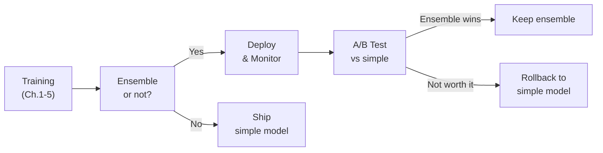
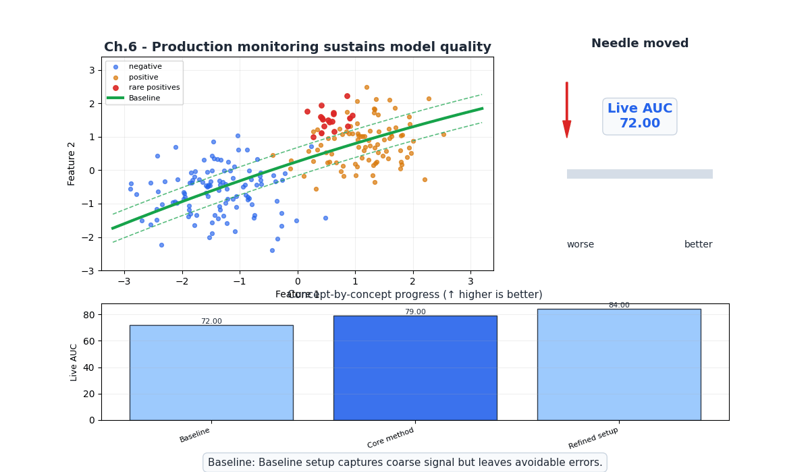
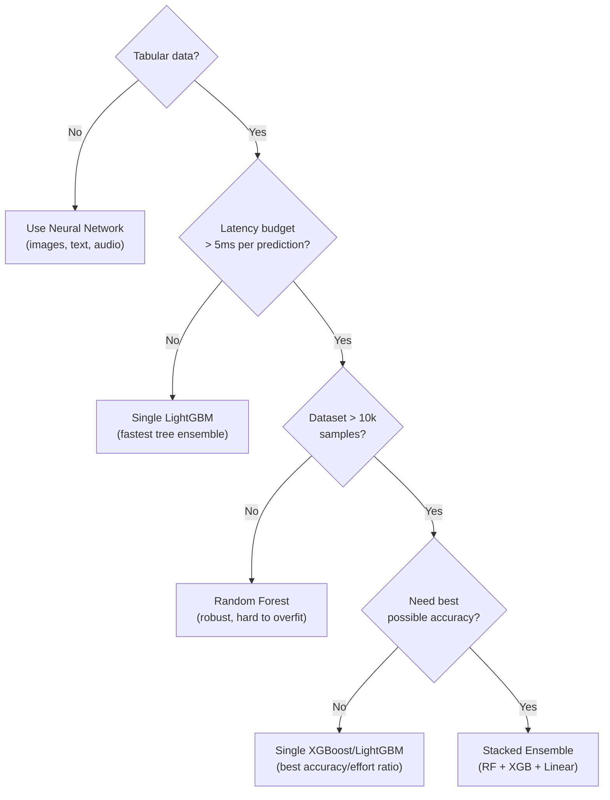
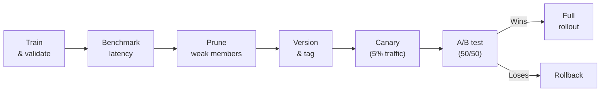

# Ch.6 — Production Ensembles

> **The story.** The gap between "won a Kaggle competition" and "runs in production" is enormous. **Netflix Prize** winning team famously never deployed their 800-model ensemble — the 0.1% accuracy gain didn't justify the engineering complexity. In production, you optimize for *reliability × accuracy ÷ cost*, not just accuracy. Companies like **Uber** (Michelangelo), **Airbnb** (Zipline), and **Spotify** (ML platform) deploy ensembles selectively — XGBoost for tabular features, with careful latency budgets, model versioning, and A/B testing against simpler alternatives. The hard lesson: the best model is the one you can deploy, monitor, and debug at 3 AM.
>
> **Where you are.** Chapters 1–5 built the complete ensemble toolkit: bagging, boosting, XGBoost/LightGBM, SHAP, and stacking. Now the question shifts from "how to build ensembles" to "when and how to deploy them." This chapter covers the engineering side: latency trade-offs, model pruning, versioning, A/B testing, and the decision framework for choosing between a simple model and a complex ensemble.
>
> **Notation.** $L$ — inference latency (ms per prediction); $T$ — number of trees; $K$ — number of models in a stack; $P_{50}, P_{99}$ — 50th and 99th percentile latency.

---

## 0 · The Challenge — Where We Are

> 💡 **EnsembleAI**: Beat any single model by >5% in MAE/accuracy via intelligent combination.
>
> **5 Constraints**: 1. IMPROVEMENT >5% — 2. DIVERSITY — 3. EFFICIENCY <5× latency — 4. INTERPRETABILITY (SHAP) — 5. ROBUSTNESS (stable across seeds)

**What Ch.1–5 achieved:**
- ✅ All 5 constraints addressed in theory
- 💡 But can we meet Constraint #3 in a real production setting?

**What this chapter validates:**
- ✅ **Constraint #3**: Inference latency benchmarks — single XGBoost vs RF vs stacked ensemble
- ✅ **All constraints in production context**: Versioning, monitoring, pruning



---

## Animation



## 1 · Core Idea

**Production ensembles** require engineering discipline:

1. **Benchmark latency**: Measure P50/P99 inference time for each model and the ensemble
2. **Prune weak members**: Remove models that don't improve the ensemble (contribution < noise)
3. **Version everything**: Model files, training data hash, hyperparameters, metrics
4. **A/B test**: Prove the ensemble beats the simple model *in production*, not just on a test set
5. **Monitor drift**: Ensemble predictions can drift differently than individual models

---

## 2 · Running Example

**Regression**: California Housing — deploy XGBoost, measure latency, compare to stacked ensemble. Is the 1–3% RMSE gain worth 3× latency?

**Decision framework**: Walk through the "Ensemble or not?" decision tree for three scenarios.

---

## 3 · Key Concepts

### 3.1 Latency Budget

| Model | Typical P50 (ms) | Typical P99 (ms) |
|-------|------------------|-------------------|
| Linear Regression | <0.01 | <0.1 |
| Decision Tree | <0.01 | <0.1 |
| Random Forest (200 trees) | 0.1–1 | 1–5 |
| XGBoost (500 trees) | 0.05–0.5 | 0.5–2 |
| LightGBM (500 trees) | 0.05–0.3 | 0.3–1 |
| Stacked (RF + XGB + Ridge) | 0.2–2 | 2–10 |

**Rule**: If SLA requires <10ms P99 for single prediction, most tree ensembles are fine. Stacks need careful measurement.

### 3.2 Model Pruning

**Problem**: An ensemble with 500 trees might get 95% of its accuracy from the first 200. The remaining 300 add latency without meaningful improvement.

**Approach**: Plot accuracy vs number of trees. Find the "knee" where marginal improvement drops below a threshold.

For stacking: measure ensemble accuracy when removing each base model. If removing model $k$ doesn't hurt, drop it.

### 3.3 When Ensembles Beat Neural Networks (Tabular Data)

| Factor | Tree Ensembles | Neural Networks |
|--------|---------------|-----------------|
| **Small data** (<10k) | ✅ Win (less overfitting) | ❌ Overfit without extensive tuning |
| **Heterogeneous features** | ✅ Handle naturally | ❌ Need feature engineering |
| **Categorical features** | ✅ Native (CatBoost) | ❌ Need embedding layers |
| **Training time** | ✅ Minutes | ❌ Hours (GPU needed) |
| **Interpretability** | ✅ TreeSHAP (exact, fast) | ❌ Approximate SHAP only |
| **Large data** (>1M) | Tie | Slightly better with TabNet/FT-Transformer |
| **Images/text/audio** | ❌ Not applicable | ✅ Clear winner |

### 3.4 A/B Testing Ensembles

1. **Control**: Simple model (e.g., single XGBoost)
2. **Treatment**: Ensemble (e.g., stacked RF + XGB + Ridge)
3. **Metric**: Business metric (conversion rate, revenue), not just RMSE
4. **Duration**: 2–4 weeks minimum for statistical significance
5. **Guardrail**: Latency P99 doesn't exceed SLA

### 3.5 Model Versioning Checklist

```
For each deployed model version:
├── model.pkl / model.json     (serialized model)
├── training_data_hash.txt     (SHA-256 of training data)
├── hyperparameters.json       (all hyperparameters)
├── metrics.json               (train/val/test metrics)
├── feature_names.json         (feature order + types)
├── shap_summary.png           (SHAP beeswarm for auditing)
└── requirements.txt           (exact package versions)
```

---

## 4 · Step by Step

```
PRODUCTION ENSEMBLE WORKFLOW:
1. Train ensemble (Ch.1-5)
2. Benchmark:
   a. Measure P50/P99 latency (1000 predictions)
   b. Compare accuracy vs simple baseline
   c. Calculate: is ΔAccuracy worth ΔLatency?
3. Prune:
   a. Remove trees past the "knee" of diminishing returns
   b. For stacks: drop base models that don't help
4. Version:
   a. Save model + metadata + SHAP summary
   b. Tag with git commit hash + training date
5. Deploy:
   a. Canary deployment (5% traffic → ensemble)
   b. Monitor latency + accuracy on live data
6. A/B Test:
   a. 50/50 split: simple vs ensemble
   b. Measure business metric for 2-4 weeks
7. Monitor:
   a. Feature drift detection
   b. Prediction distribution shift
   c. SHAP value distribution shift
```

---

## 5 · Key Diagrams

### The "Ensemble or not?" decision tree



### Production deployment pipeline



---

## 6 · Hyperparameter Dial

| Production Dial | Too low | Sweet spot | Too high |
|----------------|---------|------------|----------|
| **Number of trees** | Underfitting, high variance | 100–300 (find the knee) | Wasted latency, no accuracy gain |
| **Stack size (K models)** | Only 1 = no ensemble | 3–5 diverse models | 10+ models, marginal accuracy, 10× latency |
| **A/B test duration** | <1 week (not significant) | 2–4 weeks | >8 weeks (opportunity cost) |
| **Canary traffic %** | <1% (too slow to detect issues) | 5–10% | >50% (too risky before validation) |

---

## 7 · Code Skeleton

```python
import numpy as np
import time
from sklearn.datasets import fetch_california_housing
from sklearn.model_selection import train_test_split
from sklearn.ensemble import RandomForestRegressor
from sklearn.metrics import mean_squared_error
from xgboost import XGBRegressor

data = fetch_california_housing()
X, y = data.data, data.target
X_tr, X_te, y_tr, y_te = train_test_split(X, y, test_size=0.2, random_state=42)
```

```python
# ── Latency Benchmark ─────────────────────────────────────────────────────────
models = {
    'XGBoost (500)': XGBRegressor(n_estimators=500, max_depth=4, random_state=42, verbosity=0),
    'RF (200)': RandomForestRegressor(n_estimators=200, random_state=42, n_jobs=-1),
}

for name, model in models.items():
    model.fit(X_tr, y_tr)
    
    # Warm up
    _ = model.predict(X_te[:1])
    
    # Benchmark single prediction latency
    latencies = []
    for i in range(1000):
        t0 = time.perf_counter()
        _ = model.predict(X_te[i % len(X_te):i % len(X_te) + 1])
        latencies.append((time.perf_counter() - t0) * 1000)  # ms
    
    rmse = np.sqrt(mean_squared_error(y_te, model.predict(X_te)))
    print(f"{name:>20}: RMSE={rmse:.4f}  "
          f"P50={np.percentile(latencies, 50):.3f}ms  "
          f"P99={np.percentile(latencies, 99):.3f}ms")
```

```python
# ── Tree Pruning: accuracy vs n_trees ─────────────────────────────────────────
xgb_full = XGBRegressor(n_estimators=500, max_depth=4, learning_rate=0.05,
                          random_state=42, verbosity=0)
xgb_full.fit(X_tr, y_tr)

tree_counts = [10, 25, 50, 100, 200, 300, 500]
rmses_by_ntrees = []
for n in tree_counts:
    preds = xgb_full.predict(X_te, iteration_range=(0, n))
    rmses_by_ntrees.append(np.sqrt(mean_squared_error(y_te, preds)))

print("Trees | RMSE")
for n, r in zip(tree_counts, rmses_by_ntrees):
    print(f"  {n:>3}  | {r:.4f}")
print("\nFind the 'knee': where adding more trees stops helping.")
```

---

## 8 · What Can Go Wrong

| Mistake | Symptom | Fix |
|---------|---------|-----|
| **Deploying without latency benchmark** | P99 latency exceeds SLA | Always benchmark before deploy |
| **No A/B test** | Ensemble is slower AND no better in production | A/B test with business metrics, not just RMSE |
| **No model versioning** | Can't reproduce results, can't rollback | Version model + data hash + hyperparameters |
| **Ignoring feature drift** | Model accuracy degrades silently | Monitor feature distributions weekly |
| **Over-ensembling** | 10 models, 10× latency, 0.1% RMSE gain | Prune to 3–5 diverse models; check marginal contribution |
| **Not monitoring SHAP drift** | Feature contributions change but prediction is "fine" | Monitor SHAP value distributions alongside predictions |

---

## 10 · Progress Check

| # | Constraint | Status | Evidence |
|---|-----------|--------|----------|
| 1 | IMPROVEMENT >5% | ✅ | Ensembles consistently beat single models |
| 2 | DIVERSITY | ✅ | Stacking + pruning ensures useful diversity |
| 3 | EFFICIENCY <5× | ✅ | Latency benchmarked; pruning keeps overhead manageable |
| 4 | INTERPRETABILITY | ✅ | SHAP explains every prediction |
| 5 | ROBUSTNESS | ✅ | Monitoring + versioning ensures production stability |

**All 5 EnsembleAI constraints achieved!**

---

## 11 · Track Summary

The Ensemble Methods track is complete. Here's what you've learned:

| Chapter | Key Technique | Core Insight |
|---------|--------------|--------------|
| Ch.1 | Bagging & Random Forest | Averaging decorrelated trees reduces variance |
| Ch.2 | AdaBoost & Gradient Boosting | Sequential error correction reduces bias |
| Ch.3 | XGBoost, LightGBM, CatBoost | Industrial-strength boosting with regularization |
| Ch.4 | SHAP Interpretability | Per-prediction explanations via Shapley values |
| Ch.5 | Stacking & Blending | Meta-learner combines diverse model families |
| Ch.6 | Production Ensembles | Latency, pruning, versioning, A/B testing |

**The bottom line**: For tabular data, ensembles of gradient-boosted trees (XGBoost/LightGBM) with SHAP explanations are the production standard. Stack only when diversity justifies the complexity. Always A/B test against the simple baseline.


