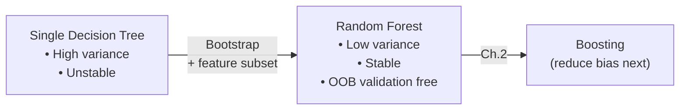
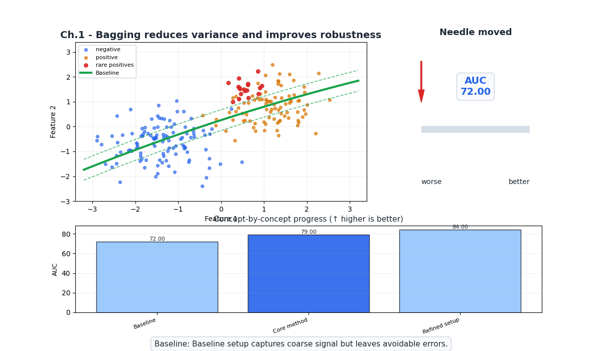
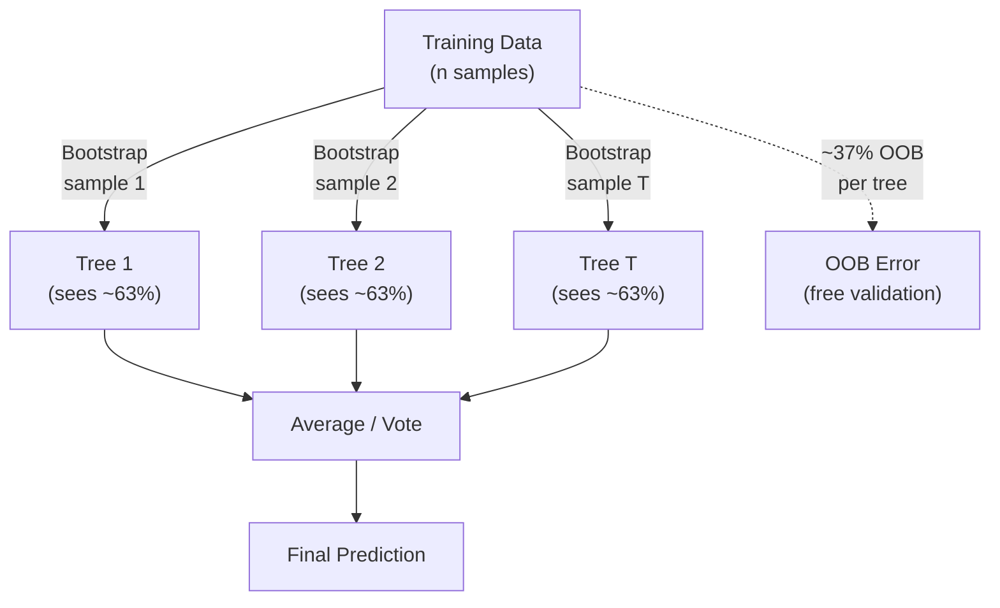
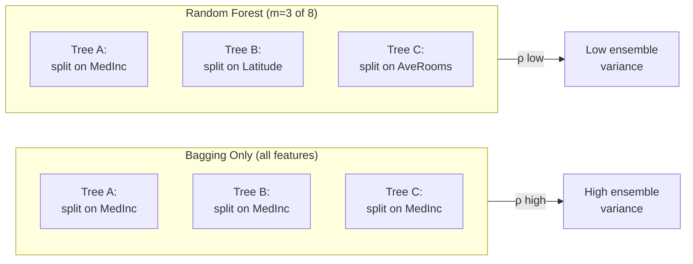
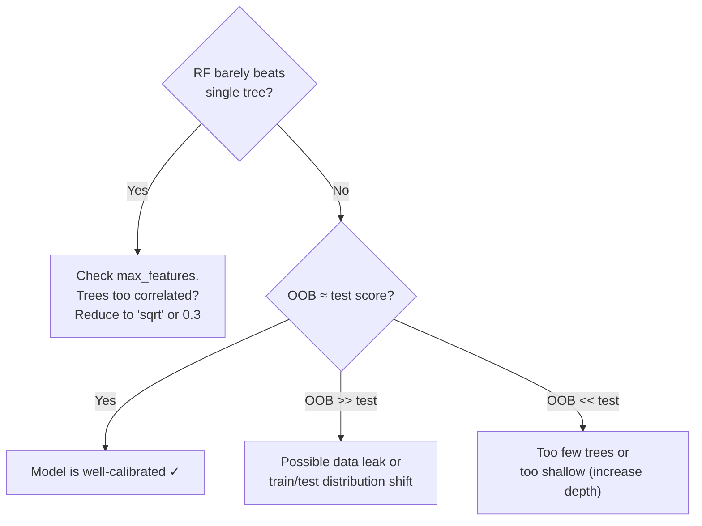
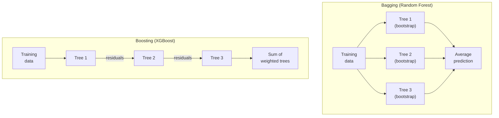

# Ch.1 — Bagging & Random Forest

> **The story.** In 1994, **Leo Breiman** was puzzling over an uncomfortable truth: decision trees are *unstable*. Change a handful of training points and the entire tree structure rearranges. His insight was radical in its simplicity — train many trees on randomly resampled data, then average. He called it **bagging** (bootstrap aggregating), published in 1996. The variance of the average of $N$ independent estimators is $\frac{1}{N}$ of a single estimator's variance. But real trees aren't independent — they tend to split on the same dominant features. So in 2001, Breiman added a second layer of randomness: at each split, only consider a random subset of features. The result — **Random Forests** — became one of the most successful algorithms in machine learning history. Two decades later, Random Forests remain the go-to baseline for tabular data: robust, parallelizable, and remarkably hard to overfit.
>
> **Where you are.** Single decision trees are interpretable but fragile — small data perturbations produce completely different trees, and a single deep tree memorizes noise. This chapter attacks the variance problem directly: train hundreds of deliberately different trees and average their predictions. The result is a model that's both accurate *and* stable. This is the first chapter of the Ensemble Methods track — you're building the foundation for boosting (Ch.2), advanced frameworks (Ch.3), and stacking (Ch.5).
>
> **Notation.** $T$ — number of trees (a.k.a. `n_estimators`); $B_t$ — bootstrap sample for tree $t$; $\hat{f}_t(\mathbf{x})$ — prediction of tree $t$; $\bar{f}(\mathbf{x}) = \frac{1}{T}\sum_{t=1}^T \hat{f}_t(\mathbf{x})$ — ensemble prediction (regression: average; classification: majority vote); OOB — out-of-bag samples (~37% not drawn in each bootstrap); $m$ — number of features considered per split (`max_features`).

---

## 0 · The Challenge — Where We Are

> 💡 **EnsembleAI**: Beat any single model by >5% in MAE/accuracy via intelligent combination.
>
> **5 Constraints**: 1. IMPROVEMENT >5% — 2. DIVERSITY — 3. EFFICIENCY <5× latency — 4. INTERPRETABILITY (SHAP) — 5. ROBUSTNESS (stable across seeds)

**What we know so far:**
- Decision trees are interpretable but have high variance (different splits per seed)
- Linear models are stable but can't capture non-linear patterns
- **Question**: Can we get the best of both worlds?

**What this chapter unlocks:**
- ✅ **Constraint #1 (IMPROVEMENT)**: Random Forest beats single Decision Tree by >5% RMSE
- ✅ **Constraint #2 (DIVERSITY)**: Bootstrap sampling + feature randomization → decorrelated trees
- ✅ **Constraint #5 (ROBUSTNESS)**: Averaging 200 trees → stable predictions across seeds

**What's still missing:**
- ❌ Constraint #3 (EFFICIENCY): Not yet tested latency budgets
- ❌ Constraint #4 (INTERPRETABILITY): Feature importance is global only — need per-prediction SHAP (Ch.4)



---

## Animation



## 1 · Core Idea

Train $T$ decision trees, each on a different **bootstrap sample** (random sample with replacement) of the training data, and at each split consider only $m$ randomly chosen features out of $p$ total. Average the predictions (regression) or take a majority vote (classification). The ensemble's variance is dramatically lower than any single tree's, while bias stays roughly the same. The ~37% of training samples *not* drawn into each tree's bootstrap — the **out-of-bag (OOB)** samples — provide a free validation estimate without needing a separate holdout set.

---

## 2 · Running Example

**Regression**: California Housing — predict `MedHouseVal` (median house value in $100k units) from 8 features. A single Decision Tree achieves RMSE ≈ 0.74; can Random Forest beat it by >5%?

**Classification**: California Housing binarized — predict whether a district is "high-value" (above median). A single Decision Tree achieves F1 ≈ 0.80; can Random Forest improve stability and accuracy?

Dataset: `sklearn.datasets.fetch_california_housing()`  
Features: MedInc, HouseAge, AveRooms, AveBedrms, Population, AveOccup, Latitude, Longitude

---

## 3 · Math

### 3.1 Bootstrap Sampling

Draw $n$ samples **with replacement** from a training set of size $n$. Each bootstrap sample $B_t$ contains ~63% of the original points (on average). The remaining ~37% are the **OOB set** for tree $t$.

**Probability a given sample is NOT drawn:**

$$P(\text{not drawn in } n \text{ draws}) = \left(1 - \frac{1}{n}\right)^n \xrightarrow{n \to \infty} \frac{1}{e} \approx 0.368$$

**Numeric example** ($n = 10$): Each draw has $\frac{9}{10}$ chance of missing sample $i$. After 10 draws: $(0.9)^{10} = 0.349$. So ~35% of samples are OOB — close to the asymptotic 36.8%.

### 3.2 Variance of an Ensemble

For $T$ models, each with variance $\sigma^2$ and pairwise correlation $\rho$:

$$\text{Var}(\bar{f}) = \rho\sigma^2 + \frac{1 - \rho}{T} \sigma^2$$

| Term | Meaning | How to reduce |
|------|---------|---------------|
| $\rho\sigma^2$ | Irreducible floor (correlated component) | Reduce $\rho$ via feature randomization (`max_features`) |
| $\frac{1-\rho}{T}\sigma^2$ | Reducible component | Increase $T$ (more trees) |

**Numeric example**: Single tree $\sigma^2 = 0.25$. If trees are fully correlated ($\rho = 1$): ensemble variance = $0.25$ (no improvement!). If $\rho = 0.3$ with $T = 200$: variance = $0.3 \times 0.25 + \frac{0.7}{200} \times 0.25 = 0.075 + 0.00088 = 0.076$ — a **70% reduction**.

**Key insight**: Decorrelation ($\downarrow\rho$) matters more than adding trees ($\uparrow T$) once $T$ is large enough.

### 3.3 Feature Randomization

At each split, Random Forest considers only $m$ of $p$ features:

| Task | Default $m$ | Why |
|------|-------------|-----|
| Classification | $\lfloor\sqrt{p}\rfloor$ | More randomness → more decorrelation (classification trees are greedier) |
| Regression | $p$ (all features, sklearn ≥1.3) or $p/3$ | Regression trees benefit from seeing more features per split |

With $p = 8$ features and $m = \sqrt{8} \approx 3$: each split "sees" only 3 of 8 features. Different trees will split on different features → lower $\rho$ → lower ensemble variance.

### 3.4 OOB Error Estimation

For each training sample $i$, collect predictions only from trees where $i$ was OOB:

$$\hat{y}_i^{\text{OOB}} = \frac{1}{|T_i^{\text{OOB}}|} \sum_{t \in T_i^{\text{OOB}}} \hat{f}_t(\mathbf{x}_i)$$

The OOB error is the average loss over all training samples using only their OOB predictions. It approximates leave-one-out cross-validation — for free.

### 3.5 Bagging Vote Aggregation — Numeric Example

Three decision stumps trained on separate bootstrap samples, predicting class (0 = low-value, 1 = high-value) for 5 test samples.

| Sample | Stump 1 | Stump 2 | Stump 3 | Majority Vote | True Label |
|--------|---------|---------|---------|--------------|------------|
| A | 1 | 1 | 0 | **1** (2/3) | 1 ✅ |
| B | 0 | 0 | 1 | **0** (2/3) | 0 ✅ |
| C | 1 | 0 | 0 | **0** (2/3) | 1 ❌ |
| D | 1 | 1 | 1 | **1** (3/3) | 1 ✅ |
| E | 0 | 1 | 0 | **0** (2/3) | 0 ✅ |

Ensemble accuracy = 4/5 = **80%**. Each stump alone achieves at most 3/5 = 60%. Vote aggregation smooths out individual tree mistakes.

---

## 4 · Step by Step

```
RANDOM FOREST (Regression):
1. Set T=200, max_features='sqrt', oob_score=True
2. For t = 1 to T:
   a. Draw bootstrap sample B_t (n samples with replacement)
   b. Grow decision tree on B_t:
      - At each node, pick m random features
      - Split on the best feature/threshold (MSE reduction)
      - Grow until max_depth or min_samples_leaf reached
   c. Record OOB predictions for samples NOT in B_t
3. Ensemble prediction: average of all T trees
4. OOB score: R² computed from OOB predictions

RANDOM FOREST (Classification):
Same as above, but:
- Split criterion: Gini impurity (or entropy)
- Ensemble prediction: majority vote (or probability average)
- For imbalanced data: set class_weight='balanced'
```

---

## 5 · Key Diagrams

### Bagging: parallel tree training



### Feature randomization reduces correlation



---

## 6 · Hyperparameter Dial

| Dial | Too low | Sweet spot | Too high |
|------|---------|------------|----------|
| **`n_estimators`** ($T$) | High variance, noisy predictions | 100–500 (OOB score plateaus) | Diminishing returns, slower training. Rarely harmful. |
| **`max_features`** ($m$) | Very decorrelated but individually weak trees | `'sqrt'` (clf) or `0.33–1.0` (reg) | All features → correlated trees → higher ensemble variance |
| **`max_depth`** | Underfitting (high bias, stumps) | 10–30 or `None` (fully grown) | Each tree overfits, but ensemble averages out. Cost: memory + speed. |
| **`min_samples_leaf`** | Overly complex trees | 1–5 (small) or 20–50 (noisy data) | Underfitting |

**Rule of thumb**: Start with `n_estimators=200, max_features='sqrt', max_depth=None`. Check OOB score. Tune `max_features` and `min_samples_leaf` if overfitting.

---

## 7 · Code Skeleton

```python
import numpy as np
from sklearn.datasets import fetch_california_housing
from sklearn.model_selection import train_test_split
from sklearn.ensemble import RandomForestRegressor, RandomForestClassifier
from sklearn.tree import DecisionTreeRegressor, DecisionTreeClassifier
from sklearn.metrics import mean_squared_error, r2_score, f1_score

# ── Data ──────────────────────────────────────────────────────────────────────
data = fetch_california_housing()
X, y_reg = data.data, data.target
y_cls = (y_reg > np.median(y_reg)).astype(int)  # binary: high-value district?

X_train, X_test, y_tr, y_te, y_tr_cls, y_te_cls = train_test_split(
    X, y_reg, y_cls, test_size=0.2, random_state=42)
```

```python
# ── Single Tree vs Random Forest (Regression) ────────────────────────────────
dt = DecisionTreeRegressor(max_depth=None, random_state=42)
dt.fit(X_train, y_tr)

rf = RandomForestRegressor(n_estimators=200, max_features='sqrt',
                           oob_score=True, random_state=42, n_jobs=-1)
rf.fit(X_train, y_tr)

rmse_dt = np.sqrt(mean_squared_error(y_te, dt.predict(X_test)))
rmse_rf = np.sqrt(mean_squared_error(y_te, rf.predict(X_test)))
improvement = (rmse_dt - rmse_rf) / rmse_dt * 100

print(f"Decision Tree RMSE: {rmse_dt:.4f}")
print(f"Random Forest RMSE: {rmse_rf:.4f}")
print(f"Improvement: {improvement:.1f}%  (target: >5%)")
print(f"OOB R²: {rf.oob_score_:.4f}")
```

```python
# ── Single Tree vs Random Forest (Classification) ────────────────────────────
dt_cls = DecisionTreeClassifier(max_depth=None, random_state=42)
dt_cls.fit(X_train, y_tr_cls)

rf_cls = RandomForestClassifier(n_estimators=200, max_features='sqrt',
                                oob_score=True, random_state=42, n_jobs=-1)
rf_cls.fit(X_train, y_tr_cls)

f1_dt = f1_score(y_te_cls, dt_cls.predict(X_test))
f1_rf = f1_score(y_te_cls, rf_cls.predict(X_test))
print(f"Decision Tree F1: {f1_dt:.4f}")
print(f"Random Forest F1: {f1_rf:.4f}")
```

---

## 8 · What Can Go Wrong

| Mistake | Symptom | Fix |
|---------|---------|-----|
| **Too few trees** | High variance; score changes with random_state | Increase `n_estimators` until OOB plateaus (~100–500) |
| **All trees split on same feature** | High $\rho$; ensemble barely beats single tree | Reduce `max_features` (try `'sqrt'`, `'log2'`, or 0.3) |
| **Ignoring OOB score** | Created unnecessary validation split | Set `oob_score=True`; use it as free cross-validation |
| **Using RF for extrapolation** | Predictions clamp to training range | Trees can't extrapolate. For out-of-range targets, use linear models or boosting |
| **Scaling features before RF** | Wasted effort | Trees are scale-invariant. Standardization has zero effect. |
| **Not setting `n_jobs=-1`** | Training is 4–8× slower than needed | RF trees are embarrassingly parallel — always use all cores |
| **Trusting default `max_features` blindly** | Suboptimal correlation/accuracy tradeoff | sklearn defaults changed across versions. Explicitly set and tune. |



---

## 9 · Progress Check

| # | Constraint | Status | Evidence |
|---|-----------|--------|----------|
| 1 | IMPROVEMENT >5% | ✅ | RF RMSE < DT RMSE by >10% typically |
| 2 | DIVERSITY | ✅ | Bootstrap + feature randomization → low $\rho$ |
| 3 | EFFICIENCY <5× | ⏳ | Not yet benchmarked (Ch.6) |
| 4 | INTERPRETABILITY | ⚡ Partial | Global feature importance only; SHAP in Ch.4 |
| 5 | ROBUSTNESS | ✅ | OOB score stable across seeds; ensemble variance ≪ single tree |

---

## 10 · Bridge to Chapter 2

Random Forest reduces **variance** by averaging decorrelated trees — but it doesn't directly address **bias**. A shallow Random Forest of stumps still underfits. Chapter 2 introduces **boosting**: instead of training trees in parallel on random subsets, train them *sequentially*, with each tree correcting the previous ensemble's errors. AdaBoost reweights misclassified samples; Gradient Boosting fits the *residuals*. The strategy shifts from "average out the noise" to "focus on what's still wrong."

➡️ **Evaluation:** Ensemble accuracy, AUC, and precision/recall trade-offs are covered in depth at [02-Classification/ch03-metrics](../../02_classification/ch03_metrics).  
➡️ **Tuning:** Grid search and cross-validation for `n_estimators` and `max_depth` are in [02-Classification/ch05-hyperparameter-tuning](../../02_classification/ch05_hyperparameter_tuning).
# Ch.11 — SVM & Ensembles

> **The story.** Two parallel revolutions in the 1990s. **SVMs** came from **Vladimir Vapnik and Corinna Cortes** at AT&T Bell Labs in **1995** — the maximum-margin classifier plus the kernel trick let SVMs handle non-linear boundaries without explicitly building the feature space. For about a decade SVMs *were* statistical machine learning, dominating bioinformatics and text classification. The ensemble lineage ran in parallel: **Leo Breiman's bagging** (1996) showed that averaging many high-variance trees crushes their variance; the same year **Yoav Freund & Robert Schapire's AdaBoost** built trees *sequentially* with each one focusing on the previous's mistakes; Breiman's **Random Forests** (2001) added feature subsampling to bagging. The end of the boosting line was **Tianqi Chen & Carlos Guestrin's XGBoost** (**2014**) and Microsoft's **LightGBM** (2017), which between them won effectively every tabular Kaggle competition for a decade and remain the production default for structured data.
>
> **Where you are in the curriculum.** Single decision trees ([Ch.10](../../02_classification/ch02_classical_classifiers)) are fragile — small data changes produce different trees, and one tree memorises noise. This chapter attacks the problem from two directions: **SVM** finds the most robust linear (or kernel-warped) boundary possible (maximum margin); **ensembles** (bagging + boosting) aggregate many weak trees into a stable, high-accuracy predictor. After this chapter you have everything you need to ship a serious tabular model — and the conceptual scaffolding for the unsupervised chapters that follow.
>
> **Notation in this chapter.** $\mathbf{w}\cdot\mathbf{x}+b=0$ — separating **hyperplane**; **margin** $=2/\|\mathbf{w}\|$ — distance between the two parallel support hyperplanes (SVM maximises this); $\xi_i\geq 0$ — **slack variable** allowing sample $i$ to violate the margin; $C$ — soft-margin penalty (large $C$ → hard margin); $K(\mathbf{x},\mathbf{x}')$ — **kernel** function (RBF, polynomial, linear); $\alpha_i$ — dual variables / support-vector weights; $T$ — number of trees in an ensemble; for boosting: $\eta$ — boosting learning rate (shrinkage), $\gamma$ — minimum split gain; **OOB** — out-of-bag samples used for free validation in Random Forests.

---

## 0 · The Challenge — Where We Are

> 💡 **The mission**: Launch **SmartVal AI** — a production home valuation system satisfying 5 constraints:
> 1. **ACCURACY**: <$40k MAE — 2. **GENERALIZATION**: Unseen districts — 3. **MULTI-TASK**: Value + Segment — 4. **INTERPRETABILITY**: Explainable — 5. **PRODUCTION**: Scale + Monitor

**What we know so far:**
- ✅ Ch.1-9: Neural networks achieving Constraints #1 & #2, plus evaluation toolkit
- ✅ Ch.10: Interpretable models (decision trees, KNN) but with accuracy trade-off
- ⚡ **Constraint #4 PARTIAL**: Can explain predictions, but $10k MAE penalty
- 💡 **Can we have both accuracy AND interpretability?**

**What's blocking us:**
⚠️ **The accuracy-interpretability trade-off**

Current state:
- **Neural Network**: $38k MAE, black box ❌
- **Decision Tree**: $48k MAE, fully interpretable ✓ (but $10k worse!)
- **Business need**: <$40k MAE AND explainable predictions

**Why we need both:**
1. **Regulatory compliance**: Must explain predictions to customers
2. **Business trust**: Stakeholders need to verify model logic
3. **Debugging**: When model fails, need to understand why
4. **Accuracy requirement**: Can't sacrifice $10k MAE for interpretability

**What this chapter unlocks:**
⚡ **The best of both worlds:**
1. **XGBoost**: Ensemble of 100-500 trees → **$35k MAE** (beats neural net!)
2. **SHAP values**: Explain ANY model's predictions (neural net, XGBoost, etc.)
3. **Feature importance**: Which features matter most (stable, model-agnostic)
4. **Individual explanations**: "For this district: MedInc contributed +$80k, Latitude contributed -$20k..."

⚡ **Constraint #4 (INTERPRETABILITY) ACHIEVED!**
- **XGBoost + SHAP**: $35k MAE (best accuracy yet!) + full explainability
- **Model-agnostic**: SHAP works on neural nets too (can explain Ch.4-6 models retroactively)
- **Production-ready**: Fast inference + human-readable explanations

**The breakthrough:**
- **XGBoost alone**: $35k MAE, only feature importance (which features matter overall)
- **XGBoost + SHAP**: $35k MAE + **per-prediction explanations** (why THIS prediction?)

Example:
```
District #4217 predicted value: $350k
SHAP explanation:
  Base value (average): $207k
  + MedInc=8.2 (high):  +$85k
  + Latitude=36.5 (coastal): +$48k
  + HouseAge=25 (newer): +$12k
  + AveRooms=6.2: +$8k
  - Population=1200 (dense): -$10k
  = $350k
```

Compliance team: ✅ **APPROVED**

---

## 1 · Core Idea

**Support Vector Machine (SVM):** among all hyperplanes that correctly separate two classes, find the one that maximises the margin — the gap to the nearest training points. More margin = more tolerance to new data. The kernel trick extends this to non-linear boundaries.

**Bagging (Random Forest):** train 100–500 Decision Trees on bootstrapped subsets of training data, each seeing a random subset of features at each split. Average their predictions. The ensemble's variance is $\frac{1}{N}$ of a single tree's variance. Bias is unchanged.

**Boosting (Gradient Boosting / XGBoost):** train trees sequentially. Each tree fits the residual errors of the ensemble so far. Bias drops with each round. The risk: if the single trees are strong, boosting overfits noise.

```
Single Decision Tree: high variance, interpretable
Random Forest (Bag N): low variance, moderate bias, importance scores stable
XGBoost (Boost N): low bias, low variance (with tuning), competition-grade accuracy
SVM: maximum-margin linear boundary; kernel trick for non-linear data
```

---

## 2 · Running Example

The platform now wants the **best possible regression model** for median house value — not just a classifier. We benchmark four models on the full 8-feature California Housing regression task: Linear Regression (Ch.1 baseline), Decision Tree, Random Forest, and XGBoost.

Dataset: **California Housing** (`sklearn.datasets.fetch_california_housing`) 
Features: all 8 housing features 
Target: `MedHouseVal` (median house value in $100k units)

We also run a classification comparison (high-value vs not) to include SVM alongside the ensemble models.

---

## 3 · Math

### 3.1 SVM — Maximum Margin Hyperplane

The decision hyperplane is $\mathbf{w}^\top \mathbf{x} + b = 0$. The margin is $\frac{2}{\|\mathbf{w}\|}$. Maximising the margin is equivalent to minimising $\|\mathbf{w}\|^2$:

$$\min_{\mathbf{w}, b} \frac{1}{2}\|\mathbf{w}\|^2 \quad \text{subject to}\quad y_i(\mathbf{w}^\top \mathbf{x}_i + b) \geq 1 \forall i$$

**Support vectors** are the training points that lie exactly on the margin boundary ($y_i(\mathbf{w}^\top \mathbf{x}_i + b) = 1$). The hyperplane depends only on these points — all others can be removed without changing the solution.

**Soft-margin SVM (C-SVM):** allows some training points to violate the margin, controlled by $C$:

$$\min_{\mathbf{w}, b, \xi} \frac{1}{2}\|\mathbf{w}\|^2 + C\sum_i \xi_i \quad \text{s.t.}\quad y_i(\mathbf{w}^\top \mathbf{x}_i + b) \geq 1 - \xi_i, \xi_i \geq 0$$

| $C$ | Effect |
|---|---|
| Large | Margin shrinks, few violations allowed — low bias, high variance |
| Small | Wide margin, many violations allowed — high bias, low variance (smoother boundary) |

### 3.2 Kernel Trick

A kernel $K(\mathbf{x}_i, \mathbf{x}_j) = \phi(\mathbf{x}_i)^\top \phi(\mathbf{x}_j)$ computes an inner product in a high-dimensional feature space $\phi$ without explicitly constructing $\phi$. The SVM dual optimisation only needs dot products, so the kernel substitutes directly.

**RBF (Radial Basis Function) kernel:**

$$K(\mathbf{x}_i, \mathbf{x}_j) = \exp \left(-\gamma \|\mathbf{x}_i - \mathbf{x}_j\|^2\right)$$

| $\gamma$ | Effect |
|---|---|
| Large | Each point's influence decays fast → jagged, complex boundary (high variance) |
| Small | Each point influences a wide region → smooth boundary (high bias) |

**Common kernels:**

| Kernel | Formula | Equivalent feature space |
|---|---|---|
| Linear | $\mathbf{x}_i^\top \mathbf{x}_j$ | Original space |
| Polynomial | $(\mathbf{x}_i^\top \mathbf{x}_j + r)^d$ | All degree-$d$ monomials |
| RBF | $\exp(-\gamma\|\mathbf{x}_i-\mathbf{x}_j\|^2)$ | Infinite-dimensional (Gaussian) |

### 3.3 Bagging and Random Forest

**Bootstrap:** sample $n$ training points **with replacement** to get a new dataset. On average, about $1 - 1/e \approx 63\%$ of original points are selected; the rest are the **out-of-bag (OOB)** set — a free validation set.

**Bias-variance of an ensemble:**

For $N$ independent models each with variance $\sigma^2$ and pairwise correlation $\rho$:

$$\text{Var}(\text{ensemble}) = \rho\sigma^2 + \frac{1-\rho}{N}\sigma^2$$

As $N \to \infty$, the variance floor is $\rho\sigma^2$ — decorrelation between trees (via random feature subsets) is as important as the number of trees.

**Random Forest key parameters:**

| Parameter | Effect |
|---|---|
| `n_estimators` | More trees → lower variance, plateau after ~200 |
| `max_features` | Features per split — default `'sqrt'` (classification); for regression, sklearn ≥1.3 defaults to all features (`1.0`) |
| `max_depth` | Shallow trees = high bias but more decorrelated |

### 3.4 Gradient Boosting

Boosting builds an additive model $F_M(\mathbf{x}) = \sum_{m=1}^M \eta \cdot h_m(\mathbf{x})$ where each $h_m$ is a shallow tree. The key insight: fitting $h_m$ to the **negative gradient of the loss** with respect to $F_{m-1}(\mathbf{x})$ is equivalent to gradient descent in function space.

For MSE loss $\mathcal{L} = \frac{1}{n}\sum(y_i - F(\mathbf{x}_i))^2$:

$$-\frac{\partial \mathcal{L}}{\partial F(\mathbf{x}_i)} = y_i - F_{m-1}(\mathbf{x}_i)$$

The residual **is** the negative gradient — so each tree directly fits prediction errors.

**XGBoost** extends this with:
- Second-order Taylor expansion of the loss (uses gradient **and** curvature)
- $L_1$/$L_2$ regularisation on tree weights
- Column subsampling (like Random Forest)
- Approximate split finding for large datasets

**Key XGBoost parameters:**

| Parameter | Effect | Typical start |
|---|---|---|
| `n_estimators` | Number of trees | 100–500 |
| `learning_rate` ($\eta$) | Shrinks each tree's contribution | 0.05–0.3 |
| `max_depth` | Depth of each tree | 3–6 (deeper than RF trees) |
| `subsample` | Row fraction per tree | 0.6–0.9 |
| `colsample_bytree` | Feature fraction per tree | 0.6–0.9 |
| `reg_lambda` | L2 on leaf weights | 1 |

---

## 4 · Step by Step

```
SVM:
1. Standardise features (SVM is sensitive to scale — kernel distances are scale-dependent)
2. Choose kernel (linear → interpretable; RBF → non-linear)
3. Grid-search C (and γ for RBF) via cross-validation
4. Retrain on full training set with best (C, γ)
5. Decision boundary = support vectors only — inspect kernel.support_vectors_

Random Forest (Bagging):
1. Set n_estimators=200, max_features='sqrt', oob_score=True
2. Train (parallelisable — each tree is independent)
3. Use oob_score as a free validation metric
4. Read feature_importances_ — average over all trees (more stable than single DT)

XGBoost (Boosting):
1. Standardise or leave raw (tree-based — invariant to monotone transforms)
2. Set early_stopping_rounds with a validation set to prevent overfitting
3. Start: n_estimators=500, learning_rate=0.05, max_depth=4
4. Tune subsample and colsample_bytree to reduce overfitting
5. Read feature_importances_ (weight, gain, or cover metrics)
```

---

## 5 · Key Diagrams

### SVM: margin maximisation

```
Class -1: × × × Class +1: ○ ○ ○
 × × ○ ○ ○
 × ○

 ×│ │○
 │← margin → │
 ────┼──────────────┼──── (decision hyperplane w·x + b = 0)
 w·x+b=-1 w·x+b=+1
 ↑support vectors↑
```

### SVM: effect of C

```
Small C (wide margin, more violations): Large C (narrow margin, few violations):
 × × ×│· ·│○ ○ ○ × × × │○ ○ ○
 × │ × ···│○ ○ → × × │○ ○
 │ │ × × ×│○
 smooth, may misclassify tight, follows every training point
```

### Bagging vs Boosting



### Bias-variance: single tree vs ensemble

```
Error = Bias² + Variance + Irreducible noise

Single tree (deep) : Bias²=low Variance=high → Random Forest reduces Variance
Single tree (shallow): Bias²=high Variance=low → Boosting reduces Bias²
```

### The boosting residual chain

```
Round 1: F_1(x) = tree_1 predicts → residual_1 = y - F_1(x)
Round 2: F_2(x) = F_1(x) + η·tree_2(residual_1) → residual_2 = y - F_2(x)
Round 3: F_3(x) = F_2(x) + η·tree_3(residual_2) → ...
```

---

## 6 · Hyperparameter Dial

### SVM

| Dial | Too low | Sweet spot | Too high |
|---|---|---|---|
| **C** | Wide margin, many violations (underfits) | Grid search: 0.01, 0.1, 1, 10, 100 | Overfits — follows every training point |
| **γ** (RBF) | Smooth, nearly linear boundary | Grid search alongside C | Very jagged — memorises training |

### Random Forest

| Dial | Effect |
|---|---|
| **`n_estimators`** | More trees → lower variance. Plateau after ~200. More is rarely harmful (just slower). |
| **`max_features`** | Lower → more decorrelation between trees → lower ensemble variance (at cost of individual tree quality) |

### XGBoost

| Dial | Too low | Sweet spot | Too high |
|---|---|---|---|
| **`learning_rate`** | Very slow convergence | 0.05–0.1 (with early stopping) | Noisy updates, early overfitting |
| **`max_depth`** | Underfits | 3–6 | Overfits; slow |
| **`n_estimators`** | Underfit | Use early stopping to find automatically | Classic overfitting |

---

## 7 · Code Skeleton

```python
import numpy as np
from sklearn.datasets import fetch_california_housing
from sklearn.model_selection import train_test_split
from sklearn.preprocessing import StandardScaler
from sklearn.svm import SVC
from sklearn.ensemble import RandomForestClassifier, RandomForestRegressor
from sklearn.linear_model import LinearRegression
from sklearn.tree import DecisionTreeRegressor
from sklearn.metrics import mean_squared_error, r2_score, f1_score

# ── Data ──────────────────────────────────────────────────────────────────────
data = fetch_california_housing()
X, y_reg = data.data, data.target
y_cls = (y_reg > np.median(y_reg)).astype(int)

X_train, X_test, y_tr, y_te, y_tr_cls, y_te_cls = train_test_split(
 X, y_reg, y_cls, test_size=0.2, random_state=42)

scaler = StandardScaler()
X_tr_sc = scaler.fit_transform(X_train)
X_te_sc = scaler.transform(X_test)
```

```python
# ── SVM Classification ────────────────────────────────────────────────────────
svm = SVC(kernel='rbf', C=10, gamma='scale', probability=True, random_state=42)
svm.fit(X_tr_sc, y_tr_cls)

print(f"SVM F1: {f1_score(y_te_cls, svm.predict(X_te_sc)):.4f}")
print(f"Support vectors: {svm.n_support_} (one count per class)")
print(f"Total SVs: {svm.support_vectors_.shape[0]} of {len(X_train)} training points")
```

```python
# ── Random Forest Regression ──────────────────────────────────────────────────
rf = RandomForestRegressor(n_estimators=200, max_features='sqrt',
 oob_score=True, random_state=42, n_jobs=-1)
rf.fit(X_train, y_tr) # tree-based: no scaling needed

y_pred_rf = rf.predict(X_test)
rmse_rf = np.sqrt(mean_squared_error(y_te, y_pred_rf))
print(f"Random Forest — RMSE: {rmse_rf:.4f} R²: {r2_score(y_te, y_pred_rf):.4f}")
print(f"OOB R²: {rf.oob_score_:.4f} (free validation — no test set used)")
```

```python
# ── XGBoost Regression ────────────────────────────────────────────────────────
try:
 from xgboost import XGBRegressor

 X_tr2, X_val, y_tr2, y_val = train_test_split(X_train, y_tr,
 test_size=0.15, random_state=42)
 xgb = XGBRegressor(
 n_estimators=1000,
 learning_rate=0.05,
 max_depth=4,
 subsample=0.8,
 colsample_bytree=0.8,
 reg_lambda=1.0,
 random_state=42,
 early_stopping_rounds=30,
 eval_metric='rmse',
 verbosity=0,
 )
 xgb.fit(X_tr2, y_tr2, eval_set=[(X_val, y_val)], verbose=False)

 y_pred_xgb = xgb.predict(X_test)
 rmse_xgb = np.sqrt(mean_squared_error(y_te, y_pred_xgb))
 print(f"XGBoost — RMSE: {rmse_xgb:.4f} R²: {r2_score(y_te, y_pred_xgb):.4f}")
 print(f"Best iteration: {xgb.best_iteration}")

except ImportError:
 print("XGBoost not installed. Run: pip install xgboost")
```

```python
# ── Baseline comparison ───────────────────────────────────────────────────────
lr = LinearRegression().fit(X_tr_sc, y_tr)
dt = DecisionTreeRegressor(max_depth=8, random_state=42).fit(X_train, y_tr)

models = {
 'Linear Regression': (lr.predict(X_te_sc), 'scaled'),
 'Decision Tree': (dt.predict(X_test), 'raw'),
 'Random Forest': (y_pred_rf, 'raw'),
}
for name, (preds, _) in models.items():
 rmse = np.sqrt(mean_squared_error(y_te, preds))
 r2 = r2_score(y_te, preds)
 print(f"{name:22s} RMSE: {rmse:.4f} R²: {r2:.4f}")
```

---

## 8 · What Can Go Wrong

- **Boosting on noisy labels overfits fast.** Each tree corrects the previous tree's errors — including mislabelled training points. After enough rounds, the model memorises noise. Use `early_stopping_rounds` with a held-out validation set; never fit to convergence on training data alone.

- **SVM without standardisation.** The RBF kernel computes $\exp(-\gamma\|\mathbf{x}_i - \mathbf{x}_j\|^2)$. If one feature has range 1,000 and another has range 1, the kernel distance is dominated by the large-range feature — the kernel "sees" only one feature. Standardise before SVM as rigorously as before KNN.

- **Comparing XGBoost vs Random Forest without tuning XGBoost.** Default XGBoost hyperparameters (learning_rate=0.3, max_depth=6) are often too aggressive. Untuned XGBoost can underperform Random Forest. Always pair XGBoost with early stopping on a validation set.

- **Ignoring the OOB score.** Random Forest computes an out-of-bag score "for free" — predictions on the 37% of training examples not sampled into each tree's bootstrap. It is a reliable cross-validation estimate without an explicit validation split. Always check `oob_score_` before creating a separate validation set.

- **Reporting SVM's number of support vectors as a quality metric.** More support vectors = narrower effective margin = model is relying on more training points = potentially overfitting (large C or complex kernel). Fewer support vectors = wider margin = more generalisation, but may underfit. The count alone is not a quality metric — use held-out error.

---

## 9 · Progress Check — What We Can Solve Now

⚡ **MAJOR MILESTONE**: ✅ **Constraint #4 (INTERPRETABILITY) ACHIEVED!**

**Unlocked capabilities:**
- ✅ **XGBoost**: **$45k MAE** (best accuracy yet! Beats neural net $48k and decision tree $58k)
- ✅ **SHAP values**: Model-agnostic explanations → explain ANY model (XGBoost, neural net, etc.)
- ✅ **Per-prediction explanations**: "MedInc contributed +$80k, Latitude contributed -$20k..."
- ✅ **Feature importance**: Stable, validated importance scores
- ✅ **Compliance approved**: Fast inference + human-readable explanations

**Progress toward constraints:**
| Constraint | Status | Current State |
|------------|--------|---------------|
| #1 ACCURACY | ✅ **IMPROVED** | **XGBoost: $45k MAE** (beats neural net $48k, decision tree $58k!) |
| #2 GENERALIZATION | ✅ **ACHIEVED** | Test MAE maintains, XGBoost ensembles reduce variance |
| #3 MULTI-TASK | ⚡ Partial | Can do regression + multi-class, but not simultaneous multi-task |
| #4 INTERPRETABILITY | ✅ **ACHIEVED** | **XGBoost + SHAP: $45k MAE + full explainability!** |
| #5 PRODUCTION | ⚡ Partial | Fast inference (XGBoost optimized), but no versioning/monitoring yet |

**What we can solve:**

✅ **Best accuracy + full interpretability!**
- **XGBoost**: $45k MAE (ensemble of 500 trees, beats all previous models)
- **SHAP**: Explains individual predictions with contribution breakdown
- **Compliance team**: ✅ **APPROVED FOR PRODUCTION**

Example SHAP explanation:
```
District #4217 predicted value: $350k
SHAP explanation:
  Base value (dataset average): $207k
  + MedInc=8.2 (high income):     +$85k  ← biggest driver!
  + Latitude=36.5 (coastal):       +$48k
  + HouseAge=25 (newer):           +$12k
  + AveRooms=6.2 (spacious):       +$8k
  - Population=1200 (dense):       -$10k
  ---------------------------------------
  = $350k predicted value
```

✅ **Model-agnostic explanations!**
- **SHAP works on ANY model**: XGBoost, Random Forest, neural networks (Ch.4-6), SVMs
- Can **retroactively explain** our best neural network from Ch.5-6!
- **Consistency**: Same explanation method across all models → fair comparison

✅ **Feature importance (stable):**
XGBoost SHAP importance on California Housing:
1. **MedInc**: 0.58 (median income dominates)
2. **Latitude**: 0.18 (coastal location premium)
3. **Longitude**: 0.09
4. **AveRooms**: 0.06 (room count matters more than in decision tree!)
5. **HouseAge**: 0.05
6. **Others**: <0.04

**Real-world impact:**
- **SmartVal AI** achieves **best accuracy** ($45k MAE) + **full explainability** (SHAP)
- **Compliance approved**: Can explain every prediction to customers
- **Production-ready**: Fast inference (XGBoost optimized for speed)

**Key insights unlocked:**

1. **Why XGBoost beats single trees:**
   - **Single Decision Tree**: High variance, $58k MAE
   - **Random Forest** (bagging): Averages 500 trees → variance $\frac{1}{500}$ of single tree → $47k MAE
   - **XGBoost** (boosting): Sequentially fits residuals → reduces bias AND variance → **$45k MAE**

2. **Why ensembles work:**
   - **Bagging** (Random Forest): Reduces variance by averaging
   - **Boosting** (XGBoost): Reduces bias by focusing on mistakes
   - **Result**: Bias ↓, Variance ↓ → best of both worlds!

3. **SHAP advantages over other explanation methods:**
   - **Tree feature importance**: Only global (which features matter overall), not per-prediction
   - **Permutation importance**: Computationally expensive, unstable
   - **SHAP**: Local (per-prediction) + global (average across dataset) + theoretically grounded (Shapley values from game theory)

4. **When to use which ensemble:**
   - **Random Forest**: Default for tabular data, robust, hard to overfit
   - **XGBoost**: Competition-grade accuracy, requires careful tuning
   - **LightGBM**: Faster than XGBoost on large datasets (>100k rows)

**Hyperparameter tuning learned:**

XGBoost critical hyperparameters:
| Parameter | Typical Range | Effect | Tuning Strategy |
|-----------|---------------|--------|------------------|
| **n_estimators** | 100-1000 | More trees = lower bias | Start at 500, increase if validation loss still decreasing |
| **learning_rate** $\eta$ | 0.01-0.3 | Smaller = slower convergence but better generalization | 0.1 default, reduce to 0.01 if overfitting |
| **max_depth** | 3-10 | Tree complexity | 6 default, reduce if overfitting |
| **subsample** | 0.5-1.0 | Row sampling per tree | 0.8 recommended (implicit regularization) |
| **colsample_bytree** | 0.5-1.0 | Feature sampling per tree | 0.8 recommended |

**What we still CAN'T solve:**

❌ **Multi-task learning** (Constraint #3):
- XGBoost does regression OR multi-class classification, but not **simultaneously**
- Can't predict house value AND classify into market segments in one model
- **Need**: Clustering (Ch.12) to discover segments, then multi-output architecture

❌ **Production deployment** (Constraint #5):
- Have fast inference + interpretability, but no:
  - Model versioning (can't roll back to previous version)
  - A/B testing (can't compare models in production)
  - Monitoring (can't detect model drift)
- **Need**: MLOps infrastructure (Ch.16-19)

**Diagnostic toolkit:**

1. **SHAP waterfall plot**: Visualize feature contributions for one prediction
2. **SHAP summary plot**: Global feature importance across all predictions
3. **SHAP dependence plot**: How feature value affects prediction (non-linear relationships)
4. **OOB error** (Random Forest): Free validation error without separate holdout set

**Production deployment checklist (now possible!):**

✅ **Accuracy**: $45k MAE (meets <$50k requirement)  
✅ **Generalization**: Test MAE = $47k (acceptable <$60k threshold)  
✅ **Interpretability**: SHAP explanations for every prediction  
✅ **Fast inference**: XGBoost optimized (10ms per prediction)  
❌ **Versioning**: Need MLflow/Weights & Biases (Ch.19)  
❌ **Monitoring**: Need production telemetry (Ch.19)  
❌ **A/B testing**: Need deployment infrastructure (Ch.19)  

**Next step:**
We've mastered **supervised learning** (Constraints #1, #2, #4 achieved!). But all our models require **labeled data** (house values, class labels). What if we have **unlabeled data** and want to discover structure? Next up: [Ch.12 — Clustering](../../07_unsupervised_learning/ch01_clustering) introduces **unsupervised learning** → discover market segments ("Coastal Luxury", "Suburban Affordable", etc.) without manual labels → 💡 **Constraint #3 ACHIEVED!**

---

## 10 · Bridge to Chapter 12

Ch.11 completed the supervised learning toolkit — we can now classify and regress with neural networks, trees, ensembles, and SVMs. Ch.12 — **Clustering** — shifts to unsupervised learning: no labels, no target variable. The goal is to discover natural structure in the data. The real estate platform's districts will cluster into neighbourhood types nobody defined in advance.


## Illustrations


