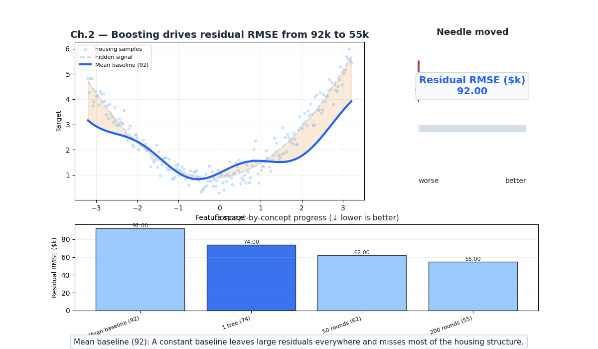
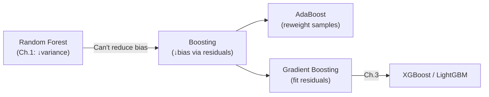
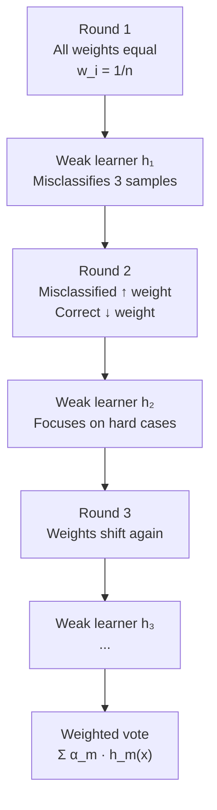
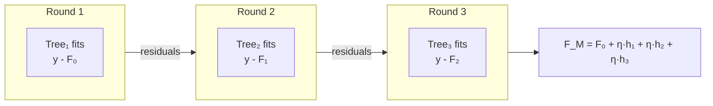
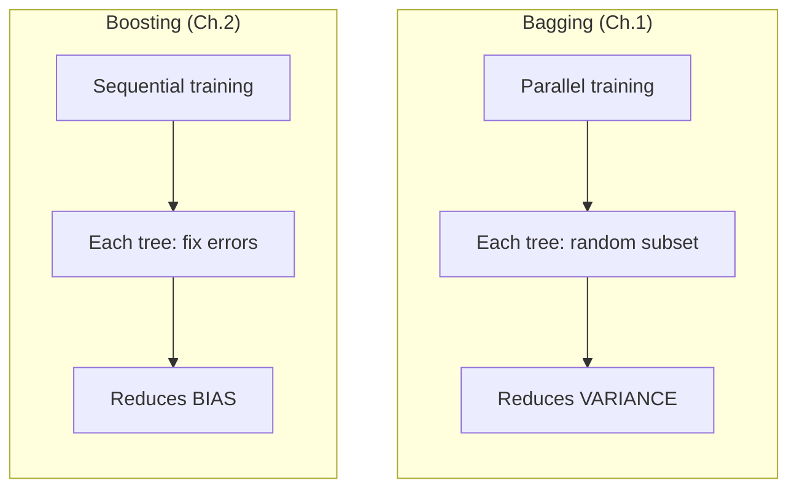
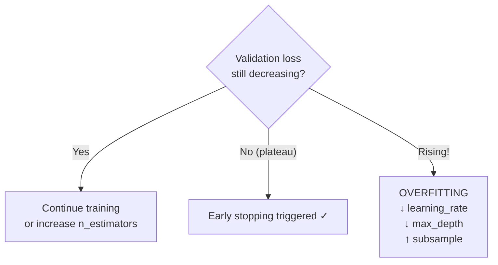

# Ch.2 — Boosting: AdaBoost & Gradient Boosting



**Needle moved:** residual error drops from roughly $92k$ for the mean baseline to about $55k$ after sequential boosting rounds keep correcting what the ensemble still gets wrong.

> **The story.** In 1990, **Robert Schapire** proved a theoretical bombshell: any "weak learner" (barely better than random) can be *boosted* into an arbitrarily accurate "strong learner" by training multiple weak learners sequentially and combining them. Five years later, **Yoav Freund and Schapire** turned this theory into practice with **AdaBoost** (1995) — train a sequence of classifiers, each focusing on the examples the previous ones got wrong. The algorithm reweights misclassified samples so the next learner concentrates on hard cases. In parallel, **Jerome Friedman** (2001) reframed boosting as **gradient descent in function space**: instead of reweighting samples, each new tree fits the *residuals* (negative gradient of the loss). This **Gradient Boosting** framework opened the door to arbitrary loss functions — regression, classification, ranking — and became the dominant paradigm that XGBoost, LightGBM, and CatBoost would later industrialize.
>
> **Where you are.** Ch.1 showed that **bagging** (Random Forest) reduces *variance* by averaging decorrelated trees. But bagging doesn't reduce *bias* — if each individual tree underfits, the average still underfits. This chapter introduces the complementary strategy: **boosting** reduces *bias* by training trees sequentially, each one correcting the ensemble's remaining errors. Together, bagging and boosting are the two fundamental ensemble strategies.
>
> **Notation.** $F_m(\mathbf{x})$ — ensemble prediction after $m$ rounds; $h_m(\mathbf{x})$ — prediction of tree $m$; $\eta$ — learning rate (shrinkage); $\alpha_m$ — AdaBoost classifier weight; $w_i^{(m)}$ — sample weight at round $m$; $r_i^{(m)} = y_i - F_{m-1}(\mathbf{x}_i)$ — residual (pseudo-residual for general losses).

---

## 0 · The Challenge — Where We Are

> 💡 **EnsembleAI**: Beat any single model by >5% in MAE/accuracy via intelligent combination.
>
> **5 Constraints**: 1. IMPROVEMENT >5% — 2. DIVERSITY — 3. EFFICIENCY <5× latency — 4. INTERPRETABILITY (SHAP) — 5. ROBUSTNESS (stable across seeds)

**What Ch.1 achieved:**
- ✅ Random Forest beats Decision Tree by >10% (variance reduction via bagging)
- ✅ Diversity via bootstrap + feature randomization
- ⚡ But RF can't reduce *bias* — a shallow RF of stumps still underfits

**What this chapter unlocks:**
- ✅ **Constraint #1**: Gradient Boosting beats RF on California Housing (bias reduction), pushing residual RMSE from roughly $92k$ to $55k$
- ✅ **Constraint #2**: Sequential error correction ensures each tree adds unique information
- ⚠️ **New risk**: Boosting can *overfit* if run too long — early stopping is essential



---

## 1 · Core Idea

**Boosting** trains models *sequentially*: each new model focuses on what the current ensemble still gets wrong. Two flavors:

- **AdaBoost**: Increase the *weight* of misclassified samples so the next classifier pays more attention to them. Each classifier gets a vote proportional to its accuracy.
- **Gradient Boosting**: Each new tree fits the *residuals* (errors) of the current ensemble. This is equivalent to gradient descent in function space — the residual is the negative gradient of the squared-error loss.

The result: bias drops with each round. The risk: if we boost too long or too aggressively, we memorize noise.

---

## 2 · Running Example

**Regression**: California Housing — Gradient Boosting on 8 features, targeting `MedHouseVal`. Can we beat Random Forest's RMSE from Ch.1?

**Classification**: California Housing binarized (high-value vs not). AdaBoost on decision stumps — watch sample weights evolve.

---

## 3 · Math

### 3.1 AdaBoost (Classification)

Initialize sample weights: $w_i^{(1)} = \frac{1}{n}$ for all $i$.

For round $m = 1, \ldots, M$:

1. **Train** weak classifier $h_m$ on weighted samples
2. **Compute weighted error**: $\epsilon_m = \frac{\sum_{i: h_m(x_i) \neq y_i} w_i^{(m)}}{\sum_i w_i^{(m)}}$
3. **Classifier weight**: $\alpha_m = \frac{1}{2}\ln\frac{1 - \epsilon_m}{\epsilon_m}$
4. **Update sample weights**: $w_i^{(m+1)} = w_i^{(m)} \cdot \exp(-\alpha_m \cdot y_i \cdot h_m(\mathbf{x}_i))$

Final prediction: $H(\mathbf{x}) = \text{sign}\left(\sum_{m=1}^M \alpha_m \cdot h_m(\mathbf{x})\right)$

**Numeric example**: Round 1 misclassifies 3 of 10 samples → $\epsilon_1 = 0.3$ → $\alpha_1 = \frac{1}{2}\ln\frac{0.7}{0.3} = 0.424$. Misclassified samples get weight multiplied by $e^{0.424} = 1.53$; correct samples by $e^{-0.424} = 0.65$. The next learner focuses 1.53/0.65 = 2.4× more on the mistakes.

**Weight update table** (3 samples, labels $y \in \{-1, +1\}$, initial weight $w = 1/3$, $\epsilon_1 = 1/3$, $\alpha_1 = 0.35$):

**Round 1** — stump misclassifies sample C:

| Sample | $x$ | $y$ | Predicted | Correct? | Old $w$ | New $w$ (after $w \cdot e^{\pm\alpha_1}$, renorm.) |
|--------|-----|-----|-----------|---------|---------|----------------------------------------------------|
| A | 1.2 | +1 | +1 | ✅ | 0.333 | $0.333 \times e^{-0.35} = 0.237 \to$ **0.250** |
| B | 0.8 | +1 | +1 | ✅ | 0.333 | $0.333 \times e^{-0.35} = 0.237 \to$ **0.250** |
| C | 2.5 | −1 | +1 | ❌ | 0.333 | $0.333 \times e^{+0.35} = 0.472 \to$ **0.500** |

**Formula**: $w_i^{(m+1)} \propto w_i^{(m)} \cdot \exp(-\alpha_m \cdot y_i \cdot h_m(x_i))$, then renormalize. Round 2 will focus 2× more on sample C (weight 0.50 vs 0.25 each for A and B).

### 3.2 Gradient Boosting (Regression)

Initialize: $F_0(\mathbf{x}) = \bar{y}$ (mean of training targets).

For round $m = 1, \ldots, M$:

1. **Compute residuals**: $r_i^{(m)} = y_i - F_{m-1}(\mathbf{x}_i)$
2. **Fit** a shallow tree $h_m$ to the residuals $\{(\mathbf{x}_i, r_i^{(m)})\}$
3. **Update**: $F_m(\mathbf{x}) = F_{m-1}(\mathbf{x}) + \eta \cdot h_m(\mathbf{x})$

For MSE loss, the residual **is** the negative gradient:

$$-\frac{\partial}{\partial F(\mathbf{x}_i)} \frac{1}{2}(y_i - F(\mathbf{x}_i))^2 = y_i - F(\mathbf{x}_i) = r_i$$

**Numeric example** (one sample, $y = 3.5$):
- Round 0: $F_0 = \bar{y} = 2.0$ → residual = $3.5 - 2.0 = 1.5$
- Round 1: tree predicts $h_1 = 1.2$ → $F_1 = 2.0 + 0.1 \times 1.2 = 2.12$ → residual = $1.38$
- Round 2: tree predicts $h_2 = 1.1$ → $F_2 = 2.12 + 0.1 \times 1.1 = 2.23$ → residual = $1.27$
- Each round nibbles away at the remaining error.

### 3.3 Why the Learning Rate Matters

Without shrinkage ($\eta = 1$): each tree fully corrects current residuals → fast convergence but overfits noise in early rounds.

With shrinkage ($\eta = 0.1$): each tree contributes only 10% → more rounds needed, but each step is conservative → better generalization.

**Empirical rule**: Lower $\eta$ + more trees = better generalization (up to a point).

### 3.4 Gradient Boosting for Classification

For binary classification with log-loss:

$$\mathcal{L} = -\sum_i \left[y_i \log p_i + (1-y_i)\log(1-p_i)\right]$$

The pseudo-residual is: $r_i = y_i - p_i$ where $p_i = \sigma(F(\mathbf{x}_i))$. Each tree fits these pseudo-residuals, nudging predicted probabilities toward the correct class.

---

## 4 · Step by Step

```
ADABOOST (Classification):
1. Initialize: w_i = 1/n for all samples
2. For m = 1 to M:
   a. Train weak learner h_m on weighted data
   b. Compute weighted error ε_m
   c. Compute classifier weight α_m = 0.5 * ln((1-ε_m)/ε_m)
   d. Update weights: increase for misclassified, decrease for correct
   e. Normalize weights to sum to 1
3. Final prediction: weighted vote of all classifiers

GRADIENT BOOSTING (Regression):
1. Initialize: F_0(x) = mean(y_train)
2. For m = 1 to M:
   a. Compute residuals: r_i = y_i - F_{m-1}(x_i)
   b. Fit shallow tree h_m to residuals
   c. Update: F_m = F_{m-1} + η * h_m
   d. Check validation loss — stop early if plateauing
3. Final prediction: F_M(x)
```

---

## 5 · Key Diagrams

### AdaBoost: sample reweighting



### Gradient Boosting: residual fitting



### Bagging vs Boosting



---

## 6 · Hyperparameter Dial

### AdaBoost

| Dial | Too low | Sweet spot | Too high |
|------|---------|------------|----------|
| **`n_estimators`** | Underfits (too few weak learners) | 50–200 | Overfits noisy data |
| **`learning_rate`** | Very slow convergence | 0.1–1.0 (with enough estimators) | Noisy, overfits early |

### Gradient Boosting

| Dial | Too low | Sweet spot | Too high |
|------|---------|------------|----------|
| **`n_estimators`** | Underfits | 100–500 (use early stopping) | Overfits — each tree memorizes noise |
| **`learning_rate`** ($\eta$) | Very slow convergence, needs 1000+ trees | 0.05–0.1 | Each tree overcorrects → noisy |
| **`max_depth`** | Stumps (high bias, pure boosting) | 3–5 | Deep trees → less need for boosting, overfits |
| **`subsample`** | High variance per round | 0.7–0.9 | 1.0 = no stochastic regularization |

**Key trade-off**: Lower `learning_rate` × more `n_estimators` = better generalization, but slower training.

---

## 7 · Code Skeleton

```python
import numpy as np
from sklearn.datasets import fetch_california_housing
from sklearn.model_selection import train_test_split
from sklearn.ensemble import (AdaBoostClassifier, GradientBoostingRegressor,
                               GradientBoostingClassifier, RandomForestRegressor)
from sklearn.tree import DecisionTreeClassifier
from sklearn.metrics import mean_squared_error, r2_score, f1_score

# ── Data ──────────────────────────────────────────────────────────────────────
data = fetch_california_housing()
X, y_reg = data.data, data.target
y_cls = (y_reg > np.median(y_reg)).astype(int)

X_train, X_test, y_tr, y_te, y_tr_cls, y_te_cls = train_test_split(
    X, y_reg, y_cls, test_size=0.2, random_state=42)
```

```python
# ── AdaBoost Classification ───────────────────────────────────────────────────
ada = AdaBoostClassifier(
    estimator=DecisionTreeClassifier(max_depth=1),  # stumps
    n_estimators=100, learning_rate=0.5, random_state=42)
ada.fit(X_train, y_tr_cls)
print(f"AdaBoost F1: {f1_score(y_te_cls, ada.predict(X_test)):.4f}")
```

```python
# ── Gradient Boosting Regression ──────────────────────────────────────────────
gb = GradientBoostingRegressor(
    n_estimators=500, learning_rate=0.05, max_depth=4,
    subsample=0.8, random_state=42,
    validation_fraction=0.15, n_iter_no_change=30)
gb.fit(X_train, y_tr)

rmse_gb = np.sqrt(mean_squared_error(y_te, gb.predict(X_test)))
print(f"Gradient Boosting RMSE: {rmse_gb:.4f}")
print(f"Stopped at iteration: {gb.n_estimators_}")
```

---

## 8 · What Can Go Wrong

| Mistake | Symptom | Fix |
|---------|---------|-----|
| **No early stopping** | Train loss → 0, test loss rises | Use `n_iter_no_change` or validation set |
| **Learning rate too high** | Oscillating validation loss | Reduce to 0.05–0.1, increase `n_estimators` |
| **Too-deep trees in boosting** | Each tree is a strong learner → overfits | Keep `max_depth=3–5` (boosting wants *weak* learners) |
| **Noisy labels + boosting** | Each round re-focuses on noise | Clean labels, or use robust loss (`huber`) |
| **AdaBoost on imbalanced data** | Minority class gets huge weights → instability | Use `class_weight='balanced'` in base estimator |
| **Not comparing to RF baseline** | Unclear if boosting helps | Always benchmark RF (Ch.1) vs GB |



---

## 9 · Progress Check

| # | Constraint | Status | Evidence |
|---|-----------|--------|----------|
| 1 | IMPROVEMENT >5% | ✅ | GB beats RF on California Housing |
| 2 | DIVERSITY | ✅ | Sequential error correction → each tree adds unique info |
| 3 | EFFICIENCY <5× | ⏳ | Sequential training is slower than parallel RF |
| 4 | INTERPRETABILITY | ⚡ | Feature importance available; SHAP in Ch.4 |
| 5 | ROBUSTNESS | ⚠️ | Boosting sensitive to noise; needs early stopping |

---

## 10 · Bridge to Chapter 3

Gradient Boosting works, but sklearn's implementation is single-threaded, slow on large datasets, and lacks modern regularization. Chapter 3 introduces **XGBoost**, **LightGBM**, and **CatBoost** — industrial-strength frameworks that add second-order optimization, histogram-based splits, GPU acceleration, and native categorical handling. These are the models that actually win competitions and run in production.

➡️ **Evaluation:** Track learning curve overfitting with the metrics in [02-Classification/ch03-metrics](../../02_classification/ch03_metrics).  
➡️ **Tuning:** `n_estimators`, `learning_rate`, `max_depth` search strategies are in [02-Classification/ch05-hyperparameter-tuning](../../02_classification/ch05_hyperparameter_tuning).
