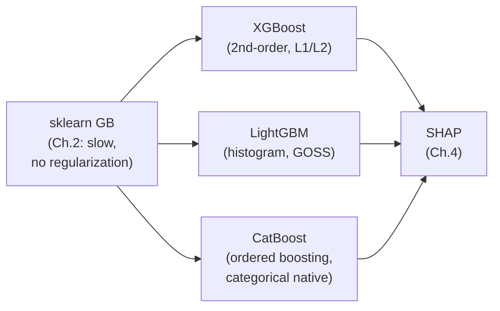
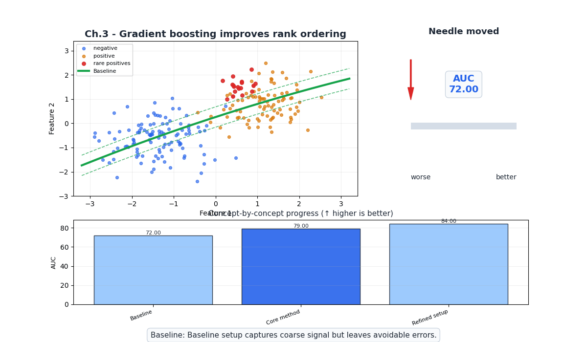
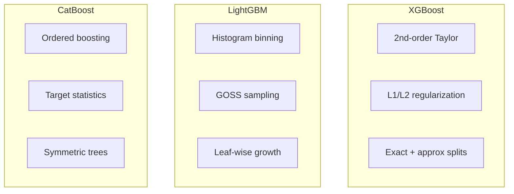
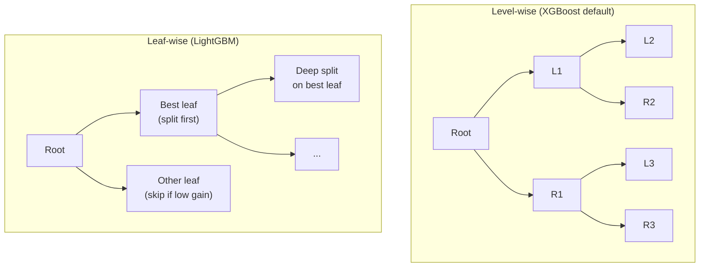

# Ch.3 — XGBoost, LightGBM, CatBoost

> **The story.** By 2010, gradient boosting was well understood theoretically but painfully slow in practice. **Tianqi Chen** changed everything in 2014 with **XGBoost** — adding second-order Taylor expansion of the loss, $L_1$/$L_2$ regularization on leaf weights, column subsampling, and a cache-aware parallel split-finding algorithm. XGBoost won 17 of 29 Kaggle competitions in 2015 alone. Microsoft responded in 2017 with **LightGBM** — instead of sorting features at every split, LightGBM histogramizes continuous features into 256 bins, cutting memory and computation by 10×+. It also introduced **GOSS** (Gradient-based One-Side Sampling) and **EFB** (Exclusive Feature Bundling). Yandex released **CatBoost** the same year, solving the "target leakage" problem for categorical features with **ordered boosting** and **target statistics**. Together, these three frameworks dominate production ML on tabular data.
>
> **Where you are.** Ch.2 introduced the theory of boosting — AdaBoost and Gradient Boosting with sklearn. This chapter moves from theory to production: the three frameworks that actually run in industry. You'll learn *what* makes each one different, *when* to choose which, and *how* to tune them for both regression and classification.
>
> **Notation.** $\mathcal{L}$ — loss function; $g_i = \partial \mathcal{L}/\partial \hat{y}_i$ — first-order gradient; $h_i = \partial^2 \mathcal{L}/\partial \hat{y}_i^2$ — second-order gradient (Hessian); $\gamma$ — minimum split gain; $\lambda$ — $L_2$ regularization on leaf weights; $\alpha$ — $L_1$ regularization; $T$ — number of leaves in a tree.

---

## 0 · The Challenge — Where We Are

> 💡 **EnsembleAI**: Beat any single model by >5% in MAE/accuracy via intelligent combination.
>
> **5 Constraints**: 1. IMPROVEMENT >5% — 2. DIVERSITY — 3. EFFICIENCY <5× latency — 4. INTERPRETABILITY (SHAP) — 5. ROBUSTNESS (stable across seeds)

**What Ch.1–2 achieved:**
- ✅ Bagging (RF) reduces variance, Boosting (GB) reduces bias
- ⚠️ sklearn's GradientBoosting is single-threaded, slow on >50k rows
- ❌ No regularization beyond early stopping

**What this chapter unlocks:**
- ✅ **Constraint #1**: XGBoost/LightGBM beat sklearn GB on accuracy AND speed
- ✅ **Constraint #3**: LightGBM trains 10×+ faster than sklearn GB; inference is fast
- ⚡ Regularization toolkit: `reg_lambda`, `reg_alpha`, `min_child_weight`, `gamma`



---

## Animation



## 1 · Core Idea

All three frameworks implement gradient boosting with different engineering innovations:

- **XGBoost**: Uses a second-order Taylor approximation of the loss (gradient + Hessian) for optimal split finding. Adds $L_1$/$L_2$ regularization on leaf weights. Parallelizes split finding within each tree (not across trees).
- **LightGBM**: Histogramizes features into 256 bins (vs exact splits). Uses GOSS to keep only high-gradient and random low-gradient samples. Grows trees leaf-wise (best-first) instead of level-wise.
- **CatBoost**: Uses ordered boosting to prevent target leakage. Handles categorical features natively via target statistics (ordered target encoding). Symmetric (oblivious) trees for fast inference.

---

## 2 · Running Example

**Regression**: California Housing — compare XGBoost, LightGBM, CatBoost on RMSE and training time.

**Classification**: California Housing binarized — compare F1 and AUC across frameworks.

---

## 3 · Math

### 3.1 XGBoost Objective

At round $m$, the objective is:

$$\mathcal{O}^{(m)} = \sum_{i=1}^n \mathcal{L}(y_i, \hat{y}_i^{(m-1)} + h_m(\mathbf{x}_i)) + \Omega(h_m)$$

Second-order Taylor expansion:

$$\mathcal{O}^{(m)} \approx \sum_{i=1}^n \left[g_i \cdot h_m(\mathbf{x}_i) + \frac{1}{2} h_i \cdot h_m(\mathbf{x}_i)^2\right] + \Omega(h_m)$$

where $g_i = \partial \mathcal{L}/\partial \hat{y}_i^{(m-1)}$ and $h_i = \partial^2 \mathcal{L}/\partial (\hat{y}_i^{(m-1)})^2$.

**Regularization** on the tree structure:

$$\Omega(h_m) = \gamma T + \frac{1}{2}\lambda \sum_{j=1}^T w_j^2$$

where $T$ = number of leaves, $w_j$ = leaf weight, $\gamma$ = minimum split gain, $\lambda$ = L2 penalty.

**Optimal leaf weight** for leaf $j$:

$$w_j^* = -\frac{\sum_{i \in I_j} g_i}{\sum_{i \in I_j} h_i + \lambda}$$

**Split gain**:

$$\text{Gain} = \frac{1}{2}\left[\frac{(\sum_{i \in I_L} g_i)^2}{\sum_{i \in I_L} h_i + \lambda} + \frac{(\sum_{i \in I_R} g_i)^2}{\sum_{i \in I_R} h_i + \lambda} - \frac{(\sum_{i \in I} g_i)^2}{\sum_{i \in I} h_i + \lambda}\right] - \gamma$$

If $\text{Gain} < 0$, the split is not worth the added complexity → built-in pruning.

### 3.2 LightGBM Innovations

**Histogram-based splits**: Bin continuous features into 256 buckets. Split finding is $O(256)$ per feature instead of $O(n)$ → 10×+ speedup.

**GOSS** (Gradient-based One-Side Sampling): Keep all samples with large gradients (they contribute most to information gain), randomly sample from small-gradient samples.

**EFB** (Exclusive Feature Bundling): Identify features that rarely take non-zero values simultaneously. Bundle them into a single feature → reduces feature count for sparse data.

**Leaf-wise growth**: Instead of growing level-by-level (balanced tree), grow the leaf with the largest gain reduction → deeper, more accurate trees with fewer leaves.

### 3.3 CatBoost Innovations

**Ordered boosting**: Standard boosting uses the same data to compute gradients and fit trees → subtle target leakage. CatBoost uses a random permutation of training data, computing each sample's gradient using only samples that appear *before* it in the permutation.

**Target statistics** for categoricals: Instead of one-hot encoding, compute running target mean for each category:

$$\hat{x}_i^k = \frac{\sum_{j: \pi(j) < \pi(i), x_j^k = x_i^k} y_j + a \cdot p}{\sum_{j: \pi(j) < \pi(i), x_j^k = x_i^k} 1 + a}$$

where $\pi$ is a random permutation, $a$ is a smoothing parameter, $p$ is the prior (global target mean).

### 3.4 XGBoost Leaf Score — Numeric Example

Three samples assigned to one leaf. For MSE loss: $g_i = \hat{y}_i - y_i$ (gradient), $h_i = 1$ (hessian), $\lambda = 1$.

| Sample | $y_i$ (true) | $\hat{y}_i$ (current) | $g_i$ | $h_i$ | Optimal leaf score $w^* = -G/(H+\lambda)$ |
|--------|------------|---------------------|-------|-------|-------------------------------------------|
| 1 | 3.0 | 2.5 | −0.5 | 1 | — |
| 2 | 2.0 | 2.5 | +0.5 | 1 | — |
| 3 | 4.0 | 2.5 | −1.5 | 1 | — |
| **Sum** | | | $G = -1.5$ | $H = 3$ | $w^* = -(-1.5)/(3+1) = \mathbf{+0.375}$ |

The leaf adds $+0.375$ to each sample’s current prediction. This is better than the gradient alone ($G/n = -0.5$) because the Hessian $H + \lambda$ acts as a denominator that regularizes the step size.

---

## 4 · Step by Step

```
XGBoost:
1. pip install xgboost
2. Set: n_estimators=500, learning_rate=0.05, max_depth=4
3. Add eval_set with early_stopping_rounds=30
4. Tune: subsample, colsample_bytree, reg_lambda, reg_alpha
5. Check best_iteration to see how many rounds were needed

LightGBM:
1. pip install lightgbm
2. Set: n_estimators=500, learning_rate=0.05, num_leaves=31
3. Use callbacks=[lgb.early_stopping(30)]
4. Tune: min_child_samples, subsample, colsample_bytree
5. Note: num_leaves (not max_depth) controls tree complexity

CatBoost:
1. pip install catboost
2. Set: iterations=500, learning_rate=0.05, depth=6
3. Use eval_set with early_stopping_rounds=30
4. Pass cat_features=[...] for categorical columns
5. CatBoost handles categoricals natively — no one-hot needed
```

---

## 5 · Key Diagrams

### Framework comparison



### Level-wise vs Leaf-wise growth



---

## 6 · Hyperparameter Dial

### Comparison Table

| Parameter | XGBoost | LightGBM | CatBoost |
|-----------|---------|----------|----------|
| Trees | `n_estimators` | `n_estimators` | `iterations` |
| Learning rate | `learning_rate` | `learning_rate` | `learning_rate` |
| Tree depth | `max_depth` (3–6) | `num_leaves` (31) | `depth` (6) |
| Row sampling | `subsample` | `subsample` | `subsample` |
| Col sampling | `colsample_bytree` | `colsample_bytree` | `rsm` |
| L2 reg | `reg_lambda` | `reg_lambda` | `l2_leaf_reg` |
| Min samples | `min_child_weight` | `min_child_samples` | `min_data_in_leaf` |
| GPU | `tree_method='gpu_hist'` | `device='gpu'` | `task_type='GPU'` |

### When to Choose Which

| Scenario | Best Choice | Why |
|----------|-------------|-----|
| Default tabular | **XGBoost** | Most documented, reliable, well-tuned defaults |
| Large dataset (>1M rows) | **LightGBM** | Histogram binning → 10×+ faster |
| Categorical features | **CatBoost** | Native handling, no preprocessing needed |
| Need fastest inference | **CatBoost** | Symmetric trees → branch-free evaluation |
| GPU training needed | Any (all support) | LightGBM and CatBoost slightly faster on GPU |

---

## 7 · Code Skeleton

```python
import numpy as np
import time
from sklearn.datasets import fetch_california_housing
from sklearn.model_selection import train_test_split
from sklearn.metrics import mean_squared_error, r2_score

data = fetch_california_housing()
X, y = data.data, data.target
X_tr, X_te, y_tr, y_te = train_test_split(X, y, test_size=0.2, random_state=42)
X_tr2, X_val, y_tr2, y_val = train_test_split(X_tr, y_tr, test_size=0.15, random_state=42)
```

```python
# ── XGBoost ───────────────────────────────────────────────────────────────────
from xgboost import XGBRegressor

t0 = time.time()
xgb = XGBRegressor(n_estimators=1000, learning_rate=0.05, max_depth=4,
                    subsample=0.8, colsample_bytree=0.8, reg_lambda=1.0,
                    early_stopping_rounds=30, eval_metric='rmse',
                    random_state=42, verbosity=0)
xgb.fit(X_tr2, y_tr2, eval_set=[(X_val, y_val)], verbose=False)
t_xgb = time.time() - t0

rmse_xgb = np.sqrt(mean_squared_error(y_te, xgb.predict(X_te)))
print(f"XGBoost — RMSE: {rmse_xgb:.4f}  Time: {t_xgb:.2f}s  Rounds: {xgb.best_iteration}")
```

```python
# ── LightGBM ──────────────────────────────────────────────────────────────────
import lightgbm as lgb

t0 = time.time()
lgbm = lgb.LGBMRegressor(n_estimators=1000, learning_rate=0.05, num_leaves=31,
                           subsample=0.8, colsample_bytree=0.8,
                           random_state=42, verbosity=-1)
lgbm.fit(X_tr2, y_tr2, eval_set=[(X_val, y_val)],
         callbacks=[lgb.early_stopping(30), lgb.log_evaluation(0)])
t_lgb = time.time() - t0

rmse_lgb = np.sqrt(mean_squared_error(y_te, lgbm.predict(X_te)))
print(f"LightGBM — RMSE: {rmse_lgb:.4f}  Time: {t_lgb:.2f}s  Rounds: {lgbm.best_iteration_}")
```

```python
# ── CatBoost ──────────────────────────────────────────────────────────────────
from catboost import CatBoostRegressor

t0 = time.time()
cat = CatBoostRegressor(iterations=1000, learning_rate=0.05, depth=6,
                         l2_leaf_reg=3, random_seed=42, verbose=0)
cat.fit(X_tr2, y_tr2, eval_set=(X_val, y_val), early_stopping_rounds=30)
t_cat = time.time() - t0

rmse_cat = np.sqrt(mean_squared_error(y_te, cat.predict(X_te)))
print(f"CatBoost — RMSE: {rmse_cat:.4f}  Time: {t_cat:.2f}s  Rounds: {cat.best_iteration_}")
```

---

## 8 · What Can Go Wrong

| Mistake | Symptom | Fix |
|---------|---------|-----|
| **LightGBM `num_leaves` too high** | Overfits, worse than XGBoost | Keep `num_leaves` ≤ $2^{\text{max\_depth}}$ |
| **CatBoost without `cat_features`** | Treats categoricals as numeric → poor splits | Always specify categorical column indices |
| **XGBoost `max_depth=10`** | Each tree is too strong for boosting | Keep 3–6 for boosting; deep trees = single strong learner |
| **Comparing without same early stopping** | Unfair benchmark | Use same `eval_set` and `early_stopping_rounds` |
| **Not installing GPU support** | 10× slower on large data | Install GPU-enabled builds: `pip install xgboost[gpu]` |

---

## 9 · Progress Check

| # | Constraint | Status | Evidence |
|---|-----------|--------|----------|
| 1 | IMPROVEMENT >5% | ✅ | XGB/LGB/Cat beat RF and sklearn GB |
| 2 | DIVERSITY | ✅ | Different split strategies per framework |
| 3 | EFFICIENCY <5× | ✅ | LightGBM: fast training; all: fast inference |
| 4 | INTERPRETABILITY | ⚡ | Built-in feature importance; SHAP in Ch.4 |
| 5 | ROBUSTNESS | ✅ | Regularization (L1/L2) + early stopping |

---

## 10 · Bridge to Chapter 4

We now have accurate, fast, regularized ensemble models — but we can only explain them at the *global* level (which features matter overall). Stakeholders want *per-prediction* explanations: "Why did the model predict $350k for *this specific* district?" Chapter 4 introduces **SHAP** (SHapley Additive exPlanations) — a theoretically grounded framework from game theory that decomposes any model's prediction into feature contributions.


