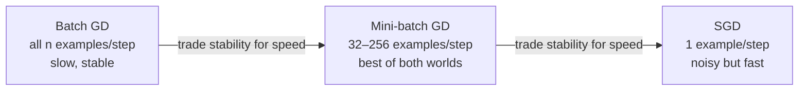
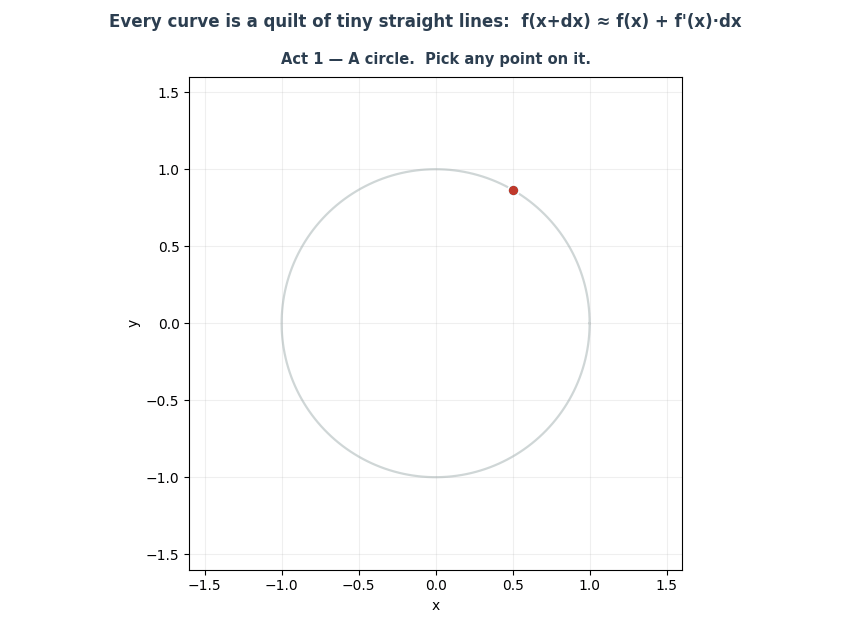
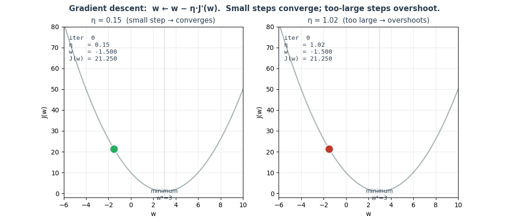
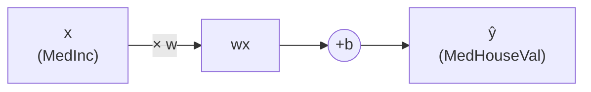

# Ch.1 — Linear Regression

> **Running theme:** You're a data scientist at a real estate platform. Your first task: build a model that estimates California house prices from census features. One input, one output, one line — but every concept here scales directly to 100-layer networks.

---

## 1 · Core Idea

Linear regression fits a straight line (or hyperplane) through data by finding the weights that minimise the average squared error between predictions and true values. It is the foundational building block — every neural network you will see in later chapters is just many linear regressions stacked with non-linearities between them.

---

## 2 · Running Example

You're a data scientist at a real estate platform. Your first task: build a model that estimates the median house value for a California district given its median income. One input, one output, one line. It sounds simple — and it is — but it contains every idea that scales to 100-layer networks: a parameterised function, a loss that measures error, and an optimiser that corrects the weights.

Dataset: **California Housing** (`sklearn.datasets.fetch_california_housing`)  
Input feature: `MedInc` (median income in $10k units)  
Target: `MedHouseVal` (median house value in $100k units)

---

## 3 · Math

### The Model

For a single feature:

$$\hat{y} = wx + b$$

For multiple features (the general case):

$$\hat{y} = \mathbf{W}^\top \mathbf{x} + b$$

| Symbol | Meaning |
|---|---|
| $\hat{y}$ | Predicted value |
| $\mathbf{x}$ | Input feature vector |
| $\mathbf{W}$ | Weight vector — one weight per feature |
| $b$ | Bias term — shifts the line up or down |

**What does a weight actually mean?** If the fitted weight on `MedInc` is 0.6, it means: one unit of median income (≈$10k) predicts a $60k increase in house value. Weights are the model's learned beliefs about how much each feature matters — and their sign tells you the direction.

The model has **no non-linearity** — it can only produce straight-line predictions. This is both the power (interpretable, fast) and the limitation (can't fit curves).

### Loss Functions

The loss measures how wrong your predictions are. Minimising the loss is how the model learns.

**Mean Squared Error (MSE)** — the standard training loss:

$$\text{MSE} = \frac{1}{n} \sum_{i=1}^{n} (\hat{y}_i - y_i)^2$$

Squaring the errors means large errors are penalised disproportionately. Differentiable — plays well with gradient descent.

**Mean Absolute Error (MAE)**:

$$\text{MAE} = \frac{1}{n} \sum_{i=1}^{n} |\hat{y}_i - y_i|$$

Robust to outliers. Not differentiable at zero, which complicates optimisation.

**Root Mean Squared Error (RMSE)**:

$$\text{RMSE} = \sqrt{\text{MSE}}$$

Same units as the target (dollars, not dollars²) — easier to interpret than MSE.

### Evaluation Metrics

**R² (Coefficient of Determination)** — how much variance in $y$ the model explains:

$$R^2 = 1 - \frac{\sum(\hat{y}_i - y_i)^2}{\sum(\bar{y} - y_i)^2}$$

- $R^2 = 1$: perfect predictions
- $R^2 = 0$: predicting the mean every time
- $R^2 < 0$: worse than predicting the mean

**Adjusted R²** — penalises for adding useless features:

$$\bar{R}^2 = 1 - (1 - R^2) \cdot \frac{n-1}{n-p-1}$$

where $n$ is the number of samples and $p$ is the number of features. Use this when comparing models with different numbers of features.

---

## 4 · Step by Step

```
1. Initialise W and b to small random values (or zeros)

2. Forward pass
   └─ compute ŷ = Wᵀx + b for all training examples

3. Compute loss
   └─ MSE = mean((ŷ - y)²)

4. Backward pass (gradient computation)
   └─ ∂MSE/∂W = (2/n) · Xᵀ(ŷ - y)
   └─ ∂MSE/∂b = (2/n) · sum(ŷ - y)

5. Update weights
   └─ W ← W - α · ∂MSE/∂W
   └─ b ← b - α · ∂MSE/∂b

6. Repeat steps 2–5 for many epochs until loss converges
```

$\alpha$ is the **learning rate** — the size of each step down the loss slope. Too large: the loss oscillates or diverges. Too small: training takes forever.

---

## 5 · Key Diagrams

### Loss Landscape

The MSE loss surface for a single-weight model is a **convex bowl** — there is exactly one minimum, which gradient descent will always find given a small enough learning rate.

```
Loss
 │
 │    *
 │   * *
 │  *   *
 │ *     *
 │*       *
 └──────────── W
         ↑
      minimum
```

### Gradient Descent Variants



### Learning Rate Effect

```
Good α:    loss ──┐
                   └──┐
                        └─── (converged)

Too high:  loss ────/\/\/\/\──  (oscillates / diverges)

Too low:   loss ──────────────────────────── (barely moving)
```


### Animation — derivative slices compound into the curve

Calculus-intuition check before we touch the loss surface: **every smooth curve is a quilt of tiny straight lines.** Zoom into any point on a circle and the arc looks straight — that locally-straight segment *is* the derivative at that point. Pull the camera back and those millions of tiny straight segments, laid edge-to-edge, are what we see as "the circle". The same is true of any smooth $f(x)$ — it looks blank from far away, but zoom in and it's made of microscopic tangents, each with its own slope $f'(x)$. This is why the first-order approximation $f(x + dx) \approx f(x) + f'(x)\,dx$ exists at all, and it's the reason gradient descent works one small step at a time: step sizes have to be small enough that this *locally straight* picture is still trustworthy.



### Animation — gradient descent: small step vs too-large step

Same loss bowl, same start point, same gradient formula — the **only** difference is the learning rate $\eta$. On the left ($\eta = 0.15$) each step is small enough that the slope estimate stays accurate, and the ball walks down into the minimum. On the right ($\eta = 1.02$) each step overshoots the basin; the next gradient points the other way and is evaluated even farther out, so the iterates spiral outward and never settle. This is why "small steps" isn't a stylistic preference — it's the condition that keeps the linear approximation valid.



### Feature → Prediction Flow (single input)



---

## 6 · Hyperparameter Dial

| Dial | Too low | Sweet spot | Too high |
|---|---|---|---|
| **Learning rate α** | Training is painfully slow | `0.1` (SGD), `1e-3` (Adam) | Loss oscillates or diverges |
| **Epochs** | Underfits | Use early stopping | Overfits training data |
| **Batch size** | Noisier gradients, more updates/epoch | `32`–`256` | Smoother gradients but fewer updates/epoch |

The single most important dial in any gradient-based model is **learning rate**. Always tune this first.

---

## 7 · Code Skeleton

```python
import numpy as np
from sklearn.datasets import fetch_california_housing
from sklearn.model_selection import train_test_split
from sklearn.preprocessing import StandardScaler
from sklearn.linear_model import LinearRegression
from sklearn.metrics import mean_squared_error, r2_score

# 1. Load data — use MedInc only for the single-feature baseline
data = fetch_california_housing()
X = data.data[:, [0]]   # MedInc column
y = data.target          # MedHouseVal

# 2. Split
X_train, X_test, y_train, y_test = train_test_split(X, y, test_size=0.2, random_state=42)

# 3. Scale (important for gradient descent — not needed for closed-form sklearn)
scaler = StandardScaler()
X_train = scaler.fit_transform(X_train)
X_test  = scaler.transform(X_test)

# 4. Fit
model = LinearRegression()
model.fit(X_train, y_train)

# 5. Evaluate
y_pred = model.predict(X_test)
rmse   = np.sqrt(mean_squared_error(y_test, y_pred))
r2     = r2_score(y_test, y_pred)
print(f"RMSE: {rmse:.3f}  R²: {r2:.3f}")
print(f"Weight: {model.coef_[0]:.3f}  Bias: {model.intercept_:.3f}")
```

### Manual Gradient Descent (to see the mechanics)

```python
# Gradient descent from scratch — educational, not production
W, b = 0.0, 0.0
alpha = 0.01
n = len(X_train)

for epoch in range(200):
    y_hat = X_train[:, 0] * W + b
    error = y_hat - y_train

    dW = (2 / n) * np.dot(X_train[:, 0], error)
    db = (2 / n) * np.sum(error)

    W -= alpha * dW
    b -= alpha * db

    if epoch % 20 == 0:
        mse = np.mean(error ** 2)
        print(f"Epoch {epoch:3d} | MSE: {mse:.4f} | W: {W:.4f} | b: {b:.4f}")
```

---

## 8 · What Can Go Wrong

- **R² inflates as you add features** — even useless noise features improve R² on the training set; always report Adjusted R² when comparing models with different feature counts.
- **Unscaled features break gradient descent** — if one feature is in dollars and another in square feet, gradients will be wildly different in magnitude; always standardise before gradient-based training.
- **Outliers dominate MSE** — a single district with an extreme house value pulls the fitted line toward it; inspect residuals and consider MAE or Huber loss when outliers are common.
- **Linear regression assumes the relationship is linear** — if the true relationship is curved, a linear model will systematically under-predict at extremes; check the residual vs. fitted plot.
- **Multicollinearity inflates coefficient variance** — when two features are highly correlated, small changes in data produce wild swings in their individual weights; use Ridge regression (Ch.6) or check VIF scores.

---

## 9 · Interview Checklist

| Must know | Likely asked | Trap to avoid |
|---|---|---|
| The MSE formula and why squaring matters | Derive the gradient descent update rule for MSE | "R² = 0.9 means the model is good" — not if you have 50 features and should be using Adjusted R² |
| Difference between loss (MSE) and metric (R²) | When would you choose MAE over MSE? | Forgetting to scale features before gradient descent |
| What the bias term does | Explain the difference between batch, mini-batch, and SGD | Claiming linear regression can't overfit — it can on small datasets with many features |
| How learning rate affects convergence | What happens if features are left unscaled? | Confusing R² on training set (always high) with test set R² |
| The four assumptions of linear regression: **linearity** (relationship between X and y is linear), **independence** of errors, **homoscedasticity** (constant error variance across all X values), and **normality of errors** (residuals are normally distributed — required for valid confidence intervals) | "What assumptions does linear regression make?" — all four are expected | Stating only "linearity"; interviewers penalise missing homoscedasticity in particular, as it is the most commonly violated assumption in real data |
| Normal equations: $\hat{W} = (X^TX)^{-1}X^Ty$ — closed-form exact solution, $O(d^3)$ due to matrix inversion; prefer gradient descent when $d > 10{,}000$ because $O(d^3)$ becomes prohibitive and $(X^TX)$ can be near-singular | "When would you use normal equations vs gradient descent?" | "Normal equations are always better because they're exact" — they are numerically unstable when $X^TX$ is near-singular (collinear features) and prohibitively slow for large feature spaces |

---

## Bridge to Chapter 2

Ch.1 established the core loop — parameterised function → loss → gradient → update — on a regression target with continuous output. Ch.2 (Logistic Regression) keeps the same linear foundation but adds a **sigmoid activation** to squash the output to a probability, making binary classification possible. The only new idea is the loss function: instead of MSE, we'll minimise **Binary Cross-Entropy**.
