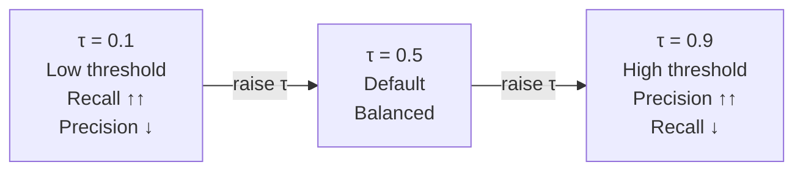
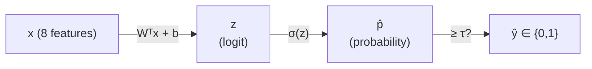

# Ch.2 — Logistic Regression

> **Running theme:** The platform needs a binary signal: is a California district high-value or not? This powers the "premium neighbourhood" badge. The maths is nearly identical to Ch.1 — the only change is squashing the linear output through a sigmoid and swapping MSE for cross-entropy.

---

## 1 · Core Idea

Logistic regression takes the linear combination from Ch.1 and squashes it through a **sigmoid function**, producing a number between 0 and 1 — a probability. Train that probability to match binary labels using binary cross-entropy loss, and you have a classifier. The maths is almost identical to Ch.1; only the output transformation and the loss function change.

---

## 2 · Running Example

The real estate platform now needs a binary signal: is a California district **high-value** (median house value above the dataset median) or not? This powers the "premium neighbourhood" badge shown on property listings.

Dataset: **California Housing** (`sklearn.datasets.fetch_california_housing`)  
Features: all 8 housing features  
Target: `high_value` — 1 if `MedHouseVal > median(MedHouseVal)`, else 0

This is a balanced binary classification problem. The threshold at the median means exactly 50 % of districts are labelled 1 — no class imbalance to worry about yet (that comes in Ch.9).

---

## 3 · Math

### The Model

Start with the same linear combination as Ch.1:

$$z = \mathbf{W}^\top \mathbf{x} + b$$

Apply the **sigmoid function** to get a probability:

$$\hat{p} = \sigma(z) = \frac{1}{1 + e^{-z}}$$

Decision rule — convert probability to a label:

$$\hat{y} = \begin{cases} 1 & \text{if } \hat{p} \geq \tau \\ 0 & \text{if } \hat{p} < \tau \end{cases}$$

where $\tau$ is the **decision threshold** (default 0.5, but rarely the best choice).

| Symbol | Meaning |
|---|---|
| $z$ | Linear score (logit) — unbounded real number |
| $\hat{p}$ | Predicted probability — always in $(0, 1)$ |
| $\sigma$ | Sigmoid activation |
| $\tau$ | Decision threshold — the dial you turn to trade precision for recall |

### Why Not MSE for Classification?

MSE on probabilities produces a **non-convex** loss surface with many local minima. More importantly, a wrong confident prediction (predicting $\hat{p} = 0.01$ when $y = 1$) produces a tiny MSE gradient — the model barely updates. Cross-entropy fixes this.

### Loss: Binary Cross-Entropy (Log Loss)

$$\mathcal{L} = -\frac{1}{n} \sum_{i=1}^{n} \left[ y_i \log(\hat{p}_i) + (1 - y_i) \log(1 - \hat{p}_i) \right]$$

When $y = 1$: loss = $-\log(\hat{p})$ — punishes low confidence on positives  
When $y = 0$: loss = $-\log(1 - \hat{p})$ — punishes high confidence on negatives

The gradient of BCE with respect to $z$ is elegantly simple:

$$\frac{\partial \mathcal{L}}{\partial z} = \hat{p} - y$$

Same form as the MSE gradient — the loss function was carefully chosen so the gradient reduces to this clean expression.

### Evaluation Metrics

The confusion matrix is the foundation:

```
                  Predicted
                   0      1
Actual  0   [ TN  |  FP ]
        1   [ FN  |  TP ]
```

| Metric | Formula | Answers |
|---|---|---|
| **Accuracy** | $(TP + TN) / n$ | What fraction did we get right? |
| **Precision** | $TP / (TP + FP)$ | Of all predicted positives, how many were real? |
| **Recall** | $TP / (TP + FN)$ | Of all actual positives, how many did we catch? |
| **F1** | $2 \cdot (P \cdot R) / (P + R)$ | Harmonic mean — balances precision and recall |
| **AUC-ROC** | Area under TPR vs FPR curve | Aggregate performance across all thresholds |

**Precision–Recall trade-off:** lowering $\tau$ catches more positives (recall ↑) but also more false positives (precision ↓). There is no free lunch — decide which matters more for the business problem first.

---

## 4 · Step by Step

```
1. Initialise W and b to small random values

2. Forward pass
   └─ z    = Wᵀx + b          (linear scores)
   └─ p̂   = σ(z)              (probabilities)
   └─ ŷ   = 1 if p̂ ≥ τ       (predicted labels)

3. Compute loss
   └─ BCE = -mean(y·log(p̂) + (1-y)·log(1-p̂))

4. Backward pass
   └─ ∂L/∂z = p̂ - y           (gradient wrt logit)
   └─ ∂L/∂W = (1/n) Xᵀ(p̂ - y)
   └─ ∂L/∂b = (1/n) sum(p̂ - y)

5. Update weights
   └─ W ← W - α · ∂L/∂W
   └─ b ← b - α · ∂L/∂b

6. Repeat steps 2–5 until validation loss stops improving

7. At inference time: apply σ, then threshold at τ
```

---

## 5 · Key Diagrams

### Sigmoid Function

```
  1.0 ─────────────────────────────────── → 1
       │                        ╭─────
  0.5 ─│───────────────────╭────╯
       │             ╭─────╯
  0.0 ─╯─────────────╯
      -6    -4    -2    0    2    4    6   (z)
               ↑ 
         σ(0) = 0.5   (decision boundary is z = 0)
```

### Precision–Recall Trade-off (threshold sweep)



### From Logit to Decision



### ROC Curve Shape

```
TPR
1.0 │          ╭──────────────────
    │      ╭───╯   AUC = 0.85
    │   ╭──╯    (example)
    │ ╭─╯
    │╱  random classifier (AUC = 0.5)
    └──────────────────────────── FPR
   0.0                          1.0
```

---

## 6 · Hyperparameter Dial

| Dial | Too low | Sweet spot | Too high |
|---|---|---|---|
| **Decision threshold τ** | High recall, low precision — many false alarms | `0.5` default; tune via PR curve | High precision, low recall — misses many positives |
| **Regularisation C** (sklearn) | Underfits (heavy regularisation) | `1.0` | Overfits (C = 1/λ; high C = weak regularisation) |
| **Learning rate α** | Slow convergence | `0.1` (SGD), `1e-3` (Adam) | Diverges |

The threshold $\tau$ is the lever most practitioners forget to tune. Pick it **after** training, by optimising for the metric that matters to the business (F1, precision at fixed recall, etc.).

---

## 7 · Code Skeleton

```python
import numpy as np
from sklearn.datasets import fetch_california_housing
from sklearn.model_selection import train_test_split
from sklearn.preprocessing import StandardScaler
from sklearn.linear_model import LogisticRegression
from sklearn.metrics import classification_report, roc_auc_score

# 1. Build binary target
data   = fetch_california_housing()
X, y_r = data.data, data.target
y      = (y_r > np.median(y_r)).astype(int)   # 1 = high-value district

# 2. Split and scale
X_train, X_test, y_train, y_test = train_test_split(X, y, test_size=0.2, random_state=42)
scaler  = StandardScaler()
X_train = scaler.fit_transform(X_train)
X_test  = scaler.transform(X_test)

# 3. Fit
model = LogisticRegression(max_iter=1000)
model.fit(X_train, y_train)

# 4. Default threshold (0.5)
y_pred       = model.predict(X_test)
y_pred_proba = model.predict_proba(X_test)[:, 1]

print(classification_report(y_test, y_pred))
print(f"AUC-ROC: {roc_auc_score(y_test, y_pred_proba):.4f}")

# 5. Tune threshold
threshold = 0.4   # shift toward recall
y_pred_t  = (y_pred_proba >= threshold).astype(int)
print(classification_report(y_test, y_pred_t))
```

### Binary Cross-Entropy from Scratch

```python
def sigmoid(z):
    return 1 / (1 + np.exp(-np.clip(z, -500, 500)))  # clip for numerical stability

def bce_loss(y_true, p_hat):
    eps = 1e-15   # avoid log(0)
    return -np.mean(y_true * np.log(p_hat + eps) + (1 - y_true) * np.log(1 - p_hat + eps))
```

---

## 8 · What Can Go Wrong

- **High accuracy on imbalanced data is meaningless** — a model that always predicts the majority class gets 90 % accuracy on a 90/10 split while being completely useless; always report F1 or AUC alongside accuracy.
- **Leaving the threshold at 0.5** — the default is rarely optimal; plot the precision-recall curve and pick $\tau$ based on the business requirement (e.g., "recall must be ≥ 0.85 for the premium badge to be trusted").
- **Not scaling features** — logistic regression uses gradient descent internally (unless you use the closed-form solver); unscaled features produce very slow or divergent training.
- **Forgetting sigmoid's saturation region** — when $|z|$ is large, $\sigma(z) \approx 0$ or $1$ and gradients vanish; this is the same problem as in deep networks (Ch.4).
- **Using `predict` instead of `predict_proba` when you need calibrated probabilities** — `predict` applies the threshold silently; for threshold tuning you always need the raw probabilities.

---

## 9 · Interview Checklist

| Must know | Likely asked | Trap to avoid |
|---|---|---|
| Sigmoid formula and why it maps $\mathbb{R}$ → $(0,1)$ | Derive the gradient of BCE with respect to $z$ | "Logistic regression is a classification algorithm" — it outputs probabilities; the threshold makes it a classifier |
| BCE loss formula and what each term does | Why is MSE a bad loss for classification? | Reporting accuracy without asking about class balance |
| Precision vs Recall trade-off | When would you prefer precision over recall? | Confusing AUC-ROC (ranking quality) with accuracy (at a single threshold) |
| What decision threshold $\tau$ does | How do you pick the optimal threshold? | Using `predict` instead of `predict_proba` and then trying to threshold |
| Confusion matrix: TP, TN, FP, FN | What is AUC-ROC and when does it fail? | AUC-ROC can be misleadingly high on imbalanced datasets — use AUC-PR instead |
| Multiclass extension — **One-vs-Rest (OvR):** train $K$ binary classifiers, pick the one with the highest score; **Softmax (Multinomial):** single model with $K$ output logits, `multi_class='multinomial'` in sklearn | "How would you extend logistic regression to 10 classes?" — both approaches expected | "OvR is always worse than Softmax" — for well-separated classes OvR is faster to train and each classifier is individually interpretable |
| `class_weight='balanced'` in sklearn weights each sample by the inverse class frequency, counteracting imbalance during training | "How do you handle a 1:100 class imbalance in logistic regression?" | Using `class_weight='balanced'` without re-calibrating the decision threshold — the model's predicted probabilities are skewed and the default 0.5 threshold is now wrong; use a PR curve or F1-vs-threshold sweep to find the new optimal $\tau$ |

---

## Bridge to Chapter 3

Ch.2 established that a single linear layer with a sigmoid can classify linearly separable problems — districts on one side of a hyperplane get label 1, the rest get 0. Ch.3 (The XOR Problem) exposes the hard limit of this: if the true decision boundary is **not** a straight line (or hyperplane), no amount of tuning $\mathbf{W}$ and $b$ will fix it. That failure motivates the jump to hidden layers.
