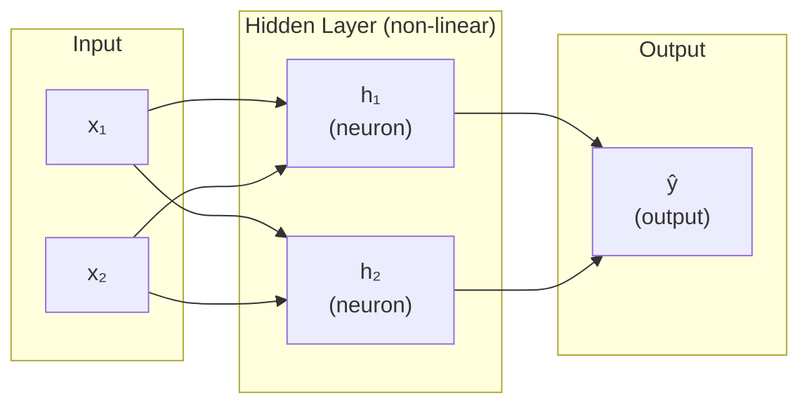
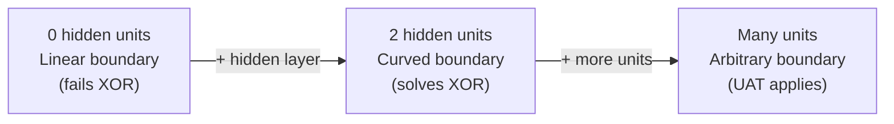

# Ch.3 — The XOR Problem

> **Running theme:** Coastal-and-high-income districts are premium; inland-and-low-income districts are not. But coastal-with-low-income is ambiguous — and a linear model cannot handle it. This is XOR in the data. One hidden layer is enough to fix it, and the fix explains the entire motivation for deep learning.

---

## 1 · Core Idea

A single linear layer — whether doing regression (Ch.1) or classification (Ch.2) — can only draw a straight line through the data. The XOR problem is the simplest possible case where no straight line works. Understanding *why* it fails, and *what* fixes it, is the entire motivation for adding hidden layers to a network. One hidden layer with a non-linear activation is enough to represent any function — this is the Universal Approximation Theorem.

---

## 2 · Running Example

You've been building models for the real estate platform, and something keeps breaking: districts that are **coastal** *and* **high-income** are premium. Districts that are **inland** *and* **low-income** are not. But districts that are coastal-with-low-income or inland-with-high-income sit in a confusing middle ground that the linear model keeps misclassifying.

This is XOR in disguise: the label is `1` only when *both* features point the same direction, and `0` when they're mixed. No straight line in `(coastal, income)` space separates them — you need a curved boundary. A perceptron cannot learn it; a two-layer network can.

More concretely, we'll demonstrate the XOR failure on synthetic data first (it's the canonical example), then show the same phenomenon in the housing data using `Latitude` and `MedInc` as a proxy for "coastal" and "income".

---

## 3 · Math

### Why a Single Perceptron Fails XOR

A perceptron computes:

$$\hat{y} = \text{step}\!\left(\mathbf{W}^\top \mathbf{x} + b\right)$$

It partitions input space with a single hyperplane:

$$\mathbf{W}^\top \mathbf{x} + b = 0$$

**XOR truth table:**

| $x_1$ | $x_2$ | $x_1 \oplus x_2$ |
|---|---|---|
| 0 | 0 | 0 |
| 0 | 1 | 1 |
| 1 | 0 | 1 |
| 1 | 1 | 0 |

Plot those four points. The two 0s sit at opposite corners; the two 1s sit at the other opposite corners. No single straight line separates 0s from 1s. This is called **linear inseparability**.

### The Fix: One Hidden Layer

Add a hidden layer of neurons with a non-linear activation:

$$\mathbf{h} = \sigma\!\left(\mathbf{W}_1^\top \mathbf{x} + \mathbf{b}_1\right) \qquad \hat{y} = \sigma\!\left(\mathbf{W}_2^\top \mathbf{h} + b_2\right)$$

where $\sigma$ can be Sigmoid, ReLU, or Tanh. The hidden layer transforms the input space into a new representation where the classes *are* linearly separable. Then the output layer draws a straight line in that new space.

**What the hidden layer actually does:** each hidden neuron draws one linear boundary; together they carve the input space into regions. Two hidden neurons can produce a region that encapsulates the XOR-positive points. The activation function is what makes the boundary non-sharp (smooth and differentiable), which is essential for gradient descent to work.

### Universal Approximation Theorem

> A feedforward network with a single hidden layer of finite width and a non-linear activation function can approximate any continuous function on a compact subset of $\mathbb{R}^n$ to arbitrary precision.

In plain English: **one hidden layer is enough in theory**. In practice, more layers are more efficient — fewer neurons needed to represent the same function. This is why deep networks exist, but the UAT is why hidden layers exist at all.

---

## 4 · Step by Step

```
Problem: linearly inseparable data (XOR)

Step 1: Observe failure of the linear model
  └─ Train logistic regression on XOR → accuracy ≈ 50% (chance)
  └─ Plot decision boundary → a line that can't separate the classes

Step 2: Add a hidden layer
  └─ Input (2D) → Hidden layer (2+ neurons) → Output (1 neuron)
  └─ Hidden layer activation: ReLU or Tanh
  └─ Output activation: Sigmoid (binary classification)

Step 3: The hidden layer transforms the feature space
  └─ Each hidden neuron creates a new axis in representation space
  └─ In the new space, the two classes ARE linearly separable

Step 4: Output layer draws a straight line in the new space
  └─ Which is a curved boundary back in the original input space

Step 5: Training (backprop, covered in Ch.5)
  └─ Gradient flows from output → hidden → input
  └─ Both W1 and W2 are updated simultaneously
```

---

## 5 · Key Diagrams

### XOR Input Space — Why No Line Works

```
x2
1 │  ●        ○
  │  (1)      (0)
  │
0 │  ○        ●
  │  (0)      (1)
  └────────────── x1
     0         1

● = class 1  ○ = class 0
Any line that separates the top-left ○ from bottom-left ○
will also separate the ● points incorrectly.
```

### Network Architecture



### Feature Space Transformation

```
Original space (XOR)        Hidden layer space
x2                          h2
1│ ○   ●                    1│ ●    ●
 │                           │
0│ ●   ○                    0│ ○    ○
 └────── x1                  └────── h1
 Not separable               Now separable with a line!
```

### Decision Boundary Complexity vs Hidden Units



---

## 6 · Hyperparameter Dial

| Dial | Too low | Sweet spot | Too high |
|---|---|---|---|
| **Hidden units** | Can’t represent the non-linear boundary | 2–4 for XOR; 32–128 for real problems | Overfits, memorises training data |
| **Learning rate α** | Extremely slow convergence | `1e-3` with Adam | Loss diverges |
| **Activation function** | — (choice not a continuous dial) | ReLU hidden layers; Sigmoid binary output | — |

The distinction between **width** (hidden units per layer) and **depth** (number of layers) matters: for XOR, width is what matters — two hidden neurons are literally sufficient.

A good mental model: each hidden neuron contributes one "crease" to the decision boundary. XOR needs exactly two creases.

---

## 7 · Code Skeleton

```python
import numpy as np
from sklearn.neural_network import MLPClassifier
from sklearn.metrics import accuracy_score

# ── The canonical XOR dataset ─────────────────────────────────────────────
X_xor = np.array([[0,0], [0,1], [1,0], [1,1]])
y_xor = np.array([0, 1, 1, 0])

# 1. Linear model fails
from sklearn.linear_model import LogisticRegression
lr = LogisticRegression()
lr.fit(X_xor, y_xor)
print(f"Logistic regression XOR accuracy: {accuracy_score(y_xor, lr.predict(X_xor)):.0%}")
# Expected: 50% — chance level

# 2. Two-layer network solves it
mlp = MLPClassifier(hidden_layer_sizes=(4,), activation='relu',
                    max_iter=5000, random_state=42)
mlp.fit(X_xor, y_xor)
print(f"MLP XOR accuracy: {accuracy_score(y_xor, mlp.predict(X_xor)):.0%}")
# Expected: 100%
```

### Manual Two-Layer Network (to see the mechanics)

```python
def relu(z):     return np.maximum(0, z)
def sigmoid(z):  return 1 / (1 + np.exp(-np.clip(z, -500, 500)))

def forward(X, W1, b1, W2, b2):
    h = relu(X @ W1 + b1)       # hidden layer: (n, 2)
    y_hat = sigmoid(h @ W2 + b2)  # output: (n, 1)
    return h, y_hat

# Manually chosen weights that solve XOR (not trained — for intuition only)
W1 = np.array([[1, 1],   # weights from x1 to h1, h2
               [1, 1]])  # weights from x2 to h1, h2
b1 = np.array([[-0.5, -1.5]])  # biases for h1, h2
W2 = np.array([[4], [-10]])   # weights from h1, h2 to output
b2 = np.array([[-1.5]])

h, y_hat = forward(X_xor.astype(float), W1, b1, W2, b2)
print("Predictions:", y_hat.ravel().round(2))
print("Labels:     ", y_xor)
```

---

## 8 · What Can Go Wrong

- **More hidden units does not mean better generalisation** — a network with 100 hidden units will memorise 4 XOR points perfectly but will catastrophically overfit any small real dataset; regularisation (Ch.6) is the fix, not fewer units.
- **Wrong activation at the output layer** — using ReLU as the output activation for binary classification maps your output to $[0, \infty)$, not $[0, 1]$; always use Sigmoid for binary, Softmax for multi-class, and nothing (linear) for regression.
- **Zero initialisation kills learning in hidden layers** — if all weights are identically zero, all hidden neurons compute the same gradient and learn the same feature forever (the symmetry problem); sklearn and TensorFlow both use random initialisation by default.
- **Vanishing gradients with many Sigmoid layers** — deeper stacks of Sigmoid activations squash gradients exponentially; this is why ReLU replaced Sigmoid for hidden layers in modern networks.
- **Confusing the UAT with a guarantee** — the UAT says one hidden layer *can* represent any function, not that gradient descent will *find* those weights; in practice, width alone is not sufficient and depth helps significantly.

---

## 9 · Interview Checklist

| Must know | Likely asked | Trap to avoid |
|---|---|---|
| Why a single perceptron cannot solve XOR (draw the four XOR points) | Explain what the Universal Approximation Theorem says and what it does NOT say | "Adding more hidden units always improves performance" — more units = more overfitting risk without regularisation |
| What a hidden layer does geometrically (transforms the space) | Why do we use ReLU instead of Sigmoid for hidden layers? | Confusing depth (layers) with width (units) — for XOR specifically, width is what matters |
| Why non-linear activations are necessary (without them, stacking layers collapses to one linear layer) | What is the symmetry problem with zero initialisation? | Claiming one hidden layer is always best because of the UAT — in practice, depth is more parameter-efficient |
| The role of the activation function at each layer | What happens if you use a linear activation throughout? | Forgetting that the UAT is an existence result, not a learning guarantee |
| **Depth vs width in practice:** depth adds representational hierarchy (each layer composes features from the previous); width adds capacity at one level. For most structured-data problems, 2–3 deep narrow layers beats 1 wide layer of equivalent parameters | "When would you add depth vs width to a network?" | "The UAT says one hidden layer is sufficient, so depth doesn't matter" — the UAT is an existence proof; the number of units required may be exponential; deep networks learn the hierarchy explicitly and are more parameter-efficient |

---

## Bridge to Chapter 4

Ch.3 established that hidden layers with non-linear activations can represent any function, but only sketched the architecture. Ch.4 (Neural Networks) builds that architecture properly — multiple hidden layers, the full catalogue of activation functions, weight initialisation strategies, and why the choices at each step matter for both performance and trainability.
