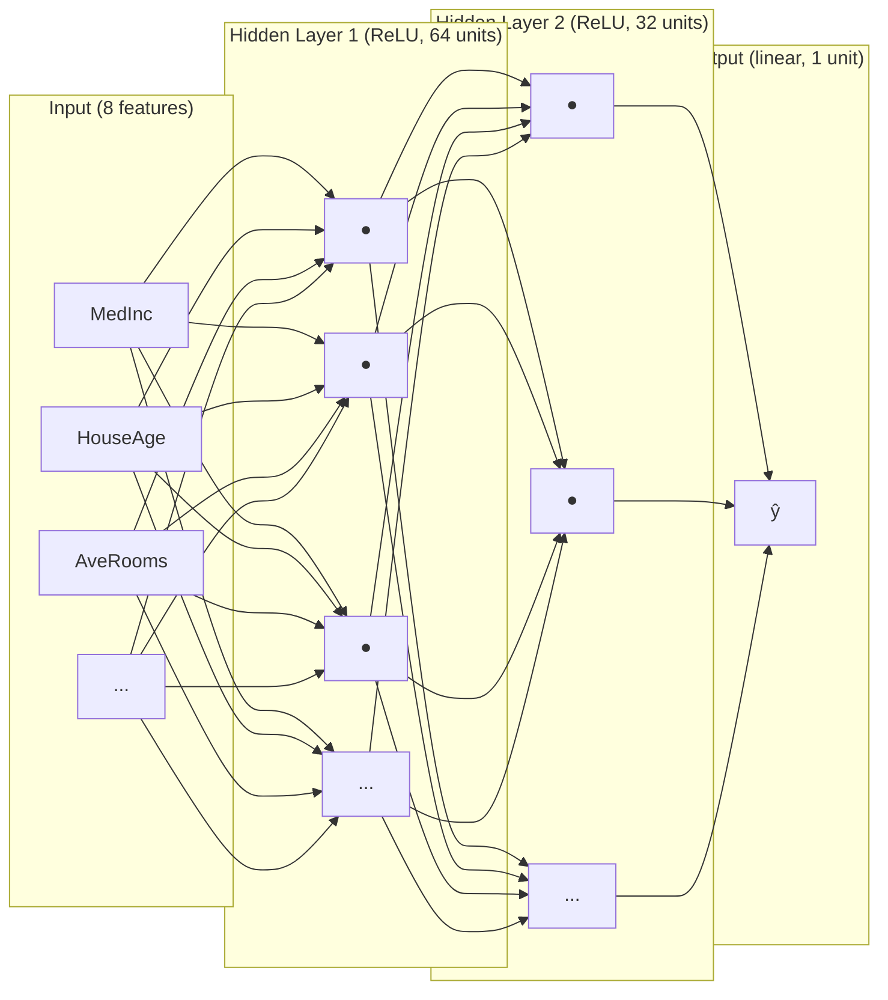
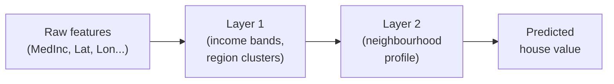
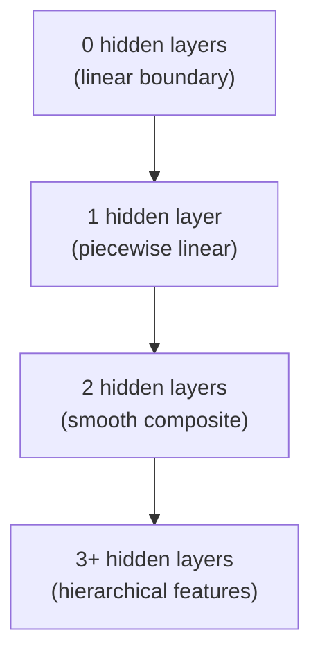

# Ch.4 — Neural Networks

> **Running theme:** You are a data scientist at a real estate platform. Management wants a smarter valuation model — one that captures complex, non-linear interactions between all eight housing features. Linear regression (Ch.1) was too rigid; logistic regression (Ch.2) only handles binary targets; the XOR experiment (Ch.3) proved you need hidden layers. Now you build the full thing.

---

## 1 · Core Idea

A **neural network** is a chain of linear transformations and non-linear activations:

```
input → [linear → activation] × N hidden layers → [linear] → output
```

Each layer learns a new **representation** of the data — a coordinate system where the final task (predicting house value) becomes easy. The XOR chapter showed that one hidden layer is enough to solve non-linearly separable problems; here you stack layers to handle the full eight-dimensional housing feature space.

---

## 2 · Running Example

| Feature | Description | Role |
|---|---|---|
| `MedInc` | Median income (×$10k) | strongest predictor |
| `HouseAge` | Median house age (years) | condition proxy |
| `AveRooms` | Average rooms per house | size |
| `AveBedrms` | Average bedrooms per house | size detail |
| `Population` | Block population | density |
| `AveOccup` | Average occupancy | demand signal |
| `Latitude` | Block latitude | coastal/regional |
| `Longitude` | Block longitude | coastal/regional |

**Target:** `MedHouseVal` — median house value in $100k units (regression, continuous output).

All 8 features feed into a two-hidden-layer network. The output neuron uses **linear activation** (no squashing) because house value is unbounded.

---

## 3 · Math

### 3.1 Single neuron

$$z = \mathbf{w}^\top \mathbf{x} + b$$

$$a = g(z)$$

| Symbol | Meaning |
|---|---|
| $\mathbf{x} \in \mathbb{R}^p$ | input vector ($p$ features) |
| $\mathbf{w} \in \mathbb{R}^p$ | weight vector |
| $b \in \mathbb{R}$ | bias scalar |
| $z$ | pre-activation (weighted sum) |
| $g$ | activation function |
| $a$ | post-activation output |

### 3.2 Forward pass through a two-hidden-layer network

$$\mathbf{h}^{(1)} = g_1\!\left(\mathbf{W}_1^\top \mathbf{x} + \mathbf{b}_1\right) \quad \mathbf{W}_1 \in \mathbb{R}^{p \times d_1}$$

$$\mathbf{h}^{(2)} = g_2\!\left(\mathbf{W}_2^\top \mathbf{h}^{(1)} + \mathbf{b}_2\right) \quad \mathbf{W}_2 \in \mathbb{R}^{d_1 \times d_2}$$

$$\hat{y} = \mathbf{w}_3^\top \mathbf{h}^{(2)} + b_3 \quad \mathbf{w}_3 \in \mathbb{R}^{d_2}$$

| Symbol | Meaning |
|---|---|
| $d_1, d_2$ | width of hidden layers 1 and 2 |
| $g_1, g_2$ | activation functions (typically ReLU) |
| $\hat{y}$ | scalar prediction (no activation = linear output) |

### 3.3 Activation functions

| Activation | Formula | Range | Use when |
|---|---|---|---|
| **ReLU** | $\max(0, z)$ | $[0, \infty)$ | hidden layers (default) |
| **Sigmoid** | $\frac{1}{1+e^{-z}}$ | $(0, 1)$ | binary classification output |
| **Tanh** | $\frac{e^z - e^{-z}}{e^z + e^{-z}}$ | $(-1, 1)$ | hidden layers (RNNs, when zero-centring matters) |
| **Softmax** | $\frac{e^{z_k}}{\sum_j e^{z_j}}$ | $(0,1)$, sums to 1 | multi-class output |
| **Linear** | $z$ | $(-\infty, \infty)$ | regression output |

**Plain-English hook:** ReLU is "if positive, keep it; if negative, zero it out". It's almost always the right choice for hidden layers because it's cheap to compute and avoids the vanishing-gradient saturation that plagues Sigmoid and Tanh.

### 3.4 Weight initialisation

**Xavier / Glorot** (designed for Sigmoid / Tanh):
$$W \sim \mathcal{U}\!\left(-\sqrt{\frac{6}{n_\text{in}+n_\text{out}}},\ \sqrt{\frac{6}{n_\text{in}+n_\text{out}}}\right)$$

**He** (designed for ReLU):
$$W \sim \mathcal{N}\!\left(0,\ \sqrt{\frac{2}{n_\text{in}}}\right)$$

| Symbol | Meaning |
|---|---|
| $n_\text{in}$ | number of input units to the layer |
| $n_\text{out}$ | number of output units of the layer |

**Why initialisation matters:** zero-init causes symmetry (all neurons learn the same thing); too-large init causes exploding activations; too-small init causes vanishing signals. Xavier/He are calibrated so the variance of activations stays roughly constant across layers.

---

## 4 · Step by Step

1. **Standardise inputs.** Compute mean and std on training data; subtract / divide. Neural nets are sensitive to feature scale — un-scaled features cause one weight to dominate.

2. **Choose architecture.** Pick number of layers (depth) and neurons per layer (width). Start shallow (1–2 hidden layers, 64–128 units) before going deeper.

3. **Initialise weights.** Use He initialisation for ReLU layers. Biases are typically set to zero.

4. **Forward pass.** Multiply, add bias, apply activation — repeat for each layer. The last layer uses linear activation for regression.

5. **Compute loss.** For regression use MSE: $\mathcal{L} = \frac{1}{n}\sum_i (y_i - \hat{y}_i)^2$.

6. **Backward pass (backprop).** Compute gradients via chain rule layer by layer. *(Ch.5 covers this in depth.)*

7. **Update weights.** $\mathbf{W} \leftarrow \mathbf{W} - \eta \nabla_W \mathcal{L}$. *(Ch.5 covers optimisers.)*

8. **Repeat for epochs.** Monitor training vs validation loss to detect over-fitting.

---

## 5 · Key Diagrams

### Network architecture



### Activation function shapes

```
ReLU          Sigmoid         Tanh
  |              |              |
  |    /         |    ___       |   ___
  |___/          |   /          |  /
  +------        +------        +-------- 0
                                | ___
flat for z<0   squashes to(0,1) squashes to(-1,1)
```

### Representation learning



### Effect of depth on decision boundary complexity



---

## 6 · Hyperparameter Dial

| Dial | Too low | Sweet spot | Too high |
|---|---|---|---|
| **Depth** (layers) | underfits, can't learn interactions | 2–4 for tabular data | over-fits, expensive, vanishing gradients |
| **Width** (units/layer) | bottleneck, information loss | 64–256 for tabular data | wastes parameters, marginal gain |
| **Learning rate** | crawls, never converges | 1e-3 (Adam default) | loss explodes or oscillates |
| **Batch size** | noisy updates, slow/epoch | 32–256 | smooth but may miss sharp minima |

**Tabular data rule of thumb:** 2 hidden layers, width halving toward output (e.g., 128 → 64 → 1) works well as a starting point.

---

## 7 · Code Skeleton

```python
import numpy as np
from sklearn.datasets import fetch_california_housing
from sklearn.model_selection import train_test_split
from sklearn.preprocessing import StandardScaler
from sklearn.neural_network import MLPRegressor
from sklearn.metrics import r2_score

# Load & split
data = fetch_california_housing()
X, y = data.data, data.target          # (20640, 8), (20640,)
X_train, X_test, y_train, y_test = train_test_split(X, y, test_size=0.2, random_state=42)

# Scale — critical for neural nets
scaler = StandardScaler()
X_train = scaler.fit_transform(X_train)
X_test  = scaler.transform(X_test)

# Build network: 2 hidden layers, 128 and 64 units
model = MLPRegressor(
    hidden_layer_sizes=(128, 64),
    activation='relu',          # hidden layer activation
    solver='adam',
    max_iter=300,
    random_state=42,
)
model.fit(X_train, y_train)
print(f"R² = {r2_score(y_test, model.predict(X_test)):.4f}")

# Manual numpy forward pass (He-init, ReLU, linear output)
def relu(z):
    return np.maximum(0, z)

def he_init(n_in, n_out, rng):
    return rng.normal(0, np.sqrt(2 / n_in), (n_in, n_out))

rng = np.random.default_rng(42)
W1 = he_init(8, 64, rng);  b1 = np.zeros(64)
W2 = he_init(64, 32, rng); b2 = np.zeros(32)
W3 = he_init(32, 1, rng);  b3 = np.zeros(1)

def forward(X):
    h1 = relu(X @ W1 + b1)
    h2 = relu(h1 @ W2 + b2)
    return (h2 @ W3 + b3).ravel()   # linear output — no activation

y_hat = forward(X_test[:5])
```

---

## 8 · What Can Go Wrong

- **Wrong output activation.** Using `sigmoid` on the output for regression squashes every prediction to (0, 1). Using `softmax` for a binary problem wastes a neuron. For regression: **linear** (no activation). For binary: sigmoid. For multi-class: softmax.

- **Zero initialisation.** All weights identical → all neurons learn the same gradient → effectively a network of width 1 no matter how many units you declare. Always use Xavier/He or similar random init.

- **Unscaled inputs.** If `Population` (order of thousands) and `AveRooms` (order of 5–10) are both fed raw, the weight on `Population` must be ~1000× smaller — gradient descent struggles to find the right scale for both simultaneously. StandardScaler fixes this.

- **ReLU on the output layer (regression).** Predicting house value — negative errors are physically meaningful (model over-estimates). Clipping output at 0 introduces a systematic positive bias.

- **Over-wide first layer without normalisation.** Wide first layers with un-normalised inputs blow up the pre-activation $z$ even before training starts; activations saturate and gradients vanish from epoch 1.

---

## 9 · Interview Checklist

| Must know | Likely asked | Trap to avoid |
|---|---|---|
| Why not stack linear layers? | Composition of linear maps is still linear — you get no extra expressiveness | "Just add more neurons to the single layer" — same problem |
| When to use ReLU vs Tanh? | ReLU for hidden layers (fast, no saturation for positives); Tanh when zero-centring matters (e.g., RNN hidden states) | Dying ReLU: if all inputs to a neuron are negative, gradient is permanently zero |
| What does Xavier init solve? | Keeps activation variance constant across layers so signal neither explodes nor vanishes during the forward pass | He is better for ReLU because ReLU kills half the variance |
| Describe the forward pass | $\mathbf{h} = g(\mathbf{W}^\top\mathbf{x}+\mathbf{b})$ repeated per layer; final layer linear for regression | Forgetting to transpose / mismatching shapes is the most common bug |
| Why scale inputs? | Gradient descent treats all weight dimensions equally; un-scaled features force one weight to be orders of magnitude smaller than others | BatchNorm can compensate, but input scaling is cheaper and faster |
| **Batch Normalisation:** normalise each feature in a mini-batch to zero mean / unit variance, then apply learnable scale $\gamma$ and shift $\beta$; placed **before** the activation. Reduces internal covariate shift, enables higher learning rates, acts as a mild regulariser, and reduces sensitivity to weight initialisation | "What does Batch Normalisation do and where do you place it?" | "BatchNorm is always helpful" — for small batch sizes (<8) the batch statistics are too noisy; use LayerNorm (NLP) or GroupNorm (CV with small batches) instead |
| **He initialisation:** $W \sim \mathcal{N}(0, \sqrt{2/n_\text{in}})$ — preferred over Xavier for ReLU activations because ReLU zeroes roughly half of activations, halving the variance; He compensates by doubling the scale relative to Xavier | "Why use He init instead of Xavier with ReLU?" | Using Xavier initialisation with ReLU — activations shrink with depth because Xavier assumes a symmetric activation with full pass-through gain (gain = 1) |

---

## Bridge to Chapter 5

You now have a network that can do a forward pass and make predictions. But you don't yet know exactly **how** to compute gradients through it, or which optimiser to use once you have them. Chapter 5 — **Backprop & Optimisers** — derives the chain rule layer by layer and shows why Adam almost always converges faster than vanilla SGD for housing-scale datasets.


## Illustrations


