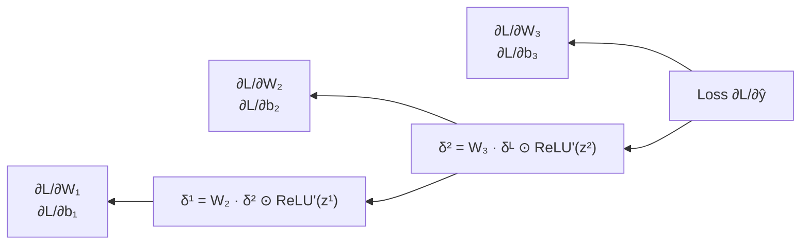
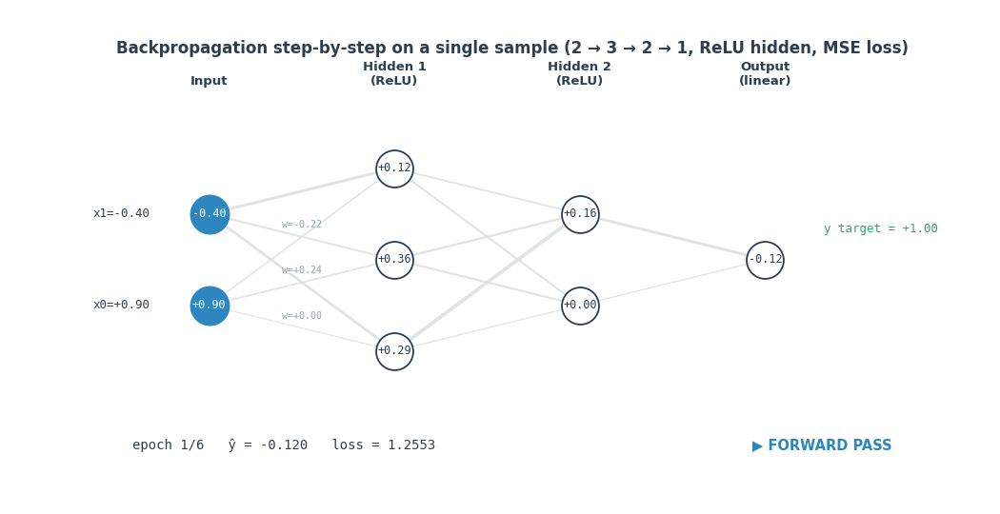
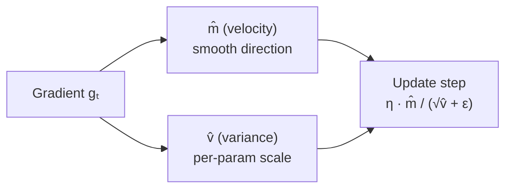

# Ch.5 — Backprop & Optimisers

> **Running theme:** You have a two-hidden-layer network predicting California house values (Ch.4). It can do a forward pass. Now you need to train it — compute exact gradients through every layer and pick an optimiser that converges faster than vanilla SGD. This chapter gives you the engine under the hood.

---

## 1 · Core Idea

**Backpropagation** efficiently computes $\nabla_\mathbf{W}\mathcal{L}$ for every weight in the network using the **chain rule** — propagating the error signal backwards from the output layer inward.

**Optimisers** use those gradients to update weights. They differ in how they accumulate and scale gradient history:

```
SGD → Momentum → RMSProp → Adam
 (bare)  (velocity decay)  (per-param scale)  (both combined)
```

The gradient tells you the direction of steepest ascent in loss-space. The optimiser decides *how far* and *in which direction variant* to step.

---

## 2 · Running Example

Same two-hidden-layer network from Ch.4:

```
8 inputs → [128 ReLU] → [64 ReLU] → 1 output (linear)
Loss: MSE   L = (1/n) Σ (y - ŷ)²
```

We watch the **training loss curve** as we swap optimisers. A good optimiser should converge faster (fewer epochs to the same loss) and land in a better minimum.

---

## 3 · Math

### 3.1 Chain rule — one output layer

For the final linear layer with output $\hat{y} = \mathbf{w}^\top \mathbf{h} + b$:

$$\frac{\partial \mathcal{L}}{\partial \hat{y}} = \frac{2}{n}(\hat{y} - y) \quad \text{(MSE gradient)}$$

$$\frac{\partial \mathcal{L}}{\partial \mathbf{w}} = \frac{\partial \mathcal{L}}{\partial \hat{y}} \cdot \mathbf{h}^\top \qquad \frac{\partial \mathcal{L}}{\partial b} = \frac{\partial \mathcal{L}}{\partial \hat{y}}$$

### 3.2 Chain rule through a ReLU hidden layer

Let $\mathbf{z}^{(l)} = \mathbf{W}_l^\top \mathbf{h}^{(l-1)} + \mathbf{b}_l$ and $\mathbf{h}^{(l)} = \text{ReLU}(\mathbf{z}^{(l)})$.

The upstream gradient $\delta^{(l)} = \frac{\partial \mathcal{L}}{\partial \mathbf{z}^{(l)}}$ (called the **error signal**):

$$\delta^{(l)} = \left(\mathbf{W}_{l+1}\, \delta^{(l+1)}\right) \odot \mathbf{1}\!\left[\mathbf{z}^{(l)} > 0\right]$$

| Symbol | Meaning |
|---|---|
| $\odot$ | element-wise (Hadamard) product |
| $\mathbf{1}[z > 0]$ | ReLU derivative: 1 if $z>0$, else 0 |
| $\delta^{(l+1)}$ | error signal from the layer above |

Weight gradient for layer $l$:

$$\frac{\partial \mathcal{L}}{\partial \mathbf{W}_l} = \mathbf{h}^{(l-1)\top} \delta^{(l)}$$

$$\frac{\partial \mathcal{L}}{\partial \mathbf{b}_l} = \sum_\text{batch} \delta^{(l)}$$

**Plain-English:** Backprop is just the chain rule applied in reverse order. You store the forward-pass values ($\mathbf{z}^{(l)}$, $\mathbf{h}^{(l)}$), then multiply upstream error by local derivative at each layer.

### 3.3 Optimiser update rules

Let $g_t = \nabla_\mathbf{W}\mathcal{L}$ at step $t$, $\eta$ = learning rate.

**Vanilla SGD:**
$$\mathbf{W}_{t+1} = \mathbf{W}_t - \eta\, g_t$$

**SGD + Momentum** ($\mu$ typically 0.9):
$$p_{t+1} = \mu\, p_t + g_t \qquad \mathbf{W}_{t+1} = \mathbf{W}_t - \eta\, p_{t+1}$$

**RMSProp** ($\rho$ typically 0.9):
$$s_{t+1} = \rho\, s_t + (1-\rho)\, g_t^2 \qquad \mathbf{W}_{t+1} = \mathbf{W}_t - \frac{\eta}{\sqrt{s_{t+1}} + \epsilon}\, g_t$$

**Adam** ($\beta_1=0.9$, $\beta_2=0.999$):
$$m_{t+1} = \beta_1 m_t + (1-\beta_1) g_t \quad \text{(first moment / velocity)}$$
$$v_{t+1} = \beta_2 v_t + (1-\beta_2) g_t^2 \quad \text{(second moment / variance)}$$
$$\hat{m} = \frac{m_{t+1}}{1-\beta_1^t} \quad \hat{v} = \frac{v_{t+1}}{1-\beta_2^t} \quad \text{(bias correction)}$$
$$\mathbf{W}_{t+1} = \mathbf{W}_t - \frac{\eta\, \hat{m}}{\sqrt{\hat{v}} + \epsilon}$$

| Symbol | Meaning |
|---|---|
| $p_t$ | momentum velocity (SGD+Momentum) |
| $s_t$ | running square of gradients (RMSProp) |
| $m_t$ | first moment estimate (Adam) |
| $v_t$ | second moment estimate / variance (Adam) |
| $\epsilon$ | small constant (~1e-8) for numerical stability |
| $\beta_1^t$ | $\beta_1$ raised to the power of step $t$ |

**Housing intuition:** Adam automatically gives a smaller effective step to `Population` (which has noisy, large gradients) and a larger effective step to `AveBedrms` (sparse, near-zero gradients). It adapts per parameter — vanilla SGD applies the same step size to all weights.

### 3.4 Learning rate schedules

| Schedule | Rule | When to use |
|---|---|---|
| **Constant** | $\eta$ fixed | quick experiments |
| **Step decay** | $\eta \leftarrow \eta \times \gamma$ every $k$ epochs | standard baseline |
| **Cosine annealing** | $\eta_t = \eta_{\min} + \frac{1}{2}(\eta_{\max}-\eta_{\min})(1+\cos\tfrac{\pi t}{T})$ | longer training runs |
| **Warmup + decay** | ramp up for $w$ steps, then decay | large models, transformers |

---

## 4 · Step by Step

1. **Forward pass.** Run the network; store all $\mathbf{z}^{(l)}$ and $\mathbf{h}^{(l)}$ (needed for backward pass).

2. **Compute loss.** $\mathcal{L} = \frac{1}{n}\sum_i (y_i - \hat{y}_i)^2$ for regression.

3. **Output layer gradient.** $\delta^{(L)} = \frac{2}{n}(\hat{y} - y)$ (scalar per sample, MSE derivative).

4. **Propagate backwards.** For each layer $l$ from last hidden to first: multiply upstream error by local ReLU derivative, then compute weight/bias gradients.

5. **Accumulate over batch.** Average gradients across the mini-batch.

6. **Optimiser step.** Update weights using SGD / Momentum / Adam formula.

7. **Repeat for all batches and epochs.** Monitor training + validation loss.

---

## 5 · Key Diagrams

### Backprop data flow



### Animation — one full training step, neuron by neuron

A 2 → 3 → 2 → 1 network trained on a single fixed sample `(x = [+0.90, −0.40], y = +1.00)`. Each epoch cycles through three phases:

1. **Forward pass (blue).** Neurons light up left → right; their numbers are the activations $h^{(l)}$. Edges feeding the active layer glow to show which weights contributed to that layer's pre-activation.
2. **Backward pass (red).** Starting at the output, neurons light up right → left showing the error signal $\delta^{(l)} = (W_{l+1}\,\delta^{(l+1)}) \odot \mathbf{1}[z^{(l)} > 0]$. The glowing edges are the weights whose gradient was just computed from that $\delta$.
3. **Update (green).** One SGD step is applied — every edge flashes green and the weight values drift. Watch the header: $\hat{y}$ moves towards the target `+1.00` and the loss ticks down each epoch.



### Optimiser convergence comparison (conceptual)

```
Loss
  │  SGD ─────────────────────────────────────────── (slow, noisy)
  │    Momentum ──────────────────────────           (faster, overshoots)
  │      RMSProp ──────────────────                  (adaptive scale)
  │        Adam ──────────────                       (fastest convergence)
  └─────────────────────────────────── Epochs
```

### Gradient flow through ReLU

```
   forward:   z = -2  →  h = 0       z = 3  →  h = 3
   backward:  δ̃ =  0  (dead)         δ̃ = δ  (pass-through)
              └── ReLU derivative = 0    └── ReLU derivative = 1
```

### Adam: first and second moment



---

## 6 · Hyperparameter Dial

| Dial | Too low | Sweet spot | Too high |
|---|---|---|---|
| **Learning rate** | crawls, 1000s of epochs needed | 1e-3 (Adam), 1e-2 (SGD) | loss spikes, diverges |
| **Momentum** ($\mu$) | no acceleration | 0.9 | overshoots past minimum |
| **Batch size** | very noisy, slow per-epoch | 64–256 | smooth but misses sharp minima; memory cost |
| **Epochs** | underfits | until val loss plateaus | overfits |
| **Warmup steps** | Adam starts with wrong $\hat{m}/\hat{v}$ | 5–10% of total steps | too slow to reach peak LR |

---

## 7 · Code Skeleton

```python
import numpy as np
from sklearn.datasets import fetch_california_housing
from sklearn.model_selection import train_test_split
from sklearn.preprocessing import StandardScaler
from sklearn.neural_network import MLPRegressor
from sklearn.metrics import r2_score

housing = fetch_california_housing()
X, y = housing.data, housing.target
X_train, X_test, y_train, y_test = train_test_split(X, y, test_size=0.2, random_state=42)
scaler = StandardScaler()
X_train_s = scaler.fit_transform(X_train)
X_test_s  = scaler.transform(X_test)

# --- 1. Vanilla SGD ---
sgd = MLPRegressor(hidden_layer_sizes=(128, 64), activation='relu',
                   solver='sgd', learning_rate_init=0.01, max_iter=300, random_state=42)
sgd.fit(X_train_s, y_train)

# --- 2. SGD + Momentum ---
mom = MLPRegressor(hidden_layer_sizes=(128, 64), activation='relu',
                   solver='sgd', learning_rate_init=0.01, momentum=0.9,
                   max_iter=300, random_state=42)
mom.fit(X_train_s, y_train)

# --- 3. Adam (default solver) ---
adam = MLPRegressor(hidden_layer_sizes=(128, 64), activation='relu',
                    solver='adam', learning_rate_init=1e-3, max_iter=300, random_state=42)
adam.fit(X_train_s, y_train)

for name, m in [('SGD', sgd), ('Momentum', mom), ('Adam', adam)]:
    print(f"{name:12s}  R²={r2_score(y_test, m.predict(X_test_s)):.4f}"
          f"  epochs={m.n_iter_}")

# --- Manual Adam step (NumPy) ---
def adam_step(W, g, m, v, t, lr=1e-3, b1=0.9, b2=0.999, eps=1e-8):
    m = b1 * m + (1 - b1) * g
    v = b2 * v + (1 - b2) * g ** 2
    m_hat = m / (1 - b1 ** t)
    v_hat = v / (1 - b2 ** t)
    W = W - lr * m_hat / (np.sqrt(v_hat) + eps)
    return W, m, v
```

---

## 8 · What Can Go Wrong

- **Learning rate too high.** Loss jumps, never stabilises. Symptom: NaN loss after epoch 1–2. Fix: reduce `learning_rate_init` by 10×.

- **Adam masks bad architecture.** Adam's per-parameter scaling can make a poorly structured network appear to converge. Switching to SGD later reveals the underlying problem. Always sanity-check with SGD once Adam converges.

- **Exploding gradients.** Without gradient clipping or proper init, gradients can grow exponentially through deep networks. Symptom: weights → NaN. Fix: use He init, clip gradients (`np.clip(g, -1, 1)`), or add BatchNorm (Ch.6).

- **Dying ReLU.** If many neurons receive always-negative inputs, their ReLU derivative is permanently 0 — the gradient simply does not flow. Symptom: loss stops decreasing after a few epochs with many zero activations. Fix: use leaky ReLU, He init, smaller initial LR.

- **Momentum overshooting.** With high $\mu$ (0.99) and large LR, the optimizer shoots past the minimum and oscillates. Symptom: loss oscillates rather than smoothly decreasing. Fix: reduce momentum or LR.

---

## 9 · Interview Checklist

| Must know | Likely asked | Trap to avoid |
|---|---|---|
| What is backprop? | Efficient application of chain rule backwards through the computation graph — reuses stored forward-pass values | It's not "gradient descent" — backprop computes gradients; GD uses them |
| Why does ReLU make backprop easy? | Derivative is 1 for $z>0$, 0 otherwise — a single comparison with no exp/log | Dying ReLU: if $z<0$ for all inputs, gradient is zero forever |
| Why use Adam over SGD? | Adam adapts step size per parameter using gradient history; converges faster with less LR tuning| Adam can converge to sharper minima than SGD; SGD often generalises better |
| What is bias correction in Adam? | Divides $m_t, v_t$ by $(1-\beta^t)$ to compensate for zero-initialisation at step 1 | Without it, first few steps are severely under-sized |
| What does a learning rate schedule do? | Allows large steps early (fast progress) and small steps later (fine-grained convergence) | Cosine annealing without warmup can be unstable at the start |
| **Gradient clipping:** if $\|\nabla\| > \text{clip\_value}$, rescale the gradient vector so its norm equals `clip_value`; direction is preserved. Fixes exploding gradients without affecting the update direction | "How do you handle exploding gradients in an RNN?" | "Gradient clipping fixes vanishing gradients too" — clipping only limits large gradients; vanishing gradients (near-zero norms) are unaffected and require architecture changes (residual connections, LSTM gates, careful initialisation) |
| **Weight decay vs L2 regularisation:** identical in SGD ($W_{t+1} = W_t(1-\eta\lambda) - \eta\nabla L$) but *different* in Adam — standard L2 adds $\lambda W$ to the gradient before adaptive scaling, so high-variance parameters get less regularisation; **AdamW** applies weight decay directly to the parameter decoupled from the gradient update, giving consistent regularisation regardless of gradient magnitude | "What is the difference between Adam+L2 and AdamW?" | "Adam with L2 regularisation is the same as AdamW" — it is not; AdamW is the correct decoupled implementation and is the default in most modern training recipes |

---

## Bridge to Chapter 6

You can now train the network and watch the loss decrease. But if you let it run long enough, the training loss keeps falling while the validation loss rises — the model memorises the training districts instead of learning general patterns. Chapter 6 — **Regularisation** — introduces L1, L2, Dropout, and early stopping to close that gap.


## Illustrations


