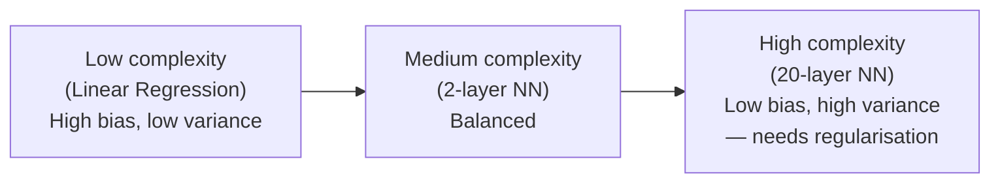
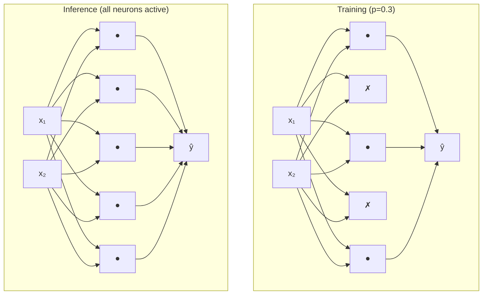

# Ch.6 — Regularisation

> **The story.** **L2 ("ridge") regression** was published in **1970** by **Arthur Hoeffding-style** statisticians **Hoerl & Kennard** to handle ill-conditioned matrices in OLS — the same year **Andrey Tikhonov** independently proposed identical regularisation in the Soviet inverse-problems literature, which is why you'll see the term *Tikhonov regularisation* in some textbooks. **L1 ("lasso")** waited until **1996** when **Robert Tibshirani** showed that an L1 penalty doesn't just shrink coefficients — it drives many of them to exactly zero, giving you free feature selection. The deep-learning era added two more weapons: **dropout** (Srivastava, Hinton et al. 2014), which randomly mutes neurons each batch and was the single biggest reason AlexNet-era nets stopped catastrophically overfitting; and **early stopping**, an idea so old (Morgan & Bourlard 1990) that nobody bothers to cite it. All four ideas attack the same enemy: a model that has memorised the training set instead of learning the regularities behind it.
>
> **Where you are in the curriculum.** Your two-hidden-layer housing network from [Ch.4](../ch04-neural-networks/) trained with Adam from [Ch.5](../ch05-backprop-optimisers/) achieves R² = 0.83 on the training set but only 0.67 on the test set. The model has memorised 200+ training districts rather than learning general pricing patterns. This chapter adds the four guardrails — L1, L2, Dropout, Early Stopping — that close that gap, and that you will reach for in every chapter from here on.
>
> **Notation in this chapter.** $\lambda$ — **regularisation strength** (the bigger, the more you penalise complexity); $\|\mathbf{w}\|_2^2=\sum_i w_i^2$ — the **L2 / Ridge** penalty; $\|\mathbf{w}\|_1=\sum_i|w_i|$ — the **L1 / Lasso** penalty; $L_{\text{reg}}=L_{\text{data}}+\lambda\,\Omega(\mathbf{w})$ — the regularised objective; $p$ — dropout probability (the chance a neuron is zeroed during training); $\mu_B,\sigma_B^2$ — batch-normalisation statistics computed over a mini-batch $B$; $R^2_{\text{train}},R^2_{\text{test}}$ — train/test coefficient of determination (the gap is what regularisation closes).

---

## 1 · Core Idea

**Regularisation** is any technique that reduces the gap between training performance and generalisation performance. All techniques share one goal: prevent the model from fitting noise in the training data.

```
Underfitting          Just right           Overfitting
(high bias)           (balanced)           (high variance)
───────────           ──────────           ────────────────
train R² low          train ≈ test R²      train R² >> test R²
flat predictions      captures signal      wiggly, memorised
```

The four tools and what they target:

| Tool | Mechanism | Effect on weights |
|---|---|---|
| **L2 (Weight Decay)** | adds $\lambda \|\mathbf{W}\|_2^2$ to the loss | shrinks all weights toward zero |
| **L1 (Lasso)** | adds $\lambda \|\mathbf{W}\|_1$ to the loss | pushes many weights to exactly zero |
| **Dropout** | randomly zeros `p` fraction of neurons during training | forces redundant representations |
| **Early Stopping** | halt training on validation loss plateau | prevents late-epoch memorisation |

---

## 2 · Running Example

Network from Ch.4: `8 inputs → [128 ReLU] → [64 ReLU] → 1 linear`  
Trained on 80% of California Housing; evaluated on 20% held-out test.

Without regularisation: model memorises district-specific quirks (a few outlier luxury blocks, census artefacts). **The goal:** improve test R² by at least 0.05 points with regularisation.

---

## 3 · Math

### 3.1 L2 Regularisation (Ridge / Weight Decay)

Penalised loss:

$$\mathcal{L}_\text{L2} = \mathcal{L}_\text{MSE} + \lambda \sum_{l} \|\mathbf{W}_l\|_F^2$$

| Symbol | Meaning |
|---|---|
| $\lambda$ | regularisation strength (hyperparameter) |
| $\|\mathbf{W}_l\|_F^2$ | sum of squared weights in layer $l$ |

Gradient effect — every weight update gains an extra shrinkage term:

$$\frac{\partial \mathcal{L}_\text{L2}}{\partial \mathbf{W}} = \frac{\partial \mathcal{L}_\text{MSE}}{\partial \mathbf{W}} + 2\lambda \mathbf{W}$$

Equivalent update rule (weight decay form):

$$\mathbf{W} \leftarrow (1 - 2\eta\lambda)\mathbf{W} - \eta \nabla_\mathbf{W} \mathcal{L}_\text{MSE}$$

**Housing intuition:** L2 prevents any single feature (e.g., `Latitude`) from dominating predictions with a very large weight. All weights are nudged toward zero, keeping the model smooth.

### 3.2 L1 Regularisation (Lasso)

Penalised loss:

$$\mathcal{L}_\text{L1} = \mathcal{L}_\text{MSE} + \lambda \sum_{l} \|\mathbf{W}_l\|_1$$

Gradient:

$$\frac{\partial \mathcal{L}_\text{L1}}{\partial \mathbf{W}} = \frac{\partial \mathcal{L}_\text{MSE}}{\partial \mathbf{W}} + \lambda \cdot \text{sign}(\mathbf{W})$$

The $\text{sign}(\mathbf{W})$ term applies a **constant pull** toward zero — small weights cross zero and stay there (sparsity). L2 applies a proportional pull — large weights shrink faster, small weights barely move (never exactly zero).

### 3.3 Dropout

During training, each neuron is independently zeroed with probability $p$ (the **drop rate**):

$$\tilde{\mathbf{h}} = \mathbf{h} \odot \mathbf{m}, \quad m_i \sim \text{Bernoulli}(1-p)$$

To keep expected activation magnitude the same, surviving neurons are **scaled up** by $\frac{1}{1-p}$ during training (inverted dropout):

$$\tilde{\mathbf{h}} = \frac{1}{1-p} \cdot (\mathbf{h} \odot \mathbf{m})$$

At **test time**, dropout is disabled — all neurons are active. No scaling is needed because inverted dropout already corrected the training magnitudes.

| Symbol | Meaning |
|---|---|
| $p$ | drop probability (fraction of neurons zeroed per forward pass) |
| $\mathbf{m}$ | binary mask vector, resampled every forward pass |
| $\odot$ | element-wise product |

**Why it works:** Each training step uses a different random sub-network. The full network is implicitly an ensemble of $2^n$ sub-networks. No single neuron can rely on a specific other neuron being present → forces distributed representations.

### 3.4 Early Stopping

No equation — it's a training protocol:

1. Split data into train / validation (typically 80/10/10 train/val/test).
2. At each epoch, record `val_loss`.
3. If `val_loss` has not improved for `patience` consecutive epochs, halt training.
4. Restore weights from the epoch with the **best** `val_loss`.

Key quantity — **generalisation gap**:

$$\text{gap} = \mathcal{L}_\text{val} - \mathcal{L}_\text{train}$$

A rising gap signals overfitting. Early stopping jumps off the train before the gap becomes a chasm.

---

## 4 · Step by Step

1. **Establish a baseline.** Train without any regularisation; record train R² and test R². This is your overfitting reference point.

2. **Add L2 first.** It's the safest choice — set `alpha` (sklearn) or `weight_decay` (TF/PyTorch). Start at `1e-4`; tune in log scale.

3. **Try Dropout if L2 isn't enough.** Add after hidden layers only (never on the output layer). Start with `p = 0.2`; raise to 0.5 if still overfitting.

4. **Enable Early Stopping.** Set `patience = 20` epochs. Monitor validation loss, not training loss.

5. **Combine if needed.** L2 + Dropout + Early Stopping are complementary and stack well. L1 + Dropout is unusual (L1 already induces sparsity).

6. **Final evaluation.** Only look at the test set once — after all hyperparameters are locked on the validation set.

---

## 5 · Key Diagrams

### Bias–variance tradeoff as model complexity grows



### L1 vs L2 penalty geometry

```
L2 (circle):           L1 (diamond):
weight space           weight space

    ↑ w₂                   ↑ w₂
    │  ●←loss contours      │  ◆←diamond constraint
    │ /                     │ /
────●──────→ w₁         ────◆──────→ w₁
  minimum                minimum
  lands off axis          lands ON axis
  (dense solution)        (sparse — w=0)
```

### Dropout: train vs test



### Early stopping — when to halt

```
Loss
  │  train loss ────────────────────────────↘ (keeps falling)
  │  val loss   ─────────────↘────────────↗  (rises = overfitting)
  │                          ↑
  │                    STOP HERE
  └──────────────────────────────────── Epochs
        best val checkpoint saved
```

---

## 6 · Hyperparameter Dial

| Dial | Too low | Sweet spot | Too high |
|---|---|---|---|
| **λ (L1/L2 strength)** | no effect | 1e-4 → 1e-2 (tune in log scale) | underfits, weights crushed to zero |
| **Dropout rate** $p$ | no effect | 0.2–0.5 for hidden layers | too much signal lost; model can't learn |
| **Patience (early stopping)** | halts too early | 10–30 epochs | effectively disable early stopping |
| **Validation fraction** | noisy early-stop signal | 10–20% of training data | too little data for training |

**Rule of thumb for tabular data:** Start with L2 (`alpha=1e-4`). If train-test gap is still large after 300 epochs, add dropout at 0.2. If training is noisy, enable early stopping with `patience=20`. Rarely need all three simultaneously.

---

## 7 · Code Skeleton

```python
from sklearn.neural_network import MLPRegressor
from sklearn.datasets import fetch_california_housing
from sklearn.model_selection import train_test_split
from sklearn.preprocessing import StandardScaler
from sklearn.metrics import r2_score

housing = fetch_california_housing()
X, y = housing.data, housing.target
X_tr, X_te, y_tr, y_te = train_test_split(X, y, test_size=0.2, random_state=42)
scaler = StandardScaler()
X_tr_s = scaler.fit_transform(X_tr)
X_te_s  = scaler.transform(X_te)

# --- Baseline (no regularisation) ---
base = MLPRegressor(hidden_layer_sizes=(128, 64), activation='relu',
                    solver='adam', max_iter=400, random_state=42)
base.fit(X_tr_s, y_tr)

# --- L2 (alpha parameter in sklearn) ---
l2 = MLPRegressor(hidden_layer_sizes=(128, 64), activation='relu',
                  solver='adam', alpha=1e-3, max_iter=400, random_state=42)
l2.fit(X_tr_s, y_tr)

# --- Early stopping ---
es = MLPRegressor(hidden_layer_sizes=(128, 64), activation='relu',
                  solver='adam', alpha=1e-3,
                  early_stopping=True, validation_fraction=0.1,
                  n_iter_no_change=20, max_iter=600, random_state=42)
es.fit(X_tr_s, y_tr)

for name, m in [('Baseline', base), ('L2', l2), ('L2+EarlyStopping', es)]:
    r2_tr = r2_score(y_tr, m.predict(X_tr_s))
    r2_te = r2_score(y_te, m.predict(X_te_s))
    print(f"{name:<22}  train={r2_tr:.4f}  test={r2_te:.4f}  gap={r2_tr-r2_te:+.4f}")

# --- Manual inverted dropout (NumPy) ---
def dropout(h, p, training=True):
    """Inverted dropout. h: activations, p: drop rate."""
    if not training or p == 0:
        return h
    mask = (np.random.rand(*h.shape) > p).astype(float)
    return h * mask / (1 - p)     # scale up to preserve expected magnitude
```

---

## 8 · What Can Go Wrong

- **Applying Dropout before the output layer.** The output neuron needs all information to produce a calibrated prediction. Dropout on the output layer adds random noise directly to predictions. Always place Dropout only on hidden layers.

- **Monitoring training loss for early stopping.** Training loss can keep decreasing even as the model overfits. Always stop on **validation loss** (or validation metric). Training loss is blind to generalisation.

- **λ too large collapses all weights.** L2 with `alpha=0.1` on a 128-unit network pushes most weights near zero, effectively reducing the network to width 1. R² collapses. Tune in log scale: `[1e-5, 1e-4, 1e-3, 1e-2]`.

- **Dropout without rescaling (naive dropout).** If you zero `p` fraction of neurons without scaling up the survivors, the expected activation magnitude drops by $(1-p)$ — the output layer sees a different scale at test time. Inverted dropout avoids this.

- **Validation set contaminated by preprocessing.** Fitting `StandardScaler` on train+val (instead of train only) leaks test-distribution statistics. Always fit the scaler on training data only, then `transform` validation and test.

---

## 9 · Interview Checklist

| Must know | Likely asked | Trap to avoid |
|---|---|---|
| What does L2 regularisation do to weights? | Adds a penalty $\lambda\|\mathbf{W}\|^2$ to the loss, producing a constant shrinkage factor $(1-2\eta\lambda)$ each step | L2 shrinks toward zero but never reaches it — L1 can push weights to exactly zero |
| Why does Dropout work? | Each step trains a random sub-network; the full network is an implicit ensemble of $2^n$ sub-networks | At test time, dropout is disabled — forgetting this is a common bug |
| When does early stopping outperform L2? | When the optimum number of epochs is highly dataset-dependent and hard to predict a priori | Patience must be set relative to how noisily the val curve moves |
| L1 vs L2 in neural networks? | L1 is rarely used directly on neural net weights (non-smooth gradient at 0); L2 / weight decay is standard | L1 is very common in linear models (Lasso) but in neural nets Dropout fills the sparsity role |
| What is the generalisation gap? | $\mathcal{L}_\text{val} - \mathcal{L}_\text{train}$ — a rising gap is the early-warning signal for overfitting | A small gap with high loss on both sets is underfitting, not good generalisation |
| **Batch Normalisation as regulariser:** the noise from estimating mean and variance from a mini-batch provides implicit regularisation similar to Dropout; using both BatchNorm and Dropout together often underperforms — BatchNorm's internal normalisation is disrupted by Dropout's random zeroing | "Can you use BatchNorm and Dropout together?" | Stacking BatchNorm + Dropout in every layer — in practice one or the other is sufficient; prefer BatchNorm for CNNs, Dropout for fully connected layers |
| **Data augmentation as regularisation:** random crops, flips, colour jitter, or Mixup applied during training increase the effective dataset size, directly reducing variance without touching the model architecture | "How does data augmentation relate to regularisation?" | "Data augmentation only helps with image data" — text augmentation (synonym replacement, back-translation), audio augmentation (SpecAugment), and tabular augmentation (Mixup on features) are all well-established |

---

## Bridge to Chapter 7

You can now train a well-regularised dense network. But dense networks treat every input pixel (or feature) symmetrically — they don't exploit spatial structure. Chapter 7 — **CNNs** — introduces convolutional filters that share weights across positions, making them orders of magnitude more efficient for image-like inputs.


## Illustrations


