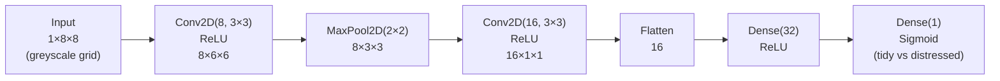
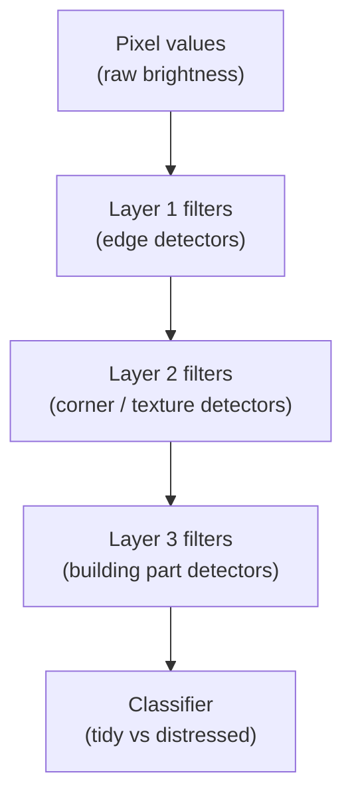

# Ch.7 — CNNs

> **Running theme:** The real estate platform now wants to classify **property condition** from synthetic aerial-view image grids — tidy vs distressed neighbourhoods. Dense networks (Ch.4–6) treat each pixel independently and have no notion of spatial neighbourhoods. A CNN shares learned filters across the entire image, cutting parameters by orders of magnitude while learning local patterns like edges, textures, and shapes.

---

## 1 · Core Idea

A **Convolutional Neural Network** replaces the dense matrix multiply with a **sliding dot product** (convolution). The same learned filter is applied at every spatial position, exploiting two properties of images:

- **Translation equivariance:** a roof looks like a roof whether it's top-left or bottom-right.
- **Locality:** nearby pixels are more informative about each other than distant ones.

```
Dense layer:    each of the 512×512 = 262,144 pixels connects to every neuron
                → millions of weights per layer, no spatial bias

Conv layer:     a 3×3 filter has only 9 weights;
                it slides across all positions → same features detected everywhere
```

---

## 2 · Running Example

We create a **synthetic 8×8 pixel grid** representing a neighbourhood aerial view. Each grid cell has a brightness value: bright = well-maintained building, dark = distressed/empty lot. The task: binary classifier — `0 = tidy`, `1 = distressed`.

This keeps the notebook runnable without downloading a large image dataset, while still demonstrating every CNN concept (convolution, pooling, feature maps, depth progression).

---

## 3 · Math

### 3.1 Convolution (2D, single channel)

For an input feature map $\mathbf{X} \in \mathbb{R}^{H \times W}$ and a kernel $\mathbf{K} \in \mathbb{R}^{k \times k}$:

$$(\mathbf{X} * \mathbf{K})_{i,j} = \sum_{u=0}^{k-1} \sum_{v=0}^{k-1} \mathbf{X}_{i+u,\, j+v} \cdot \mathbf{K}_{u,v}$$

Output size with padding $p$ and stride $s$:

$$H_\text{out} = \left\lfloor \frac{H + 2p - k}{s} \right\rfloor + 1$$

| Symbol | Meaning |
|---|---|
| $H, W$ | input height and width |
| $k$ | kernel (filter) size (e.g., 3 for 3×3) |
| $p$ | zero-padding applied to input borders |
| $s$ | stride — how many pixels the filter moves per step |
| $*$ | cross-correlation (commonly called convolution in ML) |

**No. of parameters per conv layer:**

$$\text{params} = (k \times k \times C_\text{in} + 1) \times C_\text{out}$$

where $C_\text{in}$ is input channels and $C_\text{out}$ is the number of filters. The `+1` is the bias per filter.

### 3.2 Pooling

**Max pooling** — take the maximum value in each $p \times p$ non-overlapping window:

$$(\text{MaxPool}(\mathbf{X}))_{i,j} = \max_{u,v \in [0,p)} \mathbf{X}_{i \cdot p + u,\, j \cdot p + v}$$

**Average pooling** — take the mean instead of max. Global Average Pooling (GAP) averages the entire feature map to a single value per channel — often used before the final classifier.

Max pooling is more common: it retains the **strongest activation** (was the pattern present?), discarding its exact location (translation invariance).

### 3.3 Receptive field

After stacking $L$ conv layers each with kernel size $k$ and stride 1:

$$\text{Receptive field} = 1 + L \cdot (k - 1)$$

Two 3×3 layers → receptive field of 5×5. Three → 7×7. Deeper = broader context without increasing parameters per layer.

### 3.4 Feature hierarchy

| Layer depth | What filters learn |
|---|---|
| Layer 1 | Edges, colour gradients |
| Layer 2 | Corners, simple textures |
| Layer 3 | Parts (windows, rooftops, fences) |
| Layer 4+ | Semantic concepts (building style, condition) |

This hierarchy emerges from backprop — not designed by hand.

---

## 4 · Step by Step

1. **Prepare input.** Images are $(N, C, H, W)$ tensors — batch × channels × height × width. Normalise pixel values to $[0, 1]$ or standardise per channel.

2. **Convolutional blocks.** Apply `Conv2D → ReLU → (BatchNorm)` repeatedly. Increase filter count as spatial resolution decreases: 32 → 64 → 128.

3. **Pooling / downsampling.** After every 1–2 conv blocks, apply `MaxPool2D(2×2)` to halve $H$ and $W$. This reduces computation and increases receptive field.

4. **Flatten or Global Average Pooling.** Convert the final feature map from $(N, C, H', W')$ to $(N, C \cdot H' \cdot W')$ (Flatten) or $(N, C)$ (GAP).

5. **Dense head.** One or two Dense + ReLU layers, then the classification output (Sigmoid for binary, Softmax for multi-class).

6. **Loss and optimiser.** Binary Cross-Entropy + Adam (Ch.5). Include batch normalisation (a normalisation technique that standardises layer inputs per mini-batch — not covered in Ch.6, but straightforward to add with `keras.layers.BatchNormalization()`).

---

## 5 · Key Diagrams

### Convolution: filter sliding across input

```
Input (5×5):        Filter (3×3):       Output (3×3):
┌─────────────┐     ┌───────┐           ┌─────────┐
│ 1  2  3  0  1│    │1  0  1│           │?  ?  ? │
│ 4  5  6  1  0│    │0  1  0│    →      │?  ?  ? │
│ 7  8  9  2  1│    │1  0  1│           │?  ?  ? │
│ 2  1  3  4  0│    └───────┘           └─────────┘
│ 0  1  2  1  3│
└─────────────┘
              ↑ filter slides 1 step at a time (stride=1, no padding)
              output[0,0] = 1·1 + 2·0 + 3·1 + 4·0 + 5·1 + 6·0 + 7·1 + 8·0 + 9·1 = 25
```

### CNN architecture (property condition classifier)



### Feature hierarchy



### Parameter count: Dense vs CNN

```
Dense on 8×8 input → 128 hidden units:
    64 × 128 + 128 = 8,320 parameters (first layer alone)

CNN: 3×3 filter, 8 filters (one conv block):
    (3×3×1 + 1) × 8 = 80 parameters (entire first layer)
```

---

## 6 · Hyperparameter Dial

| Dial | Too low | Sweet spot | Too high |
|---|---|---|---|
| **Filter count** | misses patterns | 32→64→128 (double per block) | wastes memory, slow |
| **Kernel size** | small receptive field (1×1 = pointwise) | 3×3 (standard) or 5×5 | 7×7+ (only in first layer of large-image nets) |
| **Depth (blocks)** | shallow representations | 3–5 conv blocks for small images | vanishing gradient without residual connections |
| **Stride** | full spatial resolution retained | 1 (conv), 2 (pooling) | too aggressive downsampling |
| **Padding** | output shrinks each block (`valid`) | `same` padding keeps $H, W$ | rarely >1 |

**Small-image rule:** For inputs ≤ 32×32, start with 2–3 conv blocks and no more than 128 filters. Adding depth without BatchNorm causes gradient collapse.

---

## 7 · Code Skeleton

```python
import numpy as np
from sklearn.datasets import fetch_california_housing

# ---- Synthetic image generator for housing scenario ----
def make_neighbourhood_grids(n_samples=2000, grid_size=8, seed=42):
    """Create synthetic 8×8 greyscale neighbourhood grids.
    Tidy (label=0): high mean brightness, low variance.
    Distressed (label=1): low mean brightness, high variance (patchy).
    """
    rng = np.random.default_rng(seed)
    X, y = [], []
    for _ in range(n_samples // 2):
        # Tidy: bright, low noise
        X.append(rng.normal(0.75, 0.1, (1, grid_size, grid_size)).clip(0, 1))
        y.append(0)
        # Distressed: darker, high noise
        X.append(rng.normal(0.35, 0.3, (1, grid_size, grid_size)).clip(0, 1))
        y.append(1)
    return np.array(X, dtype=np.float32), np.array(y, dtype=np.int32)

X_img, y_img = make_neighbourhood_grids()
print(f"X: {X_img.shape}  y: {y_img.shape}  classes: {np.unique(y_img)}")

# ---- Manual 2D convolution (NumPy) ----
def conv2d(x, kernel, stride=1, padding=0):
    """Single-channel 2D cross-correlation.
    x:      (H, W)  input
    kernel: (k, k)  filter
    Returns (H_out, W_out) output.
    """
    H, W = x.shape
    k = kernel.shape[0]
    if padding:
        x = np.pad(x, padding, mode='constant')
        H, W = x.shape
    H_out = (H - k) // stride + 1
    W_out = (W - k) // stride + 1
    out = np.zeros((H_out, W_out))
    for i in range(0, H_out):
        for j in range(0, W_out):
            out[i, j] = (x[i*stride:i*stride+k, j*stride:j*stride+k] * kernel).sum()
    return out

# ---- Keras model (requires tensorflow) ----
# from tensorflow import keras
# from tensorflow.keras import layers
#
# model = keras.Sequential([
#     layers.Input(shape=(1, 8, 8)),
#     layers.Conv2D(8,  3, activation='relu', data_format='channels_first', padding='valid'),
#     layers.MaxPooling2D(2, data_format='channels_first'),
#     layers.Conv2D(16, 3, activation='relu', data_format='channels_first', padding='valid'),
#     layers.Flatten(),
#     layers.Dense(32, activation='relu'),
#     layers.Dense(1, activation='sigmoid'),
# ])
# model.compile(optimizer='adam', loss='binary_crossentropy', metrics=['accuracy'])
# model.summary()
```

---

## 8 · What Can Go Wrong

- **Not using BatchNorm after deep conv stacks.** Stacking 5+ conv layers without BatchNorm causes internal covariate shift — later layers constantly adapt to shifting activation distributions. Symptoms: slow convergence, loss oscillation after ~10 epochs. Fix: add `BatchNormalization()` after each `Conv2D + ReLU`.

- **Kernel size too large on small inputs.** A 7×7 kernel on an 8×8 image with `valid` padding produces a 2×2 output after one layer — no spatial information left to pool. Always check output size: $(H - k) / s + 1$.

- **Using `Flatten` instead of Global Average Pooling (GAP) before the dense head.** For large inputs, Flatten produces a huge vector (e.g., 128 × 7 × 7 = 6,272) connected to every dense unit — re-introduces the parameter explosion CNNs were designed to avoid. GAP collapses the spatial dims to a single number per filter channel.

- **Not normalising pixel values.** CNNs are as sensitive to feature scale as dense networks (Ch.4). Raw pixel values in [0, 255] → divide by 255.0 before training.

- **Applying max pooling too aggressively.** Two consecutive MaxPool(2×2) on a 16×16 input → 4×4 → only 4×4 spatial information for the rest of the network. Spatial detail is gone before later filters can learn fine-grained patterns.

---

## 9 · Interview Checklist

| Must know | Likely asked | Trap to avoid |
|---|---|---|
| Why do CNNs need fewer parameters than dense nets? | Filters are shared across all spatial positions (weight sharing) — a 3×3 filter has just 9 weights regardless of image size | The dense equivalent of a conv layer grows quadratically with image resolution |
| What is translation equivariance? | The same filter response occurs wherever the pattern appears in the image | Pooling adds translation *invariance* — the response is similar regardless of exact position |
| Max pool vs average pool? | Max pool retains the strongest activation (was pattern present?); average pool retains overall energy | For classification, max pool is standard; for regression on spatial outputs, average pool can destroy signal |
| What does increasing filter depth (32→64→128) achieve? | More filters = more distinct patterns detected at that scale | Doubling filters doubles computation at that layer — computational cost grows linearly with depth but quadratically with resolution |
| What is the receptive field? | The region of the original input that influences a given neuron — grows with depth without increasing per-layer parameters | A neuron in layer 5 (all 3×3 kernels, stride 1) has receptive field $1 + 5 \times 2 = 11×11$ |
| **Depthwise separable convolution (MobileNet):** splits a standard conv into a **depthwise conv** (one filter per input channel, captures spatial patterns) + a **1×1 pointwise conv** (mixes channels); total compute $\approx \frac{1}{N} + \frac{1}{D_k^2}$ of a standard conv — roughly 8–9× cheaper for 3×3 kernels with 64 channels | "What makes MobileNet efficient?" | "Faster convolutions always sacrifice accuracy" — MobileNetV3 matches ResNet-50 on ImageNet at 4× fewer parameters; efficiency and accuracy are not fundamentally at odds |
| **Residual (skip) connections (ResNet):** $y = F(x) + x$ — the identity shortcut allows gradients to flow directly to early layers during backprop, making 50–200 layer networks trainable; the network learns the *residual* $F(x) = y - x$ rather than the full mapping, making each layer's task as small as possible | "Why do residual connections help with very deep networks?" | "Residual connections eliminate vanishing gradients" — they mitigate gradient shrinkage; very deep networks still benefit from careful initialisation and BatchNorm |

---

## Bridge to Ch.8

CNNs exploit spatial locality. But what if your data is a **sequence** — house prices by month, a sentence, a time series? Sequential data has temporal locality and long-range dependencies that pooling discards. Chapter 8 — **RNNs / LSTMs / GRUs** — introduces networks that carry a hidden state forward through time, capturing context that CNNs cannot.
