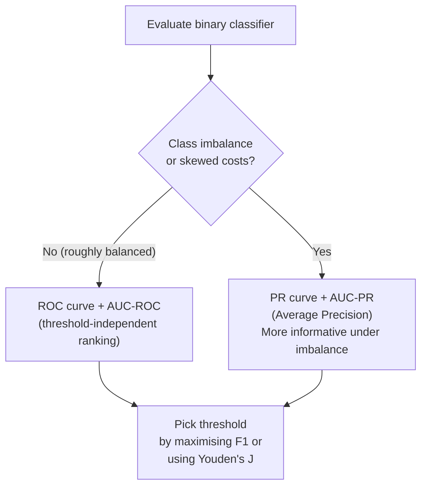

# Ch.9 — Metrics Deep Dive

> **Running theme:** The real estate platform's high-value district classifier from Ch.2 is in production. A stakeholder asks: "How good is it?" The answer requires more than a single accuracy number. Ch.9 dissects the full metrics toolkit — for classification and regression — so you can diagnose what your model actually does, not just what it claims.

---

## 1 · Core Idea

A model's reported performance depends entirely on which metric you choose to believe. On imbalanced data, accuracy is a lie. R² looks good with more features even when they're noise. AUC-ROC summarises a classifier at all thresholds but ignores class imbalance. AUC-PR doesn't.

```
Accuracy alone:  "95% accurate" on a dataset with 5% positives
                  → predicting all-negative also gets 95%
                  → the model might be doing nothing useful

Full toolkit:    Confusion matrix → Precision / Recall / F1
                 Threshold sweep → ROC curve → AUC-ROC
                 Precision-Recall curve → AUC-PR
                 Regression: RMSE / MAE / MAPE / R²
```

Every metric answers a different question. Know the question before picking the metric.

---

## 2 · Running Example

**Classification:** The Ch.2 classifier — is a California district high-value (above median house price)?  
**Regression:** The Ch.1 regressor — predict median house value from all 8 features.

Dataset: **California Housing** (`sklearn.datasets.fetch_california_housing`)  
Classification target: `high_value` — 1 if `MedHouseVal > median(MedHouseVal)`, else 0 (balanced)  
Regression target: `MedHouseVal` (median house value in $100k units)

By using the same dataset as Ch.1 and Ch.2, this chapter is pure evaluation: same problem, same model, every possible way to measure its quality.

---

## 3 · Math

### 3.1 Confusion Matrix

Every binary prediction falls into one of four cells:

|  | Predicted Positive | Predicted Negative |
|---|---|---|
| **Actual Positive** | TP (True Positive) | FN (False Negative — missed it) |
| **Actual Negative** | FP (False Positive — false alarm) | TN (True Negative) |

All classification metrics derive directly from TP, TN, FP, FN.

### 3.2 Classification Metrics

**Accuracy** — what fraction of all predictions are correct:

$$\text{Accuracy} = \frac{TP + TN}{TP + TN + FP + FN}$$

Misleading on imbalanced datasets. Useless as the sole metric.

**Precision** — of all positive predictions, how many were correct:

$$\text{Precision} = \frac{TP}{TP + FP}$$

High precision = few false alarms. Relevant when false positives are expensive (e.g., flagging safe districts as risky for loan denial).

**Recall (Sensitivity)** — of all actual positives, how many did we catch:

$$\text{Recall} = \frac{TP}{TP + FN}$$

High recall = few missed positives. Relevant when false negatives are expensive (e.g., missing a high-value district means losing a listing to a competitor).

**F1 Score** — harmonic mean of precision and recall:

$$F_1 = \frac{2 \cdot \text{Precision} \cdot \text{Recall}}{\text{Precision} + \text{Recall}}$$

Harmonic mean is used (not arithmetic) because it punishes extreme imbalance between precision and recall. $F_1 = 0$ if either is 0.

**F$\beta$ Score** — generalisation that weights recall $\beta$ times more than precision:

$$F_\beta = (1 + \beta^2) \cdot \frac{\text{Precision} \cdot \text{Recall}}{\beta^2 \cdot \text{Precision} + \text{Recall}}$$

Use $\beta > 1$ when recall matters more (medical screening). Use $\beta < 1$ when precision matters more (spam filtering).

### 3.3 Threshold Trade-offs

A logistic regression outputs a probability $p \in [0, 1]$. The default decision threshold is $0.5$:

$$\hat{y} = \begin{cases} 1 & \text{if } p \geq \theta \\ 0 & \text{if } p < \theta \end{cases}$$

Moving $\theta$ changes the precision-recall trade-off:

| $\theta$ direction | Effect |
|---|---|
| $\theta \uparrow$ (more conservative) | Fewer positive predictions → Precision ↑, Recall ↓ |
| $\theta \downarrow$ (more aggressive) | More positive predictions → Precision ↓, Recall ↑ |

The optimal threshold depends on business context — it is not always 0.5.

### 3.4 ROC Curve and AUC-ROC

The **Receiver Operating Characteristic (ROC) curve** plots the True Positive Rate (TPR = Recall) against the False Positive Rate (FPR) as $\theta$ sweeps from 1 → 0:

$$\text{FPR} = \frac{FP}{FP + TN}$$

**AUC-ROC** (Area Under the Curve) is the probability that the model ranks a random positive higher than a random negative:

$$\text{AUC-ROC} = P(\hat{p}(\text{positive}) > \hat{p}(\text{negative}))$$

| AUC-ROC | Interpretation |
|---|---|
| 1.0 | Perfect ranking |
| 0.5 | Random classifier (diagonal line) |
| < 0.5 | Worse than random (predictions inverted) |

**AUC-ROC limitation:** insensitive to class imbalance — the FPR denominator $FP + TN$ grows with negatives, masking poor positive-class coverage at high $\theta$.

### 3.5 Precision-Recall Curve and AUC-PR

The **PR curve** plots Precision vs Recall as $\theta$ varies. It is more informative than ROC when positives are rare:

- A random classifier's PR curve is a horizontal line at $\text{Precision} = \text{prior} = P(\text{positive})$
- A good model hugs the top-right corner (high precision at high recall)

**AUC-PR** (Average Precision) — the area under the PR curve, approximated as:

$$\text{AP} = \sum_k (\text{Recall}_k - \text{Recall}_{k-1}) \cdot \text{Precision}_k$$

Use AUC-PR (not AUC-ROC) when positives are rare or when the cost of false positives and false negatives is very different.

### 3.6 Regression Metrics

All of these measure how close predictions are to true values, but they reward/penalise errors differently.

**Mean Squared Error** and **Root Mean Squared Error** (introduced in Ch.1):

$$\text{MSE} = \frac{1}{n}\sum_{i=1}^n (\hat{y}_i - y_i)^2 \qquad \text{RMSE} = \sqrt{\text{MSE}}$$

**Mean Absolute Error** — robust to outliers, same scale as target:

$$\text{MAE} = \frac{1}{n}\sum_{i=1}^n |\hat{y}_i - y_i|$$

**Mean Absolute Percentage Error** — scale-free, interpretable as % error:

$$\text{MAPE} = \frac{100\%}{n}\sum_{i=1}^n \left|\frac{\hat{y}_i - y_i}{y_i}\right|$$

Undefined when $y_i = 0$. Biased toward under-prediction (asymmetric penalty).

**R² and Adjusted R²** (introduced in Ch.1):

$$R^2 = 1 - \frac{\sum(\hat{y}_i - y_i)^2}{\sum(\bar{y} - y_i)^2} \qquad \bar{R}^2 = 1 - (1 - R^2)\cdot\frac{n-1}{n-p-1}$$

| Metric | Units | Outlier sensitive | Interpretable | Multi-feature penalty |
|---|---|---|---|---|
| MSE | squared target | High | No ($y^2$) | No |
| RMSE | same as target | High | Yes | No |
| MAE | same as target | Low | Yes | No |
| MAPE | % | Low | Yes (%) | No |
| R² | unitless [≤1] | Moderate | Yes (variance explained) | No — inflates with features |
| Adjusted R² | unitless [≤1] | Moderate | Yes | Yes |

---

## 4 · Step by Step

```
Classification evaluation:
1. Get predicted probabilities p = model.predict_proba()[:, 1]
2. Apply threshold (default 0.5) → binary predictions ŷ
3. Compute confusion matrix (TP, TN, FP, FN)
4. Compute Accuracy, Precision, Recall, F1 from the confusion matrix
5. Sweep threshold 0→1 → plot ROC curve → compute AUC-ROC
6. Same sweep → plot PR curve → compute AUC-PR (Average Precision)
7. Choose the operating threshold based on business requirement

Regression evaluation:
1. Get predictions ŷ = model.predict(X_test)
2. Compute RMSE, MAE, MAPE, R², Adjusted R²
3. Plot residuals (ŷ - y) vs ŷ — patterns reveal model failures
4. Plot predicted vs actual — ideal = diagonal line
```

---

## 5 · Key Diagrams

### Confusion matrix anatomy

```
                   Predicted
                 Positive  Negative
Actual Positive │   TP    │   FN   │  ← of all real positives, TP/(TP+FN) = Recall
       Negative │   FP    │   TN   │  ← of all real negatives, TN/(TN+FP) = Specificity

Of all predicted positives: TP/(TP+FP) = Precision
```

### ROC vs PR curve — when to use which



### Precision-Recall trade-off as threshold moves

```
Threshold θ:  0.9    0.7    0.5    0.3    0.1
              │      │      │      │      │
Precision:   0.95   0.85   0.76   0.61   0.52  (drops as more negatives called positive)
Recall:      0.40   0.60   0.76   0.89   0.97  (rises as more positives are found)
F1:          0.56   0.71   0.76   0.73   0.68  (peaks near the default 0.5)
```

### Residual plot — what patterns mean

```
Good model:        Error vs ŷ              Heteroscedasticity:
 +|   ·  · ·  ·    residuals scatter       +|         · · ·
  |  ·  ·   ·      randomly around 0        |       ·  ·
 0├──────────────  → model is unbiased      0├────────────
  | ·   · ·                                 | ·
 -|   ·    ·                               -|·

Systematic pattern (fan shape) → non-linear relationship not captured
Systematic curve → missing higher-order features
```

---

## 6 · Hyperparameter Dial

There is no single trainable hyperparameter in this chapter — the "dial" is the **decision threshold $\theta$**:

| $\theta$ | Precision | Recall | F1 | Use when |
|---|---|---|---|---|
| High (0.8+) | High | Low | Low-to-medium | FP is costly (loan denial, safety flag) |
| 0.5 (default) | Balanced | Balanced | Often peaks here | Fast baseline |
| Low (0.2–) | Low | High | Low-to-medium | FN is costly (medical, fraud detection) |

For AUC metrics, threshold choice doesn't affect the score — AUC evaluates the **ranking**, not one operating point.

---

## 7 · Code Skeleton

```python
import numpy as np
from sklearn.datasets import fetch_california_housing
from sklearn.linear_model import LogisticRegression, LinearRegression
from sklearn.model_selection import train_test_split
from sklearn.preprocessing import StandardScaler
from sklearn.metrics import (
    confusion_matrix, accuracy_score, precision_score, recall_score,
    f1_score, roc_auc_score, average_precision_score,
    roc_curve, precision_recall_curve,
    mean_squared_error, mean_absolute_error, r2_score
)

# ── Load data ─────────────────────────────────────────────────────────────────
data = fetch_california_housing()
X, y_reg = data.data, data.target          # regression: predict house value
median_val = np.median(y_reg)
y_cls = (y_reg > median_val).astype(int)   # classification: high-value (1) or not (0)

X_train, X_test, y_cls_train, y_cls_test, y_reg_train, y_reg_test = train_test_split(
    X, y_cls, y_reg, test_size=0.2, random_state=42)

scaler = StandardScaler()
X_train_sc = scaler.fit_transform(X_train)
X_test_sc  = scaler.transform(X_test)

# ── Train models ──────────────────────────────────────────────────────────────
clf = LogisticRegression(max_iter=1000, random_state=42)
clf.fit(X_train_sc, y_cls_train)

reg = LinearRegression()
reg.fit(X_train_sc, y_reg_train)

# ── Classification metrics ────────────────────────────────────────────────────
y_prob  = clf.predict_proba(X_test_sc)[:, 1]
y_pred  = (y_prob >= 0.5).astype(int)

cm      = confusion_matrix(y_cls_test, y_pred)
acc     = accuracy_score(y_cls_test, y_pred)
prec    = precision_score(y_cls_test, y_pred)
rec     = recall_score(y_cls_test, y_pred)
f1      = f1_score(y_cls_test, y_pred)
auc_roc = roc_auc_score(y_cls_test, y_prob)
auc_pr  = average_precision_score(y_cls_test, y_prob)

print(f"Accuracy:  {acc:.4f}")
print(f"Precision: {prec:.4f}  Recall: {rec:.4f}  F1: {f1:.4f}")
print(f"AUC-ROC:   {auc_roc:.4f}  AUC-PR: {auc_pr:.4f}")
```

```python
# ── ROC and PR curves ─────────────────────────────────────────────────────────
import matplotlib.pyplot as plt

fpr, tpr, roc_thresholds     = roc_curve(y_cls_test, y_prob)
prec_curve, rec_curve, _     = precision_recall_curve(y_cls_test, y_prob)

fig, axes = plt.subplots(1, 2, figsize=(12, 5))

axes[0].plot(fpr, tpr, color='steelblue', linewidth=2,
             label=f'ROC (AUC = {auc_roc:.3f})')
axes[0].plot([0, 1], [0, 1], 'k--', alpha=0.4, label='Random')
axes[0].set_xlabel('False Positive Rate'); axes[0].set_ylabel('True Positive Rate')
axes[0].set_title('ROC Curve'); axes[0].legend(); axes[0].grid(alpha=0.3)

axes[1].plot(rec_curve, prec_curve, color='coral', linewidth=2,
             label=f'PR (AP = {auc_pr:.3f})')
axes[1].axhline(y_cls_test.mean(), color='k', linestyle='--', alpha=0.4, label='Random')
axes[1].set_xlabel('Recall'); axes[1].set_ylabel('Precision')
axes[1].set_title('Precision-Recall Curve'); axes[1].legend(); axes[1].grid(alpha=0.3)

plt.tight_layout()
plt.show()
```

```python
# ── Threshold sweep ───────────────────────────────────────────────────────────
thresholds = np.linspace(0.01, 0.99, 99)
metrics_at_threshold = []
for theta in thresholds:
    y_hat = (y_prob >= theta).astype(int)
    if y_hat.sum() == 0:     # no positives predicted
        metrics_at_threshold.append((0, 1, 0))
        continue
    p = precision_score(y_cls_test, y_hat, zero_division=0)
    r = recall_score(y_cls_test, y_hat, zero_division=0)
    f = f1_score(y_cls_test, y_hat, zero_division=0)
    metrics_at_threshold.append((p, r, f))

precs_t, recs_t, f1s_t = zip(*metrics_at_threshold)
best_idx = np.argmax(f1s_t)
print(f"Best F1={f1s_t[best_idx]:.4f} at threshold={thresholds[best_idx]:.2f}")
print(f"  Precision={precs_t[best_idx]:.4f}  Recall={recs_t[best_idx]:.4f}")
```

```python
# ── Regression metrics ────────────────────────────────────────────────────────
y_reg_pred = reg.predict(X_test_sc)

n, p = X_test.shape
mse  = mean_squared_error(y_reg_test, y_reg_pred)
rmse = np.sqrt(mse)
mae  = mean_absolute_error(y_reg_test, y_reg_pred)
mape = np.mean(np.abs((y_reg_pred - y_reg_test) / y_reg_test)) * 100
r2   = r2_score(y_reg_test, y_reg_pred)
adj_r2 = 1 - (1 - r2) * (n - 1) / (n - p - 1)

print(f"RMSE: {rmse:.4f}  MAE: {mae:.4f}  MAPE: {mape:.1f}%")
print(f"R²: {r2:.4f}  Adjusted R²: {adj_r2:.4f}")
```

---

## 8 · What Can Go Wrong

- **Reporting accuracy on imbalanced data.** A credit-default model with 2% default rate can claim 98% accuracy by predicting no-default for everyone. The confusion matrix exposes this immediately: all TP = 0.

- **Using AUC-ROC when positives are rare.** AUC-ROC uses FPR as the x-axis. With many negatives, FPR stays small even when the model produces many false alarms — the ROC curve looks good while the precision-recall curve looks terrible. Always report AUC-PR alongside AUC-ROC for imbalanced problems.

- **Choosing the threshold by eye on the training set.** If you pick $\theta$ to maximise F1 on training data, that threshold may not generalise to the test set. Use a validation set for threshold selection, then report the final metric on the held-out test set.

- **Interpreting MAPE on small values.** A prediction of 0.4 when the true value is 0.2 means 100% MAPE, while a prediction of 400 when true is 200 also means 100% MAPE — wildly different practical consequences. MAPE is also undefined at $y = 0$ and biased toward under-prediction.

- **Using R² as the primary regression metric without checking residuals.** A model can achieve $R^2 = 0.85$ with a visible non-linear residual pattern, meaning it's systematically wrong at extreme values. Always plot predicted vs actual and residuals vs fitted.

---

## 9 · Interview Checklist

| Must know | Likely asked | Trap to avoid |
|---|---|---|
| Confusion matrix: TP, TN, FP, FN — derive Precision and Recall from it | "When would you prefer a high-recall model over high-precision?" (FN is more costly: medical diagnosis, fraud detection) | "AUC = 0.9 means 90% accuracy" — AUC is a ranking probability, not accuracy |
| F1 = harmonic mean of P and R; why harmonic mean punishes extreme imbalance | Explain AUC-ROC in one sentence: P(model ranks positive above negative) | Reporting accuracy on imbalanced data — always check class distribution first |
| AUC-PR is preferred to AUC-ROC under class imbalance | What does a PR curve at the random baseline look like? (horizontal line at y = class prior) | Picking the decision threshold on the test set — threshold selection must use a separate validation split |
| Adjusted R² penalises adding useless features; plain R² always increases | Derive why quadratic errors penalise outliers more than MAE | Confusing MAPE's undefined behaviour at $y=0$ and asymmetric penalty with "MAPE is more robust than RMSE" |
| **Multi-class F1 averaging:** `macro` = mean per-class F1 (treats all classes equally, surfaces poor rare-class performance); `micro` = compute TP/FP/FN globally (dominated by frequent classes); `weighted` = macro weighted by class size. For imbalanced multi-class, `macro` is the most honest signal | "What's the difference between macro and weighted F1?" | Reporting `weighted F1 = 0.95` on a 10-class dataset where one class has 90% of samples — the score is almost entirely driven by the majority class; `macro F1` would expose the failure on minority classes |
| **Calibration:** a model is well-calibrated if among predictions at 80% confidence, 80% are actually correct. Measured by ECE (Expected Calibration Error) or reliability diagrams. Post-hoc calibration: Platt scaling (logistic regression on logits) or isotonic regression | "What is model calibration and why does it matter?" | "High accuracy implies good calibration" — neural networks are notoriously overconfident (high ECE) even at high accuracy; calibration is a separate property from discriminative performance |

---

## Bridge to Chapter 10

Ch.9 completed the evaluation toolkit: you now know how to measure any model's true quality. Ch.10 — **Classical Classifiers** — steps back from neural networks and looks at **Decision Trees** and **KNN**: interpretable models that make predictions through explicit rules and geometric distance rather than learned weights. They're simpler to debug, faster to train, and still competitive on many real-world tasks.


## Illustrations


