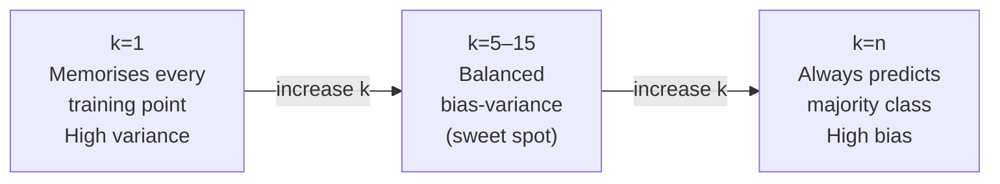

# Ch.10 — Classical Classifiers

> **Running theme:** The real estate platform's data science team is asked: "Can you give us something the business can actually read? The neural network from Ch.4 is a black box." Enter **Decision Trees** and **KNN** — models that make predictions through explicit, inspectable rules and geometric distance. They are faster to train, easier to debug, and often competitive enough for structured tabular data.

---

## 1 · Core Idea

**Decision Tree:** partition the feature space into rectangles by asking binary questions at each node. Every path from root to leaf is a human-readable `if/else` rule.

**K-Nearest Neighbours (KNN):** classify a new point by majority vote among its $k$ nearest training examples. No training — just memorise the dataset and look things up at query time.

```
Neural network:  learned weights  →  black box, no interpretable rules
Decision Tree:   if MedInc > 3.2 and Latitude < 36.1 → predict High-Value
KNN:             this district's 5 nearest neighbours are all High-Value → predict High-Value
```

The tradeoff is expressiveness vs interpretability. Both models overfit in characteristic ways: Decision Trees grow too deep, KNN memorises noise at $k=1$.

---

## 2 · Running Example

The platform's compliance team needs an auditable model for classifying districts as high-value or not — one they can explain to regulators. We use the **full 8-feature California Housing dataset** with the same `high_value` binary target from Ch.2.

Dataset: **California Housing** (`sklearn.datasets.fetch_california_housing`)  
Features: all 8 housing features  
Target: `high_value` — 1 if `MedHouseVal > median(MedHouseVal)`, else 0

This lets us cross-compare directly with logistic regression (Ch.2), neural network (Ch.4), and the deep metrics analysis (Ch.9) — same problem, new model family.

---

## 3 · Math

### 3.1 Decision Tree — Split Criterion

At each node, the tree evaluates every possible split $(f, t)$ — feature $f$, threshold $t$ — and picks the one that maximises the **information gain**:

$$\text{IG}(S, f, t) = H(S) - \frac{|S_{\text{left}}|}{|S|}\,H(S_{\text{left}}) - \frac{|S_{\text{right}}|}{|S|}\,H(S_{\text{right}})$$

| Symbol | Meaning |
|---|---|
| $S$ | current node's set of training examples |
| $H(S)$ | impurity of set $S$ — how mixed the labels are |
| $S_\text{left}, S_\text{right}$ | subsets sent left and right by the split |
| $\text{IG}$ | information gain — impurity reduction from this split |

**Gini impurity:** probability that two randomly chosen examples from $S$ have different labels:

$$\text{Gini}(S) = 1 - \sum_{c} p_c^2$$

where $p_c$ is the proportion of class $c$ in $S$. Gini = 0 means perfectly pure (one class only). Gini = 0.5 is maximally impure for binary classification (50/50 split).

**Entropy (information-theoretic alternative):**

$$H(S) = -\sum_{c} p_c \log_2 p_c$$

Gini and entropy give nearly identical trees in practice. Sklearn's Decision Tree uses Gini by default; ID3 and C4.5 use entropy.

**Leaf prediction:** the majority class among all training examples that reached that leaf.

### 3.2 Decision Tree — Complexity and Overfitting

A fully-grown tree (no `max_depth` limit) memorises the training set perfectly: it can always create a leaf for every single training point. This is the canonical form of high variance (Ch.6 spirit). The main regularisation tools:

| Parameter | Effect |
|---|---|
| `max_depth` | Limits the maximum tree depth — the primary dial |
| `min_samples_split` | A node must have at least this many examples to split |
| `min_samples_leaf` | A leaf must have at least this many examples |
| `max_features` | Number of features considered at each split (used by Random Forest) |

### 3.3 KNN — Distance and Voting

Given a query point $\mathbf{x}_q$, KNN finds the $k$ training points closest under a distance metric and predicts by majority vote.

**Euclidean distance** (default):

$$d(\mathbf{x}_q, \mathbf{x}_i) = \sqrt{\sum_{j=1}^{d} (x_{q,j} - x_{i,j})^2}$$

**Manhattan distance** (L1 — more robust to outliers in individual features):

$$d(\mathbf{x}_q, \mathbf{x}_i) = \sum_{j=1}^{d} |x_{q,j} - x_{i,j}|$$

**Prediction (classification):**

$$\hat{y}_q = \text{mode}\!\left(\{y_i : i \in \mathcal{N}_k(\mathbf{x}_q)\}\right)$$

where $\mathcal{N}_k(\mathbf{x}_q)$ is the set of $k$ nearest neighbours. For regression, use the mean instead of mode.

**Why unscaled features break KNN:** if one feature ranges over $[0, 15]$ (MedInc) and another over $[0, 5]$ (MedHouseVal), the Euclidean distance is dominated by the larger-scale feature. A neighbour that is "close" in MedInc terms can be far in MedHouseVal terms — but the distance calculation weights them proportionally to their raw scale. Fix: standardise all features before KNN.

### 3.4 Bias-Variance Trade-off — Decision Tree vs KNN

| Model | High bias regime | High variance regime |
|---|---|---|
| Decision Tree | `max_depth=1` (stump) — underfits | Fully grown tree — memorises training set |
| KNN | Large $k$ — averages over many neighbours, smooth boundary | $k=1$ — boundary perfectly fits training points, wiggly |

Decreasing $k$ and increasing `max_depth` both move a model toward lower bias, higher variance.

---

## 4 · Step by Step

```
Decision Tree:
1. Start with all training examples at the root node
2. Find the (feature, threshold) pair that maximises information gain
3. Split the node — send left if feature ≤ threshold, right otherwise
4. Recurse on each child until max_depth reached or node is pure
5. At each leaf: predict the majority class of examples that reached it

KNN:
1. Standardise features (critical — see Section 3.3)
2. Store all training examples (no fitting step)
3. At query time: compute distance from the query point to all training points
4. Pick the k smallest distances → retrieve their labels
5. Return majority vote (classification) or mean (regression)
```

---

## 5 · Key Diagrams

### Decision Tree split — Gini impurity in action

```
Node (n=100, Gini=0.48): 52 High-Value, 48 Non-High-Value
│
├── Split: MedInc > 3.2?
│
├── Left (n=38, Gini=0.15): 34 High-Value, 4 Non — very pure
│   └── predict: High-Value
│
└── Right (n=62, Gini=0.41): 18 High-Value, 44 Non — fairly pure
    └── ... (recurse)
```

### Decision boundary comparison

```
Logistic Regression:   smooth diagonal line (linear)
Decision Tree:         axis-aligned rectangles (staircase)
KNN (small k):         irregular, follows every local cluster
KNN (large k):         smoothed, approaches logistic regression boundary
```

### KNN: effect of k



### Decision Tree: effect of max_depth

```
depth=1 (stump):   one split → two regions → underfit
depth=3:           8 regions  → reasonable boundary
depth=10:          1024 regions (theoretical max) → overfit on small datasets
depth=None:        one leaf per training example → perfect train accuracy, poor test
```

### Feature importance (Decision Tree)

Decision Trees provide a natural importance score: the sum of impurity reduction (weighted by node sample count) at all splits that use a given feature, normalised over all features.

```
High importance:   MedInc     ████████████████ 0.52
                   AveRooms   ████              0.13
                   Latitude   ███               0.10
                   Longitude  ███               0.09
Low importance:    HouseAge   ██                0.06
                   ...
```

---

## 6 · Hyperparameter Dial

### Decision Tree

| Dial | Too low | Sweet spot | Too high |
|---|---|---|---|
| **`max_depth`** | Stump — underfits, misses patterns | 3–10 for tabular data | Fully grown — memorises noise |
| **`min_samples_leaf`** | 1 — leaf per point | 5–20 | Tree never splits |
| **`min_samples_split`** | 2 — always splits | 10–50 | Too conservative |

### KNN

| Dial | Too low | Sweet spot | Too high |
|---|---|---|---|
| **$k$** | 1 — memorises, wiggly boundary | $\sqrt{n}$ as a starting point; odd $k$ avoids ties | $n$ — always predicts majority class |
| **Distance metric** | — | Euclidean (default, scale-normalised data) | — |
| **Weights** | uniform (default) | `distance` weighting if local density varies | — |

---

## 7 · Code Skeleton

```python
import numpy as np
from sklearn.datasets import fetch_california_housing
from sklearn.model_selection import train_test_split
from sklearn.preprocessing import StandardScaler
from sklearn.tree import DecisionTreeClassifier, export_text
from sklearn.neighbors import KNeighborsClassifier
from sklearn.metrics import accuracy_score, f1_score, classification_report

# ── Data ──────────────────────────────────────────────────────────────────────
data = fetch_california_housing()
X, y_reg = data.data, data.target
y = (y_reg > np.median(y_reg)).astype(int)   # high-value binary target

X_train, X_test, y_train, y_test = train_test_split(
    X, y, test_size=0.2, random_state=42)

scaler = StandardScaler()
X_train_sc = scaler.fit_transform(X_train)
X_test_sc  = scaler.transform(X_test)

# ── Decision Tree ─────────────────────────────────────────────────────────────
dt = DecisionTreeClassifier(max_depth=5, random_state=42)
dt.fit(X_train_sc, y_train)   # scaling has no effect on DT (split thresholds are relative)
# Note: DT doesn't need scaling, but we pass scaled data so comparisons are fair

y_pred_dt = dt.predict(X_test_sc)
print("Decision Tree:")
print(f"  Accuracy: {accuracy_score(y_test, y_pred_dt):.4f}  F1: {f1_score(y_test, y_pred_dt):.4f}")

# Human-readable rules (first 3 levels)
print(export_text(dt, feature_names=list(data.feature_names), max_depth=3))

# Feature importances
importances = dt.feature_importances_
for name, imp in sorted(zip(data.feature_names, importances),
                         key=lambda x: -x[1]):
    print(f"  {name:12s}: {imp:.4f}  {'█' * int(imp * 50)}")
```

```python
# ── KNN ───────────────────────────────────────────────────────────────────────
knn = KNeighborsClassifier(n_neighbors=11, metric='euclidean')
knn.fit(X_train_sc, y_train)   # critical: use scaled features

y_pred_knn = knn.predict(X_test_sc)
print("KNN (k=11):")
print(f"  Accuracy: {accuracy_score(y_test, y_pred_knn):.4f}  F1: {f1_score(y_test, y_pred_knn):.4f}")
```

```python
# ── Depth sweep (Decision Tree) ───────────────────────────────────────────────
depths = range(1, 21)
train_scores, test_scores = [], []
for d in depths:
    m = DecisionTreeClassifier(max_depth=d, random_state=42).fit(X_train_sc, y_train)
    train_scores.append(f1_score(y_train, m.predict(X_train_sc)))
    test_scores.append(f1_score(y_test,  m.predict(X_test_sc)))

# plot train vs test score → find crossing point where test starts degrading
```

```python
# ── k sweep (KNN) ─────────────────────────────────────────────────────────────
k_values = range(1, 51, 2)   # odd values only to avoid ties
test_f1s = []
for k in k_values:
    m = KNeighborsClassifier(n_neighbors=k).fit(X_train_sc, y_train)
    test_f1s.append(f1_score(y_test, m.predict(X_test_sc)))

# plot: F1 vs k — find the elbow
```

---

## 8 · What Can Go Wrong

- **KNN on unscaled features.** An un-normalised Euclidean distance is dominated by whichever feature has the largest range. On California Housing, `AveRooms` can reach 141 while `MedInc` tops out around 15 — the distance is effectively measuring rooms, ignoring income entirely. Always standardise before KNN.

- **Decision Tree with no depth limit on a small dataset.** With 500 training examples and 8 features, a fully grown tree (256+ leaves) perfectly separates training data with one example per leaf. Training accuracy = 100%, test accuracy = ~55%. `max_depth=5–8` is almost always better.

- **Using feature importance from a single Decision Tree.** Feature importances are unstable — on a different random seed or a 5% data resample, the rankings can shuffle dramatically. Use Random Forest importances (Ch.11) for stability: the average over 100+ trees.

- **Forgetting that KNN is slow at inference time.** Sklearn's KNN with brute-force search is $O(nd)$ per query — `n` training points, `d` features. With 20,000 training examples, predicting 1,000 test points computes 20 million distances. Use a KD-Tree (`algorithm='kd_tree'`) or Ball-Tree for large datasets.

- **Comparing Decision Tree and Logistic Regression on training accuracy.** An unpruned DT will always report higher training accuracy than logistic regression on the same data — it is literally memorising the labels. Compare on the **test set** with the same metric (Ch.9 toolkit).

---

## 9 · Interview Checklist

| Must know | Likely asked | Trap to avoid |
|---|---|---|
| Gini impurity formula: $1 - \sum p_c^2$ ; Gini=0 = pure, Gini=0.5 = maximally mixed (binary) | How does a decision tree choose the best split? (maximise information gain = impurity reduction weighted by node sizes) | "Decision trees can't overfit" — they are one of the easiest models to overfit; `max_depth` is essential |
| KNN stores the training data and votes at query time — no explicit training | Why does large $k$ increase bias? (predictions smooth over more training points, losing local structure) | "KNN doesn't need feature scaling" — it absolutely does; distance is scale-dependent |
| Decision Tree feature importance = total impurity reduction weighted by sample count at each split | When would you choose a Decision Tree over Logistic Regression? (need interpretable rules, non-linear decision boundary without feature engineering, mixed feature types) | Comparing training accuracy between a fully-grown tree and logistic regression — always compare on the test set |
| DT is a high-variance model; KNN at $k=1$ is also high-variance; increasing $k$ adds bias | What is the time complexity of KNN at inference? ($O(nd)$ brute force; use KD-Tree for large $n$) | Reporting only accuracy on an imbalanced test set (always use F1 or AUC — Ch.9) |
| **Curse of dimensionality in KNN:** in high dimensions, all pairwise distances converge toward the same value — the max-to-min distance ratio approaches 1, making nearest neighbours meaningless. Rule of thumb: KNN degrades past ~20–30 raw features without PCA/UMAP first | "How does the curse of dimensionality affect KNN?" | "Just add more training data to fix high-d KNN" — the required data grows exponentially with dimension; this is the *definition* of the curse |
| **Decision tree inference is $O(\text{depth})$ per sample** regardless of training set size — a key practical advantage over KNN's $O(nd)$ per query; however `max_depth` is essential for both speed and generalisation | "Compare the inference complexity of KNN and Decision Tree" | "Shallow trees are always interpretable" — a tree with `max_depth=3` is interpretable; a tree with `max_depth=30` and thousands of leaves is not, even though it is still technically a decision tree |

---

## Bridge to Ch.11

Decision Trees are expressive but fragile — a small change in training data can produce a very different tree. Chapter 11 — **SVM & Ensembles** — attacks variance from two directions: **SVM** finds the single most robust linear boundary (maximum margin), and **bagging / boosting** trains hundreds of trees and aggregates them, turning fragile high-variance learners into a stable, high-accuracy ensemble.


## Illustrations


