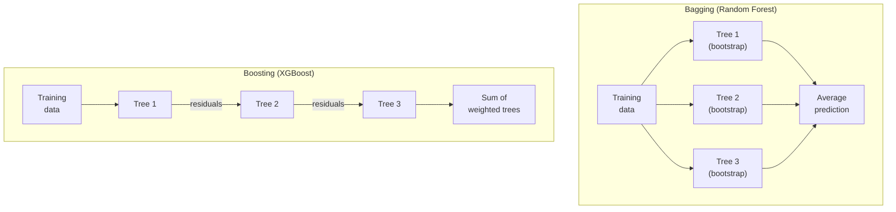

# Ch.11 — SVM & Ensembles

> **Running theme:** Decision Trees (Ch.10) are fragile — small data changes produce different trees, and a single tree memorises noise. This chapter attacks the problem from two directions: **SVM** finds the most robust linear boundary possible (maximum margin), and **ensembles** (bagging + boosting) aggregate many weak trees into a stable, high-accuracy predictor. XGBoost — the dominant algorithm in tabular ML competitions for a decade — is the end state of the boosting idea.

---

## 1 · Core Idea

**Support Vector Machine (SVM):** among all hyperplanes that correctly separate two classes, find the one that maximises the margin — the gap to the nearest training points. More margin = more tolerance to new data. The kernel trick extends this to non-linear boundaries.

**Bagging (Random Forest):** train 100–500 Decision Trees on bootstrapped subsets of training data, each seeing a random subset of features at each split. Average their predictions. The ensemble's variance is $\frac{1}{N}$ of a single tree's variance. Bias is unchanged.

**Boosting (Gradient Boosting / XGBoost):** train trees sequentially. Each tree fits the residual errors of the ensemble so far. Bias drops with each round. The risk: if the single trees are strong, boosting overfits noise.

```
Single Decision Tree:   high variance, interpretable
Random Forest (Bag N):  low variance, moderate bias, importance scores stable
XGBoost (Boost N):      low bias, low variance (with tuning), competition-grade accuracy
SVM:                    maximum-margin linear boundary; kernel trick for non-linear data
```

---

## 2 · Running Example

The platform now wants the **best possible regression model** for median house value — not just a classifier. We benchmark four models on the full 8-feature California Housing regression task: Linear Regression (Ch.1 baseline), Decision Tree, Random Forest, and XGBoost.

Dataset: **California Housing** (`sklearn.datasets.fetch_california_housing`)  
Features: all 8 housing features  
Target: `MedHouseVal` (median house value in $100k units)

We also run a classification comparison (high-value vs not) to include SVM alongside the ensemble models.

---

## 3 · Math

### 3.1 SVM — Maximum Margin Hyperplane

The decision hyperplane is $\mathbf{w}^\top \mathbf{x} + b = 0$. The margin is $\frac{2}{\|\mathbf{w}\|}$. Maximising the margin is equivalent to minimising $\|\mathbf{w}\|^2$:

$$\min_{\mathbf{w}, b}\; \frac{1}{2}\|\mathbf{w}\|^2 \quad \text{subject to}\quad y_i(\mathbf{w}^\top \mathbf{x}_i + b) \geq 1 \;\forall i$$

**Support vectors** are the training points that lie exactly on the margin boundary ($y_i(\mathbf{w}^\top \mathbf{x}_i + b) = 1$). The hyperplane depends only on these points — all others can be removed without changing the solution.

**Soft-margin SVM (C-SVM):** allows some training points to violate the margin, controlled by $C$:

$$\min_{\mathbf{w}, b, \xi}\; \frac{1}{2}\|\mathbf{w}\|^2 + C\sum_i \xi_i \quad \text{s.t.}\quad y_i(\mathbf{w}^\top \mathbf{x}_i + b) \geq 1 - \xi_i,\; \xi_i \geq 0$$

| $C$ | Effect |
|---|---|
| Large | Margin shrinks, few violations allowed — low bias, high variance |
| Small | Wide margin, many violations allowed — high bias, low variance (smoother boundary) |

### 3.2 Kernel Trick

A kernel $K(\mathbf{x}_i, \mathbf{x}_j) = \phi(\mathbf{x}_i)^\top \phi(\mathbf{x}_j)$ computes an inner product in a high-dimensional feature space $\phi$ without explicitly constructing $\phi$. The SVM dual optimisation only needs dot products, so the kernel substitutes directly.

**RBF (Radial Basis Function) kernel:**

$$K(\mathbf{x}_i, \mathbf{x}_j) = \exp\!\left(-\gamma \|\mathbf{x}_i - \mathbf{x}_j\|^2\right)$$

| $\gamma$ | Effect |
|---|---|
| Large | Each point's influence decays fast → jagged, complex boundary (high variance) |
| Small | Each point influences a wide region → smooth boundary (high bias) |

**Common kernels:**

| Kernel | Formula | Equivalent feature space |
|---|---|---|
| Linear | $\mathbf{x}_i^\top \mathbf{x}_j$ | Original space |
| Polynomial | $(\mathbf{x}_i^\top \mathbf{x}_j + r)^d$ | All degree-$d$ monomials |
| RBF | $\exp(-\gamma\|\mathbf{x}_i-\mathbf{x}_j\|^2)$ | Infinite-dimensional (Gaussian) |

### 3.3 Bagging and Random Forest

**Bootstrap:** sample $n$ training points **with replacement** to get a new dataset. On average, about $1 - 1/e \approx 63\%$ of original points are selected; the rest are the **out-of-bag (OOB)** set — a free validation set.

**Bias-variance of an ensemble:**

For $N$ independent models each with variance $\sigma^2$ and pairwise correlation $\rho$:

$$\text{Var}(\text{ensemble}) = \rho\sigma^2 + \frac{1-\rho}{N}\sigma^2$$

As $N \to \infty$, the variance floor is $\rho\sigma^2$ — decorrelation between trees (via random feature subsets) is as important as the number of trees.

**Random Forest key parameters:**

| Parameter | Effect |
|---|---|
| `n_estimators` | More trees → lower variance, plateau after ~200 |
| `max_features` | Features per split — default `'sqrt'` (classification); for regression, sklearn ≥1.3 defaults to all features (`1.0`) |
| `max_depth` | Shallow trees = high bias but more decorrelated |

### 3.4 Gradient Boosting

Boosting builds an additive model $F_M(\mathbf{x}) = \sum_{m=1}^M \eta \cdot h_m(\mathbf{x})$ where each $h_m$ is a shallow tree. The key insight: fitting $h_m$ to the **negative gradient of the loss** with respect to $F_{m-1}(\mathbf{x})$ is equivalent to gradient descent in function space.

For MSE loss $\mathcal{L} = \frac{1}{n}\sum(y_i - F(\mathbf{x}_i))^2$:

$$-\frac{\partial \mathcal{L}}{\partial F(\mathbf{x}_i)} = y_i - F_{m-1}(\mathbf{x}_i)$$

The residual **is** the negative gradient — so each tree directly fits prediction errors.

**XGBoost** extends this with:
- Second-order Taylor expansion of the loss (uses gradient **and** curvature)
- $L_1$/$L_2$ regularisation on tree weights
- Column subsampling (like Random Forest)
- Approximate split finding for large datasets

**Key XGBoost parameters:**

| Parameter | Effect | Typical start |
|---|---|---|
| `n_estimators` | Number of trees | 100–500 |
| `learning_rate` ($\eta$) | Shrinks each tree's contribution | 0.05–0.3 |
| `max_depth` | Depth of each tree | 3–6 (deeper than RF trees) |
| `subsample` | Row fraction per tree | 0.6–0.9 |
| `colsample_bytree` | Feature fraction per tree | 0.6–0.9 |
| `reg_lambda` | L2 on leaf weights | 1 |

---

## 4 · Step by Step

```
SVM:
1. Standardise features (SVM is sensitive to scale — kernel distances are scale-dependent)
2. Choose kernel (linear → interpretable; RBF → non-linear)
3. Grid-search C (and γ for RBF) via cross-validation
4. Retrain on full training set with best (C, γ)
5. Decision boundary = support vectors only — inspect kernel.support_vectors_

Random Forest (Bagging):
1. Set n_estimators=200, max_features='sqrt', oob_score=True
2. Train (parallelisable — each tree is independent)
3. Use oob_score as a free validation metric
4. Read feature_importances_ — average over all trees (more stable than single DT)

XGBoost (Boosting):
1. Standardise or leave raw (tree-based — invariant to monotone transforms)
2. Set early_stopping_rounds with a validation set to prevent overfitting
3. Start: n_estimators=500, learning_rate=0.05, max_depth=4
4. Tune subsample and colsample_bytree to reduce overfitting
5. Read feature_importances_ (weight, gain, or cover metrics)
```

---

## 5 · Key Diagrams

### SVM: margin maximisation

```
Class -1:  × × ×          Class +1:  ○ ○ ○
              × ×            ○ ○ ○
               ×              ○

             ×│              │○
              │← margin  →  │
          ────┼──────────────┼────  (decision hyperplane w·x + b = 0)
         w·x+b=-1          w·x+b=+1
               ↑support vectors↑
```

### SVM: effect of C

```
Small C (wide margin, more violations):    Large C (narrow margin, few violations):
  × × ×│·      ·│○ ○ ○                     × × ×   │○ ○ ○
     ×  │  × ···│○ ○               →          × ×   │○ ○
        │       │                               × × ×│○
     smooth, may misclassify              tight, follows every training point
```

### Bagging vs Boosting



### Bias-variance: single tree vs ensemble

```
Error = Bias² + Variance + Irreducible noise

Single tree (deep) :  Bias²=low   Variance=high  → Random Forest reduces Variance
Single tree (shallow): Bias²=high Variance=low   → Boosting reduces Bias²
```

### The boosting residual chain

```
Round 1: F_1(x) = tree_1 predicts  →  residual_1 = y - F_1(x)
Round 2: F_2(x) = F_1(x) + η·tree_2(residual_1)  →  residual_2 = y - F_2(x)
Round 3: F_3(x) = F_2(x) + η·tree_3(residual_2)  → ...
```

---

## 6 · Hyperparameter Dial

### SVM

| Dial | Too low | Sweet spot | Too high |
|---|---|---|---|
| **C** | Wide margin, many violations (underfits) | Grid search: 0.01, 0.1, 1, 10, 100 | Overfits — follows every training point |
| **γ** (RBF) | Smooth, nearly linear boundary | Grid search alongside C | Very jagged — memorises training |

### Random Forest

| Dial | Effect |
|---|---|
| **`n_estimators`** | More trees → lower variance. Plateau after ~200. More is rarely harmful (just slower). |
| **`max_features`** | Lower → more decorrelation between trees → lower ensemble variance (at cost of individual tree quality) |

### XGBoost

| Dial | Too low | Sweet spot | Too high |
|---|---|---|---|
| **`learning_rate`** | Very slow convergence | 0.05–0.1 (with early stopping) | Noisy updates, early overfitting |
| **`max_depth`** | Underfits | 3–6 | Overfits; slow |
| **`n_estimators`** | Underfit | Use early stopping to find automatically | Classic overfitting |

---

## 7 · Code Skeleton

```python
import numpy as np
from sklearn.datasets import fetch_california_housing
from sklearn.model_selection import train_test_split
from sklearn.preprocessing import StandardScaler
from sklearn.svm import SVC
from sklearn.ensemble import RandomForestClassifier, RandomForestRegressor
from sklearn.linear_model import LinearRegression
from sklearn.tree import DecisionTreeRegressor
from sklearn.metrics import mean_squared_error, r2_score, f1_score

# ── Data ──────────────────────────────────────────────────────────────────────
data = fetch_california_housing()
X, y_reg = data.data, data.target
y_cls = (y_reg > np.median(y_reg)).astype(int)

X_train, X_test, y_tr, y_te, y_tr_cls, y_te_cls = train_test_split(
    X, y_reg, y_cls, test_size=0.2, random_state=42)

scaler = StandardScaler()
X_tr_sc = scaler.fit_transform(X_train)
X_te_sc = scaler.transform(X_test)
```

```python
# ── SVM Classification ────────────────────────────────────────────────────────
svm = SVC(kernel='rbf', C=10, gamma='scale', probability=True, random_state=42)
svm.fit(X_tr_sc, y_tr_cls)

print(f"SVM F1:       {f1_score(y_te_cls, svm.predict(X_te_sc)):.4f}")
print(f"Support vectors: {svm.n_support_}  (one count per class)")
print(f"Total SVs: {svm.support_vectors_.shape[0]} of {len(X_train)} training points")
```

```python
# ── Random Forest Regression ──────────────────────────────────────────────────
rf = RandomForestRegressor(n_estimators=200, max_features='sqrt',
                            oob_score=True, random_state=42, n_jobs=-1)
rf.fit(X_train, y_tr)   # tree-based: no scaling needed

y_pred_rf = rf.predict(X_test)
rmse_rf   = np.sqrt(mean_squared_error(y_te, y_pred_rf))
print(f"Random Forest — RMSE: {rmse_rf:.4f}  R²: {r2_score(y_te, y_pred_rf):.4f}")
print(f"OOB R²: {rf.oob_score_:.4f}  (free validation — no test set used)")
```

```python
# ── XGBoost Regression ────────────────────────────────────────────────────────
try:
    from xgboost import XGBRegressor

    X_tr2, X_val, y_tr2, y_val = train_test_split(X_train, y_tr,
                                                     test_size=0.15, random_state=42)
    xgb = XGBRegressor(
        n_estimators=1000,
        learning_rate=0.05,
        max_depth=4,
        subsample=0.8,
        colsample_bytree=0.8,
        reg_lambda=1.0,
        random_state=42,
        early_stopping_rounds=30,
        eval_metric='rmse',
        verbosity=0,
    )
    xgb.fit(X_tr2, y_tr2, eval_set=[(X_val, y_val)], verbose=False)

    y_pred_xgb = xgb.predict(X_test)
    rmse_xgb   = np.sqrt(mean_squared_error(y_te, y_pred_xgb))
    print(f"XGBoost — RMSE: {rmse_xgb:.4f}  R²: {r2_score(y_te, y_pred_xgb):.4f}")
    print(f"Best iteration: {xgb.best_iteration}")

except ImportError:
    print("XGBoost not installed. Run: pip install xgboost")
```

```python
# ── Baseline comparison ───────────────────────────────────────────────────────
lr  = LinearRegression().fit(X_tr_sc, y_tr)
dt  = DecisionTreeRegressor(max_depth=8, random_state=42).fit(X_train, y_tr)

models = {
    'Linear Regression': (lr.predict(X_te_sc), 'scaled'),
    'Decision Tree':     (dt.predict(X_test),   'raw'),
    'Random Forest':     (y_pred_rf,             'raw'),
}
for name, (preds, _) in models.items():
    rmse = np.sqrt(mean_squared_error(y_te, preds))
    r2   = r2_score(y_te, preds)
    print(f"{name:22s}  RMSE: {rmse:.4f}  R²: {r2:.4f}")
```

---

## 8 · What Can Go Wrong

- **Boosting on noisy labels overfits fast.** Each tree corrects the previous tree's errors — including mislabelled training points. After enough rounds, the model memorises noise. Use `early_stopping_rounds` with a held-out validation set; never fit to convergence on training data alone.

- **SVM without standardisation.** The RBF kernel computes $\exp(-\gamma\|\mathbf{x}_i - \mathbf{x}_j\|^2)$. If one feature has range 1,000 and another has range 1, the kernel distance is dominated by the large-range feature — the kernel "sees" only one feature. Standardise before SVM as rigorously as before KNN.

- **Comparing XGBoost vs Random Forest without tuning XGBoost.** Default XGBoost hyperparameters (learning_rate=0.3, max_depth=6) are often too aggressive. Untuned XGBoost can underperform Random Forest. Always pair XGBoost with early stopping on a validation set.

- **Ignoring the OOB score.** Random Forest computes an out-of-bag score "for free" — predictions on the 37% of training examples not sampled into each tree's bootstrap. It is a reliable cross-validation estimate without an explicit validation split. Always check `oob_score_` before creating a separate validation set.

- **Reporting SVM's number of support vectors as a quality metric.** More support vectors = narrower effective margin = model is relying on more training points = potentially overfitting (large C or complex kernel). Fewer support vectors = wider margin = more generalisation, but may underfit. The count alone is not a quality metric — use held-out error.

---

## 9 · Interview Checklist

| Must know | Likely asked | Trap to avoid |
|---|---|---|
| SVM finds the max-margin hyperplane; support vectors are the only training points that determine the boundary | Why does the kernel trick work? (SVM dual only needs dot products — kernel computes them in a higher-dimensional space without constructing it) | "SVM is always better than logistic regression on high-dimensional data" — not true; LR is often competitive and faster |
| Bagging reduces variance by averaging independent models; boosting reduces bias by fitting residuals sequentially | Derive the ensemble variance formula: $\rho\sigma^2 + (1-\rho)\sigma^2/N$ — why does decorrelation matter? (the $\rho\sigma^2$ floor) | "Random Forest always needs scaling" — tree splits are based on rank/thresholds, not distances; scaling has no effect |
| XGBoost adds second-order Taylor expansion and regularisation on leaf weights; early stopping is essential | What is the difference between a learning rate in XGBoost and in neural networks? (in XGBoost, it shrinks each tree's contribution to prevent over-reliance on early trees) | Tuning XGBoost without early stopping — n_estimators becomes meaningless without a validation signal |
| OOB score in Random Forest is a free cross-validation estimate (built from the ~37% unsampled examples per tree) | When would you choose SVM over Random Forest? (high-dimensional, sparse data; clear margin structure; small datasets where kernel SVM scales OK) | Comparing untuned XGBoost against tuned Random Forest and concluding Random Forest is better |
| **SVM `C` parameter:** high $C$ → small margin, low bias, high variance (overfits); low $C$ → large soft margin, high bias, low variance (regularised). With RBF kernel, `C` and `gamma` interact strongly — always cross-validate both | "What does the C parameter control in SVM?" | "Higher C always better because it correctly classifies more training points" — training accuracy is not the goal; the soft margin exists precisely to accept some misclassifications for better generalisation |
| **Stacking vs bagging vs boosting:** bagging trains base models in parallel on bootstrap samples (Random Forest); boosting trains sequentially fixing residuals (XGBoost, AdaBoost); stacking trains a meta-learner on out-of-fold predictions from diverse base models | "When does stacking fail to beat bagging?" | "Stacking always beats bagging" — if the base models are highly correlated, the meta-learner gains nothing; the power of stacking comes from model diversity (e.g., RF + XGB + LR → LR meta-learner) |

---

## Bridge to Chapter 12

Ch.11 completed the supervised learning toolkit — we can now classify and regress with neural networks, trees, ensembles, and SVMs. Ch.12 — **Clustering** — shifts to unsupervised learning: no labels, no target variable. The goal is to discover natural structure in the data. The real estate platform's districts will cluster into neighbourhood types nobody defined in advance.
