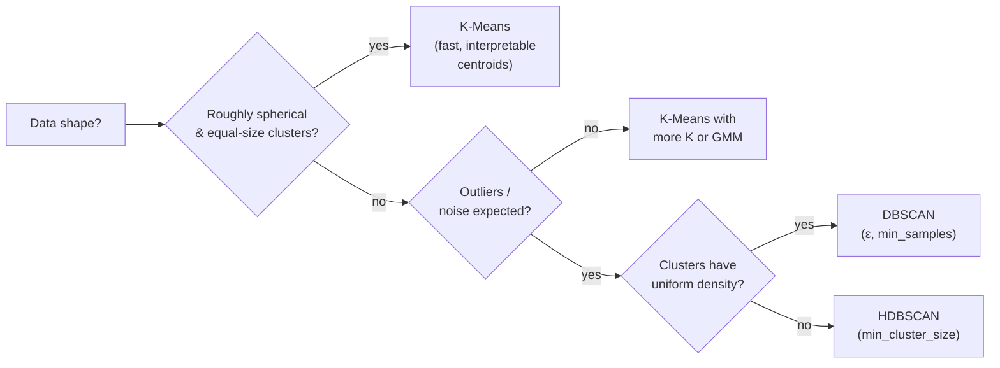

# Ch.12 — Clustering

> **Running theme:** The real estate platform wants to discover natural neighbourhood types — not the ones a human defined, but the ones that emerge from the data itself. No labels, no target variable. Clustering is the entry point to unsupervised learning: find structure that nobody annotated.

---

## 1 · Core Idea

**K-Means:** partition $n$ points into $k$ clusters by alternating two steps — assign each point to its nearest centroid, then recompute centroids as cluster means. Repeat until assignments stop changing. Simple, fast, but assumes spherical clusters of roughly equal size.

**DBSCAN:** define clusters as dense regions separated by sparse regions. Points in low-density areas are labelled as **noise** — no cluster forced. Handles arbitrary shapes. No need to specify $k$ in advance.

**HDBSCAN:** hierarchical extension of DBSCAN. Builds a cluster tree across all density levels and extracts the most stable clusters. Tolerates clusters of varying density.

```
K-Means:   requires k, assumes spherical, no noise concept
DBSCAN:    requires ε + min_samples, handles arbitrary shapes, marks noise
HDBSCAN:   requires only min_cluster_size, the most robust of the three
```

---

## 2 · Running Example

The platform's business team asks: "What types of districts exist in California?" They give zero labels. We apply all three algorithms to the **full 8-feature California Housing dataset** and see what naturally emerges — income tiers, coastal vs inland, urban vs rural. Cluster labels can then drive targeted marketing or risk assessment without any human annotation.

Dataset: **California Housing** (`sklearn.datasets.fetch_california_housing`)  
Features: all 8 features, standardised  
No target variable used during clustering

---

## 3 · Math

### 3.1 K-Means

**Objective:** minimise the total within-cluster variance (inertia):

$$J = \sum_{k=1}^{K} \sum_{\mathbf{x}_i \in C_k} \|\mathbf{x}_i - \boldsymbol{\mu}_k\|^2$$

where $\boldsymbol{\mu}_k = \frac{1}{|C_k|}\sum_{\mathbf{x}_i \in C_k} \mathbf{x}_i$ is the centroid of cluster $k$.

**Algorithm (Lloyd's):**

```
1. Initialise K centroids (K-Means++ samples them proportional to distance²)
2. Assignment step: each point → nearest centroid (by Euclidean distance)
3. Update step:     each centroid → mean of its assigned points
4. Repeat 2–3 until assignments do not change (or max_iter reached)
```

**K-Means++** initialisation (sklearn default): choose the first centroid uniformly at random, then each subsequent centroid $\boldsymbol{\mu}_j$ with probability proportional to $d(\mathbf{x}, \text{nearest existing centroid})^2$. This spreads centroids and dramatically reduces the chance of a bad local minimum.

**Inertia and the elbow method:** inertia always decreases as $K$ increases (at $K = n$, every point is its own cluster → inertia = 0). The "elbow" — where marginal gain flattens — suggests the best $K$.

### 3.2 DBSCAN

DBSCAN classifies each point as **core**, **border**, or **noise** based on two parameters:

- $\varepsilon$ (eps): neighbourhood radius
- $\text{MinPts}$ (min_samples): minimum neighbours within $\varepsilon$ to be a core point

**Definitions:**

| Term | Definition |
|---|---|
| Core point | Has $\geq \text{MinPts}$ neighbours within $\varepsilon$ |
| Border point | Within $\varepsilon$ of a core point, but fewer than MinPts neighbours itself |
| Noise point | Not a core point and not within $\varepsilon$ of any core point; labelled $-1$ |

**Density-reachability:** $\mathbf{p}$ is density-reachable from $\mathbf{q}$ if there is a chain of core points $\mathbf{q} = \mathbf{p}_1, \mathbf{p}_2, \ldots, \mathbf{p}_n = \mathbf{p}$ where each consecutive pair is within $\varepsilon$.

**Cluster:** the maximal set of mutually density-connected points.

**Complexity:** $O(n \log n)$ with a spatial index (ball tree / kd-tree). $O(n^2)$ brute force.

### 3.3 HDBSCAN

HDBSCAN extends DBSCAN by varying $\varepsilon$ continuously from $\infty$ downward, building a **cluster hierarchy**:

1. Compute the **mutual reachability distance** between every pair: $d_\text{mreach}(\mathbf{p}, \mathbf{q}) = \max(\text{core-dist}(\mathbf{p}),\, \text{core-dist}(\mathbf{q}),\, d(\mathbf{p}, \mathbf{q}))$, where the core distance of $\mathbf{p}$ is the distance to its $\text{MinPts}$-th nearest neighbour.

2. Build the **minimum spanning tree** on the mutual reachability graph.

3. Extract the cluster hierarchy from the MST by removing edges from longest to shortest.

4. Compute **cluster stability** — a measure of how long a cluster persists across density levels. Extract the most stable clusters.

**Key parameter:** `min_cluster_size` — clusters smaller than this are absorbed into noise. Much more intuitive than DBSCAN's $(\varepsilon, \text{MinPts})$ pair.

---

## 4 · Step by Step

```
K-Means:
1. Standardise features (K-Means uses Euclidean distance — scale matters)
2. Run with K=2,3,...,15; record inertia and silhouette score (Ch.14)
3. Plot elbow curve  →  pick K at the bend
4. Refit with chosen K; inspect cluster centroids (inverse-transform to original scale)
5. Plot clusters in PCA 2D projection (Ch.13) for visual validation

DBSCAN:
1. Standardise features
2. Use k-nearest-neighbour distance plot to estimate ε:
   sort points by distance to their k-th neighbour; ε ≈ the "knee"
3. Set min_samples ≈ 2 × n_features (rule of thumb)
4. Inspect: how many clusters? How many noise points (-1)?
5. Adjust ε if too many noise points (increase ε) or clusters merged (decrease ε)

HDBSCAN:
1. Standardise features
2. Set min_cluster_size = ~1% of n_samples as a starting point
3. Train; inspect cluster labels and probabilities per point
4. Points with label=-1 are noise; check noise fraction
5. Adjust min_cluster_size to control granularity
```

---

## 5 · Key Diagrams

### K-Means: assignment and update steps

```
Step 0 (init):    Step 1 (assign):   Step 2 (update):   Converged:
  × × ○ ○           × × │ ○ ○          ×│× ○│○           ×│×│○│○
  × ○ ○ ×    →      × ○ │ ○ ×    →     ×│○ ○│×    →      ×│○ ○│×
  ★   ★             ★   │ ★            ★│   ★            ★│  ★

centroids ★ placed → each point → → centroids → → stable
```

### Elbow curve

```
Inertia
   │
   │ ╲
   │   ╲
   │    ╲___
   │        ‾‾‾───────────── (flat)
   └──────────────────────── K
         ↑
      elbow → best K
```

### DBSCAN: core, border, noise

```
            ε-circle
           ╭──────╮
  ●  ●  ●  │  ●   │  ○   ×
  ●  ●     │  ●   │
            ╰──────╯
  ● = core (≥ MinPts neighbours in ε)
  ○ = border (within ε of core, < MinPts neighbours)
  × = noise (labelled -1)
```

### K-Means vs DBSCAN on non-spherical shapes



---

## 6 · Hyperparameter Dial

### K-Means

| Dial | Too low | Sweet spot | Too high |
|---|---|---|---|
| **K** | Coarse clusters (merges distinct groups) | Elbow of inertia curve; validate with silhouette | Every point its own cluster (K=n → inertia=0) |
| **n_init** | Single bad local minimum | 10 (sklearn default) | Diminishing returns |
| **max_iter** | Didn't converge | 300 | Rarely needed above 300 |

### DBSCAN

| Dial | Too low | Sweet spot | Too high |
|---|---|---|---|
| **ε** | Everything is noise | Use k-NN distance plot | One giant cluster |
| **min_samples** | Every point is a core point (no noise) | $2 \times d$ (d = features) | Only the densest cores survive |

### HDBSCAN

| Dial | Too low | Sweet spot | Too high |
|---|---|---|---|
| **min_cluster_size** | Too many small clusters | ~1% of dataset | Only 1–2 large clusters |

---

## 7 · Code Skeleton

```python
import numpy as np
from sklearn.datasets import fetch_california_housing
from sklearn.preprocessing import StandardScaler
from sklearn.cluster import KMeans, DBSCAN
from sklearn.metrics import silhouette_score
from sklearn.neighbors import NearestNeighbors

# ── Data ──────────────────────────────────────────────────────────────────────
data = fetch_california_housing()
X    = data.data                     # 20,640 districts × 8 features
scaler = StandardScaler()
X_sc   = scaler.fit_transform(X)    # clustering uses distances — scaling is essential

# ── K-Means elbow ─────────────────────────────────────────────────────────────
inertias, sil_scores = [], []
K_range = range(2, 16)

for k in K_range:
    km = KMeans(n_clusters=k, init='k-means++', n_init=10, random_state=42)
    km.fit(X_sc)
    inertias.append(km.inertia_)
    sil_scores.append(silhouette_score(X_sc, km.labels_, sample_size=5000))
```

```python
# ── Fit best K-Means ──────────────────────────────────────────────────────────
best_k = 5    # from elbow / silhouette inspection
km_best = KMeans(n_clusters=best_k, init='k-means++', n_init=10, random_state=42)
km_best.fit(X_sc)
labels_km = km_best.labels_

# Centroid in original (un-scaled) space — interpretable
centroids_orig = scaler.inverse_transform(km_best.cluster_centers_)
for i, c in enumerate(centroids_orig):
    print(f"Cluster {i}: MedInc={c[0]:.2f}  MedHouseVal≈{data.target[labels_km==i].mean():.2f}")
```

```python
# ── DBSCAN ε estimation via k-NN distance plot ────────────────────────────────
k_nn = 2 * X_sc.shape[1]   # rule of thumb: 2 × n_features
nbrs = NearestNeighbors(n_neighbors=k_nn).fit(X_sc)
distances, _ = nbrs.kneighbors(X_sc)
knn_dists = np.sort(distances[:, -1])   # distance to k-th nearest neighbour

# Plot knn_dists — the "knee" is a good ε
# ε ≈ where the curve bends sharply upward
```

```python
# ── DBSCAN ────────────────────────────────────────────────────────────────────
db = DBSCAN(eps=0.5, min_samples=16)   # min_samples = 2 × 8 features
db.fit(X_sc)
labels_db = db.labels_

n_clusters = len(set(labels_db)) - (1 if -1 in labels_db else 0)
n_noise    = (labels_db == -1).sum()
print(f"DBSCAN: {n_clusters} clusters, {n_noise} noise points ({n_noise/len(X_sc)*100:.1f}%)")
```

```python
# ── HDBSCAN ───────────────────────────────────────────────────────────────────
try:
    import hdbscan
    hdb = hdbscan.HDBSCAN(min_cluster_size=200)
    labels_hdb = hdb.fit_predict(X_sc)
    n_clusters_h = len(set(labels_hdb)) - (1 if -1 in labels_hdb else 0)
    print(f"HDBSCAN: {n_clusters_h} clusters, {(labels_hdb==-1).sum()} noise points")
except ImportError:
    print("pip install hdbscan")
```

---

## 8 · What Can Go Wrong

- **K-Means on unscaled features.** MedInc ranges 0.5–15 and AveRooms ranges 0.8–141. Euclidean distance is dominated by AveRooms; the algorithm effectively ignores all other features. Always standardise before any distance-based algorithm.

- **Choosing K from the elbow on inertia alone.** Inertia always decreases monotonically — it reaches zero at K=n. The elbow is often ambiguous. Always confirm with silhouette score (Ch.14): the K with the highest mean silhouette is often the better choice.

- **Running DBSCAN without an ε estimate.** Guessing ε blindly produces either a single cluster (ε too large) or all noise (ε too small). Always produce the k-NN distance plot first: sort all $n$ points by their k-th nearest-neighbour distance and pick ε at the "knee."

- **Treating K-Means cluster labels as stable across runs.** K-Means with random initialisation can assign different integer labels to the same real-world cluster on different runs. Use `random_state` when reproducibility matters. Compare clusters by their centroid features, not their label integers.

- **Using DBSCAN on data with very different local densities.** Dense urban districts and sparse rural districts in California Housing have very different neighbourhood densities — a single ε cannot be appropriate for both. Symptoms: dense urban areas form many tiny clusters while sparse rural areas merge into one giant cluster. Fix: HDBSCAN.

---

## 9 · Interview Checklist

| Must know | Likely asked | Trap to avoid |
|---|---|---|
| K-Means objective: minimise within-cluster sum of squared distances | What are the two steps of Lloyd's algorithm? (assignment: each point → nearest centroid; update: each centroid → cluster mean) | "K-Means always finds the optimal clustering" — Lloyd's is a local optimiser; K-Means++ reduces but doesn't eliminate bad initialisation |
| DBSCAN core / border / noise definitions; cluster = maximal density-connected set | How do you choose ε for DBSCAN? (k-NN distance plot — sort points by distance to k-th neighbour, pick the knee) | "DBSCAN requires specifying k" — no, it requires ε and min_samples; k is only for the k-NN distance plot |
| HDBSCAN uses mutual reachability distance + MST + stability to extract clusters at variable density; only needs min_cluster_size | When would you prefer HDBSCAN over DBSCAN? (when clusters have varying density; when ε is hard to tune) | Comparing cluster label integers across K-Means runs — labels are arbitrary; compare by centroid features |
| K-Means assumes spherical clusters; DBSCAN handles arbitrary shapes but a single density | What happens to silhouette score at K=n (one point per cluster)? (undefined or 0 — every point is its own cluster, silhouette is meaningless) | Skipping feature scaling before K-Means or DBSCAN — both use Euclidean distance |
| **Hierarchical (agglomerative) clustering:** builds a dendrogram bottom-up by merging the two closest clusters at each step; linkage variants: single (minimum distance, prone to chaining), complete (maximum, compact clusters), **Ward** (minimises within-cluster variance — default choice). Does not require specifying $K$ upfront | "Compare single, complete, and Ward linkage" | "Hierarchical clustering scales to large datasets" — naive implementation is $O(n^3)$ in time and $O(n^2)$ in memory; only feasible for $n < 10{,}000$ without approximation |
| **Gaussian Mixture Models (GMM):** models clusters as $K$ Gaussians with learnable means, covariances, and mixing weights; trained by EM. Unlike K-Means, GMM gives **soft cluster membership** (probabilities) and handles elliptical clusters. Use BIC/AIC to select $K$ | "How does GMM differ from K-Means?" | "GMM is always better than K-Means because it's probabilistic" — GMM has $O(Kd^2)$ parameters for full covariance; with $d=100$ and $K=10$, fitting full covariance matrices requires enormous data; use diagonal covariance as a default |

---

## Bridge to Ch.13

Clustering found structure in the full 8-dimensional feature space — but we can't visualise it directly. Chapter 13 — **Dimensionality Reduction** — provides the complementary toolkit: PCA compresses the 8 features into 2 principal components that preserve the most variance, t-SNE reveals local cluster structure for plotting, and UMAP balances local and global topology. The 2D projections from Ch.13 are the standard way to visually validate Ch.12 clusters.
