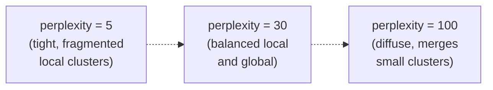
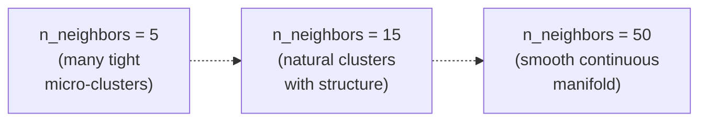

# Ch.13 — Dimensionality Reduction

> **Running theme:** The clustering work (Ch.12) happened in an 8-dimensional space — but every scatter plot we drew required projecting down to 2D first. That projection is dimensionality reduction. PCA, t-SNE, and UMAP each make different promises about what they preserve, and breaking each promise costs you a different kind of insight.

---

## 1 · Core Idea

High-dimensional data is hard to visualise, computationally expensive, and often contains redundant features. Dimensionality reduction finds a lower-dimensional representation that preserves the most important structure.

**PCA (Principal Component Analysis):** linear projection that maximises retained variance. Fast, deterministic, invertible. Best for overall structure and preprocessing before downstream models.

**t-SNE (t-distributed Stochastic Neighbour Embedding):** non-linear method that preserves local neighbourhood structure. Produces beautiful cluster plots. Not invertible; distances between clusters are meaningless; does not scale well beyond ~50k points.

**UMAP (Uniform Manifold Approximation and Projection):** non-linear topology-preserving method. Faster than t-SNE at scale, better global structure, can be used for supervised dimensionality reduction and as a feature transformer for downstream tasks.

```
Axis          PCA         t-SNE         UMAP
Speed         fastest     slowest       fast
Deterministic yes         no (stoch.)   no (stoch.)
Global struct ✓✓✓         ✗             ✓✓
Local struct  ✓✓          ✓✓✓           ✓✓✓
Invertible    yes         no            no
Downstream ML yes         rarely        yes
```

---

## 2 · Running Example

We take all **8 features** of the California Housing dataset (20,640 census districts) and project them to 2 dimensions using each of the three methods. The resulting scatter plots are coloured by median house value (`MedHouseVal`) to see whether geographic and economic structure is preserved.

Dataset: **California Housing** (`sklearn.datasets.fetch_california_housing`)  
Projection target: 2D for visualisation  
Colour: `MedHouseVal` (continuous)

---

## 3 · Math

### 3.1 PCA

PCA finds a new orthogonal coordinate system aligned with the directions of maximum variance.

**Step 1 — centre:** $\mathbf{X}_c = \mathbf{X} - \bar{\mathbf{x}}$

**Step 2 — covariance matrix:** $\mathbf{C} = \frac{1}{n-1}\mathbf{X}_c^\top \mathbf{X}_c \in \mathbb{R}^{d \times d}$

**Step 3 — eigendecomposition:** $\mathbf{C} = \mathbf{V}\mathbf{\Lambda}\mathbf{V}^\top$, where columns of $\mathbf{V}$ are **principal components** (eigenvectors) and $\mathbf{\Lambda} = \text{diag}(\lambda_1 \geq \lambda_2 \geq \cdots \geq \lambda_d)$ holds the eigenvalues.

**Step 4 — project:** $\mathbf{Z} = \mathbf{X}_c \mathbf{V}_k$, where $\mathbf{V}_k$ contains the top $k$ eigenvectors. This is the $k$-dimensional representation.

**Explained variance ratio:**

$$\text{EVR}_i = \frac{\lambda_i}{\sum_{j=1}^{d} \lambda_j}$$

**Reconstruction:** $\hat{\mathbf{X}} = \mathbf{Z}\mathbf{V}_k^\top + \bar{\mathbf{x}}$ — PCA is the only one of the three that can reconstruct the original (approximate) data.

**Practical note:** sklearn uses SVD rather than eigendecomposition directly, which is numerically stable and handles rectangular matrices.

### 3.2 t-SNE

t-SNE preserves local structure by modelling pairwise similarities in high-dimensional space and trying to match them in low-dimensional space.

**High-dimensional similarities:** model the probability that point $i$ picks $j$ as its neighbour using a Gaussian:

$$p_{j|i} = \frac{\exp(-\|x_i - x_j\|^2 / 2\sigma_i^2)}{\sum_{k \neq i} \exp(-\|x_i - x_k\|^2 / 2\sigma_i^2)}, \quad p_{ij} = \frac{p_{j|i} + p_{i|j}}{2n}$$

$\sigma_i$ is set per-point such that the **perplexity** (effective number of neighbours) matches the user-specified value.

**Low-dimensional similarities:** use a Student-t distribution with 1 degree of freedom (heavy tails prevent crowding):

$$q_{ij} = \frac{(1 + \|y_i - y_j\|^2)^{-1}}{\sum_{k \neq l}(1 + \|y_k - y_l\|^2)^{-1}}$$

**Objective:** minimise KL divergence between $P$ and $Q$:

$$\text{KL}(P \| Q) = \sum_{i \neq j} p_{ij} \log \frac{p_{ij}}{q_{ij}}$$

Optimised via gradient descent. The heavy-tailed $q$ distribution repels distant points and pulls nearby ones, creating the characteristic clustered visualisations.

**Perplexity intuition:** roughly the number of effective nearest neighbours. Typical range: 5–50.

### 3.3 UMAP

UMAP models the data's **topological structure** using a weighted $k$-nearest-neighbour graph in high-d space, then seeks a low-d embedding that minimises the cross-entropy between the two graph edge probability distributions.

**High-d graph:** edge weight $v_{ij} = \exp\!\left(\frac{-\max(0,\, d(x_i, x_j) - \rho_i)}{\sigma_i}\right)$ where $\rho_i$ is the distance to the nearest neighbour and $\sigma_i$ is calibrated to achieve the desired fuzzy coverage.

**Low-d objective:** minimise:

$$\sum_{e \in \text{edges}} \left[ v_e \log \frac{v_e}{w_e} + (1-v_e) \log \frac{1-v_e}{1-w_e} \right]$$

where $w_e$ is the low-dimensional edge probability.

**Key parameters:**
- `n_neighbors`: how many neighbours define the local structure (higher = more global)
- `min_dist`: minimum spacing between points in the embedding (lower = tighter clusters)

---

## 4 · Step by Step

```
PCA:
1.  Standardise features
2.  Fit PCA(n_components=8)  → get explained_variance_ratio_
3.  Plot scree chart: cumulative EVR vs component number
4.  Choose n_components where cumulative EVR ≥ 95% (for preprocessing)
    OR n_components=2 (for visualisation)
5.  Colour 2D scatter by MedHouseVal to assess quality

t-SNE:
1.  Reduce to ~30 PCA components first (removes noise, speeds up t-SNE)
2.  Run TSNE(n_components=2, perplexity=30, random_state=42)
3.  t-SNE is slow: use n_jobs=-1 or work on a sample if n > 50k
4.  Do NOT interpret distance between clusters — only topology matters
5.  Try perplexity ∈ {10, 30, 50} and compare

UMAP:
1.  Standardise features
2.  Run UMAP(n_components=2, n_neighbors=15, min_dist=0.1, random_state=42)
3.  Try n_neighbors ∈ {5, 15, 50} — lower = tighter local clusters
4.  Use min_dist to control cluster compactness
5.  UMAP.transform() works on new data — unlike t-SNE
```

---

## 5 · Key Diagrams

### Scree plot (PCA)

```
Cumulative
explained
variance
1.00 │                    ────────────────────
0.95 │              ─────╯
0.85 │        ─────╯
0.60 │  ─────╯
     │──╯
     └──────────────────────────────────── component number
          1   2   3   4   5   6   7   8
               ↑
            95% threshold suggests using k=4 components
```

### PCA vs t-SNE vs UMAP: what each preserves

```
PCA                t-SNE              UMAP
────────────────   ────────────────   ────────────────
Global variance    Local clusters     Local + global
Linear only        Non-linear         Non-linear
Distances valid    ⚠ distances WRONG  Topology valid
Fast (ms)          Slow (min)         Medium (sec)
Invertible         No transform()     Has transform()
```

### t-SNE perplexity effect



### UMAP n_neighbors effect



---

## 6 · Hyperparameter Dial

### PCA

| Dial | Too low | Sweet spot | Too high |
|---|---|---|---|
| **n_components** | High reconstruction error; too compressed | 95% cumulative EVR for preprocessing; 2–3 for visualisation | Keeps noise dimensions; no benefit over original |

### t-SNE

| Dial | Too low | Sweet spot | Too high |
|---|---|---|---|
| **perplexity** | Tiny fragmented clusters; highly variable across runs | 5–50; try several and validate consistency | Clusters merge; structure washes out |
| **learning_rate** | t-SNE collapses to a ball | 'auto' (sklearn default) | Explodes / spreads points too far |
| **n_iter** | Doesn't converge | ≥ 1000 (sklearn default 1000) | — |

### UMAP

| Dial | Too low | Sweet spot | Too high |
|---|---|---|---|
| **n_neighbors** | Over-local; disconnected micro-clusters | 10–30 for most datasets | Overly global; loses cluster structure |
| **min_dist** | Points crushed into tight dots | 0.05–0.3 | Clusters smear into one another |

---

## 7 · Code Skeleton

```python
import numpy as np
from sklearn.datasets import fetch_california_housing
from sklearn.preprocessing import StandardScaler
from sklearn.decomposition import PCA
from sklearn.manifold import TSNE

# ── PCA scree ─────────────────────────────────────────────────────────────────
data   = fetch_california_housing()
X      = data.data
scaler = StandardScaler()
X_sc   = scaler.fit_transform(X)

pca_full = PCA(n_components=X_sc.shape[1]).fit(X_sc)
evr      = pca_full.explained_variance_ratio_
cumevr   = evr.cumsum()
k95      = (cumevr < 0.95).sum() + 1
print(f"Components to reach 95% variance: {k95}")
```

```python
# ── PCA 2D projection ─────────────────────────────────────────────────────────
pca2  = PCA(n_components=2, random_state=42)
X_pca = pca2.fit_transform(X_sc)
print(f"PCA 2D retains {pca2.explained_variance_ratio_.sum()*100:.1f}% of variance")
```

```python
# ── t-SNE (reduce via PCA first for speed) ────────────────────────────────────
X_pca30 = PCA(n_components=min(30, X_sc.shape[1]), random_state=42).fit_transform(X_sc)
tsne = TSNE(n_components=2, perplexity=30, learning_rate='auto',
            init='pca', random_state=42, n_jobs=-1)
X_tsne = tsne.fit_transform(X_pca30)
```

```python
# ── UMAP ──────────────────────────────────────────────────────────────────────
try:
    import umap
    reducer = umap.UMAP(n_components=2, n_neighbors=15, min_dist=0.1,
                        random_state=42)
    X_umap  = reducer.fit_transform(X_sc)
except ImportError:
    print("pip install umap-learn")
```

---

## 8 · What Can Go Wrong

- **Interpreting t-SNE cluster distances as meaningful.** The distances between clusters in a t-SNE plot are **not** proportional to true similarity in the original space. Two well-separated clusters on a t-SNE plot may be practically identical in feature space. Only the presence of clusters and their internal topology are interpretable.

- **Running t-SNE on raw high-dimensional data without PCA pre-reduction.** t-SNE is $O(n^2)$ in the naive implementation. Running it on >50k points or >100 dimensions is slow and noisy. Best practice: reduce to 30–50 PCA components first, then run t-SNE on that intermediate representation.

- **Comparing t-SNE plots with different perplexities and calling it a sweep.** With different perplexities, t-SNE produces structurally different plots — "more clusters" at perplexity=5 is not evidence for more structure; it is an artefact of local scale. Always run multiple perplexities and look for consistent patterns.

- **Using PCA variance explained alone to choose n_components.** 95% cumulative explained variance is a heuristic for preprocessing, not a law. If a latent structure lives in a lower-variance component (e.g., a rare but important category), cutting it off removes signal, not just noise. Inspect the component loadings.

- **Treating UMAP embedding as a feature for non-stochastic downstream tasks.** UMAP is stochastic; run with different `random_state` and the embedding changes. If you need a deterministic pipeline, set `random_state` and store the fitted UMAP object — `reducer.transform(new_data)` is deterministic once fit.

---

## 9 · Interview Checklist

| Must know | Likely asked | Trap to avoid |
|---|---|---|
| PCA finds orthogonal directions of maximum variance; uses eigendecomposition (or SVD) of the covariance matrix | What is the explained variance ratio? ($\lambda_i / \sum \lambda_j$ — fraction of total variance explained by component $i$) | "PCA preserves distances" — PCA preserves variance, not pairwise distances; reconstruction error = dropped variance |
| t-SNE minimises KL divergence between high-d Gaussian similarities and low-d Student-t similarities; perplexity ≈ effective neighbourhood size | Why does t-SNE use a Student-t (heavy-tailed) distribution in low-d space? (to avoid the crowding problem — points would collapse if Gaussian were used in low-d) | "Cluster A is far from cluster B in t-SNE means they're very different" — distances between clusters are NOT meaningful in t-SNE; only topology is |
| UMAP constructs a fuzzy topological graph in high-d and finds a low-d embedding that minimises cross-entropy between the two graphs; has `transform()` for new data | Why is UMAP generally preferred over t-SNE for production pipelines? (faster, scales to millions, has transform(), better global structure, can be supervised) | Forgetting to standardise before PCA or UMAP — both use distances/variances and are scale-sensitive |
| **Feature selection vs feature extraction:** selection picks a subset of original features (Lasso, mutual information, RFE) — no transformation applied; extraction projects to new lower-dimensional space (PCA, UMAP). Use selection when original feature interpretability matters; use extraction when compactness matters more than interpretability | "When would you choose feature selection over PCA?" | "PCA is sufficient for all dimensionality reduction" — PCA is linear; nonlinear manifolds (image patches, molecular structure) require UMAP or kernel methods |
| **Kernel PCA:** applies PCA in a kernel-induced feature space without explicitly computing the high-dimensional transformation; RBF kernel maps effectively to infinite dimensions. Requires an $n \times n$ kernel matrix ($O(n^2)$ memory) and no clean `transform()` for unseen data | "How does kernel PCA differ from standard PCA?" | "Kernel PCA scales like PCA" — standard PCA is $O(nd^2)$ in the number of features; kernel PCA is $O(n^2)$ in the number of samples; prohibitive for $n > 10{,}000$ |

---

## Bridge to Chapter 14

Chapters 12 and 13 built the tools: we can cluster data and visualise it. Chapter 14 — **Unsupervised Metrics** — asks how to know if any of this was actually good. Without ground truth labels, how do you score a clustering? Silhouette score, Davies-Bouldin index, and Calinski-Harabasz index each give a different answer. Ch.14 also covers how to pick the number of PCA components using more principled criteria.
