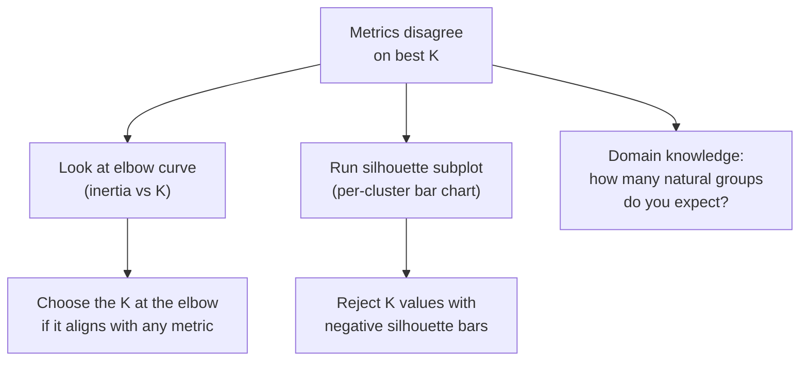

# Ch.14 — Unsupervised Metrics

> **Running theme:** The real estate platform ran K-Means, DBSCAN, and HDBSCAN in Ch.12 — but which clustering was actually good? Without labelled districts, there is no accuracy score, no F1, no MAE. Ch.14 gives the internal and external tools for answering "how well did this unsupervised method work?"

---

## 1 · Core Idea

**Supervised metrics** compare predictions to known labels. **Unsupervised metrics** have no labels to compare to — they measure geometric properties of the clusters themselves.

**Internal metrics** (label-free — use only the feature matrix):
- **Silhouette score** — balances cohesion (how tight each cluster is) against separation (how far each cluster is from its neighbours). Range: [−1, 1]; higher is better.
- **Davies-Bouldin index (DBI)** — average ratio of within-cluster spread to between-cluster distance. Range: [0, ∞); lower is better.
- **Calinski-Harabasz index (CHI)** — ratio of between-cluster dispersion to within-cluster dispersion. Higher is better.

**External metrics** (require some ground truth, even a partial one):
- **Adjusted Rand Index (ARI)** — measures overlap between predicted clusters and true labels, corrected for chance. Range: [−1, 1]; 1 = perfect.
- **Normalised Mutual Information (NMI)** — information-theoretic overlap between cluster assignment and true labels. Range: [0, 1].

**PCA-specific:**
- **Explained Variance Ratio (EVR)** — fraction of total variance captured per principal component. Use to choose `n_components`.

---

## 2 · Running Example

We reuse the **K-Means clustering from Ch.12** applied to California Housing. For each K from 2 to 15 we compute silhouette score, Davies-Bouldin index, and Calinski-Harabasz index to pick the best K objectively. Then we use ARI to validate against a proxy ground truth: California county boundaries (approximated via latitude/longitude quantiles as a synthetic label).

Dataset: **California Housing** (`sklearn.datasets.fetch_california_housing`)  
Clustering: K-Means (standardised features, K-Means++ init) — same setup as Ch.12  
Evaluation: silhouette (internal), DBI (internal), CHI (internal), ARI (external proxy)

---

## 3 · Math

### 3.1 Silhouette Score

For each point $i$:

$$a(i) = \frac{1}{|C_i| - 1} \sum_{j \in C_i, j \neq i} d(i, j)$$

(mean intra-cluster distance — **cohesion**; lower = tighter cluster)

$$b(i) = \min_{k \neq C_i} \frac{1}{|C_k|} \sum_{j \in C_k} d(i, j)$$

(mean distance to nearest cluster — **separation**; higher = better separated)

$$s(i) = \frac{b(i) - a(i)}{\max(a(i),\, b(i))}$$

**Mean silhouette score** $= \frac{1}{n} \sum_i s(i)$

Interpretation:
- $s(i) \approx 1$: well-assigned — tight cluster, far from others
- $s(i) \approx 0$: on the boundary between clusters
- $s(i) < 0$: likely misassigned — closer to another cluster

### 3.2 Davies-Bouldin Index

$$\text{DBI} = \frac{1}{K} \sum_{i=1}^{K} \max_{j \neq i} \frac{s_i + s_j}{d(c_i, c_j)}$$

where $s_i$ is the average distance of points in cluster $i$ to their centroid (within-cluster scatter) and $d(c_i, c_j)$ is the distance between centroids $i$ and $j$.

Lower DBI = clusters are compact and well-separated. DBI = 0 is the theoretical perfect score (all clusters perfectly non-overlapping with zero width).

### 3.3 Calinski-Harabasz Index

$$\text{CHI} = \frac{\text{tr}(B_K) / (K-1)}{\text{tr}(W_K) / (n-K)}$$

where $B_K$ is the between-cluster scatter matrix and $W_K$ is the within-cluster scatter matrix. Maximising CHI means maximising the ratio of between-cluster variance to within-cluster variance — dense, well-separated clusters give high CHI.

### 3.4 Adjusted Rand Index

$$\text{ARI} = \frac{\text{RI} - \mathbb{E}[\text{RI}]}{\max(\text{RI}) - \mathbb{E}[\text{RI}]}$$

where the raw Rand Index counts the fraction of point-pairs that are concordantly assigned (both in the same cluster in prediction and label, or both in different clusters). ARI corrects for the expected value under random labelling, so a random clustering scores approximately 0 and a perfect clustering scores 1.

### 3.5 Explained Variance Ratio (PCA)

$$\text{EVR}_k = \frac{\lambda_k}{\sum_{j=1}^{d} \lambda_j}$$

Cumulative EVR tells you the fraction of total variance retained if you keep the top $k$ components. The 95% rule is a common heuristic. A **scree plot** graphs individual EVR vs component index — the "elbow" marks the transition from signal to noise.

---

## 4 · Step by Step

```
Internal metrics (no labels needed):
1. Standardise features
2. For K in range(2, 16):
   a. Fit KMeans(n_clusters=K)
   b. Compute silhouette_score   (expensive: O(n²), use sample_size=5000)
   c. Compute davies_bouldin_score
   d. Compute calinski_harabasz_score
3. Plot all three metrics vs K on the same figure
4. Pick K where:
   - silhouette is maximised
   - DBI is minimised
   - CHI is maximised
   Note: they won't all agree — look for K where majority agree

External validation (when proxy labels exist):
5. Create proxy ground-truth using latitude/longitude quantiles
6. adjusted_rand_score(true_labels, predicted_labels)
7. normalized_mutual_info_score(true_labels, predicted_labels)

PCA component selection:
8. pca_full.explained_variance_ratio_.cumsum()
9. np.argmax(cumevr >= 0.95) + 1  →  minimum components for 95% EVR
10. Plot individual EVR as a bar chart (scree plot) — look for the knee
```

---

## 5 · Key Diagrams

### Silhouette geometry

```
     Cluster A          Cluster B
  ●───●───●             ●───●───●
  |   i   |             |       |
  a(i) = mean dist      b(i) = mean dist
  within Cluster A      from i to Cluster B

  s(i) = (b(i) - a(i)) / max(a(i), b(i))
  If b(i) >> a(i) → s(i) ≈ 1  (well assigned)
  If a(i) >> b(i) → s(i) ≈ -1 (misassigned)
```

### Three-metric comparison by K

```
Metric  │  K=2   K=3   K=4   K=5   K=6  …
────────┼───────────────────────────────────
Silh↑   │  0.14  0.17  0.19  0.21* 0.20
DBI↓    │  1.52  1.41  1.33  1.27* 1.31
CHI↑    │  4200  5100  5800  6200* 6100
────────┴──────────────────────── * unanimous winner
```

### When metrics disagree



---

## 6 · Hyperparameter Dial

### Silhouette score

| Dial | Effect |
|---|---|
| `sample_size` | Reduces runtime from $O(n^2)$ to $O(s^2 \cdot n/s)$ — use 5,000 for datasets >20k |
| `metric` | `'euclidean'` (default) or `'cosine'` — must match the distance metric used by the clusterer |

### ARI / NMI

| Dial | Effect |
|---|---|
| proxy label quality | ARI only as good as the proxy labels — noisy proxies inflate variance of ARI |

*Neither DBI nor CHI have meaningful dials — they are computed deterministically from the cluster assignments and feature matrix.*

---

## 7 · Code Skeleton

```python
from sklearn.datasets import fetch_california_housing
from sklearn.preprocessing import StandardScaler
from sklearn.cluster import KMeans
from sklearn.metrics import (silhouette_score, davies_bouldin_score,
                              calinski_harabasz_score, adjusted_rand_score,
                              normalized_mutual_info_score)

data = fetch_california_housing()
X    = data.data
scaler = StandardScaler()
X_sc   = scaler.fit_transform(X)
```

```python
K_range = range(2, 16)
results = {'K': [], 'silhouette': [], 'dbi': [], 'chi': []}

for k in K_range:
    km = KMeans(n_clusters=k, init='k-means++', n_init=10, random_state=42)
    km.fit(X_sc)
    results['K'].append(k)
    results['silhouette'].append(
        silhouette_score(X_sc, km.labels_, sample_size=5000, random_state=42))
    results['dbi'].append(davies_bouldin_score(X_sc, km.labels_))
    results['chi'].append(calinski_harabasz_score(X_sc, km.labels_))
```

```python
# ── External: ARI against proxy labels ───────────────────────────────────────
# Proxy: 4 quantile bins on latitude × longitude (16 geo-quadrants)
import numpy as np
lat_bin = np.digitize(data.data[:, 6], np.percentile(data.data[:, 6], [25, 50, 75]))
lon_bin = np.digitize(data.data[:, 7], np.percentile(data.data[:, 7], [25, 50, 75]))
proxy   = lat_bin * 4 + lon_bin     # 16 rough geographic cells

best_k  = 5
km5     = KMeans(n_clusters=best_k, n_init=10, random_state=42).fit(X_sc)
ari     = adjusted_rand_score(proxy, km5.labels_)
nmi     = normalized_mutual_info_score(proxy, km5.labels_)
print(f"ARI vs geo-proxy: {ari:.4f}   NMI: {nmi:.4f}")
```

---

## 8 · What Can Go Wrong

- **Optimising silhouette at the expense of domain relevance.** The K that maximises silhouette score might produce clusters with no business interpretation. A K one or two steps away may yield lower silhouette but perfectly separates high-value districts from low-value ones. Always cross-check internal metrics against domain knowledge.

- **Using silhouette score without sampling on large datasets.** Silhouette computation is $O(n^2 \cdot d)$. On all 20,640 California Housing points it may take minutes. Use `sample_size=5000` (which sklearn supports natively). The sampled estimate is very close to the true value for $n > 5000$.

- **Treating ARI of 0 as "random clustering."** ARI is corrected for chance — a random clustering scores approximately 0. But an ARI of 0.05 is also not significantly above chance. Only ARI > 0.3–0.4 reliably indicates meaningful overlap with ground truth.

- **Comparing CHI across datasets of different sizes.** CHI is not bounded and scales with $n$. An CHI of 6000 on 20k points is not comparable to 6000 on 200 points. Only compare CHI across different K values on the same dataset.

- **Using EVR threshold to make hard decisions about K.** The 95% cumulative EVR rule is a heuristic. If you have a task-specific downstream model, use cross-validation on that model's performance as the criterion for choosing `n_components`, not EVR alone.

---

## 9 · Interview Checklist

| Must know | Likely asked | Trap to avoid |
|---|---|---|
| Silhouette: $s(i) = (b(i) - a(i)) / \max(a(i), b(i))$; range [−1, 1]; higher = better; $a(i)$ = mean intra-cluster distance, $b(i)$ = mean distance to nearest other cluster | What is a good silhouette score? (>0.5 is often cited, but highly dataset-dependent; always compare relative to other K values) | "Silhouette of 0 means bad clustering" — 0 means a point is on the boundary; the mean score across all K values is what matters |
| Davies-Bouldin: mean over clusters of best (intra / inter) ratio; lower is better; 0 is theoretical perfect | How does DBI differ from silhouette? (DBI uses centroids and mean intra-cluster distance to centroid; silhouette uses pairwise distances — DBI is faster, silhouette is more robust to cluster shape) | Applying DBI to DBSCAN — sklearn computes centroids from whatever cluster members it receives, so DBI technically runs; but DBI’s centroid-based scatter calculations are semantically inappropriate for non-convex DBSCAN clusters and will produce misleading scores |
| ARI: corrected-for-chance fraction of concordant pairs; range [−1, 1]; requires ground truth | When would you use ARI in an unsupervised problem? (semi-supervised: you have partial labels or a known grouping to validate against; e.g., geographic regions, known customer segments) | Comparing ARI across datasets — it is relative; only ARI > ~0.3 is considered meaningful overlap |
| **Calinski-Harabasz Index (Variance Ratio Criterion):** ratio of between-cluster dispersion to within-cluster dispersion; higher is better; computed from centroids, so $O(Knd)$ — fast. Tends to favour convex, compact clusters; biased toward K-Means-style outputs | "Name three internal clustering metrics and how they differ" | "CH index and silhouette always agree on the optimal $K$" — they often disagree; CH penalises diffuse clusters more heavily, silhouette penalises misassignment; use both and triangulate |
| **Normalised Mutual Information (NMI):** measures how much knowing the cluster label reduces uncertainty about the true class label; range 0–1; AMI (Adjusted MI) corrects for chance like ARI does. Works even when cluster count differs from class count | "When would you use NMI vs ARI for cluster validation?" | "NMI > ARI means the clustering is better" — they capture different aspects (information content vs pair concordance); high NMI with low ARI can occur when cluster sizes are very unequal |

---

## Bridge to Chapter 15

Ch.12–14 finish the unsupervised arc. Chapter 15 — **MLE & Loss Functions** — steps back to examine the theoretical foundation shared by both supervised and unsupervised learning: maximum likelihood estimation. It shows that MSE is not an arbitrary choice for regression — it falls directly out of assuming Gaussian noise. Cross-entropy falls out of Bernoulli/Categorical noise. Understanding this principle tells you which loss to use for any new problem type.
