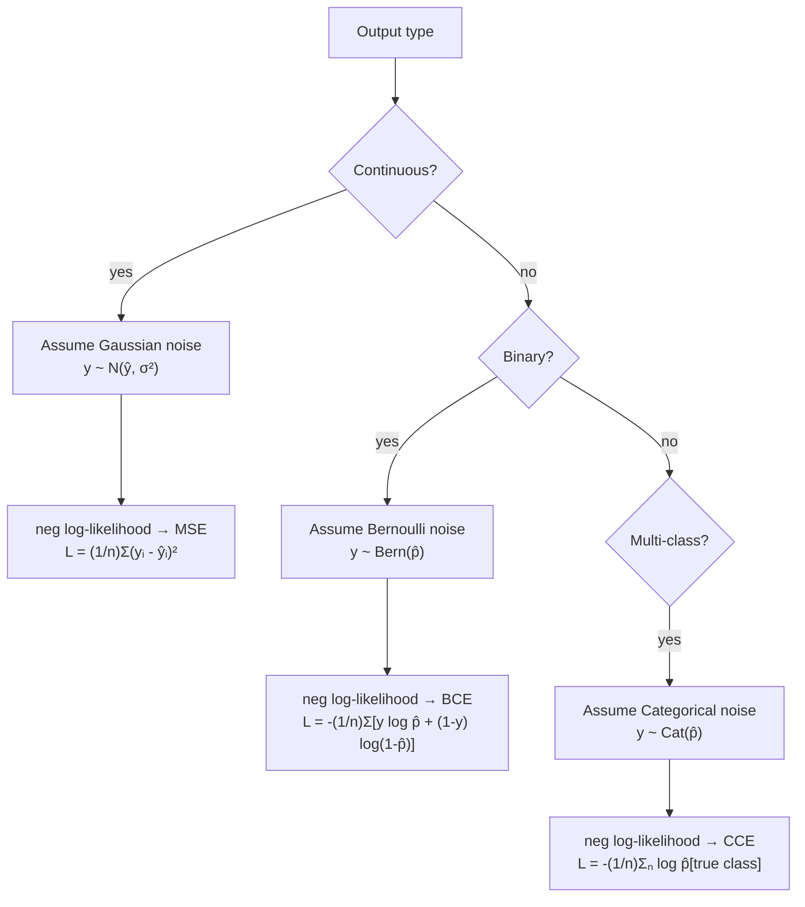

# Ch.15 — MLE & Loss Functions

> **The story.** **Maximum Likelihood Estimation** was given its modern form in two papers by **R. A. Fisher** (1912 and the canonical 1922 "On the Mathematical Foundations of Theoretical Statistics"). Fisher's claim was audacious: there is *one* principled way to estimate parameters from data — pick the parameters that make the observed data most probable. The consequences were enormous. Gauss's 1809 derivation of least squares fell out as a special case (Gaussian noise → MSE). Berkson's 1944 logistic regression fell out as another (Bernoulli noise → binary cross-entropy). Multiclass classification fell out as a third (Categorical noise → categorical cross-entropy). Every loss function in this curriculum — every loss function in PyTorch's `torch.nn` namespace — is, secretly, a negative log-likelihood from Fisher's framework. Once you see this, you stop memorising losses and start *deriving* them.
>
> **Where you are in the curriculum.** Every loss the platform has used — MSE for house-price regression in [Ch.1](../ch01-linear-regression/), binary cross-entropy for high-value classification in [Ch.2](../ch02-logistic-regression/) — was chosen for a reason deeper than habit. This chapter gives the principled derivation: change the noise model, change the loss. Once you understand this, [Ch.18](../ch18-transformers/)'s next-token cross-entropy and the AI track's RLHF reward modelling will feel like the same idea wearing different costumes.
>
> **Notation in this chapter.** $\boldsymbol{\theta}$ — parameter vector (weights and biases of the model); $p(y\mid\mathbf{x};\boldsymbol{\theta})$ — the **conditional model** (probability the model assigns to $y$ given input $\mathbf{x}$); $\mathcal{L}(\boldsymbol{\theta})=\prod_{i=1}^{N}p(y_i\mid\mathbf{x}_i;\boldsymbol{\theta})$ — the **likelihood**; $\log\mathcal{L}$ — the log-likelihood; $-\log\mathcal{L}$ — the **negative log-likelihood (NLL)**, which is what we minimise; $\hat{\boldsymbol{\theta}}_{\text{MLE}}=\arg\max_{\boldsymbol{\theta}}\log\mathcal{L}(\boldsymbol{\theta})$ — the **maximum-likelihood estimate**. Recipes: Gaussian noise → MSE; Bernoulli outputs → BCE; categorical outputs → cross-entropy; Laplace noise → MAE.

---

## 1 · Core Idea

**Maximum Likelihood Estimation (MLE):** choose model parameters $\theta$ that maximise the probability of the observed training data:

$$\hat{\theta}_\text{MLE} = \arg\max_\theta \prod_{i=1}^n p(y_i \mid x_i; \theta)$$

Taking the log (which doesn't change the argmax) and flipping the sign gives a **minimisation problem** — the negative log-likelihood — which is precisely the training loss.

| Output type | Noise assumption | Likelihood | Negative log-likelihood (loss) |
|---|---|---|---|
| Continuous (regression) | Gaussian: $y \sim \mathcal{N}(\hat{y}, \sigma^2)$ | Product of Gaussians | **MSE** (mean squared error) |
| Binary (classification) | Bernoulli: $y \sim \text{Bern}(\hat{p})$ | Product of Bernoullis | **Binary cross-entropy** |
| Multi-class | Categorical: $y \sim \text{Cat}(\hat{p})$ | Product of Categoricals | **Categorical cross-entropy** |

The key insight: **the loss function is a modelling choice, not an optimisation trick.** Using MSE for classification and vice versa is a modelling error, not just an implementation mistake.

---

## 2 · Running Example

We return to both California Housing tasks from Ch.1 and Ch.2:

1. **Regression:** predict `MedHouseVal` → use MSE (derives from Gaussian noise)
2. **Binary classification:** predict `high_value = (MedHouseVal > median)` → use binary cross-entropy (derives from Bernoulli noise)

We derive each loss from first principles, then demonstrate empirically what goes wrong when you use the wrong loss — MSE for classification and cross-entropy for regression.

Dataset: **California Housing** (`sklearn.datasets.fetch_california_housing`)

---

## 3 · Math

### 3.1 MLE: Setup

We assume each observation is independently generated by the same parametric distribution:

$$\mathcal{L}(\theta) = \prod_{i=1}^n p(y_i \mid x_i; \theta)$$

Taking the log:

$$\ell(\theta) = \sum_{i=1}^n \log p(y_i \mid x_i; \theta)$$

Maximising $\ell$ is equivalent to minimising $-\ell$ (the negative log-likelihood = training loss).

### 3.2 MSE from Gaussian MLE

Assume each target $y_i$ is drawn from a Gaussian centred on the model prediction $\hat{y}_i = f(x_i; \theta)$:

$$p(y_i \mid x_i; \theta) = \frac{1}{\sqrt{2\pi\sigma^2}} \exp \left(-\frac{(y_i - \hat{y}_i)^2}{2\sigma^2}\right)$$

Log-likelihood:

$$\ell(\theta) = \sum_i \left[ -\frac{1}{2}\log(2\pi\sigma^2) - \frac{(y_i - \hat{y}_i)^2}{2\sigma^2} \right]$$

Maximising over $\theta$ (treating $\sigma^2$ as constant):

$$\hat{\theta}_\text{MLE} = \arg\min_\theta \sum_i (y_i - \hat{y}_i)^2 = \arg\min_\theta \text{MSE}(\theta)$$

**Conclusion:** MSE is the natural loss when the target is a real-valued quantity with symmetric noise described by a Gaussian.

### 3.3 Binary Cross-Entropy from Bernoulli MLE

Assume each target $y_i \in \{0, 1\}$ is drawn from a Bernoulli distribution with probability $\hat{p}_i = \sigma(f(x_i; \theta))$ (sigmoid output):

$$p(y_i \mid x_i; \theta) = \hat{p}_i^{y_i} (1 - \hat{p}_i)^{1-y_i}$$

Log-likelihood:

$$\ell(\theta) = \sum_i \left[ y_i \log \hat{p}_i + (1 - y_i) \log(1 - \hat{p}_i) \right]$$

Negating gives **binary cross-entropy**:

$$\mathcal{L}_\text{BCE} = -\frac{1}{n}\sum_i \left[ y_i \log \hat{p}_i + (1 - y_i) \log(1 - \hat{p}_i) \right]$$

### 3.4 Categorical Cross-Entropy from Categorical MLE

For $C$-class classification, the model outputs a probability vector $\hat{\mathbf{p}}_i \in \mathbb{R}^C$ (softmax). Target $y_i$ is a one-hot vector. The categorical likelihood is:

$$p(y_i \mid x_i; \theta) = \prod_{c=1}^C \hat{p}_{i,c}^{ y_{i,c}}$$

Negative log-likelihood:

$$\mathcal{L}_\text{CCE} = -\frac{1}{n}\sum_i \sum_c y_{i,c} \log \hat{p}_{i,c}$$

For a single true class $c^*$: $\mathcal{L}_\text{CCE} = -\frac{1}{n}\sum_i \log \hat{p}_{i,c^*}$ (only the probability of the true class matters).

### 3.5 Why MSE for Classification is Wrong

At $\hat{p} = 0.99$ (correctly predicting the positive class), the Bernoulli log-likelihood gradient is:

$$\frac{\partial}{\partial \hat{p}} \left[-y \log \hat{p}\right] = -\frac{y}{\hat{p}} \approx -\frac{1}{0.99} \approx -1.01 \quad \text{(meaningful gradient)}$$

With MSE loss $(\hat{p} - y)^2 = (0.99 - 1)^2 = 0.0001$ — a nearly vanishing gradient. Near-correct predictions receive essentially zero training signal, so learning is very slow near the decision boundary.

---

## 4 · Step by Step

```
Deriving the correct loss:
1. What is the output type? (continuous → Gaussian → MSE; binary → Bernoulli → BCE)
2. Write the likelihood of the data under that noise model
3. Take the log, negate, divide by n → this is your loss function
4. The gradient of the loss w.r.t. model outputs is your training signal

Choosing empirically:
1. Train regressor on housing prices: try MSE vs MAE vs Huber
2. Compare validation RMSE for each loss
3. Train classifier on high_value: try BCE vs MSE (wrong choice)
4. Compare validation AUC — MSE for classification will converge slower
 and produce uncalibrated probabilities
```

---

## 5 · Key Diagrams

### Derivation chain



### Loss landscape: MSE vs cross-entropy for binary prediction

```
P(y=1|x) MSE loss BCE loss
──────────── ────────────────── ──────────────────
0.01 (y=1) (0.01-1)² = 0.98 -log(0.01) = 4.61 ← large gradient, fast learning
0.50 (y=1) (0.50-1)² = 0.25 -log(0.50) = 0.69
0.99 (y=1) (0.99-1)² = 0.0001 -log(0.99) = 0.01 ← near-zero MSE gradient

MSE gradient near correct prediction ≈ 0 → slow learning
BCE gradient near correct prediction: -1/0.99 ≈ -1.01 → strong signal preserved
```

---

## 6 · Hyperparameter Dial

Loss functions have no tuning parameters in the conventional sense, but there are related choices:

| Choice | Options | Impact |
|---|---|---|
| **Regression loss variant** | MSE, MAE, Huber (δ), Log-cosh | MSE: penalises outliers quadratically; MAE: robust to outliers; Huber: MSE for small errors, MAE-like for large errors; controlled by δ |
| **Imbalanced classification** | BCE with `class_weight`, focal loss | Downweights easy negatives; BCE `pos_weight` in PyTorch or `class_weight='balanced'` in sklearn |
| **Label smoothing** | `label_smoothing` in Keras/PyTorch | Replaces hard 0/1 labels with (ε/C, 1−ε+ε/C) — improves calibration and generalisation |

---

## 7 · Code Skeleton

```python
import numpy as np
from sklearn.datasets import fetch_california_housing

housing = fetch_california_housing()
X, y_reg = housing.data, housing.target

# Binary classification target
threshold = np.median(y_reg)
y_clf = (y_reg > threshold).astype(int)

from sklearn.model_selection import train_test_split
X_tr, X_te, yr_tr, yr_te = train_test_split(X, y_reg, test_size=0.2, random_state=42)
_, _, yc_tr, yc_te = train_test_split(X, y_clf, test_size=0.2, random_state=42)
```

```python
# ── MSE from scratch ──────────────────────────────────────────────────────────
def mse(y_true, y_pred):
 return np.mean((y_true - y_pred) ** 2)

def mse_gradient(y_true, y_pred):
 return 2 * (y_pred - y_true) / len(y_true)

# ── BCE from scratch ──────────────────────────────────────────────────────────
def bce(y_true, p_pred, eps=1e-12):
 p = np.clip(p_pred, eps, 1 - eps) # numerical stability
 return -np.mean(y_true * np.log(p) + (1 - y_true) * np.log(1 - p))

def bce_gradient(y_true, p_pred, eps=1e-12):
 p = np.clip(p_pred, eps, 1 - eps)
 return (p - y_true) / (p * (1 - p) * len(y_true))
```

```python
# ── Huber loss (robust regression) ───────────────────────────────────────────
def huber(y_true, y_pred, delta=1.0):
 residual = np.abs(y_true - y_pred)
 return np.where(residual <= delta,
 0.5 * residual ** 2,
 delta * (residual - 0.5 * delta)).mean()
```

---

## 8 · What Can Go Wrong

- **Using MSE for binary classification.** MSE treats the output as a real number, not a probability. Gradients are nearly zero for confident (correct) predictions and large only for large-residual wrong predictions. This means correct predictions don't reinforce and wrong predictions can oscillate. The model also fails to output calibrated probabilities.

- **Using cross-entropy for regression.** Cross-entropy assumes outputs are probabilities summing to 1. For a real-valued target like house price, the concept doesn't apply. If you try to `log(y_pred)` on a negative or zero residual, you get a NaN.

- **Ignoring class imbalance in BCE.** With 95% negative examples, a model that always predicts 0 achieves near-zero BCE. Use `class_weight='balanced'` or `pos_weight` to scale the positive-class loss term.

- **Not clipping probabilities before computing BCE.** `log(0) = -∞`. Always clip predicted probabilities to `[ε, 1-ε]` before passing through the loss. sklearn's `LogisticRegression` handles this internally but manual implementations do not.

- **Confusing training loss with evaluation metric.** Do not use MSE as both training loss and evaluation metric for classification. Training loss should be BCE; evaluation should be AUC, F1, or accuracy depending on your objective.

---

## 9 · Interview Checklist

| Must know | Likely asked | Trap to avoid |
|---|---|---|
| MSE derives from MLE under Gaussian noise: $\hat{\theta} = \arg\min\sum(y_i-\hat{y}_i)^2$ | Why is MSE equivalent to MLE for regression? (The $-\frac{(y-\hat{y})^2}{2\sigma^2}$ term in the Gaussian log-likelihood gives MSE when you drop constants and minimise) | "MSE is used for regression because it's differentiable" — the real reason is that it corresponds to the Gaussian noise model; MAE is also differentiable (almost everywhere) |
| Binary cross-entropy derives from Bernoulli MLE: $L=-\frac{1}{n}\sum[y\log\hat{p}+(1-y)\log(1-\hat{p})]$ | Why does MSE fail for classification near $\hat{p}=0.99$? (gradient $(2\hat{p}-2y)=−0.02$ is tiny; BCE gradient $-y/\hat{p}=-1.01$ is large — better training signal) | "MSE for classification is just less accurate" — it is a modelling error: the Gaussian noise assumption is wrong for a Bernoulli-distributed target |
| Huber loss: MSE for $|r|\leq\delta$, linear ($\delta|r|-\delta^2/2$) for $|r|>\delta$ — robust to outliers | When would you use Huber over MSE? (when the target has outliers that you don't want to penalise quadratically — e.g., luxury properties in a housing dataset) | "MAE is always more robust than MSE" — MAE is non-differentiable at 0; Huber combines robustness with differentiability |
| **KL divergence and cross-entropy:** $\text{CE}(p, q) = H(p) + D_\text{KL}(p \| q)$. Minimising cross-entropy against fixed ground-truth labels (constant $H(p)$) is equivalent to minimising KL divergence — which is why "minimise cross-entropy" and "maximise log-likelihood" are the same objective | "Show why minimising cross-entropy is equivalent to minimising KL divergence" | "KL divergence is symmetric" — $D_\text{KL}(p \| q) \ne D_\text{KL}(q \| p)$; the asymmetry matters in variational inference (forward KL is mean-seeking, reverse KL is mode-seeking) |
| **Focal loss:** $\text{FL}(p_t) = -(1-p_t)^\gamma \log(p_t)$. Down-weights the loss contribution of easy examples (where $p_t \to 1$) so training focuses on hard or rare examples. Introduced for object detection (RetinaNet) to address foreground/background imbalance | "When would you use focal loss instead of cross-entropy?" | "Focal loss replaces class weighting" — they address different problems; class weights correct for *frequency* imbalance, focal loss corrects for *difficulty* imbalance; they can and often should be combined |

---

## Bridge to Chapter 16

Ch.15 showed that training loss has a mathematical meaning — it's a log-likelihood under a noise model. But watching a single scalar loss decrease across epochs is a crude signal. Chapter 16 — **TensorBoard** — instruments the training loop to emit richer diagnostics: loss curves, metric curves, weight distributions, gradient histograms, and projector visualisations. These are the debugging tools that show *why* a loss is decreasing (or not).


## Illustrations


