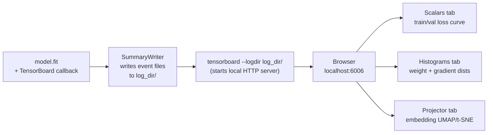

# Ch.16 — TensorBoard

> **Running theme:** The platform's neural network from Ch.5 trained to convergence — but what actually happened inside? Loss curves show the output; TensorBoard shows the internals: weight distributions drifting (or vanishing), gradients exploding (or dead), and the embedding projector revealing whether the network learned meaningful feature representations. If Ch.5 was "turn on the engine," Ch.16 is "read the instruments."

---

## 1 · Core Idea

TensorBoard is TensorFlow's (and PyTorch's) training dashboard. It reads event files written during training and renders interactive visualisations in a browser. The key panels:

| Panel | What it shows | Primary diagnostic use |
|---|---|---|
| **Scalars** | Loss and metrics per epoch/step | Detect overfitting, underfitting, learning rate issues |
| **Histograms** | Weight and gradient distributions over time | Detect vanishing/exploding gradients, dead neurons |
| **Distributions** | Same as histograms but as an overlay area chart | See the spread of activations evolve |
| **Projector** | High-dimensional embeddings reduced via PCA or t-SNE | Validate that learned representations cluster meaningfully |
| **Images** | Logged tensors rendered as images | Inspect feature maps, sample predictions, data augmentation |
| **Graphs** | Computational graph of the model | Verify architecture, spot unexpected operations |
| **Profile** | GPU/CPU utilisation timeline | Identify training bottlenecks |

TensorBoard is not a debugging tool for code errors. It is a **training diagnostics tool** for model behaviour.

---

## 2 · Running Example

We return to the **Ch.5 training loop**: a small Keras neural network trained on California Housing. We instrument it with the `TensorBoard` callback to emit:

1. Training and validation MSE per epoch (Scalars)
2. Weight and bias distributions per layer (Histograms)
3. Gradient histograms (Histograms — requires manual summary writing or `histogram_freq`)
4. Intermediate activations as a custom embedding (Projector)

Dataset: **California Housing** (`sklearn.datasets.fetch_california_housing`)  
Network: 3-layer dense network (same as Ch.5)

---

## 3 · Math

TensorBoard itself has no mathematics — it logs tensors and renders them. But the diagnostics it reveals connect to the mathematical concepts from earlier chapters:

### 3.1 What Histograms Reveal

Each layer's weight matrix $\mathbf{W}$ at epoch $t$ has a distribution. Healthy training shows this distribution shifting and narrowing as learning proceeds. Warning signs:

**Vanishing gradients:** weight histograms stop changing in early layers (Ch.5 — vanishing gradient problem). The gradient $\frac{\partial \mathcal{L}}{\partial \mathbf{W}^{(1)}} = \frac{\partial \mathcal{L}}{\partial \mathbf{W}^{(L)}} \cdot \prod_{k=2}^{L} \frac{\partial \mathbf{h}^{(k)}}{\partial \mathbf{h}^{(k-1)}}$ shrinks exponentially for deep networks with sigmoid activations.

**Exploding gradients:** weight histograms spread wider and wider; $\|\nabla\|$ grows uncontrollably.

**Dead neurons:** if the gradient histogram for a layer is a spike at zero, those neurons have died (ReLU outputs $\max(0, x)$; once input is always negative, gradient is always 0).

### 3.2 Embedding Projector

The projector takes a tensor $\mathbf{Z} \in \mathbb{R}^{n \times d}$ (the internal representation of $n$ samples from a hidden layer of dim $d$) and reduces it to 2D/3D via PCA or t-SNE for visualisation. If the network learned useful features, samples of the same class should cluster in the embedding space.

---

## 4 · Step by Step

```
Setting up TensorBoard logging:
1. Define log_dir = 'logs/run_<timestamp>'
2. Create tf.keras.callbacks.TensorBoard(
       log_dir=log_dir,
       histogram_freq=1,       # log weight histograms every epoch
       write_graph=True,       # log the computational graph
       write_images=False,
       update_freq='epoch'     # log scalars every epoch (not every batch)
   )
3. Pass callback to model.fit(callbacks=[tb_callback])
4. After training: tensorboard --logdir logs/

Reading the dashboard:
5. Scalars: is val_loss decreasing? Does it flatten (underfitting) or diverge from train_loss (overfitting)?
6. Histograms: do early-layer weights change between epochs? If frozen → vanishing gradients.
7. Check gradient histograms: are they wide (normal) or spike at 0 (dead neurons)?
8. Projector: load the embedding tensor and metadata file; visualise with t-SNE in browser.

Custom summaries (beyond the callback):
9. tf.summary.scalar('custom_metric', value, step=epoch)
10. tf.summary.histogram('layer_output', tensor, step=epoch)
11. tf.summary.image('predictions', img_tensor, step=epoch)
```

---

## 5 · Key Diagrams

### TensorBoard data flow



### Vanishing gradient signature in histograms

```
Epoch 1   │ ████████████████  (weights moving, wide gradient)
Epoch 5   │ ██████████        (gradients shrinking)
Epoch 10  │ ████              (early layers barely moving)
Epoch 20  │ █                 (first layer frozen — vanishing gradient!)
Layer 4   │ ████████████████  (last layer still learning)
```

### Healthy vs unhealthy scalar curves

```
Healthy:                    Overfitting:            Underfitting:
 train_loss = val_loss       train_loss ↓           both curves flat
 both decreasing             val_loss ↑             or very slowly ↓
 (small gap)                 (widening gap)
```

---

## 6 · Hyperparameter Dial

| Parameter | Too low / off | Sweet spot | Too high / on |
|---|---|---|---|
| **histogram_freq** | 0 — no weight histograms | 1 (every epoch) | Every batch — huge disk usage, no value |
| **update_freq** | 'epoch' — one scalar per epoch | 'epoch' for long runs | 'batch' — floods Scalars; only useful for debugging a single epoch |
| **profile_batch** | 0 — no profiling | 2 (discard warmup batch 1) | Multiple batches — significant training overhead |
| **write_graph** | False | True once to verify architecture | — |
| **embeddings_freq** | 0 — no projector | 5–10 — every few epochs | 1 — slow; embedding data can be large |

---

## 7 · Code Skeleton

```python
import tensorflow as tf
from tensorflow import keras
import numpy as np
import datetime
from sklearn.datasets import fetch_california_housing
from sklearn.model_selection import train_test_split
from sklearn.preprocessing import StandardScaler

housing = fetch_california_housing()
X, y    = housing.data, housing.target.reshape(-1, 1)
scaler  = StandardScaler()
X_sc    = scaler.fit_transform(X)
X_tr, X_te, y_tr, y_te = train_test_split(X_sc, y, test_size=0.2, random_state=42)
X_tr, X_va, y_tr, y_va = train_test_split(X_tr, y_tr, test_size=0.2, random_state=42)
```

```python
# ── Build model (same architecture as Ch.5) ───────────────────────────────────
def build_model():
    model = keras.Sequential([
        keras.layers.Input(shape=(X_tr.shape[1],)),
        keras.layers.Dense(64, activation='relu', name='hidden_1'),
        keras.layers.Dense(32, activation='relu', name='hidden_2'),
        keras.layers.Dense(16, activation='relu', name='hidden_3'),
        keras.layers.Dense(1,                     name='output'),
    ])
    model.compile(
        optimizer=keras.optimizers.Adam(learning_rate=1e-3),
        loss='mse',
        metrics=['mae']
    )
    return model
```

```python
# ── TensorBoard callback ──────────────────────────────────────────────────────
log_dir = 'logs/ch16_' + datetime.datetime.now().strftime('%Y%m%d_%H%M%S')

tb_callback = keras.callbacks.TensorBoard(
    log_dir        = log_dir,
    histogram_freq = 1,          # weight + bias histograms every epoch
    write_graph    = True,       # log computational graph
    update_freq    = 'epoch',    # scalars per epoch, not per batch
    profile_batch  = 0,          # disabled — enable with profile_batch=2 for perf profiling
)

model = build_model()
history = model.fit(
    X_tr, y_tr,
    validation_data = (X_va, y_va),
    epochs          = 50,
    batch_size      = 256,
    callbacks       = [tb_callback],
    verbose         = 0
)
print(f"Logs written to: {log_dir}")
print("Run: tensorboard --logdir logs/")
```

```python
# ── Custom scalar: learning rate ──────────────────────────────────────────────
summary_writer = tf.summary.create_file_writer(log_dir + '/custom')

class LRLogger(keras.callbacks.Callback):
    def on_epoch_end(self, epoch, logs=None):
        with summary_writer.as_default():
            tf.summary.scalar('learning_rate',
                              self.model.optimizer.learning_rate.numpy(),
                              step=epoch)

model2  = build_model()
model2.fit(X_tr, y_tr, validation_data=(X_va, y_va), epochs=30, batch_size=256,
           callbacks=[tb_callback, LRLogger()], verbose=0)
```

```python
# ── Projector: log intermediate embeddings ────────────────────────────────────
import os

embedding_model = keras.Model(inputs=model.input,
                               outputs=model.get_layer('hidden_3').output)
embeddings = embedding_model.predict(X_te[:500], verbose=0)  # (500, 16)

log_emb_dir = os.path.join(log_dir, 'projector')
os.makedirs(log_emb_dir, exist_ok=True)

# Write embeddings as numpy checkpoint
np.savetxt(os.path.join(log_emb_dir, 'feature_vecs.tsv'),
           embeddings, delimiter='\t')

# Optional metadata (true house values for colouring)
with open(os.path.join(log_emb_dir, 'metadata.tsv'), 'w') as f:
    f.write('MedHouseVal\n')
    for v in y_te[:500, 0]:
        f.write(f'{v:.3f}\n')

print("Embedding + metadata written for Projector tab")
```

---

## 8 · What Can Go Wrong

- **Logging every batch for Scalars.** `update_freq='batch'` can create hundreds of thousands of scalar events per run. The TensorBoard UI becomes unresponsive and disk usage bloats. Use `'epoch'` for all but single-epoch debugging where you need per-step visibility.

- **histogram_freq=1 on very large models or datasets.** Computing histograms requires a forward pass through the data and extraction of all weight tensors. On a large model with many layers, this can double training time. Set `histogram_freq=5` (every 5 epochs) if it's too slow.

- **Comparing runs without clearing the log directory.** If you re-run training into the same `log_dir`, TensorBoard aggregates both runs in the same Scalars view — curves overlap confusingly. Always use a timestamped subdirectory (`logs/run_YYYYMMDD_HHMMSS/`) for each experiment.

- **Hard-coding `log_dir='logs/'` in a cloud or shared environment.** Write to a unique path per run. In cloud training jobs, use environment variables or job IDs.

- **Interpreting a dead gradient histogram as "converged."** If the gradient histogram for a layer is a spike at zero from epoch 5 onwards, the layer is not converged — it is frozen due to the dying-ReLU problem or a vanishing-gradient issue. Fix: use LeakyReLU or He initialisation and check earlier-layer learning rates.

---

## 9 · Interview Checklist

| Must know | Likely asked | Trap to avoid |
|---|---|---|
| TensorBoard callback: `histogram_freq` logs weight/gradient histograms; `update_freq='epoch'` logs Scalars each epoch; `write_graph=True` captures the computational graph | What does a weight histogram that stops changing across epochs tell you? (Early layers have vanishing gradients — the backward pass information is not reaching them; check for sigmoid/tanh activations in a deep network or missing skip connections) | "TensorBoard is only for TensorFlow" — PyTorch has `torch.utils.tensorboard.SummaryWriter`; same log format, same browser UI |
| Projector tab: logs a tensor $\mathbf{Z} \in \mathbb{R}^{n \times d}$ + optional metadata; renders via PCA or t-SNE in the browser; useful for validating that learned embeddings separate classes | When would you use the Projector tab? (When training embeddings — word2vec, sentence encoders, or any model where a hidden layer is meant to represent meaningful features; validate that same-class examples cluster) | `update_freq='batch'` — this logs a scalar per batch step, which can produce millions of events and make the UI unusable; always use `'epoch'` for long runs |
| Dead neurons: ReLU outputs 0 for all inputs when pre-activation is always negative; gradient is 0, weights never update; TensorBoard histograms show a spike at 0 for that layer's gradients | How do you fix dying ReLUs noticed in TensorBoard? (Switch to LeakyReLU or ELU which have non-zero gradient for negative inputs; use He initialisation; reduce learning rate to prevent large negative pre-activations early in training) | Confusing `write_graph=True` overhead with `histogram_freq` overhead — graph logging runs once at epoch 1; histograms run every `histogram_freq` epochs and scale with model size |
| **W&B vs TensorBoard vs MLflow:** TensorBoard is local, framework-native, zero setup; **Weights & Biases** logs to the cloud, adds team sharing, Bayesian sweep scheduling, and artifact versioning; **MLflow** is self-hosted and adds a model registry and experiment tracking database | "When would you choose W&B over TensorBoard?" | "TensorBoard is deprecated with modern ML tooling" — TensorBoard is still the default in TensorFlow/Keras and natively supported in PyTorch; W&B is additive and integrates with TensorBoard logs |
| **Diagnosing training with loss curves:** train ↓ val ↑ → overfitting; both plateau early → underfitting or LR too low; train loss unstable/spiky → LR too high or batch too small; val loss improves then suddenly jumps → data distribution shift, label noise, or checkpoint corruption | "What does it mean if validation loss is lower than training loss?" | "If training loss decreases, the model is improving" — always track both; a widening gap between train and val loss is the overfitting signal, not the training curve alone |

---

## Bridge to Ch.17 — Transformers & Attention

Ch.16 gave you the instruments to diagnose a trained network. Ch.17 introduces the architecture that replaced RNNs and CNNs as the default for sequence and language tasks: the transformer. Every concept from the previous 16 chapters feeds into it — gradient flow (Ch.5), regularisation (Ch.6), embeddings (Ch.8), and now the diagnostic skills to read its training behaviour (Ch.16).

The full 17-chapter arc:

```
Ch.1–2:   Linear & Logistic Regression (the foundations)
Ch.3:     XOR Problem (why linear models fail; need for depth)
Ch.4:     Neural Networks (forward pass, activation functions)
Ch.5:     Backprop & Optimisers (how networks actually learn)
Ch.6:     Regularisation (preventing overfitting)
Ch.7:     CNNs (spatial feature extraction)
Ch.8:     RNNs & LSTMs (sequence modelling)
Ch.9:     Metrics (what "good" means for supervised tasks)
Ch.10:    Classical Classifiers (Decision Trees, KNN)
Ch.11:    SVM & Ensembles (margin, boosting, bagging)
Ch.12:    Clustering (label-free structure discovery)
Ch.13:    Dimensionality Reduction (PCA, t-SNE, UMAP)
Ch.14:    Unsupervised Metrics (evaluating without labels)
Ch.15:    MLE & Loss Functions (why the losses are what they are)
Ch.16:    TensorBoard (diagnosing training with instruments)
Ch.17:    Transformers & Attention (the architecture behind LLMs)
```


## Illustrations


