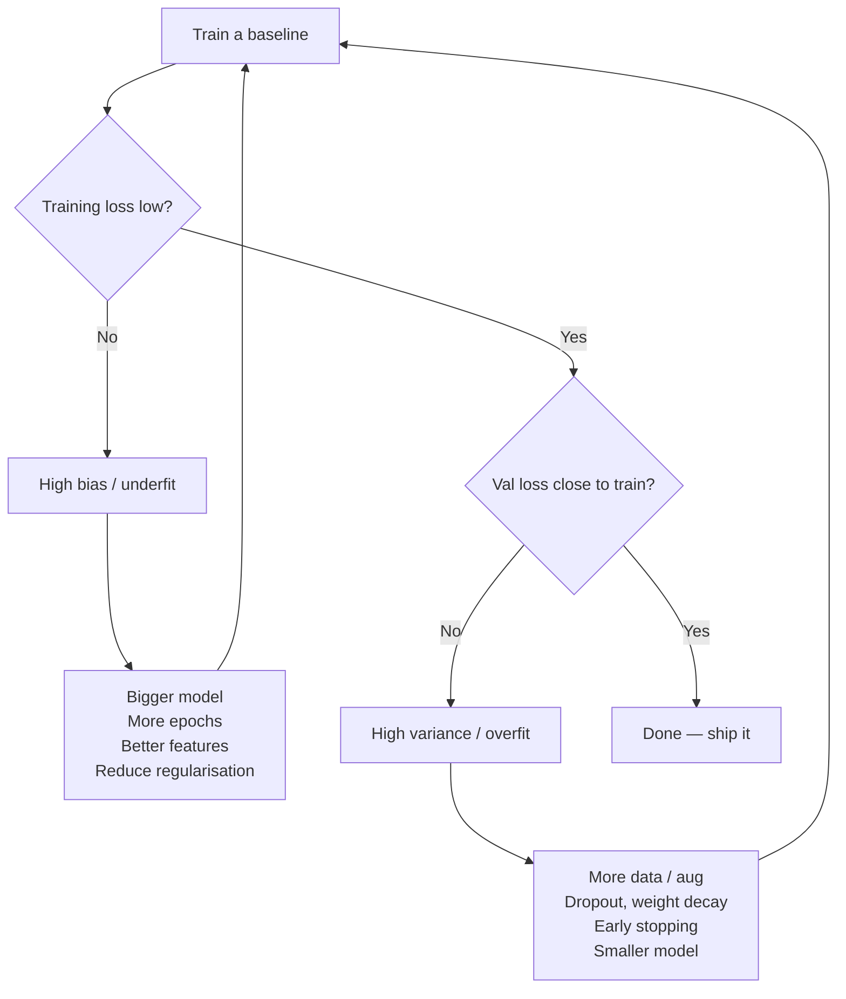

# Ch.18 — Hyperparameter Tuning

> **Running theme:** You have all the pieces — a neural network (Ch.4), backprop and optimisers (Ch.5), regularisation (Ch.6), and loss functions (Ch.15). Now you have to *pick numbers*. This chapter is the decision guide: which dial, what it does, which direction to turn it, and in what order.

---

## 1 · Core Idea

A model's **parameters** ($W, b$) are learned from data.
A model's **hyperparameters** are chosen *before* training starts and define **how** learning happens.

Tune them in this rough order — cheapest + highest-leverage first:

```
learning rate → batch size → optimiser → initialiser
    → architecture (layers, units, layer type)
    → regularisation (dropout, weight decay, early stopping)
    → loss choice → more data
```

Every dial trades off at least two of: **final accuracy**, **training time**, **memory**, **generalisation gap**.

---

## 2 · Running Example

Same California Housing network from Ch.4 / Ch.5:

```
8 inputs → [128 ReLU] → [64 ReLU] → 1 output (linear)
Loss: MSE
```

We'll tune each dial in isolation and watch the effect on **training curves**, **test R²**, and **wall-clock time**.

---

## 3 · The Dials

Jump to a dial:

1. [Learning rate](#31--learning-rate-)
2. [Optimiser](#32--optimiser)
3. [Batch size](#33--batch-size)
4. [Weight initialiser](#34--weight-initialiser)
5. [Dropout](#35--dropout-rate-p)
6. [Loss / cost function](#36--loss--cost-function)
7. [Layer type](#37--layer-type)
8. [Depth — number of layers](#38--depth--number-of-layers)
9. [Width — units per layer](#39--width--units-per-layer)
10. [When to get more data](#310--when-to-get-more-data)
11. [Other dials to know](#311--other-dials-worth-knowing)

---

### 3.1 · Learning rate ($\eta$)

The single most impactful knob. Sets the step size of every optimiser update:

$$\mathbf{W}_{t+1} = \mathbf{W}_t - \eta \, g_t$$

| Setting | What you see | Fix |
|---|---|---|
| Too low (e.g. 1e-6) | Loss crawls; 1000s of epochs | Raise 10× at a time |
| Sweet spot | Loss drops smoothly then plateaus | — |
| Too high (e.g. 1e-1) | Loss spikes / diverges / NaN | Lower 10×; add warmup |

**Starting values (rule of thumb):**

| Optimiser | Good default |
|---|---|
| SGD | 1e-2 |
| SGD + Momentum | 1e-2 with $\mu=0.9$ |
| Adam / AdamW | **1e-3** |
| Transformers | 1e-4 with linear warmup |

**How to find it:** LR-range test — start at 1e-7, multiply by 1.1 every step, plot loss vs log(η). Pick one order of magnitude below the minimum.

**Schedule it:** Constant → Step decay → Cosine annealing → Warmup+decay. A schedule usually buys you 1–3 extra points of test accuracy at zero cost.

**Effect on:** ↑ accuracy · ↓ training time · no memory cost.

---

### 3.2 · Optimiser

| Optimiser | Update rule (conceptual) | When to use |
|---|---|---|
| **SGD** | $W \mathrel{-}= \eta g$ | small models; best final generalisation |
| **SGD + Momentum** | accumulates velocity $\mu p + g$ | default for CNN / vision |
| **RMSProp** | scales by $\sqrt{\mathbb{E}[g^2]}$ | RNNs, non-stationary gradients |
| **Adam** | momentum **and** per-param scale | default for everything else |
| **AdamW** | Adam with **decoupled** weight decay | transformers, modern training |
| **LAMB / LARS** | Adam with per-layer LR | very large batch training |

**Rule:** default to **AdamW**. Once training is stable, try SGD+momentum — it often generalises better.

**Effect on:** ↑ convergence speed · slight memory cost (Adam stores $m, v$ → ~3× param memory).

See [Ch.5 · Backprop & Optimisers](../ch05-backprop-optimisers/README.md) for the math.

---

### 3.3 · Batch size

Number of samples per gradient step. Controls the **signal-to-noise ratio** of each gradient:

$$\text{grad noise} \propto \frac{1}{\sqrt{B}}$$

| Size | Pros | Cons |
|---|---|---|
| 1 (online SGD) | maximal noise → escapes saddle points | very slow; can't use vector hardware |
| 8–32 | still noisy, good generalisation | slow per epoch |
| **64–256** | **sweet spot** for most problems | — |
| 1024+ | fast epochs on GPU | smooth gradient → sharp minima → worse test acc |

**Linear scaling rule:** if you increase batch size by $k$, increase learning rate by $k$ (until it breaks).

**Effect on:** ↑ step time · ↓ gradient noise · ↑ memory (linear in B) · can ↑ generalisation gap.

---

### 3.4 · Weight initialiser

**Symmetry-breaking matters.** If all weights start at the same value, all neurons in a layer compute the same thing forever. Break the symmetry with small random values — but not too small (vanishing activations) or too large (exploding activations).

| Initialiser | Formula | Use with |
|---|---|---|
| **Zeros** | $W = 0$ | ❌ never for hidden layers |
| **Small random** $\mathcal{N}(0, 0.01)$ | fixed-variance | toy models only |
| **Xavier / Glorot** | $\sigma = \sqrt{\frac{2}{n_\text{in}+n_\text{out}}}$ | tanh, sigmoid |
| **He / Kaiming** | $\sigma = \sqrt{\frac{2}{n_\text{in}}}$ | **ReLU, Leaky ReLU (default)** |
| **Orthogonal** | orthogonal matrix | RNNs |

**Bias init:** zero is fine. For ReLU with dead-neuron problems, a small positive bias (0.01) can help.

**Effect on:** training stability · convergence speed · no accuracy ceiling if your optimiser is good — but a bad init can make training fail to start.

---

### 3.5 · Dropout rate ($p$)

Randomly zero a fraction $p$ of activations during training. Forces redundancy — no single neuron can be the feature detector.

| $p$ | Effect |
|---|---|
| 0.0 | no regularisation |
| 0.1–0.2 | light — for input layers |
| **0.3–0.5** | **standard — for hidden FC layers** |
| > 0.6 | over-regularises; both train and test loss stay high |
| at output | ❌ **never** — corrupts predictions |

**Test time:** dropout is **turned off**; weights are not scaled because the standard implementation (*inverted dropout*) pre-scales activations by $1/(1-p)$ during training.

**Dropout is a train-time-only augmentation of the computation graph.**

**Effect on:** ↓ overfitting · ↑ train error (that's expected) · ~0 memory · slight ↑ training time.

See [Ch.6 · Regularisation](../ch06-regularisation/README.md).

---

### 3.6 · Loss / cost function

The loss defines **what "good" means** — you don't really "tune" it, you **choose** it based on the target:

| Target | Loss | Activation on last layer |
|---|---|---|
| continuous, Gaussian noise | **MSE** | linear |
| continuous, outlier-heavy | **MAE** / **Huber** | linear |
| binary | **Binary cross-entropy** | sigmoid |
| multi-class (exclusive) | **Categorical cross-entropy** | softmax |
| multi-label (independent) | **Binary cross-entropy per class** | sigmoid per class |
| ordered classes | **ordinal / MSE on rank** | linear |
| survival / time-to-event | **Cox partial likelihood** | linear |
| contrastive / retrieval | **Triplet / InfoNCE** | L2-normalised embedding |

**Tunable pieces inside the loss:**

- **Class weights** (imbalanced data): weight minority class losses higher.
- **Label smoothing** ($\varepsilon \approx 0.1$): softens one-hot targets, reduces overconfidence.
- **Focal loss $\gamma$**: down-weights easy examples (object detection).
- **Regularisation term $\lambda$** (L1 / L2 / weight decay): shrinks weights.

**Trap:** MSE for classification. Gradients vanish near 0/1 because the sigmoid derivative is tiny there; cross-entropy cancels that term exactly. See [Ch.15 · MLE & Loss Functions](../ch15-mle-loss-functions/README.md).

**Effect on:** the loss is what the optimiser sees — pick it to match the noise model of your data.

---

### 3.7 · Layer type

The layer is the **structural prior** you bake into the model — choose it to match the *structure of your data*.

| Layer | Use when | Dial |
|---|---|---|
| **Dense / Fully Connected** | tabular; final classifier head | # units |
| **Conv1D / Conv2D / Conv3D** | local spatial / temporal patterns (images, audio, volumes) | # filters, kernel size, stride |
| **RNN / LSTM / GRU** | short-to-medium sequences, streaming | # units, # layers |
| **Self-Attention / Transformer block** | long-range dependencies, tokens | $d_\text{model}$, # heads |
| **Embedding** | categorical / token IDs | embed dim |
| **BatchNorm** | stabilise deep networks | momentum |
| **LayerNorm** | transformers, RNNs | — |
| **Dropout** | regularise FC / attention | $p$ |
| **Residual / Skip connection** | ≥ 10 layers deep | — |

**Rule:** the layer carries the inductive bias. Picking Conv for images is worth more than any hyperparameter sweep on a Dense net.

**Effect on:** sample efficiency, parameter count, what the model *can* represent.

---

### 3.8 · Depth — number of layers

| Depth | Behaviour |
|---|---|
| 1–2 | fast to train; risks underfitting complex signals |
| 3–6 | sweet spot for most tabular / small vision problems |
| 10+ | needs residual connections + BatchNorm/LayerNorm, or training diverges (vanishing / exploding gradients) |
| 50+ | essentially requires ResNet-style skip connections and careful init |

**Depth buys composition** — deeper networks can represent hierarchical features (edges → textures → parts → objects). But each extra layer multiplies training time and memory.

**Rule of thumb:** start at 2–3 hidden layers. Add layers only when the *training* loss is still too high (= underfitting). If training loss is low but validation loss is high, the problem is overfitting — add regularisation, not depth.

**Effect on:** ↑ capacity · ↑ training time · ↑ memory · ↑ vanishing-gradient risk.

---

### 3.9 · Width — units per layer

Hidden-unit count per layer. Often matters as much as depth.

| Width | Behaviour |
|---|---|
| Too narrow | underfits — *bottleneck* layers lose information |
| Just right | each layer has just-enough capacity to pass the signal forward |
| Too wide | memorises training data; slower; larger memory |

**Rule:** use widths in powers of 2 (32, 64, 128, 256) — hardware-friendly. A common pattern is *widening then narrowing* towards the output (`128 → 64 → 32 → 1`), giving the model room to build representations then compress them to the target.

**Width × depth** determines total parameter count ≈ $\text{depth} \times \text{width}^2$.

**Effect on:** capacity, memory, throughput — quadratic in width for FC layers.

---

### 3.10 · When to get more data

More data is the strongest regulariser we have — but it's expensive. Before collecting more, **plot learning curves**: train & val loss vs training-set size.

| Pattern | Diagnosis | Action |
|---|---|---|
| **Big gap, val still decreasing** | high variance (overfitting) | **get more data** — or add regularisation / dropout / data augmentation |
| **Small gap, both losses high and flat** | high bias (underfitting) | more data **won't help** — use a bigger model / better features / train longer |
| **Small gap, both losses low** | you are done | ship it |

**Cheaper substitutes for "more data":**

- **Data augmentation** (images: flip, crop, colour jitter; text: back-translation; tabular: SMOTE for minority classes).
- **Transfer learning** — use a model pretrained on a larger corpus.
- **Self / semi-supervised pretraining** on unlabelled data.
- **Synthetic data** from a simulator.

**Rule:** halve your dataset and re-train. If val loss gets noticeably worse → you are data-limited, collecting more helps. If val loss barely moves → more data won't help; fix bias.

**Effect on:** ↓ variance (single biggest lever on test accuracy).

---

### 3.11 · Other dials worth knowing

| Dial | What it controls | Typical value |
|---|---|---|
| **# epochs** | how long to train | until val loss plateaus → use **early stopping** with patience 5–20 |
| **Early stopping patience** | epochs without val improvement before halting | 10 |
| **Weight decay / L2 ($\lambda$)** | shrinks all weights each step | 1e-4 (AdamW), 5e-4 (SGD) |
| **Gradient clipping** | caps $\|\nabla\|$ to prevent explosion | clip-norm 1.0–5.0 (RNNs, transformers) |
| **Momentum $\mu$** (SGD) | how much past velocity carries | 0.9 |
| **Adam $\beta_1, \beta_2$** | smoothing of 1st / 2nd moment | 0.9, 0.999 — rarely touched |
| **LR warmup steps** | linearly raise η for first $w$ steps | 5–10% of total steps |
| **LR schedule** | how η changes over training | cosine / step decay |
| **Label smoothing $\varepsilon$** | softens one-hot targets | 0.1 |
| **Activation function** | non-linearity per layer | **ReLU** default; GELU / SiLU for transformers |
| **BatchNorm momentum** | moving-average rate for running stats | 0.1 (PyTorch) / 0.99 (Keras — inverted convention) |
| **Dropout location** | which layers get dropout | after FC / attention, **not** after output |
| **Input normalisation** | scale input features | zero-mean, unit-variance — essentially mandatory |
| **Random seed** | reproducibility | set it for every run |

---

## 4 · Step by Step — a tuning recipe

1. **Get a baseline that runs.** Default architecture, AdamW(1e-3), batch 64, no dropout, small model. Make sure loss decreases at all.
2. **Find the right learning rate.** LR-range test (10⁻⁷ → 1). Pick one order of magnitude below divergence.
3. **Set the batch size.** Biggest that fits memory up to 256. If you go bigger, scale LR linearly.
4. **Check capacity.** Is training loss low? If no → go wider / deeper. If yes but validation is bad → move on to regularisation.
5. **Add regularisation.** Weight decay (1e-4) + dropout (0.3) + early stopping (patience 10). Re-run.
6. **Try a schedule.** Cosine annealing or step decay. Usually gives a free +1–2% test accuracy.
7. **Data audit.** Plot learning curves vs dataset size (§3.10). Decide: more data, augmentation, or bigger model.
8. **Only now** sweep architecture choices — layer type, exact widths, depth — with a proper search strategy (below).

---

## 5 · Key Diagrams

### 5.1 · The hyperparameter cheat-sheet


### 5.2 · Bias / variance decision tree



### 5.3 · Search strategy

```
Grid search       →  tries every combination
                     ❌ wastes budget on unimportant dials

Random search     →  samples (η, dropout, ...) independently
                     ✅ 5–10× more efficient than grid in high dims

Bayesian / TPE    →  models P(loss | hyperparams) and proposes promising ones
                     ✅ fewest trials, needed for expensive training runs
                     (Optuna, Hyperopt, Vizier)

Population-based  →  evolve hyperparams during training
                     ✅ best for huge-scale training
```

---

## 6 · The Hyperparameter Dial (meta)

| Dial | Sensitivity | First-pass value | How to tune |
|---|---|---|---|
| Learning rate η | **very high** | 1e-3 (Adam), 1e-2 (SGD) | LR-range test + schedule |
| Optimiser | medium | AdamW | swap to SGD+momentum for final runs |
| Batch size | medium | 64–256 | largest that fits memory |
| Initialiser | low | He (ReLU), Xavier (tanh) | set once and forget |
| Dropout p | medium | 0.3 on FC layers | grid over {0, 0.1, 0.3, 0.5} |
| Weight decay λ | medium | 1e-4 | log-uniform [1e-5, 1e-2] |
| Depth | high | 2–4 hidden layers | increase only if training loss is stuck |
| Width | high | 64–256 units | powers of 2 |
| Loss | — | chosen by target type | don't tune, choose |
| # epochs | — | early stopping, patience 10 | always early-stop |

---

## 7 · Code Skeleton — random search with Optuna

```python
import optuna
import numpy as np
from sklearn.datasets import fetch_california_housing
from sklearn.model_selection import train_test_split
from sklearn.preprocessing import StandardScaler
from sklearn.neural_network import MLPRegressor
from sklearn.metrics import r2_score

housing = fetch_california_housing()
X, y = housing.data, housing.target
X_tr, X_te, y_tr, y_te = train_test_split(X, y, test_size=0.2, random_state=42)
X_tr = StandardScaler().fit_transform(X_tr)
X_te = StandardScaler().fit(X_tr).transform(X_te)

def objective(trial):
    lr      = trial.suggest_float("lr", 1e-5, 1e-1, log=True)
    solver  = trial.suggest_categorical("solver", ["adam", "sgd"])
    width   = trial.suggest_categorical("width", [32, 64, 128, 256])
    depth   = trial.suggest_int("depth", 1, 5)
    dropout = trial.suggest_float("alpha", 1e-6, 1e-2, log=True)  # L2 in sklearn
    bs      = trial.suggest_categorical("batch_size", [32, 64, 128, 256])

    model = MLPRegressor(
        hidden_layer_sizes=tuple([width] * depth),
        activation="relu",
        solver=solver,
        learning_rate_init=lr,
        alpha=dropout,            # sklearn's L2 penalty
        batch_size=bs,
        early_stopping=True,
        n_iter_no_change=10,
        max_iter=200,
        random_state=42,
    )
    model.fit(X_tr, y_tr)
    return r2_score(y_te, model.predict(X_te))

study = optuna.create_study(direction="maximize")
study.optimize(objective, n_trials=40, show_progress_bar=True)

print("best R²:", study.best_value)
print("best params:", study.best_params)
```

---

## 8 · What Can Go Wrong

- **Tuning on the test set.** Every hyperparameter you select by looking at test scores leaks information — the test score becomes optimistically biased. Always tune on a separate **validation** set (or cross-validation).
- **Changing multiple dials at once.** You can't attribute the improvement. Change one, re-run, compare, repeat.
- **Ignoring seed variance.** Two runs with the same hyperparameters can differ by 1–2% purely due to random init + batch shuffle. Report mean ± std over 3+ seeds before declaring a winner.
- **Over-fitting the validation set.** If you run 1000 trials of random search, some will look good on validation by chance. Hold out a final test set and touch it *once*.
- **Wrong loss for the task.** MSE on classification, categorical-CE with a sigmoid output, imbalanced data with unweighted CE — these are silent bugs that tuning can't fix.
- **Tuning depth/width before learning rate.** 90% of "this architecture doesn't work" is actually a bad learning rate.

---

## 9 · Interview Checklist

| Must know | Likely asked | Trap to avoid |
|---|---|---|
| Difference between a parameter and a hyperparameter | "What hyperparameters would you tune first?" | Naming regularisation strength $\lambda$ as a parameter |
| Why learning rate is the single most important dial | "How do you pick a learning rate?" | Saying "I use whatever the paper uses" — run an LR-range test |
| How batch size trades off noise vs speed vs generalisation | "Why does large batch hurt test accuracy?" | Claiming large batch is always faster — yes per epoch, but fewer updates and sharper minima |
| Why you should initialise with He (ReLU) or Xavier (tanh) | "Can you initialise a deep net with all zeros?" | No — every neuron becomes identical; no learning |
| Dropout is train-only; turned off at inference | "What does dropout do at test time?" | Saying "it zeros activations" at test — it does **not** |
| Loss choice must match the target's noise model | "Why not use MSE for classification?" | Saying "because the outputs aren't continuous" — the real reason is vanishing gradients of MSE+sigmoid |
| When more data will vs won't help | "You have 10k more labels in budget — should you buy them?" | Always saying yes — it only helps in the high-variance regime |
| Random search > grid search in high dimensions | "How would you tune 8 hyperparameters efficiently?" | Grid over all of them — exponential cost |
| Early stopping + weight decay are the default regularisers | "You are overfitting — what's your first move?" | Jumping to dropout before looking at epochs / weight decay |
| AdamW ≠ Adam + L2 | "Why AdamW?" | Conflating them — see Ch.5 Interview Checklist |

---

## Bridge to Chapter 19

You now know which dials exist, what each one does, and roughly where to set them. This closes the loop on the ML-from-scratch track: model → loss → optimiser → regularisation → tuning.

The next tracks (`notes/AI/`, `notes/MultiAgentAI/`, `notes/MultimodalAI/`) build on top of this foundation — the same hyperparameters reappear when you train LLMs, fine-tune diffusion models, or train RL agents, just at larger scale and with extra dials (sequence length, KV-cache, adapter rank, RLHF reward weighting). The checklist above transfers directly.

---

## Illustrations


